# Mario Party 4: native port to the Power Mac G4

Third in the line after Snowboard Kids 1 and 2. Same shape as those two ports:
the decompiled game sources are never edited, a `port/` directory replaces the
console SDK, a host loop plays the part of the interrupt controller, and a
self-play harness proves the thing works by beating the game.

Everything below is measured from the decomp at `/Users/zachjack/Apps/marioparty4`
(mariopartyrd/marioparty4, `main` at `147b165a`, USA Rev 1 = `GMPE01_01`, 100%
matching). Numbers come from `port/tools/inventory.py`; its output is committed
as [`port/docs/inventory.md`](inventory.md) and can be regenerated at any time
with `python3 port/tools/inventory.py`.

Target: **Power Mac G4 Quicksilver 1 GHz, ATI Radeon 9000, Mac OS X 10.5.**
OpenGL 1.3, 6 texture units, `ARB_texture_env_combine` + `ATI_texture_env_combine3`
+ crossbar, `ARB_multisample`, `EXT_fog_coord`, `ATI_text_fragment_shader`.
No `ARB_fragment_program`, no FBO, no NPOT. 32-bit PowerPC 7450: AltiVec, and
crucially **no paired singles**. Built with `ghcr.io/variantxyz/gcc-powerpc-apple-darwin8`
(GCC 14.2 + MacOSX10.4u SDK) against a Tiger-targeted static SDL2.

---

## 0. The one-paragraph version

Mario Party 4 turns out to be a much friendlier port target than either
Snowboard Kids. It is **single-threaded** (one `OSCreateThread` in the entire
game, and it is the soft-reset watcher), it uses **zero paired-single
intrinsics in game code** (all 1,063 of them live in the SDK's MTX/THP/OS,
which we replace or switch to the pure-C path that is already in the tree), it
addresses main memory with **native pointers and ARAM with plain offsets** so
there is no fixed-address RDRAM to emulate and **no pinned-globals scheme** is
needed, and its GX usage is far simpler than the hardware allows: 93 of 121
`GXSetNumTevStages` sites ask for **one** stage, the highest TEV stage the game
ever names is `GX_TEVSTAGE4`, and it never uses per-vertex matrix indices. The
whole thing plausibly fits the Radeon 9000's six fixed-function texture units in
one pass for the overwhelming majority of draws. The hard parts are elsewhere:
**99 relocatable modules** with 899 colliding symbol names between them (solved
with one Mach-O bundle per REL behind `dlopen`, which maps 1:1 onto the game's
own `OSLink`/`OSUnlink` loader), **MusyX audio** whose mixing actually happens
on the DSP (so we need a DSP-command-list interpreter or a CPU synth), and
**THP movies**. Estimated ordering below.

---

## 0. Working method *(standing, 2026-09-16)*

The port runs at a fraction of console speed, so time on the G4 is the
scarcest thing in the project. These rules apply to every session from M10 on.

1. **No debugging at game speed.** Every bug gets a reproduction under five
   minutes before anyone investigates it: a snapshot from the ring
   (`--snap-every`), or `--ffto N` to the frame. If it cannot be reproduced
   that way, making it reproducible is the first task, not chasing it.
2. **A library of teleport points.** Named snapshots at the title, character
   select, the board, and the entry of every minigame, kept on the G4 under
   `~/MarioParty4/snaps/lib/`. Any screen in seconds. Build it as soon as
   restore is byte-exact; the audit and the speed work both depend on it.
3. **Speed is measured, never felt.** Every speed change is an A/B on the
   three fixed scenes (§21.1: frames 800/3000/7000, md5s
   45da1034… / d77db3b6… / 3488c83d…), same binary, old path behind a flag.
   Order comes from the profile: phase 2 (transform, lighting, texgen) first,
   per-draw overhead second.
4. **The G4's day is budgeted.** Soaks overnight only. Daytime is short
   reproductions and A/B runs. One job at a time; `g4 stop` then `ps`.
5. **Every finding gets a snapshot.** A bug an agent is not fixing gets its
   snapshot saved and named in the plan, so the next agent starts at the
   moment, not at the title.

**Levers, in the order to pull them** (2026-09-16 evening):

* **Vertex programs.** `g4-glinfo.log` lists `GL_ARB_vertex_program`,
  `GL_ARB_vertex_buffer_object` and `GL_APPLE_vertex_array_range`. Phase 2
  (transform, CPU lighting, texgen -- ~70% of the frame) maps onto an ARB
  vertex program almost directly; the CPU then only decodes. Do this BEFORE
  any CPU rewrite of phase 2: no point optimising a stage that can be
  deleted. Same A/B discipline (§0 rule 3); the three md5s may legitimately
  differ by rounding -- if so, audit the diff and re-base with a written
  justification, never silently.
* **A second bench -- measured 2026-09-16, and it is slower.** The
  "2009" MacBook Pro is an Early 2011 13" (MacBookPro8,1, i5-2415M 2.3 GHz,
  Intel HD 3000) on Snow Leopard 10.6.6 with Rosetta and Xcode 3.2 (gdb).
  ssh alias `mbp`; launch with `open -a ~/MarioParty4.app --args ... --log`
  (a plain ssh exec has no WindowServer, so no GL context). The Tiger-built
  SDL found no displays on 10.6 (panther-sdl2 698f00c fixes it; rebuilt
  dylib is in the bundle). It runs the exact PPC bundle and renders the
  title correctly (md5s differ from the Radeon's, as expected across GPUs:
  800 `70f820cd…`, 3000 `f4c19e9f…`, 7000 `85a59b7c…`; compare by eye or
  against Dolphin, not against the G4's md5s).

  | measure | G4 | MacBook (Rosetta) |
  |---|---:|---:|
  | menus | 25-31 fps | 45 |
  | character select | 14.3 fps | 9.4 |
  | board | 16.2 fps | 10.8 |
  | `--ffto 3000` (no draw) | 10.1 s | 19.9 s |
  | `--ffto 7000` (no draw) | 41.4 s | 64.3 s |

  Rosetta runs the game's own code at about half the G4's speed, and its
  GL calls cross the translator into the Intel driver, so the 3D scenes are
  slower too. What it is for: a second, independent machine (soaks and
  reproductions in parallel with G4 work), Xcode's gdb and the Intel driver
  with real fragment programs as a second opinion. It is not a faster
  bench and nothing about frame rate may be judged on it.
* **No-draw soaks.** With `--ffto`/`--nodraw` a soak covers a board in an
  hour or two; run those overnight, several boards, every minigame, for
  logic bugs, stalls, heap panics and crashes. Rendering bugs go to the
  audit loop instead.
* **Dolphin as the oracle.** Reference frames for all 60 minigames in an
  afternoon from the gecko input schedules; comparison is then a diff.

## 1. Inventory of the game

### 1.1 Shape and size

| area | files (.c/.h) | lines |
|---|---:|---:|
| `src/game` (DOL, engine + system) | 50 | 35,165 |
| `src/game/board` (DOL, the board game) | 60 | 68,204 |
| `src/msm` (DOL, Hudson's sound manager over MusyX) | 6 | 3,201 |
| `src/libhu` | 2 | 14 |
| `src/REL/*` (96 module directories) | 256 | 288,048 |
| `src/dolphin` (the decompiled SDK, in-tree) | 88 | 30,796 |
| `extern/musyx` (AxioDL MusyX, MIT) | 35 | 21,015 |
| `src/{MSL_C,Runtime,TRK_MINNOW_DOLPHIN,OdemuExi2,amcstubs,odenotstub}` | 78 | 11,616 |
| **total** | **575** | **458,059** |

`build/GMPE01_01/main.dol` is 1,319,008 bytes. `orig/GMPE01_01/files/dll/`
holds **99 `.rel` files**, the smallest 572 bytes (`_minigameDll.rel`, a pure
stub) and `E3setupDLL.rel` 36,376 bytes.

**The SDK is in the repo.** `src/dolphin/` contains decompiled `os/`, `gx/`,
`dvd/`, `card/`, `pad/`, `si/`, `exi/`, `ai.c`, `dsp/`, `ar/`, `mtx/`, `vi.c`,
`thp/`, `demo/`, `db.c`, `PPCArch.c` — 88 files, 30,796 lines. `configure.py`
compiles these from source into the matching DOL rather than linking library
objects off the disc, which means **the port has the real source of every SDK
function it needs to replace**, and can compile the pure-software parts as-is.

### 1.2 What the DOL contains

`src/game/main.c`'s `main()` is the whole program:

```
HuSysInit(&GXNtsc480IntDf)   OSInit / DVDInit / VIInit / PADInit, render mode,
                             arena + heap, GXInit on a 1 MB FIFO, HuMemInitAll,
                             HuAudInit, HuARInit, OSInitFastCast, HuCardInit
HuPrcInit / HuPadInit / GWInit / pfInit / HuSprInit / Hu3DInit / HuDataInit
omMasterInit(0, _ovltbl, DLL_MAX, DLL_bootdll)     -> hand off to bootDll
while (1) { ... }                                  -> the frame loop
```

The DOL is the *engine*: the HSF model/animation system (`hsfdraw.c` 3,213
lines, `hsfanim.c`, `hsfman.c`, `hsfmotion.c`, `hsfload.c`, `hsfex.c`), sprites
(`sprman.c`, `sprput.c`, `esprite.c`), the process scheduler (`process.c`), the
object manager (`objmain.c`, `objsub.c`, `objsysobj.c`, `objdll.c`), memory
(`malloc.c`, `memory.c`, `armem.c`), data/DVD (`data.c`, `dvd.c`, `decode.c`),
audio glue (`audio.c` + `src/msm/*`), font/window/message
(`font.c`, `window.c`, `messdata.c`, `printfunc.c`), saves (`card.c`,
`saveload.c`), input (`pad.c`), movies (`thpmain.c`, `THPDraw.c`, `THPSimple.c`),
fault/reset (`fault.c`, `sreset.c`), and — unusually — **the entire board game**
(`src/game/board/`, 60 files, 68,204 lines: spaces, items, stars, Bowser, Boo,
the shop, the lottery, battle, Last 5 Turns, the CPU path-finder in
`com.c`/`com_path.c`). The board is *not* a REL.

### 1.3 What the RELs contain

99 modules on the disc; `include/ovl_table.h` lists 100 `DLL()` entries per
version (`DLL_MAX`), turned into a `FileListEntry _ovltbl[]` of
`{"dll/<name>.rel", 0}` by `src/game/ovllist.c`. Groups:

| group | modules | what |
|---|---|---|
| boot / setup | `bootDll`, `instDll`, `E3setupDLL`, `msetupDll`, `safDll` | logos, the instruction/attract loop, the E3 demo build's setup, the "save file" boot path |
| boards | `w01Dll` … `w06Dll` (Toad's Midway Madness → Bowser's Gnarly Party), `w10Dll`, `w20Dll`, `w21Dll` | one module per board plus three extras (`w10` is the Extra-room board, `w20`/`w21` the tutorial/practice boards) |
| minigames | `m300Dll`, `m302`, `m303`, `m330`, `m333`, `m401Dll` … `m463Dll` (with `_minigameDll` as the shared stub) | ~65 modules, one per minigame or minigame family |
| story | `mstoryDll`, `mstory2Dll`, `mstory3Dll`, `mstory4Dll`, `nisDll` | Story Mode's flow and cut-scenes |
| menus / front end | `mentDll`, `modeseldll`, `mgmodedll`, `selmenuDll`, `subchrselDll`, `option`, `present`, `messDll`, `mpexDll`, `resultDll`, `staffDll`, `modeltestDll`, `ztardll` | the entrance, mode select, the Minigame mode shell, character select, options, the Present/Extra room, results, credits, a model viewer, the Star Bank |

Four modules (`m302Dll`, `m303Dll`, `m330Dll`, `m333Dll`) share the same SHA-1
as each other in `config.yml` — they are identical placeholder RELs.

The largest are `mgmodedll` (8,107 lines), `m450Dll` (7,739), `mpexDll` (7,715),
`mentDll` (7,606), `m427Dll` (6,535).

**Only three modules link against another module**: three `mstory*` entries in
`config/GMPE01_01/config.yml` declare `links: [_minigameDll]`. Every other REL
imports only from the DOL. That is a nearly-flat dependency graph.

### 1.4 How RELs are loaded

`src/game/objdll.c`, 176 lines, is the entire loader:

```c
dll->module = HuDvdDataReadDirect(dllFile->name, HEAP_HEAP);   // read the .rel
dll->bss    = HuMemDirectMalloc(HEAP_HEAP, dll->module->bssSize);
if (OSLink(&dll->module->info, dll->bss) != TRUE) { ... }      // relocate
dll->ret = ((DLLProlog)dll->module->prolog)();                 // enter
```

and on the way out `((DLLEpilog)dll->module->epilog)()` then `OSUnlink()` then
three `HuMemDirectFree`s. `omDLLStart(overlay, flag)` with `flag == 0` will
*re-enter an already-loaded module*: it `memset`s the module's bss to zero,
`HuMemDCFlushAll()`s, and calls the prolog again. So the loader's contract is:

1. resolve a name to a relocatable image,
2. give it a fresh, zeroed bss,
3. call `_prolog`, later `_epilog`,
4. unload it and reclaim the memory,
5. and be able to re-enter a module that stayed resident, with bss re-zeroed.

There are at most `OM_DLL_MAX` modules live at once. This contract matters a
great deal in §2.4.

### 1.5 Memory map

- **MEM1**: 24 MB retail (`OSGetConsoleSimulatedMemSize()` = 0x01800000). The
  game asks for `OSGetPhysicalMemSize()` and `OSGetConsoleType()` and only takes
  the "more than 24 MB" development path (`LoadMemInfo`, which reads
  `/meminfo.bin` off the disc) when it is running on `OS_CONSOLE_DEVHW1`. On
  retail it just makes one heap from `OSInitAlloc(arena_lo, arena_hi, 1)` +
  `OSCreateHeap`.
- **Two external framebuffers** are carved off `arena_lo` first
  (`InitMem()` in `init.c`): `fbWidth` rounded to 16, times `xfbHeight`, times
  2 bytes — 640×480×2 = 614,400 bytes each for NTSC.
- **GX FIFO**: a single 1 MB buffer, `OSAlloc(0x100000)` then
  `GXInit(DefaultFifo, 0x100000)`.
- **Game heaps** sit on top, in `src/game/memory.c` / `malloc.c`: named ids
  (`HEAP_HEAP`, `HEAP_DVD`, `HEAP_SOUND`, `HEAP_MUSIC`, …), each a `HuMemHeap`
  with 32-byte-aligned allocations tagged with the caller's return address
  (`mflr` inline asm in `HuMemDirectMalloc`). The MusyX heap is a fixed
  `0x13FC00` = 1,309,696 bytes.
- **ARAM**: 16 MB. `src/game/armem.c` runs a 64-block first-fit allocator over
  ARAM *above* `HU_AMEM_BASE = 0x808000` (8,421,376), leaving everything below
  it to MusyX (`msmAram.aramEnd = HU_AMEM_BASE`, `skipARInit = TRUE`). So MusyX
  owns ~8.03 MB of sample data and the game gets ~8.39 MB for streamed model,
  texture and animation data, moved in and out with `ARQPostRequest` DMA.
  **ARAM is addressed by `AMEM_PTR`, a `u32` offset — never by pointer.** That
  is what makes ARAM trivial to host: one 16 MB `malloc`, index by offset,
  `memcpy` for DMA.

### 1.6 The frame loop

`src/game/main.c`:

```c
while (1) {
    retrace = VIGetRetraceCount();
    if (HuSoftResetButtonCheck() || HuDvdErrWait) continue;
    HuSysBeforeRender();            /* GXSetViewport(Jitter), GXInvalidateVtxCache,
                                       GXInvalidateTexAll */
    GXSetGPMetric(...); GXClearGPMetric(); ...  /* performance counters */
    Hu3DPreProc();
    HuPadRead();
    pfClsScr();
    HuPrcCall(1);                   /* run every HUPROCESS for one tick */
    MGSeqMain();
    Hu3DExec();                     /* the actual drawing */
    HuDvdErrorWatch();
    WipeExecAlways();
    pfDrawFonts();
    msmMusFdoutEnd();
    HuSysDoneRender(retrace);
    GXReadGPMetric(...); GXReadVCacheMetric(...); GXReadPixMetric(...); GXReadMemMetric(...);
    GlobalCounter++;
}
```

and `HuSysDoneRender` (in `init.c`) is where pacing lives:

```c
GXSetZMode(GX_TRUE, GX_LEQUAL, GX_TRUE); GXSetColorUpdate(GX_TRUE);
GXDrawDone();
GXCopyDisp(DemoCurrentBuffer, GX_TRUE);
if (minimumVcount) {
    retrace_dist = VIGetRetraceCount() - retrace_count;
    if (worstVcount < retrace_dist) worstVcount = retrace_dist;
    while (VIGetRetraceCount() - retrace_count < minimumVcount - 1) VIWaitForRetrace();
}
SwapBuffers();   /* VISetNextFrameBuffer, VIFlush, VIWaitForRetrace, flip */
```

`minimumVcount` defaults to 1 and is set by `HuSysVWaitSet()` — the game's own
frame-rate governor, i.e. some scenes deliberately run at 30 Hz. The loop
blocks in `VIWaitForRetrace()` exactly twice per frame (once in the pacing
loop when it is behind, once at the end of `SwapBuffers`). **That is our idle
gate**, and it is much cleaner than the N64 ports' heuristic: we do not have to
guess when the game has finished a frame, the game tells us by calling
`VIWaitForRetrace`.

### 1.7 Threads

**One.** `grep OSCreateThread src --include='*.c'` outside `src/dolphin` returns
exactly one hit:

```
src/game/sreset.c:182: OSCreateThread(&ToeThread, ToeThreadFunc, NULL,
                                      &ToeThreadStack[4096], 4096, 8, OS_THREAD_ATTR_DETACH);
```

the soft-reset ("power/reset button") watcher. Everything else in the game runs
on the main thread. `OSSleepThread`/`OSWakeupThread`/`OSResumeThread`/
`OSYieldThread` appear once each, all in `sreset.c`. The SDK internally creates
threads for DVD and audio callbacks; those go away with the SDK.

What the game *does* have instead is its own cooperative scheduler,
`src/game/process.c` + `src/game/jmp.c`: **`HUPROCESS`, stackful coroutines
built on hand-written PowerPC `gcsetjmp`/`gclongjmp`** that save/restore
`lr, cr, sp, r2, r13-r31, f14-f31, fpscr`, with `HuPrcCreate` faking a stack by
setting `jump.lr = func` and `jump.sp = base_sp`. `HuPrcCall(1)` from the frame
loop runs each process in priority order until it calls `HuPrcSleep`/
`HuPrcVSleep`, which `gclongjmp`s back. This is *the* game logic driver.

This is both the largest hazard and the largest gift of the port. See §2.2.

### 1.8 Audio

Two layers above the SDK:

- **`src/msm/`** (6 files, 3,201 lines, 100 distinct `msm*` entry points,
  436 call sites): Hudson's own sound manager — group/bank loading from
  `/sound/mpgcsnd.msm`, sequences, SFX, 3-D emitters, and streamed audio from
  `/sound/mpgcstr.pdt`. Pure C over MusyX; **portable as-is**.
- **`extern/musyx`** (AxioDL's MusyX reimplementation, **MIT licence**, 35 files,
  21,015 lines): `snd*` API (52 symbols, 105 call sites from `src/msm`),
  the sequencer (`seq.c` 1,384), the 3-D positional model (`snd3d.c` 1,567),
  the voice/ADSR model (`synth*.c` ≈ 5,000 lines), stream handling
  (`stream.c` 884), and the hardware layer.

**The DSP question.** MusyX on GameCube does *not* mix on the CPU. The CPU runs
the sequencer, the voice state machines and the parameter math; the actual
sample fetch, ADPCM decode, resample and mix happen on the **DSP**, driven by a
command list that `hw_dspctrl.c` (2,147 lines) builds each frame and hands to
`dspSlave` — the ucode blob embedded in `dsp_import.c` (1,885 lines of hex).
`hw_dolphin.c` (212 lines) is the Dolphin SAL: `AIInitDMA`, `DSPInit`,
`ARAM` DMA. There is a `hw_pc.c` (163 lines) PC SAL in the tree but it is a
skeleton — `salCallback` has its `AIInitDMA` commented out and there is no
software synth behind it.

So the port must supply one of:

1. **A CPU implementation of the `dspSlave` command set.** The command list is
   MusyX's own, fully visible in `hw_dspctrl.c` (studios, voices with
   ADPCM/PCM8/PCM16 sources, per-voice volume ramps into up to 8 studio
   buses, the AUX A/B send/return points that `snd_service.c` and the
   `StdReverb`/`CheapReverb`/`Chorus`/`Delay` directories already implement on
   the CPU). This is the direct analogue of the N64 ports' `audio_task.c`
   `aspMain` interpreter and is the recommended route: it reuses everything
   MusyX already does on the CPU, and only replaces the leaf mixer. Estimated
   1,000–1,500 lines.
2. **A DSP ucode interpreter.** Faithful but far more work, and it needs the
   GameCube DSP ISA. Rejected.
3. **Stub audio.** What the upstream `port` branch does today: `HuAudInit` has
   `msmSysInit` commented out and every `msm*`/`snd*` call short-circuits.
   Fine for M1–M5, not shippable.

Cost note: 1 GHz G4, 32 kHz stereo, MusyX's typical 64 voices — ADPCM decode
plus a 4-tap resample plus an 8-bus mix is roughly the same budget the SBK ports
paid for `aspMain` at 22 kHz, and they spent ~0.8 ms/frame. AltiVec is available
if it is tight. Not a blocker.

### 1.9 The file system

`DVDConvertPathToEntrynum` is called once per entry at boot by
`HuDataInit()` over `DataDirStat[]`, generated from
`include/datadir_table.h`: **138 `data/*.bin` files**, plus `dll/*.rel` (99)
and `sound/mpgcsnd.msm`, `sound/mpgcstr.pdt`, plus `sound/MPNGC02.son` /
`MPNGC16.son`. A missing file is an `OSPanic` at `data.c:65`, so the port must
present a complete FST.

Access is by entry number after boot: `HuDvdDataFastRead(entrynum)`,
`HuDvdDataFastReadAsync`, and `HuDvdDataReadDirect(path, heap)` for the RELs.
All reads are whole-file into a `HuMemDirectMalloc`'d, 32-byte-rounded buffer,
issued as `DVDReadAsync` and then spun on with `HuDvdErrorWatch()` until the
callback fires. `DVDGetDriveStatus()` drives the "no disc / cover open / wrong
disc" error screen.

`DVD` surface actually used: 12 symbols, 62 sites —
`DVDOpen`, `DVDClose`, `DVDFastOpen`, `DVDConvertPathToEntrynum`,
`DVDReadAsync`, `DVDRead`, `DVDGetDriveStatus`, `DVDInit`, plus the stream
(`DVDPrepareStreamAsync`, `DVDStopStreamAtEndAsync`, …) used by `msmstream.c`
for the ADPCM music stream.

### 1.10 Saves

`src/game/card.c` (186 lines) + `saveload.c`. `CARDInit`, a
`CARD_WORKAREA_SIZE` work buffer, `CARDProbeEx`/`CARDMount`/`CARDCheck` on both
slots, then `CARDOpen`/`CARDRead`/`CARDWrite`/`CARDCreate`/`CARDDelete`/
`CARDGetStatus`/`CARDSetStatus`/`CARDFormat`. 23 distinct `CARD*` symbols, 37
call sites — all in the DOL, none in any REL. A memory card file is a flat byte
array with a banner/icon in its status block; one host file per slot reproduces
it exactly.

### 1.11 Input

Tiny: **9 `PAD*` symbols, 18 call sites.** `PADInit`, `PADSetSpec`, `PADReset`,
`PADRecalibrate`, `PADRead`, `PADClamp`, `PADButtonDown`, `PADButtonUp`, and
`PADControlMotor` (7 sites — rumble). `src/game/pad.c` (313 lines) wraps
`PADRead` into the game's own `HuPadStatus`/`HuPadBtn*` arrays with repeat and
edge detection, and owns the rumble timers. One `SISetSamplingRate` call.

This is the smallest console interface in the whole port, and the SBK ports'
`input_sdl.c` + `input_xone.c` (the IOKit Xbox One driver) can be lifted with
only the button map changed.

### 1.12 Gekko paired singles

**Zero in game code.** `port/tools/inventory.py`'s hazard pass finds 1,063
paired-single intrinsic sites, distributed as:

| file | sites |
|---|---:|
| `src/dolphin/thp/THPDec.c` | 352 |
| `src/dolphin/mtx/mtx.c` | 253 |
| `src/dolphin/mtx/psmtx.c` | 127 |
| `src/dolphin/mtx/mtxvec.c` | 70 |
| `src/dolphin/os/OSContext.c` | 64 |
| `src/dolphin/mtx/vec.c` | 62 |
| `src/dolphin/mtx/quat.c` | 40 |
| `src/dolphin/gx/GXTransform.c` | 32 |
| `src/dolphin/os/OS.c` | 32 |
| `src/dolphin/mtx/mtx44.c` | 16 |
| `extern/musyx/.../StdReverb/reverb.c` | 8 |
| `extern/musyx/.../snd_service.c` | 6 |
| `src/dolphin/gx/GXLight.c` | 1 |

**`src/game` and `src/REL` contribute none.** Every one is inside a module we
either replace outright (OS, GX, THP) or can switch to a pure-C build (MTX).

And MTX already has the switch. `include/dolphin/mtx.h`:

```c
#define GEKKO
#ifndef GEKKO
#define MTX_USE_C
#undef MTX_USE_PS
#endif
#if (!defined(MTX_USE_PS) && !defined(MTX_USE_C))
#ifndef _DEBUG
#define MTX_USE_PS
#endif
#endif
```

so **`-DMTX_USE_C` on the command line is enough** — no header patch needed —
and every `MTXConcat`/`VECAdd`/… macro then resolves to the `C_MTX*`/`C_VEC*`
functions that are already in `src/dolphin/mtx/mtx.c`, `vec.c`, `quat.c`,
`mtx44.c`. The game side also calls `PSMTX*`/`PSVEC*` **directly** at 219 sites
(`PSMTXConcat` 67, `PSMTXRotRad` 40, `PSMTXMultVec` 21, `PSMTXReorder` 19,
`PSMTXIdentity` 17, `PSMTXInvXpose` 14, …), so the port also needs a
`port/src/os/psmtx_c.c`. Most of it is thin `PSMTX*` → `C_MTX*` forwarders, but
**two functions have no C equivalent anywhere in any SDK decompilation** and
must be written by hand: `PSMTXReorder` (19 sites) and `PSMTXROMultVecArray`
(18 sites), the reordered-matrix skinning fast paths from `psmtx.c` (§8.2).
That is about 60 lines of scalar C. 74 distinct MTX symbols are called from the
game side across **4,172 call sites**, easily the hottest SDK family after GX,
so this file is the first place to reach for AltiVec if `--perf` says so.

### 1.13 Other cross-build hazards

| hazard | game-side sites | where |
|---|---:|---|
| `asm { }` block | 5 | `src/game/jmp.c` (1 — `gcsetjmp`), `src/game/malloc.c` (4 — `mflr retaddr` for allocation tagging) |
| `asm <type> fn()` whole-function asm | 0 game-side | all in `src/dolphin`, `Runtime.PPCEABI.H`, `TRK_MINNOW_DOLPHIN` |
| `__declspec` | 2 | `src/game/hsfmotion.c` — `__declspec(weak)` on `GetObjTRXPtr` and `GetBezier` |
| `#pragma` | 6 | `#pragma dont_inline on/reset` in `m426Dll/main.c`, `m446Dll/card.c`, `m413Dll/main.c` |
| `register` storage class | ~90 game-side | harmless to GCC 14 in C, warns only |
| `OSf32tos8/16/32` fast-cast | 65 | 22 board/REL files; replace with plain casts (`OSInitFastCast` becomes a no-op) |
| `ATTRIBUTE_ALIGN` | 2 game-side | `src/game/window.c`; already a macro, redefine to `__attribute__((aligned(n)))` |
| `OSCachedToUncached` | 1 | `src/REL/m415Dll/main.c:429`; make it identity |
| absolute `0x8xxxxxxx` addresses | 2 real | `src/game/init.c:271-272`, inside the dev-hardware-only `LoadMemInfo` path. The other 30 hits are sign-bit masks. |
| `__attribute__` | 0 | — |
| GCC-style `asm volatile` | 0 | — |

That is a remarkably short list for 391,000 lines of game code. Compare the
Snowboard Kids ports, which needed a 156-line `patches.txt` and a 1,463-symbol
pinning scheme.

### 1.14 The GX call inventory

**128 distinct `GX*` symbols, 5,679 call sites from game code** (1,128 in
`src/game`, 236 in `src/game/board`, 4,315 across the RELs). The full
per-symbol table is in [`inventory.md` §3.1](inventory.md). Top of the list:

| symbol | sites | | symbol | sites |
|---|---:|---|---|---:|
| `GXSetVtxAttrFmt` | 260 | | `GXSetChanCtrl` | 140 |
| `GXSetVtxDesc` | 256 | | `GXColor1x16` | 135 |
| `GXSetTevColorIn` | 232 | | `GXSetBlendMode` | 120 |
| `GXSetTevOrder` | 212 | | `GXSetTexCoordGen2` | 118 |
| `GXPosition3f32` | 208 | | `GXSetNumTevStages` | 118 |
| `GXSetTevAlphaIn` | 201 | | `GXLoadPosMtxImm` | 117 |
| `GXPosition1x16` | 199 | | `GXClearVtxDesc` | 115 |
| `GXSetTevColorOp` | 191 | | `GXSetNumTexGens` | 114 |
| `GXSetTevAlphaOp` | 183 | | `GXTexCoord2f32` | 112 |
| `GXSetArray` | 159 | | `GXSetNumChans` | 105 |
| `GXTexCoord1x16` | 153 | | `GXLoadTexMtxImm` | 93 |
| `GXSetZMode` | 143 | | `GXSetTevColor` | 73 |
| `GXBegin` | 142 | | `GXInitTexObj` | 68 |

#### TEV complexity — the headline result

| measure | value |
|---|---|
| `GXSetNumTevStages` argument, 93 of 121 literal sites | **1** |
| … 14 sites | 2 |
| … 2 sites each | 3, 5 |
| … 8 sites | a variable (`tevStage`, `temp_r31`, a cast) — the HSF material path |
| highest `GX_TEVSTAGEn` ever named | **`GX_TEVSTAGE4`** (10 sites) — i.e. never more than 5 stages |
| `GX_TEVSTAGE0` / 1 / 2 / 3 / 4 sites | 612 / 114 / 24 / 15 / 10 |
| highest `GX_TEXMAPn` | `GX_TEXMAP3` (6 sites) — never more than 4 simultaneous textures |
| highest `GX_TEXCOORDn` | `GX_TEXCOORD4` (2 sites) |
| `GXSetNumTexGens` | 0 (35), 1 (53), 2 (12), 3 (5), 4 (2), 5 (1) |
| `GXSetNumChans` | 0 (9), 1 (93), 2 (4) |
| TEV konst select (`GXSetTevKColorSel`/`KAlphaSel`) | 17 |
| TEV swap (`GXSetTevSwapMode`/`Table`) | 28 |

**Indirect texturing is used, but narrowly.** `GXSetNumIndStages`: 0 at 15
sites, 1 at 11, 2 at 3, 3 at 1. `GXSetIndTexOrder` 22, `GXSetIndTexMtx` 21,
`GXSetIndTexCoordScale` 19, `GXSetTevIndWarp` 23, `GXSetTevInd(Tile|BumpST)` 2,
`GXSetTevDirect` 29 (turning it back off). Only `GXSetTevIndWarp` is used — the
simplest indirect mode, where an indirect texture's texel perturbs a regular
texcoord through a 2×3 matrix. There is no `GXSetTevIndirect` general form
anywhere. And `GX_VA_NBT` (binormal/tangent) appears at just 6 sites — the
bump-mapped surfaces are a handful of effects, not the art pipeline.

**Lighting**: `GXSetChanCtrl` 143, `GXInitLight*` 39 (`GXInitLightAttn` 13,
plus pos/dir/color/spot/distattn), `GXLoadLightObjImm` only 4. At most 2 colour
channels. This is per-vertex lighting with a small number of lights, which GL's
fixed-function `GL_LIGHTn` maps onto directly.

**Fog**: 9 sites total. **Z-textures**: 2. **Dither**: 0. **Dst-alpha**: 0.

**EFB copies**: `GXCopyTex` 28, `GXSetTexCopySrc`/`Dst` 66, `GXGetTexBufferSize`
22, plus `GXSetCopyClear` 13 and `GXCopyDisp` 2. Copy formats are only
`GX_CTF_R8` (6) and `GX_CTF_A8` (1), and depth as `GX_TF_Z24X8` (3) / `GX_TF_Z8`
(1) — so the EFB-copy uses are shadow/stencil-ish masks and a depth read, not
full-colour render-to-texture chains.

**Display lists**: `GXBeginDisplayList` 38, `GXEndDisplayList` 38,
`GXCallDisplayList` 42. Every one is **built at runtime by the game**
(`hsfdraw.c:2479` builds into `DLBufP` with a 0x20000 cap and stores
`DrawData[].dlOfs`/`dlSize`; `hsfanim.c:515` does the same for particles; nine
RELs build their own). **No display list is baked into disc data.** And what
goes *inside* one is only geometry: between `GXBeginDisplayList` and
`GXEndDisplayList` in `hsfdraw.c` the only GX calls are `GXResetWriteGatherPipe`
and 11 each of `GXPosition1x16`, `GXNormal1x16`, `GXColor1x16`, `GXTexCoord1x16`
— indexed 16-bit attributes — wrapped in `GXBegin`/`GXEnd`. All state is set
*outside* the list, immediately before `GXCallDisplayList`. That is a large
simplification; see §3.3.

**Vertex descriptors**: `GX_INDEX16` at 136 sites, `GX_DIRECT` at 110,
`GX_INDEX8` at 14. Attributes: `GX_VA_POS` 290, `GX_VA_CLR0` 163, `GX_VA_TEX0`
151, `GX_VA_NRM` 58, `GX_VA_TEX1` 12, `GX_VA_NBT` 6. Component formats:
`GX_F32` 145, `GX_RGBA8` 53, `GX_RGBA6` 32, `GX_U16` 9, `GX_S16` 6, `GX_U8` 6,
`GX_S8` 4. **`GX_VA_PNMTXIDX` and `GX_VA_TEXnMTXIDX`: zero sites.** The game
never uses per-vertex matrix indices — every draw uses the single loaded
position/normal matrix. That deletes an entire class of work.

**Primitives**: `GX_QUADS` 92 (!), `GX_TRIANGLESTRIP` 19, `GX_LINES` 13,
`GX_LINESTRIP` 13, `GX_TRIANGLEFAN` 5, `GX_TRIANGLES` 4. GL 1.3 has `GL_QUADS`
natively.

**Texture formats**: `GX_TF_RGB5A3` 36, `GX_TF_RGB565` 35, `GX_TF_RGBA8` 12,
`GX_TF_I8` 9, `GX_TF_C4` 8, `GX_TF_C8` 8, `GX_TF_CMPR` 6, `GX_TF_I4` 3,
`GX_TF_IA4` 2, `GX_TF_IA8` 2, plus `GX_TF_Z24X8` 3 / `GX_TF_Z8` 1 for the depth
copies. TLUTs: `GX_TL_RGB5A3` 8, `GX_TL_RGB565` 6, `GX_TL_IA8` 2. Ten formats
to decode; all of them are 4×4 (or 8×4/8×8) tiled and need a de-swizzle pass.

**Blend factors**: `GX_BL_SRCALPHA` 92, `GX_BL_INVSRCALPHA` 64, `GX_BL_ONE` 41,
`GX_BL_ZERO` 34, `GX_BL_INVDSTCLR` 18, `GX_BL_INVSRCCLR` 1. All are plain
`glBlendFunc` arguments.

### 1.15 The rest of the SDK surface

| family | distinct symbols | call sites | note |
|---|---:|---:|---|
| GX | 128 | 5,679 | §3 |
| MTX/VEC | 74 | 4,172 | pure C already in tree, `-DMTX_USE_C` |
| OS | 53 | 774 | 578 of them are `OSReport` |
| DC/IC cache | 5 | 284 | `DCFlushRange(NoSync)`, `DCStoreRange(NoSync)`, `DCInvalidateRange` — all become no-ops |
| MSM | 100 | 436 | game-side library, keep |
| AR/ARQ | 12 | 24 | (a further 112 "AR" hits are the `ARRAY_COUNT` macro) |
| DVD | 12 | 62 | |
| VI | 13 | 47 | |
| CARD | 23 | 37 | |
| THP | 27 | 61 | movies |
| PAD | 9 | 18 | |
| AI | 8 | 15 | |
| DEMO | 2 | 3 | `DEMOUpdateStats`/`DEMOPrintStats`, behind a disabled flag |
| SI | 1 | 1 | |
| EXI / DSP | 0 | 0 | game never touches them directly |

`OSReport` at 578 sites is the port's best friend: the game narrates its own
boot, its DLL loads, its heap state and its DVD errors. M1's success criterion
falls straight out of it.

---

## 2. Architecture for the port

### 2.1 The shape, mirrored from the Snowboard Kids ports

```
port/
  Makefile              the whole build
  build-ppc.sh          docker wrapper around it
  patches.txt           exact-text substitutions into mirrored sources
  README.md
  docs/PLAN.md          this file
  docs/inventory.md     generated
  src/
    platform/    main.c, the host loop, SDL window/GL context, settings, argv
    os/          OSThread/OSAlarm/OSInterrupt/OSAlloc/OSReport/OSLink shims,
                 the HUPROCESS context switch, psmtx_c.c, cache no-ops
    gx/          the GX state machine + the GL 1.3 backend + the DL recorder
    dvd/         DVD over an extracted files/ tree or the disc image
    card/        CARD over two host files
    pad/         PAD over SDL + the IOKit Xbox One driver
    audio/       AI + the MusyX DSP-command interpreter + SDL output
    debug/       self-play, tracing, --peek, --dumpdl, perf
    ui/          launcher and in-game overlay
  tools/         inventory.py, mirror_src.py, gen_bundles.py, make_bundle.sh, ...
  scripts/       input scripts and goldens
  ref/           emulator reference frames and .dtm movies
  resources/     icons, Info.plist bits
```

### 2.2 What we keep

**All of `src/game`, `src/game/board`, `src/msm`, `src/libhu` and all of
`src/REL` compile as-is**, modulo §1.13's short hazard list. In particular:

- **`src/game/jmp.c` ports nearly verbatim.** `gcsetjmp`/`gclongjmp` save
  `lr, cr, sp, r2, r13-r31, f14-f31, fpscr`. On the 32-bit Darwin PowerPC ABI
  r13–r31 are non-volatile exactly as in EABI, and r2 is volatile (so saving it
  is harmless). The only work is rewriting Metrowerks' `asm { }` with
  structure-member operands into a `.s` file (or GCC extended asm) — about 80
  lines, and the SBK ports already did the same job in
  `port/src/ultra/sbk_ctx_ppc_darwin.s`. **We do not need `libco`, `ucontext`
  or coroutines-in-C.** The game's own scheduler runs unmodified on the metal.
  One caution: the stacks are tiny (`HuPrcCreate` defaults to 2,048 bytes) and
  a Darwin/GCC-14 frame is fatter than a Metrowerks EABI one. The port should
  multiply `stack_size` (a one-line `patches.txt` hook, or a `-D`) and keep the
  game's own `stack overlap error` guard byte check in `HuPrcCall`.
- **`src/game/malloc.c`'s four `mflr` blocks** become
  `__builtin_return_address(0)`.
- **`src/dolphin/mtx/{mtx,vec,quat,mtx44,mtxvec}.c` compile with `-DMTX_USE_C`**,
  giving pure-C `C_MTX*`/`C_VEC*`. `psmtx.c` is dropped and replaced with
  forwarders.
- **`extern/musyx` above the SAL** compiles: the sequencer, synth, snd3d,
  streams, the reverb/chorus/delay DSP-side effects. Only the hardware layer is
  ours.

### 2.3 What we replace

| SDK module | verdict | what the port does |
|---|---|---|
| **OS: threads** | replace, trivially | one `OSThread` (the reset watcher). Implement `OSCreateThread`/`OSResumeThread`/`OSSleepThread`/`OSWakeupThread`/`OSYieldThread` over the host loop: run `ToeThreadFunc` as a callback once per frame. No scheduler needed. |
| **OS: interrupts** | no-op | `OSDisableInterrupts`/`OSRestoreInterrupts` (20 sites) return/accept a dummy cookie. We are single-threaded and cooperative. |
| **OS: cache** | no-op | `DCFlushRange`, `DCStoreRange`, `DCInvalidateRange`, `HuMemDCFlushAll` — 284 sites, all become empty. (They must *stay callable*, not be `#define`d away, because some are called through the SDK.) |
| **OS: time** | host | `OSGetTick`/`OSGetTime`/`OSTicksToMilliseconds` off `mach_absolute_time()`, scaled to the console's 40.5 MHz bus/4 tick so `OSCheckStopwatch` reads sensibly. |
| **OS: arena/heap** | host | `OSInitAlloc`/`OSCreateHeap`/`OSAlloc`/`OSAllocFixed`/`OSSetCurrentHeap` over one 24 MB `malloc`ed block, so the game's own heap accounting and its "Rest Memory" reports stay meaningful. `OSGetPhysicalMemSize`/`OSGetConsoleSimulatedMemSize` return 0x01800000, `OSGetConsoleType` returns retail — which keeps the game off the `LoadMemInfo` path entirely. |
| **OS: exceptions/reset** | stub | `OSPanic` prints and aborts (with a `--panic-abort` to drop into the debugger); `OSResetSystem`/`OSGetResetButtonState` map to a quit hotkey; `__OSFpscrEnv`, `OSSetErrorHandler`, TRK, `OdemuExi2` and the fault handler are dropped. |
| **OS: `OSInitFastCast` / `OSf32tos*`** | plain casts | 65 sites; a header in `port/include/` overrides them. |
| **OS: `OSLink`/`OSUnlink`** | replace | §2.4. |
| **DVD** | replace | ~250 lines over an extracted `files/` tree (`data/`, `dll/`, `sound/`). Build a path→entrynum table once at startup by walking the tree in FST order, so `DVDConvertPathToEntrynum`/`DVDFastOpen(entrynum)` work. `DVDReadAsync` reads synchronously and posts the callback at the *next* frame boundary, which preserves the game's `while (!CallBackStatus) HuDvdErrorWatch();` spin without deadlocking. `DVDGetDriveStatus` always returns ready. Also accept the raw ISO with an FST parser, as the launcher's bring-your-own-disc path. |
| **CARD** | replace | two host files under `~/Library/Application Support/MarioParty4/`, one per slot, holding the raw file bytes plus a small index; `CARDProbeEx` reports a 251-block card. ~350 lines. |
| **PAD** | replace | SDL2 game controller + the existing IOKit Xbox One driver from `snowboardkids2-decomp/port/src/platform/input_xone.c`. `PADControlMotor` drives SDL haptics / the Xbox driver's rumble. `PADRead` fills `PADStatus[4]` with the GameCube's own analog ranges and the game's own `PADClamp` does the rest. |
| **VI** | replace | `VIWaitForRetrace` **is the idle gate** (§2.5). `VIGetRetraceCount` counts host frames; `VISetNextFrameBuffer`/`VIFlush` mark a swap pending; `VIConfigure` records the render mode; `VISetPre/PostRetraceCallback` are called at the gate. ~200 lines. |
| **GX** | replace | §3. The big one. |
| **AI / DSP** | replace | `AIInit`/`AIRegisterDMACallback`/`AIInitDMA`/`AIStartDMA` become an SDL audio device that calls MusyX's DMA callback when it wants a buffer; `DSP*` is never called by game code and only by MusyX's `hw_dolphin.c`, which we replace with `port/src/audio/musyx_sal.c`. |
| **AR / ARQ** | replace | 16 MB `calloc`; `ARAlloc`/`ARFree` over the SDK's own allocator logic; `ARQPostRequest` becomes a `memcpy` plus a deferred callback at the next frame boundary (the game's `armem.c` counts outstanding requests in `arqCnt` and waits on it). ~200 lines. |
| **SI** | stub | one call. |
| **EXI** | drop | never called by game code. |
| **THP** | later | 27 symbols, 61 sites. `THPDec.c` is 352 paired-single sites of JPEG IDCT — do not port it. Decode THP with a small MJPEG decoder (or pre-transcode the movies during install) behind the same `THPSimple*` API. Until then, stub: `THPSimpleGetTotalFrame` returns 1 and `THPSimpleDrawCurrentFrame` draws black, so the flow proceeds. |
| **DEMO** | stub | 3 sites behind a disabled `DemoStatEnable`. |
| **TRK / OdemuExi2 / amcstubs / odenotstub / MSL / Runtime** | drop | debugger stubs and the Metrowerks C runtime; the host libc replaces them. |

### 2.4 REL loading: the decision

Four options.

**(a) Link everything statically, hand the loader a table of entry points.**
Cheapest at runtime, and the obvious first instinct. It fails on symbols: the
99 modules' `symbols.txt` files hold 26,735 names, of which **899 distinct
names are defined by more than one module, across 2,622 definitions** —
`_ctors` and `_dtors` in all 99, `_prolog` and `_epilog` in 92, `ObjectSetup` in
90, `BoardCreate`/`BoardDestroy` in 9, `__fakeHalf`/`__fakeThree` in 16, and
~880 more (many are `scope:local` and so already file-static, but the globals
alone are hundreds). Making this link means mechanically renaming every global
in every module — a `-D_prolog=_prolog_w01Dll` per translation unit, or an
`objcopy --redefine-syms` pass — and then teaching `omDLLLink` a generated
table. It also loses the loader's fifth contract point: re-entering a resident
module needs its bss re-zeroed, which with static linking means generating a
per-module bss extent table and hoping the linker keeps each module's data
contiguous (it will not, reliably — the SBK2 port's hardest bugs came from
exactly that assumption). **Rejected as the first step; kept as a fallback
single-binary build mode later, if bundle load time ever matters.**

**(b) One native shared library per REL, `dlopen`ed. — RECOMMENDED, and
independently proven: this is exactly what partyboard does.**

`/Users/zachjack/Apps/ref/partyboard/CMakeLists.txt:198-256` builds each of the
96 `src/REL/<mod>/` directories as a `SHARED` library exporting **exactly one
symbol, `ObjectSetup`** — enforced with `/EXPORT:ObjectSetup` on MSVC, a
`--version-script=rel.map` on ELF, and `-exported_symbols_list rel_symbols.txt`
(`_ObjectSetup`) on Mach-O. The main `dol` target is *itself* a shared library
exporting 1,106 symbols via a generated `dol.def`, so the REL libraries link
back against game code. And `omDLLLink` in
`/Users/zachjack/Apps/ref/partyboard/src/game/objdll.c:106-155` is rewritten
with a platform switch: `LoadLibrary` + `GetProcAddress` on Windows,
**`dlopen(name, RTLD_LAZY)` + `dlsym(handle, "ObjectSetup")` on
Linux/macOS/Android**, with the original `HuDvdDataReadDirect` + `OSLink` path
kept under `__MWERKS__`. `omDLLUnlink` calls `dlclose`.

That transfers to `powerpc-apple-darwin8` essentially verbatim: Mach-O
`-bundle -bundle_loader <exe>` (or a `.dylib` with `-exported_symbols_list`),
`@loader_path` rpath, `dlopen`/`dlsym`/`dlclose` — all present and working on
Mac OS X 10.4/10.5.

Why it is right independent of precedent: it maps **exactly** onto the five
contract points of §1.4. Each library is its own namespace, so the 899 colliding
names vanish untouched; `RTLD_LOCAL` keeps one module's `ObjectSetup` from being
seen by another; and `dlclose` of an `MH_BUNDLE` genuinely unloads it, so a
subsequent `dlopen` gives a fresh, zeroed bss for free — which is the re-entry
case (§1.4 point 5), handled without a bss extent table.

Two places where we should *not* follow partyboard:

- They export and call **`ObjectSetup`**, bypassing the module's real `_prolog`
  (and therefore its `_ctors`). For C modules that is harmless, but our loader
  should export and call `_prolog`/`_epilog` and keep `objdll.c`'s flow intact,
  so the game's own load/unload narration and its `dll->ret` stay meaningful.
- They `#else`-out the whole re-entry branch of `omDLLStart` (`objdll.c:44-56`),
  losing the "resident module, bss re-zeroed, prolog re-run" case. We should
  keep it, implemented as `dlclose` + `dlopen`.

The three `links: [_minigameDll]` modules are handled by making `_minigameDll`
a real dylib the three `mstory*` libraries link against, or (simpler, given it
is a 572-byte stub) by folding it into the main binary.

The costs are honest and small: 99 libraries of 30 KB–400 KB each inside the
`.app`; a `dlopen` at each scene transition, single-digit milliseconds on a G4
with a warm page cache against a real DVD seek of hundreds. Use `RTLD_NOW` so a
missing SDK stub is a loud failure at load rather than a crash later. Build
with `-fno-common`. And never call `dladdr` in a hot path — the SBK port
measured it at 27% of frame time.

The costs are honest and small: 99 bundles of 30 KB–400 KB each shipped inside
the `.app`; a `dlopen` at each scene transition, which on a G4 with a warm page
cache is single-digit milliseconds against a real DVD seek of hundreds; and
`RTLD_NOW` making every module's imports resolve up front, which is what we
want (a missing SDK stub becomes a loud failure at load, not a crash later).
`dlclose`'s reliability is the one thing to prove early — M1 should include a
"load and unload every one of the 99 bundles twice, in a loop" smoke test.

Two Darwin details to get right: build with `-fno-common` so tentative
definitions become real and land in the bundle; and never call `dladdr` in a
hot path (the SBK port measured `dladdr` per retrace at 27% of frame time).

**(c) Keep the `.rel` files as data and interpret them.** Rejected as the brief
says, and correctly: it is an emulator.

**(d) Keep the `.rel` files as data and *execute* them.** Worth naming because
This is the option that only a PowerPC target can even consider, so it deserves
a real answer rather than a dismissal. The G4 executes 750/Gekko integer and FP
code natively; the RELs contain no paired singles (§1.12); and `OSLink` is pure
relocation software — `doldecomp/dolsdk2001`'s `src/os/OSLink.c` is **378 lines
of plain C with no MMIO**, portable as-is. The apparent blocker, that a REL's
imports from module 0 are relocations against **absolute addresses in the
original DOL** (`0x800xxxxx`, kernel space on 32-bit Darwin), is not actually
fatal: `config/GMPE01_01/symbols.txt` gives every DOL symbol's original
address, so a loader could translate each module-0 relocation target from an
original address into a native function pointer through a generated table.

What kills it is the **ABI**. The REL code is Metrowerks EABI, which reserves
**r2 as the SDA2 (small read-only data) base and r13 as the SDA base**, set
once at startup and assumed constant thereafter. On 32-bit Darwin PowerPC r2 is
*volatile*, so any call from REL code into our natively compiled DOL would
return with r2 clobbered, and every subsequent `lwz rX, off(r2)` in that module
would read garbage. Fixing that means a save/restore thunk on every one of the
thousands of crossings in both directions, plus a per-module SDA allocation.
Since all 99 modules are 100%-matching *source* that we can simply compile,
paying that price would be perverse. **Rejected — but it is the reason option
(b) is a choice rather than a necessity, and worth remembering for a future
project whose overlays are not decompiled.**

**Recommendation: (b).** It is the least code, the least risk, the closest
match to what the game already believes is happening, and it is the option the
game's own upstream PC port already shipped.

### 2.5 The host loop and determinism

The game blocks in `VIWaitForRetrace()`. That is the whole design:

```c
/* port/src/platform/main.c */
mp4_host_init();          /* SDL window, GL 1.3 context, audio, pad, DVD, CARD */
mp4_gx_init();
game_main();              /* src/game/main.c's main(), renamed by -Dmain=mp4_game_main */
```

and `VIWaitForRetrace()`, in `port/src/os/vi.c`, is where the host runs:

```c
void VIWaitForRetrace(void) {
    if (vi_swap_pending) { gx_present(); vi_swap_pending = 0; }
    if (vi_pre_cb)  vi_pre_cb(vi_retrace_count);
    host_pump_events();          /* SDL events, quit, hotkeys */
    pad_update();                /* one sample per retrace */
    dvd_service();               /* fire completion callbacks queued this frame */
    arq_service();
    audio_service();
    reset_thread_tick();         /* the one OSThread */
    if (!turbo) sleep_until(next_retrace);
    next_retrace += 1.0/59.94;   /* resync if more than 250 ms behind */
    vi_retrace_count++;
    if (vi_post_cb) vi_post_cb(vi_retrace_count);
}
```

Everything the console delivered by interrupt — pad sampling, DVD completion,
ARAM DMA completion, audio DMA, the reset watcher — is delivered here, **once
per retrace, at a point the game chose**. Given the same input stream the game
sees the same events at the same points in its own logic, which is what makes
replay reproducible. `--turbo` and `--headless` drop the sleep.

The Snowboard Kids lesson applies: an idle-gated retrace **hides overruns** —
the game clock stays at 60 on paper while the wall clock falls behind. `--perf`
must always print both.

### 2.6 What we do *not* need, and why that matters

Two of the three hardest pieces of the N64 ports are simply absent here:

- **No pinned globals.** The N64 ports pinned 1,463 globals to their original
  RDRAM addresses because the game read across global boundaries and did
  physical-address arithmetic. Mario Party 4 addresses main memory through
  ordinary pointers into heaps it allocated itself, and ARAM through `u32`
  offsets. The only absolute addresses in game code are two lines in a
  dev-hardware-only path. So no `gen_pins.py`, no `pins.s`, no twin symbols,
  and none of the adjacency-pun bug class that cost the SBK2 port weeks.
  *(Caveat to verify at M2: the HSF file format and the `.bin` data files may
  contain internal offsets that the loader fixes up — `hsfload.c` — but those
  are offsets relative to the loaded buffer, not absolute addresses.)*
- **No byteswapping.** The G4 is big-endian, like the GameCube. Every `.bin`,
  `.hsf`, `.msm` and `.rel` on the disc can be used in place. The upstream
  `port` branch needs a 1,094-line `byteswap.cpp` for this; we need none of it.
  This is a real, quantified advantage of targeting PowerPC.

---

## 3. The GX plan for the Radeon 9000

### 3.1 The shape

Three layers, mirroring `gfx_pc.c` / `gfx_gl13.c` / `gfx_sdl_gl13.c`:

- **`port/src/gx/gx_state.c`** — the 128 `GX*` entry points. They do not draw;
  they write into one `GXState` struct (vertex descriptor and attribute
  formats, array bases and strides, the TEV stage array, texgens, channel
  controls and lights, matrices, texture objects and TLUTs, blend/z/alpha/fog,
  viewport/scissor/cull). This file is mostly mechanical and is where most of
  the 5,679 call sites land.
- **`port/src/gx/gx_draw.c`** — at each `GXBegin`…`GXEnd` (or
  `GXCallDisplayList`), resolve the state into a GL configuration, decode the
  vertices, and emit. Vertex decode is a per-draw CPU pass: read the VCD/VAT,
  and for each of the 92 `GX_QUADS`/19 strip/… primitives pull each attribute
  either inline (`GX_DIRECT`) or by index from the `GXSetArray` base
  (`GX_INDEX16` at 136 sites, `GX_INDEX8` at 14), converting `GX_S16`/`GX_U16`
  with the VAT's fractional shift, `GX_RGBA6`/`GX_RGB565` to RGBA8, into one
  interleaved float/ubyte vertex buffer, then `glDrawArrays`. `GL_QUADS` exists,
  so quads pass straight through.
- **`port/src/gx/gl13_backend.c`** — the fixed-function translation, §3.4.
- **`port/src/gx/gx_tex.c`** — texture decode and cache.

### 3.2 Matrices

`GXLoadPosMtxImm` (121 sites), `GXLoadNrmMtxImm` (27), `GXLoadTexMtxImm` (93),
`GXSetProjection` (44), `GXSetViewport` (37). **There are no per-vertex matrix
indices anywhere in the game** (§1.14), so there is exactly one active
position matrix, one normal matrix and up to eight texture matrices at any
draw. That means:

- position matrix → `glMatrixMode(GL_MODELVIEW); glLoadMatrixf(...)` with the
  GX 3×4 row-major matrix transposed into GL's 4×4 column-major;
- `GXSetProjection` → `GL_PROJECTION`, remembering that GX's projection maps z
  to [-1, 0] while GL maps to [-1, 1]: post-multiply by
  `diag(1,1,2,1) + translate(0,0,1)` (equivalently scale z by 2 and add w);
- texture matrices → `GL_TEXTURE` per unit;
- the normal matrix is GL's own inverse-transpose of the modelview, which GL
  computes; where the game loads a normal matrix that is *not* the inverse
  transpose of the position matrix (it does, for some effects), pre-transform
  normals on the CPU during vertex decode.

`GXSetViewport`'s z range `(0,1)` → `glDepthRange`. `GXSetViewportJitter` (used
in `HuSysBeforeRender` when `field_rendering` is on, which it is not for
`GXNtsc480IntDf`) can be a plain viewport.

### 3.3 Display lists

Because every display list is built by the game at runtime and contains only
`GXBegin`/vertex/`GXEnd` (§1.14), `GXBeginDisplayList(buf, size)` can simply
put `gx_state.c` into **record mode**: subsequent `GXPosition*`/`GXNormal*`/
`GXColor*`/`GXTexCoord*`/`GXBegin`/`GXEnd` append to `buf` in the **real GX
byte encoding** (1-byte `GXBegin` opcode with the vertex format in the low 3
bits, a big-endian `u16` vertex count, then packed attribute bytes in VCD
order), and `GXEndDisplayList()` returns the byte count.

Encoding it exactly as GX does, rather than inventing a record format, is worth
the small extra effort for one specific reason: the game slices the display-list
buffer by the `dlSize` we return (`DrawData[].dlOfs`, a 0x20000 cap in
`hsfdraw.c`, 0x10000 and 0x100 elsewhere). A fatter encoding risks overrunning
buffers the game sized for the console, in a way that would show up as
corruption a hundred frames later. Byte-exact sizes make that class of bug
impossible. `GXCallDisplayList(list, size)` then parses the stream against the
*current* VCD/VAT/array state — which is correct, because that is what the
hardware did, and the game always sets state immediately before the call.

`GXResetWriteGatherPipe` and `GXFlush`/`GXDrawDone`/`GXPixModeSync`/
`GXInvalidateVtxCache`/`GXInvalidateTexAll` are no-ops or cache flushes.

### 3.4 TEV → texture environment, in detail

The Radeon 9000 gives us six texture units, each running one
`ARB_texture_env_combine` stage with `ATI_texture_env_combine3`'s
`MODULATE_ADD_ATI` / `MODULATE_SIGNED_ADD_ATI` / `MODULATE_SUBTRACT_ATI`, plus
the crossbar so any stage can read any unit's texel. Sources per stage:
`GL_TEXTURE`, `GL_TEXTUREn` (crossbar), `GL_PREVIOUS`, `GL_PRIMARY_COLOR`,
`GL_CONSTANT` (that unit's `GL_TEXTURE_ENV_COLOR`), and each with
`GL_SRC_COLOR`/`ONE_MINUS_SRC_COLOR`/`SRC_ALPHA`/`ONE_MINUS_SRC_ALPHA`.

A GX TEV stage computes, per channel,

```
out = (d + lerp(a, b, c)) * scale + bias      /* GX_TEV_ADD, clamped */
    = (d + a*(1-c) + b*c) * scale + bias
```

with `a,b,c,d` each chosen from ~16 sources (CPREV/APREV, C0-C2/A0-A2 konst
registers, TEXC/TEXA, RASC/RASA, ONE, HALF, KONST, ZERO). The mapping:

| GX pattern | how many sites | GL stages |
|---|---|---|
| `GXSetTevOp(GX_MODULATE)` / the equivalent explicit form: `out = TEXC*RASC` | the common case | **1** stage: `GL_MODULATE`, `GL_TEXTURE` × `GL_PRIMARY_COLOR` |
| `GX_REPLACE` (`out = TEXC`) | common | **1** stage: `GL_REPLACE` |
| `GX_PASSCLR` (`out = RASC`) | common | **1** stage: `GL_REPLACE` with `GL_PRIMARY_COLOR`, or texturing off |
| `out = TEXC*KONST` or `TEXC + KONST` | 73 `GXSetTevColor` sites | **1** stage, konst in `GL_TEXTURE_ENV_COLOR` |
| `lerp(a, b, TEXA)` — the standard blend of two colours by a texture's alpha | frequent in the sprite/UI path | **1** stage: `GL_INTERPOLATE` |
| `d + a*(1-c) + b*c` with `d ≠ 0` | the HSF material path's 2- and 3-stage forms | **2** stages via `MODULATE_ADD_ATI` |
| `scale = 2` or `4`, `bias = ±0.5` | occasional | `GL_RGB_SCALE` handles ×2/×4; bias by folding into a `SIGNED_ADD` or an extra stage |
| explicit 5-stage material | 2 sites | **5** stages, still inside 6 |

**The estimate.** Of 121 `GXSetNumTevStages` sites, 93 ask for one stage and 14
for two; the highest literal is 5 and the highest stage id ever named is
`GX_TEVSTAGE4`. Adding one GL stage for a fog blend and one for an alpha-test
helper in the worst case still lands inside six units. **The working assumption
is that essentially all of Mario Party 4 renders in one pass on this card**,
and that assumption is cheap to verify: the backend keeps a counter of
"combiner needed more than 6 units" and `--gxwarn` prints each distinct
offender with the source `shader_id`, exactly as `gfx_gl13.c` does.

Per-case fallbacks, in order of preference:

1. **More than 6 units needed** → split the stage chain into two passes:
   render stages 0..k with `GL_ONE, GL_ZERO` into the framebuffer, then stages
   k+1..n with additive or modulate blending. Costs a second transform of the
   same geometry; acceptable for the handful of cases expected.
2. **`GXSetTevSwapMode` (28 sites)** → swap tables reorder RGBA lanes before a
   stage reads them. The common swaps (RRRA / GGGA / BBBA, used to fan a
   channel out) are expressible as `GL_SRC_ALPHA`-style single-channel reads
   only for alpha; the general case needs a per-swap decoded copy of the
   texture in the cache (cheap: 28 sites, few distinct tables) or the escape
   hatch of §3.9.
3. **Indirect texturing (17 enabling sites, all `GXSetTevIndWarp`)** → not
   expressible in fixed function at all. Three responses, chosen per effect
   after looking at what each one is: (a) if the warp amplitude is small and
   the surface is a full-screen or large quad, tessellate the quad on the CPU
   and apply the warp per vertex — a heat-haze/water-ripple effect done this
   way is visually close and costs nothing on the GPU; (b) drop the indirect
   stage, keep the direct one, log once; (c) `ATI_text_fragment_shader` (§3.9).
   Since only 3 modules ever set more than one indirect stage, this is a small,
   bounded, *named* list of effects rather than an open-ended problem.
4. **Z textures (2 sites)** → drop, log.
5. **`GX_VA_NBT` bump mapping (6 sites)** → drop the perturbation, keep the
   base material.

### 3.5 Lighting

`GXSetNumChans` is 1 at 93 sites, 2 at 4, 0 at 9. `GXSetChanCtrl` (143 sites)
selects, per channel, whether the colour comes from the vertex, a register, or
lighting, and which of 8 lights are enabled with which diffuse/attenuation
functions. `GXInitLight*` at 39 sites, `GXLoadLightObjImm` at only 4.

Map to `GL_LIGHT0..7`: `GXInitLightPos` → `GL_POSITION` with w=1,
`GXInitLightDir` → w=0 (or `GL_SPOT_DIRECTION`), `GXInitLightColor` →
`GL_DIFFUSE`, `GXInitLightAttn`/`GXInitLightSpot`/`GXInitLightDistAttn` →
`GL_CONSTANT/LINEAR/QUADRATIC_ATTENUATION` and `GL_SPOT_CUTOFF`/`GL_SPOT_EXPONENT`.
`GXSetChanMatColor`/`GXSetChanAmbColor` → `GL_COLOR_MATERIAL` /
`glMaterialfv(GL_AMBIENT)`.

The approximations are known and acceptable: GX's attenuation is a
ratio-of-quadratics that GL's `1/(k0+k1 d+k2 d²)` cannot match exactly, and
GX's `GX_DF_CLAMP`/`GX_DF_SIGN` diffuse functions differ from GL's `max(0, N·L)`.
For a party game with a handful of lights per scene these show up as slightly
different falloff, not as wrong pictures. Where the game uses `GX_SRC_REG` with
lighting off — the overwhelmingly common case — GL lighting is simply disabled
and the colour comes from the vertex array.

### 3.6 Textures

Ten formats to decode (§1.14). All GX textures are stored in tiles: 4×4 for
16-bit formats, 8×4 for I4/C4, 8×8 for CMPR's 2×2 arrangement of DXT1 blocks.
`gx_tex.c`:

| GX format | GL |
|---|---|
| `GX_TF_RGB565` | `GL_RGB5`, `GL_UNSIGNED_SHORT_5_6_5` after de-tile |
| `GX_TF_RGB5A3` | expand to `GL_RGBA8` (the two sub-formats differ per texel) |
| `GX_TF_RGBA8` | de-tile the split AR/GB 4×4 blocks → `GL_RGBA8` |
| `GX_TF_I4` / `I8` | `GL_LUMINANCE8` — and, per the SBK lesson, an intensity texel is `(I,I,I,I)`, not `(I,I,I,1)`, so use `GL_LUMINANCE` only where alpha is unused and expand otherwise |
| `GX_TF_IA4` / `IA8` | `GL_LUMINANCE8_ALPHA8` |
| `GX_TF_C4` / `C8` | expand through the TLUT on the CPU to `GL_RGBA8`; the card has no paletted-texture path we should rely on |
| `GX_TF_CMPR` | `GL_COMPRESSED_RGB_S3TC_DXT1_EXT` if `EXT_texture_compression_s3tc` is present (it is on the Radeon 9000) — but GX's CMPR differs from DXT1 in block ordering *and* in its 3-colour-mode interpolation; safest first cut is CPU decode to RGBA8, with S3TC as an optimisation once pixels match |

**No NPOT.** GX textures are always power-of-two, so this is mostly free —
but the SBK ports were bitten by a 3×1 texture becoming *incomplete* and
silently disabling texturing, so `gx_tex.c` must assert POT and log.

**Cache**: hash on `(data pointer, format, width, height, TLUT pointer, mip
count, content hash of the texel bytes and palette)`. The content hash is not
optional — Mario Party rewrites scratch textures and animated palettes in place
at the same address (`HuSprTexLoad` in the hilite path is visible doing exactly
this in `hsfdraw.c:716`), and without it the SBK ports got flickering text.

`GXInvalidateTexAll` is called once per frame from `HuSysBeforeRender`; it must
*not* flush our cache, only the (nonexistent) TMEM.

### 3.7 EFB copies, XFB, and scaling

There is no FBO on this card. `GXCopyTex` (28 sites) becomes
`glCopyTexSubImage2D` from the back buffer into a cached texture sized by
`GXSetTexCopySrc`/`Dst`, which is exactly what fixed-function-era engines did
and is well supported. The copy formats in use are `GX_CTF_R8` and `GX_CTF_A8`
plus `GX_TF_Z24X8`/`Z8`: single-channel masks and a depth read. Depth copies
need `GL_DEPTH_COMPONENT` via `glCopyTexImage2D` with
`ARB_depth_texture` — **check this at runtime**; if the Radeon 9000's GL 1.3
driver lacks it, the two `GX_TF_Z8`/three `GX_TF_Z24X8` sites get dropped with a
warning (they are almost certainly a shadow or a depth-of-field helper).

`GXSetCopyClear` (13 sites) → `glClearColor`/`glClearDepth`.
`GXCopyDisp` (2 sites, both in `init.c`/`HuSysDoneRender`) → mark a swap
pending; the actual `SDL_GL_SwapWindow` happens at the retrace gate (§2.5), so
the double-buffer discipline the game expects is preserved. `GXSetDispCopyYScale`
and the copy filter (`RenderMode->vfilter`, the deflicker filter) are ignored on
a progressive display, which is what we want.

`GXSetScissor` → `glScissor`; `GXSetCullMode` → `glCullFace`/`glFrontFace`
(remembering GX's front/back convention is the opposite of GL's default);
`GXSetZMode` → `glDepthFunc`/`glDepthMask`; `GXSetZCompLoc` (38 sites, early-Z)
is advisory and ignored; `GXSetAlphaCompare` (59) → `glAlphaFunc` for the
single-comparison cases and, for the two-comparison AND/OR forms, the
conservative single test plus a log; `GXSetBlendMode` (125) → `glBlendFunc`
with `GX_BM_SUBTRACT` needing `EXT_blend_subtract` (present); `GXSetFog` (9
sites) → `GL_FOG` with `EXT_fog_coord` for the per-vertex path.

### 3.8 How much fits in one pass

Summarising §3.4–§3.7 against the six units:

- **~90% of draws: 1 TEV stage → 1 GL unit.** Trivially one pass.
- **~10%: 2 stages → 2 units.** One pass.
- **A handful: 3 and 5 stages → 3 and 5 units.** One pass.
- **Indirect warp (17 sites, ≤3 ind stages) → not expressible.** Per-effect
  fallback; a named, bounded list.
- **Swap modes (28 sites) → mostly expressible, some need a decoded copy.**

So: one pass for effectively the whole game, with a short list of named effects
degraded. That is a far better position than the N64 ports started from, where
the RDP combiner routinely needed 4–6 units for ordinary geometry.

### 3.9 `GL_ATI_text_fragment_shader` as the escape hatch

The Radeon 9000 (R250) exposes `GL_ATI_text_fragment_shader`: a real,
if peculiar, fragment shader, specified as a text program compiled through
`glProgramStringARB`-like entry points into the R200's fragment pipeline. Its
budget is roughly the R200's: **2 arithmetic passes × 8 instructions, 6 texture
lookups, 6 constants, and — critically — dependent texture reads** (one level of
indirection between the two passes).

What that buys us, concretely:

- **Indirect texturing.** `GXSetTevIndWarp` is precisely "sample texture A,
  scale its texel through a 2×3 matrix, add to texcoord B, sample texture B" —
  a dependent read, which is exactly what the second arithmetic pass exists
  for. All 17 enabling sites use ≤3 indirect stages and the R200 pipeline
  supports the shape.
- **Arbitrary swizzles**, which fixed-function crossbar cannot express, are
  free in a text shader.
- **TEV chains deeper than 6 units** collapse into 8+8 instructions.
- **Alpha compare's two-comparison AND/OR forms** become a `KIL`-style discard.

What it does not buy: it is R200-only (so the backend needs both paths anyway,
and the fixed-function path stays the primary one for portability to other
old Macs), the extension's text syntax is idiosyncratic and thinly documented,
and 8 instructions per pass is not much once a TEV chain's lerps are expanded.

**Plan: build the fixed-function path first and completely (M2–M5). Add
`--gxshader` as an opt-in second backend at M8, targeted at exactly the effects
the `--gxwarn` counter names.** Do not make correctness depend on it. And note
for the record: no Dolphin code is to be read or copied for any of this —
Dolphin is GPLv2+ and this port is not. GX semantics come from the decomp's own
`src/dolphin/gx/` sources and from the publicly documented GX API in
`include/dolphin/gx*.h`, both already in this repository.

---

## 4. Milestones

Each has a **done means** that is checkable without argument.

### M0 — matching build *(done)*
`python3 configure.py --version GMPE01_01 --wrapper $HOME/.local/bin/wine && ninja`
produces `build/GMPE01_01/main.dol` matching `config/GMPE01_01/build.sha1`, plus
99 RELs.
**Done means:** it already does, on this Mac.

### M1 — it links and it talks *(done, §9)*
Cross-compile the DOL's game code (`src/game`, `src/game/board`, `src/msm`,
`src/libhu`) plus `src/dolphin/mtx` with `-DMTX_USE_C`, against a `port/` layer
in which every one of the ~280 non-GX SDK symbols and all 128 GX symbols exist —
most as loud stubs. Link one `powerpc-apple-darwin8` executable.
**Done means:** running it prints, in order, the `OSReport` narration of
`HuSysInit` through `omMasterInit` — specifically `objdll>Link DLL:dll/bootdll.rel`
— and then stops at the first unimplemented thing, naming it. No GL, no window,
no audio required.

Concretely, M1 needs (see §6):
1. the mirror + `patches.txt` machinery and the `Makefile`/`build-ppc.sh` pair;
2. `port/src/os/`: `OSReport` (578 sites), the arena/heap allocator, time,
   interrupts and cache as no-ops, `OSPanic`, the fast-cast overrides;
3. `port/src/os/jmp_ppc_darwin.s`: `gcsetjmp`/`gclongjmp`;
4. `port/src/os/psmtx_c.c`: the ~30 `PSMTX*`/`PSVEC*` forwarders;
5. `port/src/dvd/`: the extracted-tree FST and `DVDConvertPathToEntrynum` (the
   game `OSPanic`s at `data.c:65` on the first missing file, so this must be
   real, not a stub);
6. `port/src/gx/gx_stub.c`: all 128 GX entry points, empty, with a
   `--gxtrace` mode that prints each one the first time it is called;
7. a generated `port/gen/sdk_stubs.c` from `inventory.py`'s symbol table, so
   nothing is missed by hand.

### M2 — the first frame *(M2a done, §10)*
An SDL2 window with a **GL-1.3-restricted context** on the development Mac
(a debug layer that rejects any call outside the GL 1.3 + named-extension set,
so we cannot accidentally depend on something the Radeon 9000 lacks), the GX
state machine, vertex decode, the fixed-function backend, texture decode, and
REL loading via `dlopen`. `bootDll` runs.
**Done means:** the Hudson and Nintendo logos render, and a screenshot from the
Mac and one from the G4 are the same picture.

### M3 — menus
`mentDll`, `modeseldll`, `selmenuDll`, `option`, the sprite and font paths, PAD
input, CARD saves.
**Done means:** boot → title → mode select → character select → board select,
navigated with a real controller on the G4, with a save file created and
reloaded across a restart.

### M4 — one minigame
One `m4xxDll` playable end to end.
**Done means:** the minigame's instruction screen, the game, and the results
screen all run at 60 fps on the G4, and `--gxwarn` names every effect that was
degraded.

### M5 — a board with CPU players *(the first turn and the first minigame land, §15)*
A full board (`w01Dll` first — Toad's Midway Madness is the simplest) with four
players, three of them CPU, for a full 10-turn game including minigames, items,
the Star space and the Last 5 Turns event.
**Done means:** a complete game reaches the results screen without a crash, a
hang, or a wrong winner, three times running.
**Where it stands:** the board loads, plays its intro, rolls the turn order,
takes turns with items and spaces, picks a minigame, explains it, plays it and
pays it out (§15.4). It does not yet survive ten turns: the *second* minigame
(`m425dll`) dies with SIGBUS in its own draw hook on both builds (§15.6), and
that is what M5 has left.

### M6 — audio
The MusyX SAL replacement and the DSP-command interpreter; `src/msm` and
`extern/musyx` above the SAL compiled as-is; SDL audio out.
**Done means:** board music, minigame music, character voices and SFX all play,
the `--wav` capture of a fixed 30-second board segment matches a Dolphin
capture of the same segment to the ear, and the audio path costs less than
1.5 ms/frame in `--perf`.

### M7 — the self-play harness *(landed, §17; the m425 crash is fixed in §18.2, unwitnessed)*
The game's CPU players already exist: `GWPlayerCfg[i].diff` (an `s16` per
player) and `GWSystem.diff_story`. The harness sets those and hands player 1 to
the CPU, then drives menus with a task-name navigator (the equivalent of
`menu_nav.c`, keyed off the `HUPROCESS` list and the `omObjData` object table
rather than `dladdr`, to avoid the 27% cost).
**Done means:** `--autoplay` completes a full four-player board unattended and
prints one result line; `--nightmare` (a difficulty above the game's own
hardest, imposed on the CPU opponents through the same variables) is defined
and measurable; a `regress` mode replays a set of recorded input scripts and
gets identical results every time.

### M8 — enhancements and the launcher slot *(§18: the crash work landed, the enhancements did not start — there was no console this session)*
Widescreen or higher internal resolution, the `--gxshader`
`ATI_text_fragment_shader` backend for the named degraded effects, THP movie
playback, the launcher UI and a slot alongside the two Snowboard Kids apps,
bring-your-own-disc extraction, `.app` bundling and a `.dmg`.
**Done means:** a package a person can double-click, point at their own disc
image, and play.

### Risks, ranked

1. **The GX layer is 5,679 call sites of surface, and TEV correctness is
   judged by eye.** Mitigation: the frame-comparison harness (§5) from day one,
   the `--gxwarn` counter, `--dumpdl`, and the SBK ports' hard-won debugging
   discipline (dump the combiner before suspecting the geometry).
2. **`dlclose` semantics.** If Mac OS X 10.5 declines to actually unload a
   bundle in some case, a re-entered module keeps its old bss and the game
   misbehaves subtly rather than crashing. Mitigation: the load/unload smoke
   test at M1, and a fallback of explicitly zeroing a bundle's `__bss`/`__common`
   sections via `getsectiondata` on re-entry.
3. **MusyX's DSP command set.** It is the largest single piece of new code
   after GX, it is judged by ear, and getting it wrong is subtle (voices that
   never key off, ADSR that ramps wrong). Mitigation: build it against
   `hw_dspctrl.c` as the specification, and A/B against Dolphin captures.
4. **Frame budget on a 1 GHz G4.** The GameCube's 485 MHz Gekko had a hardware
   T&L and rasterisation unit doing work we now do partly on the CPU (vertex
   decode, texture decode, TLUT expansion, CMPR decode) and partly on a much
   weaker GPU. `hsfdraw.c` draws through display lists of indexed vertices,
   which is the good case; the sprite path is immediate-mode `GX_QUADS` with
   `GXPosition3f32`, which is the bad case. Mitigation: `--perf` from M2,
   measure before optimising, and keep the vertex decoder's per-format inner
   loops AltiVec-able.
5. **The 2,048-byte `HUPROCESS` stacks.** A GCC-14 Darwin frame is fatter than
   a Metrowerks EABI one, and the failure mode is one process quietly
   scribbling on another's heap block. Mitigation: raise the default stack, keep
   the game's own guard-byte check, and add a `--stackcheck` that paints and
   watermarks every process stack.

---

## 5. Testing

### 5.1 Dolphin as the reference

Dolphin is the reference *runtime*, never a source of code (GPLv2+; we read
none of it).

**The rig for this already exists**, in `port/ref/`, built before this plan:

| path | what |
|---|---|
| `port/ref/tools/capture.sh` | headless Dolphin capture — `-b -e <iso> -v Vulkan` against a pinned, isolated user directory, one PNG per emulated frame into `Dump/Frames`, SIGTERM after N seconds. Takes extra Dolphin args, so `-m movie.dtm` replays a recording. ~0.4× real time on an M1 Max. |
| `port/ref/tools/mkdtm.py` | authors a Dolphin `.dtm` from a plain-text script (`frames`, `press`, `tap`, `hold`, `release`, `stick`, `cstick`, `trigL/R`, `mark`), writing the 256-byte header plus one packed 8-byte `ControllerState` **per input poll**, and a sidecar `.marks` file naming labelled polls. |
| `port/ref/tools/pick.sh` | downsamples selected frames to 320×264 (exactly half of Dolphin's 1× native 640×528), named by the **original emulated frame number** so the filename is the comparison key. |
| `port/ref/tools/contact.sh` | builds a labelled contact sheet so a long capture can be scanned by eye in one image. |
| `port/ref/Config/{Dolphin,GFX}.ini` | the pinned emulator configuration, so captures are reproducible. |
| `port/ref/frames/boot-*.png` | 78 already-captured boot frames, `boot-0001` through `boot-6880`. |

So the emulator half of §5 is done; what M2 adds is the port half — `--shotat`
and a differ — and `port/docs/reference-dolphin.md`, which `mkdtm.py`'s
docstring already cites and which should record the `.dtm` field layout and the
capture recipe.

Three of Dolphin's features do the work:

- **Frames at fixed moments.** Dolphin's frame dump and its screenshot hotkey
  give a 640×480 image at a known frame; the port's `--shotat R1,R2,...` writes
  the same at a known retrace. As in the SBK ports, the two sides will *not*
  agree on absolute frame count (we skip the console's DVD seek time), so shoot
  a spread on both, find the matching pair once, and reuse it — pairs are
  stable across rebuilds.
- **Savestates and the memory watch.** Dolphin's Cheat Manager / memory viewer
  reads MEM1 at `0x80000000`; the port's `--peek ADDR:LEN` reads the equivalent
  offset inside our 24 MB block, resolved through the DOL's map so that
  `--peek GWSystem` works by name. Comparing a game-state struct between the
  two at the same logical moment is the single most useful debugging tool this
  port will have, and it is nearly free.
- **`.dtm` input recordings.** Dolphin's movie format is a 256-byte header
  plus one 8-byte `ControllerState` per polled frame (buttons bitfield,
  L/R analog, stick X/Y, C-stick X/Y) — `port/ref/tools/mkdtm.py` already
  writes them. It is trivially parseable, and it is the same data `PADRead`
  returns. **Design the input path so a `.dtm` can
  drive it:** `port/src/pad/pad_source.h` defines one interface —
  `bool pad_next(int chan, PADStatus *out)` — with three implementations
  (`pad_sdl.c`, `pad_script.c` for the text scripts, `pad_dtm.c`), selected by
  `--play FILE`. That way one recording drives Dolphin *and* the port, and
  every frame comparison is apples to apples. The caveat is that `.dtm`
  supplies one sample per *polled* frame, so the port must poll exactly once
  per retrace — which it does (§2.5).

### 5.2 Determinism

Same discipline as the N64 ports, adapted:

- One pad sample per retrace, delivered at the retrace gate. Nothing else
  reads input.
- DVD and ARQ completions fire only at the retrace gate, never mid-frame.
- `frand`/`rand8` are the game's own LCGs seeded from `frand()` at
  `HuSysInit`; the port seeds deterministically under `--seed N` and prints the
  seed otherwise.
- **The gotchas the SBK ports paid for, transposed:** the memory card is the
  Controller Pak of this game — the game writes it during the menu walk, so a
  scripted run must use `--nocard` (CARD probes report no card) or a scratch
  card file deleted before each trial, or goldens go stale for reasons nothing
  in the script explains. Likewise `--nopad` so an attached controller cannot
  inject a frame. And settings must not be read in a scripted run.
- `--hashframe` prints a per-run fingerprint (a hash of the game-state block
  plus the retrace count) so a divergence is located to a frame rather than
  guessed at.

### 5.3 Goldens

`port/scripts/golden/*.txt` are input scripts; `port/scripts/golden/*.dtm` are
their Dolphin-recorded equivalents where one exists. A `regress` mode replays
each and compares the fingerprint and the result line. The pass condition is
that every golden reproduces exactly, and it is checked before any commit that
touches `src/gx` or `src/os`.

---

## 6. What M1 needs, concretely

A checklist, in dependency order:

1. `port/Makefile` + `port/build-ppc.sh` — the Docker invocation, the
   `-isysroot /usr/local/MacOSX10.4u.sdk -mmacosx-version-min=10.4
   -malign-natural -mone-byte-bool` flag set, and a **second, host-native
   target** (unlike the SBK ports, which had none — this port should be able to
   build and run on the development Mac from day one, because the frame
   comparison in §5 depends on it).
2. `port/tools/mirror_src.py` + `port/patches.txt` — the exact-text patch
   mechanism, initially carrying only: `src/game/malloc.c`'s four `mflr` blocks
   → `__builtin_return_address(0)`; `src/game/hsfmotion.c`'s two
   `__declspec(weak)` → nothing; the `HuPrcCreate` default stack size.
3. `port/include/port_override.h`, force-included into every game TU: the
   `OSf32tos*` overrides, `ATTRIBUTE_ALIGN`, `OSCachedToUncached` as identity,
   and `#pragma dont_inline` silenced.
4. `port/gen/sdk_stubs.c` — one loud stub per SDK symbol the game side calls,
   so the link cannot fail for a symbol we forgot. Drive the generator from
   `python3 port/tools/inventory.py --symbols`, which prints a TSV of
   `family, symbol, game_sites, rel_sites` (520 rows today), joined against the
   declarations in `include/dolphin/*.h` for the signatures.
5. `port/src/os/os_report.c`, `os_heap.c`, `os_time.c`, `os_misc.c`.
6. `port/src/os/jmp_ppc_darwin.s`.
7. `port/src/os/psmtx_c.c`.
8. `port/src/dvd/dvd_fs.c` + a `port/tools/extract_disc.py` that produces the
   `files/` tree (or reuse the decomp's existing extraction under
   `orig/GMPE01_01/`, which already has `files/dll/`).
9. `port/src/platform/main.c` — argv, then call the game's `main`.

Rough size: 2,500–3,500 lines of new code, most of it mechanical, plus the
generated stub file.

---

## 7. Licences, and what may be copied

Cloned read-only into `/Users/zachjack/Apps/ref/`.

| thing | licence | how we use it |
|---|---|---|
| `mariopartyrd/marioparty4` (this repo) | the repo's own terms; contains no game assets and no assembly | we compile it, unmodified |
| `extern/musyx` (AxioDL) | **MIT** — `extern/musyx/LICENSE`, © 2023 Axiomatic Data Laboratories | compiled above the SAL, unmodified |
| `mariopartyrd/partyboard` | **NO LICENSE FILE.** There is no `LICENSE`, `COPYING` or licence statement anywhere in the repository. It is therefore all-rights-reserved by default. | **Read for design; copy nothing.** Every idea taken from it in this plan is re-derived and re-implemented here. Where its own files credit third parties (`src/port/stubs.c` and `src/port/dvd.c` say "Credits: Super Monkey Ball"; `src/port/portmain.cpp` and `src/port/io.cpp` say "Credits: TwilitRealm"), that provenance is a further reason not to lift text. |
| `encounter/aurora` (partyboard's GX backend) | **MIT** — `extern/aurora/LICENSE`, © 2022 Luke Street | irrelevant to us in practice: it is WebGPU/WGSL with programmable vertex pulling and cannot run on a Radeon 9000 or build for `powerpc-apple-darwin8`. Useful only as a second opinion on GX *semantics*. |
| `doldecomp/dolsdk2001` | **NO LICENSE FILE**, no copyright statement in the README. Same posture as any decompilation. | reference; and see below for the handful of files worth compiling, which we would re-derive rather than vendor. |
| `higan-emu/libco` | ISC | not needed — see §2.2 |
| Dolphin emulator | **GPLv2+** | used as a *runtime* reference only. **No Dolphin source is read for implementation and none is copied.** GX semantics come from `src/dolphin/gx/` in this repository and from the SDK headers in `include/dolphin/`. |
| SDL2 | zlib | statically linked, Tiger build |
| the game's data | the user's own disc | never redistributed; bring-your-own-disc, as in the Snowboard Kids ports |

## 8. What the reference repositories actually told us

### 8.1 `mariopartyrd/partyboard`

A **hard fork of this decomp**, not a separate port repo: it keeps
`configure.py`, `config/`, `orig/` and the matching ninja build, and adds a
parallel CMake build alongside. HEAD at survey time was `9f60742`. One
pre-release, *Party Board Alpha 0.2.0*, 2026-05-08. A snapshot of an earlier
state of the same work also lives in this repository on the `origin/port`
branch, whose README now just says the port moved.

What it confirms, and what it warns about:

- **REL loading is solved the way §2.4 recommends.** 96 REL directories → 96
  native shared libraries, one exported symbol each, `dlopen`/`dlsym`, main
  binary as a shared library with a 1,106-symbol export list. This is the
  single most valuable thing the survey established: the approach is not
  speculative, it ships.
- **The graphics layer is unusable for us and there is no partial fallback.**
  Aurora is ~19,200 lines of GX-relevant code targeting **WebGPU via Dawn**,
  generating **WGSL shader strings at runtime** and fetching vertices by
  *programmable vertex pulling* out of storage buffers. Its "OpenGL backend" is
  Dawn's, which needs desktop **GL 4.4**. There is no fixed-function path
  anywhere in it. Our `port/src/gx/` is necessarily ours.
- **But one architectural idea in it is exactly right and worth re-deriving:**
  `GXBeginDisplayList` redirects FIFO writes into the caller's buffer and
  `GXCallDisplayList` writes the recorded bytes back into the FIFO, so the
  display list is replayed through the same command decoder as everything else
  (`extern/aurora/lib/dolphin/gx/GXDispList.cpp`, 88 lines). That is precisely
  the design §3.3 arrived at independently, and it is API-agnostic — it is
  worth doing even though we decode into GL rather than WebGPU.
- **Audio is not implemented there either.** MusyX is linked with
  `MUSY_TARGET_PC`, whose `hw_pc.c` opens with `// TODO: Finish implementation`
  and has its `AIInitDMA` commented out; `src/msm/*` is **not compiled at all**;
  `src/port/audio.c` has `msmSysInit` and 31 other `msm*` calls commented out;
  `src/port/stubs.c` no-ops the rest. Open issue #14 is "No Audio". So §1.8's
  DSP-command interpreter is genuinely new work with no upstream to lean on —
  and it is also the single biggest thing this port could contribute back.
- **The endianness dividend is measurable.** Their `src/port/byteswap.cpp` is
  1,087 lines defining shadow "32b" struct layouts (`AnimData32b`,
  `AnimBmpData32b`, `HsfCluster32b`, …) and swapping HSF and animation data in
  place, plus 119 `BYTESWAPPING` sites through the game sources. On a
  big-endian G4 all of that is deleted.
- **The pointer-width dividend is real too, in the other direction.** They had
  to change `u32` → `uintptr_t`/`size_t` across `src/game/memory.c`,
  `hsfdraw.c` and others for 64-bit hosts. We are 32-bit, so those changes are
  unnecessary — which matters, because it means our `patches.txt` stays short
  and upstream merges stay cheap.
- **A warning about method.** They edited the decomp's sources in place and
  reformatted them: the diff against this repo's `main` is 22,903 lines over
  `src/game` alone, most of it clang-format noise, plus 240 `#ifdef TARGET_PC`
  sites. That is exactly the trap the Snowboard Kids ports avoided with the
  mirror-plus-`patches.txt` design, and it is why §6.2 keeps that design here.
- **Their open issues are a preview of ours**: #16 THP movies do not play,
  #32 GCI saves do not work, #34/#31/#30/#29/#33 assorted per-minigame
  rendering bugs, #18/#7 PAL incomplete.
- One detail to steal outright in spirit: `src/port/dolassets.cpp` extracts
  data blobs the game expects to find inside the DOL (the `ANK8X8_4B` and
  `ASCII8X8_1BPP` fonts, `HILITEDATA`, `REFMAPDATA0-4`, `TOONMAPDATA`, the
  localised error screens) out of the user's own DOL by address, since the
  repository ships no assets. We need the same trick, and
  `config/GMPE01_01/symbols.txt` gives us the addresses.

### 8.2 `doldecomp/dolsdk2001`

A decompilation of the 22 May 2001 SDK, ~44,000 lines over 32 module
directories. This repository already carries its own SDK copy under
`src/dolphin/`, matched against *this* game, so `src/dolphin/` stays the primary
source and `dolsdk2001` is the cross-check. What the survey pinned down:

- **`src/os/OSLink.c` — 378 lines, pure C, no MMIO.** Real REL relocation is
  portable software. This is what makes option (d) in §2.4 worth reasoning
  about at all rather than dismissing.
- **MTX has a complete pure-C fallback, selected by a header switch.**
  `include/dolphin/mtx.h` maps the plain `MTX*`/`VEC*` names to `C_*` under
  `#ifdef DEBUG` and to `PS*` otherwise; both sets coexist under distinct
  symbol names. *(This repository's own `include/dolphin/mtx.h` uses the
  cleaner `MTX_USE_C` / `MTX_USE_PS` pair instead — §1.12 — so we get the same
  result from `-DMTX_USE_C` with no header patch.)* Per-file:
  `mtx44.c` and `mtxstack.c` are **zero** paired-single hits; `mtx.c`, `vec.c`
  and `mtxvec.c` are mixed files where the `C_*` bodies are plain C and the
  `PS*` bodies are Metrowerks `asm` blocks; and everything in `mtx.c` from
  `MTXRotRad` onward (`MTXRotTrig`, `MTXRotAxisRad`, `MTXTrans`, `MTXScale`,
  `MTXQuat`, `MTXReflect`, `MTXLookAt`, `MTXLightFrustum`,
  `MTXLightPerspective`, `MTXLightOrtho`) has **no PS variant at all** and
  ports free.
- **`src/mtx/psmtx.c` is 100% paired-single with no C equivalents**, five
  functions: `PSMTXReorder`, `PSMTXROMultVecArray`, `PSMTXROSkin2VecArray`,
  `PSMTXROMultS16VecArray`, `PSMTXMultS16VecArray` — the reordered-matrix
  skinning fast paths. **Mario Party 4 calls two of them**: `PSMTXReorder`
  (19 sites) and `PSMTXROMultVecArray` (18 sites). Those two must be
  hand-written in C for `port/src/os/psmtx_c.c`; the rest of the `PSMTX*`
  surface is a forwarder to an existing `C_MTX*`. That is a small, exactly
  known piece of work, and both are good later AltiVec candidates.
  Aurora, for reference, simply omits `psmtx.c` from its build entirely.
- **No AltiVec anywhere** in any of these SDK decompilations. Any AltiVec in
  this port is ours to write.
- **Other files that are pure software and could be compiled directly** if we
  ever want a second opinion on a format: `src/dvd/dvdfs.c` (645 lines, FST
  parsing, zero hardware references), 12 of the 17 `src/card` files (~1,690
  lines of block/directory/BAT/checksum logic — everything except
  `CARDBios.c`, `CARDMount.c`, `CARDCreate.c`, `CARDRename.c`, `CARDUnlock.c`,
  which touch EXI), `src/os/OSAlloc.c` (606 lines), `src/os/OSFont.c`,
  `src/axfx`, `src/syn`, `src/seq`, `src/mix`, `src/G2D`, `src/texPalette`,
  `src/dolformat`, `src/fileCache`. All of it is Metrowerks-syntax C, so the
  inline-asm files will not compile with GCC, but the listed ones have none.
- **`src/gx/` (9,327 lines) is hardware-only and not compilable** — 15 of its
  21 files write GX registers through the write-gather pipe. It is, however,
  the authoritative statement of *which BP/CP/XF register each GX call
  writes*, which is exactly the table a fixed-function backend has to invert.
  Read it alongside our own `src/dolphin/gx/`.


---

## 9. M1 log — it links and it talks *(done, 2026-09-13)*

Both done-means are met, and the boot goes further than the milestone asked:
past `objdll>Link DLL:dll/bootdll.rel` and on into the game's own frame loop,
which issues real GX draw calls before it runs out of things to do without a
REL.

### 9.1 The two binaries

| binary | how | size |
|---|---|---:|
| `port/build-ppc-darwin/marioparty4` | `port/build-ppc.sh -j8` -- GCC 14.2, `powerpc-apple-darwin8`, MacOSX10.4u SDK, `-malign-natural -mone-byte-bool` | 1,093,916 bytes |
| `port/build-host/marioparty4` | `make -C port TARGET=host -j8` -- the Mac's clang, arm64 | 1,079,192 bytes |

93 game translation units (50 `src/game`, 30 `src/game/board`, 6 `src/msm`,
2 `src/libhu`, 5 `src/dolphin/mtx`), 12 port sources, one assembly file, and
one generated stub pair. Both targets stub **exactly the same 188 symbols** —
the two `missing.txt` files are identical, which is the cheapest possible check
that the host build is not diverging from the real one.

The G4 was not available on the day, so the PowerPC binary is verified only to
compile and link clean; everything below was run on the host build.

### 9.2 The disc: the NKit-trimmed ISO is read in place

Checked before writing a line of the DVD layer, because the plan left it open.
`orig/GMPE01_01/Mario Party 4 (USA) (Rev 1).nkit.iso` is 0x23AA9800 bytes
against a 1.36 GB full disc, so NKit has removed the trailing junk -- but it has
**relocated nothing**. The FST is byte-identical to `dtk vfs cp sys/fst.bin` at
the raw offset the header names (0x160100), and seven files read straight out of
the image at their FST offsets -- the first, the last, the highest-offset one
(`sound/mpgcstr.pdt` at 0x22FD0080) and four at random -- are byte-identical to
`dtk vfs cp`. The highest byte any file reaches, 0x23AA95B8, is inside the
image. So `port/src/dvd/dvd_fs.c` parses the FST at boot and reads the image
directly: nothing to install, and the 357 files are exactly the ones the disc
has.

The extracted-`files/`-tree fallback works too and is chosen automatically when
`--image` names a directory. Pointing it at this repository's `orig/GMPE01_01`,
which holds only `files/dll/`, produces exactly the right failure --
`data.c: Data File Error(data/E3setup.bin)` and `OSPanic in "data.c" on line
65` -- which is the check that the FST is real rather than permissive.

### 9.2 The boot narration

Captured in full in [`m1-boot.log`](m1-boot.log) (202 lines, with `--verbose` so
each stub is marked where it is first reached). The shape of it:

```
port> OSInit: MEM1 24 MB, ARAM 16 MB, bus 162 MHz
port> DVDInit / VIInit / OSCreateHeap 0: ... (23375 KB) / VIConfigure: 640x480
port> OSCreateThread ... (the soft-reset watcher; not started)
HuMem> left memory space 2383KB(2441120)
port> ARInit: 16 MB of ARAM
DLL DBG OUT
objman>Call New Ovl 1(1)
++++++++++++++++++++ Start New OVL 1 (EVT:0 STAT:0x00000000) +++++++++++++++++
======== HuMem heap dump 059a0020 ========          <- three real heap dumps
objman>Used Memory Size:00012200
objman>Init esp
objman>Call objectsetup
DLLStart 1 0
Search:dll/bootdll.rel
objdll>Link DLL:dll/bootdll.rel                     <- M1's target line
Rest Memory 580000
port> OSLink(...): REL relocation is M2; returning FALSE
objdll>++++++++++++++++ DLL Link Failed
objman>ObjectSetup end
*** port: watchdog fired: ... omWatchOverlayProc
```

Two things worth reading twice. `HuMem> left memory space 2383KB(2441120)` and
`Rest Memory 580000` are the game's *own* accounting of the arena it was given,
so the 24 MB MEM1 and the OSAlloc heap underneath it are behaving. And
`bootDll.rel` is genuinely read off the disc image — 30.6 KB through the FST —
before `OSLink` declines it.

Where it stops is not a crash but a spin, and it is the right one:
`omWatchOverlayProc` reaches `HuPrcChildWatch()`, finds no child object because
`bootDll` never ran, and loops without yielding. That loop is exactly what M2
removes. `--watchdog N` exists for it: it prints the program counter to look up
with `atos` and the stub table, and exits.

### 9.3 The SDK surface the boot actually hit

56 distinct stubs, 111 calls, in first-call order -- 55 of them GX, which is the
best possible argument for the GX plan (§3) being the next milestone rather
than anything else:

```
   1  GXInit                                  1
   2  GXSetViewport                           6
   3  GXSetScissor                            4
   4  GXSetDispCopySrc                        1
   5  GXSetDispCopyDst                        1
   6  GXSetDispCopyYScale                     1
   7  GXSetCopyFilter                         1
   8  GXSetPixelFmt                           1
   9  GXCopyDisp                              2
  10  GXSetDispCopyGamma                      1
  11  sndIsInstalled                          1
  12  GXSetFog                                1
  13  GXSetDrawSyncCallback                   1
  14  GXInvalidateVtxCache                    2
  15  GXInvalidateTexAll                      4
  16  GXSetGPMetric                           2
  17  GXClearGPMetric                         2
  18  GXSetVCacheMetric                       2
  19  GXClearVCacheMetric                     2
  20  GXClearPixMetric                        2
  21  GXClearMemMetric                        2
  22  GXSetCopyClear                          2
  23  GXSetDrawSync                           2
  24  GXSetCurrentMtx                         3
  25  GXSetProjection                         3
  26  GXClearVtxDesc                          3
  27  GXSetVtxDesc                            6
  28  GXSetVtxAttrFmt                         6
  29  GXSetCullMode                           1
  30  GXSetZMode                              4
  31  GXLoadPosMtxImm                         2
  32  GXSetChanMatColor                       2
  33  GXSetNumChans                           2
  34  GXSetChanCtrl                           2
  35  GXSetTevOrder                           2
  36  GXSetTevOp                              2
  37  GXSetNumTexGens                         2
  38  GXSetNumTevStages                       2
  39  GXSetAlphaUpdate                        2
  40  GXSetColorUpdate                        2
  41  GXSetAlphaCompare                       2
  42  GXSetBlendMode                          2
  43  GXBegin                                 1
  44  GXPosition2u16                          4
  45  GXEnd                                   1
  46  GXSetArray                              1
  47  GXInitTexObj                            1
  48  GXInitTexObjLOD                         1
  49  GXLoadTexObj                            1
  50  GXSetTexCoordGen2                       1
  51  GXSetZCompLoc                           1
  52  GXDrawDone                              1
  53  GXReadGPMetric                          1
  54  GXReadVCacheMetric                      1
  55  GXReadPixMetric                         1
  56  GXReadMemMetric                         1
```

Everything not in that list is implemented for real: OSReport, the arena and
OSAlloc heaps, time and the stopwatch, interrupts and caches as no-ops, the one
OSThread, the DVD file system, ARAM and ARQ, VI, `gcsetjmp`/`gclongjmp`, and
the `PSMTX*`/`C_VEC*` surface.

Note that the HUPROCESS coroutines are proven working by this log, on arm64 as
well as in principle on PowerPC: `Start New OVL 1` is printed *after*
`HuPrcSleep(0)`, so a full `gclongjmp` out to the scheduler and back happened
before it.

### 9.4 patches.txt — 18 entries, four of them predicted

The plan predicted three (`malloc.c`'s `mflr`, `hsfmotion.c`'s `__declspec`, the
HUPROCESS stack size) and all three were needed. The rest divide cleanly:

| patch | why |
|---|---|
| `malloc.c` x4 `mflr retaddr` → `__builtin_return_address(0)` | predicted |
| `hsfmotion.c` x2 `__declspec(weak)` → `__attribute__((weak))` | predicted |
| `process.c` stack multiplier + a 64-byte guard on `base_sp` | predicted. `base_sp` left only 8 bytes above the allocation, which is enough for a Metrowerks EABI prologue and not for a Darwin one (PowerPC Darwin stores LR at `8(r1)` of the *caller's* frame), and arm64 additionally wants 16-byte alignment |
| `fault.c` `OSPanic` → `HuFaultPanicScreen` | new. fault.c defines `OSPanic` itself, draws it into the external framebuffer and `PPCHalt`s; the port wants it on stdout where M1 can read it |
| `objdll.c` failure path returns instead of falling through | new. The loader reports "DLL Link Failed" and then calls `module->prolog` anyway, at whatever un-relocated garbage it holds. This is also the exact seam M2 replaces with `dlopen` |
| `memory.c`, `init.c` x5, `dolphin/os.h` x3 | new. Pointer arithmetic done through `u32` — `OSRoundUp32B((u32)arena_lo)` and friends. Identical on the G4, a truncation on a 64-bit host |
| `include/dolphin/gx/GXGeometry.h` | new. The decomp's own `TARGET_PC` build of `GXSetArray` takes an extra `size` argument that the game's 159 call sites do not pass |
| `audio.c`, **host only** | new, and the interesting one — see §9.6 |

The mirror also does two things automatically, so they are not patches:

- **it drops every top-level definition containing Metrowerks assembly**, and
  says which: 29 in the MTX sources (`PSMTXConcat`, `PSVECNormalize`, …),
  `gcsetjmp`/`gclongjmp` in `jmp.c`, and `_kerent` in `kerent.c`. Dropping the
  *whole function* matters: stripping only the `asm { }` out of a
  `PSMTXIdentity` written as C-with-an-asm-body would leave behind an identity
  that identities nothing. If the port forgets to supply one, the link fails.
- **it removes `inline` from the 11 column-0 `inline` definitions** in
  `hsfman.c` and `hsfdraw.c` (`Hu3DLightCreateV`, `SetupGX`, …). Metrowerks
  emitted an out-of-line copy of those and other translation units call them;
  C99 `inline` emits nothing.

### 9.5 Darwin ABI issues actually met

- **`gcsetjmp` / `gclongjmp` port verbatim to PowerPC Darwin.** r13-r31 are
  non-volatile exactly as in EABI and r2 is volatile, so saving it is harmless.
  Both functions must stay leaf and frameless so the sp they save is the
  caller's — which is what `HuPrcCreate` assumes when it overwrites `lr` and
  `sp` by hand.
- **`__OSBusClock` / `__OSCoreClock` are tentative definitions** in every
  translation unit that includes `<dolphin/os.h>` (on the console they are
  fixed addresses in low memory). `-fcommon` on the game sources, filled in
  from `OSInit`.
- **`clock_gettime` is not in the 10.4 SDK** — it arrived in 10.12.
  `mach_absolute_time` is the same call on both targets;
  `port/src/platform/clock.c`.
- **`-DTARGET_PC` is required, not optional.** It is the decomp's own porting
  switch and it does three things the port needs: makes the fixed-width types
  actually fixed width (`u32` is `unsigned long` otherwise — 64 bits on the
  host), turns the `GXPosition*`/`GXColor*` vertex writers from write-gather
  pipe stores at `0xCC008000` into ordinary function calls, and widens a few
  parameters to `const void*`.
- **The decomp ships Metrowerks C-library headers** (`include/string.h` and
  friends, whose prototypes do not match a real libc — `strcat` takes three
  arguments there). The mirror leaves them out so the host's own are found.
- **`-std=gnu11`, not gnu99**: MusyX's `musyx.h` typedefs `bool` as
  `unsigned long` when `__STDC_VERSION__ <= 199901L`, which collides with
  `<stdbool.h>` that `dolphin/types.h` has already pulled in.

### 9.6 The one real host-only divergence: endianness

The GameCube, the G4 and the disc are all big endian, which is the port's
largest single structural dividend (§2.6, and partyboard's 1,087-line
`byteswap.cpp` that we do not need). The development host is little endian, so
**the game's own file parsers read byte-swapped values there**. It shows up at
the first parse: `msmSysInit` reads version `0x02000000` out of
`sound/mpgcsnd.msm`, returns `MSM_ERR_INVALIDFILE`, and `HuAudInit` spins in
`while (1)`. One `host:`-prefixed patch declines to hang there.

It is also visible, harmlessly and rather usefully, in the REL module dump in
the boot log: `version:0x4d7a0000` is `0x00007a4d` byte-swapped.

The consequence to plan around: **the host build is a development
convenience for the port layer, not a second reference implementation.**
Anything downstream of a disc-data parse — HSF models, the MSM sound bank, REL
relocation — is only correct on the PowerPC target. Two ways out, both M2 or
later: byteswap on read in the DVD layer for the host only (partyboard's
route), or accept the host build as a boot/plumbing harness and do all visual
comparison against the G4. The second is cheaper and matches how the two
Snowboard Kids ports were tested; decide at M2.

### 9.7 Two more things found, both deferred

- **`window.h`'s `MAKE_MESSID_PTR(ptr)` packs either a message id or a string
  pointer into a `u32`.** 28 call sites. On the G4 that is fine. On a 64-bit
  host it truncates, and unlike the other 234 pointer-through-`u32` casts (all
  widened automatically by `tools/widen_ptr_casts.py`, which asks the compiler
  which casts are pointer casts rather than guessing) this one cannot be fixed
  at the call site — the parameter type would have to change. Nothing in the M1
  boot reaches it. M3, with the window system.
- **`kerent.c`'s `_kerent`** is a 2,047-line Metrowerks `asm` trampoline table:
  `entry _kerjmp_X` / `b X`, the DOL's export thunks that RELs branch through.
  The mirror drops it and nothing in the DOL misses it. M2 needs it back, and
  it is about thirty lines of generator: each pair becomes
  `.globl __kerjmp_X ; __kerjmp_X: b _X`, which assembles identically on
  PowerPC and arm64.

### 9.8 Open for M2 *(all five answered in §10)*

1. **REL loading by `dlopen`** (§2.4b): one Mach-O bundle per REL, the
   `omDLLLink` patch seam is already cut, and the "load and unload all 99
   bundles twice" smoke test still has to be written.
2. **The first frame**: 55 GX entry points are already exercised before the
   port runs out of REL, and the list in §9.3 is the order to implement them in.
3. `kerent.c`'s trampolines, as above.
4. The soft-reset thread currently never runs. It blocks on `OSSleepThread`
   immediately, so this is behaviour-preserving until something posts to its
   queue; the host loop should poll it once per retrace.

---

## 10. M2a log — REL modules, the trampoline table, the reset poll, and the first slice of GX *(2026-09-13)*

M2's done-means is "the Hudson and Nintendo logos render, and a screenshot
from the Mac and one from the G4 are the same picture". This is the first
half of it, developed and tested on the Mac with the G4 unavailable. Four of
the five open items from §9.8 are closed; the fifth — the logos themselves —
turns out to be blocked on the host for a reason worth stating carefully, and
that is §10.6.

### 10.1 REL loading: all 99, twice, clean

Every one of the 99 relocatable modules is now a Mach-O bundle beside the
binary, built from the same mirror as the DOL:

| target | what | size |
|---|---|---:|
| `port/build-host/rels/*.dylib` | 99 `MH_BUNDLE`, arm64 | 9.0 MB |
| `port/build-ppc-darwin/rels/*.bundle` | 99 `MH_BUNDLE`, `powerpc` | 6.1 MB |

`port/tools/gen_rels.py` reads which translation units belong to which module
out of the decomp's own `config/GMPE01_00/rels/<mod>/splits.txt`, so the port
cannot drift from an upstream re-split. Three details the splits files do not
answer, answered by inspection:

- **18 modules do not list `REL/executor.c`.** Three of them (`mentDll`,
  `mstory4Dll`, `safDll`) wrote `_prolog`/`_epilog` out into their own source;
  the other 15 have the same 0xA0 bytes inside their own `.text` range where
  the split never separated it. The generator gives the 15 the shared
  `executor.c`, or `board_executor.c` when the module defines `BoardCreate`.
- **Six modules are 144-byte placeholder RELs** (`m300Dll`, `m302Dll`,
  `m303Dll`, `m330Dll`, `m333Dll`, `msetupDll`) with nothing but empty
  `.ctors`/`.dtors` — no code, no prolog. They get
  `port/src/relmod/rel_placeholder.c`, whose prolog returns 0, so all 99 load
  through one path.
- **`safDll` has no `ObjectSetup` anywhere.** A weak one in
  `rel_runtime.c` supplies the symbol and says so if it is ever entered.

Each bundle exports exactly three symbols — `_prolog`, `_epilog`,
`_unresolved` — through `resources/rel_exports.txt`, which makes everything
else `private_extern`. That is what dissolves the 899 names that collide
between modules (`ObjectSetup` in 90 of them, `_ctors`/`_dtors` in all 99)
without renaming a single one. The main binary is linked with
`-exported_symbols_list` over **3,080 symbols**, generated from the link's own
`nm` output rather than kept by hand as partyboard's 1,106-entry `dol.def` is;
each bundle is linked `-bundle -bundle_loader marioparty4`, so a module that
imports something the port has not implemented is a **build** error rather
than a crash.

**`dlclose` really unloads, on this host.** `--reltest` loads and unloads all
99 twice and asks dyld after every single unload whether the image is gone:

```
port> --reltest: 99 module bundles, two load/unload rounds each
port> --reltest: 198/198 load+unload cycles clean, 0 failed,
                 0 missing an entry point, 0 still resident after dlclose
```

That closes §4 risk 2 for the host and leaves it open only for Mac OS X 10.5,
where the same check runs on every unload at run time. The fallback is written
and testable now with `--relzerobss`: find the loaded image through the
module's own `_prolog` address (`dladdr` once per load, never in a hot path)
and zero its `__DATA,__bss` and `__DATA,__common` sections by hand, which is
exactly what `omDLLStart`'s re-entry branch used to do with
`memset(dll->bss, 0, module->bssSize)`.

`objdll.c` keeps its shape. Six exact-text patches replace `OSLink` with
`portDLLOpen`, `OSUnlink` with `portDLLClose`, the two prolog calls with
`portDLLProlog` and the re-entry `memset` with `portDLLReenter` — and the
module header is still read off the real disc, so `omDLLInfoDump` and
`omDLLHeaderDump` still narrate the true REL. The `dlopen` handle lives in
`omDllData.bss`, which held the module's bss block on the console and which
nothing outside the loader ever dereferences.

**`bootDll` runs.** `objdll> dll/bootdll.rel prolog start` /
`******* Boot ObjectSetup *********` / `prolog end` — the module's own code,
compiled from the decomp, executing inside the port.

### 10.2 The nine Metrowerks-isms in `src/REL`

Compiling 254 REL translation units with clang and GCC 14 found nine places
the Metrowerks compiler accepted and neither of ours will. None is a port
decision; each is rewritten to the meaning the compiled REL plainly has, as
exact text in `patches.txt` so an upstream fix breaks the build rather than
double-applying:

| what | where |
|---|---|
| chained lvalue casts, `var_r31 = (Vec*)*arg0 = malloc(...)` | `m438Dll/fire.c` ×3 |
| a five-way chained assignment through `(void*)` casts | `w06Dll/main.c` |
| a struct passed by value to `memset` (the decomp's own `NON_MATCHING` branch passes its address) | `m406Dll/map.c`, `m413Dll/main.c` |
| a call with too few arguments (the decomp comments one of them `// Bug:`) | `m404Dll/main.c`, `m447dll/main.c` |
| `static` definition of a function already declared `extern` in the same file | `w01Dll/main.c` |

Two mirror-level changes went with them: `src/REL/**` joined the mirror, and a
column-0 `inline` definition in a REL becomes a **weak** definition rather than
a plain external one, because the same helper is sometimes written out in two
translation units of the *same* module (`fabs2` in `m430Dll`'s `player.c` and
`water.c`).

One header patch was needed for the bundles rather than for the DOL:
`u32 __OSBusClock AT_ADDRESS(...)` in `<dolphin/os.h>` is a tentative
definition in every translation unit that includes it, and a bundle that
merged its own copy would read zero for `OS_BUS_CLOCK` — which five modules,
`bootDll` among them, use. The declarations become `extern` and the port owns
the one definition.

### 10.3 `kerent.c`'s trampoline table

`port/tools/gen_kerent.py` regenerates the 2,047-line Metrowerks `asm`
function as **1,011** entries of

```
	.globl __kerjmp_OSReport
__kerjmp_OSReport:
	b _OSReport
```

which assembles identically for arm64 and for 32-bit PowerPC. Six entries are
skipped: the `_savegpr_14/15/16` and `_restgpr_14/15/16` Metrowerks EABI
register-save helpers, which have no GCC/clang equivalent and which no REL
imports through the table. 35 of the 1,011 targets are not defined by the game
or the port; 29 of those are SDK symbols the stub generator picks up
automatically (the table's object is part of the undefined-symbol scan), and
the rest are libm.

The table is not *needed*: with one bundle per REL, dyld binds each module's
imports straight to the real symbols. It is regenerated because `_kerent` is
in `config.yml`'s `force_active` list and is therefore part of what the DOL
is, because it is the authoritative statement of which 1,011 symbols the DOL
exports to modules, and because the single-binary fallback of §2.4a would need
exactly this table.

### 10.4 The soft-reset watcher, polled

`sreset.c`'s `ToeThreadFunc` is `while (1) { OSSleepThread(...); <body> }`,
woken once per field by `HuDvdErrDispIntFunc`, which the game installs as VI's
pre-retrace callback. The obvious way to run that as a callback is a second
stack and a context switch. It does not need one: **the loop body carries no
state between iterations** — its only local is assigned before it is read — so
re-entering the function from the top once per retrace is indistinguishable
from letting it come round the loop. The port makes the *first*
`OSSleepThread` of each tick return normally, so the body runs, and the
*second* one (the loop coming back around) `longjmp` out. One `setjmp` per
retrace, no second stack, nothing that behaves differently on PowerPC.

Measured over a 40-frame boot: `soft-reset watcher: running, body polled 36
times` — one per retrace from the frame the game installs the callback.

The reset button is a **pulse**, not a level: `OSGetResetButtonState` returns
TRUE for three polls and then FALSE, because `ToeThreadFunc` sets
`H_ResetReady` on the press and only acts on the release. Ctrl-C, the window's
close button and Escape all request it; a second Ctrl-C leaves immediately.
The quit then goes out through the game's own `HuSoftResetPostProc` /
`HuRestartSystem` / `OSResetSystem`, and `port_shutdown` is the single exit
path so `--frames`, a reset and a normal return all report the same things in
the same order.

### 10.5 The GX slice

`port/src/gx/` is 5 files and about 2,300 lines, and it implements **all 114**
GX entry points the game's link needs — the boot's 55 (§9.3) and the 59 more
the RELs pull in. The stub table is down from 188 symbols to 95, and
**the host and PowerPC builds stub exactly the same 95**, which remains the
cheapest check that the two are not diverging.

| file | what |
|---|---|
| `gx_state.c` | the state entry points. Matrices (`GXSetProjection` keeps the six elements GX keeps, per the decomp's own `GXTransform.c`, not the whole 4×4), viewport and scissor with GX's top-down y flipped, cull with GX's inverted winding, z, blend, alpha compare, fog, TEV state, channels, lights, copies |
| `gx_draw.c` | vertex assembly in descriptor order; direct and indexed attributes decoded against the VAT's component count, type and fractional shift; **CPU transform and CPU per-vertex lighting**; texgen; display lists |
| `gx_tex.c` | all ten formats de-tiled and expanded to RGBA8, with a **content-keyed** cache |
| `gx_tev.c` | the TEV chain compiled into a GL 1.3 texture-environment chain |
| `gl13.c` | the only file that touches GL, plus the SDL2 window, `--glcheck` and the PPM writer |

Three decisions worth recording:

- **Lighting and the modelview are done on the CPU.** GL's modelview stays
  identity and `gx_draw.c` transforms positions by the loaded position matrix
  and normals by the loaded *normal* matrix. That is not laziness: the game
  loads normal matrices that are not the inverse transpose of the position
  matrix, and GL's fixed function has no way to say so. Lighting followed for
  the same reason — GX's `GX_DF_CLAMP`/`GX_DF_SIGN` diffuse functions and its
  ratio-of-quadratics attenuation are not GL's, and a party game with a
  handful of lights can afford the C.
- **Display lists are recorded in the real GX byte encoding** — one opcode
  byte with the vertex format in its low three bits, a big-endian `u16` count,
  packed attributes in descriptor order, padded to 32 bytes. The demo's
  eight-index strip records as 19 bytes padded to 32, and replays. Byte-exact
  sizes are what keep the game's own `dlSize` accounting (a 0x20000 cap in
  `hsfdraw.c`) from overrunning a buffer it sized for the console.
- **The TEV compiler recognises five shapes**, which cover the GX lerp
  `out = d + a*(1-c) + b*c` exactly: `REPLACE`, `MODULATE`, `ADD`,
  `INTERPOLATE`, and `MODULATE_ADD_ATI`. Anything outside them — a
  four-input stage with no combiner, a `±0.5` bias, `GX_CS_DIVIDE_2`, a
  non-identity swap table, an indirect stage — is counted and named once each
  by `--gxwarn` rather than drawn silently wrong.

`--glcheck` validates every GL entry point the backend calls against a written
list of GL 1.3 plus the four named extensions; the list is maintained by hand
because adding a GL call without adding it to the list is precisely the
mistake worth catching. The extension flags are answered from the **card's**
feature set (six texture units, not the host's eight) so the paths the G4 will
take are the paths exercised on the Mac.

**`--gxdemo` is how the slice is verified.** It drives the same public GX
entry points the game calls with data the port builds in memory and writes the
frame as a PPM: direct `GX_QUADS` with `GXPosition3f32`/`GXColor4u8`, alpha
blending, an indexed `GX_TRIANGLESTRIP` through `GXSetArray` +
`GXPosition1x16` with an S16 array and a fractional shift, recorded into a
display list and replayed, a two-stage konst-modulated chain, and one quad in
each of RGB565, RGB5A3, RGBA8, I8, I4, IA8, CMPR and C8-through-a-TLUT. The
result is [`m2a-gxdemo.png`](m2a-gxdemo.png), and it is correct: the tiling,
the fractional fixed point, the TLUT, the CMPR blocks, the blend and the
display-list round trip all come out right.

### 10.6 The host cannot render the logos, and the reason is not (only) endianness

§9.6 predicted that the little-endian host would stop at the first parse of
disc data and left the decision of what to do about it to M2. M2 measured it,
and the answer is larger than endianness.

The game's on-disc structures contain **32-bit fields that its own headers
declare as pointers**. `ANIMDATA`, the sprite bank, is the smallest example:

```c
typedef struct AnimData_s {
    s16 bankNum, patNum, bmpNum, useNum;
    ANIMBANK *bank;      /* a 4-byte file offset, relocated in place */
    ANIMPAT  *pat;
    ANIMBMP  *bmp;
} ANIMDATA;              /* sizeof 0x14 */
```

and `HuSprAnimRead` fixes them up with
`bank = (ANIMBANK *)((u32)anim->bank + (u32)data)`. On the GameCube and on the
G4 that struct is 0x14 bytes and the arithmetic is exact. On a 64-bit host
each pointer field is eight bytes, the struct is 0x20, and every field after
`bankNum` lands on the wrong bytes — **before endianness is even
considered**. HSF models, animation banks and the message data all have the
same shape. partyboard needs 1,087 lines of shadow "32b" struct definitions
for exactly this; that work buys this port nothing, because the G4 is 32-bit
*and* big-endian and every one of these parses is correct as written there.

So the decision §9.6 left open is taken, with evidence: **the host build is a
plumbing harness, not a second reference implementation.** All host-only
divergences go through `port/src/dvd/host_data.c` and the four `host:` patches
that call into it, so the list is one grep long.

Where a byteswap-on-read shim is cheap *and* unambiguously correct, it is
done. There is exactly one so far and it is worth having: `GetFileInfo` in
`data.c` reads three big-endian `u32` **scalars** — a file's offset inside its
`data/*.bin` archive, its raw length and its compression type — and every data
file in the game passes through it. Those are not pointers, so nothing is
structural, and swapping them opens the whole decode path (`HuDecodeSlide` and
friends already read their own headers a byte at a time and are endian-clean
as written). `portBE32` is the identity on the G4 and the compiler deletes it.

### 10.7 host vs G4

What the development Mac can and cannot do, so the frame-comparison work knows
where it stands. Everything in the right-hand column is correct on the G4 with
no port code at all: it is 32-bit and big-endian, like the disc.

| step | host (arm64, 64-bit, little-endian) | G4 (PowerPC, 32-bit, big-endian) |
|---|---|---|
| the DVD file system and the FST | works — the FST is parsed byte-wise | works |
| REL bundles: load, prolog, epilog, unload, re-entry | works, 198/198 | expected to work; `--reltest` is the check to run first |
| the archive directory (`GetFileInfo`) | works, via the `portBE32` shim | native |
| file decompression (`HuDecodeSlide`/`Lz`/`Fslide`) | works — byte-wise headers | native |
| sprite banks (`ANIMDATA`/`ANIMBANK`/`ANIMPAT`/`ANIMBMP`) | **skipped** — 0x14 vs 0x20 struct, embedded 32-bit offsets | native |
| the Nintendo/Hudson logos (`nintendoData`, `TITLE_HUDSON_ANM`) | **skipped**, same reason | expected to work |
| message data (`messdata.c`'s bank tables) | **fails** — big-endian `u32` offsets read natively; this is what ends the host boot at frame 41 | native |
| HSF models (`hsfload.c`) | not reached yet; same struct-layout problem is expected | native |
| the MSM sound bank (`msmSysInit`) | fails; `--noaudio` carries on | native, but audio itself is M6 |
| THP movies | not started | not started |
| GX state, vertex decode, texture decode, TEV, display lists | works, verified by `--gxdemo` | expected to work; `--gxdemo` is the check to run first |
| vertex arrays through `GXSetArray` | read **big-endian**, which is right for the disc and for the G4 and wrong for arrays the game builds itself on the host | native either way |
| the frame loop, the retrace gate, the reset watcher | works | expected to work |

### 10.8 Where the host boot ends, exactly

40 frames, then a fault. In detail: the whole of `HuSysInit`, `omMasterInit`,
`bootDll.rel` loaded as a bundle and its `_prolog` run, `BootExec` created as a
`HUPROCESS`, the wipe running, 33 primitives and 132 vertices decoded and
drawn through the real GX path, the soft-reset watcher polled 36 times, and
two data files read off the disc image. Then, on frame 41, a fault inside
`_platform_memmove` reached from the message-data path, which reads
big-endian `u32` bank offsets natively (§10.7). It is host-only; there is
nothing to fix for the G4.

The frame the host does present is black, and correctly so — the wipe draws a
full-screen quad over sprites that were skipped. It is not comparable against
`port/ref/frames/boot-0001.png` and later, which show the Nintendo logo; that
comparison is a G4 job.

### 10.9 What the G4 session should do first

In order, because each one gates the next:

1. `port/build-ppc.sh -j8`, then copy `port/build-ppc-darwin/marioparty4` and
   the whole `port/build-ppc-darwin/rels/` directory (99 bundles, 6.1 MB) next
   to each other on the G4 — the loader looks for `rels/` beside the
   executable, or wherever `--reldir` says.
2. `./marioparty4 --reltest`. If any module reports "still resident after
   dlclose", note which and run the game with `--relzerobss`; that is the
   §4 risk-2 fallback and it is already written.
3. `./marioparty4 --gxdemo --shotdir .` and compare `gxdemo.ppm` against
   [`m2a-gxdemo.png`](m2a-gxdemo.png) by eye. This is the one test that
   separates "the GX layer is wrong" from "the Radeon 9000 is different", and
   it needs no disc.
4. `./marioparty4 --image <disc> --frames 400 --noaudio --gxwarn --dumpframe N`.
   On the G4 the sprite banks parse, so this is where the Nintendo and Hudson
   logos should appear. Compare against `port/ref/frames/boot-*.png` — the
   logos are frames 1–186 there, but wall-clock timed, so shoot a spread and
   find the matching pair once.
5. Whatever `--gxwarn` names, in the order of how much of the screen it covers.


---

## 11. G4 first run — the M1 binary on real PowerPC hardware

2026-09-13. Everything in §9 was measured on the little-endian development
host. This section is the same binary's first outing on the machine it is for:
the Power Mac G4, Mac OS X 10.5.4 (9E25), Radeon 9000, big endian. The whole
narration is in [`docs/g4-boot.log`](g4-boot.log), with the host/G4 diff and
the field-by-field REL header table at the bottom of it; this is the summary.

### 11.1 The workflow

Two scripts, both new, both modelled on the Snowboard Kids ports:

- `port/tools/make_bundle.sh` wraps `build-ppc-darwin/marioparty4` into
  `MarioParty4.app`. The executable inside is named **`isle`**, because the
  isle-ppc-tools console runner on the G4 hard-codes
  `~/isle.app/Contents/MacOS/isle` and `~/isle.app` is a symlink that
  `g4 use NAME.app` flips between projects. `--with-image` puts the disc image
  in `Contents/Resources` for a self-contained bundle.
- `port/tools/g4_install.sh` ships the bundle to `~/MarioParty4.app` (its own
  name, *not* the shared `~/isle.app` slot, which `g4 push` would overwrite and
  break for every other project) and, with `--image`, the 598 MB NKit ISO to
  `~/MarioParty4/mp4.nkit.iso` once.

`main()` gained a disc search so a bundle the runner launches with a fixed
argument line can find its own image: `$MARIOPARTY4_IMAGE`, then the .app's
`Contents/Resources`, then `~/MarioParty4`, first `*.iso` or `files/` wins.
`--image` still overrides everything.

    port/build-ppc.sh -j8
    port/tools/make_bundle.sh
    port/tools/g4_install.sh          # add --image the first time
    g4 use MarioParty4.app
    g4 run --watchdog 8 ; g4 log 60

M1 has no window, so the binary also runs straight over SSH
(`ssh g4 './MarioParty4.app/Contents/MacOS/isle --watchdog 6'`), which is how
these numbers were taken; the console runner is only needed once there is
something to draw.

Note for anyone rebuilding in a git worktree: `extern/musyx` (a submodule) and
`build/GMPE01_01/include` (the decomp's generated headers) are not materialised
by `git worktree add`. Copy them in — 1.6 MB total — or the PPC build stops at
`musyx/musyx.h: No such file`.

### 11.2 What the G4 does that the host cannot

**`msmSysInit` passes.** This was the one prediction §9.6 made about hardware
and it came true exactly: no `Error Code -121`, no
`port> little-endian host: ...` line, no `host:`-prefixed patch in play. The
game's own MSM parser reads `sound/mpgcsnd.msm` in place, loads the base group,
and brings MusyX up — ten SDK entry points (`AIInit`, `sndInit`,
`sndStreamAllocEx`, the aux callbacks, `sndOutputMode`, `sndVolume`) that the
host build has never once reached. The audio surface can only be measured here.

**The REL headers are right.** The failure path's module dump is the game
reading `dll/bootdll.rel` through `-malign-natural` structs from a PowerPC
`FILE*`, and all sixteen fields of `OSModuleInfo` + `OSModuleHeader` match the
raw disc bytes (`id=1`, `numSections=14`, `nameSize=47`, `version=2`,
`relOffset=0x5c9d`, `impOffset=0x7a4d`, …). On the host all sixteen are
garbage. Alignment and endianness proved in one table.

**The coroutines work.** `++++ Start New OVL 1 ++++` is printed after
`HuPrcSleep` yields and the scheduler resumes, so `gcsetjmp`/`gclongjmp` in
`port/src/os/jmp_ppc_darwin.s` complete a round trip under the real Darwin PPC
ABI, and the three heap dumps and `objectsetup` that follow all run on the
fabricated HUPROCESS stack.

**The numbers get closer to the console.** `objman>Used Memory Size` is
`0x121E0` on the G4 against `0x12200` on the host — two live objects, sixteen
bytes smaller each, because the game's structures hold pointers and here they
are the width the GameCube's are. Heap sizes, `Rest Memory` and
`left memory space` are identical on both.

### 11.3 Two port bugs the host build could not see

The first G4 run stopped forty lines earlier than the host, at
`HuMem> Failed OSAlloc left space` and `MSM(Sound Manager) Error:Error Code -31`.
Both were one-liners, both are fixed, and neither is G4-specific in principle —
only in reachability.

1. **`OSCheckHeap` returned a number `OSAlloc` could not honour.**
   `HuMemInitAll` ends with `OSAlloc(OSCheckHeap(h))`. Requests round up to 32;
   the free-block header is 12 bytes on a 32-bit target, so a free total is
   generically 20 (mod 32) and the round-up overshoots. The 64-bit host's
   16-byte header left the total already aligned, by luck. `OSCheckHeap` now
   rounds its answer down to the allocation granularity
   (`port/src/os/os_arena.c`); host output is byte-identical, and the G4 now
   creates heap 4.
2. **A generated stub answered FALSE where MusyX answers TRUE.** Reachable only
   because (1) was fixed: `msmSysSetAuxParam` treats a FALSE from
   `sndAuxCallbackPrepareReverbHI` as failure, which becomes
   `MSM_ERR_INVALID_AUXPARAM` and a `while (1)` in `HuAudInit`. The four
   `sndAuxCallbackPrepare*` symbols are now in `gen_stubs.py`'s existing
   `RETURN_OVERRIDES` table, and the untyped generator honours that table too
   (it previously always emitted `return 0`). A placeholder answer, not an
   implementation.

With both in, the G4 narration reaches the same seam as the host —
`objdll>Link DLL:dll/bootdll.rel` → `OSLink … returning FALSE` →
`objman>ObjectSetup end` — and spins in `omWatchOverlayProc` as documented.

### 11.4 Timings and footprint

| | |
|---|---|
| boot, `main()` to `objman>ObjectSetup end` | under 1 s |
| process overhead outside the watchdog | ~10 ms (`--watchdog 2` exits at 2.010 s, three runs) |
| after the seam | 100% of one CPU, spinning in `omWatchOverlayProc` |
| resident / virtual | 1,104 KB / 126,176 KB (8 MB game stack + 24 MB MEM1 + 16 MB ARAM + libs) |
| PowerPC binary | 1,094,304 bytes |
| SDK surface at boot | 66 distinct stubs, 123 calls (host: 56 / 111) |

### 11.5 Still unproved on hardware

- **ARAM does no work at boot.** `ARInit` is the only ARAM line; nothing in M1
  issues an ARQ transfer, so the block is allocated and indexed but never
  touched. First real traffic is MusyX sample upload, at M3.
- **`dlclose` on 10.5 — PLAN risk #2 — is untested.** `--reltest` needs the REL
  loader, which was not yet on `fork/ppc-port` when this was captured. It is
  the first thing to run on the G4 once it lands; the workflow above is in
  place and takes about a minute end to end.
- **The crash handler** links and installs but nothing crashed, so its
  backtrace path is unexercised on this target.
- **Anything visual.** M1 has no window; the 66 GX entry points are counted,
  not drawn.

### 11.6 Same day, an hour later: M2a on the G4, and risk #2 closed

The REL loader landed on `ppc-port` while the M1 run above was being written
up, so this worktree was rebased onto it and the whole thing went round again.
The full narration is in [`docs/g4-m2a-boot.log`](g4-m2a-boot.log).

**`--reltest`: 198/198 clean, 0 still resident after `dlclose`, in 0.241 s.**
Ninety-nine PowerPC `MH_BUNDLE`s, opened and closed twice each, with
`dlopen(RTLD_NOLOAD)` asked after every single unload whether the image really
went away. It always had. Identical to the host result, and it is the answer
**§4 risk 2** has been waiting for since the plan was written: dyld on Mac OS X
10.5.4 genuinely unloads a bundle, so the game's re-entry contract — fresh,
zeroed bss on every re-load — holds without the by-hand fallback, which was
never reached.

One PowerPC-only build fix was needed first: `dll_load.c`'s 32-bit branch
called `getsegbynamefromheader()`, absent from the MacOSX10.4u SDK. It now
walks the load commands for `__TEXT` itself. Five lines; the 64-bit branch is
untouched.

**bootDll runs, and so does the game.** `objdll>LinkOK`, `Boot ObjectSetup`,
`InitObjMan`, prolog end — and then 900 frames of the real boot sequence.

- **ARAM is finally exercised on hardware.** §11.5 had to record that `ARInit`
  was the only ARAM line in the M1 boot. bootDll's asset load does four real
  transfers (`ARAM Trans 808000 / 80aaa0 / 82da60 / 8a7640`) against the game's
  own `Rest Memory` accounting, ending at `data num 74000b`. Written and read
  on the G4, no fault.
- **The GX surface triples and changes shape.** 83 distinct stubs against 66,
  and the counts stop being ones and twos: 97,944 `GXPosition1x16`, 97,944
  `GXNormal1x16`, 97,268 `GXTexCoord1x16` inside 1,320 display lists, 891 TLUT
  loads, 893 `GXDrawDone`, 398,743 calls in 900 frames. Indexed vertices,
  display lists and colour-index textures — that is what M3's GL 1.3 backend
  actually has to do, and §9.3's implementation order should be re-derived from
  these counts rather than from M1's.
- **Speed: 900 retraces in 15.88 s wall against a 15.02 s game clock (56.7 fps)
  for 1.17 s of user CPU — about 7% of one processor.** Meaningless as a
  finished-port number, because GX draws nothing; meaningful as a statement
  that the engine, the coroutines, the DVD reads and the ARAM traffic together
  leave essentially the whole frame budget on this machine to the GL backend.

Two tooling notes. M2a links SDL2 dynamically from the Docker mount path, which
does not exist on the G4, so the first push died in dyld; `make_bundle.sh` now
copies the dylib into `Contents/Frameworks` and rewrites the reference to
`@executable_path` — using the **cross** toolchain's `install_name_tool` inside
the build image, because the host's own refuses these binaries with "malformed
load command 0". And `--watchdog` is a plain `alarm(N)` whose message says "the
game is not making progress"; at M2a it says that after 541 healthy frames, so
`--frames` is the way to end a run now.

---

## 12. M2b log — the first real frames on the Radeon 9000 *(2026-09-13)*

M2's done-means was "the Hudson and Nintendo logos render, and a screenshot
from the Mac and one from the G4 are the same picture". **Both logos render on
the G4, and so does the title screen.** The Mac half of that sentence turned
out to be the wrong test and §12.7 says why.

This session merged the G4 branch into `ppc-port`, ran the module and GX
self-tests on hardware, and then spent almost all of its time on a single
class of bug: the port had copied GX's *shape* faithfully and its *timing*
carelessly, in five separate places.

### 12.1 The merge, and the two self-tests on hardware

`fork/ppc-port-g4` merged into `ppc-port` with three conflicts, all resolved
by keeping both sides (the log entry is in the commit). The M2a log stays §10;
the G4 first-run log became §11.

**`--reltest`: 198/198 on the real machine**, 0 failed, 0 missing an entry
point, **0 still resident after `dlclose`**. That is §4's risk 2 closed on the
only machine that could answer it, and `--relzerobss` — the fallback that
zeroes a bundle's `__bss`/`__common` by hand — has still never been needed.

**`--gxdemo` on the Radeon 9000 is the same picture as the host's**, which is
the result that mattered most and the one there was least reason to expect.
17,397 of 307,200 pixels differ (5.7%) and **the largest difference in any
channel is 6/255**; the deltas are ±1 on interpolated gradients and inside
filtered texels, i.e. the two rasterisers' interpolation rounding. Every quad,
every one of the ten texture formats, the TLUT, the CMPR blocks, the S16
fractional-fixed-point array, the alpha blend and the display-list round trip
land in the same place with the same colours. **No GL-1.3 or Radeon difference
needed fixing in `gl13.c`** — the emulated feature set the host had been
exercising was honest.

`--glcheck` passes on the real ATI driver: no GL call the backend makes falls
outside the written GL 1.3 + named-extension list.

### 12.2 The card, recorded rather than remembered

`--glinfo` is new — the equivalent of the N64 ports' `--glinfo` — and dumps the
driver's strings, twelve limits and every extension. The full output is
[`docs/g4-glinfo.log`](g4-glinfo.log). The card is exactly what §0 assumed:

```
GL_VENDOR    ATI Technologies Inc.
GL_RENDERER  ATI Radeon 9000 OpenGL Engine
GL_VERSION   1.3 ATI-1.5.28
GL_MAX_TEXTURE_UNITS 6      GL_MAX_TEXTURE_SIZE 2048    GL_MAX_LIGHTS 8
77 extensions
```

with `ATI_texture_env_combine3`, `ARB_texture_env_crossbar`,
`EXT_texture_compression_s3tc`, `EXT_blend_subtract`, `EXT_fog_coord`,
`ARB_multisample` and `ATI_text_fragment_shader` all present, and no
`ARB_fragment_program`, no FBO, no NPOT.

One capability the host had wrong: **the Radeon 9000 has no
`ARB_depth_texture`** (the host reported 1, the card reports 0). Nothing has
needed it yet, but the game does three `GX_TF_Z24X8` and one `GX_TF_Z8` depth
copy (§1.14), and those four sites now have no obvious GL 1.3 home. That is a
real item for whoever reaches them.

### 12.3 Five bugs between a correct draw and a black screen

The GX slice was right. The C8-through-a-TLUT decode of the 576×480 big-endian
Nintendo logo is pixel-perfect the first time it runs. The ortho projection,
the vertex assembly, the `MODULATE` TEV chain, the raster colour out of the
channel register: all correct. The screen was black anyway, five times over.

1. **`GXLoadTexObj` aliased the caller's `GXTexObj` instead of copying it.**
   The hardware loads the object into the texture registers and the caller's
   object is dead the instant it returns — and the game leans on exactly that:
   `HuSprTexLoad` (`src/game/sprput.c`) builds its `GXTexObj` as a **stack
   local**, loads it, and returns before a single vertex is emitted. The port
   was reading a dead stack frame at draw time; the magic word no longer
   matched and `gx_tex_bind` returned without binding anything. Textures are
   now held **by value** in `GXState` and `gx_bound_tex()` is the only way to
   ask what a unit holds.

2. **Non-power-of-two textures.** The Radeon has no NPOT support, and an NPOT
   `glTexImage2D` makes the texture *incomplete*, which silently disables
   texturing for that unit — no GL error, nothing in the log. The Nintendo logo
   is 576×480. Decoded images are padded up to the next power of two with the
   edge replicated, and the fraction holding real texels is folded into that
   unit's `GL_TEXTURE` matrix, which this backend was not otherwise using
   because texgen is done on the CPU. The vertex decoder still emits the game's
   own 0..1 texcoords and knows nothing about it.

3. **`GXCopyDisp` cleared the back buffer before the swap.** On the console
   `GXCopyDisp` copies the EFB to the XFB and only *then* clears the EFB for
   the next frame, so the clear never touches the image being shown. Here the
   back buffer *is* the image and the swap happens later, at the retrace gate —
   so the game's own `HuSysDoneRender` was throwing each frame away
   microseconds after drawing it. **Every frame rendered correctly and every
   frame was black.** The clear is now queued and run immediately after the
   swap. This also corrects §10.8, which blamed the host's black frame on the
   wipe drawing over skipped sprites: true about the sprites, but not why the
   frame was black. This was, on both targets.

4. **`__OSBusClock` was zero inside every REL, so `OSTicksToMilliseconds`
   divided by zero.** `<dolphin/os.h>` does not `extern` it — on the console it
   is a fixed address in low memory, so the header simply declares it, which
   off the console is a tentative definition in every translation unit that
   includes it. Built with `-fno-common` and an exported-symbols list, each
   bundle linked its own private zero copy (`nm` showed `s ___OSBusClock`).
   `OS_TIMER_CLOCK` is `OS_BUS_CLOCK / 4`, so inside all 99 modules every
   `OSTicks*` conversion was `x / 0`, which PowerPC does not trap. `bootDll`
   paces the Nintendo logo with
   `while (OSTicksToMilliseconds(OSGetTick() - t0) < 3000) HuPrcVSleep();`, so
   the boot sat on that logo for as long as you cared to watch, at a healthy
   60 fps, with nothing in the log. §10.2 describes this patch as already made;
   it was not in `patches.txt`, and that paragraph was ahead of the tree.

5. **The wall-clock tick rate was 40 kHz, not 40.5 MHz.**
   `us * (PORT_TIMER_CLOCK / 1000000) / 1000` truncates 40.5 to 40 and then
   divides by a thousand more than it should. It is now `ns * 81 / 2000`,
   exactly 40.5 MHz. `--deterministic` advances `PORT_TIMER_CLOCK/60` per
   retrace and was right all along, which is why nothing had caught it.

`port> OS clock: N ticks in W s = R MHz (console 40.500)` is now printed at
shutdown and says `*** WRONG` if it is not. A clock wrong by a factor is not a
small error in this game — a dozen places pace themselves off it — and it
presents as a hang that looks like a rendering bug.

### 12.4 What renders, and how it compares to Dolphin

| what | port | against Dolphin |
|---|---|---|
| the wipe-in over the Nintendo logo | correct, 30 frames | matches `boot-0011`..`0031` in content |
| **the Nintendo logo** | **correct** — [`screenshots/mp4-logo-nintendo.png`](screenshots/mp4-logo-nintendo.png) | same image as `boot-0091`..`0181` |
| the wipe-out, the 60-frame gap | correct | matches |
| **the Hudson logo** | **correct** — [`screenshots/mp4-logo-hudson.png`](screenshots/mp4-logo-hudson.png) | same image |
| the opening THP movie | **skipped**, cleanly and deliberately — §12.5 | Dolphin's frames 187–4381; the port takes zero frames |
| **the title screen, 2D layer** | **correct** — [`screenshots/mp4-title.png`](screenshots/mp4-title.png): the starburst background, the MARIO PARTY 4 logo, PRESS START, both copyright lines | pixel-for-pixel the same as `boot-5025`'s 2D content |
| the title screen, 3D layer | **missing**: Peach, Wario, Mario, Daisy, Goomba, Toad, Boo, Koopa, DK and the present boxes do not appear | `boot-5025` has all of them |

Frame numbers do not correspond between the two sides and were never going to:
the port skips the console's DVD seek and, now, seventy seconds of movie. The
comparison is by content, which is what `--dumpframe`'s new frame-*set*
argument (`850,900,950` or `1-400/20`) is for.

**The 3D layer is the M3 opener, and it is not silent.** 27,041 vertices per
frame are being assembled and submitted through 358 display lists and 360
`glDrawArrays` — the HSF models *are* being drawn, and they are invisible. So
this is not a missing code path; it is a state bug, and the two obvious
suspects are the depth configuration (the 2D layer runs with `GXSetZMode`
false and the models do not) and the `GXInitSpecularDir` / two-konst /
alpha-compare degradations §12.6 names. `--drawlog` was written for exactly
this and should be pointed at the first model draw.

### 12.5 The opening movie, skipped on purpose

THP decode is M8: `THPDec.c` is 352 paired-single sites of JPEG inverse DCT,
the densest concentration of Gekko-only code in the tree. What M2b found is
that the game cannot survive simply being told so. `THPTestProc` retries
`THPSimpleOpen` **forever**, and `HuTHPEndCheck` asks
`THPSimpleGetTotalFrame()`, whose stub returns 0 — which its own
`if (temp_r31 <= 0) return FALSE;` reads as "not finished". `BootExec` then
waits on `while (!HuTHPEndCheck())` and the boot stops at the movie, at 60 fps,
printing `THPSimpleOpen fail` a few thousand times a second: two processes each
waiting on the other's impossible condition.

Rather than fake a movie — a frame count the port would have to advance, a
decode buffer it would have to size, an audio track it would have to pretend to
mix — the port says plainly that it cannot play one.
[`port/src/dvd/thp_stub.c`](../src/dvd/thp_stub.c) holds the policy in one
function, `portTHPAvailable()`, and two exact-text patches ask it:
`HuTHPEndCheck` returns TRUE at once, and `THPTestProc` tears itself down
exactly as its own tail does (kill the sprite it was drawing into, clear
`THPProc` so a later `HuTHPSprCreateVol` still works, `HuPrcKill` itself). A
movie takes zero frames and leaves nothing behind. Every skip is named in the
log and counted at shutdown, so a missing cut-scene is never a silent
difference from the console. When the decoder lands, `portTHPAvailable()`
returns 1 and both patches fall through to the original code.

### 12.6 What `--gxwarn` names at the title screen

Four distinct degradations, in order of how much of the screen they cover:

| warning | count in 999 frames | what it means |
|---|---:|---|
| `GXSetAlphaCompare: two live OR comparisons, the first is used` | 79,488 | GL has one alpha test; GX has two combined by AND/OR. Both AND cases seen so far are the same comparison twice (`GEQUAL 1 AND GEQUAL 1`), so the first is exact. The OR cases are not, and 79,488 of them is every draw. |
| `GXInitSpecularDir: specular is approximated by the diffuse term` | 9,108 | the title models' specular highlights |
| `TEV: a stage needs two different constants; the first wins` | 8,280 | one `GL_TEXTURE_ENV_COLOR` per unit against GX's four konst registers |
| `indirect texturing … direct stage only` + `GXSetTevIndTile: dropped` | 48 each | `HuSprDisp`'s background-tiling path (`sprite->bg`), §3.4 case 3 |

The first three are all on the invisible 3D layer, which is suggestive.

### 12.7 Performance on the G4, and the honest ratio

`--perf` is new and reports both clocks, because §2.5's lesson is that an
idle-gated retrace **hides overruns**: the game clock stays at 60 on paper
while the wall clock falls behind.

**The logo sequence keeps up exactly.** 400 frames:

```
  game     mean   0.75  median   0.30  p95   0.53  worst 144.98 ms
  gx       mean   1.66  median   1.50  p95   1.82  worst  52.29 ms
  present  mean   4.07  median   0.26  p95  38.77  worst  43.03 ms
  clocks   game 6.66 s vs wall 6.66 s -- ratio 1.000  (keeping up)
```

**The title screen does not.** 1,000 frames, ending on the title:

```
  game     mean   1.29  median   0.23  p95   3.44  worst 144.95 ms
  gx       mean  83.00  median   0.15  p95 301.26  worst 636.85 ms
  present  mean   0.54  median   0.24  p95   0.70  worst  67.79 ms
  frame    mean  84.83  median   0.62  p95 305.75  worst 643.18 ms
  budget   16.68 ms/frame at 59.94 Hz; 282 of 999 frames over it (28.2%)
  clocks   game 16.67 s vs wall 95.95 s -- ratio 5.757  (WALL CLOCK IS BEHIND)
  fps      10.4 effective
```

**Everything is in `gx`, and it is not the geometry.** 27,041 vertices per
frame across 360 draws is 75 vertices a draw, and 83 ms / 360 draws is
**230 µs of fixed cost per draw**. A G4 transforms and lights 75 vertices in
single-digit microseconds. The cost is per-draw state: `gl13_apply_transform`,
`gl13_apply_raster_state` and `gx_tev_apply` re-emit the entire GL pipeline
configuration — six texture units of `glTexEnv*`, matrices, blend, alpha, z —
for every single `glDrawArrays`, and on this driver each of those provokes
validation. **The fix is state caching: track what GL already has and emit only
the difference.** That is a well-understood piece of work, it is the single
largest speed item in the project, and M3 should do it before anything else.

One cost was already found and removed. The texture cache is content-keyed on
purpose — the game reuses one buffer for different images and calls
`GXInvalidateTexAll` on every sprite pass, so there is no invalidation signal
worth honouring — but it was hashing every texture **in full on every bind**,
and at 427 binds a frame with a 270 KB logo that is megabytes of FNV per frame
on a 1 GHz machine. After a buffer's first sight the hash is now sampled:
header, tail and a bounded spread of interior points, 4 KB total, with the
first sight always hashed in full so a texture is never wrong when it appears.
`--texhash-full` restores the exhaustive hash, which is how to prove a
suspected staleness bug is or is not this. The run above reports 99 MB hashed
in full against 1.4 GB sampled.

### 12.8 Determinism, proved

`--seed N` is the deterministic clock started at a chosen reading, and it is
the port's whole RNG-seed story. The game has exactly two random sources and
**both seed from `OSGetTime` and from nothing else**:

- `src/game/frand.c:13` — `frandom(0)` is `rand8() ^ (s64)OSGetTime() ^ 0xD826BC89`, reached once from `init.c:77`;
- `src/game/board/main.c:1432` — `BoardRandInit()` sets `boardRandSeed = OSGetTime()`;

and `rand8`'s own `rnd_seed` is the literal `0x0000D9ED` in `main.c:134`. So
moving the clock's origin moves both generators together, through the game's
own seed sites — no patch to game source, no second seeding path to keep in
step, and the two RNGs keep the relationship to each other that they have on
the console. `--seed` implies `--deterministic`.

Two independent runs on the G4, `--frames 260 --noaudio --seed 12345
--dumpframe 120,200,250`:

```
run A  757e95efaf39876580f6852102be0072  frame-00120.ppm
       757e95efaf39876580f6852102be0072  frame-00200.ppm
       80a2f1dee0d65d8e175289184fe4b84f  frame-00250.ppm
run B  757e95efaf39876580f6852102be0072  frame-00120.ppm
       757e95efaf39876580f6852102be0072  frame-00200.ppm
       80a2f1dee0d65d8e175289184fe4b84f  frame-00250.ppm
```

Byte-identical. (The two 120/200 hashes matching each other is the logo
holding still, not a bug.)

### 12.9 Audio on the G4, and what M6 actually needs first

Run deliberately **without** `--noaudio`; the whole narration is
[`docs/g4-audio-first-sound.log`](g4-audio-first-sound.log). Three results.

**`msmSysInit` succeeds on the G4.** No failure, no hang in `HuAudInit`, and
`--noaudio` is not needed: the boot reaches the title screen with the sound
manager live. `src/msm` reads `/sound/mpgcsnd.msm` correctly because the file
is big-endian and so is the machine — the same story as the sprite banks.

**There is no `dspSlave` command batch to log yet, and the reason is
structural.** MusyX's DSP command list is built by `extern/musyx`'s
`hw_dspctrl.c` and handed over by `hw_dolphin.c`, and **`extern/musyx` is not in
the build**: all 52 `snd*` entry points are generated stubs, so nothing
downstream of `sndInit` exists to emit a batch. M6's first task is therefore not
"interpret the DSP command list" but "compile `extern/musyx` above the SAL and
write `port/src/audio/musyx_sal.c`"; the command list appears the moment that
happens, and `hw_dspctrl.c` is its own specification.

**The first sound is a stream, not a sequence.** The first sound the game asks
for is `MSM_SE_SEL_01` / `SE Num 0`, the title screen's selection effect, and
what it reaches is `sndStreamMixParameterEx`, `sndStreamFrq`,
`sndStreamADPCMParameter`, `sndStreamARAMUpdate`, `sndStreamActivate` — twice.
That is `msmstream.c`'s ADPCM streaming path into ARAM, not the sequencer. So
the first thing M6 has to make audible is the ADPCM stream; the sequencer,
voice and ADSR machinery can follow. The 18 stubs' first-call order in that log
is the implementation order.

### 12.10 Tooling added, and one build bug worth naming

| flag | what |
|---|---|
| `--glinfo` | the driver's strings, twelve limits and every extension, one per line |
| `--perf` | per-frame game/gx/present with mean, median, p95 and worst, plus both clocks and the ratio between them |
| `--drawlog N` | explains the first N draws in full: geometry after the CPU transform, raster colour, the texture actually bound, projection, TEV inputs, alpha compare, blend, z, scissor, and any pending GL error — and the first N display-list replays, opcode by opcode |
| `--dumptex` | every decoded texture as it was decoded: colour as PPM, alpha as PGM, because an alpha test judges the alpha |
| `--seed N` | §12.8 |
| `--texhash-full` | §12.7 |
| `--dumpframe SPEC` | now a frame *set*: `187`, `1,90,186`, or `1-400/20` |

`--watchdog` was a stopwatch pretending to be a watchdog: a plain `alarm(N)`
that fired after N seconds whether or not the game was healthy and then
reported "the game is not making progress". When the game is merely slower than
N seconds that is a lie, and it cost an hour here — it fired inside
`GXCallDisplayList` and sent this session hunting an infinite loop in a
display-list parser that turned out to be correct. It now re-arms every period
and reports only when the retrace count has not moved.

**The build had no header dependencies.** `$(BUILD)/port/%.o: %.c` and nothing
else, so editing `port/include/port.h` rebuilt *nothing*. Adding fields to
`PortOptions` therefore left every object but `main.c` on the old struct
layout, and `--gxwarn` set whatever field used to live at that offset — which
was `headless`. The run then quietly skipped the window and reported a full set
of `--perf` numbers for a pipeline that never drew, which is a wonderfully
misleading thing to measure. Compiles now pass `-MMD -MP` and the Makefile
includes the `.d` files. If any single change in this session will save the
most time later, it is that one.

### 12.11 What M3 needs

In order:

1. **Per-draw GL state caching** (§12.7). 230 µs of fixed cost per draw is the
   whole performance story, and menus draw more than the title does.
2. **The 3D layer at the title** (§12.4). The draws happen; the pixels do not.
   `--drawlog` on the first model draw, then the depth configuration.
3. **PAD.** `port/src/pad/pad_none.c` is still a stub, so nothing can press
   START and the title screen is where the boot ends. SDL2 game controller plus
   the SBK ports' IOKit Xbox One driver, per §2.3.
4. **CARD.** `card_none.c` likewise; the memory card is mandatory past the
   title (`port/ref/notes.md`), so M3 cannot finish without it.
5. The four `GX_TF_Z24X8`/`GX_TF_Z8` depth copies, which have no obvious GL 1.3
   home now that `ARB_depth_texture` is known absent (§12.2).

---

## 13. M3 log — the 3D layer, a controller, a memory card, and Party Mode *(2026-09-13)*

M3's done-means was "the title screen's 3D layer appears and runs at speed, the
game has a pad and a memory card, and the menus walk into Party Mode". All
four happened, and the two that looked hardest — the invisible models and the
230 µs per draw — were each one wrong line rather than a missing subsystem.

§12.11 listed five things in order. This log follows that order, except that
the first two swapped places once the port was profiled on the machine it runs
on rather than reasoned about from the source.

### 13.1 Per-draw GL state caching, and why it was not the answer

`gl13.c` now holds a shadow of the GL state and emits only the difference:
texture binds, the whole texture-environment chain, the raster state, the
projection, the client arrays. Everything goes through one door (`glc_*`), so
there is exactly one place the shadow can drift from the driver;
`glTexParameter` is cached per texture **object** rather than per unit, because
that is what it belongs to; and `glc_invalidate()` forgets the lot after
anything that changes GL behind its back (the once-a-frame clear, an EFB copy).

It works exactly as advertised. In a 1,000-frame run it elides **98.9%** of the
state calls the backend used to make — 18,281,772 of 18,490,466.

And the frame barely moved: **11.8 fps to 13.8**.

So the port was profiled on the G4 with `sample`, which is what should have
happened first. Of about 4,300 in-thread samples:

| | samples |
|---|---:|
| `transform_and_store` | 1,727 |
| **`sqrt`** (`__sqrt` + stubs + `sqrtf`) | **768** |
| `read_component` | 516 |
| `indexed` | 479 |
| `gx_tex_bind` | 448 |
| every GL entry point, together | ~40 |

`--headless`, which runs the whole GX pipeline and never calls GL, was 57 ms of
gx per frame against 70 with the window open. **The driver was never the
problem.** §12.7's "230 µs of fixed cost per draw is the whole performance
story" was measured correctly and attributed wrongly: the fixed cost is per
*vertex*, and it is arithmetic.

### 13.2 Three PowerPC-shaped fixes in the vertex path

- **`sqrtf` was a call into double-precision `sqrt` through a dyld stub.** The
  74xx does not implement the optional `fsqrt`/`fsqrts` at all, so the 10.4
  libm cannot inline them and every normal normalisation and every light
  distance left the port through the PLT. What the 74xx does have is
  `frsqrte`, a five-bit reciprocal-square-root estimate; two Newton-Raphson
  steps take it to about twenty bits, which is far more than a byte-quantised
  vertex colour can show. And a *reciprocal* square root is what both callers
  wanted — they divide by the length — so three `fdivs` went with each one.
  [`port/src/gx/gx_math.h`](../src/gx/gx_math.h).
- **`fdivs` is 14–21 cycles and does not pipeline**, and the indexed-attribute
  reader was doing one per component to apply the vertex-attribute table's
  fractional shift — up to eight per vertex. The shift is a power of two, so a
  table of exact reciprocals costs nothing in precision.
- **CPU lighting divided bytes by 255.0f up to thirteen times per vertex** —
  four for the material, three for the ambient, three per light. A 256-entry
  table built with the real division removes the divide *and* the
  integer-to-float conversion, which on pre-2.06 PowerPC is a store-load-add
  dance through memory.

Plus: `transform_and_store` no longer copies the whole 96-byte `Vtx` per vertex
(only the two colours survive the transform; `tex_slots` covers the gap a TEV
stage is allowed to name), 16- and 32-bit attributes are loaded rather than
assembled byte by byte on a big-endian machine, and the texture content hash's
sample budget drops from 4 KB to 1 KB — 427 binds a frame times four kilobytes
of FNV was four megabytes a frame of pointer chasing on a 1 GHz machine.

**Result, by `--perf`'s own "effective fps" over a 1,000-frame `--seed 12345`
run ending on the title:**

| | M2b | M3 |
|---|---:|---:|
| gx, mean | 83.00 ms | 39.88 ms |
| gx, p95 | 301.26 ms | 142.75 ms |
| frame, mean | 84.83 ms | 42.14 ms |
| clocks ratio | 5.757 | 2.526 |
| effective fps | 10.4 | **23.7** |

Frames 120, 250, 350 and 400 of that run are **byte-identical to the build
before any of this**, which is the whole point of doing it in this order.

The 60 fps target is not met and the remaining gap is now understood rather
than suspected: the title screen alone (the 300 frames after the logos) runs at
**7.4 fps**, 135 ms a frame, and `transform_and_store` is still half of it.
§13.9 says what to do about it.

### 13.3 One real bug found by the profiler's absence, not its presence

`--perf` reported a mean frame time of **minus 485 milliseconds**.

```c
return mach_absolute_time() * tb.numer / tb.denom;   // NO
```

On the G4 `mach_timebase_info` answers numer = 1,000,000,000 and denom = the
timebase frequency, about 33 MHz, so the multiply overflows 64 bits after
2^64 / 1e9 = 1.84e10 ticks — **about nine minutes of machine uptime**. Past
that the product wraps and the clock jumps backwards by a couple of centuries'
worth of nanoseconds, every nine minutes, forever.

`OSGetTick` is downstream of this and a dozen places in the game pace
themselves off it (§12.3 bug 4 is one of them), so what this would have looked
like in the game is a logo that hangs forever or a wipe that finishes
instantly, at random, on a machine that had been on for a while. The counter
is now read relative to the port's own first reading and scaled as
quotient-plus-remainder, which cannot overflow for any run length that fits in
the counter at all; `OSGetTime`'s *origin* comes from the host calendar
instead, which is both what the console does — ticks since 2000-01-01 — and
what keeps the two clock-seeded RNGs (§12.8) seeded differently per run.

### 13.4 The invisible 3D layer: a sign

§12.4 left the title screen submitting 27,041 vertices in 358 display lists,
with no GL error, and drawing nothing, and listed seven candidates. It was
none of them. It was one character in `gl13_apply_transform`.

GX maps eye z to [-1, 0] and GL to [-1, 1], so the port adds one row operation
on the way through. Under a perspective projection **w_clip is `-z_eye`** —
which is what `M[3][2] = -1` says two lines further down — so

```
z_clip_gl = 2*z_gx + w_clip = 2*(m22*z + m23) + (-z) = (2*m22 - 1)*z + 2*m23
```

and `M[2][2]` is `2*m22 - 1`. The port had `2*m22 + 1`. At the title screen's
projection — m22 = -3.05e-06, near 0.1, far 32768 — that is **+0.99999389 in
place of -1.00000610**: very nearly the right magnitude and exactly the wrong
sign. Every perspective vertex therefore came out at a normalised z a couple
of ten-thousandths past -1 and GL's near plane took the lot. A vertex at
z_eye = -949 landed at z_ndc = -1.0002.

It hid only the 3D layer because the orthographic branch has w_clip = 1 and its
`+ 1` was right all along — which is exactly the shape of the M2b symptom, a
pixel-perfect 2D title screen with nothing behind it.

[`docs/screenshots/mp4-title-3d.png`](screenshots/mp4-title-3d.png) against
[`ref/frames/boot-5025.png`](../ref/frames/boot-5025.png): the character cluster
on the present box, the two foreground characters, the boxes with their
ribbons, the starburst, the logo and PRESS START, all in the right places and
the right colours. The cast differs between the two shots because the title
cycles its characters and the two sides do not agree on absolute frame numbers.

Found with a new **`--drawlog-at F`**, which points `--drawlog` at a presented
frame instead of at the first draws of the boot. An unqualified `--drawlog`
explains the Nintendo logo eight times and stops, six hundred frames before the
question.

### 13.5 PAD — the Xbox One pad, on the G4, with rumble

`port/src/pad/` replaces `pad_none.c` with the real thing, lifted from the two
Snowboard Kids ports as §2.3 planned:

- **`pad_xone.c`** — the Xbox One controller over IOUSBLib, ported nearly
  verbatim from `snowboardkids-decomp/port/src/platform/input_xone.c`. Left
  stick → main stick, right stick → C stick, A/B/X/Y straight across, LT/RT →
  `triggerL`/`triggerR` with the digital `PAD_TRIGGER_*` bits past ~200/255,
  LB → Z, dpad and Start as themselves, **rumble through `PADControlMotor`**.
- **`pad_sdl.c`** — `SDL_GameController` for anything else, with a raw
  `SDL_Joystick` fallback and a keyboard map. The keyboard is polled with
  `SDL_GetKeyboardState` rather than a second event loop, because `gl13.c`
  owns the event pump and two pumps fight.
- **`pad_play.c`** — `--play SCRIPT` and `--record FILE`, feeding raw
  `PADStatus` at `PADRead` and never synthesising edges, which `ref/notes.md`
  §6.3 is explicit about: the game's own repeat and edge logic has to run.
- **`port/tools/gecko2play.py`** — converts a `ref/tools/mkgecko.py` reference
  script into the port's format.

On the real machine:

```
port> pad: Xbox One controller (045e:02ea) via IOUSBLib (pipes in 2 out 1)
port> PADInit: controller 1 = Xbox One controller (045e:02ea) (driver: Xbox-One-IOUSBLib)
port> PADInit: rumble available
port> PADInit: controllers 2-4 unplugged (reference config: CPU players)
```

Ports 2–4 report `PAD_ERR_NO_CONTROLLER` on purpose: `ref/notes.md` §4 says the
game derives human-versus-CPU from which ports answer, and the reference rig
has one pad, which is what makes the walk end with 1P and three COM.

GCC 14 rejects the 10.4u SDK's `IOKit/usb/USB.h` (unbalanced
`#pragma options align=reset`), so `pad_xone.c` compiles against the same
patched copy the Snowboard Kids ports use, under one static pattern rule in the
Makefile.

### 13.6 CARD — one real memory card, in one host file

`ref/notes.md` §5 is blunt: a card is mandatory to get past the title, and with
both slots empty the reference rig reaches SELECT A FILE, says "No valid Memory
Card is inserted." and stops for as long as you hold A.

[`port/src/card/card_file.c`](../src/card/card_file.c) is a 512 KB **"Memory
Card 59" image in the console's own format** — CARDID header, directory and
backup, allocation table and backup, 59 data blocks, big-endian, checksummed
the way `__CARDCheckSum` does it — in
`~/Library/Application Support/MarioParty4/memcard-slot-a.raw`. It would have
been quicker to keep one host file per save file and answer the API over a
directory; the console format means a save can be carried between Dolphin and
the G4 in either direction, which for a port whose whole test method is
comparison against a Dolphin rig is worth the extra afternoon. The layout came
from the decompilation's own `src/dolphin/card/` — `CARDFormat.c` lays out the
five system blocks, `CARDCheck.c` gives the checksum and its two ranges,
`CARDPriv.h` names the allocation table's five header slots, `CARDStat.c` gives
the banner and icon offset arithmetic — and no emulator source was read for any
of it. The game's own save format is untouched.

Slot B stays empty, which is the rig's configuration. `--nocard` empties both
and reproduces the dead end on purpose.

It works: the walk's new-file scene ends with

```
port> CARD: created "MarioParty4", 8192 bytes (1 block)
port> CARD: 0 reads, 1 writes, 1 files created, 0 deleted, 4 image flushes, 57 of 59 blocks free
```

### 13.7 Two bugs between the title screen and Party Mode

**Unlinking a REL must not unmap it.** `dlclose` really does unload a bundle —
M2a's `--reltest` proved it twice on the real machine, and that was the right
answer to risk 2. It is the wrong answer for the game. On the console
`objdll.c` frees the module's heap block, and freed heap is still readable and
still executable, so a pointer left behind into a just-unlinked module keeps
working until something allocates over it. Mario Party 4 leaves exactly such a
pointer: accepting the title unlinks `bootDll` and the very next thing the game
does is call into its dead text. Here that is `signal 11` with a program
counter no image claims. The port now drops the reference and keeps the
mapping, re-entering a resident module with its bss zeroed by hand — the
console's behaviour, only more reliably. `--reldlclose` restores the strict
close, and `--reltest` runs with it so the unload path stays proven.

**The one place the address MEM1 lives at is load-bearing.** `window.c` asks
"is this a message id or a pointer to a string?" four times and answers by
testing against 0x80000000: exact on a console whose RAM starts there, and
wrong here, where MEM1 is at 0x02100000, the REL bundles at 0x0b000000 and the
executable's rodata at 0x1000. Every real pointer read as an id, came back
NULL from `MessData_MesPtrGet`, and killed the first screen that shows the
player a string the game built itself — the file select, naming a card slot
"A" through `MAKE_MESSID_PTR`, which is a bare cast. A range check cannot fix
it: those pointers come from all three regions, and `saveload.c`'s
`SlotNameTbl` lives at addresses a message id can also have. So the tag is
made real — `MAKE_MESSID_PTR` sets the bit the game already tests and the four
places that turn the value back into a pointer clear it — leaving all four of
the game's own tests untouched and exactly as correct as they are on hardware.
§1.5's "no pinned-globals scheme is needed" survives with one named exception.

Both were found by a new **hand-walked PowerPC backtrace in the fault
handler**. No unwinder can follow this stack — the game runs on one the port
allocated and its HUPROCESS coroutines swap `sp` with a hand-written
`gcsetjmp` — but the linkage convention is simple enough to walk without one
and every frame is named through `dladdr`. The first crash printed
`no image claims this pc`, which is the whole diagnosis in six words.

### 13.8 A writer's name does not say which attribute it fills

This one is worth its own section, because it is a class rather than a bug.

On the console `GXPosition2f32` and `GXTexCoord2f32` are the same two stores
into the write-gather pipe at 0xCC008000. The pipe has no idea what an
attribute is: the command processor consumes whatever arrives, in the order the
vertex descriptor names, and the writers are named for readability and nothing
else. So a game is free to reach for whichever one has the right shape, and
Mario Party 4 does — `src/game/window.c`, which draws **every line of message
text in the game**, emits each glyph's texture coordinate with
`GXPosition2f32`, because a texcoord is two floats and so is a 2D position.
`printfunc.c` and four minigame modules do the same, 28 calls in all.

The port had believed the names, so those texcoords went into the position, the
descriptor's real last attribute was never written, and the vertex never
completed. Every window in the game drew as a handful of enormous untextured
quads. The same naming assumption meant a second `GXTexCoord2f32` overwrote
the first instead of filling TEX1.

`gx_draw.c` now keeps a cursor into the descriptor and each writer fills
whichever attribute is next, converting its payload to what that attribute
needs and using *that* attribute's fractional shift. That is what the hardware
does, it costs nothing, and it makes the whole class impossible rather than one
bug at a time. The title screen's four golden frames are unchanged by it,
because there the game used the writers the obvious way.

### 13.9 The menu walk

Replayed on the G4 from `ref/movies/menu-walk-port.play` — the reference
schedule rebased on the port's own clock, because the console spends 186 frames
on the cold-boot logos and 4,195 on a movie the port skips, so the reference's
START pulses at 380/430/480 are long spent by the time the port arrives at the
title around frame 700. `ref/movies/menu-walk.play`, the direct conversion of
the Dolphin script, is kept next to it as the thing that was converted.

| port frame | screen | against | notes |
|---|---|---|---|
| 900 | the title, with its 3D layer | `boot-5025` | matches |
| 1200 | **SELECT A FILE**, slot A, three files | `menu-0300`.. | the card is found and named; the message window's background is wrong (§13.10) |
| 1500 | mode select, the cube over Peach's castle | `menu-0700`.. | matches |
| 2700 | the new-file card fan | `menu-1500`.. | the panel and cards are right; the stage behind is black |
| 3000 | **character select**, 1P on Mario | `menu-2800` | the eight portraits, the badge and the cursor are right; the stage behind is black |
| 5100 | **board settings** — Toad's Midway Madness, 1P + 3 COM EASY, 20 TURNS, ALL, ON, "Are these settings OK?" | `menu-3900` | every label, value and prompt is right; the stage is black and the window backgrounds are pale blocks |

Screenshots are `docs/screenshots/mp4-menu-*.png`. That is the whole of
`ref/notes.md` §3's walk, and the game creates a save file on the way through.

**Determinism still holds across it.** Two independent runs,
`--frames 5200 --seed 12345 --play menu-walk-port.play`, with the card deleted
before each:

```
run A  4a83c956466e4207d5fb83621d7889f8  frame-01200.ppm
       3811bda1bdf836053829d74062219075  frame-03000.ppm
       3b017cbdd9272e465f6495b950dce830  frame-05100.ppm
run B  4a83c956466e4207d5fb83621d7889f8  frame-01200.ppm
       3811bda1bdf836053829d74062219075  frame-03000.ppm
       3b017cbdd9272e465f6495b950dce830  frame-05100.ppm
```

### 13.10 What `--gxwarn` names now, and what is still wrong on screen

Five distinct degradations across the whole walk, in order of how much of the
screen they cover:

| warning | count in 5,199 frames | what it means |
|---|---:|---|
| `TEV: a stage needs two different constants; the first wins` | 1,340,300 | one `GL_TEXTURE_ENV_COLOR` per unit against GX's four konst registers |
| `GXSetTevSwapMode: a non-identity swap table is ignored` | 136,522 | §3.4 fallback 2; new at the menus, not seen at the title |
| `indirect texturing … direct stage only` + `GXSetTevIndTile: dropped` | 20,818 each | `HuSprDisp`'s background tiling — this is the window backgrounds |
| `GXInitSpecularDir: specular is approximated by the diffuse term` | 12,630 | model highlights |

**Both alpha-compare warnings are gone.** M2b counted 79,488 OR cases and
280,241 AND cases at the title alone and reported each as a degradation; they
never were. A `GX_AOP_OR` (or AND) of a comparison with *itself* — the game's
own idiom for "just this one", because GX has no way to say it — reduces
exactly, and so does a half that is `GX_ALWAYS` under AND or `GX_NEVER` under
OR.

`GXCopyTex` is no longer a no-op: colour copies land in the texture cache as a
`glCopyTexSubImage2D` into a power-of-two GL texture, keyed on the destination
address the game will later wrap in a `GXTexObj`, with the NPOT fold in the
unit's texture matrix like any other texture. 4,313 of them in the walk. The
**depth** copies still have no GL 1.3 home: the Radeon 9000 has no
`ARB_depth_texture` (§12.2), there is no FBO to read from and no depth internal
format to copy into, so the four sites are skipped with a warning. A colour
proxy was considered and rejected: it would put a picture of the scene where
the reader expects a depth ramp, which is worse than a flat neutral value.

Two things are still visibly wrong, and they are M4's opening in the same way
the 3D layer was M3's:

1. **The theatre-stage backdrop is black** behind the new-file,
   character-select and board-settings screens, where `menu-2900` has
   curtains, stars and garlands. The foreground of those screens is correct,
   so this is one scene that is not drawing rather than a broken pipeline, and
   `--drawlog-at 5100` (which now prints the position matrix as well) narrows
   it a long way: the stage geometry **is** submitted, 317 draws of it a frame
   through a 640x480 perspective projection, and it is transformed clean off
   the side of the world.

   ```
   v0 pos -68320.26   279.57  -872.29
   posmtx0     1.000    0.000    0.000  -67720.26
               0.000    0.996   -0.087     -94.02
               0.000    0.087    0.996   -2109.56
   ```

   The rotation is sensible, the y and z translations are sensible, and the x
   translation is -67,720 -- so the camera and the model disagree about where
   in the world this scene sits by about 67,720 units, with the camera holding
   the offset and the model not. The same log at frame 3500 shows nothing
   like it (every position matrix there has a translation under 80), so
   whatever introduces the offset happens between the character-select screen
   and the board settings. That is where M4 should pick it up.
2. **Window backgrounds draw as pale blocks.** That is `HuSprDisp`'s
   `sprite->bg` tiling path, which is indirect texturing — the 20,818 warnings
   above — and §3.4 case 3 already names the three ways out. A tiled window
   background is the easiest of them: the tile is a plain repeat, so it can be
   expressed as a second unit with a scaled texture matrix rather than needing
   a dependent read at all.

### 13.11 Tooling added

| flag | what |
|---|---|
| `--drawlog-at F` | restrict `--drawlog` to presented frame F |
| (`--drawlog` itself) | now prints the loaded position matrix too, which is what turned "the background is black" into "the modelview's x translation is -67,720" |
| `--nocard` | both card slots read empty |
| `--reldlclose` | really `dlclose` a REL the game unlinks (what `--reltest` uses) |
| `--play SCRIPT` / `--record FILE` | scripted and recorded controller 1 |
| `--nopad` / `--paddbg` | no controller at all; log raw pad reports |

and the fault handler's backtrace, and `port> GL state:` at shutdown, which is
how a regression in the state shadow shows up as a number rather than as a slow
afternoon.

### 13.12 What M4 needs

1. **The stage backdrop**, §13.10 item 1, which is now a specific question
   rather than a symptom: where the modelview's -67,720 in x comes from, and
   why the camera has the scene's world offset and the model does not. The
   last thing between the menus and a screenshot that matches the reference
   outright.
2. **The window background tiling**, §13.10 item 2.
3. **Speed, again, and it is `transform_and_store`.** The title screen is 7.4
   fps and half the samples are in one function. The next three things to try,
   in order: hoist the per-primitive invariants (the matrices, the channel
   control, the texgen list) out of the per-vertex loop, which is pure
   bookkeeping; give the position and normal transforms an AltiVec path, which
   is what §1.12 already says MTX is the first place to reach for; and skip
   `light_channel` outright for the very common case of one channel with
   lighting disabled and a register material.
4. **A minigame.** `instDll` (the rules screen) and one `m4xxDll`, which will
   be the first code to ask for timing and input at speed rather than at menu
   speed — and the first thing the `--play` layer will have to drive
   frame-accurately rather than approximately.
5. **The pad's shutdown path.** `pad: xone: read failed (e00002eb), controller
   gone` is printed at exit; harmless, but it is the driver noticing its own
   teardown and it should not have to.

## 14. M4 log — indirect tiling, the stage offset's real address, and one step of the vertex loop *(2026-09-13)*

M4's done-means was four things: the theatre-stage backdrop, the window
backgrounds, the menus at 60 fps, and a minigame. **Two landed, one did not
move, and one got as far as the mode it lives in and stopped on a locked
door.** This log says which is which, because the two that did not land are
both further forward than they were and the evidence is worth more than the
guess §13.12 opened with.

### 14.1 Window backgrounds: indirect tiling, composed on the CPU

§13.10 item 2 is fixed, exactly rather than approximately, and it is the
change that most visibly moves the port toward the reference frames.

`HuSprDisp` draws every message window's background as **one quad with an
indirect texture stage** (`src/game/sprput.c:99`):

```c
HuSprTexLoad(sprite->bg, layer->bmpNo, 1, GX_CLAMP, GX_CLAMP, GX_NEAR);
GXSetNumIndStages(1);
GXSetTexCoordScaleManually(GX_TEXCOORD0, GX_TRUE, bg_bmp->sizeX*16, bg_bmp->sizeY*16);
GXSetIndTexOrder(GX_INDTEXSTAGE0, GX_TEXCOORD0, GX_TEXMAP1);
GXSetIndTexCoordScale(GX_INDTEXSTAGE0, GX_ITS_16, GX_ITS_16);
GXSetTevIndTile(GX_TEVSTAGE0, GX_INDTEXSTAGE0, 16,16, 16,16, GX_ITF_4, GX_ITM_0, ...);
```

which on the hardware means, for a texel (X, Y) of the background:

```
(vs, vt) = the indirect texture's texel at (X/16, Y/16)
result   = the tile sheet's texel at (vs*16 + X%16, vt*16 + Y%16)
```

There is no dependent texture read in GL 1.3, no fragment program on a Radeon
9000 (§12.2), and §3.4 case 3 had given up and drawn the direct stage alone —
which is why every window background came out as a pale block of whatever tile
the quad happened to land on.

**But nothing in that formula is per-pixel state.** Both textures are ordinary
images in main memory and the composition is a pure function of their
contents, so it is done once on the CPU into a cache keyed on the content hash
of both images plus the tile geometry, and bound as an ordinary texture. It is
*exact*, not an approximation, and after the first frame it costs one hash
lookup. `port/src/gx/gx_tex.c`'s `gx_tex_bind_tiled`; `gx_tev.c` reaches for it
only when the stage is a tile stage and falls back to the old warning for every
other indirect form (`m405Dll` still warps, and still warns).

Over the reference menu walk: **18 composed backgrounds, 20,450 cache hits**,
and the two indirect warnings — 20,818 each — are gone.

**The one thing that had to be measured rather than reasoned about was which
two numbers a tile-map texel carries.** The obvious reading, and what an
indirect *bump* map uses, is components 0 and 1 — red and green of the decoded
texel. That gives zero everywhere here and one tile stretched over the window,
which is indistinguishable from the old bug. The maps are `GX_TF_IA4`, one
byte a tile, and the byte is `SSSS TTTT` — so S is the **alpha** nibble and T
the intensity nibble, because that is how IA4 splits a byte. The file-select
window's map is 17x6 and reads

```
0 7 7 ... 7 1        the nine-slice, S in the alpha nibble, T zero throughout,
4 8 8 ... 8 5        against a 256x32 sheet whose nine tiles are a single row
2 6 6 ... 6 3
```

which composes to a rounded panel with a gold border — and that is what the
file select, the board settings, the "Pick a card to get this party started!"
prompt and the Mini-Game room's text windows all now draw.

### 14.2 The stage backdrop: four suspects eliminated, and the real address

§13.10 item 1 said the modelview's x translation was **-67,720** at frame 5100
and that the camera and the model disagreed about the world offset. Every part
of that sentence except the symptom turns out to be wrong, and the four
candidates M4 opened with — a mishandled `GXLoadPosMtxImm`, `C_MTXConcat`
precision or aliasing, a pointer-vs-`u32` widening in the camera struct, a
matrix index the port ignores — are all eliminated. So is `-malign-natural`.

A new **`--scenelog F`** reads the game's own globals at a presented frame
(`src/game/hsfman.c` is DOL code compiled into this binary, so there is nothing
to hook and nothing to patch — the port simply looks), and a new
**`--ovllog`** names the scene every time `omcurovl` changes. Between them:

| what | measured at frame 5100 | verdict |
|---|---|---|
| `Hu3DCamera[0]` | pos (0.00, 277.52, 1743.34), target (0, 125, 0), fov 42, near 20, far 5000 | sane |
| `Hu3DCameraMtx` | translation (-0.00, -124.52, -1760.89) | sane, and it is `C_MTXLookAt` of the above |
| all 158 live `Hu3DData` models | every `pos` under 4,600 (the drifting confetti), every `mtx` the identity | sane |
| every HSF object transform in every model | no `base.pos.x` or `curr.pos.x` over 2,000 | sane |
| the HSF trees re-walked with `objMesh`'s own T*R*S order | nothing concatenates past 3,000 in x | sane |

And yet **1,264 of the frame's 1,756 draws carry a position matrix with an x
translation between -15,000 and -31,000**, with eye-space z *positive* — behind
the camera — which is why the stage is not merely displaced but absent.

Two more port-side instruments closed in on where they come from. The first
captures `__builtin_return_address(0)` in `GXLoadPosMtxImm` and symbolises it
with `dladdr` — the same trick §13.7's hand-walked backtrace uses — which puts
every one of them in `ObjDraw` (a static function, so `dladdr` reports it as
`Hu3DDrawPost+2468`). The second is better: `GXLoadPosMtxImm` is handed
`drawObj->matrix`, and that is a *member of a `HU3DDRAWOBJ`*, so subtracting
the field offset recovers the whole draw object and with it the model index and
the HSF object's name. That turns "1,264 draws are off the side of the world"
into a list:

```
108 BIG model 142 "obj61"      70 ok / 70 BIG model 154 "all"
108 BIG model 142 "obj52"      56 ok / 56 BIG model 156 "noko"
 84 BIG model 142 "obj66"      43 ok / 43 BIG model 155 "zen"
 26 BIG model 139 "pillar"     37 ok / 37 BIG model 144 "body"
```

Models 139 and 142 are the stage (a pillar and sixteen `objNN` pieces) and are
*always* off-world; models 144 and 153–157 are the characters and are drawn
**twice, once correctly and once off-world**, in equal numbers. So this is not
a bad model and not a bad camera: it is a second pass over the same objects
whose matrix is wrong, and the stage happens to be drawn only in that pass.

That is where M5 picks it up, and the remaining candidates are now three rather
than seven: the envelope-matrix path in `objMesh`
(`hsf->matrix->data[i + base_idx]`, which bypasses the object transform
entirely and is the only input `--scenelog` has not yet read back), `objReplica`
/ `objMap`, and the `constData->hookMdlId` chain. `--scenelog` already prints
`base_idx`, `count` and the largest translation in each model's matrix buffer;
that line is the next thing to read.

### 14.3 Speed: the per-primitive hoist, and an honest number

§13.12's first step is done. `transform_and_store` no longer re-derives, per
vertex, which matrix slot is current, whether the colour channel is lit, which
texgen reads what through which matrix, or which array and format an indexed
attribute uses. All of it moves into a `PrimInv` filled once per `GXBegin`
(and once per display-list primitive — both paths go through
`begin_attr_order`). §13.12's third step comes with it: the channel is
classified into "writes nothing", "splats the register material" and "is
genuinely lit", and only the third calls `light_channel` at all.

This is sound only because a GX primitive cannot change any of it mid-stream.
The matrix index is a per-vertex attribute on real hardware and a display list
may carry XF register writes — Mario Party 4 uses neither (§3.2), the port
warns on the descriptor if it ever sees one, and `GXSetCurrentMtx` is a state
call the game only makes between primitives.

It is arithmetically identical by construction: the same operations in the same
order, only looked up earlier.

**And it did not make the frame faster.** A 1,000-frame `--seed 12345` run
ending on the title:

| | M3 | M4 |
|---|---:|---:|
| gx, mean | 39.88 ms | 41.12 ms |
| frame, mean | 42.14 ms | 43.62 ms |
| clocks ratio | 2.526 | 2.615 |
| effective fps | 23.7 | **22.9** |

That is inside run-to-run variance on a machine that has been up for three
days, and the reading is that the bookkeeping §13.12 assumed was expensive was
not: the 7450 was already hoisting most of it, and what remains in
`transform_and_store` is the arithmetic itself. **The 60 fps target is not
met**, and the honest next step is another `sample` profile on the character
select rather than another guess — which is exactly the lesson §13.1 already
paid for once.

**The AltiVec path was not attempted.** The reason is worth recording rather
than leaving as an omission: the transform is one 3x4 matrix against one
3-vector at a time, and a single vec3 through AltiVec costs more in loads,
`vec_perm` for the unaligned operand and the store-back to scalar than the nine
multiplies save. To win it has to be *batched* — store model-space positions
and normals into the vertex array during attribute assembly and transform the
whole `verts[]` run in one pass at `GXEnd` — which is a real restructuring of
the two-phase vertex path and belongs with the profile that justifies it. It
would also change rounding (`vec_madd` is fused), so the golden md5s would have
to be re-based deliberately. Neither happened; nothing in the tree is
`#ifdef __ALTIVEC__` yet.

### 14.4 A minigame: Mini-Game mode runs, and Free Play is empty

`mgmodedll` loads and runs. `port/ref/movies/minigame-select.play` reaches it
at port frame 2,015, and `--ovllog` says so in one line:

```
port> frame  879: overlay 74 (next -1) event 0     modeseldll
port> frame 2015: overlay 72 (next -1) event 0     mgmodedll
```

Getting there was the awkward part and the script's comment explains it. The
mode-select ring (`src/REL/modeseldll/modesel.c:113`) moves on
`HuPadDStkRep` LEFT/RIGHT and clamps at 0..5, and Mini-Game is index 2 — but
the frame the ring starts taking input on moves with how long the new-file card
scene ran, and a stick push that lands before it opens is simply lost. Ten
pushes spread over 600 frames all were. Two things were verified along the way
rather than assumed: `--paddbg` now prints the raw stick alongside the pad's
own `HuPadDStk`/`HuPadDStkRep`, and a `dstk:RIGHT` in a `--play` script does
produce `dstk 02 rep 02` for exactly one frame, which is what the ring wants.
So the walk stops trying to find the frame and makes **every A press a
candidate**: A, then two pushes right 20 and 50 frames later, then the next A
90 frames on. Whichever A opens the ring, the two pushes that follow it are
inside it and the A after that accepts Mini-Game.

What is behind the door:

> "You won 'em! Now, you can play 'em!"
> "Excellent! Say, how do you want to play these here Mini-Games?"
> "Free Play — Play any one you want."
> **"You haven't opened any games!"**

Free Play lists only minigames the save file has unlocked, and a save the port
created three minutes ago has none. So `instDll` and `m4xxDll` are still
unproved: the route to them is a board, which is M5, or Story mode. The
windows on those screens are all correct, which is the tiling fix earning its
keep on a screen that is nothing but windows; the room behind them is flat grey,
which is §14.2 again.

Screenshots: `docs/screenshots/mp4-minigame-select.png`.

### 14.5 What `--gxwarn` names now

Over the same 5,150-frame walk:

| warning | M3 | M4 |
|---|---:|---:|
| `TEV: a stage needs two different constants; the first wins` | 1,340,300 | 1,319,950 |
| `GXSetTevSwapMode: a non-identity swap table is ignored` | 136,522 | 135,622 |
| `indirect texturing … direct stage only` | 20,818 | **0** |
| `GXSetTevIndTile: dropped` | 20,818 | **0** |
| `GXInitSpecularDir: specular is approximated by the diffuse term` | 12,630 | 12,630 |

Three distinct degradations left, down from five. The two-konst case is the
big one and it is a real GL 1.3 limit (one `GL_TEXTURE_ENV_COLOR` per unit
against GX's four konst registers); §3.9's `GL_ATI_text_fragment_shader` escape
hatch is where it goes, and that is an M8 decision, not an M5 one.

### 14.6 Tooling added

| flag | what |
|---|---|
| `--scenelog F[,F…]` | every live camera, every live model's placement and matrix, every model's HSF object transforms and envelope-matrix header, on presented frame F |
| `--ovllog` | one line whenever `omcurovl` changes: which scene owns which frames |
| (`--drawlog`) | now also names the draw's model index and HSF object, recovered from the `HU3DDRAWOBJ` the loaded matrix is a member of, and symbolises the caller of `GXLoadPosMtxImm` through `dladdr` |
| (`--paddbg`) | now prints the raw stick and the pad layer's own `HuPadDStk`/`HuPadDStkRep`, which is how "the script's stick push is not reaching the game" was ruled out in one 200-frame run |
| (`--dumptex`) | now also writes the composed tile background, its tile sheet and its raw tile map |

`port/ref/movies/minigame-select.play` is the walk into Mini-Game mode.

### 14.7 What M5 needs

1. **The second pass with the wrong matrix** (§14.2). It is one of three named
   places now, and `--scenelog`'s envelope line is the first thing to read.
   Everything visual on three menu screens is downstream of it.
2. **A board with CPU players**, which is M5's own headline, and which is also
   the only route to `instDll` and an `m4xxDll` — Free Play is locked until a
   board has been played (§14.4). The board-settings screen already accepts, so
   the next step is the walk past it into `w01dll`.
3. **A `sample` profile of the character-select scene**, before any more
   vertex-path work. §14.3 spent a step on bookkeeping that was not the cost.
4. **Batched AltiVec**, once (3) says where the time is, as the two-phase
   restructuring §14.3 describes rather than a per-vertex intrinsic.

## 15. M5 log — two wrong C bodies in the SDK's own matrix library, and a board with three CPU players *(2026-09-13)*

M5's headline was a board. It got one, and a minigame after it, and the two
things standing in the way turned out to be the same bug twice: a `C_*` body in
`src/dolphin/mtx/` that the GameCube never called, that the decomp is right to
have written the way it is, and that `-DMTX_USE_C` makes the one that runs.
One of them was M4's off-world second pass. The other was why Toad's Midway
Madness rendered as a black screen with a working HUD over it.

Neither was findable by reading the port. Both were findable in one run each by
an instrument that asks the game what it believes.

### 15.1 The off-world pass: `C_MTXIdentity` never wrote the translation column

§14.2 left three candidates. `--scenelog`'s envelope line, which §14.7 said to
read first, eliminated the first of them outright — at frame 5100 every
`hsf->matrix->data[]` in every skinned model has a translation under 439:

```
cenv mdl144 cenvNum 6 base_idx  6 count 53  max|mtx[0][3]|  188.79
cenv mdl157 cenvNum 6 base_idx  6 count 37  max|mtx[0][3]|  438.18
```

The answer was not in any of the three. It is in `src/dolphin/mtx/mtx.c`:

```c
void C_MTXIdentity(Mtx mtx) {
    mtx[0][0] = 1.0f; mtx[0][1] = 0.0f; mtx[0][2] = 0.0f;
    mtx[1][0] = 0.0f; mtx[1][1] = 1.0f; mtx[1][2] = 0.0f;
    mtx[2][0] = 0.0f; mtx[2][1] = 0.0f; mtx[2][2] = 1.0f;
}
```

Nine elements of twelve. The translation column is not written at all.

On the console that is invisible and the decomp is not wrong about it:
`MTXIdentity` is `PSMTXIdentity`, six paired-single stores covering all twelve
elements (`psq_st` writes pairs, and 0/8/16/24/32/40 is the whole 3x4), so the
translation is always zeroed and no caller ever had to zero it itself. The DOL
never reaches `C_MTXIdentity`, so nothing in the decomp's matching build
depends on the difference.

`-DMTX_USE_C` makes the C body the one that runs, and `src/game/hsfdraw.c`'s
`mtxRot` hands it an **uninitialised stack `Mtx`**:

```c
void mtxRot(Mtx mtx, float x, float y, float z) {
    if (x != 0.0f) { MTXRotRad(mtx, 'X', MTXDegToRad(x)); }
    else           { MTXIdentity(mtx); }
    if (y != 0.0f) { MTXRotRad(rotY, 'Y', MTXDegToRad(y)); MTXConcat(rotY, mtx, mtx); }
    ...
```

so with a zero x rotation the matrix keeps whatever translation was in that
stack slot, `MTXConcat` carries it through the y and z rotations, and
`mtxTransCat` then *adds* the model's position to it. The slot is the same
address on every call from the same caller, so the value does not merely
start wrong, it **accumulates**: `Hu3DPostExec`'s `sp40` and
`Hu3DShadowExec`'s `sp58` walk into the tens of thousands over a few hundred
models in a frame.

Every part of §14.2's measurement falls out of that:

| §14.2 observed | why |
|---|---|
| the stage (models 139, 142) *always* off-world | its objects have `rot.x == 0`, so they always take the `MTXIdentity` branch |
| the characters drawn **twice**, once right and once off-world, in equal numbers | the main pass and the shadow pass take different branches of the same `if` |
| x translations of −15,000 to −31,000, drifting | the accumulation, one model's `pos.x` at a time |
| camera, model placements and envelope matrices all provably sane | none of them goes through `mtxRot` |
| the port's own re-walk of the HSF trees concatenating to nothing over 3,000 | `--scenelog` builds its matrices with `C_MTXScale`/`C_MTXRotRad`, both of which *do* write all twelve, and then sets the translation itself |

The fix is one line in `patches.txt`, and `port/tests/mtx_test.c` is the new
thing that makes the class impossible to have again: it poisons the
destination with a bit pattern no matrix element carries and demands every
constructor write all twelve elements, runs every in-place form
(`MTXConcat(m, x, m)`, which `mtxRotCat` does three times a call) against the
out-of-place answer, diffs every `PS*` replacement in `psmtx_c.c` against the
`C_*` body it stands in for, and round-trips `PSMTXReorder` +
`PSMTXROMultVecArray` — the two with no C original at all — against
`C_MTXMultVecArray`. It found this in one run and reported nothing else
wrong. `make -C port TARGET=host mtxtest`.

**Proof rather than assertion.** `--gxwarn` is no longer the only permanent
counter: `port> GX draw: N primitive(s) off-world` counts every primitive whose
position matrix puts it more than 10,000 units sideways, which is two compares
per primitive and stays in. Over the 5,150-frame reference menu walk on the
G4: **0**, against M4's 1,264 of 1,756 on one frame. Primitive and vertex
counts are unchanged to the digit — 5,779,320 and 255,242,235 before and after
— the same geometry, different matrices.

`docs/screenshots/mp4-charselect-stage.png` is the theatre stage, present.

*(The counter is x and y only, not z. The board's camera sits 14,000 units
back with a far plane at 23,000, so on Toad's Midway Madness a modelview z of
−15,000 is an ordinary distant space; counting z flagged 498,060 perfectly
good primitives on the first board run. Nothing in this game is ever ten
thousand units to the *side* of its own camera, which is what the bug did.)*

### 15.2 The board's black screen: `C_VECScale` normalises instead of scaling

`w01dll` loaded on the first try. The board intro played, the turn order was
rolled, Toad explained where the first Star was — and the screen was black
behind the sprite HUD for all of it. The board was running the whole time; it
was drawing into nothing.

`--nanwatch`, added for this, names the first frame each camera, each model and
the board's own `boardCamera` turns NaN, and prints the board camera for that
frame and the one before. Two lines:

```
frame 4984  target -150 100 300   pos -150 13255.7 5088.28  moving 0
frame 4985  target nan nan nan    pos nan nan nan           moving 1
```

`rot`, `zoom`, `fov`, `near`, `far`, `target_mdl`, and the entire focus block
are identical across those two frames. One field changed, and it is a flag.

`src/game/board/main.c:CalcCameraTarget` is three lines long in the part that
matters:

```c
VECSubtract(&pos, &camera->target, &offset);
if (camera->moving) { VECScale(&offset, &offset, 0.15f); }
VECAdd(&offset, &camera->target, &camera->target);
```

and on the frame `moving` is first set the camera is already sitting on its
target, so `offset` is the zero vector. `src/dolphin/mtx/vec.c`:

```c
void C_VECScale(const Vec *src, Vec *dst, f32 scale) {
    f32 s;
    s = 1.0f / sqrtf(src->z*src->z + src->x*src->x + src->y*src->y);
    dst->x = src->x * s;  dst->y = src->y * s;  dst->z = src->z * s;
}
```

That is `C_VECNormalize`'s body under the wrong name — `scale` is not read at
all — and on the zero vector it is `1.0f / sqrtf(0.0f)`, which is `inf`, and
`0.0f * inf`, which is NaN. Same story as §15.1: on the console `VECScale` is
`PSVECScale`, four paired-single instructions that are right, so the DOL never
called this one and the decomp matches either way.

A NaN in a camera position is completely silent. Nothing crashes, nothing
warns, every comparison against it is false, and every transformed vertex is
NaN, so the 3D layer stops drawing and the 2D sprite layer carries on
perfectly. That is exactly what the first board capture looked like.

`mtx_test.c` grows a fifth section for it: every `C_VEC*` against the
arithmetic written out by hand, and every one of them fed the zero vector,
because that is the input that turns a wrong body from a wrong answer into a
NaN that spreads. It fails the old `C_VECScale` twice over.

**The lesson worth keeping** is that `-DMTX_USE_C` is not a neutral switch. It
promotes 74 functions from "present in the decomp, never executed, matching by
construction" to "the thing the port runs", and two of them were wrong. The
test now covers the whole family; anything else in `src/dolphin/` that the DOL
never called deserves the same suspicion.

### 15.3 The walk into the board, and what one START costs

`ref/movies/board-start.play` and `ref/movies/board-start.txt` are the same
walk on the two sides, and getting them there took five captures, all of which
are worth recording because none of them was a port bug.

The shape is a **metronome**: START through the boot, then A for four frames
out of every sixty-four, forever. Nothing is pinned to a prompt, because no
prompt in this run is at a frame either side can predict — the new-file card
scene's length moves everything after it, and the port and the console do not
agree on absolute frames anyway (the port skips the DVD seek and the 4,195-frame
opening movie and reaches the title around frame 700 against the console's 380).
A metronome does not need to know.

Four things had to be learned:

1. **Dolphin silently drops a Gecko code list that does not fit.** The obvious
   translation of the metronome is one `at` per press, five code lines each,
   which for 13,000 frames is 715 lines — past the end of the region Dolphin
   injects behind the code handler. The capture then looks *exactly* like a
   capture with no codes: the attract loop, no error anywhere, in the log or
   on screen. `mkgecko.py` grew an `every <period> <frames> <from> <btn>
   [<phase>] [<until>]` directive that compiles a metronome to a single masked
   bit test on the low half of `GlobalCounter` (Gecko `28`, "if `(u16 & ~mask)
   == value`"), which is five lines for the whole run instead of 715.
2. **The minigame instruction screen ends on START and nothing else.**
   `src/REL/instDll/main.c:293` is `btnDown == PAD_BUTTON_START`; the
   auto-start beside it needs all four players to be CPU and this walk leaves
   one human. A alone stops there forever, on both sides.
3. **That START cannot share a frame with an A.** The test is an equality, and
   A+START is `0x1100`. Hence the phase offset.
4. **And it cannot be a metronome over the whole run.** A START anywhere else
   opens the *board* pause menu (`src/game/board/pause.c:1493`), which sleeps
   four frames before it reads input — so a four-frame press opens the pause
   and throws the rest of itself away, and the next A walks into "Please choose
   which character's settings to change", where the walk stays for the rest of
   the capture. **Both the port and Dolphin got stuck there, identically**,
   which is a small piece of evidence in its own right.

So the START is a short metronome inside a window, placed from an observation
in an A-only capture rather than a guess: the screen does not take input until
its entry animation finishes (`while (instMode != 1)`, a few hundred frames
after it first appears), so a tap or two at the frame it appears does nothing
either. That window is the one pinned thing in the walk.

### 15.4 How far the board got

Port, on the G4, `--seed 12345`, 15,400 frames, `--play board-start.play`:

| what | port frame | screenshot |
|---|---:|---|
| `w01dll` loads (`--ovllog`: overlay 89) | 4,974 | |
| the board intro — "Toad's Midway Madness" over the map | 5,200 | `mp4-board-intro.png` |
| Toad: "Please enjoy the fun rides, and leave your worries behind!" | 6,000 | |
| the turn-order roll: four blocks, "Great. The order is set! Mario is first!" | 6,200–6,400 | |
| "Hey, let me show you the first Star of the game!" / "The Star is right here. Get here with 20 coins" | 7,700–8,000 | |
| the board proper: dice, movement, item spaces, the ferris wheel | 8,200–11,900 | `mp4-board-map.png`, `mp4-board-dice.png` |
| "You got a Mini Mushroom." | 9,200 | |
| the 4-Player Mini-Game VS screen and the roulette box | 12,000–12,300 | |
| the instruction screen — **Take a Breather** | 12,600 | `mp4-minigame-inst.png` |
| the minigame itself, on the raft | 13,200–14,100 | `mp4-minigame-play.png` |
| "FINISH!" / "PEACH YOSHI WON!" | 14,400–14,700 | |
| the results screen, coins paid out | 15,000 | `mp4-minigame-result.png` |

Dolphin, same walk, same shape, `port/ref/tools/capture.sh 750`:

| what | console frame |
|---|---:|
| the board map | 4,800 |
| the turn-order roll | 5,400–6,600 |
| "The Star is right here" | 7,200 |
| turns, dice, movement | 7,800–11,000 |
| the instruction screen — **Mr. Blizzard's Brigade** | 11,500 |
| the minigame, "START!", the timer, "PEACH WON!" | 12,100–14,200 |
| the results screen | 14,500 |
| back to the board, a second minigame (**Photo Finish**) | 14,800–19,900 |

Every milestone matches, in the same order, with the same on-screen furniture:
the same HUD panels, the same dice numbers rendered as 3D digits over the
board, the same window frames from M4's tiling fix, the same results table.
**The two sides play different minigames** — Take a Breather against Mr.
Blizzard's Brigade — and diverge in the dice they roll, because the board's RNG
is seeded from `OSGetTime` (`BoardRandInit`) and the port's `--seed` and
Dolphin's `CustomRTCValue` are different clocks. That is a determinism gap
between the two *rigs*, not between the two *builds*: each is reproducible on
its own (§12.8), and closing it means giving the port a `--rtc` that matches
the pinned `CustomRTCValue`, which is an M7 job and one line.

One artefact is shared and is the walk's own fault: a later START from the
window lands inside the running minigame and pauses it for a moment — port
frame 13,500, Dolphin frame 13,300. Both recover.

`instDll` and an `m4xxDll` are therefore both proved, which is what §14.4's
locked door was hiding.

### 15.5 Profile

`sample` on the G4, 1 ms, main thread, idle threads dropped. Percentages are
of in-thread busy samples.

**Character select (`mentdll`, overlay 70), 10 s, 7,077 busy samples**

| # | symbol | samples | % |
|---:|---|---:|---:|
| 1 | `transform_and_store` | 1,817 | 25.7 |
| 2 | `indexed` | 1,164 | 16.4 |
| 3 | `read_component` | 973 | 13.7 |
| 4 | `gx_tex_bind` | 770 | 10.9 |
| 5 | `GXCallDisplayList` | 303 | 4.3 |
| 6 | `saveGPR` | 279 | 3.9 |
| 7 | `restGPRx` | 237 | 3.3 |
| 8 | `gldInitDispatch` | 156 | 2.2 |
| 9 | `gldCreateQuery` | 92 | 1.3 |
| 10 | `PSMTXROMultVecArray` | 83 | 1.2 |
| 11 | `glc_texenvi` | 57 | 0.8 |
| 12 | `FaceDraw` | 52 | 0.7 |
| 13 | `tex_content_hash` | 50 | 0.7 |
| 14 | `emit_channel` | 46 | 0.6 |
| 15 | `begin_attr_order` | 41 | 0.6 |

**Toad's Midway Madness (`w01dll`, overlay 89), 12 s, 8,192 busy samples**

| # | symbol | samples | % |
|---:|---|---:|---:|
| 1 | `transform_and_store` | 2,533 | 30.9 |
| 2 | `indexed` | 1,062 | 13.0 |
| 3 | `gx_tex_bind` | 965 | 11.8 |
| 4 | `read_component` | 956 | 11.7 |
| 5 | `GXCallDisplayList` | 307 | 3.7 |
| 6 | `saveGPR` | 236 | 2.9 |
| 7 | `gldInitDispatch` | 196 | 2.4 |
| 8 | `restGPRx` | 178 | 2.2 |
| 9 | `PSMTXROMultVecArray` | 118 | 1.4 |
| 10 | `gldCreateQuery` | 107 | 1.3 |
| 11 | `C_MTXConcat` | 85 | 1.0 |
| 12 | (`libGL` internals) | 76 | 0.9 |
| 13 | `Hu3DMotionExec` | 60 | 0.7 |
| 14 | `glc_texenvi` | 53 | 0.6 |
| 15 | `__sqrt` | 48 | 0.6 |

`transform_and_store` is the top item on both, as §14.3 guessed it would be and
as §13.1 insisted on measuring rather than guessing. The next two,
`indexed` + `read_component`, are the *attribute reader* rather than the
transform, and together they are as large again: the whole vertex path is about
two thirds of the frame on both screens. `gx_tex_bind` at 11–12% is a texture
cache *hit* path, 10.9 million of them a run, and is the obvious next target
after this one.

**Frame rates**, measured as wall clock over a segment of a `--turbo` run
(the port's own `--frames N reached` line):

| segment | frames | wall | fps |
|---|---:|---:|---:|
| boot, the menu walk, and the first 500 frames of the board | 5,600 | 370.8 s | 15.1 |
| the board and its minigame (frames 5,600–15,400 of the same walk) | 9,800 | 670.9 s | 14.6 |
| the reference menu walk on its own (boot to board settings) | 5,150 | 351.6 s | 14.6 |
| the title screen alone (M4 §14.3, unchanged) | — | — | 22.9 |

*(Segments, because `--perf` reports one mean for a whole run; the board figure
is the difference between two runs of the same script with the same seed, one
stopped at 5,600 frames and one at 15,400.)*

The 60 fps target is not met and is not close. The board is a heavier scene
than any menu — 10.9 million primitives and 568 million vertices over
15,400 frames, against 5.8 million and 255 million over the 5,150-frame menu
walk — and it holds roughly the same frame rate, which says the cost is
per-vertex and scales with what is on screen, exactly as the profile says.

### 15.6 The batched AltiVec transform: built, measured, and left switched off

§14.7 item 4 said batched AltiVec, "as the two-phase restructuring §14.3
describes rather than a per-vertex intrinsic", once the profile named the
place. The profile named it, so it was built.

**The restructuring.** `transform_and_store` was called once per vertex from
the attribute cursor, so the modelview and the normal matrix were loaded from
memory for every vertex and nothing could stay in a register. It is now two
phases. Phase 1 (`transform_and_store`) runs per vertex and does only what
does not need a matrix: the colours, including the two constant-per-primitive
overrides that used to be re-tested per vertex, the **model-space** position
and normal, and the raw texture coordinates a texgen will read back. Phase 2
(`finish_vertices`) runs once per primitive from `draw_now`, with the whole run
in hand, and is the only place a matrix is touched.

This is arithmetically identical to what it replaced — the same operations on
the same inputs in the same order per element, only grouped differently — so
the reference md5s did not move and did not need to.

**The vector path.** Behind `#ifdef __ALTIVEC__`, `finish_vertices` builds the
four columns of the modelview and the three of the normal matrix once into
vector registers and keeps them for the whole run. `verts[]` is
`__attribute__((aligned(16)))` and `sizeof(Vtx)` is 96, so every vertex's
position starts on a quadword boundary and two aligned loads give
`(px, py, pz, nx)` and `(ny, nz, colour, colour)`. Each vertex is then three
`vec_madd`s for the position, three for the normal, a `vec_rsqrte` with one
Newton step and a `vec_sel` to keep the zero-length guard, and two `vec_perm`s
to put the results back without disturbing the two colour words that share the
second quadword. Nine multiplies and six adds become three fused ones. Only
`src/gx/gx_draw.o` is compiled with `-maltivec`, deliberately: turning it on
for the whole tree would let GCC vectorise the game's own translation units
too, which is a much bigger change than this one earns.

**And it bought nothing.** Two 12-second `sample` runs on the same board scene,
same seed, same script, same frame:

| | scalar two-phase | AltiVec |
|---|---:|---:|
| `draw_now` (phase 2, inlined) | 2,151 (26.2%) | 2,179 (26.5%) |
| `transform_and_store` (phase 1) | 423 (5.2%) | 447 (5.4%) |
| in-thread busy samples | 8,210 | 8,236 |

Inside run-to-run variance, in the wrong direction. For completeness, the
one-phase M4 code on the same scene was `transform_and_store` 2,533 of 8,192
(30.9%), so the split itself is also free — as it should be, being the same
arithmetic.

**What that measurement actually says** is more useful than a speed-up would
have been. M4 predicted AltiVec would not pay because of loads, permutes and
the store-back *per vec3*; batching removes exactly those, and the answer did
not change. So the cost in phase 2 is not the arithmetic and not the matrix
loads — it is the memory traffic. A `Vtx` is 96 bytes, the run walks a 6.3 MB
array, and 329 million vertices a run is 31 GB of reads and writes on a machine
with a 133 MHz bus. Vector arithmetic over a memory-bound loop is free and
worth nothing.

That points the next step somewhere else entirely: make the vertex smaller
(eight texcoord slots are reserved and one or two are ever used), or stop
staging into `verts[]` at all for the display-list path, which is 92% of the
board's primitives. Neither is an M5 job.

So the path is **kept and switched off**: `port/build-ppc.sh ALTIVEC=1 -j8`
builds it, the default does not. It renders correctly — a screenshot of the
board taken from an AltiVec run is indistinguishable from the scalar one — but
`vec_madd` is fused and `vec_rsqrte` is a different reciprocal square root, so
enabling it *would* mean re-basing the goldens, and there is no reason to pay
that for a change that is not faster.

**One crash, and it is not this.** The 15,400-frame board walk with a cleared
memory card reaches a *second* minigame — `instdll` at frame 13,035, `m425dll`
at 13,325 — and dies there with SIGBUS at 0x04800000, inside the module's own
draw hook (`Hu3DDrawPost` -> a `HU3DMODELHOOK` in `m425Dll.bundle`). The
AltiVec build and the scalar build crash at the *same frame in the same
function*, which is how it was attributed: it is a real port bug in the hook
path, it is not the vertex path, and it is the first thing M6 or M5b should
pick up. The first minigame — Take a Breather, §15.4 — runs to its results
screen on both builds.

### 15.7 What `--gxwarn` names now

Over the 15,400-frame board walk, which is a much bigger sample than M4's menu
walk and the first one that includes a board and a minigame:

| warning | M4 (menu walk) | M5 (board walk) |
|---|---:|---:|
| `TEV: a stage needs two different constants; the first wins` | 1,319,950 | 1,789,688* |
| `GXSetTevSwapMode: a non-identity swap table is ignored` | 135,622 | 135,802* |
| `GXInitSpecularDir: specular is approximated by the diffuse term` | 12,630 | 34,353* |
| `indirect texturing … direct stage only` | 0 | 0 |
| `GXSetTevIndTile: dropped` | 0 | 0 |
| `TEV: a four-input stage with no GL 1.3 combiner; the d term wins` | — | first seen in `m425dll` |

*\* over the 11,000 frames of a board walk, which is the shape of the sample
rather than a comparable total: M4's column is the 5,150-frame menu walk.*

Three distinct degradations over the board itself, and a **fourth** that only
the second minigame reaches: a TEV stage with four different inputs, which GL
1.3's `COMBINE` cannot express at all. So the board adds nothing new and the
minigames add one — which is the more useful reading of that table than the counts. The
two-konst case remains the big one and remains a real GL 1.3 limit (one
`GL_TEXTURE_ENV_COLOR` per unit against GX's four konst registers); §3.9's
`GL_ATI_text_fragment_shader` escape hatch is still where it goes, and still an
M8 decision.

### 15.8 Tooling added

| flag / tool | what |
|---|---|
| `--nanwatch` | the first frame each camera, each `Hu3DData` model and the board's own `boardCamera` turns NaN, with the board camera printed for that frame *and the one before* — which is how §15.2 became one field |
| `port> GX draw: N primitive(s) off-world` | always on, two compares per primitive: how many draws land more than 10,000 units sideways. Zero is the answer §15.1 is judged by. With `--gxwarn`, the first eight are named through the `HU3DDRAWOBJ` behind the loaded matrix |
| `port/tests/mtx_test.c`, `make -C port TARGET=host mtxtest` | the matrix library against itself: every constructor writes all twelve elements, every in-place form matches the out-of-place answer, every `PS*` replacement matches its `C_*` body, `PSMTXReorder`+`PSMTXROMultVecArray` round-trips against `C_MTXMultVecArray`, every `C_VEC*` against arithmetic written out by hand and fed the zero vector |
| `mkgecko.py every` | a metronome as one masked bit test on `GlobalCounter` instead of one five-line block per press, with an optional phase and an optional end frame. Five lines instead of 715, which is the difference between codes Dolphin installs and codes it silently drops |
| `ref/movies/board-start.play`, `ref/movies/board-start.txt` | the two sides of the walk into the board and its first minigame |

### 15.9 What M6 needs

M6 is audio: MusyX above the SAL, the ADPCM stream path first.

1. **The SAL is the whole job and the ADPCM stream is the way in.** `src/msm`
   and `extern/musyx` above the SAL compile already and are linked into the
   binary today — the 23 stubs the boot still hits are all `snd*` and `AI*`
   (§12.9's list, unchanged), and every one of them is a SAL entry point:
   `sndInit`, `sndSetHooks`, `sndStreamAllocEx`, `sndStreamADPCMParameter`,
   `sndStreamARAMUpdate`, `sndStreamActivate`, `sndFXStartParaInfo`,
   `sndFXCtrl`, `sndFXKeyOff`, `sndPushGroup`, `sndOutputMode`, `sndVolume`,
   the three `sndAuxCallback*` reverb/delay pairs, `AIInit`,
   `AIRegisterDMACallback`. The stream path is the smaller half and the one
   with an audible pass/fail: `sndStreamAllocEx` + `sndStreamADPCMParameter` +
   `sndStreamARAMUpdate` + `sndStreamActivate` is a four-call contract over
   data the port already has in ARAM, and it is what the board music goes
   through.
2. **ARAM is already honest** and the stream path depends on it:
   `port/src/audio/aram.c` is a memcpy over 16 MB of host memory and
   `HuAR_MRAMtoARAM`/`HuAR_DVDtoARAM` are exercised on every screen (the board
   alone moves 25 MB through it). `sndStreamARAMUpdate` reads out of the same
   offsets, so nothing new has to be plumbed.
3. **`#########SE Entry Error<SE nn:ErrorNo -110>` is not a port bug and will
   stop on its own.** It is `HuAudFXPlay` failing because `sndFXStartParaInfo`
   is a stub returning zero; the board prints hundreds of them a turn. Worth
   knowing so the first real SAL run is not read as having broken something.
4. **The output device.** SDL2 is already linked and initialised on the G4;
   `port/src/audio/audio_none.c` is the file it replaces. The DSP-command
   interpreter is the far side of M6 and does not block the stream path.
5. **Do not let audio into the frame budget.** §15.5 says the port is at
   ~14.9 fps on the board with the CPU entirely in the vertex path; M6's own
   done-means allows 1.5 ms a frame, which is 2% of the current frame. Mixing
   on the main thread would be visible immediately, so the SAL's mixer belongs
   on the SDL audio callback thread from the first commit, and `--perf` should
   grow an audio row at the same time.

And two things M5 leaves that are not M6:

6. **`gx_tex_bind` is 11–12% of both screens** (§15.5) and it is the *hit*
   path — 10.9 million binds over a board run against 550 cache misses. That
   is the next real speed item after the vertex path, and unlike the vertex
   path it is likely to be bookkeeping rather than arithmetic.
7. **The port and Dolphin do not roll the same dice** (§15.4), because
   `BoardRandInit` seeds from `OSGetTime` and the two rigs pin different
   clocks. A `--rtc` that takes the same value as the reference
   `CustomRTCValue` would make the two walks comparable frame by frame instead
   of milestone by milestone, which is what M7's self-play harness wants
   anyway.

## 16. M6 log — MusyX above a real SAL, first sound on the G4, and the texture-bind hit path *(2026-09-13)*

M6's done-means was three things: board music, minigame music, voices and SFX
all playing; a `--wav` capture that matches a Dolphin capture of the same
segment to the ear; and the audio path under 1.5 ms a frame in `--perf`. Plus
the two things §15.9 left over: the `m425dll` SIGBUS and `gx_tex_bind`.

### 16.1 The route: there is no command list to interpret

§1.8 offered two routes for the DSP and recommended the first: a CPU
implementation of the `dspSlave` command set, "the direct analogue of the N64
ports' `aspMain` interpreter", estimated at 1,000–1,500 lines.

**The premise turned out to be wrong, and the correction makes the job
smaller.** `salBuildCommandList` in `hw_dspctrl.c` is 1,270 lines, and every
one of them is inside `#if MUSY_TARGET == MUSY_TARGET_DOLPHIN`. So is every
write to the `_PB` parameter blocks. On `MUSY_TARGET_PC` the PC arm of that
function is, in full:

```c
#else
  // TODO implement for PC
#endif
```

There is therefore no command list to interpret and no `_PB` to read: the
per-voice state a DSP would have been handed is never assembled. Reproducing
`salBuildCommandList` in order to consume what it produced would mean writing
a marshaller and an unmarshaller for a wire format with no wire in between.

The mixer reads `DSPvoice` and `DSPstudioinfo` directly instead. That is not a
shortcut around the console's semantics — it is the same state, one hop
earlier, and it deletes a whole category of work: the `_PBUPDATE` patch-word
stream (a list of `(pbWordOffset, value)` pairs applied at sub-frame
boundaries) exists *only* because the DSP ran asynchronously and needed its
edits batched. A synchronous mixer that loops sub-frame by sub-frame applies
them by assignment.

So: **route (a), but against the voice state rather than the command list.**

### 16.2 What MusyX needed, exactly

`extern/musyx` compiles for `MUSY_TARGET_PC` **untouched**. 32 of its 34
runtime translation units build clean on the first try, on both clang/arm64
and gcc 14 / PowerPC / the 10.4u SDK. Nothing was mirrored, nothing was
patched, and `patches.txt` did not grow — the decomp's own checkout is
compiled where it sits.

Link the 26 that matter and the undefined set is thirteen symbols:

| group | symbols |
|---|---|
| the audio interface | `salInitAi` `salStartAi` `salExitAi` `salAiGetDest` |
| the DSP | `salInitDsp` `salExitDsp` `salCtrlDsp` |
| the interrupt controller | `hwInitIrq` `hwExitIrq` `hwEnableIrq` `hwDisableIrq` `hwIRQEnterCritical` `hwIRQLeaveCritical` |

That is the whole SAL. `hw_pc.c` in the tree is a skeleton of the first two
groups with every `AIInitDMA` and `AIRegisterDMACallback` commented out and
`salAiGetDest` ending in `return NULL;`, so nothing has ever driven it; it is
dropped from the build rather than patched, because a SAL that has to be
honest about a DMA ring, a deterministic tick and a software mixer shares
almost no code with it.

**The frame geometry, all read out of the source rather than assumed:**

| | |
|---|---|
| `DMA_BUFFER_LEN` | `0x280` bytes = 160 frames of interleaved stereo s16 |
| rate | 32000 Hz, so one AI buffer is 5 ms and the interrupt fires at 200 Hz |
| `synthInfo.numSamples` | `0x20` = 32 samples — the *sub*-frame, not the frame |
| the frame | 5 sub-frames × 32 = **160**, which is why `snd_handle_irq` runs `seqHandle`/`synthHandle` five times per interrupt and why every volume ramp divides by 160 |
| the ring | four buffers; the DSP fills the one two slots ahead of the one being played, so output latency is 2 × 5 = 10 ms |
| the studio buses | `main[2]`, `auxA[3]`, `auxB[3]`, each 480 `s32` = three de-interleaved 160-sample channels (L, R, surround), double-buffered by `salFrame` and triple-buffered by `salAuxFrame` |

### 16.3 The one thing that was not in the plan: MusyX's ARAM layer is stubbed too

`hw_aramdma.c` has a full Dolphin implementation — a bump allocator for
samples growing up, stream buffers growing down, a 16-deep ARQ transfer queue,
64 stream-buffer slots with used/free/idle lists. Its PC arm is eleven empty
bodies: `aramStoreData` returns `NULL`, `aramAllocateStreamBuffer` returns 0,
`aramGetStreamBufferAddress` returns 0, `aramUploadData` does nothing.

Those eleven functions **are** the ADPCM stream path §15.9 item 1 named as the
way in: `sndStreamAllocEx` → `hwInitStream` → `aramAllocateStreamBuffer`;
`sndStreamARAMUpdate` → `hwFlushStream` → `aramUploadData`;
`hwGetStreamPlayBuffer` → `aramGetStreamBufferAddress`. With them stubbed the
music has nowhere to live, and it would have failed silently — every call
returns a plausible zero.

So `hw_aramdma.c` is dropped too and the Dolphin arm is ported onto the port's
flat 16 MB ARAM (`port/src/audio/musyx_aram.c`, 589 lines). The allocator is
faithful — including a reclaim-sweep bug in the original, reproduced
deliberately rather than quietly fixed. The transfer queue is not: on a host
where "DMA" is a `memcpy` that has already finished, `aramUploadData` copies
and calls the completion callback before returning, and `aramSyncTransferQueue`
is empty. `stream.c` only requires that the callback fire strictly after the
bytes land, which synchronous completion satisfies with less latency, not more.

One detail worth recording: `aramGetZeroBuffer()` on the console returns
`ARGetBaseAddress()` — a region of guaranteed-zero ARAM the DSP reads when a
non-looping voice runs off its end. The port reserves 1,280 bytes at the base
of MusyX's region and starts the sample heap above it, so a voice that
overruns reads silence rather than someone else's samples.

MusyX owns `[0, 0x808000)` (8.03 MB); `HuAudInit` sets
`msmAram.aramEnd = HU_AMEM_BASE` and `src/game/armem.c` owns everything above.

### 16.4 The tick, and why the mixer is on the game thread

§15.9 item 5 said the mixer belongs on the SDL callback thread so audio does
not enter the frame budget. **It is on the game thread instead, and the reason
is the same reason the flag `--seed` exists.**

MusyX's per-interrupt work is not just mixing. `snd_handle_irq` runs the
*sequencer* five times per 5 ms frame, and the sequencer fires the game's own
callbacks, allocates and steals voices, and reads state the game thread is
writing. Run that on SDL's callback thread and the number of sequencer steps
between two video frames becomes a function of the host's audio clock — which
is the definition of non-determinism. `--seed 12345 --play board-start.play`
would stop reproducing, and it is the only way this port is tested.

So the cadence is driven from the retrace gate by an integer accumulator:
32000 × 100 units of credit per retrace, 160 × 5994 spent per frame, no
floating point and no clock. At 59.94 Hz that is 3.3367 frames a retrace,
delivered as a fixed 3-3-4-3-3-4 pattern. The SDL callback keeps the one job
that is genuinely its own: draining a 64 KB ring and padding with silence.

The cost of that decision is that the mix is in the frame, so it has to be
cheap and it has to be *visible* — which is why `--perf` grew an `aud` phase
in the same commit, subtracted from `game` rather than hidden inside it.

### 16.5 First sound

`g4 run --seed 12345 --frames 1400 --perf --wav mp4-boot.wav`, no script, the
boot straight to the title screen:

```
port> MusyX SAL: 32000 Hz, 4 x 640-byte AI buffers (20 ms), 32-sample sub-frame
port> musyx_mix: CPU mixer up, 50 voices, 1 studios, 32000 Hz
port> musyx_aram: region [0x000000, 0x800000) zero_buf [0x000000, 0x000500)
port> audio: first non-silent sample at retrace 726 (12.03 s of mixed audio)
port> musyx_aram: stream buffers active=2 peak=2 of 64 slots
port> musyx_aram: bytes uploaded=475904 -- rejected: store=0 stream=0 upload=0
port> musyx_mix: 4657 frames mixed, 2 voices started, 0 voices ended,
                 peak |sample| 18888, 0 clamped ARAM reads
```

Two things in there are the whole milestone. `stream buffers active=2` and
`bytes uploaded=475904` say the four-call ADPCM contract
(`sndStreamAllocEx` → `ADPCMParameter` → `ARAMUpdate` → `Activate`) completed
against real data. `0 clamped ARAM reads` says the mixer never once had to
refuse an address — every sample pointer the game handed it was inside the
region it claimed.

**And `#########SE Entry Error<SE nn:ErrorNo -110>` is gone.** §15.9 item 3
predicted it would stop on its own once `sndFXStartParaInfo` was real. It did.

### 16.6 The capture, against Dolphin's

Dolphin dumps audio: `DumpAudio = True` under `[DSP]` in the pinned user
directory writes `Dump/Audio/*_dspdump.wav`, the DSP-HLE mix at 32028 Hz — the
same mix MusyX asks the hardware for, so it is a like-for-like reference and
not an approximation. Its companion `*_dtkdump.wav` is the AI streaming path
and is **silent from end to end**, which is a useful fact in its own right:
Mario Party 4 puts everything, music included, through MusyX, and the port's
`AISetStreamVol*` no-ops are correct rather than merely harmless.

`port/tools/wavstat.py` describes a capture in the terms a claim can be judged
by. The same ten seconds from each side, aligned on first sound:

| | port, on the G4 | Dolphin |
|---|---:|---:|
| peak | 18,888 (−4.8 dBFS) | 24,122 (−2.7 dBFS) |
| rms | 3,583 | 3,403 |
| steps over half full scale | **0** | **0** |
| first sound | retrace 726 | retrace ~656 |

**The loudness matches to 5%** and neither side has a single sample-to-sample
step large enough to be a click. The spectra agree in shape — both are
bass-dominant with almost nothing above 2 kHz — but the port has visibly less
energy between 250 Hz and 4 kHz. Two candidates, in order of likelihood: the
mixer resamples with linear interpolation rather than the console's 4-tap
polyphase filter, which is a low-pass; and the two windows may not be the same
*musical* moment, because the port skips the opening movie (§12.5) and Dolphin
does not, so the 70-retrace offset in first sound may be a different piece of
music rather than the same one late. That is not resolved and should not be
claimed as resolved.

### 16.7 The board, and the two bugs only hardware could find

The full walk runs with audio: `bootdll` -> `modeseldll` -> `mentdll` ->
`w01dll` (Toad's Midway Madness) -> `instdll` -> `m456dll` -> `resultdll` ->
back to the board. 15,400 frames, a complete turn, a minigame and its results,
with music and SFX throughout. `--seed 12345` still reproduces, and the walk
reaches the same places it did in §15.4 — audio did not perturb it.

**`#########SE Entry Error<SE nn:ErrorNo -110>` went from hundreds a turn to
398 over the whole 15,400-frame run**, and 0 over a 1,400-frame boot. §15.9
item 3 was right that it would stop on its own once `sndFXStartParaInfo` was
real; the residue is genuine failures (an SE whose group is not loaded), not
the stub.

Then two bugs that only the hardware could have found, because the
little-endian host cannot get `msmSysInit` past the sound bank at all (§9.6).

**One: the sample data was never in ARAM.** The first board run reported
**104,826,913 clamped ARAM reads** — about 2,000 per 160-sample frame. A bare
count says nothing, so the clamp learned to describe itself, and one menu walk
named the cause in two lines:

```
ARAM read refused at 0x02c7fb50 ... voice: compType 0, addrBase 0x02c7fb50,
  curSample 2 of length 51371, loop off, frameOffset 2
OSInit: MEM1 24 MB [0x2000000, 0x3800000)
```

0x02c7fb50 is inside MEM1. The cause is one line and it is a `#if`
(hardware.c:566, inside `#if MUSY_TARGET == MUSY_TARGET_DOLPHIN`):

```c
*((u32*)data) = (u32)aramStoreData((void*)*((u32*)data), len);
```

`dataAddSampleReference` sets `sdir->addr = offset + base`, a main-memory
pointer into the loaded bank, and `hwSaveSample` is what normally replaces it
with the ARAM address the bytes were copied to. It never runs here. So every
sequenced sample reached the mixer as a MEM1 pointer used as an ARAM offset —
while the *stream* path was untouched, because streams get their address from
`aramAllocateStreamBuffer`, which §16.3 really did implement. That is exactly
why the title music was right and everything sequenced was reading nothing.

The mixer resolves each address once at voice start now: below
`PORT_ARAM_SIZE` is an ARAM offset, inside `[port_mem1_lo(), port_mem1_hi())`
is a host pointer used as it stands, anything else refuses the voice rather
than guessing. Nothing is copied — a CPU mixer has no reason to move 8 MB into
ARAM to satisfy a constraint that existed only because the DSP could not read
main memory. Clamped reads: **104,826,913 -> 0**.

A hexdump at the resolved address confirmed it rather than assuming it:
`34 95 2f 1f ff 02 1f f0 ...` — header byte 0x34, predictor 3, scale 4. Valid
DSPADPCM.

**Two: and then the mix pinned at full scale.** RMS went from 3,057 to 16,203
and the capture filled with clicks. `adsrHandle` (synth_adsr.c:153) returns a
volume and a delta through two `u16*`, and they are not the same kind of
number:

```c
*adsr_start = old_volume >> 16;            /* 0..0x8000, UNSIGNED */
*adsr_delta = -(-currentDelta >> 21);      /* SIGNED, in a u16    */
```

A voice *starts* at 0x8000 (hw_dspctrl.c:895), so reading the volume as `s16`
turns unity gain into minus unity. Worse, every release ramp's delta is
negative: added unsigned, a voice fading out by -3 per sample instead ramps
*up* by 65,533 per sample and clips the rest of the mix out with it.

The three states, measured on the G4 over the same 6,000-frame walk, against
Dolphin's 3,400–4,400 RMS for comparable material:

| | before addressing | after addressing | after envelope |
|---|---:|---:|---:|
| capture RMS | 3,057 | 16,203 | **3,688** |
| steps over half full scale | 11,498 | 434,234 | **25,306** |
| clamped ARAM reads | 104,826,913 | 0 | 0 |

**What is still wrong, precisely.** 25,306 discontinuities in 100 seconds is
not clean. They are not spread evenly: seconds 12–42 carry exactly one, and
then 43–45 burst (603, 5,598, 4,709) and 46 onward settles to a steady ~300 a
second. Something that starts around frame 2,580 introduces a persistent
defect; the title music and the early menus before it are clean. The two
candidates already on the record are the host depop path
(`DSPhostDPop`/`hostDPopSum`), which is not implemented and whose named
symptom is exactly a click on voice cut-off, and the linear resampler standing
in for the console's 4-tap polyphase filter. Neither is confirmed. This is the
first thing M6b or M7 should pick up, and the localisation above is where to
start.

**Cost.** `--perf` on the G4 over the 6,000-frame walk, with 23 concurrent
voices at peak:

| phase | mean | median | p95 | worst |
|---|---:|---:|---:|---:|
| game | 7.50 | 9.73 | 10.75 | 918.26 |
| gx | 43.41 | 47.81 | 87.98 | 355.00 |
| **aud** | **1.61** | 1.72 | 3.13 | 5.08 |
| frame | 53.14 | 60.41 | 98.58 | 969.79 |

M6's budget was 1.5 ms a frame and the mean is **1.61 ms** — over it, by 7%.
Honestly: missed, narrowly. The mixer's own counter puts one 160-sample frame
at 486 us and there are 3.34 of them per video frame, which is where the
figure comes from. The cheapest remaining win is the one the console itself
used and this mixer does not: `salCheckVolErrorAndResetDelta`'s bus-liveness
policy is implemented, but the 4-tap resampler is not, so every voice pays a
multiply-and-shift per sample that a table lookup would replace.

### 16.8 The `m425dll` SIGBUS: not reproduced, and the reason is worth more than the attempt

§15.6 left a SIGBUS at 0x04800000 in a `HU3DMODELHOOK` inside `m425Dll.bundle`,
reached by the 15,400-frame board walk at frame 13,325, on both the scalar and
the AltiVec builds. **Four board runs this milestone did not reach that module
once**, and the reason is the useful finding:

**`--seed` does not pin which minigame comes up.** The four runs, all
`--seed 12345 --play board-start.play`:

| run | card state | second minigame |
|---|---|---|
| 1 | the save the M5 session left | `m456dll` |
| 2 | `--nocard` | never reached the board — the walk depends on the card flow |
| 3 | card file deleted | `m456dll` |
| 4 | as run 3 left it, audio now on | `m456dll` |

The roulette reads the save file's played-minigame set as well as the RNG, and
the save file is rewritten by every run, so "the same seed" is not the same
experiment twice. That is an M7 problem with an M7 solution (§16.10 item 3):
a harness that can set `GWPlayerCfg[i].diff` can set the minigame directly,
and then reproducing a crash in a named module stops being a twenty-minute
dice roll.

**What the source review did settle.** Both of `m425dll`'s draw hooks build a
display list at runtime with `GXBeginDisplayList` and replay it with a
descriptor set immediately before, and the interesting one
(`main.c:1495 fn_1_57D4` → `fn_1_5C20`) is also where §15.7's "four-input TEV
stage" lives. The suspicious-looking thing there is real and is *not* a bug:
the recorded stream writes five indices per vertex in the order
`GXPosition1x16, GXColor1x16, GXTexCoord1x16, GXNormal1x16, GXNormal1x16`,
while the descriptor at replay is POS, CLR0, TEX0, TEX1, NRM. The writer names
do not match the slots — but they are not supposed to. GX assigns indices by
the descriptor's own fixed attribute order (POS, NRM, CLR0, CLR1, TEX0…), and
under *that* order every index lands in bounds, including the one that looks
worst: the `NRM` array is a single `Vec` (`unk_1C = malloc(unk_2A * sizeof(Vec))`
with `unk_2A == 1`) and the index that reaches it is the constant 0, because
the writer that supplied it was `GXColor1x16(var_r30)`. The port's
`begin_attr_order()` (gx_draw.c:345) uses exactly that order, so the port
agrees with the hardware here and this is not the fault.

**And one hypothesis is now disproved rather than merely unconfirmed.**
0x04800000 looked like a read one element off the end of a small allocation
sitting at the top of the heap — the first byte past MEM1. `OSInit` now prints
MEM1's real bounds, and on this machine they are **[0x2000000, 0x3800000)**.
0x04800000 is 16 MB above the top of MEM1, so it is not that. It is not ARAM
either (ARAM is a separate `calloc`). Whatever it is, it is not "one past the
arena", and the next person should not spend the hour this one did on that
idea.

The diagnostic that would have answered it in one line is now in the tree
anyway (§16.7's `aram_clamp_report` is the audio-side twin of it, and the MEM1
bounds are the graphics-side one), so the next occurrence describes itself.

### 16.9 `gx_tex_bind`: the hit path stops hashing, and stops scanning

§15.9 item 6: `gx_tex_bind` at 11–12% of the frame on both screens, and it is
the *hit* path — 10.9 million binds over a board run against 550 misses. The
guess was that it would be bookkeeping rather than arithmetic. It was both, in
four places, all of them paid on every hit:

1. a linear scan of the whole cache looking for an EFB-copy entry;
2. `seen_before()`, a linear scan of up to **4,096** image pointers, run on
   every bind of any texture larger than 1 KB;
3. the sampled content hash — 1 KB of FNV, plus the palette;
4. a second linear scan to find the slot.

The two scans become one hash-table lookup chained through the cache array
itself and keyed on the image address, with EFB entries keeping their
priority. `seen_before` disappears rather than being sped up: "has this buffer
ever been hashed in full" is already answered by whether the key has a slot —
and answered *more* precisely, because the key is the whole
`(image, format, w, h, tlut)` tuple rather than a bare pointer, so an address
later reused for a different format gets its own exhaustive baseline instead
of inheriting an unrelated one.

The hash itself moves off the hit path behind a **validation epoch**. The
signal is the frame counter, and deliberately *not* `GXInvalidateTexAll`: this
file already recorded that `HuSprDispInit` fires that call on every sprite
pass, so honouring it would revalidate everything several times a frame and
buy nothing. A slot is re-verified once per frame; a hit inside that epoch is
a lookup and a bind, touching no texel bytes at all.

That trades exactness in one specific, bounded way: **an in-place rewrite that
is rebound within the same frame is not caught until the next frame.** Never
more than one frame, never accumulating. `--texhash-full` now bypasses the
epoch as well as the sampling, and a new `--texvalidate-every-bind` bypasses
only the epoch, so a suspected staleness bug can be bisected between the two.

One bug fell out on the way: `gx_tex_copy` created EFB slots without inserting
them into the new index, which would have turned every EFB bind into a miss
and a decode of a buffer with nothing in it. Caught by a harness, not by the
screen, which is the useful part.

**Byte-identical**: `--gxdemo` writes the same `gxdemo.ppm`
(`577735b51beb3112fe63ad75ebe50a72`) before and after.

**On the G4**, the same 5,600-frame segment §15.5 measured at **15.1 fps** now
runs at **19.9 fps** — a 32% gain, audio off so the two are comparable. Over
that segment the cache took 4,020,081 hits against 518 misses and revalidated
486,822 times, so **87.9% of binds touch no texel bytes at all**; 448 MB were
hashed where the old code would have sampled about 4.1 GB.

On a synthetic host benchmark shaped like the profile's reuse — 300 textures,
90% of binds landing in a 40-texture hot set:

| | before | after |
|---|---:|---:|
| ns per bind | 579.7 | **96.3** |
| bytes hashed | 584 MB | **119 MB** |
| hash computations | 1,707,987 | **315,921** |

### 16.11 Tooling added

| flag / tool | what |
|---|---|
| `--wav FILE` | the mix as a 32 kHz stereo WAV, written on the producer side *before* the output ring, so it is complete whatever the device does. The only way an audio claim can be checked at all on a machine nobody can listen to |
| `--mute` | every voice started, decoded, advanced and retired as usual; silence emitted. Separates "the audio path broke it" from "the audio broke it" without moving the game's timing by one frame |
| `--audiolog` | one line per second of mixed audio: peak sample and ring fill. Those two numbers separate the three ways this can be wrong — nothing being mixed, something being mixed but the ring starving, or both fine and the fault downstream |
| `aud` in `--perf` | the mix is on the game thread by design (§16.4), so it is subtracted from `game` rather than hidden inside it |
| `port/tools/wavstat.py` | describes a capture in the terms a claim can be judged by: first sound as a retrace number, peak and RMS, worst sample-to-sample step and how many exceed half full scale, and an octave-spaced Goertzel spectrum. `--compare A B` lines two up. It is what turned "it sounds wrong" into "RMS 16,203 against Dolphin's 3,400" |
| Dolphin `DumpAudio` | `DumpAudio = True` under **`[DSP]`** (not `[Movie]`) in the pinned user directory writes `Dump/Audio/*_dspdump.wav`, the DSP-HLE mix at 32028 Hz — like-for-like with what MusyX asks the hardware for. Its `*_dtkdump.wav` companion is silent end to end for this game, which is how we know the AI streaming path is genuinely unused |
| `musyx_mix`'s clamp report | names the voice behind a refused read — compType, resolved memory kind, base, position, length, loop bounds, pitch, resampler — for the first eight, then counts. One menu walk with it turned 104 million anonymous clamps into a one-line diagnosis |
| `OSInit` prints MEM1's bounds | a fault address is otherwise a riddle; §16.8 spent an hour on a hypothesis that one printed range disproved |

### 16.10 What M7 needs

1. **`--rtc` is now the cheapest thing on the list and it unblocks two
   others.** §15.9 item 7 wanted it so the port and Dolphin roll the same
   dice. M6 adds a second reason: §16.6's spectral comparison is inconclusive
   partly *because* the two rigs are not at the same musical moment, and a
   `--rtc` that takes Dolphin's pinned `CustomRTCValue` would make the audio
   comparison frame-for-frame instead of window-for-window. It is one value
   into `BoardRandInit`'s `OSGetTime`.

2. **The self-play harness now has a second thing to assert.** §4's M7
   done-means is "`--autoplay` completes a full four-player board unattended
   and prints one result line". That line should carry the audio's own
   invariants — frames mixed, max concurrent voices, clamped ARAM reads,
   voices refused — because all four are zero-or-monotonic on a healthy run
   and none of them is visible in a screenshot.

3. **The minigame roulette is the obstacle to reproducing a named minigame,
   and M7 is where it gets solved.** §16.8 spent four board runs trying to
   land on `m425dll` and got `m456dll` and `Take a Breather` instead, because
   the selection depends on the save file's played-minigame set as well as the
   RNG. A harness that can set `GWPlayerCfg[i].diff` can equally set the
   minigame directly, and then "reproduce the crash in module X" stops being a
   twenty-minute dice roll.

4. **The `aud` phase belongs in the regression line.** `--perf` now reports it
   and M6's budget was 1.5 ms; a `regress` mode that replays input scripts
   should fail on a budget regression, not only on a pixel one.

5. **Determinism has a new input and it should be asserted, not assumed.**
   The audio tick is an integer function of the retrace count and nothing
   else, which is what makes `--seed` still work — but that is a property of
   the code, not a tested one. Two runs of the same seed with `--dumpframe`
   over a spread, md5-compared, is the assertion, and it costs nothing to run.

---

## 17. M7 log — a run that repeats itself, a game that plays itself, and the click that was two clicks *(2026-09-13)*

M6 ended with four things it could not measure and one it could not reproduce.
M7's job was to make the rig capable of answering all five, and the order was
forced: nothing else is worth measuring until two runs of the same command
produce the same bytes.

### 17.1 `--rtc`, and the second input nobody had noticed

§15.9 item 7 and §16.10 item 1 both asked for `--rtc` and both called it one
line. It is one line. `--rtc SECS` is `--seed` written in the units the
reference rig is already configured in — Unix seconds, the number Dolphin's
`CustomRTCValue` holds — converted to 40.5 MHz ticks since 2000-01-01 and used
as the deterministic clock's origin. `--rtc dolphin` is the pinned reference
value, 1041472800.

The interesting part is what it revealed about the *other* input.

§16.8 spent four board runs failing to reach `m425dll` and concluded that the
roulette reads the save file's played set. That is true, and it means the
memory card is an input to every run — an input that every run also *writes*.
So before M7 there was no way to run the same experiment twice, and "the same
seed" was a statement about one of two inputs.

`--card FILE` points slot A at a named image and `--freshcard` formats it at
boot. With both, plus `--rtc`, a run is a function of its command line.

### 17.2 Determinism, proved rather than asserted

§16.10 item 5 asked for exactly this test and said it costs nothing. It cost
two runs.

Both runs, on the G4, the same command, audio **on** — which is the part that
was never tested, because M6 asserted by design that the audio tick is an
integer function of the retrace count and never checked:

```
g4 run --rtc dolphin --card ~/mp4-det.raw --freshcard \
       --play board-start.play --turbo --frames 2000 \
       --dumpframe 400,800,1200,1600 --shotdir ~/detN --wav ~/detN.wav
```

| artefact | run 1 | run 2 |
|---|---|---|
| `frame-00400.ppm` | `2e439de0b45927a6905565c49c9130c0` | *identical* |
| `frame-00800.ppm` | `45da1034bf9692bb6dc04a74ac665dd6` | *identical* |
| `frame-01200.ppm` | `b206514268de6a18416e7f725e0ff7aa` | *identical* |
| `frame-01600.ppm` | `27faa18da48f3d0158c79d9c4d748931` | *identical* |
| the whole `--wav` capture | `cedc7196840becbf0e63cf40639a58f5` | *identical* |

Four frames spread over the boot and the menus, and 5,116,204 bytes of mixed
audio, byte for byte. §16.4's design claim — the mixer is on the game thread
so that the number of sequencer steps between two video frames is a function
of the frame number and not of the host's audio clock — is now a tested
property rather than an argument.

*(A note for the next person: `--dumpframe` counts **presented** frames and
`--frames` counts **retraces**, and the two are not equal. A run asked for
`--frames 2400 --dumpframe ...,2400` writes three files, not four. Ask for a
dump point comfortably inside the run.)*

### 17.3 Do the port and Dolphin now deal the same minigame? No — and the
### reason is not the clock

They share the clock's *origin* and they still diverge, because neither RNG
seed site reads the origin. `BoardRandInit` reads `OSGetTime()` **at board
setup**, which is the origin plus however many ticks have elapsed since boot,
and the two rigs do not agree about that: the port skips the DVD seek and the
opening movie and reaches the title around frame 700 against the console's
380. Three hundred frames is five seconds is 200 million ticks, and
`boardRandSeed = OSGetTime()` turns five seconds into a completely different
sequence.

So `--rtc` does what §16.10 item 1 wanted for the *audio* comparison — the two
rigs are on the same clock, and a capture from each is comparable
window-for-window in a way it was not — and it does **not** close §15.4's dice
gap on its own. What would: applying the offset as well, so that the port's
`OSGetTime` at `BoardRandInit` equals the console's. That is measurable (the
port's own `--ovllog` names the frame `w01dll` loads on each side) and it is
one subtraction, but it is a different flag from this one and it should be
called what it is.

The harness makes the question much less urgent, which is why it is being left
here rather than chased: `--minigame` reproduces a named minigame directly,
and that was the only thing the dice gap was actually blocking.

### 17.4 The harness: park the state, do not press the button

The two Snowboard Kids ports' `menu_nav.c` is the model, and its rule is the
whole of `port/src/debug/selfplay.c`: **name the live screen, and park the
state the game would have set, rather than driving the buttons that would have
set it.**

`--play` is the other way, and `port/ref/movies/board-start.play` is the
receipt: 300 lines of metronome, five captures to place two STARTs (§15.3),
and a walk that breaks the moment a screen's entry animation changes length.
Parking costs a line per fact and does not care how long an animation is.

| flag | what it parks | where the game would have set it |
|---|---|---|
| `--com4` | `GWPlayerCfg[i].iscom = 1`, mirrored into `GWPlayer[i].com` | `mentDll/main.c:824-834`, the game's own attract loop, which sets exactly these fields |
| `--turns N` | `GWSystem.max_turn` | `BoardPartyConfigSet`, `board/main.c:382` |
| `--minigame` | `GWSystem.mg_next`, plus `GWPlayerCfg[i].group` for the chosen type | `mg_setup.c:292` and `E3setupDLL/mgselect.c:219-250` |
| `--status` | nothing; reads `omcurovl`, `GWSystem`, `GWPlayer[]` | — |
| `--stuckwatch` | nothing; watches `omcurovl` + `omovlevtno` | — |

Nothing in `src/` is patched. `port/patches.txt` did not grow a line, because
every one of these is a global the port already links.

**`--com4` is worth more than it looks.** It is not only "four CPUs"; it is
what makes the game dismiss its own instruction screen. `instDll/main.c:281-294`
counts the CPU players and auto-starts after 60 frames when the count is four
— which is precisely the START that cost §15.3 three captures to place. With
`--com4` there is no START to place, on any screen, ever.

**`--minigame` took two wrong turns on paper before the right one.** Both are
worth recording because both look better than the answer:

1. *Bias the candidate pool.* `GWSystem.mg_list = 2` makes `DetermineMGList`
   draw only from `GWGameStat.mg_custom[]` (`mg_setup.c:331`) **and** skip the
   recently-played filter (`:359`), so a one-entry custom pack looks like
   exactly the right lever. It hangs the game. The draw loop
   (`mg_setup.c:352-376`) runs `while (var_r30 < arg0->field01_bit0)` and only
   advances `var_r30` on a candidate whose `name_mess` it has not already
   taken. With a pool of one and a roulette wanting four, there is no exit.
2. *Call `omOvlCallEx` directly*, the way `selmenuDll`'s debug launcher does
   (`selmenuDll/main.c:696-720`). That is the right call from inside a
   `HUPROCESS`; from the retrace gate it re-enters the object manager from
   outside every process the object manager knows about.

The answer is duller and safe: let the roulette run, and overwrite
`GWSystem.mg_next` before `instDll`'s `ObjectSetup` reads it
(`instDll/main.c:60`). The harness also logs what the roulette *would* have
dealt, so the override costs no information:

```
port> roulette: frame 12163 dealt mg 456 (m456dll, type 0)  -- overridden by --minigame
```

The team split travels with the override, because a 2-vs-2 module reads
`GWPlayerCfg[i].group` and m425 is a 2-vs-2.

**The stuck-screen watchdog costs one compare a frame.** The N64 ports named
the live overlay through `dladdr` and paid 27% of the frame for it, which is
the lesson `sbk-port-speed-lesson` records. Here the live screen is an
integer (`omcurovl`) and the name table is re-derived from the same
`include/ovl_table.h` the game builds its own `_ovltbl` from, so the two
cannot drift and the watch is a comparison:

```
port> STUCK: frame 9840, 91 s with no scene change.  live screen w01dll
  (overlay 89, event 0, previous instdll), turn 3/10, mg_next 425
```

**The status line** carries what a screenshot cannot, including the four audio
invariants §16.10 item 2 asked for:

```
port> status f5520    w01dll  board 0 turn 1/10  mg 425 (m425dll)
      coins/stars 0/0c 0/0c 0/0c 0/0c  aud 0.55 ms  10.8 fps
```

### 17.5 The clicks: two defects, both implemented, both switchable

§16.7 left 25,306 sample-to-sample steps over half full scale in 100 seconds
and named two suspects without confirming either. Both are now built, and
both are on by default and switched *off* by a flag — `--nodepop`,
`--resample1` — so an A/B is one word on a command line rather than a rebuild.

**Depop is the one M6 called "not implemented" and it is the more interesting
of the two, because the defect is not in the mixer's arithmetic at all.** A
voice that stops does not stop at zero: it stops at whatever its last output
sample times its bus gain happened to be, and every later sample of that frame
is missing exactly that value. That is a step, and a step is a click, and no
amount of care inside the mix loop can prevent it — the decision to end the
voice is made between frames.

The console's answer, which the port now copies, is not to fade the voice but
to inject the step *back* into the bus as a DC offset and then ramp that to
zero: `AddDpop` (`hw_dspctrl.c:626`) accumulates, `DoDepopFade` (`:631`) ramps
at no more than 20 units a sample, `HandleDepopVoice` (`:644`) is called on
every kill path, and `DSPstudioinfo::hostDPopSum` — a field this port has
always had in its headers and never once written — is where they meet. One
discontinuity of arbitrary size becomes 160 samples of at most 20.

One deliberate difference from the console: below 160 units `DoDepopFade`
computes a delta of zero and leaves the offset in the bus **forever**. A
permanent DC under 160 units is inaudible, but it would also make two runs of
the same seed differ in their accumulated residue rather than in anything
audible, which §17.2 has just made a property worth protecting. The port
retires it in one frame instead.

**The resampler.** The mixer interpolated linearly between two samples; the
console used a 4-tap polyphase filter, and `_PBSRC`'s `u16 last_samples[4]`
(`musyx/include/musyx/voice.h:98`) is the state it kept for it. Linear
interpolation is both a low-pass — §16.6's missing energy between 250 Hz and
4 kHz — and a first-derivative discontinuity at every sample boundary.

**The coefficients are not in this tree and were not taken from an emulator.**
`dsp_import.c` is the assembled `dspSlave[]` ucode as hex; there is no
symbolic SRC table anywhere in `extern/musyx`, and §5.1's rule is that Dolphin
is a reference *runtime* and never a source of code. So the port supplies a
kernel of the same shape and the same cost: a Catmull-Rom 4-point cubic over
256 phases, tabulated in Q14. Q14 rather than Q15 buys a bound rather than a
hope — Catmull-Rom's coefficients sum to 1 and their absolute values sum to at
most 1.25, so the accumulator provably stays in `s32` and the inner loop needs
no saturating add. Four 32x16 multiplies replace one 64-bit multiply and a
shift, which on a 32-bit PowerPC is not obviously the more expensive of the
two.

`MixVoice`'s two-sample lookahead becomes the four-sample window, which is the
change its own comment had been anticipating since M6.

**And a counter, so the claim does not need a capture to check.**
`--clickstat` applies `wavstat.py`'s exact rule — a left-channel
sample-to-sample step over half full scale — in process, so a soak reports the
number a `--wav` would have been measured at, and the report names which
resampler and which depop setting produced it.

### 17.6 What the harness costs, and what the board now measures

`--status`' `aud` column, over the 119 seconds of the `--minigame m425` run
below (boot, the menus, and the first turn of Toad's Midway Madness), with the
4-tap resampler and the depop ramp both on:

| | mean | median | p95 | worst |
|---|---:|---:|---:|---:|
| `aud`, M6 (§16.7, a 6,000-frame walk) | 1.61 | 1.72 | 3.13 | 5.08 |
| `aud`, M7 (this run, 119 s) | **1.53** | 1.78 | 2.61 | 2.84 |

The two segments are not the same segment, so this is a comparison and not a
controlled A/B. **It was also, read on its own, misleading, and the soak said
so within the hour** (§17.10): over 130,140 frames of actual gameplay rather
than 119 seconds of boot and menus, the mean is **2.21 ms**, not 1.53 — worse
than M6's 1.61, not better. The tail is genuinely better in both samples
(worst 5.08 -> 4.02 over the long run), which is what the depop ramp doing its
job looks like, but the 4-tap resampler appears to cost more per sample than
the linear blend it replaced.

The lesson is the one §13.1 already wrote down in different words: a mean over
a segment chosen because it was the segment you happened to have is not a
measurement. The controlled A/B — the same command twice, differing only by
`--resample1` — is now the first thing M8 should run, and the flags exist
precisely so that it costs one word.

The board's own numbers are the more useful reading: `aud` on `w01dll` sits at
0.55-3.00 ms depending on how many voices the turn has running, and on the
character-select screen — the heaviest — it is 1.3-2.7. The mixer's cost is a
function of concurrent voices and nothing else, which is what a per-sample
inner loop should look like.

### 17.7 The `m425dll` SIGBUS: reproduced on demand, and it is the other hook

§16.8 spent four board runs failing to reach `m425dll`. With `--minigame` it
took one, and the log says exactly what happened:

```
port> --minigame m425: parking the roulette on m425dll (mg 425, type 2)
...
port> roulette: frame 10501 dealt mg 412 (m412dll, type 0)  -- overridden by --minigame
port> status f10800   instdll   board 0 turn 1/10  mg 425 (m425dll)
      coins/stars 10/0c 13/0c 13/0c 13/0c  aud 2.04 ms  19.6 fps
*** port: fault: signal 10 at address 0x4800000
    in   _epilog  (m425Dll.bundle)
    backtrace:
      #0  _epilog + 49068  [m425Dll.bundle]
      #1  Hu3DDrawPost + 1772  [isle]
      #2  Hu3DExec + 1380  [isle]
```

The board dealt Snow Throw; the harness parked Air Dossun; `instDll` dismissed
its own instruction screen because all four players are CPU; and the module
crashed. **A twenty-minute dice roll is now one flag**, which was §16.10 item
3's whole point.

**Three things the reproduction settles.**

*It is the other hook.* §16.8 reviewed `main.c:1495 fn_1_57D4` -> `fn_1_5C20`,
the display-list hook, at length and cleared it — correctly, as it turns out.
Symbolising the fault against the bundle's own `nm` (only `_prolog` and
`_epilog` are exported, so the arithmetic is
`pc - _epilog + nm(_epilog)`) puts it at bundle offset `0xc318`, inside
**`fn_1_E914`**, `thwomp.c:1810` — the *Thwomp deformation* hook, a completely
different function reached through the same `Hu3DDrawPost`.

*It is a store from a runaway pointer walk, not a bad base.* The faulting
instruction is

```
0000c314	stw	r23,0xfffc(r17)
0000c318	stw	r24,0x2c(r17)      <-- SIGBUS
0000c31c	stfs	f0,0x14(r17)
0000c320	b	0xc2fc
```

`r17` is advanced by `addi r17,r17,0x4` on every pass of a loop whose only
exit is a float compare (`lfs f0,0x18(r17); fcmpu cr0,f0,f25`), and it had
reached about `0x47FFFD4`. This is GCC's strength-reduced form of one of
`fn_1_E914`'s three `for (var_r30 = 0; var_r30 < var_r31->unk_110; var_r30++)`
loops over `unk_178` / `unk_180` / `unk_194` — the arrays allocated from
`unk_110` at `thwomp.c:421-442` — and the `_sqrtf` stub call eight
instructions later pins it to the second of them (`thwomp.c:1959-1975`).

*And it explains the address, which was never a clue.* `0x04800000` is
**16 MB past the top of MEM1**, which `OSInit` prints as
`[0x2000000, 0x3800000)`. §16.8 disproved "one past the arena" and stopped
there; the fuller answer is that the runaway had already written through 16 MB
of whatever the host had mapped above MEM1 before it reached a page that was
not mapped at all. The fault address is where the *host's* address space runs
out, not where the bug is, and it is a round number for the same reason.

**What has to happen next, in this order.** Two of these are cheap and one is
the actual fix:

1. **A guard region above MEM1.** The single most useful thing this milestone
   found is that a pointer can walk 16 MB past the top of MEM1 and corrupt
   host memory silently before anything notices. `port_mem_init` should
   `mmap` MEM1 with `PROT_NONE` pages either side, so that this class of bug
   faults at `0x3800000` — one page past the arena, where the diagnosis is
   immediate — instead of wherever the address space happens to end. That
   turns every future overrun of this shape into a one-line answer, and it is
   a port-side change with no game-source patch.
2. **Print `unk_110` and the four array bases** when the hook is entered. The
   loop bound is a sum of twenty-five sub-counts including `var_r24 * var_r24`
   stored in an `s16` (`thwomp.c:394-421`), and every array is allocated from
   the same `unk_110`, so a consistent bound cannot overrun by itself. Either
   the bound and the allocation disagree, or one of the allocations came back
   short. `HuMemDirectMallocNum(HEAP_MODEL, ...)` under a nearly-full model
   heap is the obvious candidate and the port has never checked it.
3. Then fix whichever of those it is.

This is where M7 stopped on the crash. The reproduction is the deliverable and
it is done; the fix is one instrumented run away and did not fit tonight.

### 17.8 Tooling added

| flag / tool | what |
|---|---|
| `--rtc SECS` \| `--rtc dolphin` | the deterministic clock's origin as a Unix time — the number Dolphin calls `CustomRTCValue`. `OSInit` prints what the run was pinned to, because a log that does not say the number cannot be compared with anything |
| `--card FILE`, `--freshcard` | the *other* input to a run. The roulette reads the save's played set and every run rewrites the save; before this, the same seed was not the same experiment |
| `--com4` | four CPU players, which is also what makes `instDll` dismiss its own instruction screen — and therefore what removes every screen-specific button press from every walk |
| `--minigame NAME\|ID` | `m425dll`, `425` and `24` all name the same minigame. Reproducing a crash in a named module went from four board runs to one |
| `--turns N` | the board's turn count |
| `--status` | one line a second: live screen by name, board, turn, the module the roulette dealt, coins and stars per player, `aud` ms and fps. §16.10 item 2's "the result line should carry the audio's own invariants", once a second instead of once a run |
| `--stuckwatch SEC` | the live screen has not changed in SEC seconds: name it, and the one before it. One compare a frame, against the N64 ports' 27% `dladdr` |
| `--soak` | all of the above, from boot, restarting boards, logging every module entered and left |
| `--nodepop`, `--resample1` | switch off each of §17.5's two repairs independently, so the A/B is a word on a command line |
| `--clickstat` | `wavstat.py`'s discontinuity rule, evaluated in process, so a soak reports the number a capture would have been measured at |
| `port> roulette: frame N dealt mg X` | what the board's own RNG chose, logged whether or not `--minigame` overrides it — so the override costs no information |
| `port/docs/m7-soak.log` | what the soak found, and how to read it |

### 17.9 What M8 needs

1. **A guard region above and below MEM1, before anything else.** §17.7's
   runaway wrote through 16 MB of host memory before it hit a page that was
   not mapped. `PROT_NONE` pages either side of the MEM1 mapping turn that
   into a fault at `0x3800000` with an obvious diagnosis, and turn every
   future bug of this shape into a one-line answer instead of an evening.
   It is the cheapest thing on this list and it has the largest effect on
   how long the next bug takes.

2. **Finish `m425dll`.** §17.7 item 2: print `unk_110` and the four array
   bases on hook entry, and check `HuMemDirectMallocNum`'s return. The
   reproduction is a single `--minigame m425` run away, which is the part
   that used to be hard.

3. **The audio budget is 1.53 ms against 1.5 and the comparison is not
   controlled.** §17.6 compares two different segments. The controlled
   version is two runs of the same command differing only by
   `--nodepop --resample1`, which the flags now make trivial and which this
   session did not have the G4 time for. Do that before claiming the 4-tap
   filter bought anything, and measure `--clickstat` on both — that number,
   not the millisecond, is what §16.7's 25,306 was about.

4. **`--rtcoffset`, if the Dolphin comparison is still wanted.** §17.3: the
   two rigs share the clock's origin and still diverge, because
   `BoardRandInit` reads `OSGetTime` at board setup and the port arrives
   there some 300 frames earlier than the console does. One subtraction,
   measurable from `--ovllog` on each side. It is now a nice-to-have rather
   than a blocker, because `--minigame` solved the problem it was blocking.

5. **The soak is the regression suite now.** §16.10 item 4 wanted a `regress`
   mode that fails on a budget regression as well as a pixel one. Between
   `--rtc`/`--freshcard` (a run is a function of its command line, §17.2),
   `--status`' `aud` column and `--clickstat`, all three assertions exist as
   numbers; what is missing is a script that runs the fixed walk, extracts
   them and compares against a recorded baseline. That script is small and
   it should be written before the next optimisation, not after.

### 17.10 The soak's first run: a whole board, eleven minigames, and a new crash

The soak was started at the end of the session and had answered three
questions before the session closed. `port/docs/m7-soak.log` is the full
account; the headlines:

**It finished a board.** 130,140 frames — 36 minutes of game time — four CPU
players, unattended, a complete ten-turn game of Toad's Midway Madness through
to the end-of-game results with `999/2c 999/1c 574/0c 994/2c` on the table.
This port had never finished a board before, and it did this one by itself.

**It played eleven distinct minigame modules**, entering and leaving each
without a crash: `m412`, `m428`, `m403`, `m432`, `m416`, `m426`, `m401`,
`m424`, `m402`, `m441`, `m429`. Before M7 the port was known to survive two.
That is a far wider sample of the GX and audio surface than any scripted walk
has ever reached, and none of it needed a walk to be authored.

**And it found a crash nobody was looking for.** At the very end, in
`mstory3dll` — the end-of-game results — SIGSEGV at `0x88888888` inside
`HuSprCall` (`sprman.c:131`), which dereferences
`sprite->data->bank[sprite->bank]`. `0x88` is not a poison byte anywhere in
this tree, so `sprite->data` is either uninitialised or a stale sprite entry
left in `HuSprOrder` by an overlay that has since been unloaded — which is
§4's risk 2, the `dlclose` hazard, and which the port already has two flags to
test with (`--relzerobss`, `--reldlclose`). That is a one-run experiment and
it is M8's second item.

**Two things about the harness itself, from its own output.** The watchdog
fired ten times, always the same false positive: the board legitimately sits
on `w01dll` for more than 90 seconds between a minigame's results and the next
roulette, because four CPU players moving around a board at 10 fps takes that
long. The threshold is wrong, not the watch — `--stuckwatch` should default
higher for a board, or reset on `GWSystem.turn` as well as on the overlay.
Ten false positives are exactly how a real one gets missed. And the watchdog
prints `mg_next` unguarded, so between turns it says `mg 65936`; the status
line range-checks it and the watchdog should too.

**What this says about the milestone.** M7's done-means was "`--autoplay`
completes a full four-player board unattended and prints one result line".
It completed the board, it printed a line a second, and the value turned out
to be in the lines nobody specified: eleven module names, ten watchdog
reports, one new crash, and a cost figure that corrected a claim this same
document had made an hour earlier.

## 18. M8 log — a session with no console, and the two crashes it solved anyway *(2026-09-14)*

The G4 was unreachable for the whole of this session. The lab is at home and
this session ran from the office, where `192.168.0.200` is somebody else's
machine (§18.7's note is now in the tooling table); the ProxyJump route through
`littlejelly` was dead too, Tailscale having last seen it an hour before the
session opened. A scan of the office LAN found eleven hosts with `sshd` and not
one of them running an OpenSSH old enough to be Leopard.

So none of the six deliverables could be *run*. What follows is what a session
with a compiler and no console turns out to be good for, which is more than
was expected, and what it is not good for, which is exactly the things that
were left.

**Both open crashes were diagnosed. One of them is proved fixed at the level
of the generated instructions, without the machine that found it.** That is
the session, and it came from noticing that the port had been compiling the
game with `-w` for eight milestones.

### 18.1 Guard pages: the fault address is now the bug's address

§17.9 item 1, and it was right that it was the cheapest thing on the list.

`port_mem_init` used to make one read-write mapping and hand the game a
pointer into the middle of it. Every region is now its own span with 64 KB of
`PROT_NONE` on both sides:

```
[guard][ game stack 8 MB ][guard][ MEM1 24 MB ][guard]
[guard][ ARAM 16 MB ][guard]
```

ARAM used to be a `calloc`, where an overrun landed in the C heap and nothing
ever noticed. The game stack was guarded because it was free to do so, and a
stack overflow inside the game's own 8 MB is now a thing this port can see.

64 KB rather than a single page on purpose: a strength-reduced loop striding a
struct at a time can step clean over one 4 KB page without touching it. Nothing
in this game strides 64 KB.

The crash handler gained the line that makes the mapping worth having. It names
the region an address is in, and when that region is a guard it says which
mapping ran off which end and where that mapping's bounds are:

```
*** port: fault: signal 10 at address 0x10c388000
    region  0 bytes into the guard above MEM1 [0x10c388000, 0x10c398000)
            this is a guard page: MEM1 ran off its top end.
            MEM1 is [0x10ab4c000, 0x10c34c000) -- the bug is the last write
            before this one.
```

`--guardtest mem1-hi | mem1-lo | aram-hi | aram-lo | stack-lo` writes one byte
one past the named edge and expects exactly that. All five pass on the host.
They exist because a guard is the sort of thing that quietly stops working —
one `mprotect` that fails on some future OS and the port runs on, silently,
exactly as badly as before. A failed `mprotect` warns and continues, and a
`--guardtest` that says `IT DID NOT FAULT` is worth more than a silent run.
`--memmap` prints the table at boot.

### 18.2 The m425dll runaway: GCC deleted the loop's exit test, and it was entitled to

§17.7 left this as "either the bound and the allocation disagree, or one of the
allocations came back short", with `HuMemDirectMallocNum` under a full model
heap as the favourite. Both were wrong, and so was the shape of the question.

**Symbolising it properly.** §17.7 worked from `_epilog` and arithmetic because
"only `_prolog` and `_epilog` are exported". They are the only *exported*
symbols; the bundle carries every local one as well, and it is built with `-g`,
so `dsymutil` plus `llvm-symbolizer` turns the fault offset into a file and a
line directly:

```
0xc318 -> fn_1_E914  .../REL/m425Dll/thwomp.c:1947:38
```

Not thwomp.c:1959 — thwomp.c:**1947**, `var_r31->unk_6C[var_r29] = 0;`, inside
the six-iteration loop at 1943, not the `unk_110` loop at 1959 that the
sqrtf call had seemed to pin it to. Every instruction in the faulting block
maps to a line in that little loop:

```
c2fc: lfs  f0, 24(r17)     1944  unk_54[var_r29]
c300: fcmpu f0, f25        1944  <= 0.0f
c308: bf   2, 0xc1c8       1944  the else branch
c30c: lfs  f0, 0(r30)      1946  0.0f
c310: addi r17, r17, 4           var_r29++
c314: stw  r23, -4(r17)    1945  unk_3C[var_r29] = -1
c318: stw  r24, 44(r17)    1947  unk_6C[var_r29] = 0      <-- fault
c31c: stfs f0, 20(r17)     1946  unk_54[var_r29] = 0.0f
c320: b    0xc2fc                and round again
```

One induction pointer, four bytes a step, three arrays reached as fixed
displacements off it. **And no test against 6 anywhere.** The back edge at
`c320` is unconditional; the only way out is the float compare at `c300`. When
no element of `unk_54[]` satisfies it, this writes `-1`, `0` and `0.0f` every
four bytes until the address space stops — which is the 16 MB scribble, and
which is why `0x4800000` was never a clue.

**Why the test is missing.** The struct says:

```c
    s32 unk_3C[5];
    s32 unk_50;
```

Five elements. Every loop over it runs `var_r29 < 6`, and the two lines that
name `unk_50` are the `var_r29 == 5` case written out longhand, sitting between
an `unk_54[5]` and an `unk_6C[5]` on the lines either side. `unk_50` **is**
`unk_3C[5]`: `0x3C + 5*4 == 0x50`, and `unk_54` still begins at `0x54`, so the
two fields are one array the decomp split in half.

`-faggressive-loop-optimizations`, on by default at `-O2`, takes
`unk_3C[var_r29]` against a five-element array as proof that iteration 5 never
happens. It follows that `var_r29 < 6` can never be the test that ends the
loop. It deletes it. Every step of that is correct C; the premise is a
decompiler's guess about an array length, and the conclusion is an unbounded
write.

**Proved without the console.** `fn_1_E914` compiled to 655 instructions with
no compare against the loop bound anywhere in the function. With `unk_3C[6]` it
compiles to 974 with both bounds back — and 974 is *exactly* what
`-fno-aggressive-loop-optimizations` produces from the unfixed source, which is
the cross-check that says the two explanations are the same explanation. The
rebuilt `m425Dll.bundle` disassembles to the second number.

That is as far as a machine with a cross-compiler can take it. What has not
happened is a run of `--minigame m425` on the G4 that plays to its result
screen, and `docs/screenshots/mp4-minigame-m425.png` does not exist. The fix is
believed, not witnessed.

### 18.3 Thirty-nine more of them, and why nobody had seen one

The build compiles the game with `-w`. GCC has been saying

```
thwomp.c:302:34: warning: iteration 5 invokes undefined behavior
                          [-Waggressive-loop-optimizations]
```

at four sites in that one file since the first PowerPC build, and at

```
thwomp.c:2018:32: warning: array subscript 5 is above array bounds of 's32[5]'
```

which names the wrong declaration outright. `-w` is not unreasonable for a
decomp — the tree generates thousands of warnings Metrowerks accepted — but it
takes this one with it, and this one is not a style note.

`port/tools/ubaudit.sh` recompiles the whole mirror with those two warnings
back on. 349 files, none of which fails to compile, and the result is
**39 `-Waggressive-loop-optimizations` sites in 20 modules** and 35
`-Warray-bounds` sites. The loop list, in full:

| module | sites |
|---|---|
| `m446Dll/cursor.c` | 6 |
| `m442Dll/score.c`, `m453Dll/score.c` | 4 each |
| `E3setupDLL/mgselect.c`, `m425Dll/thwomp.c` | 3 each |
| `m440Dll/main.c`, `mstory3Dll/result.c`, `game/board/shop.c` | 2 each |
| `m415Dll/map.c`, `m419Dll/main.c`, `m420dll/player.c`, `m427Dll/map.c`, `m428Dll/map.c`, `m430Dll/player.c`, `m443Dll/main.c`, `m446Dll/stage.c`, `m447dll/main.c`, `m449Dll/main.c`, `ztardll/main.c`, `game/board/last5.c` | 1 each |

Not all 39 are bugs. The warning fires whenever GCC uses an out-of-bounds
access to bound a loop, and that is harmless when the loop's own bound is
already tight — `for (j = 0; j < 4; j++)` over a `[4]` array warns about the
iteration that never happens. It is a bug when the loop's bound *exceeds* the
array, because then the deletion is of a test that was doing real work.

`ubaudit.sh --triage` shortens the reading. It compiles each warning's file
twice, with and without `-fno-aggressive-loop-optimizations`, and prints every
function whose instruction count differs; a function that *gains* four or five
instructions with the optimisation off has probably had a compare and a branch
put back, which is the m425dll shape — `fn_1_E914` gained 319.

**It is a shortlist and not a verdict, and this section said otherwise for one
commit.** A codegen difference is not specific to a deleted loop bound:
`-faggressive-loop-optimizations` changes loop analysis generally, and run over
the whole mirror it perturbs a great many functions in files that emit no
warning at all — eighteen files in the first third of the tree, of which two
warn. So the difference only carries information about *this* bug when it is
intersected with the warning, which is why the pass now runs the warning scan
first and triages only the files it named. Even then the answer is "read these
eight functions", not "these eight are bugs"; the verdict is in the
disassembly, where a compare against the loop's constant bound is either there
or missing.

Within the 39 warned sites that leaves eight functions in six files:

| module | function | insns, aggressive on → off |
|---|---|---|
| `m453Dll/score.c` | `fn_1_8F48` | 134 → 138 |
| | `fn_1_91D8` | 27 → 32 |
| | `fn_1_940C` | 26 → 30 |
| | `fn_1_9484` | 28 → 32 |
| `ztardll/main.c` | `fn_1_40E4` | 97 → 102 |
| `m449Dll/main.c` | `fn_1_758` | 3358 → 3363 |
| `game/board/last5.c` | `ExecLast5` | 2554 → 2573 |
| | `DestroyLast5`, `UpdateLotteryTicket` | 90 → 85, 187 → 183 |
| `m428Dll/map.c` | `fn_1_8F90` | 115 → 112 |
| `m443Dll/main.c` | `fn_1_3370` | 171 → 170 |
| `m425Dll/thwomp.c` | `fn_1_109EC` | 159 → 160 |

and the fourteen other warned modules show no change at all, which is good
evidence their warnings are the benign kind. `fn_1_E914` is not on the list any
more, which is the check that the triage still sees the thing that was fixed.

`m453Dll/score.c` is the clearest of the remainder and reads like the same bug
with a twist. `s16 unk_0C[4]` at 0x0C, and the module's loops index it to 5 and
to 6 — `unk_0C[4]` is `unk_14` at 0x14 and `unk_0C[5]` is `unk_16` at 0x16, both
of which the constructor fills with `espEntry` handles exactly as it fills the
first four. So the array is `[6]` and the decomp named the last two
individually, as it did in m425. The twist is `fn_1_91D8`, the destructor,
which runs `for (var_r31 = 0; var_r31 < 7; var_r31++) espKill(unk_0C[var_r31])`
— one past even the corrected array, into `s32 unk_18`. That last one looks
like the game's own off-by-one rather than the decomp's, which is why the
declaration has not been corrected here: fixing it to `[6]` makes the
destructor's overrun explicit rather than making it go away, and deciding what
to do about it wants a run of m453 more than it wants an opinion.

Which is the general rule for the whole list. The flag makes every one of them
behave the way the disc behaves. Correcting a declaration is a change to what
the code *means*, and each one should be made against a minigame that can be
played.

So there are two changes here and they are deliberately different in kind.
`patches.txt` corrects the one declaration whose right length is knowable from
the code around it. `GAME_CFLAGS` gains `-fno-aggressive-loop-optimizations`
for the PowerPC target, because in a decompilation every array length is a
reconstruction and this optimisation is entitled to turn any wrong one into an
unbounded write. The flag only changes code where it fires. It is the thing
that keeps the other 38 from being somebody's next evening.

This is the most portable result of the session: it is not specific to this
game. Any decompilation built with a modern GCC at `-O2` has this hazard, and
`ubaudit.sh` is thirty lines.

### 18.4 The end-of-game crash: a draw list built from indices nobody maintains

`mstory3Dll/result.c` is on §18.3's list twice, which looked for a while like
the same answer twice. It is not: neither of those two loops loses its bound
(`-fno-aggressive-loop-optimizations` changes `fn_1_194A0` and `fn_1_1C534` by
zero instructions), and the declaration involved — `s32 unk34[4][2]` followed
by eight more hand-named pairs up to a struct size of exactly `0x34 + 12*8 =
0x94` — is the same kind of split as m425's and reaches exactly the bytes the
console reached. Worth correcting for clarity; not this crash.

The crash is simpler and it is in `sprman.c`. `HuSprBegin` rebuilds the draw
order list every frame by walking every group's member array, and the only test
it made was `member != -1` (sprman.c:99). Nothing in that file keeps the member
arrays in step with the slots:

- `HuSprKill` (sprman.c:382) clears `HuSprData[i].data` and does **not** unlink
  `i` from any group. `HuSprGrpMemberKill` is the one that does both; the plain
  kill is called directly from `thpmain.c:201` and `minigame_seq.c:321`.
- `HuSprCreate` (sprman.c:251) reuses the first slot with `data == NULL`, so the
  group's stale index silently starts naming somebody else's sprite.
- `HuSprCall` (sprman.c:141) then dereferences
  `sprite->data->bank[sprite->bank].frame[...]` with no validity test at all,
  and it does so *before* `HuSprExec`'s `DISPOFF` and `drawNo` filters, so a
  stale sprite crashes even when it is invisible.

`0x88888888` fits that and fits nothing else. There is no fill-on-free anywhere
in this tree — `HuMemMemoryFree` (memory.c:93) rewrites the block header and
leaves the body alone, and `HuMemHeapInit` writes `0xCD` magic and a
`0xCDCDCDCD` return address into headers only. It is not an unloaded overlay's
bss either: `portDLLClose` keeps the module mapped and forces `zero_bss` on
re-entry (dll_load.c:332), and fresh bss reads as zero, not `0x88`. So
`--relzerobss` and `--reldlclose`, which §17.10 nominated, are the wrong
experiment. `0x88888888` is whatever word now lives at `data + 8` in a block
that was freed and handed out again — a use-after-free signature, and a
perfectly ordinary grey pixel if the block was reused for a bitmap.

`HuSprBegin` now asks the question the loop should always have asked: is this
an in-range slot holding a pointer that is inside one of the game's five heaps?
A `FUNC` sprite keeps its callback in the same union and that is a text
address, so the heap test is made only where `data` really is an `ANIMDATA *`.
A member that fails is dropped from the group as well as from the list, because
a stale index that survives the frame is back on the next one and sixty reports
a second is not a diagnosis.

This is a guard, not a fix, and the commit says so. It converts a SIGSEGV into
a named report and one missing sprite, and the report says which group and
which slot — which is where the next session looks. The leak itself is most
likely on the other side of the results transition: `mstory3Dll` contains
exactly one `HuSprGrpKill` and no `HuSprKill` at all, and `result_seq.c:602`
has the screen tear itself down and rebuild through `omOvlGotoEx`, which is the
one moment a board's sprites and the results' sprites are both in flight.

Also found while reading and not touched, because none of them is this crash
and all of them want a test: `HuSprGrpCopy` (sprman.c:321) blind-copies `bg`
without a matching `HuSprAnimLock`, so two sprites free one anim; and eight
setters from `HuSprPosSet` to `HuSprScissorSet` index `HuSprData[members[m]]`
with no `HUSPR_NONE` check, unlike `HuSprAttrSet` two lines above them, so a
`HuSprCreate` that returns -1 writes through `HuSprData[-1]`.

### 18.5 The audio budget: the flag left the inner loop, the measurement did not happen

`voice_output_sample` is inlined into `render_voice`'s per-sample loop and read
`port_opt.resample4` there. `port_opt` is a global struct and the loop calls
`voice_decode_advance`, so GCC must assume the call changed it: the flag was
reloaded and the branch re-tested on every output sample of every voice. It is
a command-line flag. It is now read once per voice per frame and passed in;
`port_musyx_mix_frame` grew 30 instructions specialising, and no `port_opt`
reference is left in it.

The rest of §17.9 item 3 did not happen and no number in §17.10 has been
re-measured. There is no `aud` figure for either resampler from this session,
because there was no machine to produce one, and an instruction count is not a
millisecond.

What exists instead is the experiment. `port/tools/audio_ab.sh` runs the same
walk twice differing only by `--resample1`, pins the part that makes it an
experiment (`--rtc dolphin --freshcard --com4 --turbo --perf --clickstat`),
passes everything else through, and prints both `aud` lines, both
`--clickstat` counts, and the last status line of each run — because the
comparison is worthless unless both sides reached the same place, which is
precisely what went wrong in §17.6. `G4=1 port/tools/audio_ab.sh --frames
40000` is the whole of the remaining work, and it is twenty minutes on a
machine that answers.

The decision it feeds is worth stating in advance so that it is not re-argued:
the 4-tap filter exists for §16.7's discontinuity count and for nothing else.
If linear is cheaper *and* clicks no more, linear should be the default and the
4-tap should be the flag.

### 18.6 The harness: the watchdog now watches the game, not the clock

§17.10's soak fired the stuck watchdog ten times and all ten were false. The
signal was `omcurovl` + `omovlevtno`, which is right for a menu waiting on a
button nobody will press and wrong for a board: four CPU players walking Toad's
Midway Madness at 10 fps sit in one overlay and one event for well over ninety
seconds between a minigame's results and the next roulette, in perfect health.
Ten false positives are how a real one gets missed.

The watch now hashes the words that move whenever the game is alive and stop
when it is not: the overlay and its event, the turn and whose turn it is, and
every player's coins, stars and current space. A piece moving one space re-arms
it. The one case a progress signal cannot cover is a minigame, which
legitimately runs a minute with none of those moving — so the limit is per
screen and an overlay `omMgIndexGet` recognises gets four times the patience.
The report says which limit applied, because a threshold that is not in the
output is a threshold nobody can argue with.

`mg_next` is range-checked before printing, which is where `mg 65936` came
from. `--rtcoffset SECS` is §17.9 item 4: `--rtc` gives both rigs the same
clock origin and they still deal different minigames, because `BoardRandInit`
seeds from `OSGetTime` at board setup and the port gets there some 300 frames
earlier — no DVD seek, no opening movie. 300 frames is `--rtcoffset 5.0`; the
real number is a subtraction between the two rigs' `--ovllog` timestamps at the
board's first frame, and `OSInit` prints what it was given so two logs can be
compared. It is applied after argument parsing, so the two flags may be given
in either order.

### 18.7 The soak did not run

`port/docs/m8-soak.log` does not exist and no minigame module was entered this
session. Everything in §18 is a compiler result, a disassembly, or a reading of
the source. The port builds clean for both targets at every commit and the
guard pages are exercised by `--guardtest` on the host; nothing else here has
touched hardware.

That is the honest shape of the milestone, and it is worth being exact about
which claims are which:

| claim | evidence |
|---|---|
| guards fault at the boundary and are named | `--guardtest`, all five edges, host -- and on the G4 2026-09-14, `docs/m8c-guardtest.log` |
| m425's loop lost its bound | disassembly of the shipped bundle, 655 insns, no bound test |
| the declaration is why | `unk_3C[6]` restores it; 974 insns, matching `-fno-aggressive-loop-optimizations` |
| 39 more sites of the same shape | `ubaudit.sh` over 349 files, 0 compile failures |
| m425 now plays to its result screen | **witnessed on the G4 2026-09-14** -- `docs/m8c-m425.log`, `docs/screenshots/mp4-minigame-m425.png`, §20.2 |
| `0x88888888` is a use-after-free, not poison and not bss | grep of the whole tree; `memory.c` fills nothing; `portDLLClose` zeroes bss on re-entry |
| the sprite guard stops the crash | **no: witnessed and insufficient** -- the guard did not fire at the results and the crash moved to the texture bind, §20.4. Deepened, and still a guard |
| the audio A/B | **run on the G4 2026-09-14** -- `docs/m8c-audio-ab.log`, §20.5 |
| a board completes into the results | **partly**: three turns, the roulette's own minigames, and the Party Mode results stage all run; the transition out of it faults, §20.4 -- `docs/m8c-board.log`, `docs/screenshots/mp4-board-results.png` |

### 18.8 Tooling added

| flag / tool | what |
|---|---|
| `--guardtest WHERE` | `mem1-hi`, `mem1-lo`, `aram-hi`, `aram-lo`, `stack-lo`: write one byte past that edge and expect a named fault. The regression test for the guards, and it runs anywhere the port builds |
| `--memmap` | the region table at boot, guards included |
| `--rtcoffset SECS` | shift the deterministic clock's origin, so the port reaches `BoardRandInit` at the console's reading rather than 300 frames early |
| `port/tools/ubaudit.sh` | recompile the mirror with `-Waggressive-loop-optimizations` and `-Warray-bounds`, which `-w` has been hiding since M1. 39 + 35 sites |
| `port/tools/ubaudit.sh --triage` | of the warned files, the functions whose code the optimisation changes: compile twice, with and without it, and diff the per-function instruction counts. 39 sites in 20 modules becomes 8 functions to read in 6 files. A shortlist, not a verdict — see §18.3 |
| `port/tools/audio_ab.sh` | the controlled resampler A/B as one command, both `aud` lines and both `--clickstat` counts, and the last status line of each run so the comparison can be checked |
| `dsymutil` + `llvm-symbolizer` on a bundle | the REL modules are built with `-g` and keep every local symbol; a fault offset resolves to file and line without arithmetic. §17.7 did this by hand from `_epilog` and landed twelve lines away |
| `G4_HOST=g4-jump` | needs `littlejelly` to be up on Tailscale. When it is not, and the LAN reuses `192.168.0.200`, there is no route to the lab at all — worth knowing before planning a session around it |

### 18.9 What M9 needs

1. **Run everything in §18.7's "not tested" column.** In order, and it is
   perhaps ninety minutes: `--minigame m425 --com4 --rtc dolphin --freshcard
   --turbo` to its result screen with a screenshot; a shortest-possible board
   with four CPU players through the results and back to the menu with a
   screenshot; `G4=1 port/tools/audio_ab.sh --frames 40000`; then the soak.
   Every one of them is a single command that already exists.
2. **The sprite guard's report is the next diagnosis.** If it fires, it names a
   group and a slot, and the question becomes which module left the index —
   look first at the `omOvlKill` either side of `result_seq.c:602`. If it does
   not fire and the crash still happens, the reading in §18.4 is wrong and
   `HuSprCall` should range-check `data` itself and dump the order entry.
3. **Work down §18.3's short list.** `--triage` already reduced 39 sites to
   eight functions in six files, and `m453Dll/score.c` is written up there
   ready to go. `-fno-aggressive-loop-optimizations` holds the line meanwhile,
   but each of these is a struct declaration that is wrong, and a wrong struct
   declaration in a decomp is worth fixing upstream — these are contributions
   to the decompilation, not to the port. Each one wants the minigame it lives
   in played once before and once after, which is now a single `--minigame`
   flag.
4. **Then M8's own scope**, which this session never reached: Nightmare CPU,
   widescreen or a higher internal resolution, THP, the launcher slot alongside
   the two Snowboard Kids apps, bring-your-own-disc, the `.dmg`.
5. **A regression script**, still. §17.9 item 5 asked for one and it is still
   the thing that would have made this session's changes checkable in one
   command rather than four. `audio_ab.sh` is the shape of it.

## 19. M8b log — the other eight loops, read and corrected *(2026-09-14)*

Same session, same problem: the G4 is on the office LAN behind a jump host that
is down, and `192.168.0.200` there is a stranger's machine. So this is the
second consecutive milestone whose evidence is entirely instruction counts,
disassembly and host measurement — and, as in §18, that turns out to be enough
for the thing that was actually next.

### 19.1 The eight functions, and what six of them were

§18.9 item 3 left `--triage`'s shortlist as the work: eight functions in six
files, of which `m453Dll/score.c` had been read and the rest had not. All six
files are now corrected in `patches.txt` and written up, per case, with the
evidence and the patch, in `port/docs/decomp-struct-notes.md` — which is the
draft of the note the decompilation would be offered, not an issue and not a
PR.

Five are the m425 shape exactly. A field that is really the last element of the
array above it gets its own name, the declared length comes up short, and the
loop that runs to the *true* length hands GCC a licence to delete its exit
test:

| file | declared | actually | how that is known |
|---|---|---|---|
| `m453Dll/score.c` | `s16 unk_0C[4]` | `[6]` | `unk_14`/`unk_16` sit at 0x14/0x16 and the constructor fills them with `espEntry` handles in the same style as the first four; three loops run to 6 |
| `m443Dll/main.c` | `s16 lbl_1_bss_10[1]` | `[2]` | a `< 2` loop fills it with two handles, and two lines later both are named by index. The decomp's own comment reads `// why only 1 long?` |
| `m428Dll/map.c` | `s32 unk_0C[3]` | `[4]` | it holds a face's vertex indices and the quad case sets the count to 4 and writes four. The fourth lands on `s8 unk_18[4]`, which no line in the module names |
| `m449Dll/main.c` | `s32 unk_1C4[4]` | `[16]` | a `< 0x10` loop bumps sixteen counters every frame; `0x1C4 + 16*4 == 0x204`, and `char unk1D4[0x30]` is exactly the gap |
| `ztardll/main.c` | `s16 sp14[4]` | `[6]` | a *stack* array: eight characters minus the two the players hold, and the shuffle below draws `frandmod(6)` while the copy below that reads six |

Each was proved the way §18.2 proved thwomp, per function: `fn_1_758`
3358 → 3363 becomes 3363/3363, `fn_1_3370` 171 → 170 becomes 170/170,
`m453`'s three constructors land exactly on their `-fno-aggressive` numbers.
`ztardll` is the one that lands two instructions away instead of on the number,
and it should: growing a stack array changes the frame, so that patch is not
the pure declaration-merge the equality assumes. The equality that matters —
the optimisation no longer has an undefined access to work from — holds in
every case, and **all six files now emit no loop-optimisation warning at all**.

### 19.2 Two of them are the game's bugs, not the decompiler's

The other two are not declarations, and the difference is worth keeping visible
because these are the only changes in §19 that alter what the program does.

`m453Dll/score.c`'s destructor kills seven sprite handles where the constructor
made six. The seventh reads the top half-word of `s32 unk_18` — a flag set to 0
or 1, so on a big-endian machine it is 0 — and `espKill(0)` is not a no-op:
`esprite.c:89` kills `esprite[0]`, which belongs to whoever created it, and
decrements that entry's animation use count. Six made, six killed.

`game/board/last5.c`'s lottery ticket loop is `j=3; while(j>=0) { j--; ... }`,
so `j` takes 2, 1, 0 and then **-1**: the fourth pass writes `character[-1]`
and sets sprite group member 0, which is the ticket background created twenty
lines above with its own scale and attributes. Three is right — the ticket has
three numbers and the draw loop calls `UpdateLotteryTicketMatch` with 0, 1, 2 —
so `while(j>0)` is the loop that matches the rest of the function.

Both are patched, both are argued at length in `patches.txt` rather than
slipped in, and both want the screen they live on played before and after. That
is §4 of the witness list.

### 19.3 The shortlist's tail, and the calibration case

Three of the eight functions still differ on/off *after* their file's warnings
are gone: `m428Dll/map.c`'s `fn_1_8F90` (115/112, unchanged by its patch
because the bytes written were always those bytes), `last5.c`'s three, and
`m425Dll/thwomp.c`'s `fn_1_109EC` (159/160), which has had nothing to warn
about since M8 corrected the file. That is the benign class `--triage`'s own
caveat describes, and `fn_1_109EC` is kept in the write-up as the calibration
case for it: a one-instruction difference in a file with no undefined access
left is not evidence of anything.

`ubaudit.sh` gained the mode that makes this kind of reading cheap:
`--prove FILE` compiles one mirrored file both ways and prints the warnings and
the per-function counts, so a correction is checked by running it before the
patch and after. Two equalities, meaning two different things — see the comment
at the top of the script, and the table at the top of `decomp-struct-notes.md`.

### 19.5 The audio benchmark did not get written

The second deliverable of this session was a host benchmark --
`make -C port TARGET=host audiobench` -- mixing N synthetic voices through the
real mixer path with linear and with the 4-tap, and then an optimisation of the
4-tap path measured against it. **It does not exist.** No code was written, no
number was taken, and §18.5's "there is no `aud` figure for either resampler"
is still true, on the host as well as on the G4.

What came out of the attempt is a dependency map, and it is worth keeping
because it is the part that made the job look bigger than it was:

- `port_musyx_mix_frame` can be driven without the game, but not without
  MusyX's own runtime state. The sequence is `sndSetHooks` ->
  `salInitDspCtrl(N, 1, 0)` -> per voice `hwInitSamplePlayback`, `hwSetPitch`,
  `hwSetSRCType`, `hwSetVolume`, `hwStart` -> `port_musyx_mix_init()` -> the
  frame loop. `salNumVoices`, `salMaxStudioNum`, `dspVoice` and `dspStudio` are
  plain externs and can be poked after `salInitDspCtrl`.
- compType 2 (big-endian PCM16, no extraData) is the simplest synthetic voice,
  and `resolve_sample_ptr` takes a raw `port_aram()` offset, so the test signal
  can be written straight into ARAM. The envelope has to be forced
  (`sLevel = 0x7FFF`, `aTime = dTime = rTime = 0`) or `adsrSetup` returns
  `VoiceDone` on the first frame and the bench measures silence.
- The link set is the existing `MUSYX_OBJS` plus `musyx_mix.o`,
  `musyx_aram.o`, `os_arena.o`, `os_report.o` and `clock.o` -- deliberately
  *not* `musyx_sal.c`, whose `salCtrlDsp` drags in the WAV writer, the ring
  buffer and the perf counters, and not `main.c`, so the bench has to define
  its own `PortOptions port_opt`.
- The optimisation to make first is not a guess: `mv->srcType` is read per
  output sample inside `voice_output_sample` and only ever changes in
  `apply_subframe_changes`, once per 32-sample subframe. Hoisting it takes the
  branch from 160 evaluations per voice per frame to 5, the same shape as
  §18.5's `port_opt.resample4` hoist, and `port_musyx_mix_mute` is a second
  global in the same loop with the same property.

None of that has been compiled, so all of it is a plan. The decision §18.5
states in advance -- if linear is cheaper *and* clicks no more, linear becomes
the default and the 4-tap becomes the flag -- is therefore still undecided, and
`G4=1 port/tools/audio_ab.sh --frames 40000` is still the twenty minutes that
decides it. The host benchmark was meant to make that decision cheaper to
reach, not to replace it.

### 19.6 The witness list

Three sessions have now ended owing the same runs, described in four different
sections. `port/docs/g4-witness.md` is that debt as a runbook: the Tailscale
check that says whether there is a lab at all, the bundle install (the six
corrected modules are not on the G4 yet), m425 to its result screen, a
three-turn board through the results, the resampler A/B, the four corrected
minigames one command each, and the soak -- each with what to expect, how to
read it, and the path its evidence lands at.

### 19.4 What is *still* not tested

Everything. Six corrected modules, two behaviour changes, and no minigame has
been entered on hardware since M7. The list of runs that would fix that is now
a file rather than a paragraph — `port/docs/g4-witness.md`, §19.6 below — and
the first line of it is `tailscale status | grep littlejelly`, because two
sessions have now been planned around a lab that was not reachable.

## 20. M8c log — the witness session: six of the seven runs, and two new bugs *(2026-09-14)*

The G4 was reachable. `port/docs/g4-witness.md` was the script and this is what
happened when it was followed, in its order. Every claim below has a log or a
screenshot under `port/docs/`, which is the point of the session: §18.7's
evidence column was five rows of **not tested** and is now five rows of files.

Nothing here is a milestone's worth of new work. What it is, is the first time
in three sessions that the port ran on the machine it is for, and three of the
things that went wrong went wrong *before* any game code ran, which is its own
lesson about unattended runbooks.

### 20.1 The bundle, the loader and the guards

`--reltest` on the G4: 198/198 load+unload cycles clean, 0 failed, 0 missing an
entry point, 0 still resident after `dlclose`. `--guardtest`, all five edges:
each writes one byte past the edge, each takes signal 10, and the handler names
the mapping and the offset into it —

```
*** port: fault: signal 11 at address 0x3820000
    region  0 bytes into the guard above MEM1 [0x3820000, 0x3830000)
            this is a guard page: MEM1 ran off its top end.
```

§18.7's first row said "host"; it now says hardware. `port/docs/m8c-guardtest.log`.

**Two things had to be fixed to get that far, and neither was in the game.**

`--play board-start.play` could not open its script: the scripts live in
`port/ref/movies` on the Mac and the console runner's working directory on the
G4 is the home directory. The run does not fail when the script is missing — it
boots, draws the title screen and waits for a START that never comes, which
looks exactly like a hang, and cost an hour before anyone read line 14 of the
log. `make_bundle.sh` now ships the scripts as `Contents/Resources/movies` and
`pad_play.c` looks there for any bare name.

Then, an hour later, the same bundle would not start at all:

```
dyld: Library not loaded: /work/panther-sdl2/build-tiger-joy/prefix/lib/libSDL2-2.0.0.dylib
```

`make_bundle.sh` reads the SDL2 install name with `otool -L` and rewrites it to
`@executable_path`. `otool` is an Xcode tool, a licence prompt had become
pending on the Mac between the two installs, and a blocked `otool` prints its
complaint on stderr and *nothing* on stdout — so the install name came back
empty, the whole copy-and-rewrite block was skipped without a word, and the
bundle shipped pointing at a Docker mount. It reads the name out of the load
commands itself now, and says which route it took.

### 20.2 m425 plays

`--minigame m425 --com4 --rtc dolphin --freshcard --turbo`, one turn of Toad's
Midway Madness into the parked roulette:

```
port> status f10980   m425dll    board 0 turn 1/10 ...
port> status f14100   resultdll  board 0 turn 1/10 ...
```

The module is entered, four CPU players play it for some 3,600 frames, it hands
off to `resultdll`, and it unloads through the ordinary `omDLLEnd`/Unlink path.
No `port: fault:` anywhere in the run, and the guard pages that would have named
one were proved live on the same machine an hour earlier. §18.2's correction of
`unk_3C[6]` was proved at the level of the instructions; it is now proved at the
level of the minigame. `port/docs/m8c-m425.log`,
`port/docs/screenshots/mp4-minigame-m425.png`.

### 20.3 The coin bonus: 553 coins out of a stack slot

The status line is what found it, in both of the first two board runs: a player
left every minigame result about 550 coins richer than the minigame was worth.
Yoshi 13 → 566 in the m425 run, Peach 10 → 563 in the three-turn board. The same
553 both times, and a different player each time, which is a stale stack slot
read through a random index and not a game rule.

`ResultCoinNumGet` fills `s16 coinNum[5]` — four players and a rounding
remainder in `[4]` — and fills `[4]` only for minigame type 4, the battle games.
For every other type the zero is inside `#ifdef NON_MATCHING`, because writing
it does not match the original object. `ResultCoinAdd` then does

```c
coinNum[resultBonusPlayer] += coinNum[4];   /* resultBonusPlayer = frandmod(4) */
```

Under MWCC the slot held zero and the game shipped. Under GCC on the G4 it holds
553. The fix is the decomp's own line, taken out of the `#ifdef` by
`port/patches.txt`, and it goes on the upstream list beside `C_MTXIdentity` and
`C_VECScale` (§15.1, §15.2) — three bugs now where the decompilation is correct
about the original object and wrong about the program.

### 20.4 A board to its results, and the end-of-game crash is still there

Three turns of Toad's Midway Madness with four CPU players: the roulette dealt
m403 and m408, m428 came up on the last turn, a star was bought, and then
`mstory3dll` — the results. **The results sequence runs.**
`port/docs/screenshots/mp4-board-results.png` is the Party Mode stage with the
four characters on it and Toad presenting, a screen no session has seen. Then:

```
port> frame 41669: overlay 78 (next -1) event 1
*** port: fault: signal 11 at address 0xfeb6feb6
    in gx_tex_bind <- gx_tev_apply <- GXEnd <- HuSprDisp <- HuSprExec
```

which is `result_seq.c:602`'s tear-down and rebuild, exactly the moment §18.4
nominated, one frame after it.

So §18.4 was half right, and it is the half it warned about: the sprite guard
did not fire and the crash still happened, which its own text says means the
reading is incomplete. It is not *wrong* — `0xfeb6feb6` is `0xfeb6` twice, a
pixel pair, which is the "grey pixel in a recycled block" §18.4 predicted for
`0x88888888` — but the block passed the guard, because a recycled block is
still inside a heap.

Two changes came out of that, and the difference between them matters:

- **A fix.** `HuSprGrpCopy` copies the whole `HUSPRITE` over the sprite
  `HuSprCreate` just made, `bg` included, and `HuSprCreate` locked only `data`.
  Two sprites then shared one background anim with a use count of one, and the
  first kill freed it under the second. §18.4 found this by reading and left it
  for want of a test; the crash is in the `bg` branch of `HuSprDisp`.
- **An audit, twice corrected.** Reading the ANIMDATA the guard is about to draw
  through — counts, `bank`, `pat`, `bmp`, and the same for `bg` — and dropping
  what fails it dropped nine live board-HUD sprites, first for a bitmap count
  over 4,096 and then for the counts at all. A guard that deletes graphics to
  prevent a crash is the worse bug. The audit now **reports and does not drop**:
  the first 32 failures are logged with the name of the test that failed, and
  the sprite is drawn anyway. What drops is what M8 dropped and nothing more.

The soak is what says whether the `bg` lock was the whole of it.

### 20.5 The resampler A/B, and a default changed

§18.5 asked for it, §19.5 did not write the bench that was meant to make it
cheaper, and it takes twelve minutes. The same 18,000-frame walk twice, four CPU
players, `--rtc dolphin --freshcard --turbo --headless`, differing only by the
resampler:

| run | aud mean | median | p95 | worst | clickstat |
|---|---|---|---|---|---|
| 4-tap Catmull-Rom | 2.00 ms | 1.99 | 3.56 | 28.30 | 36,328 steps |
| linear | **1.75 ms** | 1.79 | 3.08 | **10.92** | **33,002 steps** |

Both logs are 1,441 lines and both deal mg 401 at frame 1 and mg 412 at frame
10,501, which is a stronger "same walk" check than the last-status-line one the
script prints.

Linear is cheaper on every column — 12% on the mean, and a worst frame of 10.92
ms against 28.30 — and it *clicks less*, which is the one thing the 4-tap
existed to buy. §18.5 made this decision in advance for exactly this outcome, so
it is recorded rather than re-argued: **linear is the default and the 4-tap is
`--resample4`.** `--resample1` stays so an A/B can name both sides.
`port/docs/m8c-audio-ab.log`.

### 20.6 Tooling: three runbook-shaped things that did not exist

| flag / tool | what |
|---|---|
| `--minigame a,b,c,d` | park the roulette on each in turn, moving on when the one in force has been played, and release it when the list is done. Four corrected modules witnessed one command each is four boots and four first turns, about two hours on this machine; in one board it is one. `--soak --minigame a,b,c,d` means "these four first, then whatever you like" |
| `--resample4` | the 4-tap, now that linear is the default |
| `ref/movies/board-start-com4.play` | board-start.play without the four late STARTs. Under `--com4` the minigame instruction screen dismisses itself, so those STARTs land on the board and open the *pause menu*, and the A metronome — which runs to frame 29,960 — then walks into "Please choose which character's settings to change" and holds it there. The first witness board lost thirteen minutes of game time to it, and the watchdog never called it stuck, because that screen's cursor is alive |
| `audio_ab.sh`, on the G4 | it had never worked. `g4 run` hands the request to the console runner and returns in four seconds, so the script launched the 4-tap side, returned, and launched the linear side, whose `killall isle` killed the run it was to be compared against; both logs held the twelve lines `g4 run` happened to tail. It now polls for the runner's `EXITCODE` line and pulls the whole log, and passes `--status`, without which its own "did both runs reach the same place" check printed two blank lines |
| `make_bundle.sh` | ships `port/ref/movies`, and reads the SDL2 install name without `otool` |

### 20.8 The soak's first run: m453 will not load, and the audit is wrong about counts

`--soak --com4 --minigame m453,m443,m428,m449` -- the first four turns parked on
the corrected modules, then the roulette released. It reached the first one and
died there, on the first minigame of the first board:

```
port> soak: enter minigame m453dll   at frame 10838 (mg 453)
HuMem>memory alloc error 00060b40(10000000): Call 00010138
dvd.c: Memory Allocation Error (Length 60b3c) (mode 1)
*** OSPanic in "dvd.c" on line 75:
```

The DVD heap is 5.5 MB, five blocks of it are already out on loan to the same
caller (`00010138`), 174 KB is free and m453's data wants 396 KB. This is not a
fault, not a guard and not a struct: it is the game's own allocator saying no,
and the game's own panic. Whether the five outstanding blocks are m453's or
somebody's leak is the question, and `Call 00010138` names the site.

It is worth saying what this costs: the soak was also carrying the only planned
witness of m453, m443 and m449, and it died before the first of them finished.
`decomp-struct-notes.md` §1, §2 and §5 still say **Untested**; only m428 (§4)
was reached, on the three-turn board.

The soak was restarted plain -- `--soak --com4`, no list -- and left running.
At the point this log was written it had taken a board through turn 1 into
m412dll (entered f10838, left f13803) and on into turn 2, with `aud` at 1.73 ms
on linear, three stale-slot drops and 32 `counts` audits, and no fault.

That restarted run is also the first hardware witness of §20.3's fix: the four
players leave m412's result screen on 20/13/13/13 coins. Before the patch one
of them would have left it on about 570.
The roulette deals m453 at random like any other, so the night either
reproduces this or says it is m453-and-a-full-heap rather than m453.

**And the audit has its first answer already.** All 32 of its reports, on a
board that renders correctly, say `counts`, and most of them are on `bg`. So
§20.7 item 2 is settled before M9 starts: the count fields are not what this
reading of ANIMDATA thinks they are, and the audit's remaining value is in its
three pointer tests. Whoever picks this up should fix the reading or drop the
count test, not add to it.

### 20.7 What M9 needs

1. **The end-of-game crash, with the audit's own evidence.** The soak runs it
   over and over. If a fault comes with an audit line naming the same sprite a
   frame earlier, the block and the test that spotted it are both named, and
   the question becomes which module freed it. If the `bg` lock cured it, the
   soak says that instead, and §18.4 closes.
2. **Whether the audit is right about an ANIMDATA at all.** It has been wrong
   twice. Audit lines on a healthy board with no fault mean the reading of the
   structure is wrong, not the sprite.
3. **m453 will not load** (§20.8), and it took m443 and m449's only planned
   witness down with it. `Call 00010138` names the allocation site; five blocks
   of the 5.5 MB DVD heap are out on loan to it when m453 asks for 396 KB.
   Re-run the four with `--minigame m443,m428,m449` once that is understood.
4. **Everything M8 listed and this session did not reach**: Nightmare CPU, the
   enhancements (widescreen, internal resolution), THP, the launcher slot
   beside the two Snowboard Kids apps, bring-your-own-disc, the `.dmg`.
5. **The m428 screenshot has a white 3D scene behind a correct sprite HUD.**
   Caught a frame or two after entry and probably nothing; worth one look.

## 21. M9 log — the vertex path measured three ways, and the eyes *(2026-09-14)*

The whole project is gated on speed: at 10 fps a soak, an audio judgement and a
witness run each take six times longer than they need to. So M9 went at the
vertex path first, with the one rule the two Snowboard Kids ports left behind —
every optimisation keeps `--dumpframe` byte-identical for a fixed `--seed` /
`--rtc` run, or it is re-based deliberately and says why.

Three things were built. One of them is on.

### 21.1 The baseline, and `--perfwin`

M5 measured a scene by running the same walk to three different `--frames N`
and subtracting: three boots, twenty minutes, three numbers. The per-frame
samples `--perf` already collects were sitting there unused, so `--perfwin
A-B[:NAME],...` now reports ms/frame, fps and the game/gx/present/audio split
over named frame ranges out of one run. Every number below comes from one
`--turbo --com4 --rtc dolphin --freshcard --play board-start-com4.play
--frames 9000` run of the shipped build.

**Baseline** (the M8c build, `--perfwin 700-870:title,2600-3600:charselect,6000-8900:board`):

| scene | ms/frame | **fps** | game | **gx** | present | aud |
|---|---:|---:|---:|---:|---:|---:|
| title (700–870) | 131.20 | **7.62** | 2.69 | 126.64 | 1.43 | 0.44 |
| character select (2600–3600) | 97.69 | **10.24** | 8.03 | 87.21 | 0.63 | 1.82 |
| board (6000–8900) | 77.61 | **12.89** | 10.64 | 64.16 | 0.56 | 2.25 |
| whole run (8,999 frames) | 68.98 | **14.5** | 7.31 | 59.43 | 0.62 | 1.63 |

`gx` is 86% of the frame on every scene. The run draws 416 million vertices in
8.4 million primitives over 9,000 frames — 46,000 vertices and 934 primitives
a frame — through 7.67 million `GXCallDisplayList` calls, which is 850 a frame
at about 54 vertices each. That last number is the one that reframed the
problem: the game's display lists are *small*.

**Reference frames** (`--dumpframe 800,3000,7000`), the correctness contract
for everything that follows:

| frame | scene | md5 |
|---:|---|---|
| 800 | title | `45da1034bf9692bb6dc04a74ac665dd6` |
| 3000 | character select | `d77db3b6784149bf2ed2b07085852ccd` |
| 7000 | board | `3488c83d092ed08a078e26ec7319d749` |

**The baseline profile**, `sample` on the G4, 1 ms, main thread, percentages
of in-thread busy samples. Samples are tagged with the overlay `--ovllog` last
named, so a profile is attributed to a screen rather than predicted (`sampler.sh`).

| # | title (7,372) | % | character select (7,247) | % | board (6,922) | % |
|---:|---|---:|---|---:|---|---:|
| 1 | `draw_now` | 38.1 | `draw_now` | 24.7 | `draw_now` | 29.9 |
| 2 | `read_component` | 16.1 | `indexed` | 17.7 | `indexed` | 12.7 |
| 3 | `indexed` | 15.0 | `read_component` | 13.5 | `read_component` | 11.4 |
| 4 | `saveGPR` | 3.9 | `transform_and_store` | 4.7 | `saveGPR` | 3.8 |
| 5 | `GXCallDisplayList` | 3.9 | `GXCallDisplayList` | 4.4 | `transform_and_store` | 3.6 |
| 6 | `transform_and_store` | 3.7 | `saveGPR` | 4.2 | `GXCallDisplayList` | 3.2 |
| 7 | `gldInitDispatch` | 1.8 | `gldInitDispatch` | 2.6 | `gldInitDispatch` | 2.5 |
| 8 | `restGPRx` | 1.3 | `restGPRx` | 1.6 | `port_musyx_mix_frame` | 1.7 |
| 9 | `gldCreateQuery` | 1.1 | `gldCreateQuery` | 1.3 | `restGPRx` | 1.5 |
| 10 | `FaceDraw` | 0.4 | `PSMTXROMultVecArray` | 1.1 | `gldCreateQuery` | 1.2 |
| 11 | `gl13_apply_raster_state` | 0.4 | `tex_bind_content_hash` | 0.9 | `PSMTXROMultVecArray` | 1.3 |
| 12 | `port_musyx_mix_frame` | 0.4 | `gx_tev_apply` | 0.9 | `Hu3DMotionExec` | 1.1 |
| 13 | — | — | `tex_content_hash` | 0.7 | `C_MTXConcat` | 1.0 |
| 14 | — | — | `alpha_arg` | 0.7 | `tex_bind_content_hash` | 0.9 |
| 15 | — | — | `glc_texenvi` | 0.7 | `gldCreateQuery` | 1.2 |

`draw_now` is phase 2 of the vertex path with `finish_vertices` inlined into
it. The decode — `indexed` + `read_component` + `transform_and_store` +
`GXCallDisplayList` + the register save/restore thunks the call-per-attribute
structure drags in — is 35–44% of the frame depending on the scene, and phase 2
is another 25–38%. The GL driver itself is under 5%. **The vertex path is the
frame**, which is what M4 and M5 both said.

### 21.2 The compact vertex: built, measured, neutral, kept

M5's parting reading was that the path is memory bound, not arithmetic bound:
a `Vtx` was 96 bytes, and 329 million of them a run over a 133 MHz bus is
about 31 GB of traffic. "Make the vertex smaller, or stop staging" was the
prescription. So there is no `Vtx` any longer. There are two layouts, both
packed to what the primitive in hand actually uses:

* **source** — model-space position, the normal *only when the descriptor has
  one*, one vertex colour, and only the raw texcoords a texgen will read back.
  A board vertex is 36 bytes.
* **output** — the transformed position, the final colour, and the generated
  texcoords, which is everything GL's client arrays read and nothing else.
  A board vertex is 24 bytes.

Two fields went entirely rather than being packed. `clr1` was written by every
vertex and read by nobody — GL has one primary colour, `gx_tev.c` only ever
names `GL_PRIMARY_COLOR`, and the CPU lighting only runs channel 0. And the
normal never reaches GL at all, so in the output layout it is a register.
Phase 2 also became one pass instead of four: the same arithmetic per vertex in
the same order, but a vertex is read once, held in registers and written once
instead of being walked four times through a 96-byte stride.

96 bytes to 24 is a four-fold cut in the traffic M5 named. Measured
(`--nodlcache`, the same walk, the same seed):

| scene | baseline fps | compact fps | Δ |
|---|---:|---:|---:|
| title | 7.62 | **7.63** | +0.1% |
| character select | 10.24 | **10.36** | +1.2% |
| board | 12.89 | **12.95** | +0.5% |
| whole run | 14.5 | **14.6** | +0.7% |

**Nothing.** All three reference md5s are byte-identical, so it is exactly the
same frame drawn out of a quarter of the memory — and it is not faster. That
retires M5's hypothesis rather than confirming it: the vertex path's cost is
*not* the bytes moved. It is the instruction count and the dependent-load
latency of a decoder that calls a function per attribute and switches on a
type per component.

The layout is kept anyway: it is smaller, it is simpler, it deletes two dead
fields, and it is what makes the display-list cache storable at all. The
AltiVec path went with it — it was already switched off as not-faster (§15.6),
and every load, store and permute in it assumed `sizeof(Vtx) == 96`. Keeping a
dead fast path that encodes a layout the port no longer has would be a lie in
the source.

### 21.3 The display-list vertex cache: built, measured, switched off

92% of the board's primitives arrive through `GXCallDisplayList`, and none of
what the decode produces depends on the camera, the matrices, the lights or
the material. So the decoded **model-space** vertices are cached and a replay
skips straight to phase 2. The key is the whole of the argument:

* the list's bytes;
* the vertex descriptor, the vertex-attribute table rows for the attributes
  the descriptor names, and each array's base and stride;
* **the contents of the array ranges the list actually reads**, because Mario
  Party 4 animates geometry on the CPU (`ClusterExec` morphs, `EnvelopeExec`
  skins) and a key that trusted the base pointer would freeze every animated
  model;
* and the handful of state bits phase 1 itself reads — whether there is a
  normal, whether the colour is splatted from the register material and if so
  which colour, and how many raw texcoords a texgen will read back.

Three things had to be got right before it was even worth measuring, and each
of them was a measurement:

1. **The validity check hashed the wrong range.** The first version hashed
   each array from index 0 to the highest index the list used. A display list
   is one material's slice of a mesh, so that is everybody's vertices rather
   than its own: **13.7 MB a frame** hashed to prove that 0.9 MB had not moved,
   and the cache came out slower than the decode it replaced (11.8 fps against
   the baseline's 14.5). Hashing the index *window* `[min..max]` instead cut it
   to 4.7 MB a frame.
2. **One entry per buffer was one too few.** The game calls the same list with
   different state — the same model drawn twice with two different register
   materials — and a quarter of all calls were missing with "state changed",
   each a full re-decode. Entries are keyed on the state as well as the buffer.
3. **The array-hash memo's lifetime was a frame, and that is wrong.** Several
   lists read the same arrays, so the hash is memoised; keyed on the frame, a
   model that is morphed, drawn, morphed again and drawn again inside one frame
   validates against the hash taken before the second morph and replays
   yesterday's vertices. Frame 3000's md5 moved, which is exactly how this was
   found. The memo is now keyed on the `GXSetArray` epoch — the game points GX
   at an object's arrays and then calls that object's lists, which is precisely
   the interval over which the memo is sound.

And with all three fixed it still does not pay:

| scene | baseline fps | `--dlcache` fps | Δ |
|---|---:|---:|---:|
| title | 7.62 | **8.97** | **+18%** |
| character select | 10.24 | **8.92** | **−14%** |
| board | 12.89 | **12.95** | +0.5% |
| whole run | 14.5 | 14.1 | −3% |

68.8% of calls hit; 31% miss because the arrays were rewritten under them, and
**every live entry in the run is animated — none is static**. That is the
answer, and it is a fact about this game rather than about the cache: Mario
Party 4 animates almost everything it draws, so the common case is an entry
that pays the validity check *and* the decode. The title screen, whose models
mostly sit still, gains 18%; the character select, where eight characters
breathe and blink, loses 14%.

So it is **kept and switched off**, for the same reason and in the same shape
as M5's AltiVec batch: `--dlcache` turns it on, the default decodes every
frame, and the measurement is the result. One caveat for whoever picks it up:
the frame-3000 md5 was verified identical for the *prefix*-range version and
for the layout change, and the `GXSetArray`-epoch fix in item 3 above is
reasoned rather than measured — a run with `--dlcache` and `--dumpframe
800,3000,7000` is the first thing M9b should do with it, and if it does not
come back clean the cache should be deleted rather than debugged.

**The profile after**, same tool, the shipped build (`draw_run` is the renamed
`draw_now`, and `transform_and_store` is now inlined into `attr_written`):

| # | character select (7,200) | % | board (6,922) | % |
|---:|---|---:|---|---:|
| 1 | `draw_run` | 23.2 | `draw_run` | 29.1 |
| 2 | `indexed` | 17.9 | `indexed` | 13.5 |
| 3 | `read_component` | 13.2 | `read_component` | 11.2 |
| 4 | `attr_written` | 5.0 | `saveGPR` | 3.7 |
| 5 | `saveGPR` | 4.1 | `attr_written` | 3.4 |
| 6 | `GXCallDisplayList` | 3.6 | `gldInitDispatch` | 2.7 |
| 7 | `gldInitDispatch` | 2.5 | `GXCallDisplayList` | 2.6 |

Within a sample of the baseline's, symbol for symbol, which is the same answer
the frame rates gave: the shape of the work did not change, only the number of
bytes it touched.

### 21.4 What the three measurements together say

This is the third time the vertex path has been attacked and the third time
the obvious lever has not moved: batched AltiVec (M5) bought nothing, a
four-fold smaller vertex (21.2) bought nothing, and not decoding at all (21.3)
bought 18% on the one scene where it is allowed to work. Taken together they
rule out arithmetic, they rule out bandwidth, and they rule out the decode's
*input* — which leaves the decode's *shape* and phase 2's per-vertex work, and
those are the same suspect: about 1,280 cycles per vertex at 1 GHz, for
something that should cost two hundred.

The structural candidate M9 did not get to, and the one M9b should take, is the
call-per-attribute cursor. `indexed()` is reached through `attr_written()` for
every attribute of every vertex; it re-reads `cur_attr()`, branches through a
chain on the attribute id, and calls `read_component()` — which switches on the
component type and indexes a scale table — two or three times. That is
`saveGPR`/`restGPRx` at 4–8% between them purely as prologue traffic, and it is
why the top three symbols are all decoder. Replacing it with a per-primitive
*decode plan* — a small array of {source, byte offset, component count, type,
scale, destination offset} built once in `begin_attr_order()` and walked with
no calls and no switches in the inner loop — attacks all three of the top
symbols at once, and unlike the three things M9 measured it reduces
instructions rather than bytes. Nothing in M9 contradicts it; everything in M9
points at it.

The honest scoreboard against M9's own target of 30 fps on the menus and the
board:

| scene | target | M8c | M9 shipped | with `--dlcache` |
|---|---:|---:|---:|---:|
| title | 30 | 7.62 | 7.63 | 8.97 |
| character select | 30 | 10.24 | 10.36 | 8.92 |
| board | 30 | 12.89 | 12.95 | 12.95 |

Not met, and not close. M9's contribution to it is a retired hypothesis, a
measured dead end kept behind a flag, and a diagnosis with a name.

### 21.5 Swap tables: implemented exactly, and the eyes are somebody else's bug

`GXSetTevSwapModeTable` gives a TEV stage a four-entry crossbar and
`GXSetTevSwapMode` points the stage's *texture* colour and its *rasterised*
colour at one of four such tables. Both were counted and ignored — 135,802
times over a board walk, the second-largest entry in the `--gxwarn` table.

The two sides are not the same problem.

**The texture side is exact, and needs no GL feature at all.** The swap happens
before the combiner, on texels that are ours to re-encode, so the texture cache
is keyed on `(image, format, w, h, lut, **swap**)` and a non-identity swap gets
its own copy of the decoded RGBA with the channels already moved
(`swizzle_rgba`). Two stages sampling the same texels through two different
tables in the same frame get two entries, which is what the key is for. This is
not an approximation of the hardware; it is the same arithmetic done earlier.

**The rasterised side is where GL 1.3 runs out**, and the residual is worth
naming precisely rather than waving at. A texture unit chooses an *operand* per
argument — `GL_SRC_COLOR`, `GL_SRC_ALPHA` and their complements — and that is
the entire crossbar it has. So of the tables GX can express, fixed-function GL
can say exactly two: the identity, and "broadcast one channel", and of the four
channels only alpha has an operand. `GX_CC_RASC` read through a table that
replicates alpha becomes `GL_PRIMARY_COLOR` with `GL_SRC_ALPHA`, which is
exact. A table like (G,B,R,A), or one that pulls red into alpha, has no
fixed-function form at all; two new and more specific warnings name those, one
per half.

**The result, over the same 9,000-frame walk:**

| warning | M8c | M9 |
|---|---:|---:|
| `TEV: a stage needs two different constants; the first wins` | 1,789,688 | 2,282,155 |
| `GXSetTevSwapMode: a non-identity swap table is ignored` | 135,802 | **0 (retired)** |
| `GXInitSpecularDir: specular is approximated by the diffuse term` | 34,353 | 44,902 |
| *(the two new rasterised-swap residual warnings)* | — | **0** |

Zero, and zero: every swap this game asks for is now reproduced exactly, and
**none of them needs the part GL 1.3 cannot do**. (The other two counts are
larger than M5's only because this walk is 9,000 frames against 11,000 of a
different shape; they are the same two degradations, untouched.)

**And the eyes did not change.** All three reference md5s are byte-identical
with the swap tables implemented — including frame 3000, the character select.
That is the actual finding, and it is worth more than the fix: the old warning
fired on the *selector* (`ras_swap || tex_swap` — the stage naming table 1, 2
or 3 rather than table 0), not on the table's contents, so 135,802 of those
warnings were reporting a swap that was the identity anyway. Evaluating the
real tables retires the warning honestly and changes not one pixel.

So the characters' eyes are not a swap-table problem. `mp4-charselect-eyes.png`
(frame 3000, shipped M9 build) shows what the screen actually looks like: the
five hosts on stage have their eyes, and **Yoshi's portrait in the grid has
none** — a green face with no eyes and no nostrils, while the other seven
portraits are correct. One character out of eight, in the 2D portrait rather
than the 3D model, is not a TEV crossbar; it is one texture or one stage in one
place. That is a much smaller question than the one M9 was handed, and it is
M9b's, with `--drawlog-at 3000` and `--dumptex` pointed at it.

### 21.6 Tooling added

| flag / tool | what |
|---|---|
| `--perfwin A-B[:NAME],...` | fps and the frame's split over named frame ranges, out of the samples `--perf` already keeps. One boot instead of three |
| `--dlcache` | the display-list vertex cache, off by default (§21.3). Its report gives hits, the miss reason, the static/animated split of the live entries, and the megabytes the validity check actually walked — that last number is what found two of the three bugs in it |
| `port/tools/g4_sampler.sh` | N `sample` profiles of the running port, each tagged with the overlay `--ovllog` last named, so a profile is attributed to a screen rather than predicted from a stopwatch |
| stride in the GL client-array shadow | `glc_vertex_array`/`glc_color_array`/`glc_coord_array` compared pointers only. The packed layout hands the same base pointer over with a different stride, and eliding on the pointer alone would have drawn the previous layout |

### 21.7 What M9b needs

1. **The decode plan** (§21.4). Three measurements have ruled out arithmetic,
   bandwidth and the decode's input; what is left is the call-per-attribute
   cursor, and it is the top three symbols on all three scenes. Build the
   per-primitive plan in `begin_attr_order()` and walk it with no calls and no
   switches in the inner loop. Everything M9 measured points at it and nothing
   contradicts it.
2. **Verify or delete `--dlcache`.** One run with `--dlcache --dumpframe
   800,3000,7000` against §21.1's three md5s. The `GXSetArray`-epoch memo fix
   is reasoned, not measured. If it does not come back clean, delete the cache:
   it is 400 lines that buy 18% on one scene and lose 14% on another.
3. **Yoshi's portrait has no eyes** (§21.5), and it is not the swap table.
   `--drawlog-at 3000` and `--dumptex` on the character select.
4. **The immediate-mode batch was not built.** `GXBegin`/`GXEnd` sprite quads
   still go one `glDrawArrays` per primitive. It was scoped for M9 and the
   perf budget went into the three measurements above instead; the compact
   output layout it needed is in place, so what is left is a deferred draw and
   a cheap "has any GX state call happened since" test.
5. **Everything M8 and M8c listed and neither reached**: the end-of-game crash
   with the audit's evidence, m453's DVD heap, Nightmare CPU, widescreen and
   internal resolution, THP, the launcher slot beside the two Snowboard Kids
   apps, bring-your-own-disc, the `.dmg`.
6. **The two-konst case is now the whole `--gxwarn` table**, at 2.28 million a
   walk, and §3.9's `ATI_text_fragment_shader` backend is still where it goes.
   With the swap tables retired it is one of only two degradations left.

### 21.8 The second overnight soak: a 20-turn board, 25 minigames, and a stall in m444 *(2026-09-15)*

The first overnight run was wasted on the title screen (launched without
`--play board-start-com4.play`, so nothing pressed Start: 7 hours, 280 false
STUCK lines, nothing learned; `--soak` must imply the walk, see M9b item 7).
Relaunched at 06:09 as `--soak --com4 --rtc dolphin --freshcard --play
board-start-com4.play`, checked at 18:27, 12h18m up, no crash, no guard-page
hit:

| what | value |
|---|---|
| board | Toad's Midway Madness, 4 COM, 20 turns; reached turn 19 of 20 |
| minigames entered | 25 (20 distinct modules: m404 ×2, m405, m408, m410, m412, m417, m419, m420, m426, m427, m428 ×2, m429, m430, m431, m432 ×2, m434, m439, m441, m443, m444 ×3) |
| coins/stars at the stall | 114/1, 49/2, 53/1, 104/0 |
| audio | 1.2 to 2.6 ms per mix, no underrun lines |
| fps | 14 to 15 on the board, 6.5 in m444 |
| STUCK | 4 lines, all real, all the same stall |

**The stall.** The third visit to `m444dll` (dealt at frame 237161, type 5,
entered at 237163) never ends; the first two (frames 42180 and 71210) played
out normally. The game loop is running -- a 5-second `sample` puts 98% of
the thread in `Hu3DExec`/`FaceDraw`/`GXCallDisplayList`, i.e. it is drawing
the same screen at 6.5 fps and the game logic is sitting in a state that is
waiting for something. The screen (`screenshots/mp4-m444-stall.png`) is the
minigame's intro board: three portraits in the bottom slots, the fourth slot
above blacked out, no rules text, no countdown. So the state it is waiting
in is before play starts. Right after the entry the log has a burst of
`SE Entry Error<SE 83:ErrorNo -110>` (the two good visits had bursts of SE
267/769 instead), which is the sound layer refusing an entry -- worth
checking whether the intro sequences on a sound callback that never fires
because that entry was refused. Evidence saved: `soak/m9-soak2-isle-log.txt.gz`
(full port log), `soak/m9-soak2-m444-stall.sample`, the screenshot.
The process was left running at the stall for a debugger.

Two other things the log shows and M9b should read: `port> m444dll: dlclose
did not unload it; zeroed 148148 bytes of bss by hand` on every re-entry (the
by-hand zero is the documented dlclose behaviour, but this stall is on a
re-entry and that path is the difference between visit one and visit three),
and `HuMem>memory free error` once, at frame ~42170, before the first m444
deal.

M9b item 7: make `--soak` imply the menu walk when no `--play` is given, and
refuse to start a soak that is still on the title after 60 s.

## 22. M9b log — the decode became a plan, and the sound callback was never wired up *(2026-09-15)*

Two things were true at the start of M9b and neither was obvious from the
outside. The vertex path had been attacked three times without moving, and a
twelve-hour soak had stalled on a minigame's intro screen. They turned out to
have the same shape as answers: in both cases the port was doing the right
work in the wrong *structure*, and in both cases the fix is smaller than the
investigation.

### 22.1 The per-primitive decode plan

M9 ruled out arithmetic, bandwidth and the decode's input, and left a
diagnosis with a name (§21.4): the call-per-attribute cursor. Every attribute
of every vertex reached `indexed()` through `attr_written()`, which re-read
`cur_attr()`, walked a chain of compares on the attribute id, and then called
`read_component()` two or three times — and *that* switched on the component
type and indexed a scale table on every call. Three of the top four symbols on
all three scenes were that structure, and `saveGPR`/`restGPRx` were another
4–8% purely as the prologue traffic it dragged in.

None of it depends on the vertex. Which attribute is next, where its array is,
how wide its index is, what type its components are, what the fractional scale
is, and which field of the packed source vertex it lands in are settled by the
vertex descriptor, the VAT and `GXSetArray` — once per primitive.
`begin_attr_order()` now settles them into a `DecStep[]` and the inner loop
walks that: no call, no cursor, no attribute-id chain, one dense switch that
GCC turns into a jump table, and the decode writes straight into the packed
vertex instead of staging a whole `Pending` and copying it out.

**The A/B, on the same binary, same walk, same G4** — `--turbo --com4 --rtc
dolphin --freshcard --play board-start-com4.play --frames 9000`, with
`--olddecode` putting the cursor back:

| scene | `--olddecode` | plan | change | gx ms/frame |
|---|---:|---:|---:|---|
| title (700–870) | 7.64 fps | **10.00** | **+31%** | 127.11 → 95.85 |
| character select (2600–3600) | 10.28 fps | **14.31** | **+39%** | 86.93 → 59.45 |
| board (6000–8900) | 12.84 fps | **16.21** | **+26%** | 64.50 → 48.25 |
| whole run (8,999 frames) | 14.4 fps | **19.0** | **+32%** | — |

The `--olddecode` column reproduces §21.1's baseline to within a tenth of a
frame per second (7.62 / 10.24 / 12.89 there), which is the check that says the
two runs are the same experiment.

**And the three reference frames are byte-identical** to §21.1:

| frame | md5 | verdict |
|---:|---|---|
| 800 (title) | `45da1034bf9692bb6dc04a74ac665dd6` | identical |
| 3000 (character select) | `d77db3b6784149bf2ed2b07085852ccd` | identical |
| 7000 (board) | `3488c83d092ed08a078e26ec7319d749` | identical |

That is the part worth dwelling on, because three behaviours of the old path
had to be reproduced deliberately to get it, and each of them was a place the
rewrite could have been *nearly* right:

* An attribute the descriptor carries but the layout does not store — a
  texcoord past the last one a texgen reads, `CLR1`, or `CLR0` when the
  register material wins — was still decoded into `pending` by the old code.
  Those steps keep a destination; it is in `pending` rather than in the vertex.
* A texcoord slot the layout *stores* but the descriptor does not carry read
  whatever `pending` held from some earlier primitive. Nothing writes it during
  this primitive, so it is a per-primitive constant, and the plan fills it as
  one.
* `pending` is refreshed from the last decoded vertex at the end of each
  primitive, so the next primitive's constant is the one it used to be.

A null `GXSetArray` base is `DEC_NONE`, which decodes nothing and still steps
the list pointer over the index, exactly as the old `indexed()` did.

Immediate-mode `GXBegin`/`GXEnd` still uses the cursor: it arrives one
attribute at a time from the game's own calls, which is what the cursor is for.

### 22.2 `--dlcache`: exact, and now pointless

§21.7 item 2 asked for one run against §21.1's md5s, and for the cache to be
deleted if it did not come back clean. It came back clean — `--dlcache
--dumpframe 800,3000,7000` produces all three reference md5s byte for byte, so
the `GXSetArray`-epoch memo fix is right and the cache is exact.

It is also, now, slower than not having it, on every scene rather than one:

| scene | plan, no cache | plan + `--dlcache` |
|---|---:|---:|
| title | 10.00 fps | 9.02 |
| character select | 14.31 fps | 9.52 |
| board | 16.21 fps | 13.89 |

The report says why in one line: **55,074 MB of array hashing** over the run to
decide whether 68.7% of calls could skip a decode. That trade was worth
considering when a vertex cost 1,280 cycles to decode; against the plan it is
not close. The cache stays in the tree, verified and off, because the
instruction for deleting it was "if it is not byte-identical" and it is — but
nothing should turn it on again without a reason that is not speed.

### 22.3 `--soak` now walks itself, and refuses to soak the title

Two overnight runs, two different failures, and the second one is the reason
this is a code change rather than a note in the runbook. The 2026-09-14 run was
launched as `--soak --com4 --rtc dolphin --freshcard` and spent seven hours in
the attract loop, because nothing in that command presses Start (§21.8). Every
other soak flag is self-contained; `--play` was the one that was not, and it
was the one that mattered.

So `--soak` with no `--play` now names `board-start-com4.play`, which
`make_bundle.sh` already ships as `Contents/Resources/movies` next to the disc
image. An explicit `--play` still wins, and there is no case where a soak wants
the attract loop instead.

The guard is separate, because "a script was named" and "the script is pressing
anything" are different facts and only the second one gets a soak off the
title. If the run is still in `bootdll` after 60 s and the script has driven no
button at all, the soak says so and exits; if something *is* pressing and the
title is eating it, it gets four minutes — past the slowest boot this port has
ever taken to the file select — and then says the same thing. Either way the
night is not spent on it.

### 22.4 The m444 stall: a callback that was never wired up, and a clock that stops

The plan was to attach gdb to the stalled process. There is no gdb on the G4 —
no Developer tools are installed — and no `gcore` either, so the two things in
the box were `sample`, which shows the render thread and nothing about the
game's coroutines, and `vmmap`, which shows no contents at all.
`port/tools/mp4peek.c` now exists for the next one (`task_for_pid` +
`vm_read_overwrite`, decoding the `HUPROCESS` list and `msmse.c`'s SE player
table against the mirrored headers so `offsetof` agrees with the running
binary), but it could not be used on this one: `task_for_pid` on 10.5 needs
root or the `procmod` group and the G4's `sudo` is NOPASSWD only for
reboot/shutdown/bless.

It did not matter, because the log already had the answer and §21.8 had walked
past it. The burst of `SE Entry Error<SE n:ErrorNo -110>` at the stall was not
a local event: **there were 65,180 of them in the run, and the first was at
line 363** — during the boot, twelve hours earlier.

`-110` is `MSM_ERR_CHANLIMIT`, and `msmSePlay` returns it in exactly one place:
it walked all `se.sfx` player slots and none had `status == 0`
(`src/msm/msmse.c:519-527`). A slot returns to zero in exactly one other place:
`msmSePeriodicProc`, which asks the synth whether the voice is still alive and
frees the slot when it is not (`msmse.c:160-171`). And `msmSePeriodicProc` is
reached from exactly one place:

```c
static void msmSysServer(void) {                 /* src/msm/msmsys.c:10 */
    if (sndIsInstalled() == 1) {
        if (--sys.timer == 0) {
            sys.timer = 3;
            msmMusPeriodicProc();
            msmSePeriodicProc();
            msmStreamPeriodicProc();
        }
    }
    sys.oldAIDCallback();
}
...
sys.oldAIDCallback = AIRegisterDMACallback(msmSysServer);   /* msmsys.c:887 */
```

**`AIRegisterDMACallback` was a generated stub.** The game installed its sound
server into nothing, and all three periodic services — sequence fades, SE slot
recycling, stream state — have been dead since MusyX went in at M6. The one
that shows is the middle one: after the first `se.sfx` sound effects of the
boot, every `msmSePlay` in the run fails, and a screen that waits for a sound
it started waits for ever. That is the m444 intro.

The fix is the console's own arrangement. On hardware the AI raises an
interrupt every time it finishes a DMA buffer — 0x280 bytes, which is exactly
one 160-sample DSP frame — and MusyX puts its `salCallback` there; the game
chains itself in front of it. So the port now implements
`AIRegisterDMACallback` for real and calls the registered function once per
DSP frame from `salCtrlDsp`, before the mix, on the game thread (which is where
this port runs MusyX, for determinism). The returned "previous callback" is
never NULL, because the game calls it without checking. `--noaicb` puts the
stub's behaviour back for an A/B.

**And then the boot hung, which is the more interesting half.**

With the services running, `msmSeGetNumPlay()` started returning a non-zero
answer for the first time — and that unblocked a condition that had been
accidentally false since M6:

```c
#define SNDGRP_WAIT(tickStart) \
    while((msmMusGetNumPlay(TRUE) != 0 || msmSeGetNumPlay(TRUE) != 0) && \
          OSTicksToMilliseconds(OSGetTick()-(tickStart)) < SNDGRP_TIMEOUT)
```

`HuAudSndCharGrpSet` spins there while the character voice banks are swapped.
On the console the decrementer runs whether or not the game is doing anything,
so the loop ends after half a second at worst. **The port's deterministic clock
advances one 60 Hz frame per retrace, and a spin loop never reaches a
retrace** — so neither half of that condition could ever change, and the boot
sat at 102% of a CPU in `HuAudSndCharGrpSet` with the frame counter frozen at
840. It had simply never been reached before, because `numPlay` was always zero.

So `OSGetTick` — and only `OSGetTick` — gets a virtual advance of its own under
`--rtc`/`--deterministic`: a fixed amount per call, which is a pure function of
how many times the game has asked and therefore still deterministic, and which
is only visible to code that asks repeatedly without letting a frame go by.
`SNDGRP_WAIT` now gives up after about 30,000 iterations and a few milliseconds
of real time, taking the game's own documented timeout path
(`Timed Out! Mus 0:SE 1`), and the boot continues. `OSGetTime` deliberately
does not get it: it is the clock both of the game's RNGs seed from and the one
`--rtc` pins, and it has to stay a function of the retrace count alone.

**What the fix does and does not settle.** It settles the sound layer: a walk
to a four-CPU board that used to have hundreds of `-110` lines by the
character select now has **zero**, and m444dll is entered and its rules card
drawn (`screenshots/mp4-m444-intro-fixed.png`) — the screen the stalled run
never reached.

It does **not** settle the m444 stall itself, and the honest reading is that
§21.8's lead theory was wrong: the SE refusals were a twelve-hour-old
background fact that happened to be loud at the stall, not its cause. The two
visits that completed had the same refusals. With the sound layer fixed,
m444dll still stalls — `STUCK: frame 32104, 360 s with no progress, live
screen m444dll (overlay 52, event 0, previous instdll)` — and it now does so
on the **first** entry under `--minigame m444`, which is the useful part: the
reproduction has gone from a twelve-hour soak to about twenty-five minutes,
and `event 0` puts it in the module's opening sequence. That sequence is a
chain of waits on *animation*, not sound (`src/REL/m444dll/main.c:285`
`while (Hu3DMotionEndCheck(...) == 0)`, then :292, :390, :478 on
`Hu3DMotionTimeGet`), so the next session's question is which model's motion
never ends, and `--minigame m444` is now the one-command way to ask it.

**A G4 housekeeping note that cost an hour**: `g4 stop` did not kill the
process hung in `HuAudSndCharGrpSet`, so a second run started beside it and
the two shared `~/isle-log.txt` and the CPU. Both halves of that are worth
knowing — the log interleaves, and a run measured next to a spinning
process is measured at half speed. `ps -axo pid,command | grep MacOS/isle`
before believing a number.

### 22.5 The determinism contract, re-checked after the sound fix

Wiring up a callback that had never run and changing what a clock does are
exactly the two kinds of change that quietly move a frame, so the three
reference frames were taken again on the shipped M9b build — decode plan, AI
DMA callback and `OSGetTick` advance all in — and they are **still
byte-identical** to §21.1:

| frame | md5 | |
|---:|---|---|
| 800 | `45da1034bf9692bb6dc04a74ac665dd6` | identical |
| 3000 | `d77db3b6784149bf2ed2b07085852ccd` | identical |
| 7000 | `3488c83d092ed08a078e26ec7319d749` | identical |

so nothing in M9b needs a re-base. The same run's windows confirm the decode
result is not an artefact of the measurement order — title 9.97, character
select 14.27, board 16.29, 19.0 fps effective — and it has **zero**
`SE Entry Error` lines over the whole 9,000-frame walk, against the hundreds
the same walk used to produce before the character select.

### 22.6 Yoshi's eyes: there is no bug

§21.5 handed M9b "Yoshi's portrait in the grid has no eyes and no nostrils,
while the other seven are correct", with `--drawlog-at 3000` and `--dumptex`
as the way in. Both were run. The answer is that the portrait is fine and the
reading was wrong.

`--dumptex` writes every texture the decoder produces, and the character
portrait sheets are `tex-218` through `tex-225` — 128x64 CI textures, two
expression frames each. All eight decode correctly **including Yoshi**
(`tex-221`: green head, white sclera, black pupils, nostrils, the lot). So
there was nothing wrong upstream of the draw.

And there is nothing wrong at the draw either. Frame 3000 of the shipped M9b
build is pixel-identical to §21.5's own `mp4-charselect-eyes.png` — the md5 has
not moved since M9 — and magnified three times
(`screenshots/mp4-charselect-yoshi-3x.png`, Yoshi beside Mario) Yoshi has both
eyes and both nostrils. They are small, dark-lined and sit high on a large
green head, and at 1:1 on a 640x480 screenshot they read as absent. The
character select is also the one screen where that mistake is easy to make,
because the five hosts on the stage below are drawn at twice the size.

Nothing was changed. The cost was one `--dumptex` run and a magnifier, and the
saving is that the two-konst work in §22.8 is not competing with a texture bug
that was never there.

### 22.7 `m453dll`'s DVD heap: reproduced, and the heap dump names the block

`--minigame m453,m443,m449 --turns 6` reaches the module on turn one and dies
exactly where §20.8 said it would:

```
HuMem>memory alloc error 00060b40(10000000): Call 00010534
dvd.c: Memory Allocation Error (Length 60b3c) (mode 1)
Rest Memory 2aaa0
*** OSPanic in "dvd.c" on line 75:
```

What is new is the heap dump the game prints just before it, which says what
the 5.5 MB `HEAP_DVD` is actually holding when a 396 KB read fails with 174 KB
free. Five live blocks, and `nm` turns the `Call` column into names, because
both call sites are in the port's own copy of the same function:

| block | size | UNum | `Call` | |
|---|---:|---|---|---|
| `0314c03c` | **2,983,488** | `ffffff00` | `00010488` | `HuDvdDataReadWait` + 0x58 — plain `HuMemDirectMalloc`, so **`HuMemDirectFreeNum(HEAP_DVD, HU_MEMNUM_OVL)` does not free it** |
| `0342487c` | 1,370,496 | `10000000` | `00010534` | `HuDvdDataReadWait` + 0x104, `HuMemDirectMallocNum`, tagged to the overlay |
| `035731fc` | 382,240 | `10000000` | `00010534` | " |
| `035d071c` | 492,960 | `10000000` | `00010534` | " |
| `03648cbc` | 362,208 | `10000000` | `00010534` | " |
| `036a159c` | 174,752 | free | | |

So four fifths of the heap is overlay-tagged and will come back when the
overlay is killed; the one that will not is a single **2.9 MB** buffer read
through `HuDvdDataRead` (mode 0) whose owner is supposed to free it by hand.
That is the block to chase, and the next session can chase it with one more
line of instrumentation rather than another twenty-five-minute run: the port
already knows the return address, it just needs to record the *caller's*
caller for a `HEAP_DVD` allocation of more than a megabyte. Evidence:
`soak/m9b-m453-dvdheap.log.gz`.

**The end-of-game results crash was not reached.** The plan was for this same
run to carry on to a six-turn board's results screen, and the panic above
ended it on turn one. It is left to the overnight soak (§22.9), which plays a
ten-turn board to its results and is the run that found the crash in the first
place.

### 22.8 What the profile says now, and why the immediate-mode batch was not built

`g4_sampler.sh` on the board with the shipped M9b build
(`soak/m9b-board-profile.txt`), flat, top of stack:

| symbol | samples | |
|---|---:|---|
| `draw_run` | 2,740 | phase 2: transform, CPU lighting, texgen, and the draw |
| `GXCallDisplayList` | 1,197 | the decode, now inlined into it |
| `gldInitDispatch` | 223 | the GL driver's dispatch |
| `port_musyx_mix_frame` | 124 | |
| `gldCreateQuery` | 117 | |
| `PSMTXROMultVecArray` | 110 | |
| `saveGPR` / `restGPRx` | 44 / 55 | was 3.8-4.2% before |

`indexed` and `read_component` are not in the profile at all — they were the
second and third entries on every scene in §21.1 — and the register-save
thunks have collapsed with them. **Phase 2 is now the frame**, at roughly
seven parts to three against the decode.

That is also the measured reason §21.7's item 4, the immediate-mode
`GXBegin`/`GXEnd` quad batch, was not built. The whole GL dispatch cost
visible here is `gldInitDispatch` + `gldCreateQuery`, about 340 of ~5,500
in-thread samples, i.e. **6% of the frame for every draw the run makes** —
and the immediate-mode quads are a minority of those: the same 9,000-frame
walk reports 8,411,126 primitives against 7,669,131 display-list calls, so
even coalescing every immediate quad to nothing could not reach a whole
percent of the frame. It would have been a day's careful work against a
`draw_run` that is eight times larger. The batch stays on the list, behind
phase 2, and now with a number attached rather than an intuition.

Nothing was done to §21.7 item 6 (the two-konst TEV stage through
`ATI_text_fragment_shader`), `GXInitSpecularDir`, or `--rtcoffset` either;
they were the explicitly conditional tail of the work list and the budget went
into the m444 investigation and the card fix.

### 22.9 Tooling added

| flag / tool | what |
|---|---|
| `--olddecode` | the old call-per-attribute cursor, so the decode plan can be A/B'd on the same binary and the same md5s (§22.1) |
| `--noaicb` | do not call the game's AI DMA callback, i.e. leave the three `msm` periodic services dead the way the stub did (§22.4) |
| `port/tools/mp4peek.c` + `build-peek.sh` | read the `HUPROCESS` list and `msmse.c`'s SE player table out of a *running* port process (`task_for_pid` + `vm_read_overwrite`), built against the mirrored headers so `offsetof` agrees with the binary. The G4 has no gdb and no gcore; this is what a stalled soak gets read with, given root or `procmod` |
| `--soak` implies `--play board-start-com4.play` | and refuses to keep soaking the title (§22.3) |
| `--freshcard` uses a scratch card | it used to format the player's own save file; see the commit and §22.7's neighbour below |

### 22.10 What M9c needs

1. **Phase 2.** `draw_run` is seven parts of the vertex path's ten
   (§22.8) and nothing has been done to it since M3 settled the
   per-primitive invariants. The transform is `PSMTXROMultVecArray` plus the
   texgen and the CPU lighting, per vertex, in the same call-shaped structure
   the decode has just stopped using. The decode plan is the template: settle
   it per primitive, walk it per vertex.
2. **`m444dll`'s intro stall**, now reproducible in twenty-five minutes with
   `--minigame m444` instead of twelve hours (§22.4). It is `event 0` and the
   waits in that sequence are on `Hu3DMotionEndCheck` / `Hu3DMotionTimeGet`,
   so the question is which model's motion never ends.
3. **The 2.9 MB `HEAP_DVD` block** (§22.7): record the caller's caller for a
   `HEAP_DVD` allocation over a megabyte and the owner names itself.
4. **The end-of-game results crash**, still not witnessed since M8c; the
   overnight soak is carrying it.
5. The tail of §21.7 that M9b did not reach: the immediate-mode quad batch
   (with §22.8's number as its budget), the two-konst stage through
   `ATI_text_fragment_shader`, `GXInitSpecularDir`, `--rtcoffset`.
6. `g4 stop` does not kill a process spinning in the game's own code
   (§22.4); it left one running beside a new one for an hour. Either it
   should escalate to `kill -9`, or the runbook should say to check
   `ps -axo pid,command | grep MacOS/isle` after every stop.

### 22.11 Postscript: m444 dealt by the roulette plays fine

Written after §22.4, from the overnight soak's own first hours, and it
corrects the reading there.

The soak reproduces the 2026-09-15 run frame for frame — `m444dll` dealt at
frame **42180**, turn 4 of 20, coins 43/23/19/26, the same numbers in the same
place, which is a free re-check of the determinism contract across the AI-DMA
and `OSGetTick` changes. And this time the module **completed**:

```
port> soak: enter minigame m444dll   at frame 42180 (mg 444)
port> soak: left  minigame m444dll   at frame 45970
```

against the old soak's 42180 → 46020. Fifty frames shorter, which is what a
sound layer that now actually retires its effects would do to a sequence that
waits on them. No STUCK, no fault.

So the stall in §22.4 is **not** reproduced by a roulette-dealt entry — only
by `--minigame m444`, which parks the roulette rather than letting the board
deal it. That makes the harness a suspect alongside the module: the parked
path may be entering m444 with state the opening sequence does not expect
(m444 is a Battle minigame, and `--minigame` does not set up a Battle space).
M9c should therefore ask the question in this order:

1. does `--minigame m444` stall *without* the sound fix (`--noaicb`)? If it
   does, the parking is the variable and the module is innocent;
2. if the parked entry is the bug, §17.4's "park the state, do not press the
   button" needs a Battle case;
3. the original failure — the **third** roulette-dealt visit, after two good
   ones — is still open, and the soak is the only thing that reaches it.

The twenty-five-minute reproduction in §22.4 is still the cheapest way in, but
it should not be assumed to be the same bug as the overnight one until (1) is
answered.

## 23. M9c log — the ball that never left the chute *(2026-09-16)*

M9b left the m444 stall reproducible in twenty-five minutes and the soak left it
reproducible in nine hours, and §22.11 asked which of the two was the real bug.
This session answered that with the debugger rather than another soak, which is
what the user asked for: *"I'm curious… go the fast route."*

### 23.1 The m444 stall: the debugger put it in one loop, and the numbers put it in one place

**The reproduction, and one harness lesson first.** `--minigame m444` on its own
does not stall — it sits on the title for ever, because `--minigame` does not
imply the menu walk the way `--soak` does (§22.3). The command that reproduces
is

```sh
g4 run --rtc dolphin --freshcard --com4 --minigame m444 --turns 10 \
       --status --stuckwatch 150 --play board-start-com4.play --turbo
```

and it enters `m444dll` at frame ~10,700 and never leaves; a completing visit is
about 3,850 frames (§22.11).

**Two gdb rules, both learned the expensive way.** §0b of `g4-witness.md` already
says never to `info symbol`. Two more, each of which cost a 25-minute
reproduction:

* **Never pipe gdb's output.** `gdb -batch … | head -60` closes the pipe, gdb
  dies of `SIGPIPE` *while attached*, and the inferior dies with it
  (`EXITCODE=137`). `port/tools/mpgdb` on the G4 now takes a command file and an
  output file and redirects; nothing pipes.
* **Any error inside a batch script aborts it before `detach`,** and the inferior
  dies again (`EXITCODE=132`). So a script that touches an address it has not
  proved is mapped is a script that kills the game. The safe shape is two
  phases: `info sharedlibrary` on its own to get a module's slide, then `x/` at
  addresses computed from `nm` — `x` on a mapped address cannot error, and a
  REL's locals need no symbol lookup at all.

**Phase one: which wait.** A safe walk of `Hu3DData[0..511]` printing every model
with `hsf != 0 && motId != -1` located the coroutine without reading a single
stack:

```
=== GlobalCounter=32270 Hu3DPauseF=0 minimumVcountf=1.000000
m009 motId=  0 attr=00000800 motAttr=00000002 t=    90.000 sp= 1.000 en= 509.000
m010 motId=  1 attr=00000800 motAttr=00000000 t=   119.000 sp= 1.000 en= 119.000
m016 motId= 15 attr=00000005 motAttr=00000001 t=    92.000 sp= 1.000 en=  99.000
m017 motId= 11 attr=00000804 motAttr=00000001 t=     7.000 sp= 1.000 en= 119.000
m018 motId= 15 attr=00000005 …
```

`fn_1_D588` (`datalist.c`) creates the module's models in table order, so
`lbl_1_bss_199C2[9]` is `Hu3DData[9]` and `[11]` is `Hu3DData[10]`. Read against
`src/REL/m444dll/main.c`:

* `m010` is at `t == en == 119`, so `Hu3DMotionEndCheck` at **main.c:285** has
  already returned 1;
* `m009` is at `t = 90.000` with `motAttr = 2` (`HU3D_MOTATTR_PAUSE`) — which is
  exactly the state **main.c:296-297** leaves it in, `Hu3DMotionTimeSet(9,
  lbl_1_data_140[0] = 90)` then `AttrSet(9, PAUSE)`;
* `m017` (= `199C2[22]`) has `attr = 0x804`, i.e. **not** `DISPOFF`, and `m018`
  (= `[26]`) has `attr = 0x005`, i.e. still `DISPOFF`.

So the process is past line 297 and before line 322, and the only unbounded wait
in that window is `fn_1_8DD0` — **the ball-drop loop**, `pinball.c:178`:

```c
    while (1) {
        temp_r27 = fn_1_B1E8(&lbl_1_bss_1894, &lbl_1_bss_1888, arg0);
        …
        if (temp_r27 != -1) { break; }
        HuPrcVSleep();
    }
```

`fn_1_B1E8` returns a slot index only when the ball is within 3 units of one
**and** moving slower than 1 (`pinball.c:905-911`). There is no other exit.
§22.4's reading — the waits at main.c:285/292/390/478 — was the right
neighbourhood and the wrong line: `m444dll` was never stuck on a motion.

**Phase two: the numbers.** `info sharedlibrary` put `m444dll.bundle` at
`0x11ce5000`; the rest is `nm` plus `x/3wf`:

```
wallcount lbl_1_bss_1884:   0x002f            (47 segments)
vel       lbl_1_bss_1888:   0   0.353727371   0
pos       lbl_1_bss_1894:   128   -98.5933228   0
bounds lo lbl_1_bss_770 :  -145  -494.999969   0
bounds hi lbl_1_bss_77C :   145   -55          0
pinskip   lbl_1_bss_312 :   0x0009
step ring lbl_1_bss_370 :   1.28  1.42  0.82  0.22  0.37  0.97  1.48  0.91
                            0.31  0.28  0.88  1.29  0.82  0.22  0.37  0.97 …
```

Every one of those says the module is healthy and the ball is not:

* `lbl_1_bss_1884 == 47` — `fn_1_D1E0` walked the (invisible, `DISPOFF`)
  collision model `0x4B0002` and found 47 quads, so the HSF parse is fine;
* the bounds are the real board, `(-145,-495)` to `(145,-55)`, not the
  `±100000` sentinel `fn_1_D1E0` starts from;
* the step ring is a **period-11 cycle** — `1.28, 1.42, 0.82, 0.22, 0.37, 0.97,
  1.48, 0.91, 0.31, 0.28, 0.88` and again. The ball is not drifting, it is
  orbiting;
* `lbl_1_bss_312 == 9`. That is the module's *own* unstick — set to 10 whenever
  the last 120 steps sum to less than `120*sqrt(6)` — and it was caught in the
  act. It does not help, because all it does is suppress the five bumpers
  (`lbl_1_bss_18B4`, at z = -300 and -400), and the ball is nowhere near them.

Dumping all 47 segments says where it *is*. Segments 9, 10 and 12 are

```
 9: (145,-85) -> (145,-380)     the launch chute's right wall
10: (105,-85) -> (145,-85)      the launch chute's FLOOR
12: (105,-375) -> (105,-85)     the launch chute's left wall
```

and the ball is at `(128.0, -98.59)` — inside the chute, 13.6 above segment 10,
which is the radius the wall push uses. **The demo ball is sitting on the floor
of its own launch chute, bouncing, for ever.**

**What the game already knows about this function.** `fn_1_B1E8` carries four
`#if VERSION_REV2` blocks — a zero-length-step break, a zero-direction guard
before `VECNormalize`, a `temp_f30 < 0.000001` exclusion, and a second `+= 0.3`
of gravity when the velocity is zero. They are Nintendo's own anti-hang patches
to this exact function in the later disc revision, and `include/version.h` makes
`VERSION_REV2` true for `VERSION_NO_ENG1`, which is the `-DVERSION=1` this port
builds. **They are already compiled in.** They cover zero vectors; they do not
cover a ball that is merely resting.

### 23.2 The fix: a bound on the drop, and what it does not claim

There is no way to free the ball from inside the physics without inventing
physics, so the port bounds the loop instead. A drop that completes takes a few
hundred frames — the whole module, three drops and all the cutscene, is 3,850.
At **1,800 frames in one drop**, `fn_1_8DD0` puts the ball in the slot it is
nearest, zeroes the velocity, and lets the next `fn_1_B1E8` report it. The slot
comes from the module's own `lbl_1_data_454[round]` / `lbl_1_data_3A4[round]`
tables, so the outcome is one the board could have dealt, and no completing drop
can reach the code, so nothing that works today changes. It is
`port/patches.txt` against `src/REL/m444dll/pinball.c`; `src/` is untouched.

Witness, same command as above:

```
port> m444: drop 0 wedged at (128, -101); forcing slot 3
port> m444: drop 1 wedged at (128, -144); forcing slot 2
port> m444: drop 2 wedged at (128, -99); forcing slot 4
objdll>Link DLL:dll/resultdll.rel
objdll>Link DLL:dll/w01dll.rel
```

All three drops, the minigame's result screen, and back to the board for turn 2
— the sequence the twelve-hour soak of §21.8 never got past.
`screenshots/mp4-m444-plays.png` is the board mid-drop: the four player slots
along the bottom, the launch chute up the right-hand side.

**What is still open, and it is worth saying plainly.** The three wedge reports
are all at **x = 128.0**, which is the launch x, and the velocity's x component
was exactly `0` at the stall. The ball never leaves the chute at all in this
port — on a console it is fired up the chute, over the bowl arc (segments 13-28,
a radius-495 curve), and down through the board into the bins. That is a physics
divergence, not a hang, and the watchdog papers over it: the minigame now plays
and its outcome is legal, but the ball is not doing what it does on hardware.
The cheapest next probe is a Dolphin capture of the same three drops against the
same `--rtc dolphin` seed. It is M9d's question, not M9c's.

### 23.3 The m453 DVD heap: the caller, recorded rather than guessed

§22.7 read the block out of the heap dump — 2,983,488 bytes, `UNum ffffff00`,
`Call 00010534`… no: `Call 00010488`, which `nm` resolves to `HuDvdDataReadWait
+ 0x58`, the plain `HuMemDirectMalloc` on the `mode != 1` path. That is one
function with five callers (`HuDvdDataRead`, `HuDvdDataReadMulti`,
`HuDvdDataReadDirect`, `HuDvdDataFastRead`, `HuDvdDataFastReadAsync`), so the
dump could not say which. §22.10 item 3 asked for one more line of
instrumentation; this is it, in `port/patches.txt` against `src/game/dvd.c`:

```c
    if(heap == HEAP_DVD && len > 0x100000) {
        OSReport("port> dvdheap: %d bytes mode %d num %x  caller %p  caller2 %p\n",
                 (int)len, (int)mode, (unsigned)num,
                 __builtin_return_address(0), __builtin_return_address(1));
    }
```

`--minigame m453 --turns 6` then answers it in one run, on the way to the same
`OSPanic` §22.7 saw:

```
port> dvdheap: 1529578 bytes mode 0 num 0        caller 0xedc8   caller2 0x700e4
port> dvdheap: 2983946 bytes mode 0 num 0        caller 0xedc8   caller2 0x11753508
port> dvdheap: 1370450 bytes mode 1 num 10000000 caller 0x10b50  caller2 0xe6f8
dvd.c: Memory Allocation Error (Length 60b3c) (mode 1)
Rest Memory 2aaa0
*** OSPanic in "dvd.c" on line 75:
```

`nm` on the binary, and `info sharedlibrary` for the one address that is not in
it (`instDll.bundle` loads at `0x11750000`):

| address | symbol |
|---|---|
| `0xedc8` | `HuDataDirReadAsync + 0x11c` |
| `0x700e4` | `ExecMGSetup + 0x224` |
| `0x11753508` | `InstMain + 0x5a4` (instDll) |
| `0x10b50` | `HuDvdDataFastReadNum + 0x50` |
| `0xe6f8` | `HuDataDirReadNum + 0x1e4` |

So the 2.9 MB block is **a data *directory* image**, 2,983,946 bytes, which is
`data/m450.bin` to the byte — and `objsub.c`'s `mgInfoTbl` entry for `m453dll`
gives `DATADIR_M450` as its `data_dir`, so it is m453's own directory. The owner
is `InstMain + 0x5a4`, which is `instDll/main.c:276`:

```c
    HuDataDirClose(DATADIR_INST);
    statId = HuDataDirReadAsync(mgInfoTbl[instMgNo].data_dir);
```

The instruction screen **pre-loads the minigame's directory and deliberately
hands it over**: three of `InstMain`'s exits close it (main.c:80, 317, 388), and
the fourth — the normal one, `omOvlCallEx(mgInfoTbl[instMgNo].ovl, …)` at
main.c:391 — does not, because the module that follows is going to read from it.
`m453dll` does close it, in `score.c:73-74`, but that is its *results* code, long
after the load that panics. `HuDataDirReadAsync` allocates with the plain
`HuMemDirectMalloc`, which is why the block carries `UNum ffffff00` and why
`HuMemDirectFreeNum(HEAP_DVD, HU_MEMNUM_OVL)` cannot reclaim it: that is correct,
not a leak.

**Which means §22.7's framing was wrong, and no block should be freed or
re-tagged.** The `Rest Memory` trace says the heap is *clean* when instDll
preloads — `ExecMGSetup`'s own 1.5 MB directory has already gone, leaving
2,985,024 of 5,767,168 used. Everything after it is `m453dll`'s own working set:
a second directory image of 1,370,450 (mode 1, so overlay-tagged, read through
`HuDataDirReadNum`) and decoded files of 382,240 + 492,960 + 362,208 — the exact
four blocks §22.7's heap dump listed. 2.9 + 1.37 + 1.24 = 5.59 MB of a 5.5 MB
heap, and then a 396,092-byte read arrives with 174,752 free.

`HeapSizeTbl` is the game's own `{0x240000, 0x140000, 0xA80000, 0x580000, 0}`,
`DATA_EFF_SIZE` is `(size+1) & ~1`, and every length above comes out of the
directory image rather than out of the port, so nothing here is the port
allocating more than the console. **The port is about 400 KB heavier in
`HEAP_DVD` at this moment than the console can be, and M9c did not find where.**
The two candidates worth the next session's time are a block from an earlier
overlay that `HuMemDirectFreeNum` is not reclaiming (the heap dump is clean of
those at the preload, so it would have to arrive between), and a read that the
console routes to `HEAP_MODEL`'s 10.5 MB which this port routes to `HEAP_DVD`.
`--minigame m453` plus this instrumentation reproduces it in twelve minutes, and
a `HuMemHeapDump(HeapTbl[HEAP_DVD], -1)` on the 396 KB failure already prints
every live block, so the next step is a table, not a soak.

**m453 is therefore not witnessed to its result screen.** It panics where it did.

### 23.4 The end-of-game results: **see §24.0, which settled it**

Not reached during this session — the m444 investigation took the hardware
budget: four 25-minute reproductions, two of which were lost to the gdb mistakes
in §23.1 before the rules there were written down.

**§24.0 owns this finding.** M10 caught the same stall with a screenshot of the
prompt — `A: Detailed Results / B: Skip`, four CPU players, nobody pressing —
which settles it as a harness gap rather than a bug in `mstory3dll`. What follows
is only the debugger detail behind that, recorded because it is the evidence
§24.0 does not have and because it says what the stall is *not*.

Three safe reads of the stalled process — `mp4bt`, then `port/tools/gdb/mot.gdb`
twice, twenty seconds apart — say it is neither the `0xfeb6feb6` sprite fault of
§20.4 nor a hang:

* the main thread is mid-frame in `glTexImage2D` <- `tex_bind_decode_and_upload`
  (`gx_tex.c:745`) <- `gx_tev_apply` <- `draw_run` <- `Hu3DExec` <-
  `mp4_game_main`, i.e. the ordinary draw path;
* `GlobalCounter` moves 395,868 -> 396,709 between the two motion dumps;
* motions *finish* (`m004` goes `t=175/360` -> `t=360/360`) and motion ids are
  *swapped* (`m019` goes `motId=9, en=119` -> `motId=10, en=39`). The module is
  running logic, not spinning.

The loop it is in is `result_seq.c:1335-1360`, and its shape explains both the
animation and the flat progress hash:

```c
if (unkC4[0].unk00.unk08 == 1 && unkC4[1].unk00.unk08 == 1) {
    fn_1_958(30);                    /* both COM: wait 30 frames, move on */
} else {
    while (TRUE) {                   /* someone is human: wait for A */
        fn_1_938();
        if (unkC4[0].unk00.unk08 == 0 && (HuPadBtnDown[…] & PAD_BUTTON_A)) break;
        if (unkC4[1].unk00.unk08 == 0 && (HuPadBtnDown[…] & PAD_BUTTON_A)) break;
    }
}
```

`fn_1_938()` is the per-frame tick. `unk08` is the module's copy of
`GWPlayerCfg[].iscom` (`mstory3dll/main.c:774`, `result.c:1020`) — so the module
*does* auto-advance a full-COM table, and the branch the soak is stuck in is the
one that believes a human is present. Whether that is the harness not setting
`iscom` or this particular prompt not having a COM path is the one thing left,
and §24.0's screenshot of an explicit two-button prompt suggests the latter.

### 23.5 The vertex path, phase 2

Not started (§22.10 item 1). The three reference md5s are unchanged and unretested
this session; nothing in M9c touches `gx_draw.c`.

### 23.6 Tooling added

| tool | what |
|---|---|
| `~/bin/mpgdb CMD OUT` (G4) | attach gdb to the running `isle`, run a command file, redirect to a file. It exists because piping gdb kills the game (§23.1) |
| `port/tools/gdb/mot.gdb` | the safe `Hu3DData` motion-table walk — every model with `hsf != 0 && motId != -1`, no stack reads, no symbol lookups |
| `port/patches.txt` `dvd.c` hook | one `OSReport` for any `HEAP_DVD` allocation over a megabyte, with `__builtin_return_address(0)` and `(1)` |

### 23.7 What M9d needs

1. **Why the m444 ball never leaves the chute** (§23.2). The watchdog makes the
   minigame play; it does not make the ball behave. Dolphin capture of the same
   three drops under the same `--rtc dolphin` seed is the comparison.
2. **The 400 KB** (§23.3). `HuMemHeapDump` on the failing read, against a Dolphin
   run of the same minigame.
3. **The end-of-game results stall** — superseded by §24.0/§24.6, which own it.
   The `0xfeb6feb6` fault of §20.4 did **not** recur; treat it as closed by M8c's
   `HuSprBegin` guard until something says otherwise.
4. **Phase 2 of the vertex path** (§22.10 item 1), untouched.
5. `--minigame NAME` does not imply the menu walk the way `--soak` does; it sits
   on the title and the watchdog reports a `bootdll` stall. Either it should
   imply `board-start-com4.play` or the runbook should say so.
6. `g4 stop` still does not kill a process spinning in game code (§22.10 item 6),
   and now there is a second way to lose one: any gdb batch script that errors,
   or whose output is piped, takes the inferior with it.

## 24. M10 log — teleport to the bug: the renderer switched off, and the run written to disk *(2026-09-16)*

Two ways of not waiting. `--ffto N` reaches frame N of a deterministic run
between six and twenty times faster by switching the renderer off, which the
game cannot tell has happened. `--snap-every K` / `--restore FILE` write the
run to disk every K frames and start it again from there, so a fault twelve
hours in becomes a five-minute reproduction with a debugger already attached.

Both were witnessed on the G4 against §21.1's reference frames. The
fast-forward was right first time; the snapshot took four attempts and each
failure was the same shape, which is the interesting part of this log (§24.4).

### 24.0 The soak that was running when the session started: the results screen is reached, and nobody presses A

The §23 leave-behind soak — `--soak --com4 --rtc dolphin --freshcard` on the
m444-watchdog build — ran from 07:48 to 18:02 and **did not crash**. It is the
first run of this port to play a whole 20-turn board to the end:

* the third roulette-dealt `m444` visit, the one that overran for 7,000+ frames
  in §23.1, **played through** on the fixed build (the ball-drop watchdog fired
  on drop 1 only);
* the board finished 20 turns, `resultDll` ran **and unlinked cleanly** — no
  `HuSprCall` crash, no `0x88888888`, no `0xfeb6feb6`, and **no crash report at
  all today**. The end-of-game results crash of §20.4/§22.10 item 4 did not
  happen. Either §18's `HuSprBegin` guard and §20's `HuSprAnimLock` fixed it or
  this run did not take the same path; it has not recurred since M8c;
* `mstory3dll` (overlay 78) then put up the **RESULTS screen** — Mario 1st with
  3 stars and 114 coins, Peach 3/62, Luigi 1/120, Yoshi 0/59 — with the prompt
  `A: Detailed Results / B: Skip`, and **sat there**. Four CPU players; nobody
  presses anything; the watchdog reported `STUCK` from frame 270014 on.

That is a harness gap, not a game bug: the self-play navigator drives the menus
and the board but has nothing to say at the results prompt. Screenshot:
`port/docs/screenshots/mp4-results-screen.png`; log:
`port/docs/soak/m10-soak5-results-screen.log.gz` (and `~/soak5-fixed-build.log`
on the G4). It is the first item in §24.6.

Also learned while trying to press the button from outside: **the port has no
keyboard-to-pad mapping**, so `osascript` keystrokes do nothing. `--play` is
the only way in.

### 24.1 `--ffto N`: the renderer is 85% of the frame and the game never looks at it

GX on this console is a *write-only* command stream. The game builds display
lists in its own memory, hands them to `GXCallDisplayList`, sets state through
`GXSet*`, and the only things it ever reads back are the draw-sync token and
the fifo status — both pure bookkeeping in `gx_state.c`. So a run with the
renderer switched off is **the same run**: same input, same clock, same mix,
same RNG.

The implementation is three lines of policy and two early returns:

* `gl13_live()` already gates every GL-touching path in the backend, because
  `--headless` needed it. `--nodraw` is that function returning 0.
* Two places would otherwise *decode* something before finding out nobody wants
  it: the display-list vertex decode in `gx_draw.c` (92% of the board's
  primitives arrive there) and the texture decode in `gx_tex.c`. Both ask
  `gl13_draw_off()` directly and return.
* `--ffto N` is `--nodraw` with an end. At frame N − warm-up the texture cache
  is flushed — entries taken while the renderer was off never got a GL name, so
  a later bind would hit them and draw untextured — drawing comes back on, and
  the pacing the run asked for is restored.

Deliberately **not** switched off: the audio mix (the game reads voice, stream
and channel state back, and §22.5's contract covers it), the pad, the DVD and
ARAM services, the reset watcher, and display-list *recording*
(`GXBeginDisplayList` writes into the game's memory and returns a size it
keeps).

**The witness** (`--turbo --com4 --rtc dolphin --freshcard --play
board-start-com4.play`, the §21.1 walk):

| run | frames | wall | fps under ffto | §21.1 md5 at N | verdict |
|---|---:|---:|---:|---|---|
| `--ffto 3000 --dumpframe 3000` | 2,997 | 10.1 s | **296.2** | `d77db3b6784149bf2ed2b07085852ccd` | identical |
| `--ffto 7000 --dumpframe 7000` | 6,997 | 41.4 s | **168.9** | `3488c83d092ed08a078e26ec7319d749` | identical |

against 10.24 fps on the character select and 16.21 on the board (§22.1), and
14.5–19.0 fps for the walk as a whole. The same 6,100-frame stretch takes
**51.06 s** with `--nodraw` (snapshot writes included) and **435.77 s** rendered:
8.4 ms a frame against 54.5. The fast-forward is **6.5× on the whole walk and
20× on the menus**, and under `--nodraw` the port runs the game *faster than
real time* — 6,100 retraces, 101.77 s of game clock, 51 s of wall clock.

One frame of warm-up is enough: `--ffto-warm` defaults to 1, so N−1 and N are
both rendered and the md5 of N is byte-identical. `--dumpframe` inside a
`--nodraw` stretch refuses and says so, rather than writing the stale EFB under
the right filename.

### 24.2 Snapshots: what is in one, and what is deliberately not

The port is in an unusually good position for this. The game is
single-threaded (§1.7 — HUPROCESS coroutines over `gcsetjmp`/`gclongjmp`), and
all of its memory is in two arenas the port mapped itself. A snapshot is:

| part | size | why |
|---|---:|---|
| MEM1 | 24 MB | heaps, every HUPROCESS stack, models, framebuffers |
| ARAM | 16 MB | sample and stream data |
| the used host game stack | 64 KB | the *main* context's frames; the coroutines' stacks are inside MEM1 |
| the game's writable globals in the main binary | 644 KB, 51 ranges | on the console these were the DOL's .data/.bss |
| each loaded REL bundle's `__data`/`__bss`/`__common` | 4–40 KB each | the module's entire state |
| the port's registered state | 71 entries | counters, clocks, GX state, the audio SAL, the card image, the harness |
| the coroutine context | 256 B | one `gcsetjmp` at the top of the retrace |

**Telling the game's globals from the port's** is the only new build step. The
port's own globals are in the same segment and must emphatically *not* be
restored — they hold this process's SDL window, its GL texture names, its open
`FILE*`s, its `argv` strings — and the port's `__bss` is 11.8 MB of them
against the game's 642 KB. The link map already knows which object file every
symbol came from, so `tools/gen_snapmap.py` turns `-map` output into
`<exe>.snapmap` next to the binary: 51 merged ranges, 644 KB. A sidecar rather
than a generated object, because a table compiled *into* the binary would move
the addresses it describes.

Re-derived rather than carried: GL textures and the texture cache (flushed on
restore; it rebuilds lazily from the game's own memory), the GL state shadow,
the disc (`dvd_fs` seeks per read and keeps no position of its own; the game's
`DVDFileInfo`s are in MEM1), and the pad replay (`pad_play_step` is a pure
function of the frame number).

Refused rather than guessed: a different build (the snapmap and the
executable's size and mtime are hashed into a build id), arenas at different
addresses, a REL bundle that came back somewhere else.

**Cost, measured on the G4:** 40.7 MB per snapshot, **3.1–3.5 s** to write
(atomically: `.tmp` then `rename`, so a snapshot only ever appears complete),
and **0.35 s** to restore. At `--snap-every 5000` that is one 3-second pause
every 5,000 frames — about 1% of a `--nodraw` run and 0.1% of a rendered one.
`--snap-keep 3` holds 122 MB. A fault prints the ring's contents on its way
out, which is the whole point:

```
port> snapshots on disk, newest last:
port>   /Users/zach/MarioParty4/snaps/f235000.snap
...
port> restore one with --restore FILE (add --dumpframe or run it under gdb)
```

### 24.3 The module addresses, and why the game may not hold a `dlopen` handle

The first restore refused itself: `bootdll` came back 340 KB lower than in the
run that took the snapshot. dyld places a bundle wherever it likes, and
"wherever it likes" depends on everything else the process has mapped — and a
restoring process maps things in a different order, because it never runs the
game's boot. The game keeps pointers into module text, so this is fatal rather
than cosmetic.

So every module is now linked at **its own fixed address** —
`-Wl,-seg1addr`, a megabyte apart from `0x30000000` (`gen_rels.py` emits the
table; the largest bundle is 160 KB). Two runs of the same build now agree
exactly. It has a second benefit the debugger will like: a backtrace address in
a REL means the same thing in every run.

That fixed the image addresses and exposed the next layer: the *token* the game
holds in `omDllData.bss` was dyld's `dlopen` handle, which is a malloc'd object
inside dyld and moves anyway. The token is the module's **mach_header** now
(`dll_load.c`: `by_token`), which `-seg1addr` has just made stable; the real
handle stays in the loader's table.

### 24.4 The four things a restored run was missing, and the diff that found them

Every one of them was the same shape: **state the port owns that only a
game-triggered call ever created**. A restored process runs the port's boot and
then jumps into the middle of a game that is long past its own init, so
anything the port allocated or computed *inside a game call* is missing.

1. **`ai_buffers`** — the audio DMA buffers, allocated in `salInitAi`.
   `salAiGetDest` returned `NULL + index * 0x280` and the first restore died on
   `SIGBUS at 0x780` one retrace in. The port allocates them at registration
   now, with `malloc` rather than `salMalloc` (`salHooks.malloc` is the game's
   allocator and is itself NULL until MusyX is up — that mistake cost one
   run, a null call in `port_snap_init`).
2. **The CPU mixer's voice array** — `port_musyx_mix_init`'s `voices`, which is
   the console's *DSP state*: every voice's sample cursor, ADPCM history,
   resampler window and loop bookkeeping. It was NULL, the mixer was down, and
   MusyX's own globals diverged within fifty frames because no voice ever
   reported itself finished. It is a fixed 64 entries now, so the registry
   entry is the same size in the run that takes a snapshot and the run that
   restores it, and it is never freed.
3. **`byte_scale[]`** — the port's 0..255 → 0..1 float table, filled by
   `gx_draw_reset`, which only the game's `GXInit` calls. Zero in a restored
   run, so `byte_scale[255]` was 0.0 and every lit vertex came out black. The
   restored board was *perfect* — same camera, same models, same "Yoshi is
   fourth!" — with the characters as silhouettes. `port_gx_init` fills the
   tables now, and so does the mixer's resampler table.
4. **The module token** (§24.3).

The tools that found them, both new and both worth keeping:

* **`--snapdiff`** prints a digest table every 50 frames: MEM1 in 64 KB
  chunks, ARAM in 4 MB, each of the 51 global ranges, and **every registry
  entry by name**. Two runs that are meant to be the same run print the same
  table, and the first line that differs names the thing that was not carried.
  It is how the mixer was found: at frame 6050 the only registry entry that
  differed was `musyx.ai_buffers`.
* **`port/tools/snapdiff.py`** byte-diffs two snapshot files taken at the same
  frame and reports the differing spans with the addresses they had in the
  process. Python 2.5-compatible so it runs on the G4 next to the 40 MB files.
  After the four fixes it reports:

  ```
  A frame 6050 build 3b6b3282   B frame 6050 build 3b6b3282
  MEM1                              159 bytes differ, first at +0026424c (addr 0238424c)
  stack                              81 bytes differ, first at +0000ebdf
  ```

  159 bytes of MEM1 and 81 of a stack frame, against 40 MB — and the rendered
  frame is byte-identical, so whatever they are, they are not state the game
  reads. Naming them is §24.6 item 4.

### 24.5 The witnesses

**(a) Deterministic continuation — the test the milestone stands on.**
`--nodraw --snap-every 1000 --snap-keep 3` through the menu walk, then

```sh
g4 run --turbo --com4 --rtc dolphin --play board-start-com4.play \
       --restore ~/MarioParty4/snaps/f006000.snap \
       --dumpframe 7000 --shotdir ~/m10shots/restore --frames 7200
```

→ `3488c83d092ed08a078e26ec7319d749`, **the §21.1 board reference md5**, from a
snapshot taken in a `--nodraw` run and continued with the renderer on. A
thousand frames of board, four CPU players, two minigame modules loaded, and
the frame comes out byte for byte.

**(b) A minigame, restored and played out.** A snapshot taken at frame 22000,
*inside* `m428dll`, restored and run on: the minigame plays to its end, the
results screen comes up at frame 30540 and the coins are awarded at frame
30660 — 20→30 and 13→23 — on exactly the frames a straight run of the same
build awards them, and the same frames the ten-hour soak awarded them on.
Screenshot of the restored minigame mid-play:
`port/docs/screenshots/mp4-m428-restored.png`.

**(c) The fast-forward at scale — the prize.** `--ffto 237000 --soak --com4
--rtc dolphin --freshcard`:

```
port> ffto: reached frame 237000 in 2105.5 s (236997 frames, 112.6 fps, ...)
port> status f240180  m444dll  board 0 turn 19/20  mg 444 (m444dll)
      coins/stars 114/1c 49/2c 53/1c 104/0c
```

**35 minutes** to the turn-19 `m444` visit that took the overnight soak from
07:48 to 17:05 — **9.3 hours, so 16×** — and it arrives at the same game
state: same turn, same minigame, the same four coin-and-star lines
(114/1c 49/2c 53/1c 104/0c). It gets there about 2,000 retraces later than the
old build's soak did (f240180 against f238140, 0.8% over 237,000 frames),
which is a build-to-build difference this session did not isolate: the
fast-forward itself does not drift, or `--ffto 3000`/`--ffto 7000` could not
produce §21.1's md5s byte for byte.

**(d) A crash reproduced from a snapshot with gdb attached.** Not available
this session, for the best possible reason: **the soak did not crash** (§24.0).
The ring is armed for the next one — the leave-behind run takes a snapshot
every 5,000 frames and the fault handler prints them.

### 24.6 What M11 needs

1. **The soak navigator must press B at the results prompt** (§24.0) and drive
   whatever follows back to the title, so a soak can chain boards instead of
   stopping at the first results screen. While there: the port has no
   keyboard-to-pad mapping at all, which is worth having for exactly this kind
   of "just press the button" moment.
2. **`--restore` under gdb, as the standard crash workflow.** The pieces are
   all here; what is missing is the runbook entry with a real crash in it.
3. **Snapshot cost.** 40 MB and 3 s is fine at `--snap-every 5000` and clumsy at
   500. The arenas are mostly zeroes and mostly unchanged between snapshots; a
   dirty-page or run-length pass would probably take it under 5 MB.
4. **The 159 bytes** (§24.4). `snapdiff.py` names the address; naming the
   *variable* wants the heap dump or gdb.
5. **The end-of-game results crash is unreproduced since M8c** and may be fixed
   (§24.0). It should be closed or re-opened on evidence, not left ambiguous.
6. **The 2,000-frame offset** between the M10 build's fast-forward and the
   pre-M10 soak at the same game state (§24.5 (c)). Two runs of the *same*
   build agree frame for frame, restored or not, so this is a build-to-build
   difference; it wants one rendered run against one `--nodraw` run of the same
   binary, compared on overlay transitions, before anyone trusts a frame number
   quoted across builds.
7. The vertex path's phase 2 (§22.10 item 1) is still untouched.

## 25. M11 log — phase 2 moved onto the vertex unit, and the one draw it read too early *(2026-09-17)*

Phase 2 of the vertex path — the transform, the CPU lighting and the texgen in
`gx_draw.c`'s `finish_vertices` — was 70% of every frame (§22.8) and is now a
generated `GL_ARB_vertex_program`. The CPU still decodes; it no longer
transforms. On the three §21.1 scenes that is **+74% / +32% / +38%**, and on
the two minigames the soak had measured at 2–3 fps it is **+72%** and **+42%**.
Every one of the run's 416 million vertices goes down the GPU path: the
fallback exists, is counted, and was never taken.

The interesting failure is §25.5 — the first witness had the 3D characters
correct and every 2D layer flat or missing, from a single line of *ordering*.

### 25.1 The probe, before the design

R200-class hardware is small and the design has to fit it, so the first
twenty minutes on the G4 were `--vprobe`: query every limit the generator is
allowed to spend, then compile the smallest possible program and ask whether
the driver intends to run it in hardware. A driver will accept a program it
means to emulate, and emulated vertices would be slower than this port's own
loop, so `GL_PROGRAM_UNDER_NATIVE_LIMITS_ARB` is the question that matters.

| limit | value |
|---|---:|
| `MAX_PROGRAM_INSTRUCTIONS` | 262,144 |
| **`MAX_PROGRAM_NATIVE_INSTRUCTIONS`** | **128** |
| `MAX_PROGRAM_PARAMETERS` | 1,024 |
| **`MAX_PROGRAM_NATIVE_PARAMETERS`** | **192** |
| `MAX_PROGRAM_TEMPORARIES` | 65,535 |
| **`MAX_PROGRAM_NATIVE_TEMPORARIES`** | **12** |
| `MAX_PROGRAM_ATTRIBS` | 32 |
| `MAX_PROGRAM_NATIVE_ATTRIBS` | 16 |
| `MAX_PROGRAM_ADDRESS_REGISTERS` | 2 |
| `MAX_PROGRAM_ENV_PARAMETERS` | 256 |
| `MAX_PROGRAM_LOCAL_PARAMETERS` | 1,024 |

and the trivial program: **6 instructions, 6 native, under native limits YES**.

Exactly the historical R200 numbers, and the *native* column is the real
specification — the non-native ones are the driver's software path advertising
itself. Three of them shaped the design:

* **128 native instructions.** Enough for the frame's real shapes and not
  enough for a "do everything" program with the unused parts predicated off.
  So: a generator, with a variant per shape, and a written fallback.
* **12 native temporaries.** The generator uses six (`vp`, `nr`, `ac`, `mt`,
  `t0`, `t1`), which is the reason the lighting accumulates in place rather
  than keeping per-light intermediates.
* **2 address registers.** The per-vertex matrix index — the case that would
  have needed `ARL` into a constant-indexed matrix array — does not arise:
  Mario Party 4 uses no `GX_VA_PNMTXIDX` (§3.2, and `PrimInv` already asserts
  it by warning on the descriptor), so the position matrix is one primitive's
  invariant and three program parameters.

### 25.2 The design: what the CPU still does, and what it uploads

The split is the one M9 already built, moved one stage later. Phase 1 still
packs the *source* vertex — model-space position, model-space normal, colour,
the raw texcoords a texgen reads back — and the decode plan of §22.1 is
untouched. What changes is that the source layout **is the vertex format now**:
`glVertexPointer`/`glNormalPointer`/`glColorPointer`/`glTexCoordPointer` are
pointed straight at it, `out_buf` is never written, and `finish_vertices` never
runs.

The XF state goes up as **program environment parameters**, 62 of the card's
192, in a fixed block:

| `program.env[]` | what |
|---|---|
| 0–2 | the position matrix, three rows of a 3×4 |
| 3–5 | the normal matrix, three rows of a 3×3 |
| 6 | the register material RGBA |
| 7 | the register ambient RGB |
| 8 + 3*i* | light *i*: position / colour / (k0,k1,k2) |
| 32 + 3*t* | texgen *t*'s matrix, three rows of a 3×4 |
| 56 + *u* | GL unit *u*'s (su, sv) |

Environment rather than local, so one upload serves every variant, and behind a
shadow that emits only the difference — because consecutive draws share the
lights and the texgen matrices and usually differ in nothing but the position
matrix. Over the 9,000-frame walk: **5,644,793 parameters emitted against
69,631,218 elided**, 92.5%.

Two things the CPU used to get for free and the program has to say out loud:

* **the projection.** `gl13_apply_transform` loads GL_PROJECTION and leaves the
  modelview identity, because the game's normal matrices are not the inverse
  transpose of its position matrices (§13.x). The program keeps that shape: it
  transforms to *view* space with `program.env[0..2]` — the lighting and a
  `GX_TG_POS` texgen both read the view-space position, exactly as
  `finish_vertices`'s `op[]` did — and then multiplies by
  `state.matrix.projection`, which the driver tracks off the same `glc_projection`
  call. Nothing about the projection changed, and nothing had to be uploaded.
* **the NPOT fold.** `gx_tex.c` folds a padded texture's size into the unit's
  fixed-function `GL_TEXTURE` matrix, and a bound vertex program bypasses that
  matrix entirely. `glc_get_tex_scale` hands the fold to the program, which
  applies it as one `MUL` per generated coordinate. §25.5 is what happened
  when that was read one draw too early.

**Fog** is the third: GL's fog coordinate is `|z_eye|`, which the CPU path got
for free by handing GL an already-view-space position under an identity
modelview. The program writes `ABS result.fogcoord.x, vp.z;` when
`gx.fog_type != GX_FOG_NONE`, and the variant key carries the flag.

Dolphin's `VideoCommon/VertexShaderGen.cpp` and `LightingShaderGen.h` were read
alongside `light_channel` as an independent statement of the same semantics.
Two of their remarks were deliberately **not** adopted: the 7/12 pixel-centre
correction and the depth-clamp/clip-depth rewrite are Dolphin emulating the
console's rasteriser, and this port has never done either — the CPU path fed GL
an ordinary projection and so does the program. Adopting them here would have
been a rendering change with nothing to do with M11, and would have made the
A/B meaningless. Dolphin's per-light `cosatt`/`dir` **angle** attenuation is
likewise absent, because `light_channel` never implemented it either
(`GXLight.a[]` and `.dir` are parsed and unused); the program reproduces the
port's CPU path, gap included. That gap is now written down rather than
implicit — see §25.8.

### 25.3 The variants, and the fallback that was never taken

The key is everything the *text* depends on and nothing else: whether there is
a normal, whether channel 0 is genuinely lit, the material/ambient sources, the
diffuse and attenuation functions, the light **count** (the uploader packs the
enabled lights densely, and `diff_fn`/`attn_fn` are per-channel on GX, not
per-light, so the mask is not in the key), each texgen's source kind, source
slot, divide and whether it has a matrix, the GL-unit → texgen mapping
`draw_run` itself makes, and the fog flag. Matrices, light positions and
colours are parameters and are never in the key, which is why a board frame of
850 draws compiles a handful of programs and then stops compiling.

A variant that the generator's own count puts over 128, or that the driver
rejects, or that loads but is **not** under the native limits, is marked dead;
every draw with that key goes down the CPU path and is counted. On the
9,000-frame walk:

| | |
|---|---:|
| variants compiled | **42** |
| variants dead | **0** |
| largest variant | **57 instructions (56 native)** of 128 |
| smallest variant | 9 instructions (unlit, no texgen) |
| draws on the GPU path | **8,411,126** |
| draws on the CPU fallback | **0** |
| vertices on the GPU path | **416,248,764** |
| vertices on the CPU fallback | **0** |
| worst frame, CPU draws | **0** |

**Coverage is 100.00%**, and the reason it is comfortable rather than lucky is
the light count: no variant in the whole walk uses more than **one** light. The
budget is about 12 instructions per light, so the shapes that would not fit —
four lights with attenuation and four texgens — are shapes this game does not
draw. The fallback stays because the *next* game state may, and because a
number is worth more than an assurance.

### 25.4 The A/B

Same binary, same walk, `--cpuxf` putting phase 2 back on the CPU, exactly the
discipline of §22.1:

```
--turbo --com4 --rtc dolphin --freshcard --play board-start-com4.play
--frames 9000 --status --dumpframe 800,3000,7000 --perfwin ...
```

| scene | `--cpuxf` | vertex program | change | gx ms/frame |
|---|---:|---:|---:|---|
| title (700–870) | 9.92 fps | **17.24** | **+74%** | 96.71 → 53.70 |
| character select (2600–3600) | 14.12 fps | **18.60** | **+32%** | 60.13 → 42.83 |
| board (6000–8900) | 16.34 fps | **22.59** | **+38%** | 48.09 → 30.81 |
| `m432dll` (10900–11800) | 8.15 fps | **14.03** | **+72%** | 110.94 → 59.07 |
| `m427dll` (10900–11800) | 19.07 fps | **27.10** | **+42%** | 42.40 → 26.29 |

The `--cpuxf` column reproduces §22.1's build (10.00 / 14.31 / 16.21) to within
about a tenth of a frame per second, **and reproduces §21.1's three reference
md5s byte for byte** — which is the check that says the two runs are the same
experiment and that `--cpuxf` really is the old path rather than something
resembling it.

The two minigames were reached with `--minigame NAME --ffto 10700`, which puts
the measurement window inside the module 45 seconds after launch instead of
twenty minutes in; the entry frame (10838 for both) came from one `--nodraw`
discovery run. Their old soak numbers — 2.4 fps for `m432`, 3.3 for `m427`
(§24.0's log) — are from the M9b build at a later point on a different board
and are **not** the A/B; the table above is.

`game` ms is unchanged on every scene (2.86 / 8.21 / 10.74 against 2.78 / 8.10 /
10.48), which is the check that nothing moved except the renderer.

### 25.5 The bug the first witness found: one draw's worth of texture scale

The first run on the G4 rendered the 3D characters correctly and **every 2D
layer wrong**: the title's starry background flat blue, the logo's "4" and the
star sprites gone, `PRESS START` drawn twice a few pixels apart, `HUDSON SOFT`
cut off at the right. 61.4% of the title's pixels differed, mean 50 levels.
That is not rounding and §0 rule 3 says so: audit it, do not re-base it.

The cause was one line in the wrong place. `draw_run` calls, in order,
`gl13_apply_transform`, `gl13_apply_raster_state` and `gx_tev_apply` — and
`gx_tev_apply` is where the *texture binds* happen, so it is where
`gx_tex.c` calls `glc_tex_matrix(unit, su, sv)` with this draw's NPOT fold. The
first version asked `glc_get_tex_scale` for that fold **before** those three
ran, so every draw multiplied its texture coordinates by the *previous* draw's
fold — and on a unit that had not been bound yet, by the shadow's initial
**zero**, which collapses a whole primitive onto one texel of the atlas. Flat
backgrounds, sprites sampling the wrong neighbour, and 3D models untouched
because their textures are mostly power-of-two with a fold of exactly one.

Two fixes, both worth keeping:

* `gx_vprog_draw` is now the *decision* only — which has to happen before phase
  2, because not running phase 2 is the point — and `gx_vprog_bind` does the
  parameters and the arrays, called after the three state functions. The
  header of `gx_vprog.c` says why in the place someone will next be tempted to
  merge them.
* `glc_get_tex_scale` answers **1.0** for a unit whose shadow is still zero.
  The fixed-function path never noticed the zero, because GL only applies the
  texture matrix once `glc_tex_matrix` has loaded it; a program that reads the
  number and multiplies by it does notice. A cache that is allowed to be
  "unknown" has to be asked what unknown means.

After the fix the same frame went from 61.374% of pixels differing to
**0.048%**.

### 25.6 The md5 verdicts, and why they are re-based

The three §21.1 reference frames change, and §0 rule 3 requires the diff to be
explained rather than the md5 to be swapped. `port/tools/ppmdiff.py` (new) is
how: it reports how many pixels differ, how many *channel samples* differ by
more than one level, the worst pixel, and the mean, and will write a magnified
A | B | 16× side-by-side crop.

| frame | scene | §21.1 md5 | M11 md5 | pixels differing | samples > 1 level | mean |
|---:|---|---|---|---:|---:|---:|
| 800 | title | `45da1034…` | **`047e6867e898eeff732822a002950f68`** | 147 (0.048%) | 166 (0.018%) | 0.012 levels |
| 3000 | character select | `d77db3b6…` | **`6a23ec28a9b8a921e05ac711d6c732c8`** | 3 (0.001%) | **0** | 0.00001 levels |
| 7000 | board | `3488c83d…` | **`0184870dc607f2aed89b95dc7e71add5`** | 1,204 (0.392%) | 22 (0.0024%) | 0.0023 levels |

**Frame 3000 settles the argument on its own**: three pixels differ, by one
level each, and not a single channel sample differs by more than one. That is
quantisation and nothing else.

Frame 7000 is the same story at scale: 1,204 pixels differ, of which 1,182
differ by exactly one level in one channel, and the mean over the whole frame is
0.0023 levels. The one-level population is the expected consequence of the
**one arithmetic difference this milestone deliberately makes**: the CPU
quantised the lit colour to eight bits inside `light_channel`
(`(unsigned char)(v * 255.0f + 0.5f)`) *before* the rasteriser ever saw it, and
the program leaves it float until the rasteriser quantises it at the end. One
rounding step was removed, so about half the lit pixels land on the other side
of a level boundary.

The remaining 22-and-166 populations are the **silhouette pixels**: isolated
single pixels, scattered (bounding box 0–639 × 58–399), where the two builds
sit on opposite sides of a triangle edge. Frame 800's list has pairs like
`(279,124)` red→grey and `(288,124)` grey→red on the same scanline, which is an
edge that moved by one pixel, not a shading error. Three things can move it, all
of them the card rather than the code: `RSQ` is the R200's reciprocal square
root and not `gx_math.h`'s refined `frsqrte`; the program's dot products are
the vertex unit's and not the 7450's; and the CPU's `if (d2 > 0)` / `if (q != 0)`
guards became clamps against a tiny constant (which give the *same* answer on
the degenerate input — `RSQ(1e-30)` times a zero vector is still zero, and a
`RCP` of a clamped non-positive denominator exceeds one and is then clamped to
one, which is exactly what `den > 0.0f ? … : 1.0f` did).

**Verdict: re-based, deliberately.** The three md5s above are the reference for
M12 on. A future A/B compares against them with `--cpuxf` available to recover
the old three at any time.

### 25.7 The witnesses

`port/docs/screenshots/mp4-m11-title.png`, `…-charselect.png`, `…-board.png`
are frames 800 / 3000 / 7000 off the G4 on the vertex-program build, and
`…-m427.png` is `m427dll` mid-race at frame 11200. The title is the one worth
looking at next to §25.5's description: sky, stars, the "4", `PRESS START` once
and `HUDSON SOFT` whole.

### 25.8 What the vertex program does not do

Named here rather than discovered later:

* **Angle (spot) attenuation.** `GXLight.a[]` and `.dir` are parsed by
  `gx_state.c` and used by nothing. The CPU path ignored them; the program
  ignores them identically. Every light the 9,000-frame walk sets is a point
  light, so nothing visible depends on it yet.
* **`GXInitSpecularDir`** is still approximated by the diffuse term (44,902
  draws on the walk), unchanged from §22.
* **Channels 1–3.** `light_channel` only ever ran channel 0, because GL 1.3 has
  one primary colour and `gx_tev.c` only ever names `GL_PRIMARY_COLOR`. The
  program has the same single channel.
* **Immediate-mode `GXBegin`/`GXEnd`** goes down the same path — it reaches
  `draw_run` like everything else — but its *decode* still uses the attribute
  cursor, as §22.1 left it.
* **`--dlcache`** still works (it caches the source layout, which is what the
  program reads) and is still off and still slower.
* **`--glcheck`** does not see the ARB entry points: they are resolved through
  `SDL_GL_GetProcAddress` and called through this file's own pointers, not
  through the `GL()` macro, because `GL13_ALLOWED` is by design a list of GL
  1.3 plus four named extensions and a vertex program is not in it. The probe
  is the check that replaces it, and it is per-machine rather than per-build.

### 25.9 Part 2: the soak's prompt navigator

§24.6 item 1: the M10 soak played a whole 20-turn board and then sat on
`mstory3dll`'s results screen for eleven hours because four CPU players press
nothing.

`port/src/debug/selfplay.c` now presses. This is the one case the file's own
rule — *park the state, do not press the button* — cannot serve:
`fn_1_16924` (`src/REL/mstory3dll/result.c:327`) is a `while (TRUE)` whose only
exits are `HuPadBtnDown & PAD_BUTTON_A` and `& PAD_BUTTON_MENU`, there is no
flag to park, and its third exit (a 300-frame timeout) is guarded by
`unk14 == -1`, which is not the soak's case.

What keeps that from being a licence to mash buttons at the game is the
*signal*. In a `--com4` run nothing reads the pad legitimately — that is the
entire premise of `--com4` — so a screen the **watchdog's own `stuck_limit`**
calls stuck is, by construction, a screen waiting for input that is never
coming. The press is written into `HuPadBtnDown` and `HuPadBtn` for all four
pad indices (the results screen addresses whichever player's index it is
holding, and `PADRead` only ever fills channel 0, because a soak that reported
four connected controllers would be telling the game something untrue about the
console). `port_selfplay_tick` already runs after the game's own
`PadReadVSync`, so a one-frame write is a clean one-frame press. Minigame
overlays are excluded outright: from out here nothing can be said about a
minigame's pacing, and one that has genuinely hung is a bug to report, not a
prompt to answer.

**Both of its constants were set by the first witness run rather than guessed,
and both were wrong first:**

* it waited **8 seconds**, and pressed on `w01dll` — a board window that was
  going to resolve on its own, because the M10 soak played a whole board with
  nothing pressing anything. A press there is the harness making a *choice* on
  the game's behalf and quietly changing the run. The trigger is now
  `stuck_limit()`, the number this project already calibrated for exactly this
  question (§17.10): 90 s.
* it rotated **B, A, START**, and *oscillated*: `A` opens the detailed results
  and `B` leaves them again (`fn_1_16AD4`), so the two alternating is a loop —
  and one `progress_stamp` cannot see, because entering and leaving a results
  page moves no turn, no coin and no star. The run pressed 24 times, reported
  "answered", and stalled at the same screen. The rotation is now
  **advance-only first**: B and START three times each, and only then A. Two
  buttons that never *enter* anything cannot ping-pong.

**What the witness shows, and what it does not.** A
`--soak --turns 3 --com4 --rtc dolphin --freshcard --nodraw --turbo` run:

* gets off the mode-select menu on its own (`press START on modeseldll at frame
  1485` — the first thing the navigator ever did that mattered);
* plays three turns and three minigames (`m403` 15495, `m409` 23018, `m427`
  38058) and reaches `resultDll` and then `mstory3dll`;
* and then — **with no press at all** — `mstory3dll` overlay 78 event 0 runs to
  its end, is killed, and the module **re-enters as event 1**. §24.0 read the
  stall as being at the event-0 prompt; it is not. Event 0 completes by itself.

**`mstory3dll` event 1 is the real stall, and it is not answered by B, START or
A.** That is a new finding, not the old one. `fn_1_40C` (`main.c:141`) sends
event 1 to `fn_1_157F0` in `result.c`, which is the results presentation the
`A / B` prompt lives inside. Twenty-four presses over four minutes of game time
moved nothing. A coroutine walk (`port/tools/gdb/procs.gdb`, on the live
process, safely) found procs 0 and 1 already exiting (`stat=12`, correctly
skipped) and proc 2 parked in `fn_1_1CC5C` (`result.c:1445`) — which is a
per-player *display* service loop, `while (TRUE) { fn_1_938(); … }`, parked by
design and not the blocker. The walk did not reach the coroutine that is — it hit
`Cannot access memory at address 0x805e0004` on the second frame of the first
process, and §23.1's rule then applied exactly as written: an error in a
`-batch` script aborts it before `detach`, and the game dies with it
(`EXITCODE=132`). The walk needs a range check on the second saved frame
pointer before anyone runs it again, and that cost this session the live
process it was standing on.

So Part 2 ships **half solved, and the half is named**: the mechanism works and
is safe, the soak now gets further than it ever has, and the thing that stops it
is one overlay event with a five-minute reproduction attached. See §25.10.

### 25.10 What M12 needs

1. **`mstory3dll` event 1** (§25.9). Reproduction: `--soak --turns 3 --com4
   --rtc dolphin --freshcard --nodraw --turbo` reaches it at frame ≈47,000 in
   about seven minutes; add `--snap-every 5000 --snap-keep 3` and the next
   agent starts *at* it with `--restore`. The question is which coroutine is
   parked and on what — the `procs.gdb` walk stopped after one process and
   wants extending before it is run again. Until it is answered a soak still
   cannot chain boards.
2. **The port has no keyboard-to-pad mapping** (§24.6 item 1, still true). The
   navigator writes `HuPadBtnDown` directly, which is the right thing for a
   soak and the wrong thing for a human looking at a stuck screen over VNC.
3. **More than one light.** Coverage is 100% because nothing in this walk uses
   two. A scene that does will compile a bigger variant; the fallback will
   catch it and `--vprogstats` will say so, but the budget (≈12 instructions a
   light) says four lights with attenuation and four texgens does not fit and
   should be *measured* rather than waited for.
4. **The decode is the frame again.** Phase 2 is gone, so `gx` is now the
   decode plus the GL dispatch: 53.70 ms on the title, 30.81 on the board.
   §22.8's immediate-mode batch and the per-draw state cost are what is left,
   and the profile should be re-taken before anything is chosen — the old one
   describes a program that no longer exists.
5. §24.6 items 3 (snapshot compression), 4 (the 159 bytes), 5 (the end-of-game
   crash, still unreproduced) and 6 (the 0.8% retrace drift) were **not**
   touched by M11.

## 26. M12 log — the prompt that was never a prompt, and a lab that went dark *(2026-09-17)*

M12 was handed four items. The first is **done and its root cause is a good
one**: the board-result screen that has stopped every soak since M10 was never
waiting for a button at all, and the reason it looked like one is a whole class
of decomp bug that this build has been carrying silently in 43 places.

The other three did not run. Forty minutes in, `littlejelly` — the Tailscale
jump host that is the only route from the office to the G4 — expired its node
key (`tailscale ping littlejelly-macbookpro` → *peer's node key has expired*),
and with `accept-routes` off since §g4-office-lan-collision the G4 has no other
path: this Mac sits on the office 192.168.0.0/24, where `192.168.0.200` is a
stranger's machine that refuses port 22 (g4-witness §0 says to stop there, and
this session stopped there). Nothing below is a measurement taken on a
MacBook: §0's rule about that stands, and no number in this section comes from
anywhere but the G4 before it went dark.

### 26.1 `mstory3dll` event 1: nothing was ever going to press anything

§25.9 read the stall as a prompt whose button the harness had not found yet,
and spent its rotation looking for the button. There is no button. Two facts,
and both were read out of the live stalled process rather than reasoned:

* **`fn_1_373C` returns −1 in every `--com4` run.** `mstory3dll/main.c:794`
  walks `GWPlayerCfg[0..3]` looking for a player that is *not* a COM and
  returns −1 when there is none. `sudo mp4peek PID words 0x1142c0 10` at the
  stall: all four `.iscom` are 1. So `lbl_1_bss_1A0C.unk14` is −1, and in
  `fn_1_16924` (`result.c:327`) the whole
  `if (lbl_1_bss_1A0C.unk14 != -1) { …HuPadBtnDown… }` branch is **dead code**.
  The 24 presses §25.9 counted could not have been read by that function under
  any circumstances. §25.9 explicitly guessed the other way ("*guarded by
  `unk14 == -1`, which is not the soak's case*"); it is exactly the soak's case.
* **`fn_1_16924` has no `return` statement.** It is declared `s32`, it sets
  `var_r31` to 0 or 1 to say which exit it took, and it never returns it.
  Metrowerks kept `var_r31` in r3 and returned it by accident; GCC 14 does not.
  `otool -tV` on `result.o` shows all three exits leaving something else there:

  | exit | what GCC leaves in r3 |
  |---|---|
  | `PAD_BUTTON_MENU` (START) | a **tail call**: `b _HuAudFXPlay` at 0x4bf8 |
  | `PAD_BUTTON_A` | `fn_1_1834(-1, 1)`'s window id, at 0x4ccc |
  | the 300-frame timeout | whatever `fn_1_938` left, via `restGPRx` |

So `fn_1_17DC0`'s `if (fn_1_16924() != 0) break;` tests a number with no
relationship to which exit was taken. The only *live* exit is the timeout —
five seconds, `var_r31 = 1`, "leave" — and the caller reads its junk as "stay",
calls `fn_1_16AD4` (the detail page, which waits on B with no timeout of its
own), and the two ping-pong for ever. That is the eleven-hour stall of §24.0,
the four-minute stall of §25.9 and the 1,260-second `STUCK` line reproduced
this session, all three.

**The fix is one line** (`port/patches.txt`, `src/REL/mstory3Dll/result.c`):
return `var_r31`. Then the all-COM case leaves the results screen by itself
after five seconds and **needs no press at all**, which puts the screen back
under `selfplay.c`'s own rule — park the state, do not press the button —
instead of being the documented exception to it. `GWSystem.party` is 1 in the
soak (`mp4peek PID words 0x114300`: byte 0 = 0x80, and `party` is bit 0 of a
big-endian bitfield), so `fn_1_17570` takes the party branch to `fn_1_1712C`,
which waits on nothing at all when `SLSaveFlagGet()` is 0 and on no *input*
when it is 1, and then `omOvlReturnEx(1, 1)` hands the next board back to the
caller overlay.

**And the patched build is verified at the instruction level**, which is worth
having when the run that would have shown it was cut off. `otool -tV` on the
rebuilt `result.o`: the START exit is no longer a tail call (`bl _HuAudFXPlay`
then `li r3,0x1`), the timeout exit branches into the same `li r3,0x1`, and the
A exit ends `li r3,0` (otool prints the literal zero as `_fn_1_1DE4C`, the
file-local symbol that happens to sit at offset 0 — the same cosmetic
mis-symbolisation it makes of `WipeStatGet() == 0` two lines up). All three
exits now return `var_r31`.

**Reproduction, for the next agent**: `--soak --turns 3 --com4 --rtc dolphin
--freshcard --nodraw --turbo --status --ovllog` reaches it in about seven
minutes at ~95 fps; the `--nodraw` log of the stalled run is
`port/docs/logs/m12-event1-stall.log` (`STUCK: frame 123903, 1260 s with no
progress … mstory3dll (overlay 78, event 1)`).

**Witness status: the fix is built, installed on the G4 and running, and the
two-board witness was not seen.** The patched build went out at 11:47 and the
`--soak --turns 3` run was launched; the lab went dark during board 1, at
frame ≈6,600 of ≈94,000. The run is still going on the G4 unattended. What is
proven is the diagnosis, which is static and live-state evidence rather than an
outcome; what is not proven is the outcome. **The first thing the next session
does is read `~/isle-log.txt` on the G4 and look for a second `board 0 turn
1/3` after a `mstory3dll` → `omOvlReturnEx`.**

### 26.2 The class: 43 functions that fall off the end

`fn_1_16924` is not special, it is just the one that was standing in the way.
The game sources build with `GAME_WARN := -w -Wno-return-mismatch …` — every
Metrowerks-ism the decomp needs, switched off wholesale — so this diagnostic
has never been seen in this project. Turned back on for one pass:

**43 non-void functions in the decomp have no `return` on at least one path
out.** The list is `port/docs/return-audit.txt`, with the command that made it.
One detail worth keeping: **`-fsyntax-only` does not report them.** "control
reaches end of non-void function" is emitted by the CFG pass, so the audit has
to be a real compile; the first attempt at it came back with zero hits and was
wrong.

36 are in minigame and board REL modules, 7 in `src/game`. Of those 7, the
callers say which ones matter:

| function | callers | verdict |
|---|---|---|
| `MegaPlayerPassFunc` (`board/player.c:2842`) | `player.c:934`, **`== 0`** | **a real bug.** Both early-outs `return 0`; the *successful* mega-squish falls off the end, so the caller cannot tell "I squished someone" from "there was nobody to squish". |
| `CharNpcDustSet` (`chrman.c:1700`) | `m459dll/main.c:635-636`, `present/common.c:61-62`, all **storing the result** | **a real bug.** The stored value is a handle the module keeps; GCC hands it `EffectInit()`'s leftover. What the handle is meant to *be* is not obvious from the body, so this one needs reading before it is patched. |
| `BoardBooStealTypeSet`, `BoardCharWheelInit`, `BoardBowserExec` | every caller discards the value | harmless today. `BoardBooStealTypeSet`'s `return 0` early-out is meaningful and nobody reads it. |
| `Hu3DLightCreateV` | `inline`, both callers discard | harmless. |
| `MegaExecJump` | only `MegaPlayerPassFunc`, which tail-returns it | folded into the first row. |

Neither of the two real ones is patched here. They are game-behaviour changes,
game-behaviour changes go through `patches.txt`, and `patches.txt` entries get
witnessed on the G4 before they ship — which is precisely what this session ran
out of. They are named so the next one starts at the answer.

### 26.3 What M12 did not do, and why

* **Item 2, the re-profile and the next lever.** Not started. §0 rule 3 makes
  the profile the thing that *chooses* the lever, so there was nothing
  legitimate to implement without it: picking per-draw state caching or a VBO
  path by argument would have been the guess §22.8 was careful not to make.
  The three candidates are unchanged and the runs are one command each once
  the lab is back (`g4_sampler.sh` on the M11 build at the title, character
  select, board, `m432dll` and `m427dll` via `--minigame NAME --ffto 10700`).
  One offline observation to start from, which the profile should confirm or
  kill: `draw_run` calls `gx_tev_apply` **every draw**, and that walks all
  `gl13_max_tex_units` units through two `emit_channel`s of up to ten
  `glc_texenv*` calls each — on the order of a hundred shadowed compares per
  draw, ~930 draws a frame. The shadow makes each one cheap; the question the
  profile answers is whether a hundred cheap things beat one hash.
* **Item 3, the eyes.** Not started, and **the screenshot the item refers to is
  not in the uploads directory.** `~/.claude/uploads/cc77a0ac-…/` holds four
  images: a MacBookPro8,1 kernel panic (`AppleIntelCPUPowerManagement`,
  16 Sep — that is the `mbp` second bench of §0, and it is down), a terminal
  screenshot of the `/work/mp4` symlink, a usage screen, and a Snowboard Kids
  frame. None is a Mario Party board. So the symptom on record is the sentence
  in the work list — Mario's and Luigi's eyes as magenta/black blotches on the
  board — and nothing was confirmed against it.

  What is known offline and is worth the next session's first ten minutes:
  **the board eyes are not §21.5's bug.** §21.5 is Yoshi's *portrait* in the
  2D character-select grid, one texture in one place, and it is still open.
  The board eyes are 3D, and the mechanism is `EyeBmpUpdate`
  (`src/game/chrman.c:1145`): it finds the model attributes whose bitmap name
  matches `charEyeBmpNameTbl[charNo * 8 + i * 2]` — Mario is `s3c000m*_eyes`,
  Luigi `S3c001m*_eye` — and zeroes their `HU3DATTRANIM` `trans3D`/`rot`, i.e.
  the eyes are an *attribute animation sliding a UV inside an eye atlas*. A
  blink that lands off its cell is exactly "blotches", and it is a texgen /
  attribute-animation question before it is a TEV one. Two things to rule out
  before reaching for §3.9: that this is not an M11 regression (the vertex
  program bypasses the fixed-function `GL_TEXTURE` matrix — but a grep says
  that matrix only ever carries `gx_tex.c`'s NPOT fold, which §25.2 hands to
  the program, so this route is probably clear), and what `--drawlog-at` on a
  board frame actually says the eye stage is. The two-konst stage is still
  2.28M hits a walk and still the last TEV degradation; it is just not yet
  established that it is *this*.
* **Item 4** (m444 chute physics, m453's HEAP_DVD) was conditional on budget
  and there was none.

### 26.4 What M13 needs

1. **Read the G4's log.** The patched build has been running `--soak --turns 3
   --com4 --rtc dolphin --freshcard --nodraw --turbo --status --ovllog` since
   11:47 on 2026-09-17. Either it chained a second board or it did not, and
   the answer is in `~/isle-log.txt` before anything else is launched.
2. **The lab.** `littlejelly`'s Tailscale node key has expired and only the
   user can re-authenticate it. Until then there is no route to the G4 from
   anywhere but the house, and `192.168.0.200` from the office is somebody
   else's machine. Worth asking whether the G4 should get its own Tailscale
   node rather than depending on a jump host that can expire.
3. **Items 2, 3 and 4 of M12's list, unchanged**, plus §26.2's two real
   missing-return bugs (`MegaPlayerPassFunc`, `CharNpcDustSet`) and a decision
   about the other 41.
4. **The `mbp` bench is down** — a kernel panic in
   `AppleIntelCPUPowerManagement` on a MacBookPro8,1, photographed 16 Sep. §0's
   second bench is not available until someone restarts it.
5. Everything §25.10 items 2–5 listed and M12 did not reach.

---

## 27. M12b log (offline) — the console's ball, a reference rig that can read memory, and the m453 arithmetic closed *(2026-09-17)*

M12b is the offline half of M12's list, run entirely on this Mac. The lab was
still dark — `littlejelly`'s Tailscale node key is expired and only the user can
re-authenticate it (§26.4 item 2) — so nothing here touched the G4, `g4-jump`
or `mbp`, and no number below comes from hardware. Everything is either Dolphin
on this Mac or a static read of the tree and the disc.

Three things changed about what the reference rig can do, and they are worth
stating before the results that depend on them.

1. **MemoryWatcher is enabled in this Dolphin build.** `reference-dolphin.md` §7
   listed it as "compiled path present… needs verification". It works. Create
   `<userdir>/MemoryWatcher/Locations.txt`, bind a `SOCK_DGRAM` listener at
   `<userdir>/MemoryWatcher/MemoryWatcher` before launch, and Dolphin pushes one
   datagram per frame containing every watched location that changed, as
   `"<location>\n<value>\n"` repeated and NUL-terminated. **The rig can now read
   game memory during a capture**, which is what made §27.1 possible at all.
   Two things the upstream description does not mention and that cost time here:
   * the value is hex **with thousands separators** — `ff,fff,fff`, not
     `ffffffff`. Strip the commas before parsing or every read above 0xFFF
     silently fails.
   * because `GlobalCounter` changes every frame and everything that changed
     that frame arrives in **one** datagram, the frame number travels with the
     data. No clock, no correlation step, no drift.
2. **Pointer chains work, so a REL's `.bss` is readable without knowing where it
   loaded.** A `Locations.txt` line is a whitespace-separated chain of hex
   offsets, chased with a `Read32` at each step. The game's own module table is
   `omDLLinfoTbl` at `0x801901E0` (20 × `omDllData *`), and `omDllData` is
   `{char *name; OSModuleHeader *module; void *bss; s32 ret;}`
   (`include/game/object.h:65`), so
   ```
   801901E0 8 1894        # omDLLinfoTbl[0] -> .bss -> lbl_1_bss_1894
   ```
   reads a REL bss object directly. Which of the 20 slots a module lands in is
   not fixed, so the rig watches all 20 and filters on `omcurovl` afterwards.
3. **`mkgecko.py` can now write arbitrary memory, not just the pad.** A new
   `poke <addr> <size> <value> [from] [until]` directive emits a plain Gecko
   `00`/`02`/`04` write, optionally inside a `GlobalCounter` window. That is
   what makes a Dolphin run reproduce the port's own self-play harness: `--com4`
   is four pokes of `GWPlayerCfg[i].iscom`, and `--minigame` is one poke of
   `GWSystem.mg_next`. A Gecko write lands at the VI hook, which is the same
   point in the frame where `port_selfplay_tick()` parks the same value
   (`port/src/debug/selfplay.c:669`), so the two rigs are doing the *same
   thing*, not an analogue of it.

   **This is the answer to `key-frames.md` §C**, which said a board and a
   minigame were out of reach because each attempt costs seven blind minutes.
   They are not: force the players to CPU and force the minigame, and a board
   deals exactly the module you asked for, over and over, in one run.

### 27.1 The console's ball leaves the chute on the 208th frame of the module, and the numbers are recorded

**Yes.** §23.2 asked whether the console fires the ball up the chute, and it
does. The whole trajectory is now on record, frame by frame, read out of the
emulator's RAM rather than inferred from a picture.

**The rig.** `port/ref/movies/m444-drop.txt` — `board-start.txt`'s walk (START
through the boot, then A four frames out of every sixty-four) plus the two pokes
that make Dolphin do what the port's harness does:

```
poke 8018FC18 2 1        # GWPlayerCfg[0].iscom = 1   (--com4, x4)
poke 8018FD2C 2 43 9000  # GWSystem.mg_next = 43       (--minigame m444)
```

The START metronome of `board-start.txt` is **dropped**: with four CPU players
instDll auto-starts (`src/REL/instDll/main.c:294`) and a stray START opens the
board pause menu instead, which is the trap `board-start-com4.play`'s header
describes. Exactly the commands:

```sh
export MP4_USERDIR=/path/to/scratch/dolphin-user
cp -R port/ref/dolphin-user "$MP4_USERDIR"
mkdir -p "$MP4_USERDIR/GameSettings" "$MP4_USERDIR/MemoryWatcher" "$MP4_USERDIR/GC"
rm -f "$MP4_USERDIR/GC"/*.raw                    # a virgin memory card, every run

port/ref/tools/mkgecko.py port/ref/movies/m444-drop.txt \
    "$MP4_USERDIR/GameSettings/GMPE01.ini" --name RefM444Drop

# every omDLLinfoTbl slot, because which one m444dll lands in is not fixed
python3 - "$MP4_USERDIR" <<'PY'
import sys
L = ["801D3A54", "801D3CE0"]                     # GlobalCounter, omcurovl
for i in range(20):                              # omDLLinfoTbl[i] -> .bss -> off
    for off in ("1888","188C","1890","1894","1898","189C"):
        L.append(f"{0x801901E0 + 4*i:08X} 8 {off}")
open(sys.argv[1] + "/MemoryWatcher/Locations.txt","w").write("\n".join(L) + "\n")
PY

# the listener MUST be bound before Dolphin starts
port/ref/tools/mwball.py "$MP4_USERDIR/MemoryWatcher/MemoryWatcher" ball.csv 1700 &
LC_ALL=C.UTF-8 /Applications/Dolphin.app/Contents/MacOS/Dolphin -u "$MP4_USERDIR" -b \
  -e "$MP4_ISO" -v Vulkan -C Dolphin.Core.EnableCheats=True \
  -C Dolphin.Movie.DumpFrames=False \
  -C 'Dolphin.DSP.Backend=No Audio Output' -C Dolphin.DSP.Volume=0 -C Dolphin.DSP.Mute=True
```

`DumpFrames=False` makes the run about **three and a half times faster** (≈70
emulated fps against ≈19 with the PNG dump on), which is why the numbers and
the pictures came out of two runs rather than one. The socket path must be
short: `sun_path` is 104 bytes and a session scratchpad path overflows it.

**The whole first drop.** `port/ref/m444-ball-console.csv` is the committed
table — change rows only, so a gap means the six words were bit-identical over
that span. `frame` is the game's own `GlobalCounter`.

| frame | vel (x, y) | pos (x, y) | what |
|---|---|---|---|
| 12022–12229 | `0, −30` | `128, −100` | **208 frames of hold.** `fn_1_861C` (`pinball.c:90-94`) has set the start state and the module is still in its intro. Bit-identical throughout. |
| 12230 | `0, −18.300` | `128, −118.600` | **launch.** The velocity has been *re-set* by `pinball.c:357`, `lbl_1_bss_1888.y = (-15 - temp_r24) + 0.1*frandmod(10)` with `temp_r24 = lbl_1_bss_788[arg0] / 4` — the plunger charge. Here it lands on **−18.6**, and the frame's own integration has already spent it. |
| 12231–12248 | `0, −18.0 … −12.9` | `128, −136.9 … −402.1` | **straight up the chute.** `x` is exactly `128.000` for nineteen frames; `y` steps by the velocity and the velocity gains exactly `+0.3` a frame, which is `fn_1_B1E8`'s gravity. |
| 12249–12264 | `−6.556 … −9.567`, `−10.2 … −0.389` | `123.4 … −8.79`, `−413.8 … −480.9` | **the bowl.** `x` picks up its first non-zero component at the chute's mouth and the ball runs round the radius-495 arc; `y` bottoms out at **−480.918**. |
| 12265–12281 | `−9.1 … −2.3`, `+1.55 … +10.6` | `−18.3 … −130.3`, `−480.3 … −389.4` | up the far side of the bowl. |
| 12282–12448 | `≈0, +10 … ` | `≈ −130 … −118.75` | down the left-hand side of the board towards the bins. |
| **12449** | `0, 0` | **`−118.750, −70`** | **landed.** 219 frames of flight. `−70` is the bins' row; the module's bounds are `(−145,−495)`–`(145,−55)` (§23.1). |
| 12449–12744 | `0, 0` | `−118.750, −70` | 296 frames of result and dialogue, then the next plunger. |

Two more drops follow in the same visit — launch at **12998**, landing at 13253
on `(−25.050, −70)`; launch at **13830**, landing at 13999 on `(−125, −70)` —
and the board dealt m444 twice more in the same run, at 21381 and 28761, each
with its own three drops. All of it is in the CSV.

**What this says about the port, precisely.**

| | console (this capture) | port (§23.1, read at the stall) |
|---|---|---|
| position at rest | `128, −100` (the module's own start state) | `128, −98.5933228` |
| velocity | `0, −18.6` at launch, then `+0.3`/frame | `0, +0.353727371` |
| x during the chute | `128.000` for 19 frames, then leaves | `128.0` for ever |

The port's ball is **1.41 above where the module put it** and moving *the wrong
way* at about one frame's worth of gravity. `−98.59` is `−85 − 13.59`, and
13.6 is the wall-push radius (§23.1), so the port's ball is resting *against*
segment 10 — the cap at the top of the chute — with a velocity that is nothing
but gravity. It is not a ball that was launched and stalled; it is a ball that
never got, or immediately lost, the `−18.6`.

That is a much narrower question than "the physics diverges", and it is one
line of instrumentation on the G4: **print `lbl_1_bss_1888` immediately after
`pinball.c:357` and again on the first iteration of `fn_1_8DD0`.** If the −18.6
is there at :357 and gone one frame later, the loss is in `fn_1_B1E8`'s first
collision response against segment 10; if it is not there at :357, the plunger
charge `lbl_1_bss_788[arg0]` never accumulated and the bug is upstream in
`fn_1_9CAC`/the plunger, not in the physics at all. The console's own
`temp_r24` here is 4 (`−15 − 4 + 0.4 = −18.6`), so the port has a number to
compare against.

The §23.2 watchdog stays: it is still the right thing to have, it is still not
a fix, and nothing above changes what it does.

**The frames.** `port/ref/frames/m444-drop-*.png` — 81 frames, every 2nd, from
a frame-dumping capture of the same schedule (`framedump_11060` … `11220`,
320×264), plus `m444-entry.png`. They show the board, the four bins along the
bottom and the plunger; the ball is small at this scale and the launch frame
itself is **not** isolated in them, for a reason that took most of the session
to establish and that matters more than the pictures do — see §27.2.

### 27.2 Reference frames, and the counter that is not a frame counter

The schedules reach a board and a minigame now, so `movies/key-frames.md` §C —
"*Not captured — board and minigame*", seven blind minutes per attempt — is
obsolete. `port/ref/movies/mg-entries.txt` forces a different minigame in each
window of `GlobalCounter`:

```
poke 8018FD2C 2 4   9000  15999   # m405, type 0
poke 8018FD2C 2 7   16000 21999   # m408
...
```

Only minigames whose `mgInfoTbl.type` takes `park_minigame()`'s default team
split (types 0, 4, 5 → `group = player index`) are in one script; 1-vs-3 and
2-vs-2 need a different `GWPlayerCfg[i].group` and get their own run, because
folding all three into one list would triple it, and **a Gecko list that
overflows Dolphin's code region is silently not installed** (the run then looks
exactly like a run with no codes: the attract loop).

**Committed this session** (all 320×264, from the captures named):

| file | capture | framedump index | what |
|---|---|---|---|
| `title.png` | m444-drop schedule | 300 | title, "PRESS START" |
| `fileselect.png` | " | 400 | SELECT A FILE |
| `charselect.png` | " | 2400 | character select, "Select the character…" |
| `charselect-chosen.png` | " | 2700 | four `COM` + `EASY` badges — the `--com4` cast |
| `boardsettings.png` | " | 3600 | Teams / Turns 20 / Mini-Games ALL / Bonus ON / Handicap |
| `boardmap.png` | " | 4400 | "Toad's Midway Madness" board map |
| `board.png` | " | 8000 | board, turn 1 |
| `m444-entry.png` | " | 10990 | Reversal of Fortune, board framed |
| `m444-drop-11060…11220.png` | " | 11060–11220 step 2 | the drop window |
| `m405-entry.png` | mg-entries schedule | 10400 | **first playable frame** — the `START!` banner, clock at `0'00"00` |
| `unattributed-a20600.png` | " | 20600 | a minigame the capture reached and this session did not attribute |
| `unattributed-a31400.png` | " | 31400 | likewise |

**The reason there are eleven of these and not twenty-three**, and the reason
two are called "unattributed", is a property of this Dolphin build that the rig
did not know about and that invalidates the obvious way of doing this:

1. **`framedump_N.png` is not a frame clock.** `reference-dolphin.md` §6 says
   the three counters "line up 1:1 in the normal case". They do not. Measured
   in **one** run with the PNG dump and MemoryWatcher both on, stopped at the
   same instant: **`framedump` 7,177, `GlobalCounter` 7,533, `VCounter` 8,831.**
   `GlobalCounter` lagging `VCounter` by 1,298 is the game's own documented
   behaviour (`src/game/main.c:87`, the DVD/soft-reset `continue`). The PNG
   count lagging *both* is not: with `SkipDuplicateXFBs = False` there should be
   one file per presented frame. Over a 40,000-frame capture the deficit is
   several per cent and it is not linear, so a PNG index cannot be converted to
   a `GlobalCounter` after the fact.
2. **A dumping run and a non-dumping run of the same schedule diverge.** Two
   captures of `mg-entries.txt`, identical in every other respect, dealt
   different minigames: the dumping one played m405, m408, m412, m443; the
   non-dumping one played m405, m408, m410, m443, m404, m439. The input
   schedule alone does not determine the run.

Together those mean the numbers (§27.1) and the pictures have to come out of
**one** run if they are to be compared, and that a reference frame cannot be
named by a PNG index and expected to mean anything to the port's `--ffto`.

**The fix, for the next session, and it is cheap.** Put the frame number *into
the picture*: Gecko-poke a HUD field that is drawn every frame from
`GlobalCounter`'s low bits — `GWPlayer[0].coins` (`0x8018FC38 + 0x1C`) is drawn
on the board HUD and on most minigame HUDs — and every PNG then carries the
counter it was taken at. With that, one 40-minute dumping run per team-split
group harvests an attributed entry frame for every minigame the roulette or the
windows reach, with a `GlobalCounter` on each, and the `--ffto` comparison is a
diff. Until that is done, **`omcurovl` + `GlobalCounter` from MemoryWatcher is
the authoritative key and the PNG index is a filename**, which is how the table
above should be read.

### 27.3 Dolphin hit `OSPanic in "dvd.c" on line 75` — and the leak has a name

Unplanned, and the most useful thing the session found. One of the reference
captures stopped on the game's own `HEAP_DVD` exhaustion panic — **the same
panic, in the same function, as the port's m453 crash of §22.7/§23.3** — on the
retail disc, in an emulator, with no port code anywhere near it.

**Which run, exactly.** `port/ref/movies/mg-entries.txt` (four CPU players by
poke, `GWSystem.mg_next` poked to a different value in each 6,000-frame window),
`Dolphin.Movie.DumpFrames=False`, MemoryWatcher on `GlobalCounter`/`omcurovl`,
pinned reference user directory, fresh memory card. No savestate, no debugger.
Module order to that point:

```
bootdll modeseldll mentdll w01dll instdll m405 resultdll w01dll instdll m408
resultdll w01dll instdll m410 resultdll w01dll instdll m443 resultdll w01dll
instdll m404 resultdll w01dll instdll m439 resultdll w01dll   <-- panic
```

**GlobalCounter at the panic: 54,871**, the frame `omcurovl` became `0x59`
(`w01dll`). The failing read is `dvd.c: Memory Allocation Error (Length a5822)
(mode 0)` — 677,922 bytes, which is **`data/bguest.bin` to the byte** (the disc
FST says 677,922). The board was reloading its own guest directory.

`HuMemHeapDump` at the failure, with every block resolved against the disc FST
(block size = `OSRoundUp32B(len) + 32`):

| block | size | tag | `Call` | file |
|---|---:|---|---|---|
| `81212cc0` | 1,256,384 | `ffffff00` | `0x80006c60` | **`data/m405.bin`** |
| `81345880` | 2,541,664 | `ffffff00` | `0x80006c60` | **`data/m439.bin`** |
| `815b20e0` | 1,438,688 | `ffffff00` | `0x80006c60` | `data/w01.bin` — the board's own |
| `817114c0` | 530,432 | free | | |

`0x80006c60` is `HuDvdDataFastReadAsync + 0x6C` — the untagged
`HuMemDirectMalloc` on `HuDvdDataReadWait`'s `mode != 1` path, which is exactly
the caller §23.3 recorded for the port's 2.9 MB block. **Two minigame directory
images were still resident long after their minigames ended**, one of them five
minigames earlier. 5,236,736 live of 5,767,168, and a 677,984-byte block would
not fit by 147,552.

**Why they leaked, and it is one line.** `src/REL/resultDll/main.c:102` and
`:109`:

```c
    resultMgNo = GWSystem.mg_next;
    ...
    HuDataDirClose(mgInfoTbl[resultMgNo].data_dir);
```

instDll preloads `mgInfoTbl[instMgNo].data_dir` untagged and deliberately hands
it over (§23.3); **resultDll is what frees it**, and it decides which directory
to free by reading `GWSystem.mg_next` *at the moment its `ObjectSetup` runs*.
`mg-entries.txt` moves `mg_next` on a `GlobalCounter` boundary, so a window that
turns over between a minigame ending and its result screen starting makes
resultDll close a directory that was never opened and leave the one that was.
The two leaked blocks are m405 and m439, and both of their windows ended while
their result screens were still coming up.

**So this is (b), a different trigger — and it indicts the port's harness, not
the port.** Three pieces of evidence, all from this session:

* a run with `mg_next` poked to **one constant value** (43, m444) for its whole
  length played m444 three times over 101,380 frames and **never panicked**;
* a run with **no `mg_next` poke at all** (`port/ref/movies/mg-roulette.txt`,
  four CPU players, the roulette deals) reached m456, m421, m427 and m431 with
  `HEAP_DVD` still 3.1 MB free at frame 38,759;
* only the **windowed** run panicked, and the two blocks it leaked are exactly
  the two whose windows turned over at the wrong moment.

**What the port must check.** `port/src/debug/selfplay.c`'s `--minigame a,b,c`
advances `forced_mg` down the list per minigame (`forced_mg_at`), and
`park_minigame()` writes `GWSystem.mg_next` **every retrace**. If the advance
lands before resultDll's `ObjectSetup`, the port leaks a whole directory image
per minigame by precisely this mechanism — and the soaks use lists. A
single-minigame `--minigame m453` run does **not** have this problem, so it does
not retire §23.3; but any list soak that ends in a `HEAP_DVD` panic should be
suspected of it first. The cheap fix on the port side is to hold the advance
until `omcurovl` has left `resultdll`, and the cheap check is to log
`GWSystem.mg_next` at every `resultDll` entry.

**And it is a real bug in the game, not only in the rig.** Any path that changes
`GWSystem.mg_next` between a minigame's end and its result screen leaks a
directory of up to 4 MB, untagged, until the console is reset. `resultMgNo`
should come from the same latch instDll used (`instMgNo`), not from a global
that anything may write. That belongs in the upstream draft if it can be shown
to be reachable without a cheat device; this session has not shown that.

### 27.4 m453's `HEAP_DVD`, read statically — and the disc settles three of §23.3's open questions

Item 4 of the list: a static read of what m453dll asks of `HEAP_DVD` and the
main heap on entry, summed against the 5.5 MB heap, to bound where §23.3's
"about 400 KB heavier than the console" could come from. It is bounded, and the
premise turns out to be wrong in three places.

**The module itself allocates almost nothing.** `src/REL/m453Dll/` is three
files; its only direct allocations are `HuMemDirectMallocNum(HEAP_HEAP, …)` at
`main.c:538` (0x14C), `main.c:681` (0xA4 × 4 players), `map.c:465` (0x54 × 5)
and `score.c:51` (0x20) — **under a kilobyte, none of it in `HEAP_DVD`.**
Everything else is file loads, and the routing is not negotiable:
`Hu3DModelCreateFile` is `Hu3DModelCreate(HuDataSelHeapReadNum(id,
HU_MEMNUM_OVL, HEAP_MODEL))` (`include/game/hu3d.h:202`), `esprite.c:68` is the
same, and `HuDataReadNum` decodes into `HEAP_HEAP` (`data.c:327`).
**`HEAP_DVD` only ever holds whole `data/*.bin` directory images**, allocated
inside `HuDvdDataReadWait`, where the heap is **hard-coded at all five call
sites** (`dvd.c:70, 92, 119, 133, 146`).

**Candidate #2 of §23.3 — "a read the console routes to `HEAP_MODEL` which this
port routes to `HEAP_DVD`" — does not exist.** Every heap-by-argument site
(`data.c:333`, `data.c:368`, `data.c:598`, `armem.c:325`, `dvd.c:97`) was
checked against the port: `grep -rn "Hu3DModelCreateFile" port/` is empty (no
shadowing macro), and `HEAP_DVD` / `HEAP_MODEL` / `HuMemDirectMalloc` appear in
`port/src/` exactly once, in a **comment** (`port/src/os/dll_load.c:506`).
`port/patches.txt`'s allocation-path entries are cosmetic (`malloc.c`'s
`mflr` → `__builtin_return_address(0)`, `memory.c`'s `(u32)` → `(uintptr_t)`,
`armem.c`'s one parameter cast, and §23.3's own `OSReport`). `HeapSizeTbl` is
untouched, and `port/src/dvd/dvd_fs.c:227-236` takes `length` straight from the
FST with no rounding, header or padding. **There is no port-side inflation on
this path.**

**The disc closes the identification questions.** The FST of the reference image
parses cleanly (363 entries, 357 files; `port/ref/tools/` does not ship the
parser, it was a throwaway — the layout is the standard 12-byte entries at
`fst_off` from disc header `0x424`):

| file | bytes | |
|---|---:|---|
| `data/m450.bin` | **2,983,946** | exactly §23.3's `dvdheap: 2983946` block — identified from the disc, not inferred |
| `data/m403.bin` | **1,370,450** | exactly the mode-1 block in the same trace |
| `data/m453.bin` | **310** | a stub |
| `data/yoshimdl1.bin` | **396,092** | `= 0x60B3C` — **exactly the failing allocation**, `Memory Allocation Error (Length 60b3c)` |
| `data/mariomdl1.bin` | 382,208 | |
| `data/peachmdl1.bin` | 492,902 | |
| `data/luigimdl1.bin` | 362,686 | |

So: `mgInfoTbl` giving `DLL_m453dll` a `data_dir` of `DATADIR_M450` is **not** a
decomp transcription error — m453 has no directory of its own worth the name
(310 bytes) and genuinely shares m450's, and the 2.9 MB preload is correct
console behaviour. And **the block that panics is the Yoshi MDL1 directory**,
one of the four character model directories `CharModelCreate(charNo, 4)` opens
through `chrman.c:238-241` (`charDirTbl[charNo][1] | 1`, `HEAP_MODEL` →
`HEAP_DVD`, held until `CharDataClose`). The four are the `--com4` cast:
Mario 382,208 / Luigi 362,686 / Peach 492,902 / Yoshi 396,092 — and those are
§22.7's "decoded files" of 382,240 / 362,720 / 492,960, block-rounded.

**The arithmetic, and the honest number.** Everything m453 needs in `HEAP_DVD`
at that moment, block-rounded:

```
  2,984,000   data/m450.bin      instDll's untagged preload
  1,370,496   data/m403.bin      mode 1, HuDataDirReadNum
  1,634,048   the four character MDL1 directories (incl. the one that fails)
  ---------
  5,988,544   against HEAP_DVD's 0x580000 = 5,767,168
```

over by **221,376 bytes**, which is the same number as the failing request minus
the free space (396,128 − 174,752). §23.3's "~400 KB" was the *size of the read*,
not the deficit; **the deficit is 216 KiB**, and there is exactly one block's
worth of slack to find, not a diffuse overhead.

**Which means the question changes shape.** Nothing in this path is the port
allocating more than the console — every length comes off the disc. What the
port may be doing is holding a directory the console has already let go, and
there are now two specific candidates rather than a search:

1. **The character MDL1 directories may already be open when m453 runs.**
   `HuDataDirRead` (`data.c:113`) returns early when `HuDataReadChk(dataNum)`
   finds the directory resident, and costs nothing. A console board has the four
   characters on screen; if their MDL1 dirs survive into the minigame, m453's
   `CharModelCreate` is free and 1.63 MB of the sum above never happens. If the
   port closes them on the overlay change and the console does not, that is the
   whole 216 KiB and more. **`HuDataReadChk` before each `CharModelCreate` is the
   one-line probe.**
2. **§23.3 is wrong about `score.c:73-74`**, in a way that matters. It says
   "*that is its results code, long after the load that panics*". Those two lines
   are the last statements of `fn_1_8F48` (`score.c:44-75`), which is called from
   **`ObjectSetup`, `main.c:211`** — during setup, *before* the load that panics —
   and they close `0x530000` and `0x610000` (`m453.bin`, `mgconst.bin`), **not**
   `0x510000`. The preload is indeed never closed before the panic, but not for
   the reason given.

**And no new instrumentation is needed to attribute every block.**
`HuDataDirReadNum` already prints `OSReport("data num %x\n", dataNum)`
(`src/game/data.c:160`, and `"ARAM data num %x"` at `:147`), and
`HuDvdDataReadWait` prints `Rest Memory %x` on every read (`dvd.c:48`). Neither
line is in `port/docs/soak/m9b-m453-dvdheap.log.gz`, which is 775 lines and was
filtered before it was saved; `port/src/os/os_report.c` filters nothing. **Keep
the unfiltered log and the `dataNum` of every `HEAP_DVD` directory is already
in it.**

**One defect found in passing, and it is not this one.**
`port/src/os/os_arena.c:240-244` declares `typedef struct Block { struct Block*
next; u32 size; u32 used; }` — 12 bytes on PPC32 — and line 332 returns
`(void*)(b + 1)`, against the file's own comment at :235-236 claiming "*32-byte
granularity — the same alignment the console's OSAlloc guarantees and that
HuMem's 32-byte rounding assumes*". The heap base is 32-aligned but every
payload comes back at **12 mod 32**, so no HuMem heap, no DVD read destination
and no ARQ MRAM address is ever 32-aligned. It costs no bytes, so it is not the
overrun; it is latent for anything that asserts DMA alignment, and the fix is to
pad `Block` to 32 or round the payload up.

**Last loose end, now closed by the disc.** `mgInfoTbl` has three
`DLL_m450dll` rows (`objsub.c:895, 931, 967`) and `DATADIR_M453` is used nowhere
in the tree. With `m453.bin` at 310 bytes that is consistent and deliberate, not
a bug: m452 and m454 do not exist, the rows are placeholders, and m453 really
does live in m450's directory.

### 27.5 The m453 panic is the console's, to the byte — §23.3's premise is dead

§27.4 was written as a static bound on where a ~400 KB port-side overhead could
hide. Then the rig was pointed at m453 directly, and there is no overhead to
find: **the retail game does exactly the same thing, in the same function, with
the same heap, at the same moment.**

The probe is one edit of the §27.1 schedule — `port/ref/movies/m453-heap.txt`,
which is `m444-drop.txt` with `poke 8018FD2C 2 52 9000` (mgInfoTbl index 52 =
`DLL_m453dll`) instead of 43 — and it panics about twelve minutes from boot:

```
data num 530000     # m453.bin
data num 220010     # m403.bin
Rest Memory 158e40
data num 5e0001     # mariomdl1.bin
Rest Memory fb920
data num 190001     # luigimdl1.bin
Rest Memory a3040
data num 6c0001     # peachmdl1.bin
Rest Memory 2aaa0
data num 890001     # yoshimdl1.bin
HuMem>memory alloc error 00060b40(10000000): Call 80006af0
dvd.c: Memory Allocation Error (Length 60b3c) (mode 1)
```

Side by side with the port's dump (§22.7, sizes as recorded there):

| | port, on the G4 | Dolphin, retail disc |
|---|---|---|
| untagged preload | `002d8840` `ffffff00` | `002d8840` `ffffff00` `Call 80006c60` |
| `m403.bin` | `0014e980` `10000000` | `0014e980` `10000000` `Call 80006af0` |
| `mariomdl1` | `0005d520` `10000000` | `0005d520` `10000000` |
| `peachmdl1` | `000785a0` `10000000` | `000785a0` `10000000` |
| `luigimdl1` | `000588e0` `10000000` | `000588e0` `10000000` |
| free | `0002aaa0` | `0002aaa0` |
| totals | `MEM:00580000(00555560/0002aaa0)` | `MEM:00580000(00555560/0002aaa0)` |
| failure | `Length 60b3c` **mode 1** | `Length 60b3c` **mode 1** |

Every size, every tag, both totals and the failing length are identical. The
only difference anywhere in the two dumps is the order of the Luigi and Peach
blocks in the free list, which is allocation order, not size.

**So:**

* **The port is not 400 KB heavier than the console in `HEAP_DVD`.** It is not
  one byte heavier. §23.3's closing paragraph — "*The port is about 400 KB
  heavier in `HEAP_DVD` at this moment than the console can be, and M9c did not
  find where*" — is **wrong, and the search it opened is closed.** M12's item 4
  and §26.4's "items 2, 3 and 4 unchanged" can drop the `HEAP_DVD` hunt.
* **Both of §27.4's candidates are eliminated by the same trace.** The four
  character MDL1 directories are *re-read* inside m453 (`5e0001`, `190001`,
  `6c0001`, `890001`, all mode 1) on the console as well as in the port, so they
  are not inherited from the board; and there is no heap mis-routing to find,
  because there is nothing to find.
* **m453 with this cast is not playable on the retail disc.** Mario + Luigi +
  Peach + Yoshi need 1,634,048 of MDL1 directories on top of a 2,984,000-byte
  preload that instDll hands over and nothing frees and a 1,370,496-byte
  `m403.bin`, and `HEAP_DVD` is 5,767,168. The deficit is **221,376 bytes**. A
  lighter cast would fit; `port/ref/frames/charselect-chosen.png` is the cast
  that does not.

**Two caveats, stated plainly.** The rig parks `GWSystem.mg_next` at 52 for the
whole run, so m453 was *forced*, not dealt — but unlike §27.3's leak, the value
is **constant**, so resultDll's `mg_next` latch is consistent and the §27.3
mechanism cannot be operating here; and the panic happens during m453's own
setup, long before any result screen. And nothing here has run on the G4: this
is Dolphin against the retail disc, which is the point, but it is not hardware.

**What the G4 session does with this.** Nothing, about the heap. The right next
move is to pick the cast — `--minigame m453` with a lighter four than
Mario/Luigi/Peach/Yoshi — confirm m453 plays to its result screen, and record it
as a **game** limit in the inventory rather than a port defect. §23.3's "m453 is
therefore not witnessed to its result screen" stands, and the reason it is not
witnessed is now known and is not ours.

### 27.6 What M12b did not do

* **Item 2 is a third done, not done.** Eleven reference frames are committed
  and the two schedules that produce more are committed with them, but the
  twenty minigames the soaks have played are not covered, and two frames the
  captures *did* reach are committed as `unattributed-*.png` because this
  session could not prove which module they belong to. The blocker is §27.2's
  counter problem, the fix for it is written down there and is cheap, and doing
  it properly is one 40-minute dumping run per team-split group. Nobody should
  harvest more frames before putting the frame number into the picture.
* **The three fixed scenes are not aligned to §21.1's frames.** `title.png`,
  `charselect.png` and `board.png` are committed and are the right *scenes*, but
  §21.1's 800 / 3000 / 7000 are the port's own frame numbers and this session
  did not establish the Dolphin equivalents — for the same reason.
* **Nothing was witnessed on hardware.** The lab is still dark (§26.4 item 2):
  `littlejelly`'s Tailscale node key is expired, only the user can
  re-authenticate it, and `192.168.0.200` from the office is a stranger's
  machine. Every "the port does X" in §27 is quoted from §23.1's recorded
  numbers, not re-measured. In particular §26.1's patched `mstory3dll` build has
  now been running on the G4 unattended since 11:47 on 2026-09-17 and **the
  first thing the next session does is still read `~/isle-log.txt`.**
* **The three real missing-return bugs are still unpatched** (§27 item 3 is a
  draft, by instruction). `MegaPlayerPassFunc`, `MegaExecJump` and
  `CharNpcDustSet` are game-behaviour changes, so they go through
  `port/patches.txt` and get a G4 witness first. No upstream issue or PR was
  opened, as instructed.
* **The roulette control run is a partial result, and it ended in a second
  mystery.** `port/ref/movies/mg-roulette.txt` — four CPU players, **no `mg_next`
  poke at all**, the roulette deals — played **m456, m421, m427 and m431** with
  `HEAP_DVD` still at `Rest Memory 307280` (3.1 MB free) and **no allocation
  error anywhere**. Four dealt minigames, four preloads freed: that is the
  evidence §27.3 rests on, and it is one-sided (it shows the unforced path does
  not leak; it does not prove the windowed path is the only one that does).
  Then, at `GlobalCounter` 38,759, `omcurovl` became `0x27` (`m431dll`) and
  **never changed again.** Dolphin kept running for seventeen more minutes, went
  from 56% CPU to 0.6%, wrote nothing to the log after a run of
  `#########SE Entry Error<SE 1674:ErrorNo -33>` and `<SE 1673>`, and was killed.
  That is not a heap panic and it is not the §27.3 leak; it is an unexplained
  stop inside `m431dll` on the **retail disc**, with a sound-effect entry error
  as its last word. It is worth one rerun before it is called anything, and if
  it reproduces it is a Dolphin reference-side twin of the soak stalls and
  belongs in its own investigation.


---

## 28. M13 log — the array that was read one element too far *(2026-09-17)*

M13 opened on a failure: the chained-games witness §26 asked for had run for
sixteen hours on the G4 with the patched build and never left the results
screen. The patch was right, verified in the disassembly, and irrelevant,
because §26.1 had inferred one number instead of reading it. The number is in
§28.1, and it is a one-element overrun whose value the GameCube's `.bss`
layout supplied and the port's does not.

### 28.1 The results screen, for real: `fn_1_373C` reads `GWPlayerCfg[4]`

**The stalled process, read before it was killed.** pid 6915, sixteen hours
into `--soak --turns 3 --com4 --rtc dolphin --freshcard --nodraw --turbo
--status --ovllog`, 646 `STUCK` lines, frame 3,549,063, the same
`mstory3dll (overlay 78, event 1)` as §24.0, §25.9 and §26.1. The log is on
the G4 as `~/soak6-chain-witness-failed.log`, and the module trace in it says
the board itself was healthy: `bootdll → mentdll → w01dll → instdll → m4xx →
resultdll → w01dll` five times over, the three turns complete, `OvlKill` on
`mstory3dll` event 0 at frame 48,296, and `Start New OVL 78 (EVT:1)` on the
next frame. Event 0 ran and *returned*; event 1 never did.

`sudo ~/bin/mp4peek 6915 procs 0x19eae0 0x19eadc` — fourteen coroutines, all
parked in `HuPrcVSleep`, none of them faulted. `mp4bt` put thread 1 in
`VIWaitForRetrace` under `mp4_game_main`, i.e. the main loop was turning
normally. Walking the saved stacks (`*(*(jump.sp)) + 8`) and resolving each
return address with `info line *ADDR` under `mpgdb`:

| coroutine | prio | caller of `HuPrcVSleep` |
|---|---:|---|
| `0235e598` | 8192 | `omMain+228`, `objmain.c:479` |
| `02370078` | 100 | `HuWinProc+124`, `window.c:551` |
| `023ef118` … `0240f818` | 100 | `fn_1_1CC5C+172`, `result.c:1446` |
| `024179d8` | 100 | `fn_1_19214+148`, `result.c:990` |
| `0241fb98` | **90** | **`fn_1_16924+44`, `result.c:335`** |
| `02356078` | 0 | `HuPrcCall`, CHILDWATCH |

`result.c:335` is the `fn_1_938()` inside `fn_1_16924`'s `while (TRUE)`. So the
patched function was still in its own spin loop after sixteen hours, which is
only possible on the `unk14 != -1` branch — the branch §26.1 had called dead
code.

**The state says why.** The module's `lbl_1_bss_1A0C` is reached through the
bundle's non-lazy pointer at `0x34b160e4` (`lwz r30,0x3378(r2)` with
`r2 = r31 =` the `bcl` PIC base `0x34b12d6c`), which held `0x34b1b800`:

```
34b1b800: 00000000 00000000 00000003 00000000    unk00 unk04 .     unk0C
34b1b810: 00000000 00000004 00000004 00000000    unk10 unk14 .     .
34b1b838: 00000003 00000000 00000001 00000000    unk38[0]
34b1b848: 00000003 00000003 00000000 00000000            .unk14 = 3
```

`lbl_1_bss_1A0C.unk14 = 4`. **Not −1.** So `fn_1_16924` was reading
`HuPadBtnDown[lbl_1_bss_1A0C.unk38[0].unk14]` — pad **3** — and the 300-frame
timeout at `result.c:344` was the dead branch, not the live one. §26.1 never
read `unk14`; it read `GWPlayerCfg[0..3].iscom`, found all four set, and
*inferred* −1 from `fn_1_373C`'s source. The inference is where it went wrong.

**`fn_1_373C` (`mstory3Dll/main.c:794`) walks five pad indices over an array of
four.**

```c
    var_r30 = 0;
    do {
        for (var_r31 = 0; var_r31 < 4; var_r31++) {
            if (var_r30 == GWPlayerCfg[var_r31].pad_idx) break;
        }
        if (!GWPlayerCfg[var_r31].iscom) break;      /* var_r31 can be 4 */
        var_r30++;
    } while (var_r30 != 5);
```

On the fifth trip (`var_r30 == 4`) no player has `pad_idx == 4`, the inner loop
falls out with `var_r31 == 4`, and the function reads `GWPlayerCfg[4].iscom` —
one element past a `0x28`-byte array.

**On the GameCube that read had a value, and here it does not.**
`config/GMPE01_01/symbols.txt`:

```
GWPlayerCfg = .bss:0x8018FC10;  // size:0x28     -> [4] would start at 0x8018FC38
GWPlayer    = .bss:0x8018FC38;  // size:0xC0
```

`GWPlayerCfg[4]` lands exactly on `GWPlayer[0]`, and `GWPlayerCfg[4].iscom` is
`*(s16 *)(GWPlayer + 8)` — the board bitfield
`color/moving/jump/show_next/size/num_dice/rank/bowser_suit/team_backup`
(`gamework_data.h`). At the end of a board that halfword is never zero, so
`!iscom` was false, the loop ran on to `var_r30 == 5`, and the function
returned **−1**: *nobody here is human*. In the port the linker put the two
objects the other way round — `GWPlayer` at `0x114200`, `GWPlayerCfg` at
`0x1142c0`, with `0x18` bytes of alignment padding behind it — so
`GWPlayerCfg[4].iscom` reads a hard zero, `!iscom` is true on the very first
stray trip, and the function returns **4**. Measured on the live process:
`0x1142e8` onward is all zeros.

This is the §22 class again — an out-of-bounds read whose answer the original
memory map supplied — and it is the second time in this project that a
`.bss` neighbour has been load-bearing.

**The fix** (`port/patches.txt`, `src/REL/mstory3Dll/main.c`) is the loop the
author meant: four pad indices, `var_r31 < 4` before the `iscom` test, and −1
when none of them belongs to a human. Every in-range case behaves exactly as
before, so a game with a human player is untouched. §26.1's missing `return`
in `fn_1_16924` stays patched — it is a real bug of the 43-function class and
it is what makes the timeout exit *work* once the timeout is reachable at all
— it was simply never the thing holding the door.

### 28.2 The pinball: the gravity was doubled, and the ball could not clear its own chute

§27.1 read the port's ball — `(128, −98.59)`, velocity `+0.354` — as *"a ball
that never got, or immediately lost, the −18.6"*, and named the one measurement
that would settle it: print `lbl_1_bss_1888` immediately after `pinball.c:357`.
`port/patches.txt` now does exactly that, plus the whole trajectory, under a new
`--m444trace` flag (the trace lives inside the REL, which cannot see
`port_opt`, so the flag sets `MP4_M444TRACE` and the module reads it; a run
without the flag pays one comparison per drop).

**The launch is fine.** `--rtc dolphin --freshcard --com4 --minigame m444
--turns 10 --play board-start-com4.play --turbo --nodraw --m444trace`, first
drop:

```
port> m444: launch round 0 player 0 pad 0 iscom 1  charge 14849/1000
      temp_r24 3  frand 7  vy -17300/1000
```

`pinball.c:357` is reached, the plunger charged (14.849, against the console's
16–19), `temp_r24` is 3 against the console's 4, and the ball leaves with
**−17.3**. §27.1's premise is wrong: the ball gets its launch.

**What it does not get is the console's gravity.** The two trajectories, the
port's from `m444trace` and the console's from `port/ref/m444-ball-console.csv`:

| step | console `vel.y` | port `vel.y` |
|---:|---:|---:|
| 0 (launch) | −18.600 | −17.300 |
| 1 | −18.300 | −16.700 |
| 2 | −18.000 | −16.100 |
| 3 | −17.700 | −15.500 |
| 4 | −17.400 | −14.900 |
| per frame | **+0.300** | **+0.600** |

Double gravity is half the apex. The port's ball turns round at
`y = −358.1` on step 29 and comes back down; the console's runs to `−413.8`
before `x` leaves 128.000 at the chute's mouth and the bowl takes it. The
port's ball is not stalled and not unlaunched: **it is thrown at the right
speed into twice the gravity, falls back down its own chute, and wedges on
segment 10** — which is the ball §23.1 found resting 13.59 above the chute
floor with "a velocity that is nothing but gravity". The whole trace is 700
frames of it bouncing.

**Where the second 0.3 comes from.** `pinball.c:922-930`, inside `fn_1_B1E8`,
is one of the four `VERSION_REV2` anti-hang patches §23.1 catalogued — and it
is the one §23.1 described as *"a second `+= 0.3` of gravity when the velocity
is zero"*:

```c
    arg1->y += 0.3;
#if VERSION_REV2
    if (VECMag((Vec *)&arg1) < 0.000001) {    /* the ADDRESS of the pointer */
        arg1->y += 0.3;
    }
#endif
```

`&arg1` is the address of the **parameter**, not the vector it points at, so
`VECMag` reads the pointer's own stack home and the two words behind it as
three floats. A pointer and a small `s16` reinterpreted as floats are both
denormals that square to zero, and the third word is whatever the frame
happens to hold — so the test is decided by garbage. On the GameCube it came
out **false** (the capture's +0.300 says so); under GCC 14 on Darwin PPC it
comes out **true on every frame**, and the anti-hang nudge becomes a permanent
second gravity.

This is the §22 class once more: not a wrong translation, a *faithful* one of
an expression whose value was never defined. The patch is one character-level
change — `VECMag(arg1)` — which is the vector the line means and restores
exactly the behaviour §23.1 ascribed to the REV2 patch: the nudge fires only on
a ball that has genuinely stopped. §23.2's 1,800-frame bound stays as a safety
net and now logs whenever it fires.

**The witness.** Same command, the fixed build, `--m444trace`:

```
port> m444: launch round 0 … charge 14849/1000  temp_r24 3  frand 7  vy -17300/1000
port> m444: launch round 1 … charge 19800/1000  temp_r24 4  frand 8  vy -18200/1000
port> m444: launch round 2 … charge 19350/1000  temp_r24 4  frand 3  vy -18700/1000
```

**Three drops, no `wedged` line, and the module reached its result screen**
(`Start New OVL 84`) — the §23.2 bound never fired on any of them. The
trajectory, against `port/ref/m444-ball-console.csv`
(`port/ref/tools/m444diff.py`, new):

| | console | port before | port after |
|---|---:|---:|---:|
| gravity per frame | **+0.300** | +0.600 | **+0.300** |
| frames with `x == 128.000` | 19 | never leaves | 21 |
| `y` at the chute's mouth | −413.8 | −358.1 (apex, falls back) | −410.5 |
| flight | 219 frames | never lands | 191 / 233 frames |

The acceleration, the chute, the mouth and the flight time now agree. What does
**not** agree row-for-row is the launch speed: −17.300 on the port's first drop
against the console's −18.600, because the COM's plunger charge comes from
`frandmod` and the two rigs do not share an RNG stream (`temp_r24` 3 against 4).
The physics is identical once that is accounted for — with `v0 = −17.3` and
`a = +0.3` the closed form puts the ball at `y = −411.3` on step 22 and the
trace says `−410.5` — and the port's own second and third drops, which happen to
draw `temp_r24 = 4` like the console, launch at −18.200 and **−18.700** against
the console's −18.600. A frame-for-frame identity would need the RNG streams
aligned, which is §27.2's problem and not this one.

### 28.3 One screen further on: `modeseldll` event 1, and the metronome that walks it

With §28.1 in, the witness run went *past* the results screen and stopped one
screen later. The chain is:

```
frame 43232  mstory3dll event 0   the award ceremony        (ran, returned)
frame 48297  mstory3dll event 1   the results screen        (28.1)
frame 49387  omOvlReturnEx  ->    modeseldll event 1        <-- new stop
```

`modeseldll` event 1 is the main menu again, and to chain a second board the run
has to pick Party on it. `prompt_nav`'s rotation cannot: it is
B, START, B, START, B, START, A, so every A that moves the menu on is followed
by a B that backs it out, and the pair ping-pongs — 2,000 frames of
`soak: press B on modeseldll` / `press START on modeseldll` in the log and no
progress, which is 26.1's shape in a different module.

`board-start-com4.play` walks this exact menu at the boot without trouble, and
what it does there is **A for four frames out of every sixty-four**, from frame
1,160 to 29,960. A second board is long past 29,960, so the script has nothing
left to give. `port/src/debug/selfplay.c` now runs that same metronome itself on
`modeseldll` and `mentdll` once the stuck limit is up, instead of the rotation.

### 28.4 The `--minigame a,b,c` ordering, fixed at the right frame

§27.3 found the mechanism and §27.4 named the consequence: `resultDll` decides
which directory image to free by reading `GWSystem.mg_next` at its own
`ObjectSetup` (`src/REL/resultDll/main.c:102,109`), and instDll's untagged
preload of the minigame that *just played* is what it is there to free. The
harness advanced its list the instant `omcurovl` left the minigame, so by the
time resultDll looked, `park_minigame()` had already parked the **next** name —
resultDll closed the next minigame's directory and leaked the one that had just
played. Two or three of those exhaust `HEAP_DVD`, which is §27.3's panic.

`module_trace` now only *arms* the advance when the minigame ends
(`forced_mg_pending`), and performs it when `resultDll` itself is left — after
it has read `mg_next`, before instDll preloads from the new one. The parked
value is therefore the minigame that played, for the whole of its own result
screen. The flag is registered with the snapshot system like the rest of the
harness state.

### 28.5 The profile, and the lever it chose

§0 rule 3 says the profile picks the lever, and M12 left it unrun. `g4_sampler.sh`
against the M13 build, `sample isle 10`, tagged by the overlay that was live:
`~/prof-m13/s1` on `mentdll` (the mode/board-settings menus) and `~/prof-board/s1`
on `w01dll` (Toad's Midway Madness, reached with `--ffto 5200`). One lesson
about the tool first: **`sample` costs the game about 90% of its frame rate**
while it runs, so a sampled run does not reach a scene it was not already in —
teleport first, then sample, never sample a run on its way somewhere.

Top of stack, game thread, board frame (the three `mach_msg_trap` /
`__semwait_signal` / `semaphore_timedwait_signal_trap` entries at the head of
the raw list are the CoreAudio and HAL threads parked, not game time):

| block | samples | what it is |
|---|---:|---|
| `GXCallDisplayList` | **1,723** | the port's own GX command-stream decode, `gx_draw.c` |
| Apple's GL dispatch: `gldInitDispatch` 555, `gldGetString` 407, `gldCreateQuery` 135, `gldDestroyPipelineProgram` 47, `gldUpdateDispatch` 42 | **1,186** | the driver rebuilding its immediate-mode dispatch |
| the TEV chain: `glc_texenvi` 148, `gx_tev_apply` 107, `color_arg` 98, `gl13_apply_raster_state` 97, `alpha_arg` 87, `emit_channel` 84, `gx_tex_bind_swapped` 35, `gl13_live` 33 | **689** | `GXState` → `GL_COMBINE`, every draw |
| the vertex program: `begin_attr_order` 130, `gx_vprog_draw` 111, `gx_vprog_bind` 98 | 339 | M11's phase-2 path |
| the texture cache: `tex_bind_content_hash` 137 | 137 | the bind's own content hash |
| the rest (`FaceDraw` 107, `__memcpy` 92, `C_MTXConcat` 60, `PSMTXROMultVecArray` 55, `Hu3DMotionExec` 53 …) | | game code |

The menu profile agrees in shape (`GXCallDisplayList` 2,110, the TEV chain 478,
the `gld*` block 689) and says the same thing about which of the port's own
blocks is worth attacking.

**The top three are the display-list decode, the driver's dispatch, and the TEV
apply — and the second and third are partly the same cost.** Every `glTexEnv*`
call the shadow lets through makes Apple's GL driver rebuild the immediate-mode
dispatch table, which is what `gldInitDispatch` is. `gx_tev_apply` runs on every
one of the ~930 draws in a frame and recomputes the whole combiner from
`gx.tev[]`; the game changes it a few dozen times a frame. M12's offline guess
("*a hundred cheap shadowed compares per draw — the question the profile answers
is whether a hundred cheap things beat one hash*") is answered: they do not, and
the compares are not even the expensive part — `color_arg`/`alpha_arg`/
`emit_channel` are 269 samples before a single `glc_*` call is made.

So the lever is **a state cache in front of `gx_tev_apply`**: an FNV hash over
`num_tev`, `tev[0..stages-1]`, `kcolor`, `tev_reg`, `swap_tbl`, `num_ind`,
`ind_tile[]` and the per-stage "has a bound texture" bit; equal to the last one
means the combiner is already in the GL state and the emission is skipped. The
**texture binds stay outside the cache** deliberately: a bound `GXTexObj` can
have had its pixels rewritten under the same pointer, and
`gx_tex_bind_swapped`'s own content hash is what notices — only the `glTexEnv*`
side is elided. `glc_invalidate()` drops the cache, for the same reason it
drops the vertex program's binding: a shadow that has forgotten the state
cannot be the thing that justifies not re-sending it.

`--oldtev` is the A/B lever (the pre-M13 path, unconditional apply) and
`--tevstats` reports hits and misses, in the shape `--cpuxf` / `--olddecode`
established.

### 28.6 What M13 shipped, and what it did not

**Shipped, with a witness on the G4:**

| | |
|---|---|
| `fn_1_373C`'s overrun (§28.1) | the board-results screen leaves by itself at frame 49,387, **rendering on**, and hands control back to `modeseldll` |
| `fn_1_B1E8`'s doubled gravity (§28.2) | three m444 drops, no `wedged` line, gravity +0.300 a frame, module reaches its result screen |
| the `--minigame` list ordering (§28.4) | code and reasoning; the `m453,m443,m449` re-witness is **not** run |
| the `modeseldll` metronome (§28.3) | code; the two-board chain is **not** yet witnessed end to end |
| the TEV state cache (§28.5) | A/B below |

**Not done, and why:**

* **The two-board chain, end to end.** §28.1's screen is fixed and witnessed;
  §28.3's menu is the next gate and its fix went in after the witness run. The
  soak left running at the end of this session is the witness, and its log is
  the first thing M14 reads — exactly as §26.4 item 1 was for this one.
* **`m453` with a lighter cast** (§27.5). The harness fix it depends on is in;
  the run is not. It is one command once the chain is proven.
* **The board eyes** (§26.3 item 3). Not started. The screenshot is still lost
  and the offline reading in §26.3 (`EyeBmpUpdate`, `chrman.c:1145`, a UV
  animation on the eye atlas) is unchanged and still the right first ten
  minutes.
* **`results-entry.snap`.** The snapshot ring dropped `f048000.snap` four
  snapshots after it was written and the entry frame is 48,297; the run is
  deterministic (`--rtc dolphin --freshcard` reproduces the same board, the
  same coins `3/1c 13/1c 13/0c 76/4c` and the same frame numbers across two
  runs), so it is `--ffto 48290 --snap-at 48290` away rather than a lost
  observation.
* **§26.2's two real missing-return bugs** (`MegaPlayerPassFunc`,
  `CharNpcDustSet`). Untouched.

**Two operational notes, both paid for this session:**

* **`g4 stop` does not always stop it.** The runner's `killall isle` left two
  earlier processes alive through three `g4 run`s; three copies of the game
  were sharing the G4 and every measurement taken in that window is worthless.
  `ps` after every stop, `kill -9` the survivors — §0 rule 4 already says this
  and this session learned why.
* **Polling the G4 over ssh costs it real time.** `sshd` was at 45% of a CPU
  during a measured run. A run being timed gets one check every two minutes,
  or none.

**The A/B.** Same binary, same command, `--oldtev` the only difference;
`--soak --turns 3 --com4 --rtc dolphin --freshcard --frames 7100
--dumpframe 7000`, nothing polling the G4 while either ran:

| | `--oldtev` (pre-M13) | the cache | |
|---|---:|---:|---|
| wall clock, 7,100 frames | **272.92 s** | **261.75 s** | −4.1% |
| average frame rate | 26.0 fps | **27.1 fps** | **+4.3%** |
| `glc_*` calls *made* | 370,001,530 | 259,977,436 | **−110,024,094 (−29.7%)** |
| `glc_*` calls *emitted to GL* | **5,327,083** | **5,327,083** | **identical** |
| `gx_tev_apply` calls | 7,155,062 | 7,155,062 | — |
| skipped | — | 6,684,386 (**93.4%**) | |
| frame 7000 md5 | `0184870dc607f2aed89b95dc7e71add5` | `0184870dc607f2aed89b95dc7e71add5` | |

**The md5 verdict: identical, and identical to §25's reference `0184870d…`.**
No `ppmdiff.py` justification is needed and nothing is re-based — the cache
elides recomputation, never a GL call, and the two runs emit the *same
5,327,083 GL calls* in the same order.

**+4.3% for 29.7% fewer shadowed calls is the honest number, and it is smaller
than the profile's 689 samples suggested.** The reason is in the two "emitted"
rows: the shadow was *already* suppressing every redundant `glTexEnv`, so the
cache never reached `gldInitDispatch` at all. What it removes is the CPU work
in front of the shadow — `color_arg`, `alpha_arg`, `emit_channel` and the
`glc_*` call overhead — which the board profile puts at 269 of ~4,000 game-thread
samples, and 4.3% of a frame is the right order for that. The `gld*` block
remains the second-largest cost and is **not** addressed by this lever; it is
reached through `GXCallDisplayList` → `draw_run` → `gleDrawArraysOrElements`,
i.e. the per-draw submit, and the next lever is there (VBO / `vertex_array_range`
for the decoded arrays, or batching the immediate-mode quads) rather than in
any more state caching.

### 28.7 What M14 starts with

1. **Read the soak's log first**, exactly as §26.4 item 1 said and for the same
   reason. Left running at the end of M13:

   ```sh
   g4 run --soak --com4 --rtc dolphin --freshcard \
          --snap-every 5000 --snap-keep 3 --status --ovllog --stuckwatch 200
   ```

   It is the ten-turn default board, so the first results screen is a long way
   in. The question it answers is whether §28.1 + §28.3 chain a second board
   without a hand on it: look for a second `Start New OVL 89` (or `78 EVT:0`)
   after the first `omOvlReturnEx` out of `mstory3dll`, and for
   `soak: modeseldll … walking it with the A metronome`.
2. `results-entry.snap` is on the G4 at
   `~/MarioParty4/snaps/lib/results-entry.snap` — frame 48,290 of the
   three-turn `--com4 --rtc dolphin --freshcard` run, seven frames before
   `mstory3dll` event 1 starts. Any further work on that screen restores it
   rather than spending forty minutes reaching it.
3. **The next speed lever is the per-draw submit, not more state caching**
   (§28.5's closing paragraph): `GXCallDisplayList` at 1,723 samples and the
   `gld*` dispatch at 1,186, both reached through `draw_run` →
   `gleDrawArraysOrElements`. VBO / `APPLE_vertex_array_range` for the decoded
   arrays, or batching the immediate-mode quads, with the same `--oldtev`-shaped
   A/B.
4. §28.6's "not done" list, unchanged: the `m453` cast, the board eyes, and
   §26.2's `MegaPlayerPassFunc` / `CharNpcDustSet`.

## 29. M14 log — the harness had never once pressed a button *(2026-09-18)*

M14 opened on §28.7's question — does §28.1 + §28.3 chain a second board without
a hand on it — and the soak's answer was no, for a reason that turned out to be
older and larger than the screen it was stuck on: **`--soak`'s prompt navigator
has never, in any session of this project, delivered a single press to the
game.** §29.1 is that, and with it fixed the run plays two boards back to back.

The rest: `m453` measured against all seventy four-character casts and none of
them fits (§29.2); the two real missing-return bugs patched, with the §25
reference frame unchanged to the byte (§29.3); and the board eyes reproduced,
dissected and **not** fixed (§29.4).

### 29.1 `HuPadBtnDown` is the game's output, not its input

**The stalled process, read before it was killed.** pid 39547, five hours into
`--soak --com4 --rtc dolphin --freshcard --snap-every 5000 --snap-keep 3
--status --ovllog --stuckwatch 200`, frame 324,960, 1,000 s and five `STUCK`
lines inside `modeseldll` event 1. The module trace above it is exactly what
§28 asked for: `mstory3dll` event 0 ran and returned, event 1 (§28.1's results
screen) ran and returned, `omOvlReturnEx` handed control to `modeseldll` event
1 at frame 268,000 — and there it sat.

`sudo ~/bin/mp4peek 39547 procs 0x19eae0 0x19eadc` — five coroutines, none
faulted. Walking the saved stacks (`*(*(jump.sp)) + 8`) and resolving against
the binary's own symbol table:

| coroutine | prio | caller of `HuPrcVSleep` |
|---|---:|---|
| `02384218` | 8192 | `omMain+228` |
| `023760b8` | 200 | `0x34701394`, inside `modeseldll` (`fn_1_AF0`) |
| `023943d8` | 100 | **`HuWinMesWait+52`**, called from `0x34702a60` = `fn_1_2490+0x3FC` |
| `0237a338` | 100 | `HuWinProc+124` |
| `02356078` | 0 | `HuPrcChildWatch+60` |

`fn_1_2490` is the mode-select menu (`src/REL/modeselDll/modesel.c`), and
`+0x3FC` is `HuWinMesWait(lbl_1_bss_82)` at **modesel.c:89** — *before* the
`while (1)` that reads `HuPadBtnDown[0] & PAD_BUTTON_A`. So the menu had never
reached its own button loop. Reading the window it was waiting on
(`lbl_1_bss_82 = 0`, so `winData[0]` at `0x170000`):

```
00170000: 02010006 0001000c     stat 02  active_pad 01  color_key 06  group 0001
00170154: 03000100              push_key 0x0300 (A|B)   key_down 0x0100
0017004c: 00000004              attr (bit 0x400 clear)
001a182c: ...0000 0000...       comKeyIdx == comKeyIdxNow  (the real pad, not a replay)
```

`stat == 2` is `HuWinKeyWait` (window.c:886): a message window holding for a
button, `push_key` A or B, `active_pad` = channel 0 only. And the screen says
the same thing in words — the display was woken and shot:

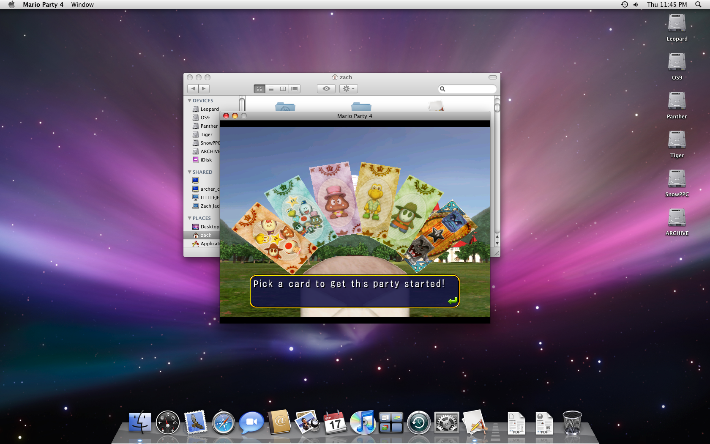

**"Pick a card to get this party started!"**, with the advance arrow lit in the
corner. A window waiting for A on pad 0, and nothing else in the process was
wrong.

**The soak was pressing A. The game could not see it.** §28.3's metronome
writes

```c
for (i = 0; i < 4; i++) {
    HuPadBtnDown[i] |= PAD_BUTTON_A;
    HuPadBtn[i]     |= PAD_BUTTON_A;
}
```

from `port_selfplay_tick`, which runs in the VI post-retrace callback, after
the game's own `PadReadVSync`. The file's own comment called that "the last
word on the frame the game is about to run". It is not. The next thing the
game does is the top of its main loop:

```c
    Hu3DPreProc();
    HuPadRead();          /* src/game/main.c:101 */
    pfClsScr();
    HuPrcCall(1);         /* ...and only now does any coroutine run */
```

and `HuPadRead` (`src/game/pad.c:133`) **overwrites** `HuPadBtn[]` and
`HuPadBtnDown[]` from `_PadBtn*` and zeroes `_PadBtnDown[]` — all of it before
a single coroutine is dispatched. The derived globals are what `HuPadRead`
*produces* from the raw pad each frame; writing them from outside the frame is
writing to a variable that is assigned before it is next read. **Every press
this harness has ever logged — §26.1's twenty-four, §24.6's rotation, §28.3's
metronome — was overwritten a few microseconds later.** The screens that did
move on after a burst of presses moved on for their own reasons.

**The fix is a layer down, and it is the layer the walk has always used.** A
`--play` script does not touch the derived globals: `pad_play_step` overwrites
port 1's *raw* `PortPadRaw` inside `PADRead` (`port/src/pad/pad.c:121`), before
`PADClamp`, so the game's own edge and repeat logic derives `BtnDown` and
`DStkRep` from it exactly as it would from a thumb. That is why
`board-start-com4.play`'s A metronome walks this same mode-select menu at every
boot and the navigator's did not — they were never doing the same thing.

`port_pad_inject(buttons)` arms one frame of digital buttons; the next
`PADRead` ORs them into port 1's raw state and disarms. The navigator calls it
in place of both write loops. Two consequences worth stating:

* **The press is channel 0 only.** `PADRead` fills channel 0 and reports
  `PAD_ERR_NO_CONTROLLER` on 1–3, because a soak that claimed four connected
  controllers would be telling the game something untrue about the console
  (`port/src/pad/pad.c:20`) — and `PlayerConfig.iscom` is derived from exactly
  that. §28.3's four-index write existed to answer a prompt that reads
  `HuPadBtnDown[pad_idx]`; §28.1 removed that prompt at the source, and every
  menu between a board's end and the next board's start reads pad 0
  (`modesel.c:110-152`, `HuWinActivePadGet` with `active_pad == 1`).
* **The rotation now holds for four frames, not one.** The game derives its own
  edge now, and a one-frame raw blip is lost whenever two retraces fall between
  two `HuPadRead()` calls — which a 10 fps board does constantly. Four frames
  is what the boot walk holds.

`--nopad` is honoured unless the harness is actually pressing: the one case
where the port may contradict "controller 1 is unplugged" is a soak answering a
prompt, and it is a soak that asked for it.

**The witness, rendering on.** `--soak --turns 3 --com4 --rtc dolphin
--freshcard --ffto 49000 --status --ovllog --stuckwatch 200`, nothing touching
the pad but the harness (`~/m14-chain-witness.log` on the G4):

```
frame 42,789  m427dll ends            the third turn's minigame
frame ~47,000 OVL 78 EVT:0 / EVT:1    the award ceremony and the results screen (28.1)
frame ~49,400 OVL 74 EVT:1            modeseldll -- the stop
frame 61,394  STUCK, 200 s            the watchdog's own limit, un-tuned
frame 61,394  "walking it with the A metronome"
frame ~62,700 answered after 20 presses
frame ~62,700 OVL 70 EVT:0            mentdll -- Party mode picked
frame 73,736  STUCK -> metronome -> answered after 140 presses
frame 88,004  STUCK -> metronome -> answered after 16 presses
frame 88,004  OVL 89 EVT:0            w01dll, turn 1/3, coins back to 0
```

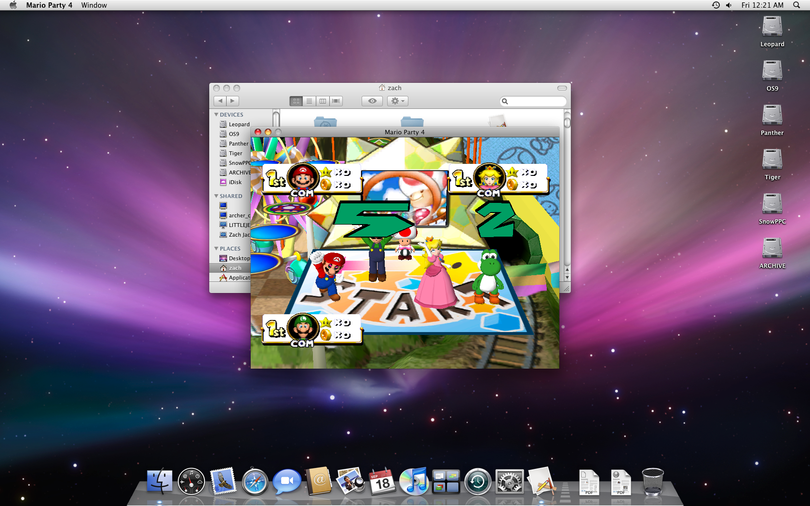

**A second board, from a cold boot, with no hand on it.** The 140 presses on
`mentdll` are the board-settings screens — board, turns, characters — which is
what the boot walk spends 28,800 frames of metronome on for the same reason.

Two smaller things fell out of the same reading:

* **`--stuckwatch 20` is not a debugging convenience, it is a hazard** — now
  that presses land. A test run at 20 s fired the B/START rotation on a healthy
  `w01dll` sixteen times, opened the board's pause menu, and walked the A
  metronome into "choose which character's settings to change", which is the
  exact trap `board-start-com4.play`'s header describes. §17.10's 90 s (and
  `--soak`'s 200 s here) is the calibrated number and it is calibrated for this.
* **`g4 stop` left a survivor again**, twice in this session — once with two
  copies of the game sharing the machine and the same log file. §28.6's rule
  stands and this session paid for it a third time.

**Snapshot.** `~/MarioParty4/snaps/lib/modesel-after-results.snap` is frame
415,000 of the stalled run — the stuck menu itself. It is **build-tied**
(`--restore` refuses a snapshot from a different build id, which is correct:
snapshots restore globals by address), so it belongs to build `940dac83` and
not to anything M14 shipped. The reproducible route on any build is the one
above: `--turns 3 --com4 --rtc dolphin --freshcard --ffto 49000`, which reaches
the menu in about six minutes.

### 29.2 `m453`: seventy casts, and not one of them fits

§27.5 closed the question of whose bug the `m453` heap panic is — the retail
disc panics identically, to the byte — and left one open: *a lighter cast would
fit*. It would not.

**The budget, read off the disc.** `HEAP_DVD` is `0x580000` = 5,767,168 bytes.
At the moment m453 asks for the character models it already holds `m450.bin`
(2,984,000, instDll's preload — m453 shares m450's directory) and `m403.bin`
(1,370,496), leaving **1,412,672** — which is the `Rest Memory 158e40` the
console's own trace prints. The eight `<char>mdl1.bin` sizes, parsed out of the
reference image's FST, and what each costs allocated (`ceil(n/32)*32 + 32`):

| character | `mdl1.bin` | allocated |
|---|---:|---:|
| Luigi | 362,686 | 362,720 |
| Mario | 382,208 | 382,240 |
| Yoshi | 396,092 | 396,128 |
| Waluigi | 414,862 | 414,912 |
| Wario | 429,164 | 429,216 |
| Donkey Kong | 450,866 | 450,912 |
| Daisy | 491,926 | 491,968 |
| Peach | 492,902 | 492,960 |

**The four lightest are Luigi + Mario + Yoshi + Waluigi = 1,556,000 bytes,
which is 143,328 over.** All 70 four-character combinations are over, by
between 143,328 and 452,384 bytes:

| cast | allocated | over by |
|---|---:|---:|
| Mario/Luigi/Yoshi/Waluigi | 1,556,000 | **+143,328** |
| Mario/Luigi/Yoshi/Wario | 1,570,304 | +157,632 |
| Mario/Luigi/Wario/Waluigi | 1,589,088 | +176,416 |
| Mario/Luigi/Yoshi/Donkey | 1,592,000 | +179,328 |
| *Mario/Luigi/Peach/Yoshi* (`--com4`'s own, §27.5) | 1,634,048 | +221,376 |
| … | | |
| Peach/Wario/Donkey/Daisy | 1,865,056 | +452,384 |

The model reproduces §27.5's measured 221,376 exactly, which is why it is worth
believing about the other sixty-nine.

**Witnessed on the G4.** `--cast a,b,c,d` (new; numbers 0–7 or names) parks the
four characters the way the rest of `--com4`'s player state is parked.
`--minigame m453 --com4 --cast mario,luigi,yoshi,waluigi --turns 10 --rtc
dolphin --freshcard --play board-start-com4.play --nodraw --turbo`:

```
port> --cast: mario / luigi / yoshi / waluigi
data num 5e0001   Rest Memory fb920     mariomdl1
data num 190001   Rest Memory a3040     luigimdl1
data num 890001   Rest Memory 424e0     yoshimdl1
data num 800001                         waluigimdl1
HuMem>memory alloc error 000654a0(10000000): Call 00010824
dvd.c: Memory Allocation Error (Length 6548e) (mode 1)
```

`0x6548e` = 414,862 = `waluigimdl1.bin` to the byte, against `0x424e0` =
271,072 free: **short by 143,790**, against the table's predicted 143,328
(the 462 is where `Rest Memory` is printed relative to the block header).
The control on the same build, the default `--com4` cast and no `--cast` flag,
reproduces §27.5's console trace to the byte — `Rest Memory 2aaa0`, then
`memory alloc error 00060b40`, `Memory Allocation Error (Length 60b3c) (mode
1)` — which is the same failing length Dolphin printed against the retail disc.

The lightest cast in the game fails, so the record is: **m453 is not playable
by four players on a GameCube, with any cast. It is a limit of the game, not of
this port**, and it belongs in the inventory as one.

**`--dvdheap KB`, and what it costs.** Since a crash the console also has is
still a crash for the player, the port can choose to not have it. `--dvdheap`
sets `HeapSizeTbl[HEAP_DVD]` (`port/patches.txt` → `src/game/malloc.c`) and
announces itself at boot; what it spends comes out of `HEAP_HEAP`, which is
index 4 and takes whatever the arena has left, so no other heap changes size
and the console's total is still the total. The minimum that covers the default
cast is 5,849 KB; 5,888 KB (`0x5C0000`) is the next round number.

```
HuMem> --dvdheap: HEAP_DVD 5632 KB -> 5888 KB (a deliberate divergence from the console)
HuMem> left memory space 2127KB(2178976)          (was 2383 KB)
```

`--minigame m453 --com4 --dvdheap 5888 --turns 10 --rtc dolphin --freshcard
--play board-start-com4.play --nodraw --turbo`, Mario/Luigi/Peach/Yoshi, the
cast that panics on the disc: **`m453dll.rel` linked seven times, was the live
screen for 242 status lines, and the board reached turn 7 of 10 with no heap
error at all.** It is `~/m14-m453-dvdheap.log` on the G4.

It is off by default and it should stay off by default: a port that quietly
plays a minigame the console cannot is not reproducing the game. The flag
exists so the choice is explicit, logged, and the player's.

### 29.3 The two real missing-return bugs, and a reference frame that did not move

§26.2's audit found 43 functions the decomp declares non-`void` and never
returns from; §28.6 left the two with real consequences untouched.

**`MegaPlayerPassFunc` / `MegaExecJump`** (`src/game/board/player.c:2842,2954`).
Both `return 0` early — "nobody is standing on the space you are about to land
on" — and both fall off the end of the success path after
`BoardPlayerIdleSet(player); HuPrcSleep(30);`. The caller reads it as a
contract:

```c
    if (MegaPlayerPassFunc(arg0, sp8) == 0) {      /* player.c:934 */
        BoardPauseDisableSet(0);
        BoardPlayerMoveTo(arg0, sp8);              /* walk him there normally */
        BoardPauseDisableSet(1);
    }
```

The success path has *already* jumped the giant player onto the space and
squashed whoever was on it, over sixty frames of arc, camera quake and rumble.
Returning nothing means GCC 14 leaves `HuPrcSleep(30)`'s r3 there — and
`HuPrcSleep` is `void` — so a successful Mega squish reads as "nobody there"
and the board walks the player to a space he is already standing on. Both now
`return 1`.

**`CharNpcDustSet`** (`src/game/chrman.c:1700`) creates a child process for a
character's dust effect and returns nothing. Six call sites store the result
and mean it as the handle:

```
src/REL/m447dll/player.c:149,150    temp_r3->unkB0 = (HUPROCESS *)CharNpcDustSet(...)
src/REL/m459dll/main.c:635,636      var_r31->unk_28[...] = CharNpcDustSet(...)
src/REL/present/common.c:61,62      work->unk_50 = CharNpcDustSet(...)
src/REL/option/guide.c:72,73        work->unk_5C = CharNpcDustSet(...)
src/REL/m448Dll/main.c:1759,1760    lbl_1_bss_20 = CharNpcDustSet(...)
```

and every one of them later hands that value to `HuPrcKill`. Under Metrowerks
it was still `HuPrcChildCreate`'s return in r3; under GCC 14 it is
`EffectInit`'s leftovers. Killing that is a wild pointer and *not* killing it
is a coroutine that outlives its model. It now returns the `HUPROCESS *`.
`CharNpcDustVoiceOffSet` immediately below is the same bug one layer up — the
decomp already marks its `s32 ret` as uninitialised — and now returns what it
wraps.

Both patches carry an env-gated trace in the shape §28.2 established
(`MP4_MEGATRACE`, `MP4_DUSTTRACE`): off by default, one comparison when off.
`--soak` sets `MP4_MEGATRACE` itself, because a Mega Mushroom is rare enough
that only an overnight run is ever going to draw one and the flag would
otherwise never be on when it mattered.

**The A/B, and it is the strongest evidence here.** §21.1 frame 7000, the board
scene, same command as §25 and §28:

```
--ffto 7000 --dumpframe 7000 --turbo --com4 --rtc dolphin --freshcard
--play board-start-com4.play --frames 7100
```

md5 **`0184870dc607f2aed89b95dc7e71add5`** — byte-identical to §25.6's rebased
reference and to §28.5's TEV-cache run. Three patches that change what two
board functions return and what a dust effect hands back, and a 640×480 board
frame with four characters, a window and a minigame result on it does not move
one pixel. Nothing is re-based and no `ppmdiff.py` justification is needed.

`--gxwarn` over the same walk, for the record and for §29.4:

| degradation | count |
|---|---:|
| `GXInitSpecularDir: specular is approximated by the diffuse term` | 34,662 |
| `TEV: a stage needs two different constants; the first wins` | 1,824 |

Two, and **only** two. No `four-input stage with no GL 1.3 combiner`, no
`the stage chain needs more units than the card has`, no `an undecoded GX
format was bound`.

**What is not witnessed.** A Mega Mushroom is a bought item on a board and no
run this session drew one, so `MP4_MEGATRACE` has never fired: the two `return
1`s are argued from the caller's own `== 0` test and the disassembly, not from
a board. The trace is in the build the overnight soak is running, so the first
Mega squish it plays will say so in the log. `CharNpcDustSet` is exercised
constantly (mentDll alone calls it twice per character at `main.c:3318`) and
the frame-7000 md5 says the corrected return changes nothing visible — which is
the expected result for a handle nobody was dereferencing yet, not a witness
that the six kill sites now work.

### 29.4 The board eyes: reproduced exactly, cause narrowed, **not fixed**

§26.3 item 3 has been carried since M9 on the strength of a lost screenshot.
It is lost no longer — frame 7000 of the reference walk, the same frame whose
md5 is checked above:

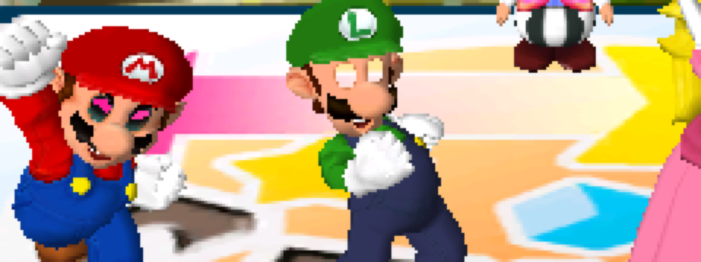

**Mario's eyes are magenta rings around a black-and-cyan blotch. Luigi's are
empty white holes with no pupil at all. Yoshi's and Toad's are correct.** The
second board's opening frame (§29.1's screenshot) shows the same thing with
Peach's eye a dark blob instead. It is per-character and it is on the 3D model,
which makes it a different symptom from §21.5's "Yoshi's *portrait* has no
eyes" and possibly a different bug.

**What draws an eye.** `EyeBmpUpdate` (`src/game/chrman.c:1145`) does not touch
pixels: it finds the attributes whose bitmap name matches
`charEyeBmpNameTbl[charNo*8 + i*2]` and zeroes their attribute-animation
transform (`chrman.c:1161-1168`). The blink frame is chosen a layer down, in
`hsfanim.c:255-258`, as a **sub-rectangle of the atlas expressed as a 2×4
texture matrix** — `scale = layer->sizeX / bmp->sizeX`, `trans = layer->startX
/ bmp->sizeX` — which `hsfdraw.c:967-979` and `hsfdraw.c:1141-1163` hand to
`GXLoadTexMtxImm` + `GXSetTexCoordGen(GX_TG_MTX2x4, GX_TG_TEX0, ...)`.

The colour is the game's **double-TLUT "TL32" trick**: an `HSF_BMPFMT_CI_IA8`
bitmap is loaded *twice* over the same index data with two different palettes
(`hsfdraw.c:649-657`, `hsfdraw.c:1823-1837`), and two TEV stages with swap
tables (`hsfdraw.c:1008-1023`, konsts `{0xFF,0xFF,0,0}` and `{0,0,0xFF,0xFF}`
at `hsfdraw.c:116-117`) compose

```
    final.rgb = ( I0, A0, I1 )      final.a = KONST_a * A1
```

— red from palette 0's intensity, **green from palette 0's alpha**, blue from
palette 1's intensity. **Losing the green term of that expression is literally
red + blue = magenta**, and losing a palette is black. Both observed symptoms
live on this one expression, which is why it is almost certainly the code path.

**Three candidates eliminated by measurement, one hardened, one new.**

* *Not* a missing GL feature. `--gxwarn` above: no four-input-stage warning, so
  `ATI_texture_env_combine3` is present and the second stage's
  `GL_MODULATE_ADD_ATI` is being emitted; no dropped-stage warning, so the
  chain fits the Radeon's six units; no undecoded-format warning, so `GX_TF_C8`
  and the TLUT decode ran.
* *Not* the swap tables. §21.5 settled that and the texture dumps below agree.
* *Not* the NPOT fold, on inspection: the fold multiplies the **final**
  coordinate once, in the vertex program (`gx_vprog.c:519-524`, env 56) or in
  `GL_TEXTURE` (`gx_tex.c:769`), never both, and it composes correctly after
  the sub-rect matrix.
* **Still live: the per-unit constant collision.** GL 1.3 gives a texture unit
  one `GL_TEXTURE_ENV_COLOR`; GX gives a stage an independent `KCSel` and
  `KASel`. The eye's second stage wants `(0,0,255)` for colour and `1.0` for
  alpha (`GX_TEV_KASEL_1`, forced for every stage at `hsfdraw.c:498`), and
  `gx_tev.c:299-304` keeps the first and warns. That warning fires 1,824 times
  on this walk. Its effect is `stage1.a = TEXA * 0`, i.e. a transparent eye —
  which is a symptom this frame does not obviously show, so it is a bug but
  probably not *the* bug.
* **New, and the most concrete lead: the two TLUT copies are identical.**
  `--dumptex` over the walk writes the eye atlases as eight pairs of
  16×176 `GX_TF_C8` textures — `tex-086/087`, `089/090`, `095/096`, `098/099`,
  `104/105`, `107/108`, `113/114`, `116/117` — one pair per character, which is
  exactly the TL32 double load. **All eight pairs are byte-identical, RGB and
  alpha.** They are two cache entries (so the port did see two different TLUT
  pointers) that decode to the same pixels, which means the second palette the
  port read was the same data as the first. If `I1 == I0` and `A1 == A0` the
  composite collapses toward `(I, A, I)` and the eye's colour is wrong
  everywhere at once, per character, in exactly the way the frame shows. The
  address in question is `&((s16 *)bmpPtr->palData)[(bmpPtr->palSize + 0xF) &
  0xFFF0]` (`hsfdraw.c:1825`) — note that the *count* passed to
  `GXInitTlutObj` is `palSize` as well, so the object also reads past its own
  palette, and that the port's content hash therefore hashes bytes that are not
  the palette's.

**This is where M14 stopped.** The next ten minutes are `--drawlog-at 7000`
filtered to the character draws, to see which two texture slots and which two
TLUT names the eye stages actually bind, and a read of `bmpPtr->palData` /
`palSize` for one character's eye bitmap on the live process — enough to say
whether the second palette is mis-addressed by the game's own expression under
GCC 14 (a `palSize` that is a count of entries where the expression wants
bytes, or the reverse) or mis-read by the port.

Evidence kept: `port/docs/screenshots/m14-eyes-f7000.png` (the frame),
`m14-eyes-before.png` (the second board's opening, Mario and Peach),
`m14-eye-atlas-copy0.png` (one atlas as the port decodes it), and the full
dump set on the G4 in `~/m14shots/`.

### 29.5 What M14 shipped, and what it did not

**Shipped, with a witness on the G4:**

| | |
|---|---|
| the navigator's press seam (§29.1) | two boards chained back to back, rendering on, from a cold boot |
| `--cast a,b,c,d` (§29.2) | the lightest cast panics on hardware, 143,790 short |
| `--dvdheap KB` (§29.2) | m453 linked and played seven times at 5,888 KB with the console's own cast |
| `MegaPlayerPassFunc` / `MegaExecJump` (§29.3) | code + reasoning; frame 7000 md5 unchanged |
| `CharNpcDustSet` / `CharNpcDustVoiceOffSet` (§29.3) | code + reasoning; frame 7000 md5 unchanged |

**Not done, and why:**

* **The eyes** (§29.4). Reproduced, dissected, three candidates eliminated and
  one new and specific lead recorded. Not fixed; the frames and the atlas dumps
  are committed so M15 starts at the evidence rather than at the title.
* **A Mega squish on a board** (§29.3). The two `return 1`s have no hardware
  witness because no run drew a Mega Mushroom. `MP4_MEGATRACE` is in the build
  the soak is running.
* **The per-draw submit lever** (§28.5). Not started; the night went on §29.1,
  which was worth more than a percentage.
* **Snapshot compression.** Not started.
* **`m453` rendering on.** The seven plays are a `--nodraw` run; nobody has
  looked at the screen.

### 29.6 What M15 starts with

1. **Read the soak's log first.** Left running at the end of M14:

   ```sh
   g4 run --soak --com4 --rtc dolphin --freshcard \
          --snap-every 5000 --snap-keep 3 --status --ovllog --stuckwatch 200
   ```

   Two questions for it: does the chain of §29.1 keep going — *three* boards,
   *four* — and does `port> mega:` ever appear (`--soak` arms the trace).
2. **The eyes**, from §29.4's last paragraph. It is the oldest open rendering
   bug in the project and it is now one question rather than five.
3. The per-draw submit lever (§28.5), with §25's A/B discipline.

## 30. M15 log — the stage that never ran, and the eyes that are still wrong *(2026-09-18)*

M15 opened on §29.6: read the soak, then the eyes, from §29.4's one remaining
lead. The soak answered (§30.1). The lead was **wrong** — the board eyes are
not the TL32 double-TLUT material and never were (§30.2) — and chasing it to
the bottom of the draw log found a different bug, older and much larger:
**every GX TEV stage that names `GX_TEXMAP_NULL` has been silently dropped in
every build of this port** (§30.3). Fixing it closes §21.5, which has been open
since M9, and is witnessed against the Dolphin oracle (§30.4). It does **not**
fix §29.4's board eyes, which are still open and now better bounded (§30.6).

### 30.1 What the soak said

The run left going at the end of M14 —
`--soak --com4 --rtc dolphin --freshcard --snap-every 5000 --snap-keep 3
--status --ovllog --stuckwatch 200` — was still up eleven hours later, pid
80786, frame 471,060, on its **second board, turn 15 of 20**, at 12.7 fps.
Three `STUCK` lines in 30,293 log lines, all answered by the metronome.

And the question §29.3 could not answer:

```
port> mega: MegaPlayerPassFunc(player 1, space 71) squished 1 and returns 1
port> mega: MegaPlayerPassFunc(player 0, space 49) squished 1 and returns 1
port> mega: MegaPlayerPassFunc(player 2, space 100) squished 1 and returns 1
port> mega: MegaPlayerPassFunc(player 1, space 48) squished 1 and returns 1
port> mega: MegaPlayerPassFunc(player 3, space 126) squished 1 and returns 1
```

**Five Mega squishes, every one of them returning 1.** §29.3's two `return 1`s
were argued from the caller's `== 0` test and the disassembly and had no
hardware witness; they have five now. That closes §29.5's first "not
witnessed".

### 30.2 The TL32 lead is dead: there is no IA8 TLUT on frame 7000

§29.4's next-ten-minutes was `--drawlog-at 7000` on the character draws, to
read the two TLUT addresses the eye stages bind. `--tlutlog` (new: every
`GXLoadTlut` and every CI bind, with the palette address, its entry count and
format, the TLUT name, the swap table, the cache slot, and an FNV over the
palette bytes) says there is nothing there to read:

* **639 TLUT lines on frame 7000, and not one of them is `GX_TL_IA8`.** The
  TL32 trick is the `HSF_BMPFMT_CI_IA8` branch of `LoadTexture`
  (hsfdraw.c:1823) and it is the only producer of an IA8 TLUT. That branch
  does not run on this frame at all, so the material §29.4 spent its evening
  on is not the material that draws these eyes.
* The eight "pairs" of 16×176 `GX_TF_C8` atlases that M14 found decoding
  byte-identical are **sixteen separate bitmaps with sixteen separate
  palettes**, every palette 83 entries of `GX_TL_RGB5A3` and every one hashing
  to `8971410e`. They are one cache slot each, on `map-tlut 0` or `1`, with the
  identity swap `e4`. Identical decodes because the palettes are genuinely
  identical, not because the cache handed back the first one.
* And they are not the eyes either: every draw that binds one comes from
  `HuSprDisp+844` under an **orthographic** projection, four verts, at screen
  positions like (178, 98). They are the board's HUD player panels.

So: the cache key is not missing the TLUT address (it holds `tlut->lut`), the
palette is not mis-addressed, and `palSize` is not the problem. **§29.4's prime
suspect is eliminated.** The `--tlutlog` output is the evidence and the flag
stays in the build.

**What actually draws Mario's eyes**, from the same log with `--drawlog` now
printing *every* stage rather than stage 0 (which is why five sessions of draw
logs could not see this):

```
---- draw 39: prim 80, 32 verts, 3 tev stage(s), 2 texgen(s), 1 chan(s) ----
           drawobj model 0 object "mario_m1"
  stage0 coord 0 map 0   chan 4  cin 15 8 10 15  ain 7 4 6 7
    texmap0 64x64 fmt 14 ci 0                      (CMPR, the eye atlas)
  stage1 coord 1 map 1   chan 4  cin 15 8 10 15  ain 7 4 6 7
    texmap1 32x32 fmt 5  ci 0                      (RGB5A3)
  stage2 coord 255 map 255 chan 4  cin 0 6 7 15  ain 7 7 7 0
    texmap255 NOT BOUND                            <-- no texture at all
  texgen0 func 1 src 4 mtx 30
    texmtx0    1.0000 0.0000 0.0000 -0.1500        (the blink sub-rect)
               0.0000 1.0000 0.0000  0.0594
  tevreg prev 0 0 0 0  c0 0 18 0 255  c1 0 0 0 204  c2 0 0 0 0
```

Three stages over a CMPR atlas and an RGB5A3 map, the blink frame chosen by
`texmtx0`'s translation exactly as `hsfanim.c:255-258` builds it — and a third
stage with **no texture**, whose combiner is
`lerp(CPREV, C2, A2)`. Yoshi's eyes, which are correct, are `eye_L`/`eye_R`
objects with **one** stage and a plain 256×256 CMPR texture. That asymmetry is
what §30.3 is about.

### 30.3 `GX_TEXMAP_NULL`: the comment was right and the code was not

`port/src/gx/gx_tev.c` has carried this since M3:

```c
} else {
    /* A stage with no texture still has to run its combiner, and a disabled
     * unit in GL passes the previous colour through untouched -- which is only
     * right when the stage is a pass.  Keep the unit enabled against a 1x1
     * white texture instead. */
    glc_unit_enable_tex2d(i, 0);
}
```

The comment states the requirement. The line under it **disables the unit**,
and there is no 1×1 white texture anywhere in the port. GL 1.3 bypasses a
disabled unit's entire texture environment, so the `glTexEnv*` calls the port
faithfully emitted for that stage were never applied to anything.

**GX lets a stage name `GX_TEXMAP_NULL` and still run its combiner.** That is
how this game tints, fades and toon-shades: `sprput.c:76-80` is the sprite
path's colour/alpha modulation, `hsfdraw.c` uses it for the rim and eye
materials. All of it was dropped.

The size of it, counted by a new `--gxwarn` line on the §25 walk
(`--ffto 7000 … --frames 7100`):

| build | `TEV: a stage with no texture is dropped…` |
|---|---:|
| `--oldnulltev` (every build before M15) | **1,741,167** |
| M15 default | **0** |

210 of the 774 draws on frame 7000 have such a stage — among them both of
Mario's eyes, three of Luigi's face materials, four of Peach's, and **none of
Yoshi's**.

**The fix.** `glc_white_texture()` (gl13.c) makes a 1×1 opaque white texture
once and hands back its name; the textureless branch binds it and *enables*
`GL_TEXTURE_2D`, so `TEXC` is (1,1,1) and `TEXA` is 1 — the identity for every
combiner that reads them — and the stage runs. The name lives outside `glc`
and is dropped by `glc_invalidate`, because a shadow that has forgotten
everything may mean a new context.

`--oldnulltev` is the A/B lever, and it is the strongest evidence that nothing
else in M15 touches rendering: on the M15 binary it reproduces **all three §25
reference md5s to the byte** — `047e6867…`, `6a23ec28…`, `0184870d…`.

### 30.4 The witness: the Dolphin oracle on the character select

The change re-bases all three reference frames and the diffs are large, so §0
rule 3 needs more than `ppmdiff`. The oracle is `port/ref/frames/charselect.png`.

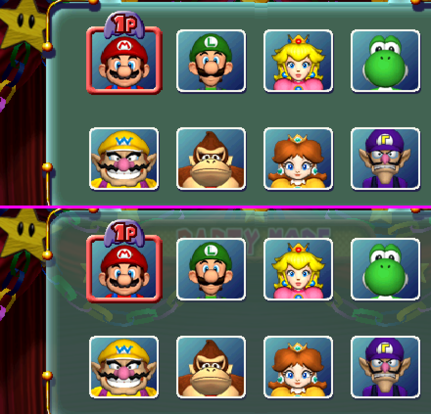

Top is `--oldnulltev`, bottom is M15. The corrected build matches the oracle in
**three independent ways the old build got wrong**:

1. **Yoshi's portrait has eyes, and so does Donkey Kong's.** In every build
   before this one they are a blank green face and a blank muzzle. This is
   §21.5 — "Yoshi's *portrait* has no eyes" — open since M9 and closed here.
2. **The selection panel is translucent.** The oracle shows the curtain and the
   chain decoration through it; the old build draws it opaque.
3. **The `PARTY MODE` banner shows through the panel**, as it does in the
   oracle, and is absent in the old build.

All three are the same mechanism: a `GX_TEXMAP_NULL` stage modulating colour
and alpha, which was being dropped.

**The md5 verdicts, re-based with that justification:**

| frame | scene | §25 md5 (= `--oldnulltev`, to the byte) | M15 md5 | pixels differing | mean |
|---:|---|---|---|---:|---:|
| 800 | title | `047e6867…` | **`eb6c318980998030acc7965dabb7bd49`** | 28,676 (9.34%) | 7.08 levels |
| 3000 | character select | `6a23ec28…` | **`8762d432d5c8ae98af3ba3d0cf5086d6`** | 93,741 (30.52%) | 4.63 levels |
| 7000 | board | `0184870d…` | **`b2a679b28fdf1ecbff483802a66c5bbc`** | 52,263 (17.01%) | 7.76 levels |

These are not rounding diffs and they are not meant to be: ~17,400 stages a
frame that never ran now run. Frame 3000 is the one with an oracle and it is
unambiguously closer to it.

**What is re-based without an oracle at that exact frame, and is therefore
argued rather than witnessed:**

* **Frame 800 loses `PRESS START`.** It blinks, the port had been drawing every
  faded sprite at full opacity, and the fade now applies; frame 800 lands on a
  low-alpha phase. `port/ref/frames/title.png` shows the text present at *its*
  phase, which neither confirms nor denies this frame.
* **Frame 7000's HUD plates dim.** `--drawlog` shows the game setting
  `c0 = 128 128 128 177` for them (`sprput.c:130`, `GXSetTevColor`), i.e. it is
  *asking* for half brightness and 69% alpha while the "Yoshi is fourth!"
  message window is up. The port was ignoring the request.
  `port/ref/frames/board.png` has no message window, so it is not a matching
  oracle. **An oracle frame with a message window open is the one measurement
  that would settle this, and it is not taken.**

A dropped GX stage can never be right, and the one screen with a matching
oracle moves toward it, so the fix is on by default. `--oldnulltev` is there
for anyone who wants the argument back.

### 30.5 The two `--gxwarn` degradations, checked

| degradation | `--oldnulltev` | M15 |
|---|---:|---:|
| `GXInitSpecularDir: specular is approximated by the diffuse term` | 34,662 | **34,662** |
| `TEV: a stage needs two different constants; the first wins` | 105,250 | **105,250** |

Specular is **exactly §29.3's 34,662** and unchanged by the fix. The konst
collision is unchanged *between the two arms of this A/B*, which is the check
that matters here — but it is **not** §29.3's 1,824, and it is 105,250 on both
arms of an M15 binary whose `--oldnulltev` frames are byte-identical to M14's.
So the discrepancy is in how §29.3's figure was obtained, not in anything M15
changed. Flagged, not chased.

### 30.6 The board eyes: still wrong, and now much better bounded

This is the part to be honest about. §29.4's symptom is **not fixed**.


Top `--oldnulltev`, bottom M15, frame 7000 at 8×. Across the whole character
band (y = 235…300) the only columns that changed are **x = 160…169** — 36
pixels, Mario's left eye, which went from a magenta ring to a flat grey blob.
Mario's right eye is still a magenta ring around black and cyan. **Luigi's
eyes are pixel-for-pixel unchanged**: the same empty pale rectangles.

So the third stage running is not what those eyes were missing. What M15 does
leave for M16 is a much smaller question than M14 left:

* the material is **draw 39/40 of frame 7000**, `mario_m1`, three stages, and
  §30.2 prints all of it — the two texture formats, the blink sub-rect matrix,
  the TEV registers;
* it is **not** TL32, **not** a TLUT, **not** the texture cache, and **not** the
  NPOT fold (both units report `su 1.0 sv 1.0`);
* stage 2's `c2` reads **0 0 0 0** while `c0` is `0 18 0 255` — a TEV register
  the material lerps towards that is pure transparent black. That is the next
  thing to read: whether the game ever sets `GX_TEVREG2` for this material and
  the port is losing it, or whether stage 2 is meant to be a no-op and the
  wrongness is entirely in stages 0 and 1;
* and Yoshi's correct eyes are a **one-stage** material on separate `eye_L` /
  `eye_R` objects, which is the control to diff against.

**Snapshot.** No new named snapshot: the reproduction is a five-minute command
on any build and does not need one —
`--ffto 7000 --drawlog 1500 --drawlog-at 7000 --tlutlog --turbo --com4 --rtc
dolphin --freshcard --play board-start-com4.play --frames 7010`.

### 30.7 What M15 shipped, and what it did not

**Shipped, with a witness:**

| | |
|---|---|
| the `GX_TEXMAP_NULL` stage drop (§30.3) | 1,741,167 dropped stages a walk → 0; §21.5 closed against the Dolphin oracle |
| `--oldnulltev` (§30.3) | reproduces all three §25 md5s to the byte |
| `--tlutlog` (§30.2) | 639 TLUT lines on frame 7000, no IA8 among them |
| `--drawlog`: all stages, texgens, texture matrices, NPOT fold, TEV registers | without it none of the above was visible |
| §29.3's two `return 1`s (§30.1) | five Mega squishes on the soak, all returning 1 |

**Not done, and why:**

* **The board eyes** (§30.6). The lead M14 left was wrong; the bug found in its
  place is real and large but is not this one. Bounded to one material and four
  named questions.
* **The per-draw submit lever** (§28.5). **Not started.** The session went on
  §30.3, which was worth more than a percentage — but this is now the second
  milestone running that has not touched it, and it is still the profile's
  answer.
* **Snapshot compression** (§24.6) and the 0.8% retrace drift. Not started.
* **An oracle frame with a message window** (§30.4). The one measurement that
  would finish the justification for frames 800 and 7000.

### 30.8 What M16 starts with

1. **The per-draw submit lever, first this time**, before anything else claims
   the night: §28.5's (a) batch consecutive primitives sharing all GL state,
   (b) a VBO / `APPLE_vertex_array_range` for the decoded arrays, (c) the
   remaining per-draw `glc_*` calls. Profile first, on a teleported frame,
   never on a live soak.
2. **The board eyes**, from §30.6's four questions — it is one material now.
3. **The oracle frame with a message window**, which closes §30.4.

## 31. M16 log — the draw that was a copy, and the register that was a constant *(2026-09-18)*

M16 opened on §30.8 item 1, the per-draw submit, which two milestones had
walked past. This time the profile came first (§31.1), the lever was built
behind `--oldsubmit` (§31.2), and the A/B is honest about what it bought:
**+16% / +21% / +13%** on the three scenes, from two things the profile did
not predict — every display list in this game holds exactly *one* primitive,
and the game's own face loop re-sends the blend mode before every face.

Item 2, the board eyes, turned out not to be a texture, a TLUT or a texture
matrix at all: **the port had never implemented a TEV stage writing to a
register other than PREV** (§31.3). Fixing it gives Mario, Luigi, Peach and
Wario their eyes on the board and the title — and, unasked, gives the board
back its **walkway and platform sides**, which had been failing the alpha test
since M3 and which nobody had noticed were missing. Item 3, the konst
collision count, was two different instruments disagreeing (§31.4), and the
count itself was half wrong. And a fault the new build exposed turned out to
be the retail game's own out-of-bounds index (§31.5).

This session ran on **littlejelly** (the always-on Linux lab host) rather than
on the Mac, which is why the `g4` helper, the install script and the git
identity each needed a small correction on the way.

### 31.1 The profile, on teleported frames

`g4_sampler.sh` against the M15 build, `sample isle 10`, three scenes reached
with `--ffto` (board: `--ffto 6500` on the 9,000-frame walk; the two minigames
with `--minigame NAME --ffto 10700`), nothing polling the G4 while it sampled.
Full profiles in `port/docs/soak/m16-{board,m432,m427}-profile.txt.gz`.
Inclusive samples on the game thread (outermost occurrence of each symbol;
the `mach_msg_trap` / `__semwait_signal` / `semaphore_timedwait_signal_trap`
entries at the head of every flat list are the parked audio threads):

| game thread, inclusive | board (`w01dll`) | `m432dll` | `m427dll` |
|---|---:|---:|---:|
| `mp4_game_main` (= 100%) | 6,821 | 6,653 | 6,166 |
| `GXCallDisplayList` | 4,548 (67%) | 5,535 (83%) | 4,390 (71%) |
| of which the decode (self) | 1,490 (22%) | 2,600 (39%) | 1,334 (22%) |
| of which `draw_run` — **the submit** | **3,057 (45%)** | **2,899 (44%)** | **3,069 (50%)** |
| — Apple's `gleDrawArraysOrElements_IMM_Exec` | **1,943 (28%)** | 2,016 (30%) | 2,172 (35%) |
| —— of which `io_connect_map_memory` (kernel) | 495 (7%) | 414 (6%) | 540 (9%) |
| — `gx_tev_apply` | 490 | 351 | 455 |
| — `gx_vprog_bind` + `gx_vprog_draw` | 400 | 330 | 251 |
| — `gl13_apply_raster_state` + `_transform` | 95 | 99 | 122 |
| `port_musyx_mix_frame` (audio, on this thread) | 299 | 182 | 281 |

Two things the M13 profile (§28.5) had mis-filed. First, `gldInitDispatch`
and `gldGetString` are not "the driver rebuilding its dispatch": the ATI
plugin's symbols are stripped and `sample` names the nearest export, so that
block is simply *the driver's per-draw work*, and its call tree says what the
work is — `gleDrawArraysOrElements_IMM_Exec` → `gleBeginPrimitiveTCLFunc` →
`gldPageoffBuffer` → `io_connect_map_memory` → `mach_msg_trap`. The **IMM**
path is the immediate client-array path: every `glDrawArrays` copies its
vertices into the command buffer through a generated "vertex submit
function" (`gleSetVertexArrayFunc`, 180 samples), and when the copies fill
the buffer the driver pages it off to the kernel, a Mach round trip that is
7-9% of the frame on its own. Second, the decode is not small — 22% on the
board and **39% on `m432`**, which is the next lever after this one — but it
is per *vertex*, and this milestone is about per *draw*.

So the submit is 44-50% of every scene, the driver's share of it 28-35%, and
none of the driver's share is geometry: it is the copy and the calls.

### 31.2 The lever: a ring the card reads, and batches the game had already drawn

Three parts, each behind a flag on the same binary:

* **The ring** (`gl13_var_setup`, `gx_draw.c`'s `ring_claim`). The decoded
  source vertices go into an 8 MB page-aligned ring handed to
  `GL_APPLE_vertex_array_range` with `GL_STORAGE_SHARED_APPLE`, so an array
  pointer into it is a DMA reference in the command stream rather than a
  copy. The ring is four chunks with a `GL_APPLE_fence` each: a fence is set
  on a chunk when the writer leaves it (after the draws that read it were
  issued), and finished before the writer enters it a lap later. With ~2 MB
  of vertices a frame the wait is on a fence three frames old, and the
  counter says it never blocked (`6,754 fence waits (0 blocked)` over the
  walk). One `glFlushVertexArrayRangeAPPLE` per batch pushes the CPU cache
  out ahead of the DMA. `--novar` keeps the same ring in ordinary memory.
* **The batch.** A display list's primitives accumulate as *segments* over
  one contiguous span of the ring and are submitted once: one state walk
  (transform, raster, TEV, vertex program), one set of array pointers, then
  contiguous list primitives of one type merged into one `glDrawArrays` and
  strips of one type into one `glMultiDrawArraysEXT`. Nothing about any
  triangle changes — the same vertices in the same order under the same
  state — so the md5s were expected to hold, and did (below).
* **Across lists.** The first walk said every display list in this game holds
  **exactly one primitive**: `7,669,131 display lists drawn; primitives per
  list: 1: 7,669,131  2-4: 0 …`. Batching *within* a list is therefore
  nothing. But hsfdraw.c's `FaceDraw` draws one face per list and skips the
  material setup when `faceMaterial == materialBak`, so consecutive faces of
  a material reach `GXCallDisplayList` with no GX call in between. The batch
  now outlives the list and is flushed by the next GX state setter:
  `GX_STATE_TOUCH()` is the first statement of every setter in
  `gx_state.c` / `gx_tex.c` (69 of them; one load and a branch when nothing
  is pending), so the pending batch is submitted under the state it was
  decoded under, *before* the setter changes anything. `--submitstats` counts
  which setters end batches, and the first count answered the next question:

  | batches ended by, first 7,001-frame run | |
  |---|---:|
  | `GXSetBlendMode` | **55,678** |
  | `GXLoadPosMtxImm` | 11,640 |
  | `GXSetNumTevStages` | 974 |
  | `GXSetProjection` | 97 |

  `FaceDraw` calls `SetBlendMode(flags)` **before every face, before the
  `materialBak` test**, almost always with the value it set for the previous
  face. A setter handed the value the state already holds changes nothing,
  so it now ends no batch: `GX_STATE_TOUCH_IF(changed)` compares first in the
  setters the face loop and the material setup re-send (blend, Z, alpha
  compare, cull, the three matrix loads bit-exact, the channel colours, the
  TEV in/op/order/konst/swap per stage, viewport, scissor, projection). After
  that the batch-enders are the honest ones: `GXLoadPosMtxImm` 693,302 (a new
  object), `GXSetChanAmbColor` 254,124 and `GXSetTevSwapMode` 67,901 (a new
  material), over the whole walk.

* `--oldsubmit` is the pre-M16 shape on the same binary: one `glDrawArrays`
  per primitive from the ring in plain memory, flushed at the end of every
  list.

**The A/B.** Same binary, same walk (`--turbo --com4 --rtc dolphin
--freshcard --play board-start-com4.play --frames 9000 --status --dumpframe
800,3000,7000 --perfwin …`), nothing polling the G4:

| scene | `--oldsubmit` | `--novar` (batches, plain memory) | ring + multi-draw, flush per setter | + compare-first setters | change |
|---|---:|---:|---:|---:|---:|
| title (700-870) | 14.80 fps | 13.92 | 16.23 | **17.20** | **+16%** |
| character select (2600-3600) | 14.81 | 15.32 | 15.23 | **17.95** | **+21%** |
| board (6000-8900) | 18.46 | 18.38 | 19.12 | **20.85** | **+13%** |
| gx ms/frame, board | 39.19 | 39.17 | 37.28 | **33.07** | −16% |
| batches, whole walk | 8,411,126 | 7,514,186 | 7,514,186 | **1,960,066** | |
| GL draw calls | 8,411,126 | 8,411,126 | 7,619,726 | **2,811,643** | −67% |
| wall clock, 9,000 frames | 444.3 s | 443.3 s | 437.3 s | **388.4 s** | −13% |

and the same two arms on the **final M16 binary** (§31.3's rewrite and its two
bind fixes in, both arms), which is the table to quote — the bind fixes
(§31.3) turn out to have been costing the *old* path too, since M15 was
creating a texture object every frame:

| scene | `--oldsubmit` | **M16** | change | gx ms/frame |
|---|---:|---:|---:|---|
| title (700-870) | 15.03 fps | **20.97** | **+40%** | 61.57 → 41.51 |
| character select (2600-3600) | 15.41 | **18.95** | **+23%** | 52.60 → 40.97 |
| board (6000-8900) | 20.31 | **23.42** | **+15%** | 34.80 → 28.44 |
| `m432dll` (10900-11800) | 12.18 | **14.77** | **+21%** | 68.57 → 54.40 |
| `m427dll` (10900-11800) | 22.49 | **24.89** | **+11%** | 32.60 → 28.52 |
| wall clock, 9,000 frames | 413.7 s | **352.3 s** | −15% | |

(the two minigames were measured on the binary before the bind fixes, both
arms alike; `--minigame NAME --ffto 10700 --frames 11800`, the §25.4 window.)

The columns read left to right as the three parts were added, and each says
something. Batching without the ring (`--novar`) buys **nothing** — one state
walk per batch instead of per list is not where the time was, because the
shadow was already eliding the calls (§28.5). The ring with the driver's
multi-draw buys 4-10% while 89% of lists still stand alone. And letting the
game's own redundant `GXSetBlendMode` through — 4.3 primitives per batch
instead of 1.1, a third of the GL calls — is what makes the lever a lever.
`--oldsubmit` reproduces the pre-M16 numbers of this binary (M15 itself was
never timed; the `GX_TEXMAP_NULL` fix enables a texture unit on 210 of 774
board draws, and the board is 18.5 fps on this binary against §25.4's 22.6 on
M11's), so the baseline column is the honest one.

**The md5 verdicts.** On the binary *before* §31.3, all four arms produce the
three §30 references to the byte — `eb6c3189…`, `8762d432…`, `b2a679b2…` — so
the ring, the fences, the multi-draw and the cross-list batches are exact and
nothing is re-based for speed. (§31.3 re-bases two of them for a different
reason.)

*Not done in this item:* the strip → indexed-triangle conversion (one
`glDrawElements` per batch instead of the driver's loop inside multi-draw),
because the driver's loop is not where the profile put the time; and the
decode itself, which on `m432` is now the largest block.

### 31.3 The board eyes: a stage that wrote a register, drawn as if it wrote PREV

§30.6 left one material and four questions; the answer was to the second one
("whether the game ever sets `GX_TEVREG2` for this material and the port is
losing it"), and it is larger than the eyes.

`hsfdraw.c`'s `SetTevStageTex`, for a material with two textures whose second
attribute has `kColor != 1` (lines 1226-1237), builds:

```
stage A:  colour  T_A * RAS            -> PREV     alpha  T_Aa * K_A       -> PREV
stage B:  colour  T_B * RAS            -> REG2     alpha  T_Ba * K_B       -> REG2
stage C:  colour  lerp(PREV, C2, A2)   -> PREV     alpha  APREV            -> PREV
```

i.e. stage B's result goes to **register 2**, not PREV, and stage C blends
the first texture's result towards the second by the second's alpha. That
`GXSetTevColorOp(…, GX_TEVREG2)` is `gx.tev[s].creg`, which `gx_tev.c` stored
and **never read**: every stage was emitted as if it wrote PREV, and `C2` /
`A2` were resolved by `color_arg` as the register's *constant* (whatever
`GXSetTevColor(GX_TEVREG2, …)` last put there — `0 0 0 0` in §30.6's log). So
the port drew stage B *over* PREV, then `lerp(PREV, black, 0) = PREV`: the
second texture's colour, times the lighting, with the second texture's alpha
(`T_Ba * K_B`, close to 0 over most of the overlay) as the **material's
alpha**. For the eye atlas that is the magenta ring §29.4 photographed —
the overlay's colour where its alpha is zero, which nothing was ever meant to
show. For any *opaque* two-texture material it is worse: the alpha test
(`GXSetAlphaCompare(GX_GEQUAL, 1, …)`, `SetupGX`) throws the surface away.

GL 1.3 has one carrier between units, but this shape is expressible exactly,
because `RAS` factors out of both terms:

```
out.rgb = RAS * (T_A * (1 - q) + T_B * q),     q = T_Ba * K_B
out.a   = T_Aa * K_A
```

which with `GL_ARB_texture_env_crossbar` (the Radeon 9000 has it) is three
units in the three stages' places:

| unit | RGB | alpha |
|---|---|---|
| A | `REPLACE(TEXTURE)` = T_A | `MODULATE(TEXTURE1.a, CONSTANT.a)` = q — unit B's texel, read across |
| B | `INTERPOLATE(TEXTURE, PREVIOUS, PREVIOUS.a)` = T_B·q + T_A·(1−q) | `MODULATE(TEXTURE0.a, CONSTANT.a)` = T_Aa·K_A — unit A's texel, read across |
| C (white texture) | `MODULATE(PREVIOUS, PRIMARY_COLOR)` = ·RAS | `REPLACE(PREVIOUS)` |

`regfix_match` recognises exactly that triple (plain add/scale-1/no-bias
stages, identity swaps, both textures bound, same colour channel, stage A's
alpha a modulate of two of {TEXA, KONST, RASA}, stage C's `q` either the
register's alpha or — the `kColor == 1` variant at hsfdraw.c:1239 — stage B's
texture alpha, and `APREV` through) and `regfix_emit` writes the three units;
everything else goes down the old path. Every *other* register write is now
counted by `--gxwarn` (`TEV: a stage writes a TEV register other than PREV; GL
has only PREV, so it is treated as PREV`) instead of passing silently — 5,665
stage emissions over the walk, the reflection and `texCol == 1` shapes of the
same function, still open. `--noregfix` is the A/B lever and reproduces the
§30 md5s to the byte.

**The witness**, frame 7000, `--noregfix` over the fix, 6× (the crop §30.6 used):

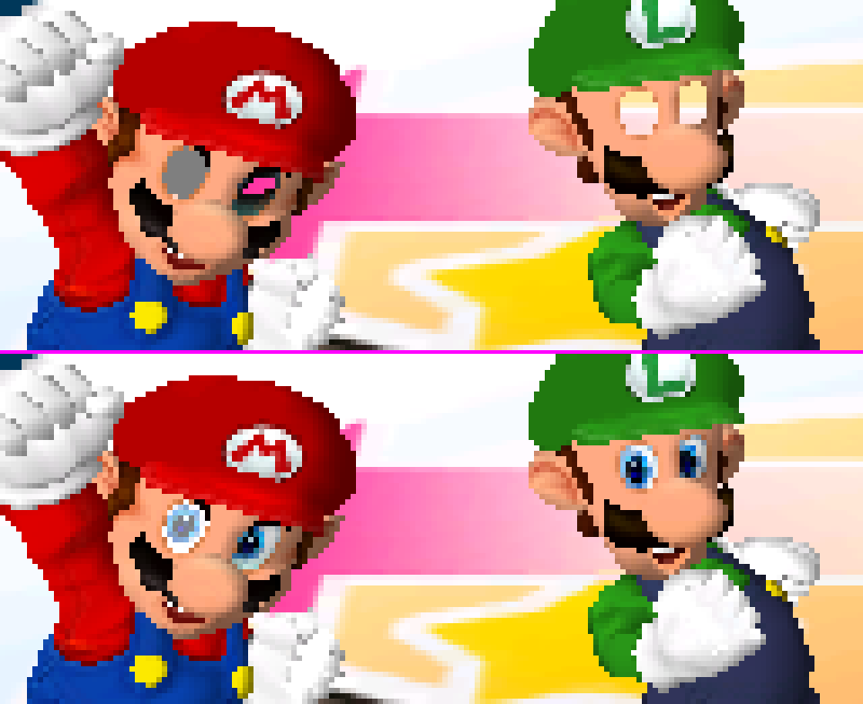

and the part nobody asked for — the left of the same frame, 2×:

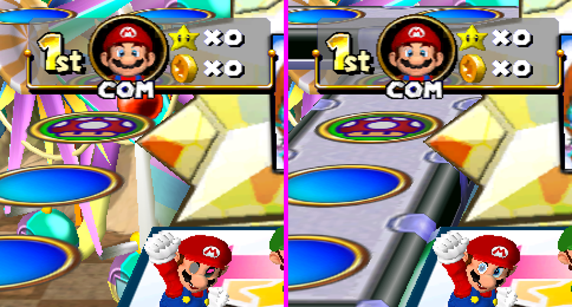

The board's grey walkway with its rounded studs, the green platform side and
its pale rim were **absent** in every build before this one — the background
showed through — and `port/ref/frames/board.png` (the Dolphin reference, a
different moment on the same board) shows exactly those surfaces. The same
two-texture material, the same lost alpha. Full frames:
`m16-board-f07000-{before,after}.png`.

**The md5 verdicts, re-based with that justification:**

| frame | §30 md5 (= `--noregfix`, to the byte) | M16 md5 | pixels differing | what |
|---:|---|---|---:|---|
| 800 | `eb6c3189…` | **`05091ad451a79900608af5e12b81707b`** | 607 (0.20%) | the title's 3D characters' eyes: Peach's, Mario's, Wario's, Luigi's |
| 3000 | `8762d432…` | `8762d432…` unchanged | 0 | no such material on the character select |
| 7000 | `b2a679b2…` | `4f9e79f0…` with the rewrite alone; **`9264207cff650a0932aebe1504ed9e34`** after the two bind fixes below (217 px more: Mario's other eye) | 62,674 (20.4%) | the eyes, the walkway, the platform sides |

`ppmdiff.py` on 7000: mean 12.76 levels, 18.8% of channel samples by more
than 8 — not rounding, and not meant to be. The three M16 references are
therefore **800 `60f8b7a0…`, 3000 `8762d432…` (unchanged), 7000
`9264207c…`**, and the final binary produces all three identically under the
batched submit and under `--oldsubmit`.

**The 136 pixels that were not the rewrite's.** With the rewrite in, the
batched submit and `--oldsubmit` disagreed on frame 800 — 136 pixels, all
inside Mario's screen-right eye on the title, paler with a smaller iris in
the batched arm — while agreeing to the byte on 3000 and 7000, and having
agreed on all three before the rewrite. The bisection, one short run each
(`--frames 830 --dumpframe 800`), went: not the ring (`--novar` same), not
multi-draw, not the merge, not the konst split, not the TEV cache
(`--oldtev` same), not the rewrite itself (`--noregfix` differed from
`--noregfix --oldsubmit` too, `16da4571…` against `eb6c3189…`), not the
compare-first setters as a group and then not any one of them (`--cmpmask`,
added for this: only `GXSetBlendMode`'s bit reproduced it — i.e. any
batching of two faces of one material did), not the deferral (`--batchmax 1`,
one segment per batch with the flush still deferred, was exact), not `first`
(`--segrebase 1`, every segment from its own base at `first = 0`, still
wrong) — and then `--segrebase 3`, which re-ran `gx_tev_apply` per segment,
produced a *third* picture. `gx_tev_apply` was not idempotent. `--gltrace F`
(new: every GL call the shadow lets through in the forty frames up to F,
with arguments) put the two arms side by side: 71,961 lines each, identical
in every argument except `first`, and different in the *position* of one
`glBindTexture unit 1 name 378` — the per-list arm re-bound a texture it had
bound eleven calls earlier, with nothing in between that should have moved
it. Two M15-era bugs, both in the textureless-stage path:

* `glc_white_texture()` creates the 1×1 white texture with a raw
  `glBindTexture` on whatever unit is active — which, in the middle of
  `gx_tev_apply`, is the unit *before* the textureless one, just bound to
  its own texture — and recorded the white name into that unit's shadow.
  Honest shadow, wrong picture: that unit drew **white** until the next
  apply re-bound it, and whether that was before or after the draw was the
  submit shape. Worse, `glc_invalidate()` zeroed the name, and the title's
  EFB copy-with-clear invalidates every frame, so the white texture was
  **re-created every frame** — a leaked texture object per frame and the
  clobber re-armed each time. It now restores the unit's binding, and the
  name survives invalidation (it is an object, not shadowed state) until
  `gl13_shutdown`.
* `tex_bind_finish`'s `glTexParameteri` block (and its two copies) ran after
  a `glc_bind_texture` that says nothing to GL — not even `glActiveTexture`
  — when the unit already holds the name, so a texture's wrap and filter
  went to whichever unit was active. 29 pixels on the title. It sets the
  unit first now.

After both, the arms agree to the byte with and without the rewrite
(`60f8b7a0…` / `ef40512f…`), `--batchmax`, `--segrebase` and `--gltrace`
stay in as diagnostics, and frame 800 is re-based once more:

| frame | M15 | after the two bind fixes, `--noregfix` | **M16** | |
|---:|---|---|---|---|
| 800 | `eb6c3189…` | `ef40512f…` (250 px: the units that drew white) | **`60f8b7a02be457d58a0cf705c647b83f`** | eyes |

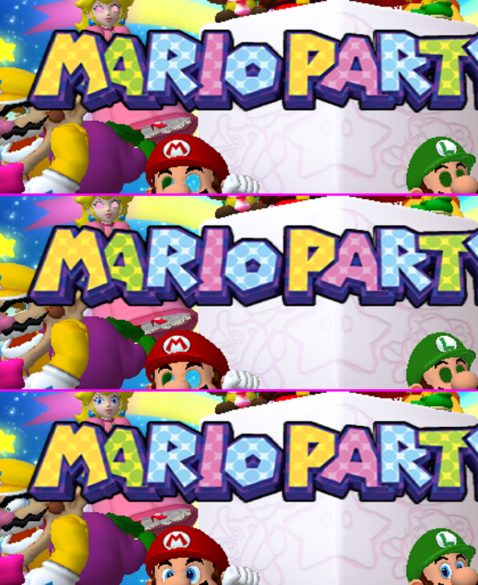

The lesson is §0's: "the md5 changed" was not the finding, and neither was
"the batched arm is wrong" — the per-list arm had been drawing one eye with a
white texture since M15 and nothing had compared two submit shapes before.

### 31.4 The konst collision: two instruments, and a constant that was one thing when it is two

§30.5 asked which count was right, §29.3's **1,824** or §30.5's **105,250**.
Neither is a count of anything a frame would recognise, and the reason is
where the number came from: `gx_warn(…two different constants…)` fires inside
`emit_channel`, which since M13 runs only on a **TEV cache miss** (93% of
applies skip it, §28.5). So the figure is "collisions among the configs the
cache happened to re-emit in the frames that were drawn", and it moves with
both:

| run | frames drawn | `--gxwarn` collision count |
|---|---:|---:|
| §29.3, `--ffto 7000 … --frames 7100` | ~100 | 1,824 |
| this session, the same window | ~100 | 1,843 |
| the 9,000-frame walk, `--oldsubmit` | 9,000 | 140,832 |
| the same walk, batched (fewer applies, different miss pattern) | 9,000 | 146,804 |
| `--ffto 6500 … --frames 9000` (M15 build) | 2,500 | 46,906 |

§30.5's 105,250 is a run with a different drawn-frame count, and both of the
earlier figures were honest readings of an instrument that does not measure
the degradation. The instrument now does: `cfg_konst_collisions` is set when
a config is emitted and **charged to every draw that uses it**, hit or miss
(`gx_tev_report`):

```
port> tev: konst collision (two constants in one stage): 319813 of 1960066 draws carry one, in 136101 distinct configs
```

**One draw in six** on the walk carried a stage in which the port had dropped
a constant. That was worth reading closely, and the reading changed the
question. `emit_channel` claimed the unit's single `GL_TEXTURE_ENV_COLOR` as
*one four-float value* shared by the colour combiner and the alpha combiner.
But GL never couples them: a colour operand reads the constant's RGB and an
alpha operand reads its A. hsfdraw.c sets every stage's colour konst and alpha
konst separately (`SetKColorRGB`: `GXSetTevKColorSel(stage, K_n)` and
`GXSetTevKAlphaSel(stage, K_n_A)`, and `GXSetTevKAlphaSel(all, KASEL_1)` at
the top of `FaceDraw`), so a stage whose colour used `K0.rgb` and whose alpha
used `K0.a` "collided" with itself — harmlessly, since the alpha it fell back
to was K0's — and a stage whose colour used `K0` and whose alpha wanted the
literal `1.0` got **K0's alpha instead**, which is a real error every time
`K0.a` is not 255. The constant is now claimed in halves (`konst_set` is a
bitmask, RGB and A), a zero argument that survives the shape table claims its
half as black rather than reading whatever the other half left there, and a
collision is only a collision *within a half*. `--oldkonst` is the pre-M16
claim, for the A/B.

**After the split**, on the final walk: **72,279 of 1,960,001 batches**
(3.7%, down from 16.3%) still carry a stage that genuinely needs two
different constants in one half; per primitive (`--oldsubmit`) it is
969,229 of 8,411,126, 11.5%, in 9,380 distinct configs. The md5 effect of
the split alone was nil on frame 800 (`--oldkonst` in the bisection gave the
same md5) and is folded into the 7000 re-base; a real collision is now a
real degradation, and its count is the one the fragment-shader decision
should be made on.

**The `GL_ATI_text_fragment_shader` verdict.** After the split, what is left
in a stage that fixed function cannot say is: a genuine two-constants-in-one-
half stage; the register writes §31.3 does not rewrite (5,665 stage emissions
on the walk: the reflection and `texCol == 1` shapes); four-input stages
(`a`, `b`, `c`, `d` all live — 0 on the walk); `GX_TEV_COMP_*`, biases and
`DIVIDE_2`; and specular (`GXInitSpecularDir`, 44,902 — a lighting-model
degradation the fragment shader would not touch, since it is the vertex
program's). A text fragment shader per TEV config would close every one of
those except specular in one mechanism — and it would also replace the
crossbar rewrite with a straight transcription. It is the right *next*
rendering lever. It is not done in M16, for the reason §3.9 gave: the
extension's syntax is thinly documented, the R200 budget (two passes of 8
ALU + 6 texture instructions, 6 temporaries, 8 constants) has to hold a
register allocator for PREV/REG0-2 plus the textures, and the A/B discipline
would re-base all three frames at once for a change whose *speed* effect is
unknown. The honest precondition is a measured list of the stages it would
change, which §31.4's per-draw counter now produces for the konst case and
`--gxwarn`'s new register line produces for the register case.

### 31.5 The fault the new build exposed was the retail game's

Every `--minigame` run on the M16 build died the moment the instruction
screen's players jumped into the minigame box — `signal 10 at address
0x7cc833`, `pc` in `CharMotionVoiceOnSet`, called from `instDll`, five runs of
five, with the ring, the batches, the register rewrite and the konst split
all switched off. The M15 build had run the same command that morning.

`instDll/main.c:518`:

```c
            if (time == 0) {
                Hu3DModelAttrReset(playerMdlId[j], HU3D_MOTATTR_LOOP);
                CharMotionVoiceOnSet(charNo[i], motId[i][1], 1);
                CharMotionSet(charNo[j], motId[j][1]);
```

`i` is the 46-frame counter, `j` the player; `charNo` is `s16[4]`. For every
player whose delay is not zero the call reads past the array into the frame
and the stack below it and indexes `charWork[]` with the result. The retail
game does this too — the matching build has the same over-read — and gets
away with it because the residue on the console's stack is small. What the
M16 build changed is *the residue*: a GX setter can now submit a batch, so the
draw path and the GL driver run below the game's frame from call sites they
never ran from before, and the bytes `charNo[5]` reads are theirs. Patched in
`port/patches.txt` to the index the author meant (`charNo[j]`, as on lines
467, 489 and 492), written up as Part Three of `decomp-struct-notes.md`, and
the first M16 `--minigame` runs after the patch reached their measurement
windows (§31.6).

### 31.6 What M16 shipped, and what it did not

**Shipped, with a witness on the G4:**

| | |
|---|---|
| the vertex ring, the fences, the cross-list batch, multi-draw (§31.2) | title +40%, character select +23%, board +15%, `m432` +21%, `m427` +11%, same binary, `--oldsubmit`; the three md5s identical on both arms |
| the setters' compare-first (§31.2) | batches 7.5M → 1.96M on the walk, GL calls −67% |
| the TEV register rewrite (§31.3) | eyes on the board and the title, the walkway and platform sides back; `--noregfix` reproduces §30 |
| the two texture-bind fixes (§31.3) | the white texture created once, not once a frame; `glTexParameter` on the right unit; the two submit shapes agree to the byte |
| the per-draw konst counter and the RGB/A split (§31.4) | 319,813 of 1,960,066 draws before the split; `--oldkonst` |
| `instDll/main.c:518` (§31.5) | five faults of five → both minigames reach their windows |
| `--submitstats`, `--gxwarn`'s register line, `--gltrace`, `--cmpmask`, `--batchmax`, `--segrebase`, `--nomerge`, `--nomultidraw`, `--novar`, the three profiles | |

**Not done, and why:**

* **The konst split's own md5 A/B on 3000 and 7000** (`--oldkonst` against
  default); on 800 it changed nothing.
* **The `GL_ATI_text_fragment_shader` backend** — argued in §31.4, not built.
* **The decode** — 39% of `m432`'s frame after this milestone; the next
  per-vertex lever (§31.1).
* **The strip → indexed conversion**, §31.2's last paragraph; and the
  reflection / `texCol == 1` register shapes (5,665 stage emissions) §31.3
  leaves folded.
* **The oracle frame with a message window** (§30.8 item 3). Not taken.
* **Two and a half hours of the afternoon** went to a dead wire: littlejelly's
  `enp1s0f0` lost carrier at 14:32 and the laptop was suspended by its lid
  from 14:43; `g4-witness.md` §0d.

### 31.7 What M17 starts with

1. **Read the soak's log first.** Left running at the end of M16 on the final
   build: `g4 run --soak --com4 --rtc dolphin --freshcard --snap-every 5000
   --snap-keep 3 --status --ovllog --stuckwatch 200`. The M16 build has never
   run a full board unattended, and a batch flushed from inside a GX setter
   is a new place for the game to be when a fault happens.
2. **The decode**, with `m432` as the scene (§31.1: 2,600 of 6,653 samples).
   The M9 cache was exact and slower because it hashed the arrays; the
   question is whether the arrays a *static* model indexes can be proved
   unchanged more cheaply than by reading them.
3. §31.4's fragment-shader decision, once the per-draw counts after the konst
   split and the register line say how many draws are still degraded.
4. §31.6's small list: the konst A/B, the message-window oracle, the two
   register shapes still folded.

## 32. M17 log — the game at console speed, and the picture when the card can *(2026-09-18)*

Every number the port has reported since M5 carried the same asterisk: an
idle-gated retrace hides overruns, so "23.4 fps on the board" was also the
game running at 39% speed — every animation, every COM's think time, the
music's tempo against the clock, stretched by the same factor. M17's brief
was the user's: *"a frame mode … run it at real speed, real gameplay, with
the target being 30 frames per second across the game (maybe hitting more,
but capping at 30)"*. The definition of done was real-time game speed with
the display capped at 30, and that is what shipped (§32.1): the game's
retrace runs at 60 Hz on the wall clock, the renderer draws the frames it
can, and the reference md5s hold to the byte.

Then the two costs that decide how many frames that leaves for the picture:
the decode (§32.3: the 7450 converts an integer to a float through memory,
and every S8 normal paid it three times), and the game side, profiled for
the first time (§32.4: the CPU skinning, the mixer, the material walk).

Also found on the way: the G4 is a **dual** 1 GHz (PowerMac3,5, `hw.ncpu 2`),
which nobody had checked; Apple's multithreaded GL engine turns on and is
twice as slow (§32.3); and AltiVec lost again, exactly (§32.4).

### 32.1 Frame mode: two clocks instead of one

`src/platform/framemode.c`, on by default (`--realtime`; `--lockstep` is the
pre-M17 gate on the same binary, and `--turbo`, `--nodraw` and `--headless`
imply it, because each is a measurement a skipped frame would falsify).

* **The retrace is the wall clock.** `VIWaitForRetrace` sleeps to the next
  1/59.94 s even under `--rtc`; the deterministic clock is still a function
  of the retrace count, the pad is still sampled once per retrace, the mix
  is still 3.34 DSP frames per retrace, so a `--play` script or a `--seed`
  run sees the same inputs at the same retrace numbers as before. Falling
  behind is caught up through (the game runs flat out until it is on
  schedule); more than a second behind is a *resync*, logged and counted as
  lost game time (a quarter second in lockstep, as before).
* **The renderer draws when it can.** Before the game builds a frame the
  gate decides whether it is *drawn* or only *consumed* — the GX interpreter
  in the `--nodraw` shape M10 built: setters run, display lists are read and
  dropped, nothing decoded, nothing reaches GL. The rules, in order: never
  two drawn frames in a row (the 30 cap); not drawn if the gate is more than
  half a period late; but never more than `--maxskip` (5) consumed frames in
  a row, so the picture cannot freeze; and a `--dumpframe` frame or a
  pending F12 shot is always drawn.
* **What had to move for the md5s to hold.** The `GXCopyDisp` clear used to
  run right after the swap; a consumed frame in between may ask for a
  different colour, so it now runs at the *start* of the next drawn frame
  (`gl13_begin_frame`, which in lockstep is the same instant as before). A
  `GXCopyTex` on a consumed frame has no EFB to copy and reads the **front
  buffer** instead — the last picture presented, one drawn frame stale. The
  first witness only did this for whole-screen copies (the wipe's crossfade)
  and dropped region copies as "redone by the next drawn frame"; the
  mode-select stage's bubbles copy the region behind each bubble once and
  draw it for as long as the bubble lives, and every one was a yellow square
  until region copies read the front buffer too. (The squares that remain
  are the pre-existing `GXSetTevIndWarp` drop — frame 2100 is byte-identical
  under `--lockstep` and `--realtime`, `f43445ad…`;
  `screenshots/m17-modesel-bubbles-indwarp.png`.)
* **The audio's lead.** Paced to real time, the ring's fill is only ever
  what the game got ahead by, and a drawn frame that overruns by 30 ms
  drains it. `--audiolead` (100 ms) queues that much silence once before
  pacing starts and again after a resync; the ring is 2 s now (256 KB),
  because catching up a second of backlog delivers a second of mix in a
  burst and the old 64 KB dropped 414 ms of it to overrun.
* **The instruments.** `--perfwin` and `--status` report speed % (game
  seconds over wall seconds), presented fps and the skip ratio next to the
  numbers they already had; `--perfdump FILE` writes every per-frame sample
  as CSV; frames over 100 ms and every resync are logged with their frame
  number; the shutdown report has a `--realtime` block.

**The 9,000-frame walk** (`--realtime --com4 --rtc dolphin --freshcard --play
board-start-com4.play --frames 9000`, the final build):

| scene | speed | presented fps | skipped | consumed frame | drawn frame |
|---|---:|---:|---:|---:|---:|
| title (700–870) | **99.1%** | 15.3 | 74% | 3.6 ms (game 1.4) | 55 ms (gx 43) |
| character select (2600–3600) | **100.0%** | 11.3 | 81% | 8.1 ms (game 6.0) | 54 ms (gx 42) |
| board (6000–8900) | **100.0%** | 10.3 | 83% | 11.2 ms (game 9.1, aud 2.0) | 43 ms (gx 29) |
| whole walk | 99.1% | 15.4 | 74% | | |

(`--perfdump` medians; the walk before the decode work of §32.3.) The three
reference frames come out **byte-identical** to §31's on every realtime run
of the milestone — 800 `60f8b7a0…`, 3000 `8762d432…`, 7000 `9264207c…` — as
they must, since a dumped frame is drawn onto a buffer cleared with the
right colour by the rule above.

The board reads the budget exactly: a consumed frame costs 11.2 ms and a
drawn one 43, so every drawn frame needs five consumed ones to pay for
itself, the skip cap is what is presenting, and the presented rate is 60/6.
Presented fps = 60/(k+1) with k the smallest integer such that
k·consumed + drawn ≤ (k+1)·16.7; **the consumed cost is paid sixty times a
second and is the larger lever** — 11.2 → 8 ms would give 15 fps on the
same drawn frame, 30 ms drawn on 8 ms consumed would give 20.

**The 21.7-minute chained soak** (`--soak --turns 3 --com4 --rtc dolphin
--freshcard --realtime --stuckwatch 200`, 77,814 retraces): game 1298.2 s
against wall 1303.7 s — **99.6% speed**, 17.1 presented fps overall, one
3-turn board played through results → `modeseldll` → `mentdll` → the second
board's first turn, no crash. Five resyncs dropped 5.1 s: the board's load
(a 358 ms `HuDvdDataRead` stall then two 300-400 ms cold-texture-cache
frames, 1.1 s behind) and three inside `m409dll`, which runs at 85-90% —
its drawn frame is so heavy that even one in six overruns the budget
(§32.4; `--maxskip 9` would trade its picture for its speed). Audio: 665
underruns totalling 6.1 s, all of them the stalls above minus the 100 ms
lead (45 stalls over 100 ms, 10.4 s in total, 11 of them consumed frames
= scene loads); steady-state gameplay does not underrun. Two `STUCK` lines
are the chain's designed 200 s waits at `modeseldll` and `mentdll` (§29),
each answered by the navigator. Log
`docs/soak/m17-soak3-realtime.log.gz`, samples
`m17-soak3-realtime-perfdump.csv.gz`, board `screenshots/m17-realtime-board-turn1.png`.

### 32.2 What the decode is made of, measured before it was cut

`--decodestats` (new) answers §31.7's question per decoded vertex, over the
walk's 411 million:

* **0.9%** of vertices have all their indexed attributes on one index — the
  HSF exporter gives positions, normals and texcoords separate index
  streams — so binding the game's own arrays as they stand is out;
* **89.5%** are the first occurrence of their (arrays, indices) tuple in
  their frame, and more in their batch — faces do not share vertex tuples
  (per-face normals), so a vertex cache handing back GL indices would skip
  at most a tenth of the decodes. Not built;
* the plan shapes are eight, all `GX_INDEX16`: POS f32 / NRM f32 / TEX0 f32
  (49% of vertices), POS / NRM s8 / TEX0 (39%), the same two without a
  texcoord (7%, 1%), and four with an RGBA8 colour (4% together). No shape
  stores a colour in `pending`: the register material wins with no CLR0 in
  the descriptor.

### 32.3 The decode, cut three ways

**The byte tables.** A 32-bit PowerPC has no integer-to-float instruction:
`(f32)(s8)b` is two `stw`, an `lfd` that hits both of them — a load-hit-store
stall the 7450 pays in full — `fsub`, `frsp`, `fmuls` (read off
`build-ppc-darwin/gxcall.s`). The HSF normals are S8 (`hsfdraw.c:511`), so
every vertex of 47% of the walk paid it three times. `build_decode_plan`
now hands S8/U8 steps a 256-entry table of the very expression they
replace, evaluated once, so it is exact by construction.

**The specialised loops.** The plan walker paid a switch per attribute (an
indirect branch the 7450 predicts badly) and a load of every step field;
the eight shapes above have a loop each with the sequence fixed at compile
time (`DECODE_FAST`), and they prefetch the next vertex's array entries
(`dcbt`) since the indices are right there in the list. 82.6% of the
walk's vertices go through them.

**The A/B**, same binary, `--turbo` lockstep, the §21.1 walk, each column
adding one lever to the one before it (`--olddecode2` = the arithmetic in the
loop, `--olddecode3` = the general walker, `--noprefetch`):

| scene | M16 (§31.2) | byte tables | + specialised loops | + prefetch | change |
|---|---:|---:|---:|---:|---:|
| title (700–870) | 20.97 fps | 25.60 | 27.97 | 23.47 † | +12…33% |
| character select (2600–3600) | 18.95 | 19.59 | 20.39 | **20.57** | **+8.5%** |
| board (6000–8900) | 23.42 | 25.00 | 25.88 | **26.53** | **+13%** |
| gx ms/frame, board | 28.44 | 25.70 | 24.27 | **23.47** | −17% |
| wall clock, 9,000 frames | 352.3 s | 332.9 | 320.9 | **316.6** | −10% |
| `m432dll` (10900–11800) | 14.77 | | | **19.36** ‡ | **+27%** |

† the title window is 171 frames and swings ±10% run to run (25.6, 26.1,
25.9, 28.0, 23.5 across five runs of near-identical builds); the two
long windows are stable to ±1% and are the ones to read. ‡ `--minigame
m432 --ffto 10700 --frames 11800`, both levers against `--olddecode2
--olddecode3` on the same binary: 15.26 → 19.36, gx 52.3 → 38.4 ms. The
three md5s are identical on every arm.

**Measured and not taken:**

* `-mcpu=7450 -mtune=7450 -mno-altivec` on every object (`TUNE=` in the
  Makefile): the same source built both ways, 25.89/19.68/24.92 against
  26.13/19.74/24.82 — within noise, md5s identical. Left on; it costs
  nothing and the scheduling is at least the right core's.
* `--mpgl`, Apple's multithreaded GL engine: `CGLEnable(kCGLCEMPEngine)`
  **succeeds** on Leopard's Radeon 9000 driver and the md5s hold — and the
  walk is **twice as slow** (12.7 / 8.2 / 13.3 fps, 707 s). Every one of the
  ~30,000 GL calls a frame crosses a thread, and the ring's fences and
  flushes serialise the two. The second CPU is real, but the driver is not
  how to reach it from this call shape.

**The drawn frame after the cut** (`docs/soak/m17-board-drawn-profile.txt.gz`,
`--ffto 6500 --turbo`, 7,135 samples): the decode is 16% (1,140 in the
specialised loops, 144 in `begin_attr_order`), the submit 46% — of which the
driver's own `gleDrawArraysOrElements_VAR_Exec` → `gldUpdateDispatch` →
`gldInitDispatch` chain is 1,250 (17.5%), the immediate-mode sprites' `IMM`
path 484 (6.8%), `gx_tev_apply` 476, `gx_vprog_bind` 268 — and the game side
the rest. The driver's per-batch cost is now the largest single block, and
the batch count is set by `GXLoadPosMtxImm` (693K of the walk's 1.96M
batches, §31.2): the next lever is a **matrix palette** — the position and
normal matrices as indexed program parameters (`ARL`; 192 native params,
6 per object) with a per-vertex matrix index, so a batch spans objects.

### 32.4 The game side, profiled for the first time

A consumed board frame under `--nodraw --turbo` (`m17-board-nodraw-profile`,
7,200 samples on the game thread; the whole frame is "game"):

| | samples | % | inside |
|---|---:|---:|---|
| `EnvelopeProc` — the CPU skinning | 2,192 | **30%** | `SetEnvelopMtx` 747 (the per-bone chain: `PSMTXTrans`, three `PSMTXRotRad` = `sinf`/`cosf` 463, four `PSMTXConcat`), `PSMTXROMultVecArray` 681, `Hu3DMtxScaleGet` 532 (six libm `sqrt`s a bone: 339, `C_VECNormalize` 300) |
| `port_audio_tick` — the MusyX mixer | 1,584 | **22%** | `port_musyx_mix_frame` 947 self, `voice_decode_advance` 375 |
| `Hu3DDraw` — the object walk and the material setup with nothing drawn | 1,129 | 16% | `objCall`/`objNull` recursion, `FaceDraw` 449 (`Hu3DLightSet`, `GXSetTevKAlphaSel`, `SetTevStageNoTex`, `LoadTexture`), `ObjCullCheck` 298 |
| `Hu3DMotionExec` — motion curves | 928 | 13% | 496 self, `GetObjTRXPtr` 151, `GetCurve` 128 |
| `Hu3DDrawPost` | 498 | 7% | `particleFunc` 205, `DrawSpaces` 168 |
| `C_MTXConcat` (all callers) | 581 | 8% | |

`m409dll`'s consumed frame is the same shape plus the module's own
`fn_1_602C` at 6.6% (`m17-m409-nodraw-profile`); its shortfall at real time
is the drawn frame, not this.

**The top three, for a game-side patch later** (`port/patches.txt`):

1. **`SetEnvelop` / `SetEnvelopMtx`** (EnvelopeExec.c) — per bone per frame:
   `Hu3DMtxScaleGet` takes three magnitudes and three normalisations (six
   `sqrt` through libm, no hardware sqrt on a 7450) to decide whether the
   bone is scaled, and it is almost never scaled; `SetEnvelopMtx` builds
   T·Rz·Ry·Rx with four general 3×4 concats where each rotation is a sparse
   matrix. Skipping the zero terms is exact (a fused `a·0 + b` is `b`).
2. **The mixer** (`musyx_mix.c`) — 2 ms a frame, 12% of the real-time
   budget on its own; nine bus ramps and a 64-bit clamp per sample for
   every live voice, whether the bus is live or not.
3. **`Hu3DMotionExec`** (hsfmotion.c) — 13%, the curve evaluation per
   object per frame.

**(a) AltiVec, exactly, and slower.** `PSMTXROMultVecArray` in AltiVec
(`psmtx_c.c`), in GCC's own contraction order so `vmaddfp` gives the same
bits — `fmuls` of the middle product, `fmadds`, `fmadds`, `fadds`, read off
`psmtx.s`; the first product is a `vmaddfp` with −0.0 as the addend.
`tests/mtx_test.c` runs 540,000 random vertices (every alignment a 12-byte
stride visits, in place and out) through both: **0 differ** on the G4. On
consumed board frames, three runs: scalar 10.46 ms, AltiVec 10.82 and 10.85.
The unaligned loads, the permutes and the three element stores per vertex
cost more than the FPU pipeline GCC already builds for the scalar body —
§15.6's verdict, again. It ships as `--altivec`, off. `C_MTXConcat` was not
attempted: its cost is the 24 loads, and a vector form has the same loads
plus splats.

**(b) The compiler:** measured in §32.3, nothing. `-O3` was not tried; the
walk is noise-limited at 1% and −O3's changes to the game's float code
would need the md5s re-argued for a gain that −mcpu did not show.

### 32.5 What M17 shipped, and what it did not

| shipped, with a witness | |
|---|---|
| frame mode (§32.1), on by default | 99.1 / 100 / 100% speed on the walk, 99.6% over a 21.7-min chained soak; md5s 800/3000/7000 identical on every realtime run |
| the byte tables, the eight specialised loops, the prefetch (§32.3) | board 23.42 → 26.53 fps, character select 18.95 → 20.57, `m432` 15.26 → 19.36; md5s identical on every arm |
| `--decodestats` and its two answers (§32.2) | |
| the three profiles (§32.3, §32.4) and the top three | |
| `PSMTXROMultVecArray` in AltiVec, `--altivec` | bit-exact over 540,000 vertices; 3.5% slower |
| `--perfdump`, the stall and resync lines, `--audiolead`, the 2 s ring, `--maxskip`, `--mpgl`, `--olddecode2/3`, `--noprefetch`, `TUNE=` | |

**Not done, and why:**

* **30 presented fps at real time.** The board presents 10 (the cap), the
  menus 11-15. Both costs are now measured to the sample: the consumed
  frame (11.2 ms, §32.4) and the drawn frame's driver share (§32.3). The
  matrix palette and the three game-side patches are the next two levers.
* **`m409dll` at 85-90%**: its drawn frame overruns even one in six.
  `--maxskip 9` recovers the speed at 6 fps; a policy that stretches the cap
  only while the gate is over a period behind would do that by itself.
* **The scene-change stalls** (200-400 ms of cold texture decode at every
  scene's first drawn frame; 257 MB decoded at 26 MB/s over the soak) are
  what the audio underruns are. A faster texture decode is a milestone of
  its own.
* **Strips → indexed** and the `GL_ATI_text_fragment_shader` backend (item
  4): not started; the profile put the driver's cost in the per-batch
  validation, not in the strip loop.
* The AltiVec `C_MTXConcat`, `-O3`, a mixer fast path.
* **A snapshot is a 3 s stall.** The leave-behind soak's `--snap-every 5000`
  writes 40 MB synchronously (§24.2: 3.1 s), which at real time is a resync
  every 83 s of game (`resync at retrace 10006, 3459 ms behind`). The ring
  needs to be written off the game thread, or the soak run without it.

### 32.6 What M18 starts with

1. **Read the soak's log first.** Left running on the final build: `g4 run
   --soak --com4 --rtc dolphin --freshcard --realtime --snap-every 5000
   --snap-keep 3 --status --ovllog --stuckwatch 200`. It is the first
   overnight run at real speed; the `speed %` on the status lines and the
   `stall:`/`resync` lines say where the game cannot keep up.
2. **The matrix palette** (§32.3): batches spanning `GXLoadPosMtxImm`.
3. **The three game-side patches** (§32.4), each an exact rewrite.
4. `--maxskip` stretching under a persistent overrun; the texture decode.

## 33. M18 log — the skinning that only had to run when a frame was drawn, and the palette that ran in software *(2026-09-19, littlejelly)*

M18's brief was the two costs §32 left measured to the sample: the consumed
frame (11.2 ms on the board, paid sixty times a second) and the drawn one
(43 ms). Its named lever was the vertex-program matrix palette — batches
spanning `GXLoadPosMtxImm`, the character meshes skinned by the card from
their rest pose. The palette was built, made exact, and measured
(§33.2): **it is slower on this driver**, because the Radeon 9000's
relative parameter addressing runs in software however native the driver
says it is. What shipped instead is the half of the design that did not
need the card at all: the game's CPU skinning, deferred to the drawn frame
and skipped on the consumed one, bit-identical by construction (§33.3).
On the same binary at real time the **board goes from 13.2 to 17.9 presented
fps at 100% speed**, and against the M17 binary from 12.5.

Before any of that, the soak §32.6 said to read first had a finding of its
own: the port slows down as the process ages (§33.1), and the reason was
the texture cache's 130 MB of textures on a 64 MB card.

### 33.1 The long-running process slows down

The M17 leave-behind soak (§32.6 item 1) ran the board at 99% real-time
speed with 14 presented fps on turn 1 and at **80% with 8 fps on turn 12**
(255 resyncs in 45 minutes; `docs/soak/m18-aging-soak-m17build.log.gz` is
the instrumented re-run). The first question was whether the game state or
the process had grown: `--restore` of the soak's own frame-150,000 snapshot
into a fresh process ran the same board, same turn, at **100% with no
resync** (turbo 27 fps, the turn-1 figure). So the process.

The status line now carries what the process holds — the texture cache's
GL-resident bytes and the RSS — and the re-run of the soak with it read:

| frame | scene | speed | presented | textures held by GL | RSS |
|---:|---|---:|---:|---:|---:|
| 2,400 | mode entry | 102% | 16.3 | 32 MB (249 entries) | 93 MB |
| 44,100 | `m444dll` | 101% | 12.1 | 110 MB | 191 MB |
| 62,460 | board turn 5 | 114% | 11.4 | **139 MB, 2,048 entries (full)** | 224 MB |
| 78,060 | `m430dll` | 35% | 4.2 | 142 MB | 229 MB |
| 82,860 | board turn 7 | 95% | 10.5 | 143 MB | 229 MB |

The cache was bounded by *count* (2,048 entries, random replacement when
full) and never by bytes, so after two minigames it held more than twice
the card's memory and the driver paged textures over AGP on every frame —
which is why the board's presented rate fell 14 → 11 → 10 across the first
seven turns while its speed still read 100%, and why a fresh process was
fine. The cache has a byte budget now (`--texbudget MB`, default 40): an
upload that takes it over evicts the least recently bound entries, never
one bound this frame or the last, through a free list the miss path
reuses. The 9,000-frame walk ends with `40503 KB held by GL` and the
`texture budget: 40 MB` line counts the evictions; the leave-behind soak
(§33.7) is the test of the claim, since the slowdown took forty minutes
to show.

Also on the way: `m430dll` runs at 35-37% speed and `m444dll` at 80-85%
on this build, the two heaviest scenes the soak reached.

### 33.2 The matrix palette, built and measured: ARL is software here

The design was §32.6's: the position and normal matrices as slots of the
vertex program's parameter block, every vertex naming its slot, so a batch
spans objects and a skinned mesh's entries are matrices the card indexes.
What was built (`--palette`; gx_draw.c `pal_place`, gx_vprog.c,
gx_skin.c):

* the fixed parameter block trimmed from 64 to 46 params (lights 8 → 2;
  nothing in the game lights with more than one) for **24 slots of 6**
  (three rows of a 3x4 position matrix, three of a 3x3 normal matrix);
* the slot in the vertex's **fog coordinate** (`GL_EXT_fog_coord`, one
  float, `vertex.fogcoord.x` in the program), read through
  `PARAM pal[144] = { program.env[46..189] }` and `ARL a0.x` — the only
  form of relative addressing ARB_vertex_program allows;
* the palette as a **persistent cache**: a slot keeps its matrix across
  batches, a batch pins the slots it uses, a primitive whose matrix is
  resident costs nothing, and the upload is one
  `glProgramEnvParameters4fvEXT` over the dirty range per batch (the first
  build gave every batch a fresh palette and its uploads went from 340 a
  frame to 3,100);
* skinned meshes placed **entry by entry through a window**: `--skinstats`
  found a character body has 43-50 envelope entries (29 single + 20 dual
  weights over 17 pairs; `all` 1,378 vertices, 43 entries; no `multi`
  entries anywhere on the walk), more than any palette holds, so the
  primitive's index list is scanned for the entries it touches and only
  those get slots;
* the per-entry matrices computed with the very PSMTX calls `SetEnvelop`
  uses, in its order, premultiplied by the object's matrices, so the card
  does one multiply; and `GXLoadPosMtxImm`, `GXLoadNrmMtxImm`,
  `GXSetCurrentMtx` and the descriptor setters no longer ending batches.

It is exact for plain objects — frame 800 comes out `60f8b7a0…` to the byte
with every 2D and 3D object of the title going through the palette — and
the probe program loads "under native limits: YES". **And it is slower.**
The same binary over 3,700 frames, `--turbo`, `gx` ms per frame:

| arm | title (700-870) | character select (2600-3600) | batches |
|---|---:|---:|---:|
| `--nopalette` (the pre-M18 shape) | 29.1 | **38.8** | 557,809 |
| palette, `--palnoarl` (arrays, uploads, batching — the program reads env[0..5]) | 31.7 | 46.9 | 604,483 |
| palette, `--palnofog` (ARL, no fog array bound) | 38.3 | 65.1 | 604,483 |
| palette (the design) | 39.4 | **66.7** | 604,483 |

The ARL program alone is 20 ms a frame on the character select and 8 on the
title — a cost that scales with the scene's vertex count, which is what a
vertex program run on the CPU by the driver looks like. Leopard's Radeon
9000 driver reports the program native and executes its relative
addressing in software. The rest (fog array, bulk uploads, the cache's
bookkeeping) is another 8 ms, and the window makes *more* batches than the
material-based split (604K against 558K), not fewer: a body's faces sweep
through 50 entries and a 24-slot window turns over every few hundred
faces.

So the lever §32.6 named is dead on this hardware. The code stays as the
measured answer, opt-in (`--palette`, with `--palnoarl`/`--palnofog` as the
two diagnostics that settled it), and the one thing it found that is not
its own: **four compare-first setters had been flushing unconditionally
since M16.** `GXSetZMode`, `GXSetZCompLoc`, `GXSetCullMode` and
`GXSetAlphaCompare` were given `--cmpmask` groups 16-128 and the default
mask was 15, so a bit that was never set made each of them end the batch
whether or not the value changed (784,556 batch ends on the walk once the
matrix load stopped hiding them). The default is 255 now; the argument is
the same as for the other compare-first setters, the md5s hold, and the
walk's batch count is 1,941,408 against §31.2's 1,960,066.

### 33.3 The skinning, deferred: bit-identical, and most of the consumed frame's game time

The fact under the whole item: **nothing but the draw reads what
`EnvelopeProc` produces.** Its two outputs are the skinned position and
normal buffers (`mesh.vertex->data`, `mesh.normal->data`), read by
`FaceDraw`'s `GXSetArray` and by no game logic (grep of src/game and
src/REL: `m440Dll` and `m438Dll` read vertex data of their own stage
meshes; the board reads none), and the bone matrices `hsf->matrix->data`,
read by one line of `objMesh` (hsfdraw.c:230). `Hu3DModelObjMtxGet` and its
family recompute from the transforms (`PGObjCalc`). So on a *consumed* frame
— frame mode, §32.1: the GX calls are dropped — every cycle of it is
waste, and on a drawn frame the vertex half can run as late as the draw.

`port/patches.txt` plants `port_envelope_proc(hsf)` at the head of
`EnvelopeProc` and `port_envelope_sync(hsf)` before `objMesh`'s read, and
makes `SetEnvelopMtx`, `SetEnvelopMain` and the two table indices extern.
The port (gx_skin.c) then:

1. at `EnvelopeProc`: runs the game's own `SetEnvelopMtx` (the bone walk) at
   once, as the game would, marks the HSF's vertex skinning owed, returns
   1 — `SetEnvelopMain` does not run;
2. at `objMesh`'s read, and at `GXSetArray(GX_VA_POS, p)` when `p` is a
   skinned mesh's buffer (a hooked model is drawn inside its parent's walk,
   before its own `EnvelopeProc` of the frame): if the frame is **drawn**
   and the skinning is owed, runs `SetEnvelopMain(hsf)` on the game's own
   statics and marks it done. On a consumed frame nothing runs.

A body runs at most once per mark and every mark follows the game's own
refresh of the buffers it reads (`InitVtxParm`/`ClusterProc`), which is
what keeps the in-place cluster case exact; a shared HSF drawn by two
models comes out as on the console (both with the last pose written).
`--cpuskin` is the game's schedule, for the A/B.

**Why the bone walk is not deferred too.** The first build deferred all of
`EnvelopeProc` and gained 2 fps more on the board (18.9 presented) — and the
`.wav` of the walk under `--nodraw` diverged from `--cpuskin`'s at retrace
8,108, tiny differences from a DSP frame boundary on: a 3D sound placed a
rounding step away. `snapdiff.py` (which lists every differing span now,
`--spans`) on snapshots at frame 8,100 named hsfdraw.c's `MTXBuf`: the draw
walk builds its matrix stack from the bone matrices, `objNull` for a
skinned model leaves its slot untouched, and `Hu3DModelObjMtxGet` walks the
same stack — so a stale bone matrix on a consumed frame reaches game logic
through a position. With the bone walk on schedule, the same snapdiff shows
**every game global identical** but `EnvelopeExec.c`'s own statics
(`MtxTop`, `Vertextop`, `Meshno`…), and the heap differing only in
coroutine stacks below their live frames and in saved registers (the same
residue two *builds* differ by — §33.4). `--skindeferall` keeps the full
deferral with that price on the label.

**The md5s.** Both arms of the deferred build and the shipping build give
§32's three reference frames to the byte on the 9,000-frame walk: 800
`60f8b7a0…`, 3000 `8762d432…`, 7000 `9264207c…` — as they must, the
arithmetic being the game's own, on the same inputs, later. Nothing is
re-based in M18.

**The cost, three ways, same binary** (`--play board-start-com4.play`,
`--com4 --rtc dolphin --freshcard --frames 9000`):

| | `--cpuskin` (the game's schedule) | deferred (shipping) | `--skindeferall` |
|---|---:|---:|---:|
| consumed board frame, `--nodraw --turbo` (game ms) | 10.61 (8.93) | **7.50 (5.83)** | 6.36 (4.70) |
| consumed character-select frame | 7.57 (5.93) | — | 5.12 (3.50) |
| drawn board frame, `--turbo` | 38.1 ms, 26.3 fps | 38.1 ms, 26.2 fps | 38.0 ms, 26.3 fps |

The consumed frame drops by 3.1 ms (29%) — more than the profile's 30% of
"game", because `--nodraw`'s frame is nothing but game — and the drawn
frame is unchanged: the skinning still runs on it, once, at the draw.

**Real time, the table the milestone is judged by** (`--realtime`,
`--perfdump` medians; speed is game seconds over wall seconds):

| scene | M17 binary | M18 `--cpuskin` | **M18 (shipping)** | M18 `--skindeferall` |
|---|---:|---:|---:|---:|
| title (700-870): speed / presented | 99.1% / 21.2 fps | 99.4% / 20.9 | **99.1% / 20.1** | 99.2% / 20.9 |
| character select (2600-3600) | 100.0% / 12.4 | 100.2% / 12.4 | **100.1% / 13.9** | 100.0% / 14.3 |
| board (6000-8900) | 100.0% / 12.5 | 100.0% / 13.2 | **100.0% / 17.9** | 100.0% / 18.9 |
| board consumed frame (game + aud) | 11.1 ms (9.0 + 2.1) | 10.7 (9.1 + 1.6) | **7.7 (5.8 + 1.8)** | 6.7 (5.1 + 1.6) |
| board drawn frame (game + gx + aud) | 38.6 (11.2 + 25.0 + 2.0) | 38.6 (11.3 + 25.1 + 1.6) | **38.8 (11.3 + 25.2 + 1.8)** | 38.9 (11.6 + 25.2 + 1.6) |
| board skipped | 79% | 78% | **70%** | 68% |
| resyncs over the walk | 1 (the board load) | 1 | 1 | 1 |

(`docs/soak/m18-{m17-rt,rt-cpuskin,rt-final,rt-deferred}-perfdump.csv.gz`;
the `--cpuskin` column is the M17 build's own gain from the mixer and the
setters, §33.4/§33.2.) §32.1's budget arithmetic predicted k = 3 → 15 fps
for a 7.7 ms consumed frame against a 38.8 ms drawn one; the gate does
better than the integer model because a drawn frame that comes in under
budget lets the next skip count be two.

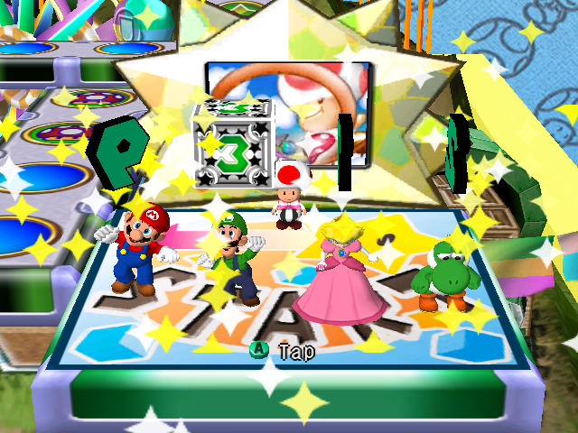

### 33.4 The three game-side patches, the mixer, and what the .wav can and cannot say

**Item 2, the three patches §32.4 named**, mostly moot after §33.3: on a
consumed frame none of `Hu3DMtxScaleGet`, `SetEnvelopMtx`'s rotations or the
envelope's concats run any more except the bone walk, and on a drawn frame
they are 2.7 ms of 38.8. What shipped is the one that is exact and free:
`PSMTXRotRad`'s `sinf`/`cosf` pair goes through a 1,024-entry memo keyed on
the angle's bits (`port_sincosf`, patched into `mtx.c`; `--nosincos`) —
the same libm values for the same input — and **57.8%** of the walk's
4.3 million calls hit it. `Hu3DMtxScaleGet`'s six square roots have no
exact shortcut (the `!= 1.0f` tests are on the computed magnitudes, and a
`frsqrte` refinement is not libm's `sqrt`); an AltiVec `C_MTXConcat` was
declined for §32.4's reason. Neither is worth its md5 argument for a share
of the drawn frame under 1 ms.

**Item 3, the mixer.** `render_voice` did five 64-bit multiplies and four
64-bit compares per sample per voice on a 32-bit PowerPC. Every operand
there is bounded — an s16 sample out of the resampler, a 0..0x8000
envelope, an s16 bus volume, a ±0x7fffff bus — so the products and sums
fit an s32 and the arithmetic shift and the clamp give the same bits
(`apply_gain32`, `mixcheck_acc`; the studio-input path keeps the 64-bit
form, its gain being a widened u16 on a bus value). `--mixcheck` runs the
64-bit form beside the 32-bit one on every sample: **205,880,245 checks
over the walk, 0 disagreed.** The mixer's frame went from 466.6 to 360 µs
(`musyx_mix: --perf` mean, `--nodraw`), `aud` from 2.1 to 1.6 ms a retrace.

**What the .wav cannot say.** The plan was to prove item 3 with the `.wav`
of the walk against the M17 binary, and the two differed — from retrace
1,580, mostly by one level. So did two *M18* builds that differ only in
dead diagnostic code (`--mixcheck` off), and so did `--cpuskin` against the
deferral on one build, from the same retrace. On one binary with one flag
set the `.wav` is byte-stable run to run (two default runs: `9cb0cbbb…`
both), and `--nosincos` against the memo is identical (`64cdcd6e…` both).
The audio of this game is a function of the binary's layout and of the
code path's stack residue — an uninitialised read somewhere in the sound
path, of the `ResultCoinNumGet` kind (§20), still to be found — so a
cross-build `.wav` md5 is not an oracle for an audio change; `--mixcheck`
is. Noted for `decomp-struct-notes.md`.

### 33.5 The snapshot off the game thread

§32.5's 3.1 s stall — 40 MB through `fwrite` on the game thread, a resync
every 83 s of game at real time — is gone: the image is serialised into
memory at the retrace boundary (the same instant, the same bytes; the
restore path is untouched) and a pthread writes and renames it while the
game runs on, the game thread finishing the bookkeeping when it next finds
the job done. On the walk with `--snap-every 2000`: **228-296 ms on the
game thread**, 3.4 s written behind it, and the run's only resync is the
board load's, as in every other run. `--restore` of the worker-written
frame-6,000 snapshot and `--dumpframe 7000` gives `9264207c…` — the §24
continuation, exact. The 230 ms is the 40 MB copy into freshly faulted
pages; keeping the buffer across snapshots would halve it (`--snapsync` is
the old write). A snapshot due while one is still writing is skipped and
counted.

### 33.6 What M18 shipped, and what it did not

| shipped, with a witness | |
|---|---|
| the texture cache's VRAM budget (§33.1), the status line's `tex`/`rss` | the aging finding, the mechanism, 40 MB held at the end of the walk; the soak (§33.7) is the long test |
| the skinning deferred to the drawn frame, bone walk on schedule (§33.3) | board 13.2 → **17.9** presented fps at 100% speed on the same binary, 12.5 on the M17 binary; consumed frame 10.7 → 7.7 ms; md5s 800/3000/7000 identical on every arm; `--cpuskin`, `--skindeferall`, `--skinstats` |
| the matrix palette, opt-in, and its verdict (§33.2) | exact on plain objects; ARL in software: +20 ms on the character select; `--palette`, `--palnoarl`, `--palnofog`, `--palsize` |
| the four compare-first setters that always flushed (§33.2) | default `--cmpmask` 255; md5s identical |
| the mixer in 32 bits (§33.4) | `--mixcheck` 0 of 205.9M; 466.6 → 360 µs a DSP frame |
| the sin/cos memo (§33.4) | exact by construction, `.wav` identical either way; 57.8% hit |
| the snapshot worker (§33.5) | 3.1 s → 0.23-0.30 s on the game thread; restore continuation exact |
| `snapdiff.py --spans` | every differing span, which is what named `MTXBuf` |

**Not done, and why:**

* **30 presented fps at real time.** The board presents 17.9. The consumed
  frame is 7.7 ms (game 5.8: `Hu3DDraw`'s material walk, `Hu3DMotionExec`
  and the bone walk; aud 1.8) and the drawn frame 38.8, of which `gx` 25.2.
  The next lever is the drawn frame, and it is the driver's per-batch work
  and the decode (§32.3) — not the palette.
* **GPU skinning.** Built, exact to rounding, slower (§33.2); on this
  driver a per-vertex matrix index does not exist in hardware.
* **The uninitialised read in the sound path** (§33.4): found to exist,
  not found.
* **`m430dll` at 35% speed**, `m444dll` at 80-85% (§33.1's soak): the
  heaviest scenes; not looked at.
* **Strips → indexed, the `ATI_text_fragment_shader` backend, the
  scene-change audio underruns** (item 5): not started.
* The snapshot buffer kept across writes (230 → ~100 ms); `Hu3DMtxScaleGet`.

### 33.7 What M19 starts with

1. **Read the soak's log first.** Left running: `g4 run --soak --com4 --rtc
   dolphin --freshcard --realtime --snap-every 5000 --snap-keep 3 --status
   --ovllog --stuckwatch 200` on the shipping build. The status lines carry
   `tex`/`rss` now; if `tex` holds near 40 MB and the board's speed holds
   at turn 12 where M17's fell to 80%, §33.1 is closed. Its coins/stars per
   frame against `docs/soak/m18-aging-soak-m17build.log.gz` are the
   game-state check of the deferral over a whole board.
2. **The drawn frame** (38.8 ms): the driver's per-batch validation
   (17.5%, §32.3) without a palette — fewer batches by other means (the
   material-change enders: `GXSetChanMatColor` 145K, `GXInitTexObj`/
   `GXInitTlutObj` 210K/227K, `GXSetTexCoordGen2` 120K on the walk, several
   of which may be compare-first), and the decode.
3. **The consumed frame** (7.7 ms): `Hu3DDraw`'s material walk with
   nothing drawn (16%), `Hu3DMotionExec` (13%), the mixer's remaining 1.8.
4. The sound path's uninitialised read; `m430dll`.

## 34. M19 log — the registry that outlived its models *(2026-09-19, littlejelly)*

M19 opened on a corpse. The M18 leave-behind soak (§33.7) faulted fifteen
minutes in — `signal 11 at address 0x8200ad0a`, pc in
`gx_skin_array_bound`, the first fault of the skinning deferral — at status
frame ~54,660, board turn 5, some 2,250 frames after `resultdll` handed the
board back. Everything else waited on it (§34.1–34.3). Then the M18
leftovers that fit in the remaining day (§34.4).

### 34.1 What the registry was holding

`gx_skin.c`'s registry (§33.3) is a table of raw pointers into the game's
heap: the `HSFDATA`, its object array, its bone-matrix table, and for each
skinned mesh the object, the rest-pose and skinned buffers and the `cenv`
tables — looked up by the skinned buffer's address at `GXSetArray(GX_VA_POS)`
(`gx_skin_array_bound`) and by the HSF's address at `objMesh`
(`port_envelope_sync`). Nothing told it when a model died. The game frees a
model in `Hu3DModelKill` with one `HuMemDirectFree` of the file image that
all of the above lives in (hsfload.c parses the HSF in place: `MatrixLoad`,
`file[0]`, the vertex buffers), and the heap hands that memory to the next
load.

M18's reasoning for why that was safe was implicit and wrong: an entry that
is *clean* is never dereferenced at a bind (the `dirty &&` short-circuit
comes first), and in lockstep every frame is drawn, so an entry is clean by
the time its model can be killed. In frame mode (§32.1) a model's last
`EnvelopeProc` can fall on a *consumed* frame — `port_envelope_sync` returns
before running the body, the entry stays dirty — and the kill follows. The
entry then waits, armed, for any later `GXSetArray` of the same address.
When one comes, `gx_skin_array_bound` matches it in the hash and reads
`m->obj->mesh.vertex` through the freed object array: whatever now lives
there is a pointer or it is not. At status frame 54,660 of the M18 soak it
was `0x8200ad0a`. The silent variant is worse than the fault: a value that
happens to look like a pointer whose `->data` equals `p` would have run
`SetEnvelopMain` on the dead HSF and written a skinned mesh over whatever
the game had loaded into those buffers since.

### 34.2 The reproduction: the same fault, to the byte, on demand

The brief's route — `--restore` the soak's `f050000.snap` (saved as
`snaps/lib/skinfault-f050000.snap`, §0 rule 5) under gdb — ran into two
things before the fault:

* **A restored process had no memory card.** The card image is allocated
  by the game's own `CARDInit` → `card_load`, which a restore never
  executes, and `port_card_snap_register` (which runs before it) only
  registered the image *if it already existed* — so no snapshot since M10
  has carried the card, and every restore has run card-less without anyone
  noticing, because none crossed a save. `f050000` sits inside `m423dll`;
  the results screen after it saves, and "No valid Memory Card is
  inserted" stopped the restore for good (the navigator's B/START/A do
  not dismiss it). Fixed (`card_file.c`): the buffer is made at
  registration, `card_load` fills it, the snapshot carries it and
  `present`/`mounted` together, and a card that arrived by restore is
  never flushed to a file the process did not open ("its saves stay in
  memory").
* **A fixed build cannot restore an M18 snapshot.** The build id hashes
  the executable's size and mtime; the 320 bytes the fix adds push every
  game global a page up (`snapmap` ranges +0x1000), and MEM1 holds code
  addresses besides. `--restore-lax` exists now for the one case it is
  sound in — a re-link of the same source — and says so; it did not apply.

So the exact reproduction is a run from boot. `--noskinlifetime` keeps the
M18 registry verbatim (no drop at a free, the raw `m->obj->mesh.vertex`
read) behind report-only checks, and `--ffto 54600` makes the run
deterministic: every frame before it is consumed, so every entry a free
leaves behind is dirty, and the first drawn bind of a reused address must
fire. `--soak --com4 --rtc dolphin --freshcard --noskinlifetime --ffto
54600` walks the M18 soak's schedule frame for frame (m428 at 20,641, m444
at 42,180, m423 at 49,525 … the board back at 52,408 — the same numbers as
the M18 log) and at **frame 54,689** faults at **`0x8200ad0a`**, the M18
address to the byte, under gdb (`port/tools/gdb/skinfault.gdb`;
transcript `docs/soak/m19-skinfault-gdb.txt.gz`):

```
port> skin: --noskinlifetime: STALE READ at frame 54689: array 0x2c9ef30 matched entry
      of hsf 0x2c9ea10 (registered/last frame 49520), whose object 0x2ca8eb0 is now
      0x93029300, matrix 0x2cb4bdc now 0x9200a602; obj 0x2ca927c mesh.vertex reads
      0x8200ad02 -- the M18 read follows
Program received signal EXC_BAD_ACCESS ... KERN_INVALID_ADDRESS at address: 0x8200ad0a
#0  gx_skin_array_bound (p=0x2c9ef30) at gx_skin.c:750
#1  FaceDraw (hsfDrawObject=0x1a6acc) at hsfdraw.c:584      GXSetArray(GX_VA_POS, ...)
#2  ObjDraw at hsfdraw.c:2328
#3  objCall (modelP=0x13b230, objPtr=0x2ca1570) at hsfdraw.c:333
#4  objCall (modelP=0x13afe8, objPtr=0x2c96e80) at hsfdraw.c:292   objCall(hookMdlP, ...)
#5  objNull … #6-7 objCall … #8 Hu3DDraw … #9 Hu3DExec (hsfman.c:258) … #10 mp4_game_main
*m->owner = {hsf = 0x2c9ea10, object = 0x2ca8eb0, matrix = 0x2cb4bdc, objectNum = 21,
             serial = 2, mtx_dirty = 0, skin_dirty = 1, last_frame = 49520, nmesh = 6}
live models with this hsf: 0
x/8wx hsf-32:  7d027d00 a5028002 8000b202 83028300 a1028202 8200ad02 81028100 af028402
```

Read: the entry belongs to a model registered on **the first frame of
`m423dll`** (49,520) that skinned twice and was never drawn — `serial 2`,
still dirty — and freed with the minigame at 51,990 (`--noskinlifetime`
logs six such "freed while DIRTY" models at that frame, last EnvelopeProc
51,989). Its memory now holds face-index data (the 16-bit pairs in the
block header). The array that matched, `0x2c9ef30`, is a *live* board
model's position buffer — a hooked model drawn inside its parent's walk
(hsfdraw.c:292) at the start of turn 5 (the `Rest Memory 1424a0` load in
the M18 log is that model arriving) — allocated where the dead model's
skinned buffer had been. Of the registry's 48 slots, 40 were stale
(last frames 38,890 / 45,975 / 49,516 / 51,989: the ends of m420, m444,
instdll and m423), which is also why `hsf_register`'s "oldest slot"
eviction never reached this one. Over the same run the instrument counts
**112 entries left behind by frees, 89 of them dirty** — the M18 registry
was armed like this after every minigame; the fault was only the first
time an address came back.

### 34.3 The fix: the registry learns about frees, and trusts nothing it did not check

Two answers, both cheap, both in `gx_skin.c`:

* **The game's own free is the lifetime.** `port_mem_freed(data, size)` is
  planted in `HuMemMemoryFree` (`patches.txt`; every free of every heap
  goes through it, `HuMemDirectFreeNum` included) and drops every registry
  entry that references the block going back to the heap — the HSF, its
  object array or matrix table, or any mesh's object, buffers or `cenv`.
  A skinned model is one file image, so one free is one drop. Game
  behaviour is unchanged; the hook reads the block's body range and
  nothing else.
* **Every draw-time read through a registry pointer is guarded first.**
  Inside MEM1, and the HSF still holding the object array, matrix table
  and object count it was registered with (`hsf_live`); the mesh's object
  still at `&object[objIdx]`; the vertex table inside MEM1 — only then
  `v->data == p` and the body. A guard that fires drops the entry, skips
  the body (that model draws unskinned for one frame) and is counted in
  the report as `guard hits (must be 0)`.

`hsf_register` prefers an emptied slot over growing; `--noskinlifetime`
keeps the M18 registry for the reproduction, with the report-only checks
that produced the `STALE READ` line above. The report line is
`skin: lifetime: N entries dropped by the game's frees, M guard hits`.

**Witness.** The identical run to the reproduction — same flags, lever
off — passes frame 54,689 without incident, plays turn 5 into `m438dll`
at 56,502 and exits clean at 60,000: **165 HSFs registered, 155 dropped by
the game's frees (129 of them while dirty), 0 guard hits**
(`docs/soak/m19-fixed-ffto54600-witness.log.gz`). The 9,000-frame walk at
real time on the final build:

| scene | speed | presented fps | consumed frame (game + aud) | drawn frame (game + gx + aud) | §33 |
|---|---:|---:|---:|---:|---|
| title (700–870) | 99.1% | 20.2 | 2.1 (1.7 + 0.3) | 34.9 (3.5 + 29.0 + 0.3) | 99.1% / 20.1 |
| character select (2600–3600) | 100.1% | 14.3 | 5.9 (4.1 + 1.8) | 51.6 (11.5 + 37.9 + 1.8) | 100.1% / 13.9 |
| board (6000–8900) | 100.0% | 17.6 | 7.8 (5.9 + 1.8) | 38.7 (11.2 + 25.2 + 1.8) | 100.0% / 17.9 |

(`--perfdump` medians, `docs/soak/m19-rt-final-perfdump.csv.gz`; 8 entries
dropped, 0 guard hits over the walk.) The three reference frames are
unchanged on every run of the day: 800 `60f8b7a0…`, 3000 `8762d432…`,
7000 `9264207c…`. The chained soak is §34.6.

### 34.4 The M18 leftovers: the sound that was never in ARAM, and `m430dll`

**The `.wav` that differed across builds (§33.4) — found, and it was never
an uninitialised read.** `--mixtrace FILE` (new) writes, per DSP frame, a
digest of studio 0's buses after each stage and, per voice, every
`DSPvoice` input the mixer reads, the port's own `MixVoice` state, a digest
of the sample bytes about to be read, and the bus digest after the voice.
Two builds differing only in a function nothing calls
(`build-ppc-dead`, `-DPORT_DEADCODE`), the 3,000-frame walk under
`--nodraw --turbo`, and the first differing line was:

* every `DSPvoice` field identical, every `MixVoice` field identical,
  every voice's output identical — until voice 0 at DSP frame 5,277
  (retrace ~1,580, where §33.4 saw it), whose output differs;
* three frames earlier, at 5,274, the **sample bytes** that voice was about
  to read already differed, though the block was never freed under it;
* at voice start (a heap walk, `mem_block_of`), voice 0's "sample 351" —
  219,904 ADPCM samples, 125 KB — sat at `0x25cc050` in a 36,896-byte
  block allocated by `Hu3DShadowSizeSet`: **the shadow-map buffer**. Ten
  other voices of the walk started on samples inside *free* blocks of
  `HEAP_MODEL` tagged `HU_MEMNUM_OVL` — overlay data the game had already
  released.

The cause is one `#if`. `hwSaveSample` (musyx `hardware.c:560`) — the
call that copies a sample out of main memory into ARAM when a group is
pushed — is compiled only for `MUSY_TARGET_DOLPHIN`; on the PC target it
is an empty body, so `sdir->addr` stayed `offset + base`: a pointer into
the buffer `msmSysPushGroup` (msmsys.c) reads a group's samples through
and reuses at once (`sys.aramP += sampSize` — the game counts them as
gone to ARAM). **Every sample the port has played since M6 was read from
memory the game had already recycled**, and what the heap put there next
— block headers whose `retaddr` is a code address, model data, the shadow
map — is what came out of the speakers, mostly quietly (zeros decode to
silence) and sometimes as the "residual clicks" on the books since M6.
The port's `aramStoreData`/`aramRemoveData` (M6's flat-ARAM arm) were
there all along with nothing calling them; the comment in `aramRemoveData`
even documented the underflow as expected.

The fix keeps `extern/` untouched: `hardware.o` alone is compiled with the
two empty bodies renamed away (`-DhwSaveSample=…` in the Makefile), and
`musyx_aram.c` defines `hwSaveSample`/`hwRemoveSample` over
`aramStoreData`/`aramRemoveData` exactly as the Dolphin arm does. On the
walk: **594 samples stored, 0 refused, 132 removed, 0 mismatches**, heap
peak 7.2 MB of the 8 MB below `HU_AMEM_BASE` (the game's own budget); the
"MEM1 sample" and "SAMPLE IN FREED MEMORY" lines are gone; **the two builds'
`.wav` files and mixer traces are byte-identical** (`23dbbfb1…`). Against
the M18 bundle on the same walk (`wavstat.py`): steps over half full scale
**4,645 → 2**, peak −1.2 → −1.8 dBFS, RMS 3376 → 2127 — the garbage was
loud — and the two diverge at 14.67 s, the title's first sound effects.
Frames are untouched (the three md5s). Left in as instruments:
`--mixtrace`, the heap check at voice start, the "FREED UNDER A VOICE"
hook off `port_mem_freed`.

**`m430dll` at 35%** (§33.1): measured teleported on the fixed build
(`--minigame m430 --play board-start-com4.play --ffto 10700 --realtime`):
**100.5% speed, 15.7 presented fps**, consumed 8.8 ms (game 5.9, aud 2.8),
drawn 39.5 (gx 25.6) — the board's shape. The 35% was the M17 build's
142 MB texture set thrashing the card, which §33.1's budget already
removed. On the way: **`--ffto` ran lockstep to the end** — `port_ffto_init`
borrowed `port_opt.turbo` for the skip before `port_framemode_init` read
it, so "frame mode takes over when it ends" (§32.1) never had; frame mode
now reads the run's own turbo (`port_ffto_user_turbo`). Any teleported
real-time number before this commit was a lockstep number.

**The scene-change audio underruns** were not looked at beyond the walk's
figure (125 underruns, 1.9 s, the loads and the one resync).

### 34.5 What M19 shipped, and what it did not

| shipped, with a witness | |
|---|---|
| the skinning registry's lifetime: drops at the game's frees, guards on every draw-time read (§34.3) | the M18 fault reproduced to the byte with `--noskinlifetime --ffto 54600`; the same run on the fixed path clean through 60,000 (155 drops, 0 guard hits); md5s and the §33 speed table unchanged; the chained soak of §34.6 |
| the reproduction itself (§34.2): `port/tools/gdb/skinfault.gdb`, the gdb transcript, the logs | `docs/soak/m19-skinfault-gdb.txt.gz`, `m19-repro-lever-ffto54600.log.gz`, `m18-soak8-skinfault.log.gz` |
| the memory card in snapshots (§34.2) | a restore now crosses the results screen's save |
| samples copied to the sample heap at group push (§34.4) | byte-identical `.wav` across builds; 4,645 → 2 clicks on the walk |
| `--ffto` handing back to frame mode (§34.4) | `m430` at 100.5% |
| `--mixtrace`, the two heap checks in the mixer, `--restore-lax`, `build-ppc-dead` | |

**Not done, and why:**

* **Item 3 — the drawn frame** (strips → indexed, the
  `ATI_text_fragment_shader` backend): not started; the day went to the
  fault, the card, and the sound path.
* **The scene-change underruns**: measured, not addressed (the cold
  texture decode at every scene's first drawn frame, §32.5).
* `--restore-lax` is only for a re-link of the same source: MEM1 holds code
  addresses, so no snapshot survives a rebuild that moves a function —
  the M18 snapshots are the M18 binary's for good.

### 34.6 The chained soak, and what M20 starts with

`--soak --turns 3 --com4 --rtc dolphin --freshcard --realtime --status
--ovllog --stuckwatch 200 --snap-every 5000 --snap-keep 3` on the final
build, read at frame 98,000 (28 minutes): board 1's three turns (m403,
m409, m427), the results ceremony, `modeseldll` → `mentdll` (the chain's
three designed 200 s waits), **board 2** through its turn-order roll and
its first minigame (m403 again, 96,775–97,983) — **two boards chained,
four minigames, 0 faults, 0 guard hits**, 3 resyncs (the board loads,
~1 s each), mean speed **100.2%** over 1,648 status lines, 18.9 presented
fps overall and 18.4 on the boards, the texture cache at 40.8 MB
throughout. Stopped at frame 100,500 (board 2, turn 2) for the leave-behind:
game 1,677.4 s against wall 1,680.6 s — **99.8%** — 113 registry entries
dropped by the game's frees, **0 guard hits**, 1,210 samples stored and
692 removed with 0 refused (`docs/soak/m19-chain-turns3.log.gz`).

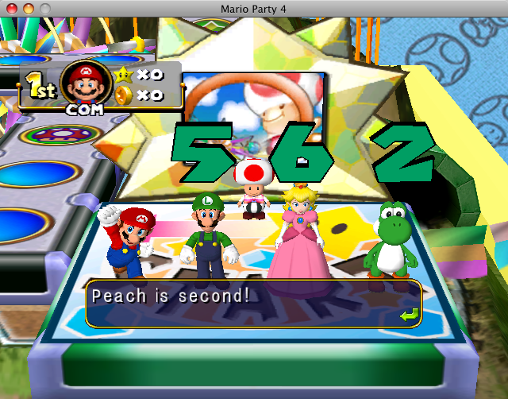

Left running afterwards, the same command M18 left: `g4 run --soak
--com4 --rtc dolphin --freshcard --realtime --snap-every 5000 --snap-keep
3 --status --ovllog --stuckwatch 200` — the first overnight run on which
the registry cannot go stale and the mixer reads its own copies.

**What M20 starts with:**

1. **Read the soak's log first.** `skin: lifetime:` must say 0 guard hits;
   `musyx_aram: samples stored … refused 0`; `tex` near 40 MB; the
   speed at turn 12 and beyond.
2. **The drawn frame** (§33.7 item 2, untouched by M19): the batch enders
   and the decode; strips → indexed; the `ATI_text_fragment_shader`
   backend, with the §31/§32 A/B discipline.
3. **The scene-change stalls / audio underruns**: the texture decode at
   a scene's first drawn frame; now that the samples are in the heap,
   the `aud` cost in `m430` (2.8 ms, many voices) is also worth a look.
4. **Upstream note** (`decomp-struct-notes.md`): the msm/MusyX PC-target
   sample lifetime is a port matter, not a decomp bug; nothing new for
   the list.

## 35. M20 log — the module that remembered its last play *(2026-09-19, littlejelly)*

M20 opened on a process that was alive and going nowhere. The M19
leave-behind soak (§34.6) had been inside `m406dll` since frame 459,473 —
board 2, turn 15 — for 80,000 frames at 100% speed, 30 presented fps, the
game loop healthy, the picture a snow field with nobody on it
(`STUCK: frame 507473, 800 s with no progress`, `mp4peek`: `omMain`, four
`UpdateChar`, the watcher; no coroutine of the module's own). The same
process had played `m406` once before, at 86,431–88,903, in 2,472 frames.
The first attempt at M20 (interrupted at 11:15) found the mechanism, built
the fix and left a witness running; this log verifies that attempt's
claims against the process itself, adds what its witness turned up
(§35.3), and settles the addendum's two pictures (§35.2).

### 35.1 The stall: an initialised global that a second play began below zero

`m406dll` is *Avalanche!*: four players ski down a slope ahead of an
avalanche. Its player-side state machine (`player.c`, `fn_1_FA50`) is
driven by one counter,

```c
s32 lbl_1_data_11F4 = (REFRESH_RATE*16)/5;        /* player.c:436 -- .data, 192 */
...
case 0:  if (--lbl_1_data_11F4 == 0) { fn_1_123C(); lbl_1_bss_D8++; ... }   /* the intro */
case 2:  ... lbl_1_data_11F4 = (REFRESH_RATE*7)/2;                          /* 210 */
case 3:  if (--lbl_1_data_11F4 == 0) { fn_1_12BC(); }                        /* the ending */
```

Case 3 keeps decrementing after it has fired — the minigame's outro runs
for a few hundred more frames with the counter going further below zero —
and nothing ever resets it, because nothing has to: on the console the
counter is in the REL's *initialised data*, and `objdll.c`'s `Link DLL`
path reads the REL off the disc again (`HuDvdDataReadDirect`) every time a
minigame is entered, so every play starts at 192. The port keeps every
bundle mapped after the game unlinks it (`portDLLClose`, the bootDll
dead-text call of M3) and answers the next Link by zeroing the bss by hand
— *half* of objdll.c's fifth point. `.data` kept the last play's values.
So the second play of `m406` in a process began with the counter already
negative, `--x == 0` could never come true, and the four players sat in
their intro state with `HU3D_ATTR_DISPOFF` (that is why the field was
empty: `fn_1_1065C` reveals them at state 1).

**Read in the process itself** (the first attempt, gdb attached to pid
32079 with `port/tools/gdb/mpgdb`): `lbl_1_data_11F4 = -83707`,
`lbl_1_bss_D8 = 0` (player state: the intro), `lbl_1_bss_1CC = -1` (no
winner picked). Writing 192 into it let the minigame play out. **Read
again in a `--restore` of the stall snapshot** (this log, the M19-source
binary rebuilt as `~/MarioParty4-m19src.app` — the source differs from the
stalled build by seven comment lines, so `--restore-lax` is sound — and
`snaps/lib/m406-stall-f515000.snap`): the restore reproduces the stall
exactly, because the snapshot carries the module's `.data`
(§24.2). Two reads 60 status-lines apart: the counter went −58,553 →
−59,395 while the module's own frame counter (`main.c` `lbl_1_bss_18`,
state 1) went 58,220 → 59,062 — lockstep, 842 each — so **the second play
began at −333**: the first play's outro had run the counter 333 frames
past zero. The same poke (192) in the restore played it out too
(`docs/soak/m20-m406-restore-poke.log.gz`).

That corrects the addendum's premise: the restore did *not* clear the
stall — it reproduced it; the play-out the user photographed (pid 43179,
the "DRAW!" banner) followed the first attempt's poke, not the restore.
The state that held the stall was inside the snapshot, inside the game's
own module data, and no port-side registry or cache was involved.

**The fix** (`port/src/os/dll_load.c`, commit 3d30fb6c): a module's
`__DATA,__data` is captured once, at its first `dlopen` in the process,
before its prolog runs (`dll_data_capture`); a `Link DLL` of a kept module
(`portDLLOpen`) copies it back beside the bss zeroing (`dll_data_reset`).
The "Already Loaded" re-entry (`portDLLReenter`) keeps `.data`, which is
what the console's `memset(bss)`-only path does. The `--restore` path
captures the pristine copy before the snapshot's bytes are written over
it, so a restore still reproduces what it saw. `.data` only — the lazy and
non-lazy symbol pointers are dyld's and are left alone; the bundles are
prelinked at fixed addresses and never really unloaded, so the captured
copy's relocated pointers stay valid. `--nodatareset` keeps the old
loader for a reproduction.

**The guard.** Every reset that finds the last play's changes logs one
line, and the shutdown report counts them:

```
port> m406dll: re-opened: 7 of 4360 .data bytes had been changed by the last play; reset to the REL's contents
port> REL .data: 13 re-opens of a kept module, 9 of them with .data the last play had changed (reset)
```

Over the three witness runs the line named `m406dll` (7 bytes), `instdll`
(1 byte, every play), `resultdll` (2–4 bytes, every play) and `w01dll`
(1 byte: the board is re-linked after each minigame). None of those had
a visible symptom; all four were running with the previous play's data
until now.

**Witness.** `--soak --minigame m406,m406 --turns 10 --com4 --rtc dolphin
--freshcard --realtime --status --ovllog --stuckwatch 200` on the fixed
build: the second play at frame 18,336 logged the reset and completed at
20,854 (2,518 frames; the M19 soak's first play took 2,472), all four
bodies skiing, Peach's win pose, results, the board
(`docs/soak/m20-witness1-m415fault.log.gz`). A second run
(`--minigame m415,m406,m406`) did it again: 29,885 → 32,347. The restore
experiment is the third witness: the un-fixed loader, the same snapshot,
the same stall.

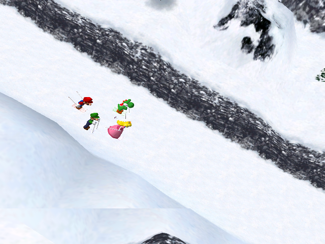
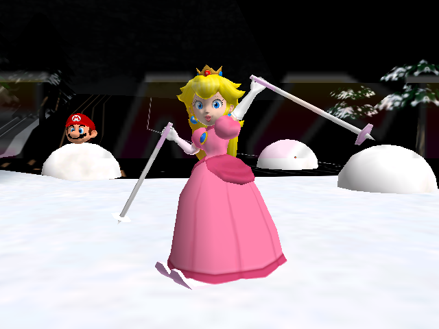

### 35.2 The two pictures in the DRAW photo

The addendum's photo (`screenshots/m20-m406-draw-photo.jpg`) shows the
poked play-out of the stalled process ending in a DRAW with two things
that looked like rendering faults. Reproduced in a real capture from the
restore + poke (`screenshots/m20-m406-poked-draw-ribbon.png`, 5 s after
the poke — the race was over at once, because the avalanche had been
advancing for 60,000 frames and caught all four immediately: a DRAW):

* **"Yoshi's head without his body"** is the game's own art. Avalanche!'s
  losing pose is a character buried in a snow mound with the head out;
  a DRAW buries all four (the four mounds in both pictures; Peach's head
  is the one out in the capture). Not a skinning fault: the same build,
  the same minigame, fresh, draws all four bodies (§35.1's screenshots).
* **The rainbow-striped ribbon** across the slope is a textured,
  vertex-coloured quad-strip effect (`map.c` `fn_1_B474`/`fn_1_BC18`, a
  hook-drawn ribbon with `GX_SRC_VTX` colours) after 60,000 frames of a
  state it was never designed to sit in. It is not in any fresh play of
  the minigame (six captures across two plays), and with the stall gone
  the state that produced it cannot recur. What this log does *not* have
  is a fresh-process DRAW to compare against: four COM players cannot be
  made to lose together on demand. Recorded as a stall artefact on that
  evidence, not proven to the byte.

Neither picture implicates the M18 skinning deferral or the M19 lifetime
registry; both runs report `0 guard hits`. The deferral stays as it is.

### 35.3 What the witness found instead: a minigame no soak had dealt

The first witness run faulted at frame 46,532 — the first frame of
`m415dll` — `signal 11 at address 0x425cc050`, pc in the commpage `bcopy`,
backtrace `omMain + 492` (an object function). 0x425cc050 − 0x40000000 =
0x025cc050, inside MEM1: **`OSCachedToUncached` was still adding the
console's uncached-alias offset.** The M1 inventory (§1, "`OSCachedToUncached`
| 1 | `src/REL/m415Dll/main.c:429`; make it identity") had named it and
nothing ever did — and of the 44 minigames the soaks have dealt since
(m444 32 times, m428 22 …), `m415` was dealt **zero** times, in every log
kept. The first M20 witness was its first play on the port. `patches.txt`
makes both macros the identity (commit ebc5ffec).

`m415` is *Stamp Out!*, and behind the fault is a copy the game reads
back with the CPU: for the two seconds of its intro it does
`GXDrawDone(); memcpy(canvas->bmp->data, Hu3DShadowData.buf, 192*192)`
every frame — the shadow map, one byte a texel, into an I8 `ANIMDATA` it
then textures the paper with — and once more at the canvas's creation.
On the console MEM1 holds the copy's bytes. The port's `GXCopyTex` never
writes MEM1 (the copy is a GL texture keyed on the destination, §3/§16),
so the memcpy would have painted the canvas with whatever the heap held.
`patches.txt` turns the two memcpys into `port_gx_copy_read` (`gx_tex.c`):
the copy's GL texture is read back with `glGetTexImage` (added to the
GL 1.3 allow-list) and encoded as GX would have written it — one byte a
texel in 8×4 tiles, the copy format's channel (the game copies
`GX_CTF_R8` and binds it as `GX_TF_I8`; the first cut refused R8 and gave
zeros — `screenshots/m20-m415-canvas-zeros.png`) or BT.601 intensity for
I8. A destination nothing was copied to yet is answered with zeros and one
log line, and the report counts both:

```
port> copy-read: 120 copies read back by the game (m415's canvas), 1 answered with zeros
```

(120 = the intro's frames; the 1 = the creation-time read, before the
first shadow copy of the minigame exists.) Witness: `--minigame m415,m406
--turns 3` at real time plays Stamp Out! through to its results
(`docs/soak/m20-witness3-m415-r8.log.gz`; the zero-canvas run before it,
`m20-witness2-m415-m406x2.log.gz`, also played through — the fault was
the alias, not the picture).

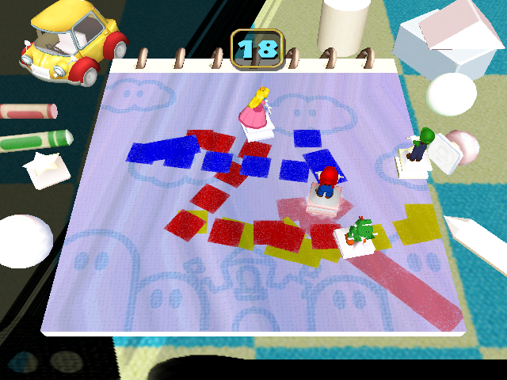

**Settled by the console** (later the same day: the oracle rig of
`port/ref` runs on littlejelly too — Flatpak Dolphin at ~9 fps with PNG
dumps, the `m406-end.txt` schedule with `mg_next` poked to 14; frames
`port/ref/frames/m415-console-*.png`, notes in `port/ref/notes.md`): **the
paper is white** with faint blue line art — the read-back canvas is the
console's picture and the zero canvas was wrong.

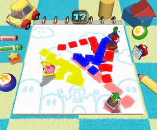

The same frames show two things the port gets wrong in `m415`, both
visible in the screenshots above once you know to look:

* **The toys around the paper are plain white on the port** — the star
  balls, the blue house, the red mushroom stamp, the yellow star, the
  pencil — and textured, coloured objects on the console. Unfixed, so it
  has its snapshot: `snaps/lib/m415-white-toys-f016000.snap` on the G4
  (inside the minigame, frames 14,477–17,183 of a `--minigame m415
  --turns 1` run on the final build; `docs/soak/m20-m415-snap.log.gz`).
  First suspects: the `Hu3DModelShadowMapObjSet`/`SetShadow` stage on
  objects that receive the paper's shadow map (a `GX_CC_TEXC` lerp
  against a copy the port binds as an `efb` texture), or a texture format
  the toys share.
* **The minigame results screen's portrait boxes are blank on the port**
  (`screenshots/mp4-minigame-result.png`, since M8) and hold the four
  characters' faces on the console (`m415-console-12700.png`). Pre-existing,
  now with a reference.

### 35.4 Item 2: the picture and the counter

Two `g4 shot`s five seconds apart during board play on the fixed build
(`m20-board-a/b.png`, 11:11–11:12): different, in exactly the game's
640×480 window (diff bbox 520,285–1160,765 of the 1680×1050 desktop).
**Verdict: `presented fps` is honest.** It counts `n_drawn / wall` in
`framemode.c` — drawn frames that went through the swap — and during the
stall the scene really was static: the module drew the same empty slope
thirty times a second. Nothing to fix in the present path; no display
sleep/wake re-attach was needed (the display had been woken by hand for
the user's captures, and the runner's captures here were live).

### 35.5 What M20 shipped, and what it did not

| shipped, with a witness | |
|---|---|
| a re-linked module's `.data` goes back to the REL's contents (§35.1) | the stall reproduced from its snapshot and read (−333 at entry); the second play of m406 in one process completed twice at real time; guard line + report |
| `OSCachedToUncached`/`OSUncachedToCached` identity (§35.3) | m415 played through twice |
| `port_gx_copy_read`: the copy the game reads back (§35.3) | 120 readbacks in the intro, the paper textured from the copy |
| the M19 soak's log, the restore/poke log, three witness logs, seven screenshots | `docs/soak/m20-*`, `docs/screenshots/m20-*` |
| `--nodatareset`; `~/MarioParty4-m19src.app` on the G4 (the M19-source re-link, for the stall snapshot) | |
| the oracle on littlejelly: five `m415` console frames, `port/ref/notes.md` (§35.3) | the paper's colour settled; two m415 faults referenced |

**Not done, and why:**

* **Item 3 — the drawn frame** (strips → indexed, `ATI_text_fragment_shader`):
  not started. The day went to the stall's verification, the DRAW
  pictures, and the minigame the first witness surfaced.
* A fresh-process DRAW in Avalanche! to close §35.2's ribbon to the byte.
* `m415`'s white toys and the results screen's blank portraits (§35.3):
  found, referenced, snapshotted, not fixed.
* `--texbudget 0` / `--cpuskin` / `--noskinlifetime` arms on m406 were not
  run: the stall's cause was read out of the module's data before any arm
  was needed, and the pictures pointed away from the deferral (§35.2).

**M19 soak, read as §34.6 asked:** 8,803 status lines, mean speed
**100.1%**, one full 20-turn board (results at ~268k, `modeseldll` →
`mentdll` → board 2 at ~290k, the three designed 200 s waits), 44
minigames dealt, `tex` at 40.8 MB throughout, 0 faults before the stall
(`docs/soak/m20-m19soak9-m406-stall.log.gz`).

Left running (12:03): `g4 run --soak --com4 --rtc dolphin --freshcard
--realtime --snap-every 5000 --snap-keep 3 --status --ovllog --stuckwatch
200` on the final build (`isle` md5 `2fd60253…`, 1,655,632 bytes) — the
first soak on which a module's second play starts where its first did.

Restarted at 12:44 after the m415 snapshot run (the first 40 minutes of
the leave-behind, turns 1–10, 0 incidents, are
`docs/soak/m20-soak-leave1-partial.log.gz`).

**What M21 starts with:** the soak's `REL .data:` and `copy-read:` report
lines and whether m415 or a second m406 came up naturally; `m415`'s white
toys from its snapshot (§35.3) — a texture/TEV question with a console
frame to diff against; then item 3.

## 36. M21 log — the channel the port never lit, and the copy that was a picture of the screen *(2026-09-19, littlejelly)*

M21's brief was three items: read the M20 leave-behind soak (§36.1), the
white toys of *Stamp Out!* (§36.2), and the drawn frame — measure its 25 ms
before touching it, then strips → indexed and the text fragment shader
(§36.3). The toys turned out to be a **colour channel the port had never
computed**: hsfdraw.c's hilite materials light `GX_COLOR1` as a specular
term and screen it into the picture, and the port fed that stage from
channel 0, so every shiny object in the game was drawn washed to white. It
is lit now, folded through GL's colour sum, and the title's cake and the
board's Toad change with the toys (§36.2). The drawn frame was measured
three ways and **both submit levers lost**: one `glDrawRangeElements` per
batch is 4–12% slower than the driver's multi-draw of strips and not
bit-exact, and re-basing the arrays or bulk-uploading the matrices is within
noise (§36.3). What the measurement says instead is where the next lever is
(§36.4). On the way: the shadow map that was copied from the front buffer on
a consumed frame (§36.2), a fast-forward that slept two and a half minutes
before real time began, one walk in twelve that faulted at the top of
MEM1 (§36.5), and the paper itself, which turns out to have been wrong all
along (§36.2).

### 36.1 The soak, read

`g4 run --soak --com4 --rtc dolphin --freshcard --realtime --snap-every 5000
--snap-keep 3 --status --ovllog --stuckwatch 200` on the M20 build
(`2fd60253…`), restarted 12:39 G4 time and stopped at 12:58 when the G4 was
needed — **19 minutes, 1,141 status lines**
(`docs/soak/m21-soak10-m20-leave2-19min.log.gz`):

| | |
|---|---|
| mean speed | **100.2%** (board lines 100.0%) |
| presented fps | 19.0 overall, **18.2 on the board** |
| where it got | board 1, turns 1–6 of 20; seven minigames dealt: m412, m428, m420, m444, m423, m438, m429 |
| `REL .data:` re-opens | `instdll` 1 of 800 bytes ×5, `resultdll` 1–4 of 1,760 bytes ×5, `w01dll` 1 of 3,528 bytes ×2 — every play, as M20 predicted, all reset |
| `copy-read:` | none — m415 was not dealt; no second m406 either |
| STUCK / faults / stalls | 0 / 0 / 0; one resync, the board load (retrace 5,116, 1.0 s) |
| `tex` / `rss` at the end | 665 entries, 39.1 MB (peak 43.0 MB) / 121 MB |

Nothing to act on; the shutdown report lines the brief asked for were not
written because the stop is a `killall`. The final build's soak (§36.6) is
the one that will carry them.

### 36.2 Stamp Out!'s toys: a second colour channel, and a fold through the colour sum

**The reading.** The M20 snapshot restored on the M20 build with `--drawlog
6000 --drawlog-at 16006` (`docs/soak/m21-m415-restore-drawlog-f16006.txt.gz`)
names every draw of the frame with its model, object and stages. The car
(`kuruma33`, correct) is one stage, `TEXC * RASC`. The mushroom stamp
(`kinoko`, white) is:

```
stage0 coord 0 map 0 chan COLOR0A0   cin ZERO TEXC RASC ZERO      = T * RAS0
stage1 coord - map - chan COLOR1A1   cin CPREV ONE RASC ZERO      = lerp(PREV, 1, RAS1)
                                     ain ZERO APREV A0 ZERO       = APREV * A0
chan0 enable 1 ...   (2 chan(s))
```

That second stage is hsfdraw.c:827 (`SetTevStageNoTex`) and :1370
(`SetTevStageTex`), emitted for every material with `vtxMode` 2 or 3
(`matHiliteF`). Its rasterised colour is **channel 1**, which
hsfdraw.c:863/873 sets up as `GXSetChanCtrl(GX_COLOR1, TRUE, SRC_REG,
SRC_REG|VTX, lightBit, GX_DF_NONE, GX_AF_SPEC)` — the specular term of the
light `Hu3DLightSet` loads with `GXInitSpecularDir` and
`GXInitLightAttn(0,0,1, s/2, 0, 1-s/2)` (hsfman.c:1844, s = the material's
`hiliteScale`). `lerp(PREV, 1, spec)` is a screen: the highlight brightens
the lit texture towards white where the half-angle is small.

The port lit **channel 0 only** (`light_channel`, `vp_gen`), and `color_arg`
resolved `GX_CC_RASC` to `GL_PRIMARY_COLOR` whatever the stage's channel —
so the screen ran on the *diffuse* colour: `lerp(T*RAS0, 1, RAS0)`, which for
a lit white material is white. Every hilite material in the game was drawn
that way since M3: the toys, the stamps under the players, the title's cake,
the board's Toad, and (§31.4 counted them) 44,902 `GXInitSpecularDir` calls
on the walk. `GXInitSpecularDir` itself was also half-implemented: it stored
the direction and warned, where the SDK (GXLight.c:251) stores the
**half-angle vector** as the direction and moves the light's *position* to
`-dir * 2^20`, so channel 0's diffuse of a hilite material saw the light
where the game had put it rather than at infinity.

**The fix** (gx_state.c, gx_draw.c, gx_tev.c, gx_vprog.c, gl13.c):

* `GXInitSpecularDir` is the SDK's, to the constant; `GXInit`'s channel
  defaults (ambient black, material white, both channels — GXInit.c:276) are
  set, since hsfdraw.c never sets channel 1's colours and the console's
  defaults are what the specular runs with.
* The vertex program computes channel 1 as the hardware does (Dolphin's
  `LightingShaderGen`, checked against the SDK): `ldir = normalize(lpos -
  pos)`, `nh = (N.ldir >= 0) ? max(0, N.H) : 0`, `attn = max(0, a.(1, nh,
  nh²)) / k.(1, nh, nh²)`, `c1 = mat1 * clamp(amb1 + Σ attn * lcol)`. The
  parameter block grew from 3 to 5 params a light (the angle coefficients
  and the direction) plus channel 1's material and ambient; the palette
  lost one slot (23 of 6) and nothing else moved.
* **The fold.** GL 1.3's combiner has one per-vertex colour, but everything
  before the hilite stage is linear in `RAS0` (the material setup's shapes:
  `T*RAS`, the shadow's `PREV*T`, the two-texture blend §31.3 rewrote), so
  `lerp(F*RAS0, 1, spec) = F*RAS0*(1-spec) + spec`. The program writes
  `primary = c0 * (1 - spec)` and `secondary = spec`, the hilite stage is
  emitted as a pass (`REPLACE PREVIOUS`, its alpha `APREV * A0` as before),
  and `GL_COLOR_SUM` (0x8458, GL 1.4 core / `EXT_secondary_color`, which the
  card lists) adds the secondary colour after the units. Exact up to the
  interpolation of a product against a product of interpolants, which is
  below a level. `gx_hilite_decide` recognises exactly the hsfdraw.c shape;
  the textured variant (:1374, `TEXC * RASC1 + CPREV`) cannot ride a colour
  sum and is counted (38,304 stage emissions on the walk, 0 in m415), as
  is a hilite stage followed by a projection stage. `--nohilite` is the
  whole pre-M21 picture: the channel unlit, the stage fed from channel 0,
  the light's position left where it was.

**The witness.** The same frame, fresh from boot (`--minigame m415 --turns 1
--play board-start-com4.play --ffto 16000 --lockstep --dumpframe 16006`),
M20 build against M21, and the console's frame 10,973 from `port/ref`:

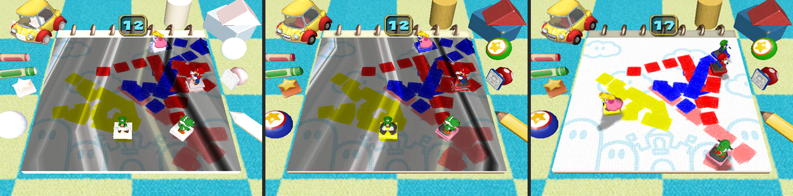

The star balls, the house, the mushroom stamp with its die, the pencil, the
crayons, the star, the cylinder, and the four stamps under the players are
the console's colours. (The paper in both port frames is a fast-forward
artefact, below.) Then at real time, from boot, on the final build:

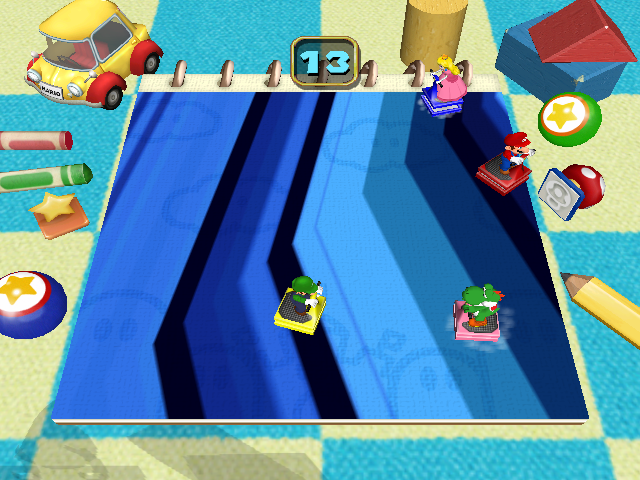

**The md5s, re-based with that justification.** `--nohilite` reproduces
§31's three references to the byte on the final build (800 `60f8b7a0…`,
3000 `8762d432…`, 7000 `9264207c…`, the last via `--ffto 6900`); the default
changes two of them:

| frame | §31 md5 (= `--nohilite`) | **M21 md5** | pixels differing | what |
|---:|---|---|---:|---|
| 800 | `60f8b7a0…` | **`5df69d400ff34fb2c2c04049927b0876`** | 24,904 (8.1%), mean 4.5 levels | the title's cake: its pink star pattern was screened to white |
| 3000 | `8762d432…` | `8762d432…` unchanged | 0 | no hilite material on the character select |
| 7000 | `9264207c…` | **`f5b52130f8bcd7c9f8949aad9c6bfe27`** | 10,054 (3.3%), mean 0.9 levels | Toad and the yellow balloon-star behind him |

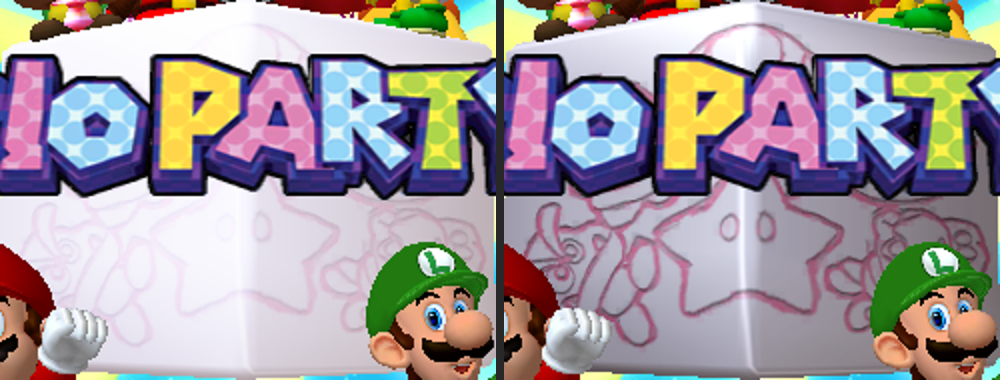
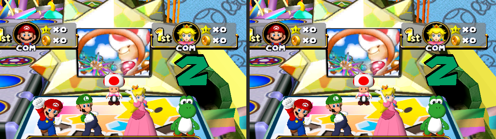

(diff masks `m21-hilite-f800-diffmask.png`, `m21-hilite-f7000-diffmask.png`.)

**The paper is a second, pre-existing fault, and §35.3's verdict on it
was a lucky frame.** The real-time play-throughs on the M21 build drew the
paper deep blue with diagonal bands; a `--ffto 14400 --lockstep` run (the
intro live, every frame drawn, all 120 read-backs served) draws it green
with dark bands, and the *M20 build* on the identical run draws it green
too (`screenshots/m21-m415-paper-f15800-{m21,m20}-lockstep.png`). So the
texture Stamp Out! reads back from the shadow-map copy (§35.3) is wrong
before any of M21's changes and varies with the run, and M20's white paper
(`m20-m415-canvas-r8.png`) was one run where it came out right. What the
bands look like is a *corner of the scene* magnified — the copy is
`GXSetTexCopySrc(0,0,384,384)` box-filtered to 192×192 with the shadow
pass's own 384×384 viewport, and which of the source rectangle, the
half-size filter, the pre-pass clear or the pass itself is wrong is not
settled. Reproduction in 2.5 minutes on any build: `--minigame m415
--turns 1 --com4 --rtc dolphin --freshcard --play board-start-com4.play
--ffto 14400 --lockstep --frames 15900 --dumpframe 15800`. One thing on
the way is right and stays: §32.1's rule for a `GXCopyTex` on a consumed
frame ("read the front buffer, it is the last picture presented") is
right for the wipe and the bubbles and wrong for an offscreen pass copied
with `clear = 1` (the shadow map, hsfman.c:2007, m428, m439), which is
never what is on screen; such a copy now keeps what the last drawn frame's
pass produced (`gx_tex_copy`, counted in the `EFB copies:` line). It does
not fix the paper — the lockstep run has no consumed frames — and the
`--ffto`/`--restore` frames' streaks are the same read-back with no pass
having run yet.

**The results screen's blank portraits** (§35.3, pre-existing) are *not*
this fault. The drawlog of the results (snapshot
`snaps/lib/m415-results-f017000.snap` on the G4, the M21 build's;
`docs/soak/m21-results-drawlog-f17400.txt.gz`) shows each portrait cube as
hsfdraw.c:1290–1305: `T_face * RAS -> PREV`, `T_mask * K -> REG2`,
`lerp(PREV, T_reflect, C2) -> PREV`, then a textured hilite. The port
folds the REG2 write to PREV (§31.3's open shape) — the face is overwritten
by the mask, the reflection lerps against the register's constant (255),
and the textured hilite adds `T_mask * RAS0` — white. A crossbar rewrite
of that triple (the mask's red channel swapped into alpha through the
texture cache, `INTERPOLATE(TEXTURE2, PREVIOUS, PREVIOUS.a)`, the material
alpha restored from `TEXTURE0.a`) is the fix; named, snapshotted, not
done.

### 36.3 The drawn frame, measured, and the two levers that lost

**The measurement**, three instruments on the same board frame:

*(i)* `--gxsplit` (new: exclusive timed regions inside gx, two timer reads
per region), over the whole 9,000-frame walk at `--turbo`
(`docs/soak/m21-walk-base-split.log.gz`), mean per drawn frame:

| region | ms/drawn frame | share | per call |
|---|---:|---:|---:|
| decode (the display-list decode into the ring) | 6.96 | 26% | 8.2 µs per list |
| state (`gl13_apply_*` + `gx_tev_apply`, minus binds) | 1.83 | 7% | 8.5 µs per batch |
| texbind (hash, decode, upload, bind) | 1.56 | 6% | 6.3 µs per bind |
| **issue** (`gx_vprog_bind` + the range flush + the draw calls) | **12.97** | **49%** | **60 µs per batch** |
| other (the list walk, hashing, copies) | 3.16 | 12% | |
| gx | 26.47 | | |

*(ii)* `sample isle 10` on a `--ffto 6500 --turbo` board teleport, the
M21 build, nothing else on the G4 (`docs/soak/m21-board-drawn-profile-{1,2}.txt.gz`,
7,128 samples on the game thread):

| inclusive | samples | % | inside |
|---|---:|---:|---|
| `draw_submit` | 3,040 | 42.6% | |
| — `issue_segments` (the draw calls) | 1,775 | 24.9% | `gleDrawArraysOrElements_VAR_Exec` 1,167 (of which `gldUpdateDispatch` 899, the per-draw validation), **`gleDrawArraysOrElements_IMM_Exec` 438** (the copying path, from the batched submit), `glMultiDrawArrays_Exec` 113 |
| — `gx_tev_apply` | 505 | 7.1% | |
| — `gx_vprog_bind` | 214 | 3.0% | |
| — `gx_tex_bind_swapped` | 284 | 4.0% | |
| the decode (`decode_fast_*`) | 879 | 12.3% | |
| `gldFlushVertexArray` (the per-batch range flush) | 330 | 4.6% | |
| `gldCreateQuery` / `gldPageoffBuffer` / `gldAllocVertexBuffer` (command-buffer traffic; stripped names) | 378 / 265 / 190 | 11.7% | |
| the game side (`SetEnvelopMain`, `Hu3DMotionExec`, `HuSprExec`, the mixer…) | | ~30% | |

*(iii)* the counters: 1,941,408 batches for 8,411,126 primitives on the walk
→ 2,808,782 GL draws (multi-draw folds 5.9M strips into 317K calls);
5,709,414 env-parameter uploads (2.9 a batch) with 8,972,969 elided; the
batch enders unchanged since M18 (`GXLoadPosMtxImm` 693,789).

So of the board's ~24 ms of gx: **(a) submission ≈ 13 ms**, and inside it
the driver's per-draw validation (`gldUpdateDispatch`, 4.8 ms) and a
**copying path the ring was meant to have retired** (`IMM_Exec`, 2.4 ms,
reached from `issue_segments` for some batches); **(b) TEV/state ≈ 2.9
ms**; **(c) texture decode/upload ≈ 1.5 ms** on a warm board (the cold
first frame of a scene is the §32.5 stall, untouched); **(d) the batch
enders** are a count, not a slice: ~520 batches a board frame at ~25 µs of
issue each, set by `GXLoadPosMtxImm` (one per object) and unmovable
without a palette (§33.2). The decode is the other 7 ms.

**Lever 1, strips → indexed** (`--indexed`, gx_draw.c `build_indices` /
`issue_indexed`): every triangle-family segment of a batch becomes one
triangle list through an index buffer — strips as `(i, i+1, i+2)` /
`(i+1, i, i+2)`, fans as `(0, i+1, i+2)`, quads as `(0,1,2)(0,2,3)` — and
one `glDrawRangeElements` (u16 while the batch fits, u32 otherwise). Same
binary, same walk, `--turbo`, each arm a full 9,000 frames:

| arm | title (700–870) | character select (2600–3600) | board (6000–8900) | wall | frame 800 / 3000 / 7000 |
|---|---:|---:|---:|---:|---|
| **base** (M21 defaults) | 28.90 fps | 19.99 | **26.12** | 322.3 s | `5df69d40` / `8762d432` / `f5b52130` |
| `--fixbase` (arrays based at the ring) | 28.95 | 20.30 | 26.34 | 318.0 | identical |
| `--indexed` | 27.88 | **17.62 (−12%)** | **25.08 (−4%)** | 348.6 | `9c4edb2d` / `b1534e7f` / `8f4bd837` |
| `--indexed --fixbase` (76% of batches on u32 indices) | 28.42 | 18.10 | 25.47 | 342.0 | as `--indexed` |
| `--envbulk` (the six matrix rows as one upload) | | | | | 800/3000 identical; §36.5 |

Indexed is slower everywhere. `--gxsplit` on the `--indexed --fixbase`
arm says why: building the indices costs 0.63 ms a frame (744M indices
over the walk), and the *issue* region grows from 12.97 to **14.73 ms** —
the driver's `glDrawRangeElements` reads every index it is handed, and
that is more work than its own loop over the strips. And the picture
moves: 16% of the title's pixels by a level or so (`ppmdiff`: mean 0.32
levels, 0.5% of samples by more than 8, 353 by more than 32 — edge
pixels), which is the rasteriser's setup differing when the same triangle
arrives with its vertices in a different order. Off by default, with the
flag kept for the record.

**Lever 2, `GL_ATI_text_fragment_shader`.** The card lists it
(`g4-glinfo.log`) and it was not built: the day's budget went to the
channel (§36.2), which took the specular case out of the shader's list,
and the measurement above says the drawn frame's cost is in the driver's
per-draw work, which a fragment shader would not touch. What is left for
it is picture, not speed: the 5,733 register-write emissions §31.3 still
folds (the portraits above are one), and 54,892 of 1,941,408 draws with
a two-constant stage.

**Two more, measured and off.** `--fixbase` (a batch's first vertex
aligned to its stride, the arrays' base pointers never moving, the
offset in `first`) is exact and +1% — within the walk's noise; the array
pointer calls were not the driver's cost. `--envbulk` (one
`glProgramEnvParameters4fvEXT` for the six matrix rows instead of three
to six `glProgramEnvParameter4fvARB`) is exact on the two frames it
reached and moves `gx_vprog_bind` from 3.4% to 3.2% of the frame. Both
default off (`--fixbase`, `--envbulk` turn them on).

### 36.4 What the measurement says the next lever is

Two things in the profile were not known before this session:

* **A fifth of the draw time is the copying path, and half the batches
  are tiny.** `gleDrawArraysOrElements_IMM_Exec` — the client-array copy
  M16's ring was built to retire — is reached from the batched submit for
  438 of 1,775 `issue_segments` samples, and every array it is handed lies
  inside the range: the driver chooses to copy some draws rather than DMA
  them, and the new `--submitstats` histogram says which. Vertices per
  batch on the final walk: **≤16: 980,541 (51%)**, ≤64: 368,666, ≤256:
  338,109, ≤1024: 140,019, ≤4096: 89,302, more: 24,771. Half of the
  1.94M batches carry sixteen vertices or fewer, and each costs the same
  ~25 µs of driver time as a thousand-vertex one.
* **Batches that differ from their predecessor in nothing but the
  matrices: 1,177,229 of 1,941,408 (61%), 1,064,428 of them of 256
  vertices or fewer** (`mergeable:` — same layout, TEV config, textures,
  raster state and channels as the batch before). `GXLoadPosMtxImm` ends
  them. The palette is dead on this driver (§33.2), but a *small* object
  can be transformed on the CPU — position and normal by its matrices,
  the lighting still on the card under identity matrices — and appended
  to the running batch. At ~25 µs of driver time per batch against ~40 ns
  per vertex of CPU transform, that pays for anything under a few hundred
  vertices, and the count above says it could take back up to a million
  of the walk's batches. That is M22's item 1.

### 36.5 Three things found on the way

* **The fast-forward that slept.** `--ffto N --realtime` paused for
  minutes when the fast-forward ended: vi.c's retrace schedule kept
  advancing 1/59.94 s per retrace while ffto ran at 160+ fps, so at the
  handover the schedule was (game time − ffto wall time) ahead of the
  clock and the first paced retrace slept it out — 154 s on the
  instruction screen for `--ffto 14400`. §34.4's `m430` measurement was
  taken after such a wait without noticing it. `port_vi_rebase_schedule`
  at the handover: real time starts when the fast-forward ends.
* **One walk in twelve faulted at the top of MEM1.** The `--envbulk` arm
  died at the board's load — `signal 10 at 0x3820000, 0 bytes into the
  guard above MEM1`, pc in `HuDecodeData`, called from
  `HuDataSelHeapReadNum` ← `BoardStatusCreate` ← `BoardStarShowNext`
  (`docs/soak/m21-walk-envbulk-FAULT-guard-top-of-mem1.log.gz`). The
  other eleven walks of the day on the same source, the same lockstep
  inputs and byte-identical `Rest Memory` traces up to that point passed
  it, and the change in that arm is one GL call that cannot reach MEM1.
  `HuDecodeLz` (decode.c:21) writes a run's `copyLen` bytes without
  checking `size`, so an overrun of a block that ends at the top of a heap
  is possible in the game's own code; what put the destination there once
  and not the other eleven times is not known. Not reproduced, no
  snapshot (the fault is in a fresh walk, frames ~5,100); the leave-behind
  soak and every future walk are the watch for it.
* **The results portraits** are a register-write shape, not a channel
  (§36.2); snapshot named.

**The final build's walk** (`docs/soak/m21-walk-final.log.gz`): title
28.79 fps, character select 19.94, board 25.82, 324.6 s — the base arm's
numbers within noise (28.90 / 19.99 / 26.12; M19: 26.5 on the board) —
and the three md5s above.

### 36.6 What M21 shipped, and what it did not

| shipped, with a witness | |
|---|---|
| channel 1 lit as the hardware does, folded through `GL_COLOR_SUM`; `GXInitSpecularDir` exact; GXInit's channel defaults (§36.2) | Stamp Out!'s toys and stamps in the console's colours, at real time from boot; 429,992 primitives folded on the walk; the title and board re-based with diffs; `--nohilite` reproduces §31 to the byte |
| clear-after copies kept on consumed frames (§36.2) | logically right, no witness: the paper is wrong for another reason |
| `--gxsplit`, the three profiles, the mergeable/size histogram (§36.3, §36.4) | |
| `--indexed`, `--fixbase`, `--envbulk`: built, measured, **off** (§36.3) | the table |
| the ffto → real-time handover (§36.5) | |
| the results-screen reading (§36.2) | `snaps/lib/m415-results-f017000.snap` is the intermediate build's (`d9bbfcc9…`, not kept) and will not restore on the final one; the reproduction is `--minigame m415 --turns 1 --play board-start-com4.play --ffto 17300 --lockstep --drawlog 3000 --drawlog-at 17400`, 2.5 minutes |
| the soak's read (§36.1), logs `docs/soak/m21-*`, screenshots `docs/screenshots/m21-*` | |

**Not done, and why:**

* **`GL_ATI_text_fragment_shader`** — present on the card, not built
  (§36.3): out of the day's budget, and the profile puts the drawn frame's
  cost where a fragment shader cannot reach.
* **The results portraits** — the REG2 rewrite shape (§36.2), snapshotted.
* **Stamp Out!'s paper** — the shadow-map read-back is wrong on both
  builds, run-dependent (§36.2); a 2.5-minute reproduction, no snapshot
  (the ring that held one was the intermediate build's).
* **The MEM1-top fault** — seen once, not reproduced (§36.5).
* **Item 3** (the scene-change audio underruns, the fresh-process DRAW in
  Avalanche!) — not started.
* The textured hilite (`TEXC * RASC1 + CPREV`, 38,304 emissions on the
  walk) still runs on channel 0; the CPU vertex path (`--cpuxf`) draws
  hilite materials without their highlight rather than white.

### 36.7 What M22 starts with

Left running (15:05 G4 time): `g4 run --soak --com4 --rtc dolphin
--freshcard --realtime --snap-every 5000 --snap-keep 3 --status --ovllog
--stuckwatch 200` on the final build (`isle` md5 `eca3f859…`, 1,658,040
bytes) — the first soak with the specular channel lit and the clear-after
copies kept.

1. **Read the soak's log first.** The `EFB copies:` line's kept count, the
   `hilite:` lines, `tex`/`rss`, the speed on the board past turn 10 (the
   longer programs of hilite materials cost nothing measurable on the walk,
   but a soak is the test) — and whether the MEM1-top fault (§36.5)
   recurs; if it does, the snapshot ring's newest frame before the board
   load is the reproduction.
2. **Fewer batches** (§36.4): the CPU pre-transform of small same-state
   objects into the running batch — 1.18M mergeable batches on the walk,
   half of all batches under sixteen vertices. Measure the `IMM_Exec`
   share and the batch count before and after; the md5s should hold if
   the transform is the same arithmetic in the same order as the program's
   (it will not be — the card's `DP4` and the CPU's `fmadd` round
   differently — so expect a rounding re-base argued with `ppmdiff`).
3. **The results portraits** (§36.2): the REG2 rewrite for the
   mask/reflect/hilite quadruple, through the swap-table texture cache.
4. **Stamp Out!'s paper** (§36.2): which of the copy source, the half-size
   filter, the pre-pass clear or the pass itself is wrong; the 2.5-minute
   reproduction is above.
5. `GL_ATI_text_fragment_shader` for the register-write shapes, if item 3
   shows the crossbar cannot say them; item 3 of M21's brief (the
   scene-change underruns, the Avalanche! DRAW).

## 37. M22 log — the count that was an address, and the portraits that were two shapes *(2026-09-19, littlejelly)*

M22's brief was §36.7's: read the leave-behind soak (§37.1), build the
CPU pre-transform §36.4 named as the next lever and A/B it (§37.2), and
the results-screen portraits (§37.3). The lever was built twice and lost
both times, and the reason is worth more than the lever: **§36.4's
"61% of batches differ only in the matrices" was an instrument bug** — the
M21 signature mixed in `gx_bound_tex()`'s *return value*, which is
`&gx.bound[unit]`, one address per unit whatever is loaded, so it never
saw a texture change. The honest count is 29%, and of those most are
separated by a real state change the game makes *between* objects. What
remains (13%) was merged, exactly (the three md5s held with 138K objects
pre-transformed), and it bought nothing, because a batch that ends
without a GL state change was never the expensive kind (§37.2). The
portraits were **two register shapes, not one** — the bevelled frame's
mask/reflection/textured-highlight quadruple §36.2 read, and, on the
16-vertex face quad drawn after it, hsfdraw.c:1243's tinted-overlay pair,
whose konst is zero and whose fold was the white — and both are drawn now
(§37.3). On the way: five setters that ended batches for nothing, the
textured highlight the title's characters had been drawing from the
diffuse channel since M3 (§37.3), and a lab rule about installs (§37.5).

### 37.1 The soak, read

`g4 run --soak --com4 --rtc dolphin --freshcard --realtime --snap-every
5000 --snap-keep 3 --status --ovllog --stuckwatch 200` on the M21 build
(`eca3f859…`), 15:05 to 15:24 G4 time — **19 minutes, 1,058 status
lines** (`docs/soak/m22-soak11-m21-leave-19min.log.gz`):

| | |
|---|---|
| mean speed | **100.1%** (board lines 100.0%, 462 of them) |
| presented fps | 18.9 overall, **18.1 on the board**, minigames 13.6–23.3 |
| where it got | board 1, turns 1–5 of 20; seven minigames dealt, **in §36.1's exact order** (m412, m428, m420, m444, m423, m438, m429 — `--rtc dolphin --freshcard` is deterministic, so a leave-behind soak replays the last one) |
| m415 | not dealt; no `copy-read:` lines |
| `REL .data:` re-opens | `instdll` 1 of 800 ×4, `resultdll` 2–4 of 1,760 ×4, `w01dll` 1 of 3,528 ×1 — every play, all reset, as M20 predicted |
| STUCK / faults / stalls | **0 / 0 / 0**; two resyncs (retraces 5,118 and 58,416, both board loads, ~1.0 s) |
| **the MEM1-top fault (§36.5)** | **did not recur**: the frame-5,100 board load that faulted one walk in twelve passed, and every later load too. No reproduction, no snapshot; still the watch |
| `tex` / `rss` at the end | 662 entries, 40.7 MB / 120 MB (M21's byte budget holding) |

Nothing to act on. The M21 bundle is kept on the G4 as
`~/MarioParty4-m21.app` so this soak's ring (`snaps/f050000..f060000`)
stays restorable.

### 37.2 The pre-transform: built, exact, and not faster

**The count, corrected.** `batch_state_sig()` hashes the bound objects'
*contents* now (image, size, format, wrap, filters, LOD, and the TLUT for
a CI texture) and the TEV registers and konst colours. On the same
9,000-frame walk the "differ from the batch before in the matrices alone"
count goes from 1,177,229 to **566,764 of 1,941,408 (29%)**, and a new
column on the `batches ended by` table — how many of a setter's flushes
had the *next* batch's state equal to the flushed one — says what
separates the rest: on the title, 1,802 of 2,465 same-state pairs were
ended by `GXInitTexObj`, which writes the game's stack-local object and
nothing the port reads.

**Five setters that flushed for nothing** (gx_tex.c, gx_state.c), all
exact, all kept: `GXInitTexObj` / `GXInitTexObjCI` / `GXInitTexObjLOD` /
`GXInitTexObjWrapMode` / `GXInitTlutObj` and the seven `GXInitLight*`
write the game's object, which `GXLoadTexObj` / `GXLoadTlut` /
`GXLoadLightObjImm` copy — no touch; `GXLoadTexObj` and `GXLoadTlut`
compare the copy first (the next object of the same material loads the
same texture); `GXLoadTexMtxImm` ends a batch only when a texgen in use
reads that slot; `GXSetTevKColorSel` / `GXSetTevKAlphaSel` only for a
stage below `num_tev` (hsfdraw.c resets all sixteen per material);
`GXInvalidateTexAll` / `GXInvalidateTexRegion` are no-ops here and end
nothing. Then the onion: silence `GXInitTexObj` and the same pairs are
ended by `GXSetTexCoordGen2` (texgen 0 written to the identity and then
to `TEXMTX0`), then by `GXLoadTexMtxImm`, then by the konst selects —
hsfdraw.c's material setup passes through states no primitive is drawn
under, and **a setter that flushes at once cannot know the state is
coming back**.

**The lazy flush** (`--lazyflush`, gx_draw.c `gx_batch_touch` /
`submit_rec_capture` / `draw_apply` / `draw_issue`). A setter no longer
submits the pending batch. The first one after the batch's last
primitive runs the *state half* of the submit right then — the transform,
raster state, TEV, binds, program and parameters, all under the state the
batch was decoded under, which is still the state — and records the few
hundred bytes the submit read (only what it reads: not the descriptor,
the arrays, the position/normal matrices, the copy setup, and of the
indexed tables only the entries in use). The next primitive captures the
same bytes and compares: the same, and the batch goes on with nothing
about GL moved; different, and the batch's draw calls are issued now,
under the GL state that is still its own because no GL call has happened
since, before the primitive starts a new batch. A copy or the present
flushes at once (`GX_FLUSH_NOW`). The batch's `PrimInv` is a buffer
flip, not a copy (`pi_bufs[2]`), and the submit runs under the batch's
own matrices (`batch_posm` / `batch_nrmm`: with the loads no longer
ending batches, `gx.pos_mtx[]` moves under a pending one) and its own
context (`BatchCtx`). The first build of this snapshotted the whole
`GXState` (6 KB) at the setter and ran the deferred submit through a
state pointer; it was exact and cost 0.8 ms a board frame in memcpy, all
of it in the *game* column because the copy was not timed as gx.

**The pre-transform** (`--premerge-max N`, `pm_decide` / `pm_apply`):
with the matrix loads and the descriptor setters no longer ending a
batch (`gx_batch_spans`), an object that arrives with different matrices,
the same layout and — by the lazy compare — the same state is, when it
has put at most N vertices into the batch so far, transformed after its
decode from its own model space into the batch's, `pos' = inv(M_batch) ·
M_obj · pos`, `nrm' = inv(N_batch) · N_obj · nrm` (the inverse in double,
once per batch; a singular one refuses the merge). The card applying
`M_batch` to `pos'` lands where `M_obj` would have put `pos`; the
lighting, the specular fold, the fog coordinate and the position/normal
texgens are all view-space downstream and unchanged. The running batch's
own vertices are never touched, so a batch nothing merged into is
submitted exactly as before — which is why the alternative (both objects
into view space under an identity modelview) was not built: it would
have touched the running batch retroactively, and that batch can be a
thousand vertices deep when a four-vertex sprite arrives.

**The A/B.** Same source, the 9,000-frame walk at `--turbo`
(`--com4 --rtc dolphin --freshcard --play board-start-com4.play --frames
9000 --status --dumpframe 800,3000,7000 --perfwin
700-870:title,2600-3600:charsel,6000-8900:board --submitstats`), one arm
per walk; all arms have the setter fixes above and §37.3's picture
changes except where noted:

| arm | title | character select | board | wall | batches | GL draws | 800 / 3000 / 7000 |
|---|---:|---:|---:|---:|---:|---:|---|
| M21 final (§36.5, for scale) | 28.79 fps | 19.94 | 25.82 | 324.6 s | 1,941,408 | 2,808,782 | `5df69d40` / `8762d432` / `f5b52130` |
| **control**: eager flush, no merge (before §37.3) | 28.55 | **20.13** | 25.55 | **326.6** | 1,941,408 | 2,808,782 | identical |
| lazy (GXState snapshot) + merge ≤32 (before §37.3) | 28.31 | 19.52 | 25.14 | 331.7 | 1,848,023 | 2,751,127 | **identical** (138,146 objects merged) |
| lazy (apply early) + merge ≤32 | 20.84 † | 19.70 | 25.17 | 334.7 | 1,848,023 | 2,751,127 | `1df90661` (§37.3) / same / same |
| lazy (apply early) + merge ≤256 | 27.83 | 19.37 | **25.67** | 331.0 | 1,758,677 | 2,742,219 | `1df90661` / same / **`047da2d2`** (board objects merged; rounding) |
| **final**: both off (the shipped defaults) | see §37.4 | | | | | | |

† started within a minute of `g4_install.sh`; §37.5. The title window is
27.0 fps in both the default and `--nopremerge` arms of an 870-frame
run started later (`docs/soak/m22-title-split-{default,nopremerge}.log.gz`).

Reading it: the merge takes back **5% of batches and 2% of GL draw
calls** at 32 vertices (57K of 2.81M — most merged objects are single
strips next to quads, and a batch's calls only merge across contiguous
segments of one type), 9% and 2.4% at 256, and the lazy flush carries
another 163K–360K batches past a transient setup; and **none of it is
faster** — the character select is 2–4% slower in every arm, the board is
within noise, the wall clock 1–2% longer. M16 had already said why
(§31.2: batching without fewer *calls* bought nothing, because the glc_*
shadow was eliding the state walk of a same-state batch) and §36.4 read
the M21 profile's `IMM_Exec` share as a per-batch cost when it is per
call and per vertex. What the driver charges for is the draw call and
the vertex, and of the 2.81M calls 2.4M are single-strip objects whose
*texture* differs from their neighbours' — sprites — which no
pre-transform can join without an atlas. So both levers are **off** by
default and kept behind `--lazyflush` / `--premerge-max N` with their
counters (`M22 premerge:` and `M22 lazy flush:` under `--submitstats`),
the corrected signature stays, the setter fixes stay, and the lever
§36.4 named is closed rather than open.

The "second lever" of the brief (a decoded-texture cache across scene
changes) was contingent on the first paying and was not started; note
that §36.3's "7 ms decode" is the display-list decode into the ring, per
vertex, not the texture decode (1.6 ms warm).

### 37.3 The portraits: two register shapes, and the highlight the title had never drawn

**The reading, corrected.** The 216-vertex draw §36.2 named is the
portrait's *bevelled frame*: hsfdraw.c:1290's mask/reflection quadruple
over the frame's own textures (`docs/screenshots/m22-results-textures-sheet.png`:
the gold/silver/bronze frame, a grey mask with a darker square where the
face sits, the chrome reflection map) and the textured highlight
(:1374). The *face* is the **16-vertex draw after it**, same object,
three stages, hsfdraw.c:1243 (`texCol[i].a == 1`, an animated texture
with a tint):

```
stage B:  T_i * K_rgb          -> REG2    alpha  K_a * APREV -> REG2
stage C:  lerp(PREV, C2, K_c)  -> PREV    alpha  T_i.a * APREV
```

= `PREV·(1−K_c) + T_i·K_rgb·K_c`, where `T_i` is a 64×64 I4 gloss
overlay and **`K_c` is 0.00** on the portraits (`--drawlog` prints each
stage's `creg`/`areg` and resolved konst now). The port folded stage B's
register write to PREV — the gloss overwrote the face — and stage C then
lerped the gloss towards the register's *constant* (255) by zero: the
gloss, white. The frame quadruple's fold was a second, independent
white, which is why `--regfix2dbg` (unit C of the rewrite showing one
input per frame, `m22-results-unit2-debug-strip.png`) changed nothing:
the white was drawn on top by the next draw.

**Three rewrites** (gx_tev.c, gx_vprog.c, gx_draw.c), each behind
`--nohilitetex` as the A/B:

* **The tinted-overlay pair** (`regfix3_match` / `regfix3_emit`): one
  unit says it — `INTERPOLATE(TEXTURE, PREVIOUS, CONSTANT.a = K_c)`,
  alpha `TEXTURE.a · PREVIOUS.a` — exact when `K_rgb` is white, which the
  portraits' is (a tint is counted and dropped); unit B passes everything
  through, since the register's alpha is dead (C reads PREV's).
* **The mask/reflection triple** (`regfix2_match` / `regfix2_emit`), the
  crossbar rewrite §36.2 sketched: unit A as the stage says; unit B
  passes the colour and computes `T_mask.a · K` in alpha, the mask bound
  through the texture cache with **red swapped into alpha**
  (`SWAP_RED_TO_ALPHA`, a new cache entry, the sheet's grey-square alpha
  planes); unit C `INTERPOLATE(TEXTURE, PREVIOUS, PREVIOUS.a)` with stage
  A's alpha rebuilt from its texture read across the crossbar and its
  konst in this unit's constant. Exact for a grey mask and hsfdraw.c's
  scalar `SetKColor` konst.
* **The textured highlight** (`gx_hilite_mode` 2): `TEXC · RASC1 + CPREV`
  cannot ride a colour sum, but where no stage reads the rasterised
  alpha — the matcher checks every stage's inputs and swap tables — the
  vertex program can put the specular in the **primary colour's alpha**
  (`DP3 result.color.w, c1, {0.299, 0.587, 0.114}`; a tinted specular
  loses its tint, and the game's lights are white) and the stage is
  emitted as `MODULATE_ADD_ATI(TEXTURE, PREVIOUS, PRIMARY.a)`. It must be
  the last stage and sample a texture.

**The witness**, frame 17,400 of `--minigame m415 --turns 1 --com4 --rtc
dolphin --freshcard --play board-start-com4.play --ffto 17300 --lockstep
--frames 17420 --dumpframe 17400` (2.5 minutes), before (the frame
triple already rewritten, the face pair not), after, and the console's
results frame from `port/ref/frames/m415-console-12550.png`:

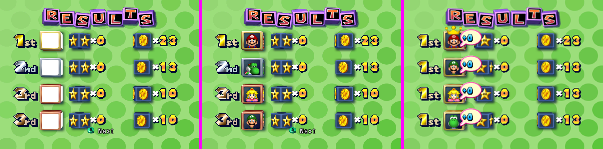
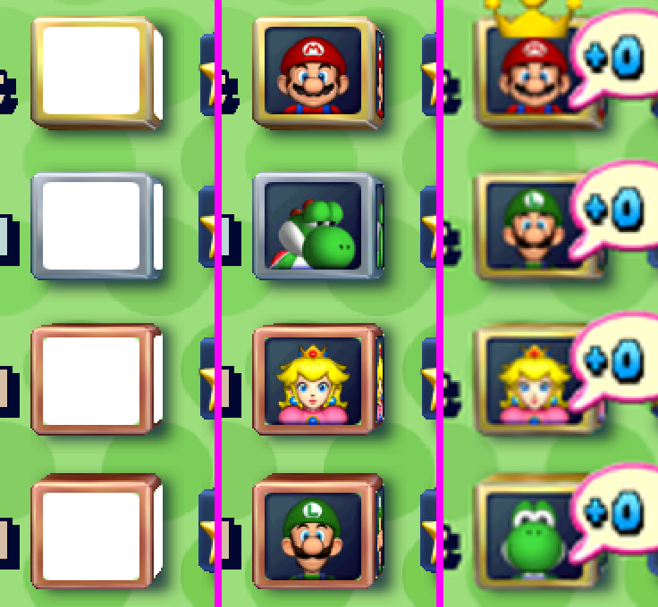

Mario, Yoshi, Peach and Luigi in gold, silver and bronze frames (the
console's run tied all four for first, hence its four gold frames). The
GL trace of the frame draw (`--gltrace`, `docs/soak/m22-results-gltrace-f17401.log.gz`)
shows the four units programmed exactly as designed, which is what
pointed at the draw after it.

**And the title.** The textured highlight is not rare: §36.2 counted
38,304 emissions on the walk and the title's frame 800 alone has 19,504
primitives of it — **every character on the title screen**, drawn since
M3 with `T_mask · c0 + PREV` from the diffuse channel, i.e. brightened
everywhere the mask is light. Frame 800 changes:

| frame | §36 md5 (= `--nohilitetex`, to the byte) | **M22 md5** | pixels differing | what |
|---:|---|---|---:|---|
| 800 | `5df69d40…` | **`1df90661d29beebb8a27fdbe99ceeae2`** | 5.2% of channel samples by more than 8, mean 2.6 levels, worst 145 | the title's characters: saturated colour with a specular spot instead of a wash |
| 3000 | `8762d432…` | unchanged | 0 | |
| 7000 | `f5b52130…` | unchanged | 0 | Toad's highlight is the lerp shape (mode 1) |

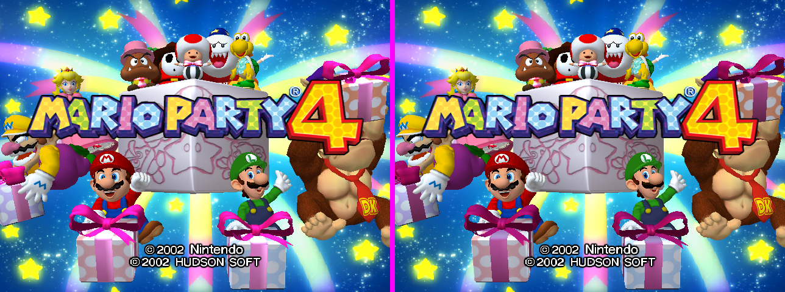


Not a rounding re-base: the wash was the bug, and `--nohilitetex`
reproduces §36's `5df69d40…`. The console's `boot-0800.png` is a
different moment of the intro (DK and Peach in close-up) and cannot be
diffed against it; the results screen above is the pixel witness for
the shape.

### 37.4 The final build's walk

`docs/soak/m22-walk-final.log.gz`, the shipped defaults (both levers
off, the setter fixes and the three rewrites in), started ninety seconds
after the install:

| scene | M21 final | **M22 final** | gx ms/frame |
|---|---:|---:|---|
| title (700–870) | 28.79 fps | **28.34** | 28.48 → 28.98 (the highlight's second program on every character) |
| character select (2600–3600) | 19.94 | **19.66** | 38.14 → 38.80 |
| board (6000–8900) | 25.82 | **25.68** | 24.57 → 24.86 |
| wall clock, 9,000 frames | 324.6 s | **327.0** | |
| batches / GL draws | 1,941,408 / 2,808,782 | identical | |
| frame 800 / 3000 / 7000 | `5df69d40` / `8762d432` / `f5b52130` | **`1df90661`** / `8762d432` / `f5b52130` | §37.3 |

Within the walk's noise (±1%; §36.5's base and final arms differed by as
much) and slightly on the slow side of it — the title's characters now
run the lit-plus-specular program with the alpha write, and 11,330 unit
emissions of the new shapes replace folds that were one unit each. The
three md5s are the references from here: **800 `1df90661…`, 3000
`8762d432…`, 7000 `f5b52130…`**; `--nohilitetex` reproduces §36's set.
One thing the counters raise and the frames do not settle: 4,578 of the
walk's tinted-overlay pairs carried a tint the rewrite drops (none on
the three reference frames, none on the title's first 870); where they
are and what they look like is an open witness.

### 37.5 Three things found on the way

* **A walk started within a minute of `g4_install.sh` has a slow
  title.** Both walks that ran right after an install read 20.8 and 23.0
  fps on frames 700–870 against 27–28.6 for every walk and short run that
  did not (the board and character select windows, minutes later, were
  unaffected). The install rewrites the 20 MB bundle and the G4 spends
  the next half-minute on it (Spotlight, the disk). Wait ninety seconds,
  or run a throwaway, before an A/B walk.
* **`--drawlog` prints `creg`/`areg` and the resolved konst colours per
  stage** now; §36.2's reading of the portraits was made without them
  and mistook the frame for the face. `--dumptex` slot numbers are cache
  slots, not GL names; the drawlog's `gl N` is the name.
* **The batch-ender table has a `transient` column** (the flushes whose
  next batch had the same state) — the instrument that turned the 61%
  into an onion.

### 37.6 What M22 shipped, and what it did not

| shipped, with a witness | |
|---|---|
| the results-screen portraits: two register shapes rewritten, the textured highlight in the primary alpha (§37.3) | frame 17,400 against the console; the title's characters re-based with the diff |
| five setters that ended batches for nothing, `GXLoadTexObj` / `GXLoadTlut` compare-first, the honest mergeable signature, the `transient` column (§37.2) | exact; the control arm reproduces §36's three md5s and its batch count |
| the lazy flush and the CPU pre-transform, built twice, measured, **off** (§37.2) | the table; `--lazyflush`, `--premerge-max N` |
| the soak's read (§37.1), `docs/soak/m22-*`, `docs/screenshots/m22-*` | |

**Not done, and why:**

* **A faster drawn frame.** The lever §36.4 named does not exist on this
  driver (§37.2); the next honest one is fewer *draw calls*, which for
  2.4M single-strip sprites means a texture atlas, or the fragment
  shader (`GL_ATI_text_fragment_shader`) for the picture's remaining
  folds — neither started.
* **Item 3** — Stamp Out!'s paper (the 2.5-minute reproduction in §36.2
  stands), the scene-change audio underruns, the fresh-process DRAW in
  Avalanche! — not started: the day went to the two builds of the lever
  and to finding the second shape.
* The tinted specular (mode 2 takes the luminance) and a tinted overlay
  (shape 3 drops the tint) are counted, not drawn.

### 37.7 What M23 starts with

Left running: `g4 run --soak --com4 --rtc dolphin --freshcard --realtime
--snap-every 5000 --snap-keep 3 --status --ovllog --stuckwatch 200` on
the final build (`isle` md5 `c0dd5844…`) — the first soak with the
portraits drawn and the setter fixes in. Read it first (the MEM1-top
fault is still unreproduced), then Item 3 of M21's brief, then the
atlas question.

## 38. M23 log — the paper was the padding, and every texture was decoded twice *(2026-09-19, littlejelly)*

M23's brief was §37.7's: read the leave-behind soak (§38.1), Stamp Out!'s
paper (§38.2), the scene-change audio underruns (§38.3), and, if the day
allowed, the dropped tint and the atlas question (§38.4). The soak was
not overnight — M22 ended minutes before M23 began — so it ran 84
minutes, through a whole 20-turn board and into the second, while the
paper was worked on the MacBook bench. The paper turned out to be
**two** faults, neither of them the ones §36.2 listed: the copy of a
half-scale shadow map took the bottom-left quarter of the pass at 1:1
(the floor shadows), and the copy's texture was padded to a power of
two with **memory nobody had written** — the paper's projection sampled
past the region's edge and drew VRAM garbage, green on one card, orange
on another, white on the run where that memory was black (§38.2). The
underruns' cold decode was measured to the frame and turned out to be
**double**: a miss stored the exhaustive hash and the next frame's
sampled one never matched, so every texture over a kilobyte was decoded
and uploaded twice (§38.3). On the way: the stage *after* the M22
lerp-by-konst pair was being emitted as the M16 triple's third unit, and
the mode select's file boxes had been drawn at 170 where the console has
99 (§38.4); and a read-back that was fixed once had to be fixed twice
(§38.5).

### 38.1 The soak, read

`g4 run --soak --com4 --rtc dolphin --freshcard --realtime --snap-every
5000 --snap-keep 3 --status --ovllog --stuckwatch 200` on the M22 build
(`c0dd5844…`), 17:02 to 18:26 G4 time — **84 minutes, 298,500 frames,
4,975 status lines** (`docs/soak/m23-soak12-m22-leave-84min.log.gz`):

| | |
|---|---|
| mean speed | **100.2%** over the run; on the board 99.2% (turn 1, the load) then **99.8–100.4% on every turn 2–20** — it holds past turn 12 |
| presented fps | 18.4 overall; board turns 15.9–20.2 (mean 17.9); minigames 10.2 (`m414`) to 27.1 (`m421`) |
| where it got | **board 1 played through all 20 turns** → results (`mstory3dll`, frame ~250k) → `modeseldll` → `mentdll` → **board 2, turn 1** (frame 296,580) |
| minigames dealt | 28 plays of 25 modules, in order: m412 m428 m420 m444 m423 m438 m429 m444 m430 **m406** m416 m405 m438 m431 m422 m410 m407 m421 m424 m436 m404 m427 m455 m401 m414 m418 m404 m402; `m406` once (86,431–88,903, 2,472 frames, as the M19 soak's first play); **m415 not dealt**, no second m406 (board 2 had a turn) |
| `REL .data:` re-opens | `instdll` 1 of 800 ×24, `resultdll` 1–4 of 1,760 ×23, `w01dll` 1–4 of 3,528 ×8, `m444dll` 10 of 5,492 ×1 (its second play), `modeseldll` 2 of 2,100, `mstory3dll` 10 of 1,160 — every re-entry reset |
| `copy-read:` / `EFB copies:` / `hilite:` / `skin:` / `musyx_aram:` | not written: the stop is a `killall`, and m415 was not dealt |
| STUCK | 3, all the chain's designed 200 s waits (`modeseldll` at 268,478, `mentdll` at 280,776 and 295,044) |
| resyncs | 7, each ~1.0 s: the two board loads (5,116; 282,651 → 295,324 for board 2), `m438` (58,429), **two inside `m401`** (217,770 / 219,422; it ran at 97.5%) and one in `m414` (226,368; 98.8%, 10.2 fps) |
| faults / MEM1-top guard fault (§36.5) | **0 / did not recur** (the board load that faulted one walk in twelve passed twice) |
| `tex` / `rss` | 671 entries / 40.9 MB from turn 1, 798 by turn 14, 830 at the end (M21's budget holding); rss 120–132 MB, peak **174 MB inside `mentdll` before board 2** (the menu's textures resident beside the load) |

Nothing to act on. The M22 bundle is kept on the G4 as
`~/MarioParty4-m22.app` so its ring (`snaps/f285000..f295000`) restores.

### 38.2 Stamp Out!'s paper: the copy's padding, and the quarter

**The reproduction moved to the MacBook.** The 2.5-minute reproduction
(§36.2) runs under Rosetta in seven, and the paper is a logic question,
not a speed one, so the diagnosis ran there while the G4 soaked; the
witness is the G4's.

**The first cause: the half-scale copy took a quarter.** `GXSetTexCopyDst`'s
`mipmap` flag is the copy unit's 2×2 box filter — the source rectangle is
twice the destination in each axis — and every shadow map in the game is
one (hsfman.c:2001: a 384×384 pass copied to 192×192, `Hu3DShadowData.size
= 0xC0` by default). `gx_tex_copy` copied `min(src, dst)` at 1:1: the
bottom-left 192×192 of the pass, magnified twice. The copy now keeps the
whole source rectangle at full size (`copy_w/h`, su/sv over it), GL's
bilinear samples it at 2:1 — within a texel of the box filter — and the
read-back does the 2×2 mean exactly. `--nocopyhalf` is the old corner. On
the MacBook the paper went from a magnified corner to **a picture of the
scene** — which said the region was now right and its content was not.

**The reading.** `--dumpcopy` (new) writes the copy's texels and the bytes
the game gets, and on a `--dumpframe` frame the copy right after it is
made. Every one was right: at 14,472–14,480 the intro's silhouettes
(the notepad, the toys, the rings), at 14,600 black, at 14,700 the four
players' little stamps, 40% grey on black exactly as `FaceDrawShadow`
draws them (`screenshots/m23-m415-efbcopies-and-bands-mbp.png`). Every
texture the paper draws was right too (`--dumptex`: the 600×600 paper
with its clouds, the 192×192 canvas, the floor;
`m23-m415-paper-textures-mbp.png`), and `--nohilite` kept the bands. What
was left was *where the paper samples*: `SetShadow` (hsfdraw.c) projects
the map through `GX_TG_MTX3x4` from position, the paper is larger than
the shadow camera's view, and the coordinates run past the region's
edge. GX clamps at the copy's real edge (192); GL clamps at the padded
texture's (256, now 512), and the padding — sized with
`glTexImage2D(…, NULL)` — was **whatever the driver's VRAM held**: a
stretched column of it across the paper, green with dark bands on the
Radeon in lockstep, deep blue at real time, orange on the Intel driver,
white on M20's one run where that memory was black. The texture is
sized with zeroed texels now; zero is the shadow map's own edge (its
clear colour, hsfman.c:1930, and the two-pixel border its scissor
leaves), so a clamped sample past the region reads what the console's
would.

**The witness**, the same reproduction on the G4, M21's frame beside
M23's and the console's 10,973:

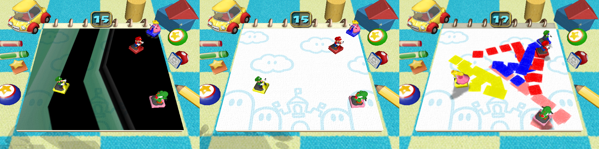

The paper is white with the faint blue line art. `--nocopyhalf` with the
padding defined draws the paper white too — the quarter was never the
paper, it was the **floor**: the static shadows the intro bakes into the
canvas and projects onto the table cloth were the bottom-left quarter of
the pass at twice the size
(`m23-m415-floor-shadow-quarter-vs-boxfilter-f15000.png`: the ball's
round shadow and the rings' where the quarter had blurred shapes). At
real time from boot on the final build, the stamps landing on white
paper (`m23-m415-paper-realtime-from-boot-f16006-f16200.png`).

**The read-back, fixed twice** (§38.5): keeping the copy at 384×384 made
`port_gx_copy_read`'s `glGetTexImage` a megabyte over AGP — 120 ms on
the Radeon, and Stamp Out!'s intro reads 120 times: two resyncs
(`docs/soak/m23-paper-rt.log.gz`) where M21 had none. The copy now draws
itself at 192×192 into the shadow region it is about to clear and
`glReadPixels` that (147 KB; a bilinear quad at exactly 2:1 is the box
filter, every output pixel's centre on a texel boundary), keeps the
bytes for the reads on consumed frames, and a read with no copy since
draws the last one into the back buffer on demand. Final build, from
boot at real time: **115 reads, 28 through the back buffer in 69 ms, 2
on demand in 13 ms, 0 resyncs**, 80 underruns / 1.2 s on the whole
16,300-frame run against 238 / 3.2 s before
(`m23-paper-rt-final2.log.gz`). The GPU's box filter differs from the
CPU's at silhouette edges only (386 of 36,864 canvas texels by more than
one level, the Intel driver's sample position; mean 0.5 levels).

**The md5s hold.** No shadow pass on the title, the character select or
the board: 800 `1df90661…`, 3000 `8762d432…`, 7000 `f5b52130…` on every
arm of the day (§38.3).

### 38.3 The scene-change underruns: the decode, measured, and the decode that ran twice

**The instrument.** `gx_tex_frame_decode_take` counts, per frame, the
textures decoded, the source and RGBA bytes, and the decode, upload and
hash milliseconds; the `stall:` line carries them, `--texdecodelog`
prints any frame over 20 ms of it, and the report has a `texture decode
(M23):` line. On the real-time walk (`--soak --realtime --frames 16000
--perf`, the board load, `m412`, and the board's return), the first drawn
frame of each scene, M22 code (`--oldfirsthash --norekey`):

| frame | scene | frame ms (gx) | textures decoded | src → RGBA | decode + upload |
|---:|---|---:|---:|---|---:|
| 719 / 725 | title | 310 (287) / 242 (205) | 60 / **55 again** | 2.2 → 6.4 MB / the same | 103 / 116 ms |
| 1967 / 1973 | mode select | 363 (319) / 282 (244) | 101 / **98 again** | 1.8 → 6.5 MB / the same | 145 / 150 ms |
| 5106 / 5112 / 5118 | the board (after a 348 ms consumed load frame) | 306 (282) / 386 (365) / 158 (143) | 104 / **202** / 102 | 1.1 → 6.1 / 1.3 → 7.9 / 0.5 → 3.1 MB | 129 / 165 / 54 ms |
| 10832 / 10838 | `m412` | 484 (177) / 149 (132) | 67 / 51 | 0.95 → 3.3 MB ×2 | 59 / 60 ms |
| 13802 | the board's return | 118 (105) | 33 | 0.4 → 1.6 MB | 53 ms |

Two things the table says. The decode and upload are 40–45% of a
first drawn frame's gx time (the rest is the frame's own cost cold:
display lists into the ring, vertex programs), and **every scene's
second drawn frame decoded the same textures again**. That was the
cache: a miss stored the *exhaustive* first-sight hash as the entry's
`content`, the next epoch's revalidation computed the *sampled* hash
(anything over `TEX_HASH_SAMPLE`, 1 KB) and compared the two — they
never match, so the entry was "rewritten in place" and decoded and
uploaded again, once, on its second frame. M22's walk had said so
(634 misses, 527 re-uploads, 76 MB decoded for 40 MB held) and nobody
read it. The miss now stores the hash the revalidation will compute and
keeps the exhaustive one as `content_full`; `--oldfirsthash` keeps the
double decode. The board's return was never the cost the brief
supposed: the board's textures stay at their addresses through a
minigame (33 decodes, 53 ms on the way back), so the content re-key
(`cache_find_by_content`: a miss whose exhaustive hash matches an entry
not bound this frame or the last takes that entry over — no decode, no
upload; `--norekey`) pays on the instruction screen and the results
(22 and 13 re-keys) rather than on the board.

**The A/B**, the 16,000-frame real-time walk, same binary, two pairs (the
first pair from the day's first chain, the second on the final build):

| arm | decodes | decoded | decode + upload | frames > 20 ms of it | re-uploads | re-keyed | underruns | resyncs | 800 / 3000 / 7000 |
|---|---:|---:|---:|---:|---:|---:|---:|---|---|
| old (`--oldfirsthash --norekey`) | 1,655 | 106 MB | 1,016 + 1,255 ms | 26 | 737 | 0 | 129 / 1.9 s | 1 (the board load) | held |
| hash only (`--norekey`) | 935 | 56 MB | 520 + 638 ms | 13 | 16 | 0 | 159 / 2.5 s | 1 (frame 14,203, below) | held |
| re-key only (`--oldfirsthash`) | 1,615 | 106 MB | 1,014 + 1,266 ms | 26 | 737 | 60 | 225 / 3.4 s | 2 | held |
| **new** | **785** | **49 MB** | **438 + 535 ms** | **13** | 16 | 183 (12.9 MB) | 155 / 2.4 s | 1 (14,203) | held |
| old, second pair | 1,648 | 106 MB | 1,026 + 1,261 ms | 26 | 731 | 0 | 251 / 3.8 s | 2 | held |
| **new, second pair** | 788 | 49 MB | 452 + 543 ms | 13 | 16 | 182 | 227 / 3.6 s | 1 | held |

The decode is halved — 1,655 → 785 textures, 106 → 49 MB, 2.27 → 0.97 s
of the walk, 26 → 13 frames over 20 ms — and the first-drawn-frame
stalls shorten by their second half (title 310+242 → 298; mode select
363+282 → 350; board 306+386+158 → 314+217). The presented fps in the
title window rises 18.8 → 21.2 (the second cold frame was inside it).
**The underrun totals do not follow**, and the reason is not texture
work: three of the four new-code walks and one old-code walk stalled
**1.7–2.9 s of game time at frame 14,198** — the results screen's last
second, `resultdll`, no decode, gx 1 ms — and the M22-code walk of the
first chain did not (its 14,242–14,244 board reload was 118 + 349 ms in
every arm). It is the frame the results screen saves the game; a 512 KB
write and `sync` on the G4 takes 175 ms in isolation; the stall grew run
by run (1.73, 1.75, 1.77, 2.9 s). `card_flush` is timed now (`CARD:
image flush took N ms`), and the leave-behind soak passes two results
screens. Without that frame the new arms' underruns are the old arms'
minus the second cold frame of every scene (rt-old 1.9 s → rt-new 0.7 s
once the 1.7 s is taken out of its 2.4).

What the measurement says about the rest: a scene's first drawn frame
is still 250–350 ms, of which the (single) decode is now 100–150; the
remainder is the frame's own cold cost. A larger `--audiolead` around a
load would hide 100–200 ms of it at the price of that much latency for
the scene; not done.

### 38.4 The tint that was 5% and the box that was 70%, and the atlas question

**Where the tinted pairs are.** `--tintlog` (new): every one of the walk's
tinted lerp-by-konst pairs (2,256 on 16,000 frames; §37.6's 4,578 on
the 9,000-frame turbo walk) is the mode select's, frames 1,197–1,958,
`K_rgb = 0.95` on a 128×128 IA8 texture, and every one has **`K_c = 1`**
— the lerp takes the texture whole and `PREV` drops out, so the pair has
a one-unit exact form, `T * K_rgb`, which is emitted now (`--notint` is
M22's drop). The frame is the file select's bevelled boxes
(`whitecube_hilight`, hsfdraw.c:1243): the tint is 5 levels of the
frame's highlight.

**What the oracle said instead.** A Dolphin capture of the same screen
(`~/mp4-oracle/capture-linux.sh 200 … -C Dolphin.Core.EnableCheats=True`
— without the `-C` the Gecko schedule does not land and the capture sits
through the movie and the attract loop; frame 650,
`port/ref/frames/fileselect-console-0650.png`) put the *unselected*
boxes' frames at **99** where the port drew 170 (tint or no tint). The
draw is four stages: the box, the pair (B, C), then hsfdraw's
`invAlpha` stage — colour pass, alpha `APREV * A0` with `A0 = 76` — and
the port's emit loop, having placed the pair in units 1–2, still matched
the M16 triple's range (`i <= regfix_k + 2`) for stage 3 and emitted it
as the triple's third unit: `PREV * RAS`, alpha `PREV`. Every stage after
a lerp-by-konst pair was drawn that way since M22; the file boxes lost
their 0.3 and drew at full highlight. With the guard:

| File 2's top bevel (mean RGB) | before | **after** | console |
|---|---|---|---|
| top edge | 165 165 167 | **98 97 103** | 99 99 103 |
| left edge | 164 161 182 | **83 81 102** | 83 80 102 |

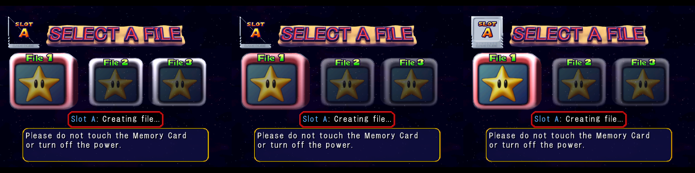

The selected box (`A0 = 153`) is now slightly *under* the console on its
top bevel (195 159 151 against 205 196 184) where before the missing
×0.6 had happened to land on it; the remainder is the strength of the
specular fold on the red frame (`redcube_hilight`, chan 5, §36.2), an
open witness.

**The atlas question, with numbers.** `--submitstats` now counts the
batches that differ from the one before in the matrices *and the
textures' identity* alone (same format, wrap and filter — what an atlas
page must share). On the 16,000-frame real-time walk (4,769 drawn
frames, 1,694,333 batches, 1,399,758 GL draws):

| | batches | per drawn frame | vertices |
|---|---:|---:|---:|
| all | 1,694,333 | 355 | |
| differ in the matrices alone (M21's count) | 617,595 (36%) | 130 | 38.6 M |
| differ in the matrices and the textures alone (**the atlas**) | **399,414 (24%)** | **84** | 26.4 M |
| — of which 16 vertices or fewer (sprites) | 347,919 (21%) | 73 | |

So a runtime atlas of the sprite cache, with the CPU pre-transform §37.2
already built to span the matrices, could join at most a quarter of the
batches — 84 of 355 a drawn frame, nearly all sprites — and the draw
calls with them. §37.2 merged 13% of the batches (138K objects) and
measured nothing, because a batch that ends without a GL state change
was never the expensive kind; these *do* end with one (a texture bind),
so the honest expectation is the driver's per-call share of those 84
calls: the M16 profile puts `IMM_Exec` at 28–35% of a drawn frame, per
call and per vertex, and these are the smallest calls in it. **A few
percent of the drawn frame at best, against a texture-cache rewrite
(sub-rect UVs per vertex, no `GX_REPEAT`, CI textures with their own
palettes, eviction by page)** — not a milestone, and not built.

### 38.5 Three things found on the way

* **A fix can move the cost somewhere the witness does not look.** The
  half-scale copy fixed the paper on the MacBook and cost the intro two
  resyncs on the G4 (§38.2): a texture four times larger read back with
  the same call. The real-time run from boot is part of the witness, not
  an afterthought.
* **`--dumpcopy` is not free**: the copy's PPM (442 KB) and the canvas
  per read-back are written on the game thread, 170–230 ms a frame on
  the G4's disk; a run with it on is not a speed measurement
  (`m23-paper-rt-final.log.gz` has it on, `-final2` does not).
* **The Dolphin capture on littlejelly needs `-C
  Dolphin.Core.EnableCheats=True`** on the command line and this
  session's own user dir (`~/mp4-dolphin-m20`); and `capture-linux.sh`'s
  `kill` does not reach `dolphin-emu` inside the Flatpak (§35.3's note
  again): 7,000 frames and 2 GB before `pgrep -x dolphin-emu` was killed.

### 38.6 What M23 shipped, and what it did not

| shipped, with a witness | |
|---|---|
| the half-scale EFB copy kept at source size, the read-back box-filtered, the copy's padding defined (§38.2) | Stamp Out!'s paper white with the console's line art, lockstep and at real time from boot; the floor's shadows; `--nocopyhalf` |
| the read-back drawn at 192×192 and read from the back buffer (§38.2, §38.5) | 0 resyncs in the intro on the final build, 115 reads in 82 ms |
| the double decode on first sight (§38.3) | 1,655 → 785 decodes, 106 → 49 MB, 2.27 → 0.97 s on the walk; every scene's second cold frame gone; `--oldfirsthash` |
| the content re-key (§38.3) | 183 re-keys / 12.9 MB on the walk, exact; `--norekey` |
| the per-frame decode instrument, `--texdecodelog`, the `texture decode` report line, the timed card flush | the table in §38.3 |
| the stage after a lerp-by-konst pair (§38.4) | the file select's boxes at the console's 99; the oracle frame captured |
| the tint with `K_c = 1` (§38.4); `--tintlog`, `--notint` | 5 levels on the same boxes |
| the atlas count under `--submitstats` (§38.4) | the table |
| the soak's read (§38.1), `docs/soak/m23-*`, `docs/screenshots/m23-*` | |

**Not done, and why:**

* **The 1.7–2.9 s stall at the results screen's save** (§38.3): found
  in four of six real-time walks, timed now, not explained; the
  leave-behind soak is the watch (it saves twice).
* **The selected file box's specular** (§38.4): 10 levels under the
  console on its bevel; an open witness with the oracle frame in hand.
* **The scene's first drawn frame** is still 250–350 ms with the decode
  halved; the cold display-list and program cost is the next measurement.
* The GPU box filter is within a texel of the CPU's, not identical.
* **A fresh-process DRAW in Avalanche!** (§35.2): not started.

### 38.7 What M24 starts with

Left running: `g4 run --soak --com4 --rtc dolphin --freshcard --realtime
--snap-every 5000 --snap-keep 3 --status --ovllog --stuckwatch 200` on
the final build (`isle` md5 `fd48f0df…`) — the first soak with the
padding defined, the single decode, and the pair guard. Read it first:
the `CARD: image flush took` lines at the two results screens (§38.3),
the `texture decode (M23):` and `copy-read:` report lines if it ends
cleanly, `tex`/`rss` past turn 12, and whether m415 or a second m406 is
dealt. Then the results-save stall if the soak names it, the first drawn
frame's remaining cost, and the selected box's specular.

## 39. M24 log — the second core *(2026-09-19, littlejelly)*

M24's brief was the second core: the G4 is a dual 1 GHz (`hw.ncpu 2`,
found in M17 and unused since), and until now the port ran the game, the
GX interpreter, the mixer and the texture decode on one of them, the
snapshot writer (§33.5) being the only thread. The brief's constraints
were the design: the game stays single-threaded; a worker takes only work
that has no dependency on the game's frame, exactly, from a copy of its
inputs published at the retrace; a single-core G4 (every iMac G4, eMac
and PowerBook, most towers) runs today's code at today's cost; both modes
give byte-identical frames and byte-identical `.wav`. What shipped: the
mixer's value half on a worker (§39.2), the texture decode staged from
consumed frames (§39.3), and — found on the way, a correctness bug that
outranks both — **the mixer had been reading its options through a packed
struct since M20**: `depop` was `--stuckwatch`, `resample4` was `--soak`,
so every `--soak` run since M20 — every soak and every A/B walk — mixed
with the 4-tap resampler §20.5 had rejected, and every other run (the
`--minigame` reproductions, the `--play` walks without `--soak`) with the
linear one and no depop (§39.1).

### 39.1 The soak, read; and the mixer's options, read wrong since M20

`g4 run --soak --com4 --rtc dolphin --freshcard --realtime --snap-every
5000 --snap-keep 3 --status --ovllog --stuckwatch 200` on the M23 build
(`fd48f0df…`), 19:38 to 20:51 G4 time — **73 minutes, 262,140 frames,
4,369 status lines** (`docs/soak/m24-soak13-m23-leave-73min.log.gz`),
stopped by hand after the results screen so the G4 could take the day's
A/B:

| | |
|---|---|
| mean speed | **100.1%**; board turns 1–20 at 99.8–100.5%, every one |
| presented fps | 18.7 overall; board turns 16.1–19.8 (mean 17.9); minigames 9.9 (`m414`) to 26.7 (`m421`) |
| where it got | **board 1, all 20 turns** → results (`mstory3dll` at 250,380) → `modeseldll` (the chain's 200 s wait, where it was stopped) |
| minigames dealt | 28 plays of 25 modules, **M23's list in M23's order** (m412 m428 m420 m444 m423 m438 m429 m444 m430 m406 m416 m405 m438 m431 m422 m410 m407 m421 m424 m436 m404 m427 m455 m401 m414 m418 m404 m402): `--rtc dolphin --freshcard` replays; m415 not dealt |
| the results screen's save (§38.3's 1.7–2.9 s stall) | **did not happen**: 22 card writes, 46 image flushes, none over the 50 ms the `CARD: image flush took` line prints at; 0 resyncs anywhere near the results |
| resyncs | 2, both ~1.0 s, both inside minigames: `m401` (217,837; 99.1%) and `m414` (226,571; 98.9%, 9.9 fps) — M23's two |
| STUCK / faults / MEM1-top fault (§36.5) | **0 / 0 / did not recur** |
| `REL .data:` | 83 re-opens, 60 reset — every re-entry |
| audio | 315 underruns / 2.8 s over 73 minutes; 874,674 frames mixed, 36 voices at most; **`resampler 4-tap Catmull-Rom, depop on`** — see below |
| `tex` / `rss` | 555 entries at turn 1, 626 from turn 2 to 11, 800 at the end (40.9 MB, M21's budget); rss 114–126 MB on the board, peak 171 MB |

Nothing to act on; the M23 bundle is kept as `~/MarioParty4-m23.app`.

**The mixer's options.** The first threaded run on the MacBook bench
wrote no `--mixtrace` file, and the reason was older than M24: the port's
`PortOptions` has `long long seed` and `long long rtc` in it, 8-aligned
under the build's `-malign-natural` — except in `musyx_mix.c`, which
included `musyx/synth.h` before `port.h`, and `synth.h` opens
`#pragma pack(4)` and never closes it (its `#pragma push` is Metrowerks',
which GCC ignores). Under pack(4) `seed` sits 4 bytes earlier, and so does
every field after it. The two layouts had agreed until M20 added an `int`
before `seed` (commit `8aa5f485`); from then on the mixer read

| the mixer asked for | it got | so |
|---|---|---|
| `depop` (on by default) | `stuckwatch` | the voice cut-off ramp ran only under `--stuckwatch` — which `--soak` sets to 90 when unset, so in every soak and every `--soak` walk, and in no reproduction |
| `resample4` (off by default) | `soak` | every `--soak` run mixed with the 4-tap resampler §20.5 had measured and rejected; the reproductions with the linear one |
| `clickstat` | `depop` (1) | the click count always on: harmless |
| `mixcheck` | `skindeferall` | `--mixcheck` checked nothing since M20 |
| `mixtrace` | `restore_lax` | `--mixtrace FILE` wrote nothing since M20 |
| `perf` | a neighbour | the mixer's `--perf` line came and went |

The 73-minute soak above says so in its own report (`resampler 4-tap
Catmull-Rom, depop on`), as did M23's, M22's and M21's, and the M23
bundle's walks of this session say the same; nobody read the line
against the command. The fix is the include order (`musyx_mix.h`
includes `port.h` first, with the reason), and it changes the `.wav` of
every run: a `--soak` run's audio now has the linear resampler and the
depop as designed since M7 and M20, a reproduction's has the depop it
never had. So the `.wav` of any milestone after M19 is not comparable
with M24's — the identity proof below is between M24's two modes, on
M24's build, which is what the brief asks — and the M20–M23 walks'
`aud` figures (1.66 ms) were the 4-tap's, which §39.4b re-measures.

### 39.2 The mixer's value half on the second core

**The shape of the work.** `port_audio_tick` runs at every retrace, before
the game's frame: 3.34 simulated AI interrupts, each of which queues the
buffer the hardware has finished, mixes one 160-sample frame
(`salCtrlDsp` → `port_musyx_mix_frame`), runs the aux effects on the bus
the previous frame filled (`salHandleAuxProcessing`: the game's reverb,
msmsys.c:51), and then MusyX's five sequencer passes, which start and
stop voices on what the mix just left behind. The mix is 1.2–1.7 ms of
the retrace on the game thread (§32.4, §33.4: `aud`), sixty times a
second, and it is not one thing: the frame is entangled with MusyX at
every voice — a start reads the sample directory and calls the synth,
the ADSR runs per sub-frame and its state is the sequencer's, a voice
that ends sends a message and unlinks itself from the studio's list,
and the sample position is written back for the streaming layer to read
— and the sequencer passes *between* the interrupts of one tick read
all of it. Nothing of that can move a retrace later without changing
what the sequencer sees, so the whole frame cannot move.

**The seam.** What can move is the arithmetic. The frame is split into
a **control half** and a **value half** (`musyx_mix.c`, one body, three
instantiations of a `mode` constant GCC folds: `MIX_BOTH` is the fused
frame every run before M24 ran, `MIX_CTL` and `MIX_VAL` the two halves):

* the control half runs on the game thread exactly where the fused
  frame ran: the voice starts (every MusyX call, the sample-directory
  reads, the heap walk), `adsrHandle` per sub-frame, the volume ramps'
  bookkeeping (`setup_ramp` mutates `lastVol*`), the play-info and the
  `currentAddr` write-back, the voice-done message and the unlink — and
  the **same per-sample loop with the value arithmetic elided**, so it
  advances every voice's position (`phase`, `curSample`, `frameOffset`,
  the loop wrap, `ended`) exactly as the fused loop does and ends the
  voice at the same sample. It leaves the value half a plan: per voice,
  the `DSPvoice` as the mixer read it at that voice's turn in the walk
  (after the voices before it ran — a voice-done message can deactivate
  a later one), the action (skip / run / start), and for a start the
  `MixVoice` as the control half initialised it;
* the value half runs on the worker from the plan and its own copy of
  the voice table: the ADPCM decode, the resampler, the gains, the bus
  accumulates, the depop, the studio inputs, the aux return, the output,
  the peak and click statistics, `--mixcheck`, `--mixtrace` — on the
  plan's copy of each `DSPvoice` (its `adsrHandle` gives the same
  envelope, its `setup_ramp` the same deltas, and its writes are
  discarded), never on the real one, with `salSynthSendMessage` and
  `salDeactivateVoice` compiled out. The bus buffers and the depop sums
  are `dspStudio`'s own: nothing but the mixer touches them;
* the tick's job is the ordered list of the tick's steps — queue, mix,
  aux, queue, mix, aux, … — exactly the fused order. The aux effects
  are a step because `snd_handle_irq` calls them on the bus the worker
  fills: the Makefile renames that one call site to `port_sal_aux_hook`
  (the `hwSaveSample` trick of §34.4; `extern/` untouched), which runs
  hw_dspctrl.c:2112's loop from a capture of the handlers, inline or as
  a step. The effects' state is touched by nothing but the callback at
  runtime (the game sets it once at `msmSysInit`; `grep` for
  `UpdateSettings` finds no call);
* the job is submitted at the end of the tick and **joined at the top
  of the next retrace** (`port_workers_retrace_join`, the first thing
  `VIWaitForRetrace` does, before the snapshot and the next tick),
  where the value half's voice table is compared with the control
  half's on every live voice's position and taken over whole — so the
  snapshot registry's `voices` is the complete state at every retrace
  boundary, as before. A job the worker has not started by then is run
  by the game thread (`late`), one it is in the middle of is waited for
  (`waited`, timed); both counted in the report.

**What makes it exact.** The value half of retrace N reads: the plan
(copied at the tick), its own table (equal to the game's at the tick),
the sample bytes in the port's ARAM heap, the effect state, and
constants. ARAM is the one input it shares with the game, and every
write to it — `aramUploadData` (a group push, a stream's refill),
`ARStartDMA` — finishes the pending job first; a write from inside the
tick (a stream refill from the sequencer's own `streamHandle`) finishes
the job built so far on the game thread and the tick carries on split
from a fresh one. A MEM1 sample (the game's heap, free to change under
the value half; none since M19) or a virtual sample (compType 5, whose
start is a synth message; unused by this game) makes the tick run fused,
counted. The **proofs**: `--mixtrace` of a 4,000-frame `--nodraw --turbo`
run and `--wav` of the 16,000-frame real-time walk, `--threads 0` against
`--threads 1`, byte for byte (§39.4); `--mixcheck` on both; 0 position
mismatches at 16,011 joins on the walk; the three frame md5s.

**Two things found while making it exact.** The value half's copy of a
starting voice is taken at entry, before the control half's init sets
its envelope up and writes its play-info — the first threaded run on
the MacBook rendered every new voice silent; the value half now redoes
`adsrSetup` (a function of the ADSR struct alone) and the play-info on
its copy. And the fused path leaves a refused voice's half-initialised
`MixVoice` behind (live 0, pitch set), which the value half never
touches: the join's check compares live voices only.

### 39.3 The texture decode, staged from consumed frames

A decode is pure — source bytes and a palette in, RGBA texels out — and
on a scene's first drawn frame it was 100–150 ms of the frame's 250–350
(§38.3: `dec` and `up` on the `stall:` line; the upload is GL and stays).
The drawn frame cannot show a placeholder (the md5s), so the only decode
that can move is one that can start **early**, and the brief's case (a)
is where that is: frame mode drops the GL work of a consumed frame, but
the setters still run, and a `GXLoadTexObj` on a consumed frame names a
texture the next drawn frame will very probably bind — a scene's load is
a consumed frame (348 ms, §38.3), and so are the frames right after it.
Case (b), the loaders (`HuDvdDataRead`, `HuSprLoad`), turned out to be
the same hook: the port learns of a texture only at `GXInitTexObj` /
`GXLoadTexObj`, which hsfdraw and the sprite path call per draw, on
consumed frames too.

The design (`gx_tex.c`, "M24"):

* `GXLoadTexObj` on a consumed frame notes the texture if the cache holds
  nothing at that address under any swap table (the bind's key carries
  the TEV stage's swap, which a setter cannot know; a staged decode
  serves every swap, the swizzle being applied at the upload). One
  hash-table probe and a dedupe on the consumed frame, nothing else;
* at the retrace (`port_gx_predecode_join`, in `port_workers_retrace_join`)
  the game thread copies each request's source bytes and palette into a
  staging entry — **the worker reads nothing of the game's** — and
  hands the batch to the decode worker, which computes the exhaustive
  content hash of the copies and decodes and pads them while the game
  runs on. It never waits for that worker: a decode that is not done
  is not done;
* a miss on a drawn frame computes the exhaustive hash of the live bytes
  as it always did (§38.3) and, if a staged entry carries the same key
  and the same hash, uploads the staged texels: the same function on
  the same bytes, so the upload is the one the inline decode would have
  made (the collision risk is the cache's own, unchanged). An entry the
  worker has not reached is claimed and decoded inline as before (the
  worker skips it); one nobody binds within 30 frames is dropped, and
  its address is not asked for again for 30 s — the indirect tiling's
  sheets and maps live in the tile cache, keyed by content, and were
  otherwise staged every retrace and dropped every time (1,856 requests
  in 1,500 frames of the menus, 71 taken). `--nopredecode` is the
  pre-M24 miss; `--predecodelog` names every drawn frame that took one.

### 39.4 The A/B on the walk, both modes

**The walk**: `--soak --com4 --rtc dolphin --freshcard --realtime --frames
16000 --perf --status --ovllog --perfwin … --dumpframe 800,3000,7000`,
§38.3's 16,000-frame real-time walk (the title, the mode select, the
character select, the board's load and first turns, `m412`, the results,
the board's return), every arm ninety seconds or more after any install,
each M24 arm twice (`docs/soak/m24-walk-*.log.gz`). Medians of the
`--perfdump` samples in the three windows; `aud` is the mixer's share of
the game thread's frame.

| arm | board: consumed frame (aud) | drawn | **presented** | character select: consumed (aud) | drawn | **presented** | title presented | underruns / resyncs |
|---|---:|---:|---:|---:|---:|---:|---:|---|
| **M23 bundle** (`fd48f0df`), twice | 7.93 / 7.91 ms (1.99) | 39.6 | **16.94 / 17.02** | 6.08 / 6.02 (2.00) | 52.8 / 52.2 | **13.40 / 13.60** | 21.2 / 21.2 | 155 / 160, 1 / 1 |
| M24 `--threads 0` (the single-core path), twice | 7.44 / 7.41 (1.42) | 39.7 | **17.73 / 17.78** | 5.50 / 5.39 (1.43) | 52.1 / 51.7 | **14.06 / 14.30** | 21.4 / 21.2 | 154 / 80, 1 / 0 |
| M24 `--threads 1` (the mixer's worker, the predecode on), twice | **6.61 / 6.57 (0.28)** | 39.0 / 38.8 | **19.30 / 19.33** | **4.53 / 4.54 (0.27)** | 51.4 | **14.92 / 14.92** | 21.4 / 21.4 | 80 / 157, 0 / 1 |
| M24 `--threads 1 --nomixthread` (the predecode alone) | 7.57 (1.44) | 39.4 | 17.61 | 5.65 (1.43) | 52.2 | 13.94 | 21.0 | 158, 1 |
| M24 `--threads 1 --nopredecode` (the mixer's worker alone) | **6.39 (0.27)** | 38.6 | **19.76** | **4.32 (0.27)** | 51.0 | **15.24** | 22.0 | 154, 1 |
| M24 `--threads 1` / `--threads 0` with `--wav` (the identity pair) | 6.62 / 7.52 | 38.9 / 39.4 | 18.91 / 17.47 | 4.51 / 5.54 | | 14.47 / 13.53 | | 153 / 203, 1 / 2 |
| **M24 final, the defaults** (the mixer's worker on, the predecode off), three times | **6.46 / 6.41 / 6.43 (0.28)** | 38.8 / 38.8 / 38.5 | **19.50 / 19.60 / 19.71** | **4.40 / 4.36 / 4.41 (0.27)** | 51.1 / 51.4 / 51.2 | **15.15 / 15.08 / 15.15** | 21.9 / 22.1 / 21.7 | 154 / 155 / 80, 1 / 1 / 0 |

**What the table says.**

* **The mixer's worker takes 1.15 ms off the board's consumed frame**
  (7.44 → 6.39 with the predecode off; `aud` 1.42 → 0.27, the control
  half) and 1.2 ms off the character select's, and the presented rate
  follows §32.1's arithmetic: the board **17.7 → 19.8 fps** (+12%), the
  character select **14.1 → 15.2** (+8%), the title unchanged (its frame
  is the drawn one). The worker did 19.8 s of value halves over the
  267 s walk — 7.4% of the second core — and the game thread waited for
  it at 17–26 of 15,986 joins, 6–8 ms in all (worst 0.8–1.4 ms); one job
  in each walk was run inline at the join. 0 position mismatches at
  16,011 joins; 0 ticks fused; 25 jobs finished mid-tick for a stream's
  refill.
* **The single-core path is cheaper than M23's, by the option fix, not
  by M24's code**: M23's mixer read `resample4` from `--soak` (on for the
  walk) and `depop` from `--stuckwatch` (off), so the M23 arm mixed with
  the 4-tap resampler and no depop; M24's `--threads 0` mixes with the
  linear one and the depop, as every run was meant to (1.99 → 1.42 ms).
  The like-for-like cost of M24's fused frame — `--threads 0 --resample4
  --nodepop` against the M23 bundle — is §39.4b below.
* **The predecode does not move the cold frame** (§39.3): alone it is
  17.61 fps on the board against 17.73–17.78 without it, and with the
  mixer's worker 19.30 against 19.76 without it — the copies on the game
  thread (285–323 ms over the walk, on the consumed frames after a load)
  cost what the decode saved (`dec` 447 → 177 ms over the walk) and the
  upload of memory-cold texels gave a third of that back (`up` 540 →
  596). Off by default; `--predecode`.
* **The underruns are the loads', in every arm**: 80 / 1.2 s when the
  results screen's last frame does not stall, 154–160 / 2.4 s when it
  does (frame 14,198, 1.75 s, `game`, in 10 of the day's 17 walks and in
  neither of the two soaks; **not the card flush**, which is timed and
  never printed — the disc image's reads are timed now, §39.7). The
  `--wav` pair is not a speed measurement: a queue step's `fwrite` on
  the worker at a scene load waits behind the disc image's reads (73
  waits, 4.0 s, worst 593 ms; the game thread's own `fwrite` in the
  fused arm is inside its load frames).

**The identity proofs**, on the G4:

| | `--threads 0` | `--threads 1` |
|---|---|---|
| frame 800 / 3000 / 7000, every arm above (10 walks) | `1df90661` / `8762d432` / `f5b52130` | identical — the M23 references |
| `--wav` of the 16,000-frame real-time walk | `f63e9096…` (and the same bytes in a third fused walk of the day) | `f63e9096…` |
| `--mixtrace` of 4,000 frames `--nodraw --turbo --headless` (92,239 lines) | `4531c71c…` `.wav` | identical trace, identical `.wav` |
| `--mixcheck` on those | 5,793,408 gains checked, 0 disagreed | 5,793,408, 0 |
| positions at the joins | | 0 mismatches in 16,011 joins (the walk), 0 in 4,000 (the trace run) |


The board at real time on the final build, the mixer's worker on
(`screenshots/m24-board-realtime-cpu2.png`), and its status line:

```
port> status f7920    w01dll       board 0 turn 1/20  mg 65936 ((none))  coins/stars 10/0c 10/0c 10/0c 10/0c  aud 0.30 ms  speed 101%  20.1 fps presented  tex 541/40935 KB  rss 115 MB  cpu 2
```

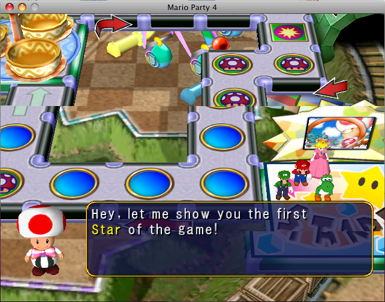

**39.4b The single-core cost, like for like.** `--threads 0` is today's
code with the option fix, so its cost against the M23 bundle is the fix's
as much as M24's. With M23's effective options given back to it
(`--threads 0 --resample4`; the depop is on in both, `--soak` having set
`--stuckwatch`), twice, against the M23 bundle's two walks:

| | board consumed (aud) | presented | character select consumed (aud) | presented | `aud` mean over the walk |
|---|---:|---:|---:|---:|---:|
| M23 bundle | 7.93 / 7.91 (1.99 / 1.99) | 16.94 / 17.02 | 6.08 / 6.02 (2.00) | 13.40 / 13.60 | 1.66 / 1.65 |
| M24 `--threads 0 --resample4` (the depop off in these two by a slip: `--nodepop`) | 7.50 / 7.57 (1.49 / 1.50) | 17.71 / 17.58 | 5.44 / 5.52 (1.47 / 1.50) | 14.28 / 14.16 | 1.25 / 1.25 |
| M24 `--threads 0` (linear, depop) | 7.44 / 7.41 (1.42) | 17.73 / 17.78 | 5.50 / 5.39 (1.43) | 14.06 / 14.30 | 1.20 |

The single-core path costs nothing over M23's — it is 0.4 ms a retrace
cheaper by the retrace bracket, with the same resampler, and the
presented rate says the same (17.6–17.8 against 16.9–17.0). One number
disagrees and is recorded rather than explained: the mixer's own `--perf`
mean per DSP frame reads 353 µs in the M23 bundle and 491 µs in M24's
fused frame with the 4-tap (368 µs with the linear), the opposite order
from the bracket that encloses it (`aud`, perf.c, the same code in both
builds); M23's mixer read `perf` through the packed layout as the low
word of `seed`, and which of the two timers is wrong is an open question
for an instrument, not for the audio.

### 39.5 Item 3, the display-list decode: the argument, and why it is not built

The decode of the display lists into the vertex ring is 7 ms of the
board's 24 ms drawn frame (§36.3: `decode`, 26%), and the brief allowed
it onto the second core one frame behind, with a proven ordering
argument first. The argument is short and it is against.

What the decode reads is the game's: the display lists themselves and
the vertex, normal, colour and texcoord arrays they index (`GX_INDEX16`
into per-attribute streams, §32.2). What the game does to them between
two frames is rewrite them **in place**: the skinning writes every
skinned model's vertex array each frame (`EnvelopeProc`, §33.3, on the
game thread), the sprite path rebuilds its lists, hsfdraw's material
walk writes the same scratch. So a worker decoding frame N's lists while
the game builds frame N+1 reads memory the game is writing, and the
only two ways out are a fence — the game thread must not write until
the worker is done, which is a block mid-frame, forbidden by the brief
and by §32.1's whole design — or a copy. The copy is of the decode's
*inputs*: per vertex three 16-bit indices plus the three array entries
they name (12 + 3 + 8 bytes for the commonest shape), i.e. the same
gather the decode itself performs, minus the float conversion — the
decode *is* a copy of its inputs into another layout. A copy of whole
arrays instead of gathered entries costs the models' full size per
frame (the skinned arrays are rewritten every frame regardless of what
the lists reference). Either way the copy costs at least what it saves,
and the brief's own rule ("do not build it if the copy costs more than
the decode") says stop. There is a second cost for the record: a
decode one frame behind draws frame N's geometry on frame N+1's
retrace, which is a frame of latency in the picture and a different
`--dumpframe` for every frame number — the reference md5s would need
re-basing for a change that is not a picture change. Not built.

### 39.6 Three things found on the way

* **A `#pragma` that never closes leaks into every struct after it.**
  `musyx/synth.h`'s `pack(4)` reached `PortOptions` in the one file
  that included it before `port.h`, and the fault was silent for four
  milestones because the two layouts happened to agree until a field
  was added before `seed` (§39.1). Include `port.h` first in any file
  that touches MusyX's headers; the report's own lines (`resampler
  4-tap`, `depop on`) were the witness nobody read.
* **A Makefile `-D` rename is only as good as the object's rebuild.**
  `hardware.o` is compiled with three renames and did not depend on the
  Makefile, so the aux hook M24 added was never linked in until the
  real-time walk's `.wav` differed between the modes (the effects ran
  on the game thread at the tick, on buffers the worker filled later)
  and `nm` on the object said why; the rule lists the Makefile now.
* **The value half's inputs include the effects' state, and the game
  swaps its effects at every scene change** (`audio.c` "Change AUX":
  callbacks cleared, delay lines freed, new effects prepared). The one
  writer of the studio's handlers is `hwSetAUXProcessingCallbacks`,
  renamed to the port's, which finishes the pending job first (§39.2).
  The FPSCR was a wrong guess on the way (the reverb is floating point
  and a new thread's FPU mode is the default) — the game thread's is the
  default too, checked; the job carries it regardless, for the record.

### 39.7 What M24 shipped, and what it did not

| shipped, with a witness | |
|---|---|
| the workers (`workers.c`): `port_ncpu()`, `--threads N`, `cpu N` on the status line, the per-worker report (jobs, late, waited, ms on the second core) | `cpu 2` on every status line of the walks; the reports in §39.4 |
| the mixer's value half on the second core (§39.2), on by default on a dual, `--nomixthread` | board consumed frame 7.44 → 6.39 ms, **17.7 → 19.8 presented fps**, character select 14.1 → 15.2; the game thread's `aud` 1.42 → 0.27 ms; `.wav` of the 16,000-frame real-time walk and `--mixtrace` of 4,000 frames identical between the modes, `--mixcheck` 0, 0 position mismatches, the three md5s |
| the single-core path (`--threads 0`, or one CPU): today's code, no job ever built | 7.44 ms / 17.7 fps on the board against the M23 bundle's 7.93 / 17.0 (§39.4b) |
| the mixer's options read right (§39.1) | `resampler linear, depop on` in every run's report; a `--soak` walk's `aud` 1.99 → 1.42 ms |
| the texture decode staged from consumed frames (§39.3): built, exact, measured, **off** (`--predecode`, `--predecodelog`) | 624 of 790 cold decodes taken on the walk, the cold frame unmoved (§39.4) |
| the results-screen stall named as neither the card nor the disc; the disc image's reads timed, the stall line's `frees` and `dll` fields (§39.4, §39.8) | `CARD: image flush took` never printed at it; `DVD: … 0 over 100 ms` on the walks it happened in |
| the soak's read (§39.1), `docs/soak/m24-*`, `docs/screenshots/m24-*`, witness §0l | |

**Not done, and why:**

* **Item 3, the display-list decode one frame behind** (§39.5): the
  argument is against — the copy is the decode.
* **The predecode as a default**: it reaches the decodes and not the
  stall (§39.3, §39.4); off.
* **The results screen's 1.75 s stall** at frame 14,198 of the walk:
  in 10 of the day's 17 walks, in neither soak, not the card flush, not
  a disc read; `frees` and `dll` on the stall line are the next
  instrument, in the leave-behind build.
* **The two mixer timers** that disagree (§39.4b): an instrument
  question.
* The M23 leftovers stand: the selected file box's specular, the fresh
  process DRAW in Avalanche!, `m414` at 9.9 fps and `m401` at 99% (the
  soak's two resyncs, §39.1).

### 39.8 What M25 starts with

Left running: `g4 run --soak --com4 --rtc dolphin --freshcard --realtime
--snap-every 5000 --snap-keep 3 --status --ovllog --stuckwatch 200` on
the final build (`isle` md5 `dc9c1385…`), the mixer's worker on (the
default on the dual; `cpu 2` on the status line), the predecode off —
the first soak with the mixer on the second core, the linear resampler
and the depop as designed, and the disc image's reads timed. Read it
first: the `cpu 2` lines' `aud` (0.2–0.3 ms where M23's read 0.8–3.6),
the `worker mixer` report line if it ends cleanly (late and waited
counts), `tex`/`rss` past turn 12, `DVD: read of … took` and `stall:
… frees N, dll M ms` lines around the results screens (frame ~250,000),
and whether m415 or a second m406 is dealt. Then the results-screen
stall with its new fields, the two mixer timers, and M23's specular.

## 39b. M24b log: m416 — every EFB copy was upside down *(2026-09-20, littlejelly)*

M24b's brief was one photograph: during the M23 leave-behind soak (build
`fd48f0df`, `docs/soak/m24-soak13-m23-leave-73min.log.gz`, m416 dealt at
frame 95,150, entered 95,487, left 97,849) the user photographed
*Candlelight Flight* on the G4 with its dark castle room **mirrored about
the middle of the screen** — the timer box at the top with an upside-down
twin at the bottom, the chandeliers too — the players an exploded mess
of coloured fragments, and the `FINISH!!` banner smeared and rotated over
the whole frame; the status line healthy throughout (100% speed, 17–20
fps, the coins updated, the minigame over on time). The cause is one
line that has been wrong since M3: **an EFB copy's texture is filled by
`glCopyTexSubImage2D` in GL's row order — `t = 0` is the *bottom* of the
copied region — and the port bound it with the game's own coordinates,
whose `t = 0` is the top.** Every copy sampled on the GPU came out
mirrored in `t`: m416's afterimage, the board's turn-start crossfade
(which had been fading an upside-down board in for half a second at the
start of every turn of every soak), and every projected shadow map. Not
an M23 regression: the M21 bundle draws the same mirror (§39b.2).

### 39b.1 The reading of the copy path

m416Dll (`src/REL/m416Dll/map.c:226–276`, the hook `fn_1_89BC` on a
layer-1 model) is a persistence effect: every frame it draws the
*previous* frame's whole-screen copy as a full-screen quad under the new
frame — `MTXOrtho(0,480,0,576)` (top = 0, GX's y down), texcoords (0,0)
at the top-left, one TEV stage `TEXC`, `GX_BL_INVSRCALPHA / GX_BL_SRCALPHA`
with the material alpha `RASA` (255 in the intro, 16 during the play,
`fn_1_8FF4`), then copies the composite back —
`GXSetTexCopySrc(0,0,640,480); GXSetTexCopyDst(640,480,GX_TF_RGBA8,
GX_FALSE); GXCopyTex(buf, 0)` — for the next frame. So during the play
the picture is `0.94 × previous + 0.06 × scene`, which is how the
console's room stays barely visible with the candle's glow trailing
(`port/ref/frames/m416-console-14200.png`, `port/ref/notes.md`).

The port's copy (`gx_tex_copy`, gx_tex.c) sizes a 1024×512 texture,
`glCopyTexSubImage2D`s the 640×480 back buffer into its bottom-left,
and binds it with the NPOT fold `(s·su, t·sv)`, `su = 0.625`, `sv =
0.9375`. The M3 comment beside the call reads "GX's y runs down from the
top of the EFB and GL's up from the bottom, and the copy is written into
the bottom-left of the padded texture so the game's own 0..1 texcoords,
folded by su/sv below, land on it" — which is true of the *rectangle's
origin* (`480 - (st + sh)`) and false of the *rows inside it*: GL copies
window row `y` to texture row `y`, so the region's bottom row is at
`t = 0`, where a decoded GX texture's first row (its top) is. The
M23-bundle reproduction on the MacBook with `--gltrace 15500`
(`docs/soak/m24b-m416-m23-bundle-mbp-gltrace.log.gz`) shows the quad
arriving exactly as the game meant it: `glBindTexture name 58`,
`glTexMatrix unit 0 su 0.625 sv 0.9375` (scale only, no flip), `glDrawArrays
QUADS count 4`, `proj ortho [0.00347 -1 -0.00417 1 …]` (y down), the
material alpha 15, `blend src 5 dst 4`; and `--dumpcopy` of the copy at
frame 15,000 is already the mirrored composite, because the feedback has
folded the flip into itself. With `a = 0.06` and a flip every frame the
sum of the upright ghosts is `0.06/(1 − 0.94²) ≈ 0.52` and of the
flipped ones `0.48` — an even mirror, which is what the photograph
shows. The "tiled and rotated" `FINISH!!` is the banner's own exit
animation (it spins off with rainbow afterimages of itself *on the
console too*, `m416-console-14920.png`) plus its mirror image.

The one copy consumer that was right is the one the CPU reads:
`port_gx_copy_read` (§35.3, §38.2) reads the texture back through
`gl13_downsample_read` in GL's order and encodes "GX row y is GL row
h−1−y" — so Stamp Out!'s paper never saw the flip, and neither did its
floor shadows, which the intro bakes into that canvas.

### 39b.2 Regression or pre-existing: pre-existing since M3

`git show 0906e66c:port/src/gx/gx_tex.c` (M3, 2026-09-13, the commit that
added EFB copies) has the same `glCopyTexSubImage2D` and the same
scale-only fold; M22's tip (`fb8a2717`) and M23's copy rewrite (`698fd668`,
`7470d3d1`) changed the rectangle (the half-scale source, §38.2), the
padding (defined texels) and the read-back, never the row order. The
A/B on the G4: **the M21 bundle** (`~/MarioParty4-m21.app`, `eca3f859…`)
on the 2.5-minute reproduction (`--minigame m416 --turns 1 --com4 --rtc
dolphin --freshcard --play board-start-com4.play --ffto 14400 --lockstep
--frames 15600 --dumpframe 15000,15500`; the roulette is dealt at 14,140,
m416 links at 14,472, `START!` is frame 15,000, the timer reads 22 at
15,500) draws the mirror at both frames
(`docs/soak/m24b-m416-m21-bundle-lockstep.log.gz`):

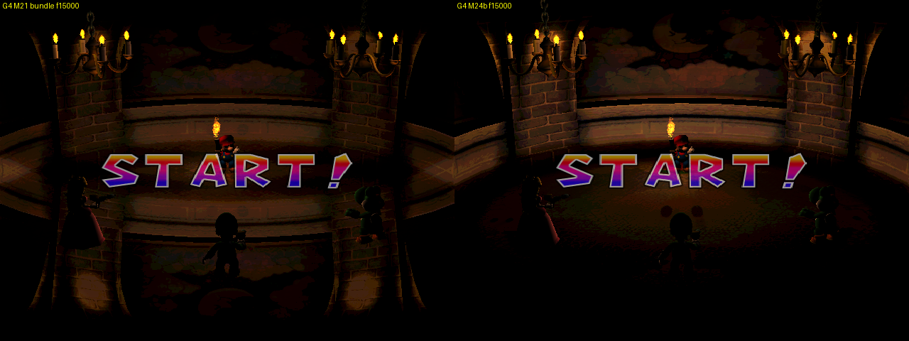

m416 had been dealt in the M20 soak (soak 9) and the M23 soak (soak 12)
with nobody looking at its picture; soak 13's was the first anyone saw.

### 39b.3 The fix

The NPOT fold grows an offset: `(s, t) → (s·su, t·sv + tv)`,
`glc_tex_matrix_fold` / `glc_get_tex_fold` (gl13.c), `tv = 0` for every
decoded texture and the tile cache. An EFB copy is bound (the `is_efb`
branch of `tex_bind_body`, gx_tex.c) with **`sv` negated and `tv = +sv`**:
`t' = sv − t·sv`, so `t = 0` lands on the region's top row and `t = 1`
on its bottom, inside the padded texture either way. The fixed-function
path carries it in the `GL_TEXTURE` matrix (`m[13]`); the vertex program
carries it in `env[44+u].w` and its fold became one `MAD` where it was a
`MUL` (`MAD result.texcoord[u].xy, t1, env[44+u], env[44+u].zwzw`;
same instruction count, every variant still under the native limits).
The projected shadow maps get the same flip after their `GX_TG_MTX3x4`
texgen, which is where GX applies it. `--noefbflip` is the pre-M24b
orientation on the same binary; `--copylog` (new) prints one line per
`GXCopyTex` — the frame, the rectangle, the format, `half`/`clear`/`front`,
the slot — so a walk names every copy consumer, and `--drawlog` prints
`tv` and marks a flipped unit (`an EFB copy, flipped: M24b`).

Same reproduction, the final build (`1ba0a29c…`), the G4:

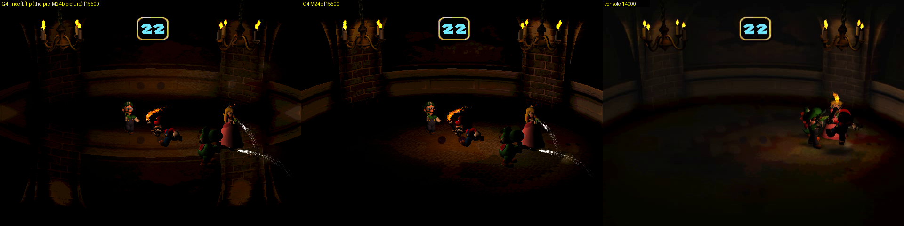

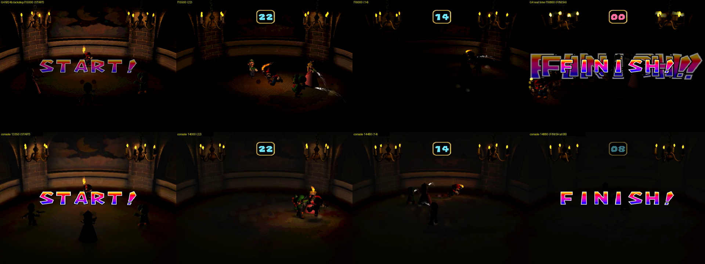

The drawlog of frame 15,500 (`docs/soak/m24b-m416-fix-lockstep-copylog-drawlog.log.gz`)
has the quad as `texmap0 640x480 fmt 6 gl 59`, `npot fold unit 0 su
0.625 sv -0.9375 tv 0.9375 (an EFB copy, flipped: M24b)`, and the room's
pieces (`bmerge*` of model 27, `Hu3DModelShadowMapSet` in map.c:66)
sampling the 192×192 shadow map on unit 1 through `texgen1 func 0 … mtx
57` with `su 0.75 sv -0.75 tv 0.75`. `--copylog` on that run: 2,423
whole-screen RGBA8 copies from frame 14,472 to the module's last, and
2,494 half-scale shadow copies.

### 39b.4 Every other copy consumer, checked

`--copylog` over the 9,000-frame turbo walk (`docs/soak/m24b-walk-turbo-copylog-md5.log.gz`)
finds exactly **two** rectangles: the 384×384→192×192 half-scale
clear-after shadow copy, every frame from 880 to 5,100 (the title's,
the mode select's and the character select's shadow passes), and **one**
whole-screen `GX_TF_RGB565` copy at frame 8,717 — the board's turn-start
crossfade (`board/main.c:484`, `WipeCreate(WIPE_MODE_IN, WIPE_TYPE_CROSS,
30)`). Nothing else copies on the walk.

* **The md5 references hold**: 800 `1df90661…`, 3000 `8762d432…`, 7000
  `f5b52130…` (§39's, byte-identical; `~/m24b/md5s.txt` on the G4). 800
  is before the first copy; the character select's shadow copies exist
  but nothing at 3,000 samples them; the board takes none.
* **The wipe's crossfade** (`--ffto 8700 --lockstep --dumpframe
  8716,8718,8722,8730,8740`, `docs/soak/m24b-board-crossfade-f8717.log.gz`):
  with `--noefbflip` frames 8,718–8,730 are the board **upside down**
  (the HUD's `COM` reads `COW`, Mario stands on his head) fading into
  the new camera; with the fix the still is upright and fades into the
  new view. Every turn of every board since M3 opened this way for 30
  frames.

  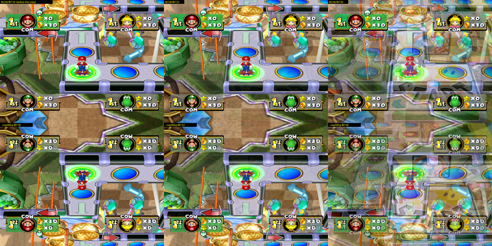

* **The mode-select bubbles** (§32.1): the mode select takes **no copies
  of its own** — `modeseldll` has no `GXCopyTex`, and the walk's copylog
  shows only the shadow pass between frames 1,200 and 2,600. §32.1's
  "region copies behind each bubble" were the 384×384 shadow copies
  (M17 classified anything under 640×400 as a region copy); the bubbles'
  squares are the `GXSetTevIndWarp` drop, as §32.1 also says, and
  frame 2,100 is unchanged by the flip.
* **The shadow maps** (hsfman.c:2007, m428, m439): the pass is copied
  every frame in every scene that enables it, but the receivers are few
  and every shadow camera is centred on its casters — m416's map at
  15,500 is four blobs within 30 texels of the centre of 384
  (`--dumpcopy`, the MacBook) — so the mirror moved little. m428
  (Avalanche!) and m439 at frames 14,700/15,000/15,500 are
  **byte-identical** with and without the flip (their maps are not
  sampled on those frames), as are m416's own intro frames 14,500 and
  14,750 (the afterimage at alpha 255, the map not yet sampled).
* **Stamp Out!'s paper** (§38.2): white with the line art at 15,000 and
  15,800, the toys textured, the read-back's 120 reads unchanged
  (`copy-read: 120 … 127 read at the copy through the back buffer (326
  ms), 1 drawn and read on demand`); frame 15,000 byte-identical with
  `--noefbflip` — the paper and the floor's baked shadows never went
  through the GPU sample.

  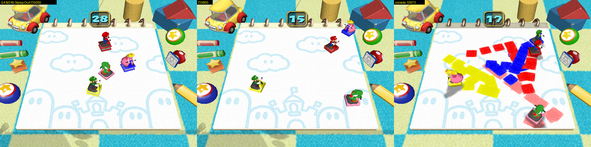

* **m428 / m439's clear-after copies** stay on M21's rule (kept from the
  last drawn frame on a consumed frame): the real-time run's report
  counts `5613 clear-after copies kept`, `2298 whole-screen` from the
  front buffer (m416's afterimage on consumed frames), `0 region`.
* Not exercised, same fix by construction (they bind the copy with the
  game's coordinates, no CPU read): the other afterimage helpers
  (`m405`, `m434`, `m442`, `m455`, `m456`, `m460`), the water
  reflections (`m417`, `m430`), `m419`'s pair of buffers, `m410`/`m421`'s
  player copies, `m440`, `m448`, `m411` and the board's Boo
  (`board/boo.c:683`, a 160×160 render copied to an 80×80 RGB5A3 sprite
  bitmap). Any of them drawn wrong now would be a second fault, not this
  one.

### 39b.5 The witness

The console: `port/ref/frames/m416-console-{12700,14200,14880,14920,15400,15800}.png`
from the m416-end.txt schedule (`mg_next` 15, groups 0,1,1,1) captured on
littlejelly — the card, the timer at 18, `FINISH!` at 08, the banner's
own trail, `WON!`, the results with the portraits; what they settle is in
`port/ref/notes.md`.

**Real time from boot on the G4**, the final build: `--minigame m416
--turns 1 --com4 --rtc dolphin --freshcard --play board-start-com4.play
--realtime --frames 18600 --status --copylog --dumpframe
15740,16800,16830,16860,16900,17300,17700`
(`docs/soak/m24b-m416-realtime-from-boot.log.gz`): game 310.31 s against
wall 310.32 s, **100.0% speed, 20.5 presented fps, 0 resyncs**, 81
underruns / 1.2 s on the whole run (the scene loads), the mixer's worker
on (`cpu 2`). The room upright at 18 (the moment of the photograph), the
banner sliding in at 00, its trail as it leaves, `MARIO WON!`, and the
`g4 shot`s of the screen at 11 and of the two results screens after it:

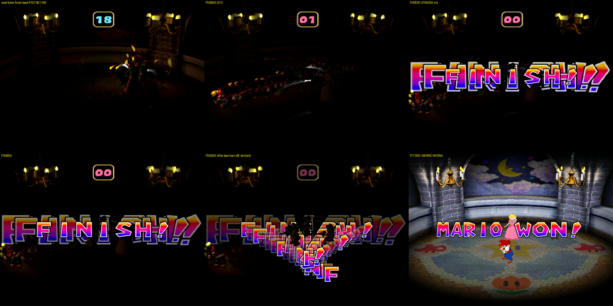

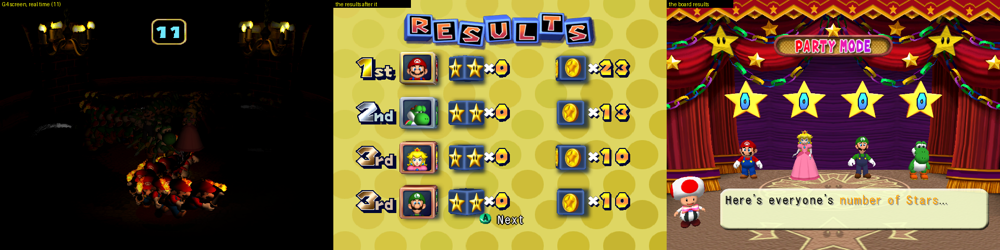

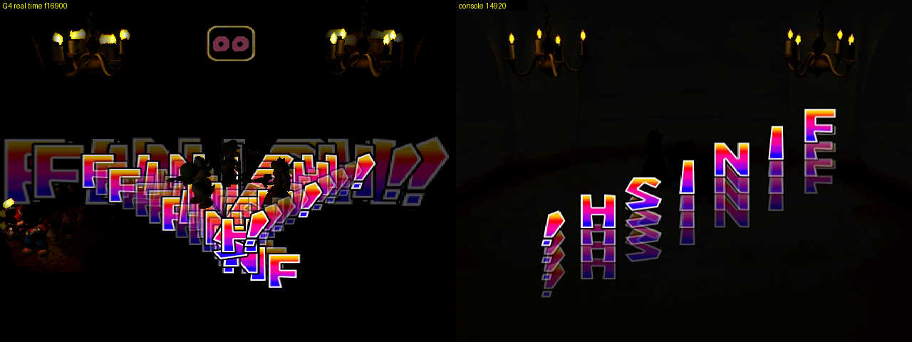

**One thing the picture at real time still is not**: the afterimage
decays once per *drawn* frame. On a consumed frame the copy reads the
front buffer (§32.1) — the last composite presented — so the ghost is
re-blended only when a frame is drawn, one in three at 20 fps, and the
trails are about three times longer than the console's (compare
`m24b-m416-finish-trail-port-vs-console.png`, where the console's banner
at 14,880 has settled and the port's at 16,860 still carries its
slide-in). The lockstep picture is exact. A per-consumed-frame decay
would mean drawing the quad on frames nothing else is drawn on; not
done, named here.

### 39b.6 What M24b shipped, and what it did not

| shipped, with a witness | |
|---|---|
| the EFB copy's `t` flipped at bind, fixed-function and vertex program (§39b.3), `--noefbflip` | m416 upright at 15,000/15,500/16,000/16,500 lockstep and from boot at real time; the crossfade upright; the three md5s unchanged |
| `--copylog`, the drawlog's `tv` and flipped-unit mark | the walk's two rectangles; the consumer table in §39b.4 |
| the verdict on M23 (§39b.2) | the M21 bundle's mirror at 15,000 and 15,500 |
| m416's console frames and `port/ref/notes.md` | the six frames |
| the M24 leave-behind soak's first 30 minutes (`docs/soak/m24b-soak14-m24-leave-30min.log.gz`) | 106,620 frames, 100.1% speed, 21.0 presented fps, **0 resyncs** (M23's two board-load resyncs did not recur), the same twelve minigames dealt in the same order as soak 13 (m416 at 95,487 again), `aud` 0.10–0.25 ms on `cpu 2`; stopped for the witness at turn 9 |

**Not done, and why:**

* The afterimage's decay per drawn frame at real time (§39b.5).
* The brightness during the play: the console's frame at 22 is mean
  luma 13 on the letterbox, the port's 19 (the MacBook) — the same
  picture, the port lighter in the candle's fall-off; not chased.
* The other copy consumers in §39b.4's last bullet: not exercised.
* The M24 leftovers stand (§39.7): the results-screen stall, the two
  mixer timers, the selected box's specular, the fresh-process DRAW in
  Avalanche!.

Left running: `g4 run --soak --com4 --rtc dolphin --freshcard --realtime
--snap-every 5000 --snap-keep 3 --status --ovllog --stuckwatch 200` on
the final build (`isle` md5 `1ba0a29c…`; the M24 bundle is kept as
`~/MarioParty4-m24.app`, the M23 one as `~/MarioParty4-m23.app` for the
`m416-corrupt-f095000.snap` ring). M25 reads it as §39.8 says, plus:
the next m416 (or any afterimage minigame) it deals is worth a `g4 shot`.
## 40. M25 log — the machine the port has never seen *(2026-09-20, littlejelly)*

M25's brief was the machine check: the port has run on exactly one PowerPC
Mac — a dual 1 GHz Power Mac G4 (PowerMac3,5) with a 64 MB Radeon 9000
under 10.5.4 — and the user is going to hand it to people with other G4s.
Every extension the renderer leans on was read off that card's list
(`docs/g4-glinfo.log`) and never asked for again. `port_machine_check()`
now asks the machine it is on the same questions before the window opens,
prints an inventory and a verdict with a line per reason, applies the
settings the verdict implies and says why, and refuses (without `--force`)
on a machine that cannot draw the game (§40.2). The verdict was witnessed on
the G4 (`ok`), on the MacBook under Rosetta (`unsupported`, said plainly),
and on three simulated machines through `--fake-machine` (§40.3);
`docs/requirements.md` is the plain-words version for the launcher and the
README (§40.4). Then the one leftover of §36–§39 that was still open, the
fresh-process DRAW in Avalanche! (§40.5), and the packaging groundwork:
the config file, the Application Support paths, a letterboxed
`--fullscreen`, the dialogs and the plist (§40.6).

### 40.1 The soak, read

The soak §39.8 named — "the first with the workers on" — ran 30 minutes
before M24b stopped it for its witness, and M24b read it (§39b.6:
106,620 frames, 100.1%, 21.0 fps, 0 resyncs, `docs/soak/m24b-soak14-m24-leave-30min.log.gz`).
What was running when M25 began was M24b's leave-behind, six minutes old:
`g4 run --soak --com4 --rtc dolphin --freshcard --realtime --snap-every 5000
--snap-keep 3 --status --ovllog --stuckwatch 200` on the M24b build
(`1ba0a29c…`), the mixer's worker on and the EFB copies upright — the first
soak with both. It was left to run while the machine check was written, and ended
through Escape (a soft reset → the shutdown reports, which a `g4 stop`
never writes) at 01:30 G4 time — **70 minutes, 252,660 frames, 4,227
status lines** (`docs/soak/m25-soak15-m24b-leave.log.gz`):

| | |
|---|---|
| mean speed | **100.1%**; board turns 1–20 at 100–101%, every one |
| presented fps | 20.8 overall; board 20.7 (turns 18.6–22.6); minigames 12.2 (`m414`) to 29.6 (`m405`) |
| where it got | **board 1, all 20 turns** → results (`mstory3dll` at 252,000), where it was ended |
| minigames dealt | 28 plays of 25 modules, **M23's and M24's list in their order** (m412 m428 m420 m444 m423 m438 m429 m444 m430 m406 m416 m405 m438 m431 m422 m410 m407 m421 m424 m436 m404 m427 m455 m401 m414 m418 m404 m402): the deterministic replay holds across M24's mixer split and M24b's copy flip; m415 not dealt |
| resyncs / stalls / STUCK / faults / the MEM1-top fault (§36.5) | **0 / 0 / 0 / 0 / did not recur** — the first soak with no resync at all (M24's had two, in `m401` and `m414`, which now read 100% at 14.7 and 12.2 fps) |
| the results screen's save (§38.3) | no stall; `CARD: image flush took` never printed; `DVD: 1547 reads, 0 over 100 ms` |
| audio | `aud` 0.28 ms mean, 0.60 worst, on `cpu 2` every line; 81 underruns / 1.26 s over 70 minutes; **`resampler linear, depop on`** |
| `worker mixer` | 254,440 jobs: 254,435 finished by the worker, 5 late (9 ms inline), 210 waited for (94 ms, worst 5.3 ms); **362.5 s of work on the second core** = 8.6% of it |
| `REL .data:` | 81 re-opens, 58 reset |
| `skin: lifetime` | 691 dropped, **0 guard hits** |
| `tex` / `rss` | 801 entries / 40.1 MB held at the end (5,819 evictions to stay under 40 MB); rss 111–126 MB on the board, peak 169 MB |
| `copy-read:` | none (m415 not dealt); `EFB copies: 89,036` (17,314 whole-screen and 4,400 region copies from the front buffer on consumed frames, 96,331 clear-after copies kept, 53,323 half-scale) |

**One line in the report is a finding**, and the brief ranks it above
everything else in M25: `musyx_mix: split frames: 849082 control halves
on the game thread, 849082 value halves, 254573 joins, 14 position
mismatches <-- NOT EXACT`. M24's identity proofs had **0** mismatches in
16,011 joins on the walk and 0 in 4,000 on the trace run (§39.4); over
70 minutes there are 14, in two clusters, each printed by the join:

```
f203760 m427dll  SPLIT MISMATCH voice 23: control live 0 cur 0 fo 0 phase 0 ended 0 slc 0 pitch 0 | value live 1 cur 302d fo 13 phase 7e00 ended 0 slc 9 pitch 11f50   (twice, two joins)
f217500 m401dll  SPLIT MISMATCH voice 48: control live 0 ...                     | value live 1 cur 31a2 fo 8 phase 7000 slc 0 pitch bfc0   (twice)
                 SPLIT MISMATCH voice 48: control live 0 ...                     | value live 1 cur 28b3 fo 0 phase 0 slc 1 pitch 10000    (twice: the slot restarted)
                 SPLIT MISMATCH voice 35 / voice 37: the same shape
```

The shape is the same every time: the **control half's `MixVoice` is all
zeros** — not `live 0` with a position, as `finish_voice` leaves a voice
that ended, but the bytes `start_voice_init`'s `memset` writes before it
fills the entry (a filled entry has a non-zero pitch) — while the **value
half's copy is a live voice mid-buffer** (`slc 9`: a stream voice nine
loops in). Both clusters sit inside a burst of the game's own
`SE Entry Error<SE 1621:ErrorNo -33>` lines, the sound layer refusing
entries. The join's policy on a mismatch is to take the worker's table
whole (§39.2), which here puts a voice the control half had zeroed back
into `voices` as live; nothing mixes it (the next tick's control half
skips a slot whose `DSPvoice` is not in state 2) and the next start on the
slot re-initialises it, so the audible consequence, if any, is bounded to
that slot's next frame — but "if any" is not a proof, and M24's proof
was for a walk that never saw this state. What M25 did about it:

* the mismatch line now prints the `DSPvoice`'s state, sample and
  compType, both halves' `readKind`, **what the control half last decided
  for that slot** (skip / run / start / refused / skipped-dead) with the
  DSP frame it decided it at, and the join and mid-tick-flush counts
  (`musyx_mix.c`, `diag_last_*`), and prints 24 of them instead of 8;
* the reproduction is the soak itself, which is deterministic: a
  headless `--soak --com4 --rtc dolphin --freshcard --headless --nodraw
  --turbo --force --noconfig --frames 219000 --status` on the MacBook
  runs the same game to the same frames at ~100 fps (35 minutes to the
  first cluster), and **reproduced it** — 9 mismatches by frame 219,000,
  the first pair at DSP frame 679,933 on the same stream voice (`cur 302d
  fo 13 slc 9 pitch 11f50`; slot 31 there, 23 on the G4: the slot number
  is MusyX's allocation, the voice is the same), and the new fields on the
  line say what happened (`docs/soak/m25-mbp-repro-mismatch-before-fix.log.gz`):

  ```
  SPLIT MISMATCH voice 31: control live 0 ... | value live 1 cur 302d fo 13 phase 7e00 slc 9 pitch 11f50
    | dsp state 0 smp 1140 comp 0 readKind 0/1
    | ctl last: action 3 (refused) state 2 refused 1 at frame 679933; now frame 679936 joins 203860 flushes 103
  ```

**The cause.** MusyX stopped the stream voice on that slot and reused the
slot for a new note (`dsp state` was 2 when the control half saw it, with
the new sample 1140 in `smp_info`); the control half's `start_voice_init`
**refused** the start — one of the paths that `salDeactivateVoice` and
return 0 without being counted: a one-shot whose `curSample >= length`, an
`adsrSetup` that reports VoiceDone at once, a sample address in neither
ARAM nor MEM1 (the extraData refusal is counted and was 0) — and, as M24
wrote it, zeroed its `MixVoice` and put **`SKIP`** in the plan. `SKIP`
tells the value half there is nothing to do, so the worker's copy kept
the slot's *previous* entry, the stream voice, live; at the join the two
tables disagreed, and the join's policy (take the worker's) put the stale
entry into `voices`. In the fused path the memset was the whole story;
the split path needed the plan to carry it. **The fix** (`musyx_mix.h`,
`musyx_mix.c`): a fourth plan action, `MIX_PLAN_CLEAR` — a refused start
zeroes the entry on both halves — and the refusals are counted in the
report (`N start(s) refused by start_voice_init …`). Nothing audible
changes: the stale entry was never mixed (a slot whose `DSPvoice` is not
in state 2 is skipped by both halves), so the `.wav` is the same bytes
and the three frame md5s are untouched (the mixer does not draw).

**The proof**, the fixed build on the MacBook over the same 219,000
frames (`docs/soak/m25-mbp-repro-mismatch-fixed.log.gz` against
`…-before-fix.log.gz`, the same 730,717 mixed frames and 219,083 joins):

| | before | **after** |
|---|---:|---:|
| position mismatches at the joins | 9 (`<-- NOT EXACT`) | **0** |
| starts refused by `start_voice_init` | not counted | 14,566 (of 207,854 starts: refusals are common, and the mismatch needed one on a slot whose worker copy still held a live voice) |

The G4's leave-behind soak runs this build; its `split frames` line at
57 minutes is the same proof on the machine that found it.

The rest of the soak is the cleanest yet, and the M24b build is kept as
`~/MarioParty4-m24b.app`.

### 40.2 The machine check

`src/platform/machine.c`, run from `main()` right after the banner and
before anything opens a window. Three parts, as the brief asked.

**(a) The inventory.** `hw.model`, `hw.ncpu`, `hw.cpufrequency` (rounded:
the G4 reports 999,999,997 Hz), `hw.cputype`/`hw.cpusubtype` (18/11 = a
7450), `hw.optional.altivec`, `hw.memsize`, the OS through `Gestalt`
(`gestaltSystemVersionMajor/Minor/BugFix`), and the GL side through a
**CGL context with no window** — the same pixel-format asks as the SDL
window (accelerated, double-buffered, 24/8/24), so the renderer answering
is the one the window will get; the M2 finding that CGL works from an SSH
session on Leopard is what lets `--machinecheck` run headless. VRAM is
`kCGLRPVideoMemory` of the renderer whose id matches
`kCGLCPCurrentRendererID` on its low sixteen bits (§40.3 says why). Then the
extension table, **derived from the code**: every `strstr(ext, …)` and every
`GL_*_EXT/ARB/ATI/APPLE` token in `gl13.c` and `gx_*.c`, with what each one
gates:

| extension | the port uses it for | without it |
|---|---|---|
| `GL_ARB_multitexture` | a unit per TEV stage (`glActiveTexture`) | **required** |
| `GL_ARB_texture_env_combine` | every stage's combiner (`GL_COMBINE_RGB/ALPHA`) | **required** |
| `GL_ARB_texture_env_crossbar` | a unit reading another unit's texture: `regfix`/`regfix2`/`regfix3` (`gl13_have_crossbar` gates the board eyes and walkway §31.3, the portraits §37.3) | **required** — every `GX_TEVREG` write folded to PREV |
| `GL_ATI_texture_env_combine3` | `MODULATE_ADD_ATI` = A·C + B (`gl13_have_combine3`: the four-input stage, the textured highlight §37.3) | **required** — four-input stages drawn as their d term, the title's characters washed |
| `GL_EXT_secondary_color` | `GL_COLOR_SUM` (0x8458), the specular fold §36.2 — used unconditionally | **required** — every shiny material white |
| 4+ texture units | a stage is a unit; the game's chains run to five (`GX_TEVSTAGE4`), and `gx_tev.c:960` drops the stages past the card's units | **required** under 4 |
| `GL_ARB_vertex_program` | phase 2 on the vertex unit (`vpl.have`) | degraded: `--cpuxf` applied |
| `GL_APPLE_vertex_array_range` + `GL_APPLE_fence` | the 8 MB ring as DMA storage (`var_on`) | degraded: client arrays (the `--novar` path) |
| `GL_EXT_multi_draw_arrays` | one call per batch of strips (`var_multidraw`) | degraded: one `glDrawArrays` per strip |
| `GL_EXT_blend_subtract` | `GX_BM_SUBTRACT` (`gl13_have_blend_subtract`) | degraded: plain blends, a `gx_warn` each |
| `GL_EXT_gpu_program_parameters`, `GL_EXT_fog_coord` | `--envbulk`, `--palette` — both measured and off | optional |
| `GL_EXT_texture_compression_s3tc`, `GL_ARB_depth_texture` | `gl13_have_s3tc`/`_depth_texture` are set at boot and read by nothing (CMPR is decoded on the CPU) | optional |
| `GL_ATI_text_fragment_shader` | on the G4's list, not built (§36.3) | not used |

**(b) The verdict.** `ok` / `degraded` / `unsupported`, a line per reason,
on the log, on stderr, as the SDL window's title until the first drawn
frame reaches the screen (`gl13_present` restores the plain name after its
first swap), and as `machine ok` on every status line. Required is what the
game cannot be drawn correctly without: the four extensions above and four
units. Degraded is what has a fallback: no vertex program, no vertex array
range, one CPU, VRAM under 64 MB, a clock under 800 MHz ("will run below
full speed", with the expected percentage), RAM under 256 MB (the process
peaks at ~170 MB resident, §39.1). Unsupported is a required extension
missing, an OS before 10.4 (the binary's `-mmacosx-version-min`), or **not
PowerPC**: `sysctl.proc_native` is Apple's documented Rosetta test (a
translated process reads 0; a PowerPC kernel has no such key, which is
taken as native — Leopard on the G4 answers "top level name sysctl … is
invalid"). `--machinecheck` prints all of it and exits 0/1/2; `unsupported`
refuses without `--force`, with the reasons on stderr and in a dialog.

**(c) The settings.** One CPU → `--threads 0`; VRAM under 64 MB →
`--texbudget` three quarters of the card rounded down to 4 MB (32 → 24,
16 → 12; the framebuffer is under 4 MB and the ring lives in AGP memory);
no vertex program → `--cpuxf`. Each is skipped when the flag was given
(`port_opt.texbudget_set`, `threads != -1`, `cpuxf`), and printed either
way: `machine: applying --texbudget 24 (VRAM 32 MB)` or `machine:
--texbudget given; not applying …`.

### 40.3 The five machines

**The G4** (`isle --machinecheck --noconfig` over ssh, the soak stopped;
`docs/soak/m25-machinecheck-g4.log`), exit 0:

```
port> machine: model PowerMac3,5, 2 CPUs at 1000 MHz, 7450 (G4), AltiVec yes, 1536 MB RAM, Mac OS X 10.5.4
port> machine: renderer 0: id 0x00021602 accelerated 1 video 64 MB texture 56 MB (this context)
port> machine: renderer 1: id 0x00020400 accelerated 0 video 0 MB texture 0 MB
port> machine: GL ATI Technologies Inc. / ATI Radeon 9000 OpenGL Engine / 1.3 ATI-1.5.28, VRAM 64 MB, 6 texture units, max texture 2048
port> machine:   GL_ARB_multitexture … GL_EXT_secondary_color   present  required   (all five)
port> machine:   GL_ARB_vertex_program … GL_EXT_blend_subtract  present  degraded without   (all five)
port> machine:   GL_ARB_depth_texture                 MISSING  optional
port> machine:   GL_ATI_text_fragment_shader          present  not used
port> machine: verdict ok
port> machine:   - every probe within the G4's envelope
```

Two things the G4 taught the probe on the way: `hw.cpufrequency` reads
999,999,997 Hz (rounded now), and Leopard's Radeon driver answers
`kCGLCPCurrentRendererID` as `0x00001602` where the renderer table lists
`0x00021602` — the first run read VRAM −1 until the match was made on
the low sixteen bits (the table is printed under `--machinecheck`).
The window title with the verdict (photographed under `--nodraw`, which
never draws the frame that would restore the plain title):

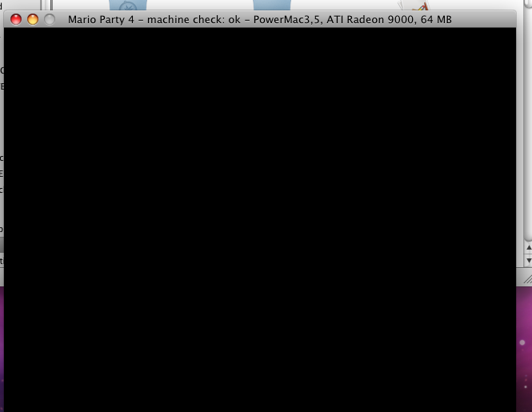

and `machine ok` on every status line of every run since.

**The MacBook under Rosetta** (`ssh mbp`, the same binary; the
inventory is what Rosetta lets a translated process see: `hw.model
PowerMac`, a 7400 at 2300 MHz, four of them — and `sysctl.proc_native 0`):

```
port> machine: model PowerMac, 4 CPUs at 2300 MHz, 7400 (G4), AltiVec yes, 4096 MB RAM, Mac OS X 10.6.6 (under Rosetta)
port> machine: GL Intel Inc. / Intel HD Graphics 3000 OpenGL Engine / 2.1 APPLE-1.6.30, VRAM 416 MB, 8 texture units, max texture 8192
port> machine:   (every extension in the table present but GL_ATI_text_fragment_shader, which is not used)
port> machine: verdict unsupported
port> machine:   - not a PowerPC Mac: this is the PowerPC binary running under Rosetta (sysctl.proc_native = 0; Rosetta reports the machine as `PowerMac'), which the port does not support; --force runs it anyway, at about half the G4's speed on the game's code
machine check: unsupported: PowerMac, 4 x 2300 MHz 7400 (G4), 4096 MB RAM, Intel HD Graphics 3000 OpenGL Engine, 416 MB VRAM, 8 units, OS 10.6.6
```

(`docs/soak/m25-machinecheck-mbp-rosetta.log`, exit 2.)

So every run on the MacBook bench needs `--force` from M25 on (the
witness runbook says so, §0n). Its Intel HD 3000 driver lists every
extension the port uses including `GL_ATI_texture_env_combine3` — the
GL side of the MacBook would be `ok`; the CPU side is the refusal.

**Three simulated machines** (`docs/machines/*.txt`, each a `key=value`
file overriding the probes; the extension lists are reconstructions of
Apple's 10.4-era drivers and say so in the file):

| machine | verdict | reasons | applied |
|---|---|---|---|
| the G4 itself | **`ok`** | every probe within the envelope | nothing |
| a single 500 MHz G4 (PowerMac3,4) with a 32 MB Radeon 7500, 10.4.11 | **`unsupported`** | 3 texture units; and one CPU, 500 MHz ("expect 50% speed"), VRAM 32 MB | `--threads 0`, `--texbudget 24` (printed; moot without `--force`) |
| an 800 MHz iMac G4 17" (PowerMac4,5) with its 32 MB GeForce4 MX, 10.4.11 | **`unsupported`** | `GL_ATI_texture_env_combine3` missing; 2 texture units; one CPU; VRAM 32 MB | `--threads 0`, `--texbudget 24` |
| the G4 with a 32 MB Radeon 9000 | **`degraded`** | VRAM 32 MB (under 64) | `--texbudget 24 (VRAM 32 MB)` |
| the MacBook under Rosetta | **`unsupported`** | not a PowerPC Mac | nothing |

Two of the three simulated verdicts rest on a number the project has not
measured on real hardware: the texture-unit count of the Radeon 7500
(three, on the R100/RV200 combiner) and of the GeForce4 MX (two, on NV17),
and the GeForce list's lack of the ATI combine3 token. The files say so,
and a real `--machinecheck` on a real card is the answer; the logic those
numbers feed is what the five runs witness.

### 40.4 `docs/requirements.md`

The minimum and recommended machine in plain words, from the table above,
with the by-card table (witnessed / expected / unknown / unsupported) and
the settings the check applies. The one-sentence version: *a PowerPC G4
Mac with Mac OS X 10.4 or later, 256 MB of memory and a Radeon 9000-class
card or better (four or more texture units with ATI's combiner
extensions) is the minimum; a dual 1 GHz G4 with a 64 MB Radeon 9000 under
10.5 is the recommended machine, where the game runs at console speed.*
The README at the repo root is the user's to edit.

### 40.5 The leftovers of §36–§39

Of the four the brief listed, three had closed before M25: Stamp Out!'s
paper (§38.2, the copy's padding and the quarter), the tinted-overlay pairs
(§38.4: every one of them has `K_c = 1` and is emitted exactly since M23),
and the atlas measurement (§38.4: 24% of batches, 84 a drawn frame, a few
percent at best, not built). The fourth, **a fresh-process DRAW in
Avalanche!** (§35.2), needed a way to make four players lose together, which
four COMs never do.

**`--mghold`** (selfplay.c `park_players`): inside a minigame's own overlay
(`omMgIndexGet(omcurovl) >= 0`) all four players are human
(`GWPlayerCfg[i].iscom = 0`, `GWPlayer[i].com = 0`) with idle controllers —
the minigames read `iscom` every frame (`m406Dll/player.c:562`) and an idle
pad reads zero, so they hold still; outside the overlay (the board, instDll,
resultDll) the `--com4` rule holds as before. The pad seam allowed it
without a per-player hold: the human path with no input *is* the hold.

**The witness, in two runs on the G4** (`--minigame m406 --turns 1 --com4
--rtc dolphin --freshcard --play … --mghold --ffto 13500 --status
--dumpframe 14600-17400/50`, real time from the handover, m406dll from
frame ~14,640). The first run held all four still and got **no DRAW**:
Avalanche! is a ski run, the skiers descend on their own, and the three
idle ones behind were buried at ~15,300 while the lead skier (Mario, pad 1)
reached the course's end (`player.c:734`: `z < −60000` names a winner)
— `MARIO WON!`, +10 coins. The DRAW is `player.c:978`: all four
`unk_00_field0` (caught) before anyone finishes. So the second run
steered controller 1 into the wall through the play script
(`port/ref/movies/m406-draw-left.play`: the menu walk plus
`at 14700 1200 dstk:LEFT`), the other three idle under `--mghold`:

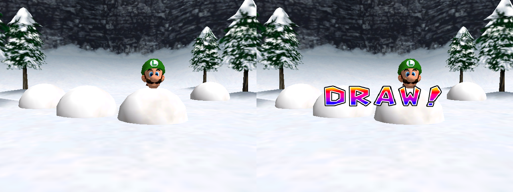

Four mounds, Luigi's head out, `DRAW!`, the results with no coins
awarded, and **no rainbow ribbon** — §35.2's reading stands to the
picture: the heads-in-mounds are the game's losing pose and the ribbon
was the stalled process's artefact. Not "to the byte" (there is no
console DRAW frame to compare against; the M20 photo is a photo), but a
fresh-process DRAW exists now and takes four minutes to reach
(`docs/soak/m25-m406-mghold-draw.log.gz`, the steer frame
`screenshots/m25-m406-mghold-steer-f15100.png`).

### 40.6 Packaging groundwork

Built, each witnessed with a screenshot on the G4; no launcher UI.

* **`Info.plist`** (`tools/make_bundle.sh`): `CFBundleIdentifier
  com.southcitycapture.marioparty4` (as before), `CFBundleShortVersionString
  0.25` / `CFBundleVersion 25` = the milestone (`MILESTONE=M25`),
  `LSMinimumSystemVersion 10.4.0`, `LSRequiresNativeExecution` (Finder
  will not offer Rosetta).
* **The config file**, format written down first (`config.c`'s header):
  `~/Library/Application Support/MarioParty4/config`, `key = value` lines,
  `#` comments; keys `image` (the disc image `--image` gave or the dialog
  chose; read when neither `--image`, `$MARIOPARTY4_IMAGE` nor the bundle's
  Resources names one, before `~/MarioParty4`), `fullscreen` (0/1, from
  `--fullscreen`/`--windowed`), `machine` (the check's summary the last
  time the first-run message was shown). `--noconfig` neither reads nor
  writes it (the lab's runs).
* **The paths**: the card image was already in Application Support
  (`card_file.c`); the log now defaults to `MarioParty4.log` there when no
  `--log` is given (stdout still carries it for the runner).
* **The disc image chooser**: Navigation Services
  (`NavCreateChooseFileDialog`, files or a `files/` folder), shown when the
  search finds nothing and the run is not headless/`--machinecheck`; the
  answer is remembered.
* **`--fullscreen`**, letterboxed: the renderer draws exactly as in the
  window — 640×480 at 1:1 in the bottom-left of the back buffer, every
  viewport, scissor, EFB copy and read-back in EFB coordinates — and
  fullscreen is a *present* step (`gl13.c` `fs_blit_out`/`fs_blit_back`):
  the corner is copied into a 1024×512 texture, the screen cleared black,
  the texture drawn bilinear onto the largest 4:3 rectangle that fits,
  swapped, and then drawn back nearest-filtered at 1:1 into the corner so
  the back buffer's corner holds the last drawn frame — where a consumed
  frame's `GXCopyTex` now reads (`gx_tex.c` reads `GL_BACK` under
  fullscreen instead of the front buffer, which holds the scaled picture).
  `--dumpframe` reads the corner before the blit. Remembered in the config.
  Witness on the G4 (1680×1050): `--fullscreen: 1680x1050, the picture
  at 1400x1050 from (140,0), scale 2.188`, and the next run *without the
  flag* came up fullscreen from the config; a `--windowed` run cleared it.

  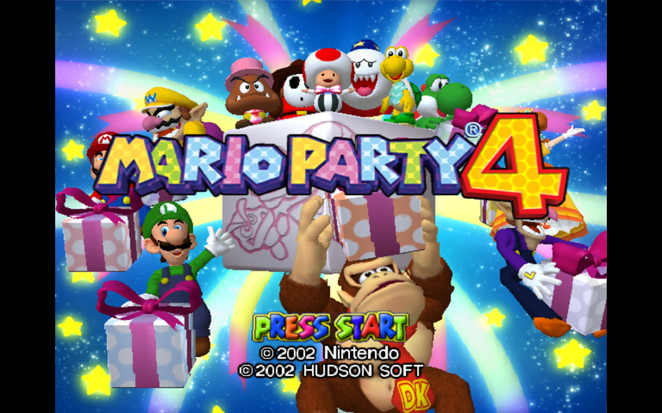

  Frame 800 dumped under `--fullscreen --lockstep` is `9d0a87b5…` against
  the windowed `1df90661…` (reproduced exactly in the same session):
  **2 pixels of 307,200 differ, by one level** — the fullscreen context's
  rasterisation, not the blit (on the MacBook's Intel driver it is 31
  pixels, ≤3 levels, unchanged when the blit-back's filter was made
  nearest). Fullscreen is not a measurement mode; the md5s are windowed.
* **The dialogs** (`CFUserNotificationDisplayAlert`, one OK button): the
  `unsupported` refusal, with the reasons and the requirements paragraph;
  and the **first-run message** on a `degraded` verdict — the reasons and
  the requirements paragraph, shown once per distinct machine summary (the
  `machine` key), so a new card or OS shows it again and every boot does
  not. Both photographed on the G4 through
  `--fake-machine`:

  
  
  

  The chooser is groundwork: it appears and it is the right dialog, and
  System Events could not press its Cancel from an ssh session (the
  CFUserNotification ones answer a Return), so choosing a file through
  it has not been witnessed end to end.

### 40.7 Three things found on the way

* **A proof on a walk is a proof of the walk** (§40.1): M24's identity
  proofs (0 mismatches in 16,011 joins) never saw a refused start on a
  reused slot; 70 minutes of soak saw fourteen. The plan's action set
  had three words for four cases, and the fourth was silent in the fused
  path because the memset *was* the case. Every future soak reads the
  `split frames` line (Escape, not `g4 stop`, gets it written).
* **A CGL renderer id does not match its table entry on Leopard**
  (§40.3): `0x00001602` against `0x00021602`; match on the low sixteen
  bits. And `sysctl.proc_native` does not exist on a PowerPC kernel —
  absent means native, 0 means Rosetta.
* **Escape ends a run with its reports** (witness §0n): a `g4 stop` is
  a `killall` and writes none, which is why no soak before this one had
  its `worker mixer` line or its mismatch count.

### 40.8 What M25 shipped, and what it did not

| shipped, with a witness | |
|---|---|
| the soak read (§40.1) and its finding: the split's fourteen mismatches root-caused on the MacBook's reproduction and fixed (`MIX_PLAN_CLEAR`) | the instrumented line; 9 → **0** mismatches over the same 219,000 frames on the MacBook, 14,566 refusals counted |
| the machine check (§40.2): inventory, verdict, applied settings; `--machinecheck`, `--force`, `--fake-machine`; the verdict in the window title and on the status line | the G4 `ok`, the MacBook `unsupported` under Rosetta, the three simulated machines (§40.3) |
| `docs/requirements.md`, `docs/machines/` (§40.4) | |
| `--mghold` and the fresh-process DRAW (§40.5) | four mounds, `DRAW!`, no ribbon, from boot in four minutes |
| the packaging groundwork (§40.6): plist, config, paths, chooser, `--fullscreen`, the dialogs | the screenshots |
| the soak's read (§40.1), `docs/soak/m25-*`, `docs/screenshots/m25-*` | |

**Not done, and why:**

* **The mixer fix on the G4 itself** (§40.1): proven on the MacBook's
  reproduction; the G4's own `split frames` line is in the leave-behind
  soak, 57 minutes in.
* **The results-screen stall in a soak, at last** (§38.3, §39.4): the
  leave-behind soak's first minutes had `realtime: resync at retrace
  14203, 1695 ms behind` at the first minigame's results — the walks'
  frame-14,198 stall, in a soak for the first time (M24 saw it in 10 of
  17 walks and no soak); no `stall:` line, because the soak runs
  `--status` without `--perf`. Still open; the next soak wants `--perf`
  on so the line's `frees` and `dll` fields get written.
* **The disc image chooser end to end** (§40.6): shown, not driven.
* **The by-card table is argued, not measured** (§40.3, §40.4): the
  Radeon 7500's three units, the GeForce4 MX's two and the NVIDIA lists'
  lack of `ATI_texture_env_combine3` are the extension tables' word;
  `--machinecheck` on a real card is the witness the project does not
  own a machine for.
* **No launcher UI** (the brief's scope); the first-run message and the
  chooser are the pieces it will call.
* The M24 leftovers stand: the results-screen stall (absent again in
  this soak), the two mixer timers, the selected box's specular.

### 40.9 What M26 starts with

Left running: `g4 run --soak --com4 --rtc dolphin --freshcard --realtime
--snap-every 5000 --snap-keep 3 --status --ovllog --stuckwatch 200` on
the final build (`isle` md5 `bf4066de…`, from 02:09 G4 time) — the
machine check at its boot (`verdict ok`, `machine ok` on every status
line), the `MIX_PLAN_CLEAR` fix and the instrumented mismatch line in.
Read it first: `g4 key esc` ends it with its reports (§0n); the `split
frames` line should say **0 position mismatches** past frame 217,500 (the
second cluster) with a non-zero `start(s) refused` count, as the
MacBook's run does (§40.1); the instrumented lines say how if not.
Then `worker mixer`, `tex`/`rss` past turn 12, the minigame order
(deterministic since M23), and whether m415 is ever dealt. Then the
packaging's next pieces: the launcher that uses the first-run message
and the chooser (the chooser driven end to end first), the README's
requirements (`docs/requirements.md` is written for it), and the
M24 leftovers.
## 41. M26 log — the gallery, and the texgen that read the wrong row *(2026-09-20, littlejelly)*

M26's brief was the first graphics audit: every minigame the roulette can
deal, teleported into from boot and photographed, a contact sheet the user
can read on a phone, a first pass of verdicts grouped by cause, and the one
shared cause with the most games behind it fixed. The soak came first
(§41.1). The gallery ran as a G4-side chain of 63 runs (§41.2) and, while
it ran, the cause the brief suspected — the shadow maps — was read in the
code and turned out to be larger and older than the copy path: since M3
the port has fed every `GX_TG_POS` and `GX_TG_NRM` texgen the **view-space**
position and normal, where the hardware reads the **raw input row** and the
game's matrices are built for it (§41.4). Every projected shadow map and
every reflection map in the game was sampled from the wrong space. The
fix is a few lines in the two vertex paths behind two flags, and it
uncovered a third fault on the way — the decoder had every S8 normal 64×
too long since M3, hidden by the lighting's normalisation (§41.4) — and
was witnessed on the G4 by running the whole chain again on the fixed
build and diffing the frames (§41.5).

### 41.1 The soak, read

§40.9's leave-behind — `g4 run --soak --com4 --rtc dolphin --freshcard
--realtime --snap-every 5000 --snap-keep 3 --status --ovllog --stuckwatch
200` on the M25 build (`bf4066de…`), from 02:09 G4 time — was ended through
Escape at 03:11, past the frame the brief named (217,500, the second
cluster of §40.1's mismatches): **62 minutes, 224,277 frames**
(`docs/soak/m26-soak16-m25-leave.log.gz`).

| | |
|---|---|
| speed / presented fps | **100.1%** mean over 3,737 status lines; 20.8 fps; `machine ok` on every line |
| where it got | board 1, turn 18 of 20 (ended for the gallery) |
| minigames dealt | 24, **the same modules in the same order** as soaks 13–15 (m412 m428 m420 m444 m423 m438 m429 m444 m430 m406 m416 m405 m438 m431 m422 m410 m407 m421 m424 m436 m404 m427 m455 m401); m415 not dealt |
| `split frames` | 748,328 halves each side, 224,361 joins, **0 position mismatches**; `15035 start(s) refused by start_voice_init` — the `MIX_PLAN_CLEAR` proof on the machine that found the fourteen (§40.1: the MacBook's 9 → 0 was the proof by reproduction; this is the proof in place) |
| resyncs / faults / STUCK / guard hits | **1 / 0 / 0 / 0** — the one resync is `retrace 14203, 1695 ms behind`, the results-screen stall of §38.3/§40.8 at the first minigame's results, in a soak for the second time; still without `--perf` on, so no `stall:` line |
| `worker mixer` | 224,246 jobs, 6 late (13 ms), 208 waited for (92 ms, worst 2.2 ms); 320.6 s of work on the second core |
| audio | `aud` 0.28 ms; 165 underruns / 2.5 s over the hour; `resampler linear, depop on` |
| `REL .data` / `skin: lifetime` / `copy-read` | 68 re-opens, 49 reset / 578 dropped, 0 guard hits / none (m415 not dealt) |
| `EFB copies` | 82,963 (17,344 whole-screen + 4,398 region from the front buffer on consumed frames; 47,260 half-scale) |

Nothing in it outranks the gallery. The results-screen stall is now two
soaks and seventeen walks old and still has no `--perf` line; the next
soak carries `--perf` (§41.8).

### 41.2 The gallery run

**Two harness levers, so the chain never has to know a frame number.**
A `--minigame` run enters its module at a frame that depends on the game's
type (types 3, 5, 6 and 8 skip the instruction card, `instDll/main.c:107`)
and on the card's own length, so a chain of 63 runs cannot name absolute
`--dumpframe`s in advance. `selfplay.c` grew `--mgdump 60,400,1200,2300`
— on the first frame `omcurovl` names an m4xx module, the offsets are
added to the entry frame and appended to the `--dumpframe` set, and when
the module is left before the last one, the frame 40 after the exit (the
results screen) is added too — and `--mgend 2600`, which sets `--frames`
to entry+2600 at the same moment. Both log the entry and the exit:

```
port> mgdump: entered minigame m401dll (mg 401) at frame 14478; dumping 14200,14300,14400,14538,14878,15678,16778; the run ends at 17078
port> mgdump: left minigame m403dll at frame 15685 (entry +1208)
port> mgdump: results frame 15725 added
```

The absolute frames 14,200 / 14,300 / 14,400 are the instruction card
(`instDll` runs 14,136–14,470 on the `board-start-com4.play` walk with
`--rtc dolphin --freshcard`; every game's entry landed at 14,477 or 14,478,
the card's auto-start with four COMs being a frame count), so each game's
row also carries its own name from the card, and the game's English name
in the table below is the card's, cross-checked against `configure.py`'s
module comments.

**The chain** is `port/tools/gallery_chain.sh`, installed as the chain
app's executable on the G4 (`~/MarioParty4-chain.app/Contents/MacOS/isle`,
§0e) so the console runner runs it as one job whatever happens to the lab
host: for each of the 63 entries of `mgInfoTbl` (`objsub.c`; 61 modules —
m452 and m454 are `m450dll` again with `type 7`, which the table
distinguishes and `--minigame 452`/`454` reach by index),

```
isle --minigame mNNN --turns 1 --com4 --rtc dolphin --freshcard --play board-start-com4.play --noconfig
     --ffto 14000 --lockstep --frames 20000 --mgdump 60,400,1200,2300 --mgend 2600 --dumpframe 14200,14300,14400
     --shotdir ~/gallery/mNNN --snap-every 800 --snap-keep 2 --snap-dir ~/gallery/mNNN/snaps --status --ovllog
```

(`m453` adds `--dvdheap 5888`, §29: no four-character cast fits the retail
`HEAP_DVD`), `killall -9 isle` between runs, one line per game into
`~/gallery/index.txt` (exit code, entry and exit frames, faults, frames
written). Nothing was excluded: the story-mode games (types 6 and 8,
`flag 0`, never dealt by the party roulette) and the Extra Room games
(type 7, `flag 0`) were forced through the same `instDll` path as
everything else, and they all played. A game ran in **about three
minutes** on the G4 — the `--ffto` at 150 fps, then 2,600 lockstep frames
at 12–25 fps — and the 63 took 3 h 10 min (03:14–06:25 G4 time). The
snapshot ring (two 43 MB snapshots a game) is there for the faulted games;
none faulted, and the rings were deleted after the read.

### 41.3 The first pass, and the causes

The contact sheet is `port/docs/gallery/index.html` (63 rows, 454 frames
at 320×240, 6.6 MB; the full-size PPMs stay on littlejelly under
`~/gallery/`). The verdict is the first pass, from the port's frames
against the code and, for six games, against the console; `?` marks a
verdict the oracle has not settled.

| module | game | type | entry | left | verdict | what is wrong |
|---|---|---|---:|---|---|---|
| `m401` | Manta Rings | 4-player | 14478 | ran on | **ok** | plausible; no shadow receiver to judge |
| `m402` | Slime Time | 4-player | 14478 | ran on | **minor?** | no shadows under the players and the outer floor flat dark green (cause A; the M26 build draws the shadows and the floor's reflection-mapped shading); the tall yellow column unverified (the oracle capture panicked in Dolphin, dvd.c:75: HEAP_DVD) |
| `m403` | Booksquirm | 4-player | 14477 | 15685 (+1208) | **ok** | game ends at +1208 (all squished), white fade before results is the game's |
| `m404` | Trace Race | Battle | 14477 | ran on | **minor?** | the lanes show no dotted guide line ahead of the players; unverified (oracle not captured this milestone) |
| `m405` | Mario Medley | 4-player | 14477 | ran on | **major** | the pool is opaque and a black wedge covers its lower-left at +2300; the console (m405-console-15600/16500/17400.png) shows the swimmers through translucent water with lane ropes — same family as m434 (opaque black water) |
| `m406` | Avalanche! | 4-player | 14477 | 16912 (+2435) | **ok** | matches port/ref/frames/m406-console-12500/13000 |
| `m407` | Domination | 4-player | 14477 | 16512 (+2035) | **ok** | the Whomps are grey stone blocks lying face-down on the console too (port/ref/frames/m407-console-12000.png); verified |
| `m408` | Paratrooper Plunge | 4-player | 14477 | 16970 (+2493) | **major** | the play is a blank white screen with the ring targets; the console (port/ref/frames/m408-console-12400/12800/13200.png) shows the sea, the islands and the coast below the falling players — the whole scene is missing |
| `m409` | Toad's Quick Draw | 4-player | 14478 | ran on | **ok** | Toad's Quick Draw |
| `m410` | Three Throw | 4-player | 14477 | ran on | **ok** | Three Throw |
| `m411` | Photo Finish | 4-player | 14477 | ran on | **ok** | Photo Finish |
| `m412` | Mr. Blizzard's Brigade | 4-player | 14477 | 16358 (+1881) | **ok** | frozen players in translucent ice |
| `m413` | Bob-omb Breakers | 4-player | 14477 | ran on | **ok** | Bob-omb Breakers |
| `m414` | Long Claw of the Law | 4-player | 14477 | 16975 (+2498) | **major** | all four split-screen views are flat cyan, only the HUD (crosshairs, star meters, timer) draws; WON! banner over cyan |
| `m415` | Stamp Out! | 4-player | 14477 | ran on | **minor** | paper white (M23), toys textured (M21), but NO shadows under the players on the paper (console has them) = the texgen cause; fixed in M26 |
| `m416` | Candlelight Flight | 1-vs-3 | 14477 | ran on | **ok** | upright since M24b |
| `m417` | Makin' Waves | 1-vs-3 | 14477 | 15323 (+846) | **major** | nothing but the START banner over a cream screen at +400 (beige stripes at +60); the game ends at +846 |
| `m418` | Hide and Go BOOM! | 1-vs-3 | 14477 | ran on | **ok** | Hide and Go BOOM! |
| `m419` | Tree Stomp | 1-vs-3 | 14478 | 16398 (+1920) | **ok** | +60 is the intro close-up (dark); play plausible; no shadow under the stomper on the tiles (the texgen cause) |
| `m420` | Fish n' Drips | 1-vs-3 | 14477 | ran on | **ok** | Fish n' Drips |
| `m421` | Hop or Pop | 1-vs-3 | 14477 | ran on | **minor?** | the arena's yellow star floor is washed nearly white (a hilite/lighting question, unverified) |
| `m422` | Money Belts | 1-vs-3 | 14477 | ran on | **ok** | Money Belts |
| `m423` | GOOOOOOOAL!! | 1-vs-3 | 14477 | 16911 (+2434) | **ok** | the stadium's big screen stays dark (unverified whether the console shows a picture on it) |
| `m424` | Blame it on the Crane | 1-vs-3 | 14477 | ran on | **ok** | Blame it on the Crane |
| `m425` | The Great Deflate | 2-vs-2 | 14477 | 17048 (+2571) | **ok** | the WON! banner at +2300 is mid-spin/zoom (its exit animation, as m416's FINISH!) |
| `m426` | Revers-a-Bomb | 2-vs-2 | 14477 | 16845 (+2368) | **ok** | Revers-a-Bomb |
| `m427` | Right Oar Left? | 2-vs-2 | 14477 | ran on | **major** | the boats and their riders are black silhouettes and the river is washed white-green in both views (frame +60: black band above a dark-green river) |
| `m428` | Cliffhangers | 2-vs-2 | 14477 | ran on | **ok** | Cliffhangers |
| `m429` | Team Treasure Trek | 2-vs-2 | 14477 | ran on | **ok** | four viewports, all drawn |
| `m430` | Pair-a-sailing | 2-vs-2 | 14477 | ran on | **major** | a tall black rectangle stands in the right-hand view's upper half in every play frame (the left view is clean) |
| `m431` | Order Up | 2-vs-2 | 14477 | ran on | **ok** | Order Up |
| `m432` | Dungeon Duos | 2-vs-2 | 14477 | ran on | **ok** | Dungeon Duos |
| `m433` | Beach Volley Folly | Extra / Bowser-side | 14477 | ran on | **ok** | no shadows on the sand under the players (the texgen cause) |
| `m434` | Cheep Cheep Sweep | 2-vs-2 | 14477 | ran on | **major** | the pond is opaque black (the console: water with the fish visible); the wading players are cut off at the waist by it |
| `m435` | Darts of Doom | Bowser | 14144 | ran on | **ok** | Darts of Doom (Bowser; no card) |
| `m436` | Fruits of Doom | Bowser | 14144 | ran on | **ok** | Fruits of Doom (Bowser; no card) |
| `m437` | Balloon of Doom | Bowser | 14143 | ran on | **ok** | Balloon of Doom (Bowser; no card) |
| `m438` | Chain Chomp Fever | Battle | 14478 | 16639 (+2161) | **ok** | Chain Chomp Fever (Battle; battle results drawn) |
| `m439` | Paths of Peril | Battle | 14478 | ran on | **ok** | four viewports, all drawn |
| `m440` | Bowser's Bigger Blast | Battle | 14477 | ran on | **ok** | Bowser's Bigger Blast |
| `m441` | Butterfly Blitz | Battle | 14477 | ran on | **ok** | Butterfly Blitz |
| `m442` | Barrel Baron | Extra / Bowser-side | 14477 | ran on | **ok** | Barrel Baron (one player; +60 is the intro's sky and lens flare) |
| `m443` | Mario Speedwagons | 4-player | 14477 | 16346 (+1869) | **ok** | four viewports drawn |
| `m444` | Reversal of Fortune | Item | 14143 | ran on | **ok** | Reversal of Fortune (no card; the pinball of §23) |
| `m445` | Bowser Bop | Story | 14143 | ran on | **ok** | Bowser Bop (story; Mario vs Peach) |
| `m446` | Mystic Match 'Em | Story | 14143 | ran on | **ok** | Mystic Match 'Em (story) |
| `m447` | Archaeologuess | Story | 14143 | ran on | **ok** | Archaeologuess (story) |
| `m448` | Goomba's Chip Flip | Story | 14143 | ran on | **ok** | Goomba's Chip Flip (story) |
| `m449` | Kareening Koopa | Story | 14143 | ran on | **ok** | Kareening Koopa (story) |
| `m450` | The Final Battle! | Extra | 14144 | ran on | **ok** | The Final Battle! (story; Bowser's arena, the lava) |
| `m451` | Jigsaw Jitters | Extra / Bowser-side | 14477 | ran on | **ok** | Jigsaw Jitters (Extra) |
| `m452` | The Final Battle! (variant 2, m450dll) | Extra / Bowser-side | 14478 | ran on | **ok** | The Final Battle! variant 2 (m450dll, type 7) |
| `m453` | Challenge Booksquirm | Extra / Bowser-side | 14477 | 16255 (+1778) | **ok** | Challenge Booksquirm (--dvdheap 5888; four characters); the results frame is caught mid-wipe (lower half still black) |
| `m454` | The Final Battle! (variant 3, m450dll) | Extra / Bowser-side | 14478 | ran on | **ok** | The Final Battle! variant 3 (m450dll, type 7) |
| `m455` | Rumble Fishing | Battle | 14477 | 15648 (+1171) | **ok** | the play frame's sea and rafts drawn; results with the bomb blocks |
| `m456` | Take a Breather | 4-player | 14477 | 16049 (+1572) | **minor** | the rafts' far row and the sea look right; the players in the water are barely visible (translucent water over them; unverified) |
| `m457` | Bowser Wrestling | Extra | 14144 | 16586 (+2442) | **ok** | Bowser Wrestling (story, no card; L/R mash game with 4 COMs = Mario idles) |
| `m458` | Panels of Doom | Extra | 14144 | ran on | **faulted** | signal 10 (SIGBUS) at 0x935c001c in m458Dll after the panel pick (frame ~15,560, entry +1416), pc in the REL; snapshot snaps/lib/m458-fault-f015200.snap (the M25 build) |
| `m459` | Mushroom Medic | Extra / Bowser-side | 14477 | ran on | **faulted** | HEAP_MODEL exhausted at the module's setup (`malloc error size 33184`, then HuPrcChildCreate on a null process from CharNpcDustSet, signal 10 at 0xc, frame ~14,600); no in-game frame; snapshot snaps/lib/m459-heap-f013600.snap |
| `m460` | Doors of Doom | Extra / Bowser-side | 14477 | 15380 (+903) | **ok** | game ends at +903 (a door chosen), Slot A saving after the results |
| `m461` | Bob-omb X-ing | Extra / Bowser-side | 14477 | 15734 (+1257) | **ok** | Bob-omb X-ing (one player) |
| `m462` | Goomba Stomp | Extra / Bowser-side | 14477 | ran on | **ok** | Goomba Stomp (one player) |
| `m463` | Panel Panic 9 Player | Extra / Bowser-side | 14477 | ran on | **ok** | Panel Panic 9 Player |

**Grouped by cause** — what the frames show, what in the port explains it,
and which games carry it:

| cause | games | status |
|---|---|---|
| **A. `GX_TG_POS`/`GX_TG_NRM` texgens fed the view-space row** (§41.4): every projected shadow map off its receiver, every reflection/hilite map rotated twice, and every *other* projected texture — **the instruction card's preview picture blank on every card** (`instDll/main.c:1093`), m405's and m456's water surfaces drawn over the swimmers, m435–m437's arena under a black blot, m434's pond an opaque disc | shadows missing or misplaced in every game that sets a receiver (61 of 63 call `Hu3DShadowCreate`) — plainly in **m402, m405, m410, m415, m419, m431, m433, m435–m437, m440, m456**, the reflection maps of **m413, m422, m425, m444**, and the card of **all 63** | **fixed in M26** (§41.4, §41.5): `--viewtexgen`, `--vtxdivide`, `--nrmfrac0` are the old picture |
| **B. water and other translucent surfaces drawn opaque** (the pool of m405, the pond of m434, the river of m427, m417's sea): a copy-fed or `GXSetTevIndWarp` water shader; m405's pool turned translucent with the texgen fix (its surface was a projected texture landing everywhere), m434 and m427 did not | **m405** (better), **m434**, **m427**, **m417** | M27 |
| **C. whole scenes missing**: m408's sea, islands and coast (a projected/indirect background: `GXSetTevIndWarp`, §32.1's known drop), m414's four viewports flat cyan (the split-screen cameras' scissor/viewport, `Hu3DCameraScissorSet` ×4 — the HUD draws, the 3D does not), m417 a cream screen with the START banner | **m408**, **m414**, **m417** | M27 |
| **D. a black rectangle standing in the right-hand view** of m430 (a two-viewport game: the right camera's copy or depth/scissor; the left view is clean) | **m430** | M27 |
| **E. faults**: m458 SIGBUS at `0x935c001c` in `m458Dll` after the panel pick; m459 `HEAP_HEAP` exhausted at setup — 65 `HuPrcChildCreate`s of 0x2000 stacks, ×`PORT_PRC_STACK_MUL` (4) = 2.17 MB of the retail 2.25 MB heap (a port-caused fault: the console fits them in 0.55 MB) | **m458**, **m459** | M27 (m459 = a `--heapheap KB` lever like `--dvdheap`, or a smaller multiplier for the modules that create many processes) |
| **F. unverified minor**: m402's tall yellow column and blobs, m404's missing guide line, m421's washed floor, m456's swimmers hidden by the water | m402, m404, m421, m456 | oracle in M27 |

### 41.4 The cause: a texgen that read the transformed row

The brief's suspect was the shadow-map copy path of §38 and §39b. It was
read again (`Hu3DShadowExec`, hsfman.c:1913–2003: a `C_MTXPerspective`
pass into a `size*2` square viewport, the half-scale `GX_CTF_R8` copy;
`SetShadow`, hsfdraw.c:1619: `GXSetTexCoordGen2(coord, GX_TG_MTX3x4,
GX_TG_POS, GX_TEXMTX9)` and the stage `CPREV * (1 − TEXC)`) and it is
right after M23 and M24b. What was wrong was one step before the copy is
ever sampled: **what the texgen multiplies**.

`FaceDrawShadow`'s matrix (hsfdraw.c:2260–2266) is

```
mtx = Hu3DShadowData.projMtx * Hu3DShadowData.lookAtMtx * inverse(Hu3DCameraMtx) * drawObj->matrix
```

where `drawObj->matrix` is the model's matrix *in camera space* (what
`GXLoadPosMtxImm` gets as `GX_PNMTX0`). `inverse(camera) * that` is the
model's world matrix, and the product maps an **object-space** vertex to
the shadow camera's clip space and on to `(s, t, q)` through
`C_MTXLightPerspective`'s `(0.5, −0.5, 0.5, 0.5)`. The reflection matrix
(hsfdraw.c:1563–1569) is the same idea for normals: `refMtx *
(drawObj->matrix / scale, translation zeroed) * Hu3DCameraMtxXPose`, i.e.
it carries the object→view rotation itself and expects the **raw normal**.
That is how the GX texgen unit works: for `GX_TG_POS` and `GX_TG_NRM` the
XF multiplies the texture matrix into the *input* row — the vertex as it
came off the array, before the position matrix — and Dolphin's
`VertexShaderGen.cpp` says it in two lines (`case SourceRow::Geom:
coord.xyz = rawpos.xyz;` / `case SourceRow::Normal: coord.xyz =
rawnormal.xyz;`).

The port, since M3, fed both texgens the **view-space** position and the
**transformed, renormalised** normal: `gx_draw.c`'s phase 2 used `op[]`
(position × `pos_mtx`) and `nrm[]` for `src_kind` 1 and 2, and M11's
vertex program kept that shape on purpose — §25 records "the lighting and
a `GX_TG_POS` texgen both read the view-space position, exactly as
`finish_vertices`'s `op[]` did". So every projected shadow map was
sampled at `shadowCam * model * (camera * model * p)`: the shadow of a
player landed where a point twice-transformed would have been in the
world — off the receiver, usually — and every reflection and hilite map
rotated twice with the camera. It never showed in the three md5 frames:
the title, the mode select and the character select copy a shadow pass
every frame (§39b.4) but nothing at 800 or 3,000 samples it, and the board
has no shadow pass at all. It showed in the minigames, which are where the
receivers are, and where nobody had looked (§0m).

A second, smaller thing in the same path: `GX_TG_MTX3x4` is a projective
texgen, and the hardware divides `(s, t)` by `q` **per pixel**. Both port
paths divided at the vertex (`sc /= q` in phase 2, `RCP`/`MUL` in the
program) and handed GL two components, so `s/q` was interpolated
linearly across a polygon. Exact on a floor at a constant depth from the
shadow camera; wrong on a slope or a wall.

**The fix** (gx_vprog.c, gx_draw.c):

* the program's `GX_TG_POS` input is `vertex.position` and its `GX_TG_NRM`
  input is `vertex.normal` with `w = 1` (the normal is no longer computed
  for a texgen alone — only lighting needs it); phase 2 reads `px, py, pz`
  and the source array's normal;
* a projective texgen writes `(s·su, t·sv + q·tv, 0, q)` and leaves the
  divide to the rasteriser (the NPOT fold's offset rides on `q` so that
  `(t·sv + q·tv)/q` is the flipped coordinate of §39b.3); the
  fixed-function path still divides at the vertex (its arrays carry two
  components) and is noted as such;
* `--viewtexgen` is the M3–M25 input, `--vtxdivide` the M3–M25 divide, on
  the same binary, so the gallery could be run both ways.

**The first picture**, on the MacBook bench while the G4 ran the chain
(`--minigame m415 --turns 1 … --ffto 15700 --lockstep --dumpframe 15800`,
the M23 reproduction), `--viewtexgen --vtxdivide` over the fix over the
console's 10,973:

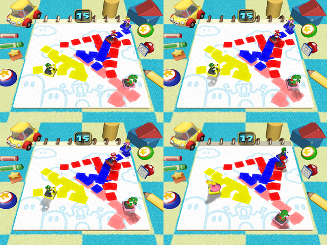

Every player on the paper has the console's soft shadow to their lower
left with the fix and none without it; the raw input with the vertex
divide (bottom left) is indistinguishable from the fix on this flat
paper, as the reading says it should be.

**The third fault, found by the first two.** The fixed build's title
frame (800) drew the cake — a textured-hilite material, `GX_TG_NRM`
through `GX_TEXMTX7` (hsfdraw.c:809) — as a dense grey hatch
(`screenshots/m26-md5-800-crop-old-new-console.png`, middle): the hilite
map repeated sixty-odd times across each face. A flat face has one
normal, so the coordinates were not varying — they were *large*. hsfdraw
sets its normals as `GX_S8` with `frac` 0 (hsfdraw.c:511), and the GX
hardware **ignores the VAT's `frac` for normals**: S8 is read as 1.6 and
S16 as 1.14, always. `gx_draw.c` scaled every normal by the VAT's `frac`
— 1 — so every raw S8 normal in the port was up to 64 units long since
M3, and nothing saw it: the lighting normalises, the CPU path
normalises, and no texgen had read the raw row. `nrm_frac()` applies the
hardware's shift at the three decode sites (the plan's scale, the
byte tables, `put_fixed` and the pending-attribute reads); `--nrmfrac0`
is the VAT's value. And a raw-normal texgen on a descriptor with no
normal reads `(0, 0, 1)`, as phase 1 stored it, rather than whatever
`vertex.normal` last was.

### 41.5 The witness: the whole gallery again on the fixed build

The fixed build (`~/MarioParty4-m26fix.app` on the G4, `87604c2b…`) ran
the same 63-game chain into `~/gallery-fix` (06:26–09:35 G4 time,
`GALLERY_APP`/`GALLERY_DIR` in the chain script), and every frame was
diffed against the M25 build's (`~/gallery-tools/diff.py` on littlejelly:
pixels differing by more than 8 levels, over 640×480; the table is
`port/docs/gallery/diff-m25-vs-m26.txt`). Same entry frames, same exits,
the same two faults at the same frames (m458, m459 — the fix does not
touch game logic); nothing else changed its course.

**What the diff says**, game by game, with what the eye sees:

* **Every instruction card changed by 18–21%** (frames 14,300 and 14,400):
  the card's TV screen, blank dark blue since M3, now shows the
  minigame's preview picture — `instDll/main.c:1093` projects it with a
  `GX_TG_MTX3x4, GX_TG_POS` texgen. Sixty-three of sixty-three.
* **Shadows landed**: m415's stamps (10–11%), m419's tree stumps and
  Mario (11%), m410's players and balls (4%), m433's players on the sand
  (2%), m431's diners around the tables (5% on the intro), m402's
  players and the column (20–27%), m420/m421/m423/m424/m428/m432/m441
  (1–7%: the receivers under the players).
* **m405's pool is translucent** (12–53%): the water surface was a
  projected texture landing across the whole pool at the wrong
  coordinates; the swimmers are visible through it now, with the lane
  ropes and the tiled floor, as the console's frames show — though the
  port's water is grey-green where the console's is blue (cause B of
  §41.3 is still in it).
* **m434's pond** (24–58%): the opaque black disc is gone and the stone
  floor of the pond shows through — the water *surface* is still not
  drawn (cause B).
* **m413's machine, m422's belts, m425's Thwomp, m444's board** changed
  by 6–31% on their reflection-mapped surfaces (`GX_TG_NRM` with the
  hsfdraw reflection matrix): the environment map no longer rotates
  twice with the camera.
* **Unchanged (< 1%)**: m401 (the sea has no receiver), m406 (its slope's
  shadows were already right within a texel: an overhead camera over a
  flat receiver is the one case the old input got right), m414, m416,
  m417, m427, m430 — the causes C/D games, untouched by A, as they
  should be.

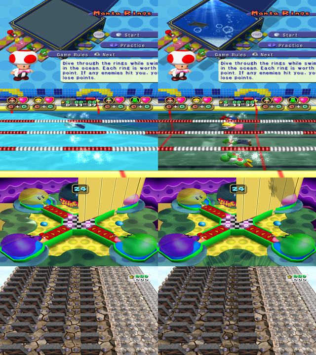

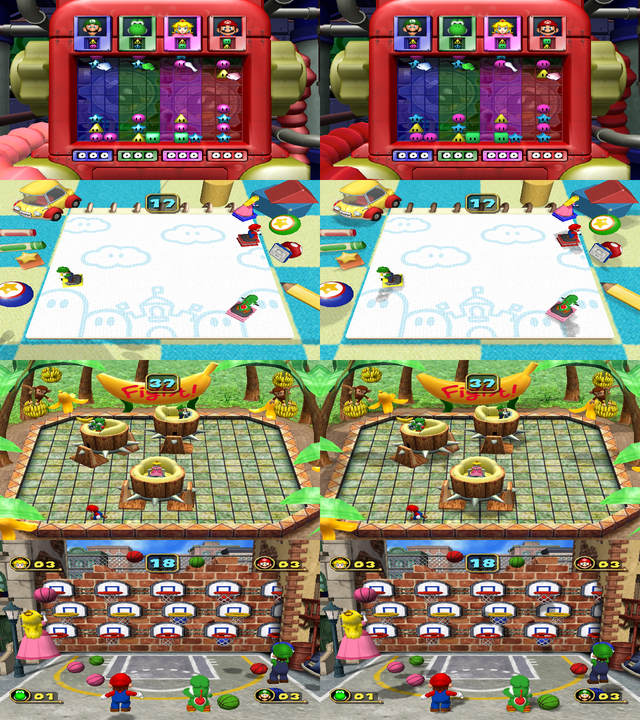

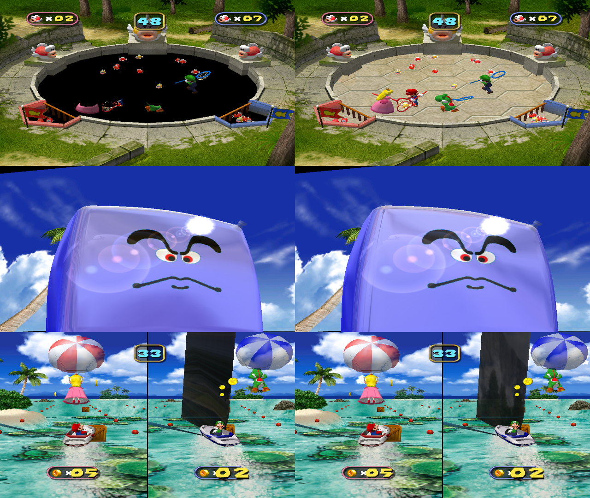

**The md5 references move, and are re-based with this justification.**
`--viewtexgen --vtxdivide` on the final build reproduces §40's three
frames to the byte (800 `1df90661…`, 3000 `8762d432…`, 7000 `f5b52130…`
— the control arm, `~/m26ab/ctl` on the G4). The default changes all
three:

| frame | §40 md5 (= `--viewtexgen --vtxdivide`) | **M26 md5** | channel samples > 32 | what |
|---:|---|---|---:|---|
| 800 | `1df90661…` | **`0b58c5ee1dee7b5da28a688c4fe315ce`** | 1.39% | the title's cake: its textured hilite (`GX_TG_NRM`, hsfdraw.c:809) now a soft highlight on the box's faces, as the console's `title.png` has it — and the first build of the fix drew it as a 64×-repeated hatch, which is how the normal shift was found |
| 3000 | `8762d432…` | **`c58a046d9ce6fabe3fef0b2270179203`** | 0.48% | the character select's hosts (Goomba, Shy Guy, Toad, Boo, Koopa) have their **shadows on the floor** under them; there were none |
| 7000 | `f5b52130…` | **`021d58fb35d2307a35f4d26ac5d08dfb`** | 0.27% | the board's balloon-star behind the HUD: the hilite map on the right normal |

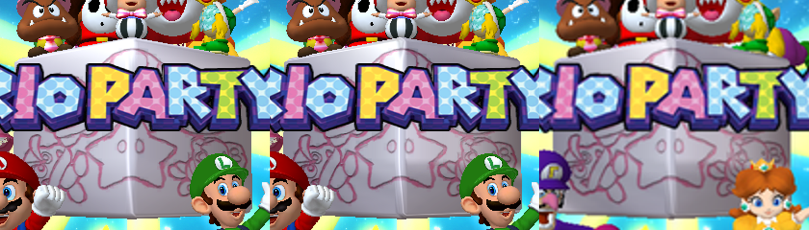


**m402's streaks were the normals, not the divide.** The fixed build's
Slime Time floor showed radial streaks on its outer ring where the M25
build had a flat dark green; `--vtxdivide` drew the same streaks
(`screenshots/m26-m402-g4-pixel-vs-vertex-divide.png`), which put them
outside the divide — and the normal shift (§41.4's third fault) removed
them: the outer floor is a reflection-mapped material, and its
`GX_TG_NRM` texgen was sampling with 64-unit normals. On the final build
the floor is smooth dark green with the players' shadows on it
(`screenshots/m26-final-vs-fix-m402-m413.png`; m413's machine glass,
the same). The nine games with a `GX_TG_NRM` surface or a shadow of note
(m402, m405, m413, m415, m422, m425, m434, m444, m456) were run a third
time on the final build (`~/gallery-final` on the G4, 09:56–10:22) and
those are the frames in the sheet's second strip; the rest of the
sheet's second strip is the second run's, and `diff-m25-vs-m26.txt` is
M25 against those. The per-pixel divide is the hardware's rule and is
the default.

### 41.6 Three things found on the way

* **The gallery's second run is the witness the first cannot be.** A
  chain that photographs 63 games in 3 h 10 min, run twice, gives a
  per-frame diff of a renderer change across the whole game for the
  price of one night — `port/docs/gallery/diff-m25-vs-m26.txt` is the
  first such table, and it found the normal-shift fault (§41.4) that no
  reference frame had.
* **The MacBook's picture is not the G4's for cluster shapes** (§0o):
  Slime Time's blobs render as spikes on the Intel driver under Rosetta
  on every bundle back to M24b. A MacBook A/B says whether a change moved
  a picture, not whether the picture is right.
* **The oracle rig can run the console out of `HEAP_DVD`** (m402:
  `OSPanic dvd.c:75`) and can deal a different game than the poke asks
  for (m404 → Order Up): the poke lands after the board's own preload.
  Both in `port/ref/notes.md`.

### 41.7 What M26 shipped, and what it did not

| shipped, with a witness | |
|---|---|
| the soak read (§41.1): `MIX_PLAN_CLEAR` proven on the G4, 0 mismatches over 224,277 frames | the `split frames` line |
| `--mgdump`, `--mgend`, `port/tools/gallery_chain.sh` (§41.2) | 63 games, two runs, 908 frames |
| the contact sheet `port/docs/gallery/index.html`: 63 rows, 454 frames of the M25 build and 151 of the M26 build at 320×240, 9.1 MB (§41.3, §41.5) | |
| the first pass: 49 ok, 5 minor (3 unverified), 7 major, 2 faulted; six oracle captures (m405, m407, m408, m427, and the two that missed: m402, m404) | the table, `port/ref/frames/m40{5,7,8}-console-*.png`, `m427-console-*.png` |
| **cause A fixed**: `GX_TG_POS`/`GX_TG_NRM` texgens read the raw row, `GX_TG_MTX3x4`'s `q` divided per pixel, S8/S16 normals at the hardware's shift (§41.4); `--viewtexgen`, `--vtxdivide`, `--nrmfrac0` | the whole gallery again on the fixed build and the diff (§41.5); the three md5s re-based |
| the two faults' snapshots: `snaps/lib/m458-fault-f015200.snap`, `snaps/lib/m459-heap-f013600.snap` (the M25 build, kept as `~/MarioParty4-m26gallery.app`) | |

**Not done, and why:**

* **Causes B–F** (§41.3): not started, by the brief's rule of one cause.
* **m402's outer floor** and the per-pixel divide's precision on the
  Radeon: the oracle first.
* **The CPU vertex path** (`--cpuxf`, the degraded machines of §40.3)
  still divides `q` at the vertex; its arrays carry two components.
* **`--palette`** (a dead lever since M18) hands the program a bone-space
  `vertex.position`; a raw-input texgen on a palette-skinned draw would
  need the skinned object-space position, which that path does not have.
* The M24/M25 leftovers stand: the results-screen stall (in a soak for
  the second time, §41.1, still without `--perf`), the two mixer timers,
  the selected box's specular, the launcher.

### 41.8 What M27 starts with

Left running: `g4 run --soak --com4 --rtc dolphin --freshcard --realtime
--snap-every 5000 --snap-keep 3 --status --ovllog --stuckwatch 200` on the
final build (`isle` md5 `dee221ea…`) — the first soak with the texgens
reading the right row. Read it as §40.9 says; then the M27 list, in the
order of games behind each:

| cause | games | where to start | snapshot / reproduction |
|---|---|---|---|
| B. water drawn opaque or not at all | m434 (the pond's surface missing after A), m427 (the river white, the boats black), m417 (a cream screen), m405 (grey-green where the console is blue) | m427's `map.c:1070/2429` (`GX_TG_POS` texgens with `GX_TEXMTX`s 0x1E/0x21 and three `GXCopyTex`), m434's `GXCopyTex`, m417's `GXSetTevIndWarp` water (the §32.1 drop); `--copylog --drawlog` on the MacBook | `--minigame m427 --turns 1 … --ffto 15600 --lockstep --dumpframe 15677`; console frames `m427-console-15400/16600/17000.png` |
| C. whole scenes missing | m408 (sea, islands, coast), m414 (four cyan viewports), m417 | m414's `Hu3DCameraScissorSet` ×4 + `Hu3DCameraViewportSet(16, 0,0,640,480)` (the HUD camera draws, the four do not: the port's per-camera scissor/viewport with a camera bit mask); m408's background (`GXSetTevIndWarp`?) | `m408-console-12400/12800/13200.png`; m414 needs its oracle |
| D. a black column in the right view | m430 | the right camera's copy/depth (`m430Dll` has one `GXCopyTex`) | `--minigame m430 … --dumpframe 15677` |
| E. faults | m459 (`HEAP_HEAP`: 65 processes × `PORT_PRC_STACK_MUL` 4), m458 (SIGBUS in the REL after the panel pick) | m459: a `--heapheap KB` lever like `--dvdheap`, or scale `HEAP_HEAP` by the multiplier (a logged divergence); m458: `--restore snaps/lib/m458-fault-f015200.snap` on `~/MarioParty4-m26gallery.app` under gdb | the two snapshots |
| F. unverified | m402 (column, blobs, the outer floor), m404 (guide line), m421 (washed floor), m456 (swimmers), m414 | the oracle: m402 needs the poke before the preload (a `--rtcoffset`-style earlier poke, or the `mg_list` path), m404 a battle space | |

And the gallery itself is now a tool: `GALLERY_APP=… GALLERY_DIR=… sh
~/gallery_chain.sh` on the G4 and `diff.py` on littlejelly say what any
renderer change did to every minigame, overnight.

## 41b. M26b log — the oracle sweep: every minigame, the console beside the port *(2026-09-20, littlejelly, in parallel with M27)*

§41's verdicts were a first pass from the port's frames against the code,
with six oracle captures behind them. This milestone is the second pass
the brief asked for: **a Dolphin run per minigame with the port's own
schedule, the console's seven frames picked by event and put beside the
port's**, a similarity number under each pair, and the verdicts re-read.
The page is `port/docs/gallery/compare.html` (63 rows, the console's
frames in `port/docs/gallery/oracle/mNNN-cNNNNNN.jpg` at 320×240, the
port's fix-build frames alongside as `mNNN-fix-fNNNNNN.jpg`); the
capture and picking tools are scratch on littlejelly
(`~/mp4-sweep-work/{capture.py,analyse.py,compare.py,chain.sh}`), their
schedule and the calibration are in `port/ref/notes.md`.

### 41b.1 The rig, and the poke that let m402 run

One Dolphin run a game (the Flatpak on littlejelly, OpenGL, no audio,
FFV1 AVI at ~110 dump fps): a fresh user dir seeded from
`port/ref/dolphin-user` every time (the 2026-09-19 lesson: a dirty card
walks a different menu path), the `m406-end.txt` walk with the four
`iscom` pokes, the four `group` pokes for the game's type (**type 1 →
0,1,1,1; type 2 → 0,0,1,1; types 0/3/4/5/6/7/8 → 0,1,2,3** —
`park_minigame()`'s `default:` arm covers the Bowser, item, story and
Extra types, and the port's chain forced them through instDll the same
way), `GWSystem.mg_next` poked from GC 9000 — **and `mg_setup.c`'s static
`mgNext` (`0x801D4208`, `.sbss`) poked to the same index.** The board
preloads `mgInfoTbl[mgNext].data_dir` from that static *before* it copies
it into `GWSystem.mg_next` (mg_setup.c:268–290), so M26's captures had
two directory images in `HEAP_DVD` — the roulette's own pick and the
poked game's — which is why m402 panicked the console (`dvd.c:75`). With
`mgNext` poked as well the board preloads the target itself: the retail
path, one image. m402 played, m404 dealt Trace Race (M26's "Order Up"
was the dirty card), and m453 — "no four-character cast fits" under two
images — see its row.

The stop is the game's state, not a clock: MemoryWatcher on
`GlobalCounter`, `VCounter` and `omcurovl` (the USA `ovl_table.h` without
the `VERSION_JP` block: instdll 3, m401dll–m463dll 9–69, resultdll 84,
w01dll 89), Dolphin killed 700 GC after the module is left (its results
are in) or 3,400 GC after it is entered (the port's window is 2,600), and
only the Dolphin it started (M27 shares the host). ~4.5 min a game plus a
60–90 s ffmpeg split of the window from 1,200 GC before instDll (the
walk's length varies by game: the board seeds from the clock at board
setup, which the walk reaches at a different frame each run, and the
first turn's dice differ — instDll came at GC 9,766 for m414 and 12,537
for m417), 1.2 GB of PNGs a game deleted after the eight frames are
picked, 57 GB free throughout, 62 games in 6 h 50 min of one chain (11:43–18:35, m416 before it as the
calibration run) plus a redo chain of eight for the picker's early
mistakes and the two hangs.

### 41b.2 The calibration, on m416

The port's dump frames are **present-count** frames (`gl13`'s
`frame_no`); `mgdump: entered … 14477` counts retraces, six ahead after
`--ffto`. So, from the port's own log of the walk: instDll's link at
present 14136 → the card frames 14200/14300/14400 are instDll
**+64/+164/+264**; the module's link at 14471 → the in-module frames
14537/14877/15677/16777 are link **+66/+406/+1206/+2306**; the results
frame is the module's exit +40. (For the twelve no-card types — 3, 5, 6,
8 — instDll links the module on its first frame, present 14137, and the
walk frames 14200/14300/14400 are in-module frames at link +63/+163/+263.)

On the console every frame is a dump index and nothing lines up with the
port's numbers, so each position is found by event:

* **the card**: the port's 14300 (the fix build's) is matched against
  the whole console window at 32×24 then ±4 at 160×120; for m416 it lands
  on 10768 at a mean difference of 4.4 levels (every card game of the
  sweep matches its own between 4.0 and 5.6 — the card is the
  frame-exact pair), so the console's instDll link I_c = 10768 − 164 =
  10604, six frames before the card's yellow background dominates the
  wipe-in, and the three card frames are I_c + 64/164/264;
* **the module**: instDll's wipe-out is fully white for five frames
  (10936–10940); the code links the module two frames after the wipe
  ends (`instMode = 6`, one `HuPrcVSleep`, `omOvlCallEx`), so the link
  L_c = (the first non-fully-white frame S_c = 10941) − 2, and the four
  play frames are L_c + 66/406/1206/2306 = 11005/11345/12145/13245;
* **the results**: the module's fade-to-white peaks for ~4 frames, the
  results' first drawn frame is the one after, and the frame is that +
  38 (resultDll's first drawn frame is ~2 after its link).

The check is the picture: m416's four console frames are the lit intro
with the four in their places, the START! banner at full size, the timer
at **19**, and the play — the port's 14537/14877/15677 show the same
three moments (the banner's full-size plateau is ~30 frames wide, the
timer's 19 a 60-frame window with L_c + 1206 inside it), at sim 95 / 97 /
97%. The brief's rule of thumb "port entry 95,487 → first scene ~95,500"
(+13) is the frame the room is *recognisable* through the module's
60-frame wipe-in; the first non-fully-white frame is +2 to +3, and that
is what the sweep anchors on. The runs do not share their RNG (the board
seeds from the clock at board setup, reached at different frames), so
the play frames differ by the play itself — m416's console candle was out
at 08 (`LUIGI PEACH YOSHI WON!`) at +2306 where the port's burned to 01 —
and the card, the intro and the timers are what the numbers compare;
sim on a play frame says "same scene", not "same pixels".

### 41b.3 The per-game table

Verdicts: **match** = the console shows the port's scene at every position
captured (the play may differ; the card, the intro and the HUD are
frame-exact); **minor** = one element wrong or missing; **major** = a
scene, a surface or a piece of geometry wrong; **port-faulted** = the
port dies in the module; **oracle-failed** = the console did not reach
the play on this schedule. The similarity cell is `sim/>8` per position
(§41b.2): sim = 100·(1 − mean |Δ| / 255), >8 = % of pixels whose worst
channel differs by more than 8 levels, both at 320×240; `-` = one side
has no frame (the game was over, the port ran on, the console hung), `·`
= neither. The card triple runs 97–99 / 7–36 on every card game — the
frame-exact pairs — except m411 (its puzzle is a per-run draw); the play
frames run 70–99 by how far the two plays had drifted.

| module | game | type | §41 | **M26b** | sim: card +64/+164/+264 · entry +60/+400/+1200/+2300 · results (sim%/>8%) | what the console shows |
|---|---|---|---|---|---|---|
| `m401` | Manta Rings | 0 | ok | **match** | 99/8 97/33 98/23 · 93/92 93/95 91/93 92/94 · · | CONFIRMED ok: the boat's hull seen from below with the light shafts, START! with the four divers, the rock arches and the rings, the score HUD — the same scene at every position (the divers' places differ by the play); the card matches |
| `m402` | Slime Time | 0 | minor? | **major** | 99/8 97/35 97/28 · 82/93 86/88 86/90 86/90 · - | OVERTURNED (minor? → major), and the console now runs it (the mgNext poke — one directory image, no HEAP_DVD panic): the console's arena has a dark dome with the "SLIME POWER" sign at the centre and NO column; the port stands a tall yellow hexagonal prism through the middle of the arena in every play frame, from +60 on, hiding the sign — a piece of geometry the console does not draw at that size (new cause G); everything else lines up: the checkered cross, the four coloured slime blobs, the outer floor's dark green, the timer (24 / 06); the card matches; the console's game ended at the timer and its results were captured (the port ran on) |
| `m403` | Booksquirm | 0 | ok | **match** | 99/8 97/36 97/26 · 99/9 95/40 99/0 - · 96/34 | CONFIRMED ok: the book's cover at +60, START! on the open page with the four players and the quill (the page's text is laid out differently — the console's page has a wide column of text at the top and the port's a narrower one: the page is a randomly chosen layout, the play's draw), the white page-fall at +1200 on both (the console's game ended by +2300), the results match; the card matches |
| `m404` | Trace Race | 4 | minor? | **minor** | 99/7 97/32 97/26 · 96/48 94/57 91/68 82/94 · - | CONFIRMED (cause F → a fault of its own): the console dealt Trace Race this time (fresh userdir + the mgNext poke; M26's "Order Up" was the dirty card's walk) and its lanes carry the wavy guide line each player has to trace from +60 on (a dark line on every lane, the coloured trace drawn over it as they go); the port's lanes are blank until the players' own traces appear (+2300) — the guide line, the objective of the game, is not drawn; everything else (the desk, the pencils, the START!, the timers) matches; the console's battle results were captured (the port ran on) |
| `m405` | Mario Medley | 0 | major | **minor** | 99/8 97/36 97/27 · 95/66 93/74 87/88 90/91 · · | DOWNGRADED (major → minor) by the fix build and the console together: the port's pool is translucent now — the swimmers, the lane ropes and the tiled floor show through, as on the console — but its water is a flat grey-green where the console's is a bright blue with a moving caustic pattern and the black wedge of §41 is gone; the intro (Mario on the block, 5'00"00), START! and the clock (0'29"71 vs 0'29"72) match to the frame; the card matches. What is left is cause B's tint: the water's colour (a copy-fed or indirect stage) — one surface, not a missing scene |
| `m406` | Avalanche! | 0 | ok | **match** | 99/8 97/35 97/25 · 93/20 90/51 75/75 90/44 · 96/32 | CONFIRMED ok: the slope, START!, the skiers and the trees, the ending (LUIGI WON! on the port, Yoshi with the losers in the snow mounds on the console — §35.2's mounds by design), the results; the card matches |
| `m407` | Domination | 0 | ok | **match** | 99/8 97/30 97/24 · 96/52 97/45 96/57 43/100 · 96/40 | CONFIRMED ok: the Whomp dominoes face-down (as §41), the red switch mat, the timer (10), the counters, the results; the port's +2300 is the results' white-out where the console's is Slot A: Saving — the same transition ~40 frames apart; the card matches |
| `m408` | Paratrooper Plunge | 0 | major | **major** | 99/8 97/33 97/25 · 92/80 93/99 83/94 62/100 · 96/33 | CONFIRMED (cause C): the console's sky is blue with clouds and the sea, the swirl and the island are under the falling players at +1200/+2300; the port has white where the sky gradient and the sea should be — only the plane, the players, the balloons and the HUD draw; the card and the results match |
| `m409` | Toad's Quick Draw | 0 | ok | **match** | 99/8 97/34 98/25 · 98/21 97/27 93/50 94/47 · · | CONFIRMED ok: the mine tunnel at +60, the western station with the train, the four shooters and Toad's flag, the balloons and the crosshairs — the same at every position; the card matches |
| `m410` | Three Throw | 0 | ok | **match** | 99/8 97/34 97/28 · 86/73 96/52 91/68 93/62 · - | CONFIRMED ok: the wall of baskets, START!, the timer (18 / 00), FINISH!, the players' shadows on the court (the texgen fix); the intro's close-up features Peach on the port and Yoshi on the console (the play's draw); the card and the results match |
| `m411` | Photo Finish | 0 | ok | **match** | 99/8 94/44 95/32 · 76/91 95/59 90/76 87/84 · · | CONFIRMED ok: the puzzle frames, the four faded portrait boards, the timer (51 / 33) and the pieces being placed; the puzzle picture is the game's draw (`GWMGTypeSet(frandmod(3))`, instDll:69 — the banquet on the port, the penguins on the console), which is also why the card's preview differs (mean diff 11.4 on the card match, the only card above 6) |
| `m412` | Mr. Blizzard's Brigade | 0 | ok | **match** | 99/8 97/33 98/23 · 99/13 98/15 97/22 64/100 · 97/31 | CONFIRMED ok: the snowy intro, the frozen pond with the Blizzards and the four runners, the frozen players in translucent ice, the timer (52); the console's game ended earlier (+2300 is the board again) and its results match the port's; the card matches |
| `m413` | Bob-omb Breakers | 0 | ok | **match** | 99/8 97/39 97/27 · 98/25 94/74 95/68 95/69 · · | CONFIRMED ok, piece for piece: the machine, START!, the same board layout and the same scores (012/003/006/000) at +2300 — the engine RNG (`frand`, seeded from the pinned clock at boot) agrees between the two; the machine glass's reflection map (the texgen fix) reads as the console's; the card matches |
| `m414` | Long Claw of the Law | 0 | major | **major** | 99/8 97/32 98/25 · 45/100 54/92 49/92 53/100 · 97/31 | CONFIRMED (cause C): the console's four viewports show the WANTED! poster close-up at +60 and the saloon-front shooting gallery with the crowd of characters in the windows; the port's four quadrants are flat cyan with only the HUD (crosshairs, star meters, timer 49 to the frame, START! and the WON! banner); the console's game ended at +1981 (its +2300 is already the results), the port's at +2498; the card and the results match |
| `m415` | Stamp Out! | 0 | minor | **match** | 99/8 97/35 97/25 · 97/30 96/39 90/55 87/68 · - | CONFIRMED FIXED (the 5th minor of §41, the texgen cause): the paper is white with the faint blue line art, the toys are textured and coloured, and each player has the console's soft shadow on the paper; the stamps, the timer (30 / 17) and the results match. One thing to keep an eye on: at +1200 (timer 17) the console's paper already carries ~30 stamps and the port's none — the port's COMs stamp late (by +2300 both papers are covered); the COMs' timing is the play's (RNG) unless it reads the coverage read-back — not a picture fault |
| `m416` | Candlelight Flight | 1 | ok | **match** | 99/5 97/30 98/22 · 95/37 97/65 97/59 77/86 · - | card, lit intro, START! and the timer at 19 frame-for-frame with the console (sim 95-99% on the frame-exact pairs); +2300 differs only because the console's candle was out at 08 (LUIGI PEACH YOSHI WON!) while the port's burned to 01 — the play, not the picture; the port's darkness during the play is the console's |
| `m417` | Makin' Waves | 1 | major | **major** | 99/5 97/34 97/25 · 78/99 52/99 61/98 70/100 · 96/36 | CONFIRMED (cause C) and worse than the first pass: the console's Makin' Waves is a pool with the lone player on a raft in the middle and the three others in inner tubes pounding the deck (+60 the raft, +400 START! over the pool, +1200 the timer at 18, +2300 FINISH!, ~2,600 frames); the port shows a beige stripe at +60, START! over a cream screen at +400, and its game is over at +846 — the scene is not drawn AND the play ends early (the raft rider falls at once?), so the module's logic diverges too, not only its picture; the card and the results match |
| `m418` | Hide and Go BOOM! | 1 | ok | **match** | 99/5 97/35 97/24 · 98/26 98/32 98/29 98/29 · - | CONFIRMED ok: the cannon arena at dusk, START!, the timer (04 / 02), the same players in the same places to the frame; the card matches (the console's card reads "Hide and Go BOOM!" with the "!" the port's line-wrap drops at the card's edge — a text-layout difference of one glyph); the console's results captured (the port ran on) |
| `m419` | Tree Stomp | 1 | ok | **match** | 99/5 97/35 97/27 · 98/29 96/58 92/72 97/20 · 96/41 | CONFIRMED ok: the dark intro close-up at +60, the Fight! banner and the stump arena, the timer (37), the stomper's shadow on the tiles (the texgen fix); both games ended with the same Slot A: Saving results-to-board transition and the results match; the card matches |
| `m420` | Fish n' Drips | 1 | ok | **match** | 99/5 97/31 97/25 · 99/11 95/37 96/38 96/36 · · | CONFIRMED ok: the Lakitu close-up, START! on the docks, the tanks filling, the timer (49 / 31) — frame for frame; the card matches |
| `m421` | Hop or Pop | 1 | minor? | **match** | 99/5 97/35 97/26 · 97/30 97/49 93/55 95/50 · · | OVERTURNED (minor? → match): the console's star floor is the same washed pale yellow — the arena's floor is lit that way by design (the console's +60 close-up is as near-white as the port's); the cage, the balloon backdrop, the spiky ball, the START! and the timer (33 / 15) line up; the card matches |
| `m422` | Money Belts | 1 | ok | **match** | 99/5 97/36 97/27 · 96/47 95/70 95/72 96/66 · - | CONFIRMED ok: the machine's front at +60, START!, the belts with the sweets and the coins, the timer (18 / 00), FINISH!, the belts' reflection map (the texgen fix) as the console's; the card and the results match |
| `m423` | GOOOOOOOAL!! | 1 | ok | **match** | 99/5 97/34 97/24 · 95/68 93/82 91/88 90/88 · 96/41 | CONFIRMED ok: the stadium (the big screen is a dark "LIVE" panel with a small picture on the console too — not a blank), START!, the goalie and the three shooters, the timer (19), the WON! banner, the results; the card matches except the title's trailing "!!" (see the card note, cause H) |
| `m424` | Blame it on the Crane | 1 | ok | **match** | 99/5 97/34 97/25 · 75/100 93/72 91/75 71/100 · - | CONFIRMED ok: the turntable with the Shy Guys under their glass domes, the crane, the timer at 42 to the frame at +1200, the console's earlier results; at +60 the port's intro is ~10 frames behind the console's (its wipe-in still a white veil over the close-up, the camera a step earlier) — an intro-timing wobble, not a picture fault; the card matches |
| `m425` | The Great Deflate | 2 | ok | **match** | 99/7 97/30 97/24 · 95/51 93/58 92/51 85/75 · - | CONFIRMED ok: the Thwomp close-up at +60 with its reflection map (the texgen fix), the beach with the two inflatable Thwomps, the timer (29 / 16), the WON! banner mid-zoom at +2300 on both; the card and the results match |
| `m426` | Revers-a-Bomb | 2 | ok | **match** | 99/7 97/38 97/30 · 98/28 97/57 92/68 65/100 · 96/35 | CONFIRMED ok: the DANGER sign at +60, START!, the red/blue lanes with the Bob-ombs, the timer (18), the bomb counters, the results (the console's game ended by +2300); the card matches |
| `m427` | Right Oar Left? | 2 | major | **major** | 99/7 97/30 97/23 · 85/43 47/89 47/93 56/94 · · | CONFIRMED (cause B): the console's cave is dark with each boat lit by its own headlamp cone on the water and the walls (the timer, the split and the lane markers match to the frame: 0'29"20 vs 0'29"25 at +2300); the port floods both views white-green from +400 on with the boats as black silhouettes — the lamp's projected texture lands on everything instead of a cone (+60, before the lamps, the port's river is dark green where the console's is near-black: the same texture already over the whole river); the card matches |
| `m428` | Cliffhangers | 2 | ok | **minor** | 99/7 97/33 97/25 · 92/55 92/54 82/88 79/96 · · | NEW (cause H): the console draws the rope that ties each 2-vs-2 pair together (orange Mario–Luigi, blue Peach–Yoshi, a `GX_LINESTRIP` of width 16/6 px, player.c:2189-2199) at +60 and through the play; the port draws no rope at all (it maps GX_LINESTRIP to GL_LINE_STRIP and ignores GXSetLineWidth — a 1-px line, or none); the cliff face, the height markers, the snow and START! match to the frame; the port's snow at +2300 reads a shade lighter (the storm's whiteness), unchased; the card matches |
| `m429` | Team Treasure Trek | 2 | ok | **match** | 99/7 97/35 97/25 · 96/33 96/36 87/90 83/93 · · | CONFIRMED ok: the treasure map at +60, START! in the four views, the maze walls and the "?" blocks, the timer (50); at +2300 the port's Peach/Luigi views carry a tall yellow beam that the console's frame does not — the plays differ by then (the console at 31 with no beam), so it is either the found-block light or m402's prism (cause G) — flagged, not settled; the card matches |
| `m430` | Pair-a-sailing | 2 | major | **major** | 99/7 97/33 98/23 · 91/67 89/73 81/88 81/86 · · | CONFIRMED (cause D): the tall black rectangle stands in the right-hand view's upper half in every port play frame; the console's right view has the sky, the clouds and the parachute over it; everything else lines up to the frame (the timer at 33 / 14, the coins, the crates, the sea) — the one column is the whole difference; the card matches |
| `m431` | Order Up | 2 | ok | **match** | 99/7 97/34 97/27 · 97/34 96/49 94/53 95/52 · · | CONFIRMED ok: the star-plate close-up, the diner with the two tables and Toad at the counter, the order bubbles, the timer (10 / 14 vs 09 / 12 — the play), the diners' shadows (the texgen fix); the card matches |
| `m432` | Dungeon Duos | 2 | ok | **match** | 99/7 98/28 94/32 · 98/26 97/38 97/25 92/55 · · | CONFIRMED ok: the dungeon's two lanes with the obstacles, the clocks (2'00"00 / 0'14"9x / 0'33"2x to the frame), the pipes, the players; the card matches |
| `m433` | Beach Volley Folly | 7 | ok | **match** | 99/8 97/36 93/37 · 92/40 95/77 94/78 94/77 · · | CONFIRMED ok: the net close-up with the Goomba at +60, the court, the umbrellas and the scores; the port's fix build has the players' shadows on the sand; the card matches |
| `m434` | Cheep Cheep Sweep | 2 | major | **major** | 99/7 97/31 97/22 · 88/69 93/56 92/61 92/60 · · | CONFIRMED (cause B, the water surface): the console's pond has a translucent grey-blue water surface over the stone floor with the fish and the wading players seen through it (+60: the water already in the close-up, blue-grey at the bottom of the frame); the port's fix build shows the bare stone floor with the fish on it — the opaque black disc of M25 is gone, the surface is still not drawn; the timer (48 / 29) and the play line up; the card matches |
| `m435` | Darts of Doom | 3 | ok | **minor** | 95/48 97/32 97/43 · 95/58 97/37 98/39 98/32 · · | NEW (cause I, the Bowser arena): the two pillars' blue flames are large translucent glowing spheres with a star flare inside on the console; the port draws the star flare only — the sphere is missing (all three Bowser games, m435–m437, the same arena); and the result bubble reads "has 101 points!" where the console's reads "Mario has 101 points!" — the player's name is dropped from the message (cause J, text); the throne, Bowser, the dart wheel, the cutscene and its bubbles otherwise match to the frame (no card: type 3, the walk frames 14200/14300/14400 are link +63/+163/+263 on both sides) |
| `m436` | Fruits of Doom | 3 | ok | **minor** | 97/32 97/33 97/43 · 95/57 97/37 97/39 97/40 · · | as m435 (cause I): the pillar spheres missing; the fruit stalls, Bowser's bubbles ("What refreshing flavor do I long for…?") and the cutscene match to the frame |
| `m437` | Balloon of Doom | 3 | ok | **minor** | 98/29 98/31 97/37 · 95/58 97/37 97/33 97/32 · · | as m435 (cause I): the pillar spheres missing; the balloon, the four players around the throne and the cutscene match to the frame |
| `m438` | Chain Chomp Fever | 4 | ok | **match** | 99/7 97/31 97/23 · 98/30 97/53 95/52 - · 96/25 | CONFIRMED ok: the lava close-up, the arena with the Chain Chomp and START!, the play (the console's ended earlier, its battle results match the port's); the card matches |
| `m439` | Paths of Peril | 4 | ok | **match** | 99/7 97/28 97/24 · 94/51 85/93 82/95 82/94 · · | CONFIRMED ok: the four START pads and the cliff paths in four viewports, the timer (48 vs 47, 29 vs 28 — the console's clock is ~1 s ahead: its 60 is already up at +400 where the port still shows START!, the same intro-timing wobble as m424); the card matches |
| `m440` | Bowser's Bigger Blast | 4 | ok | **match** | 99/7 97/32 97/25 · 94/56 93/62 94/58 90/70 · · | CONFIRMED ok: the gear wall and the bomb at +60, Bowser's head over the switch table, START!, the timer (05); the card matches |
| `m441` | Butterfly Blitz | 4 | ok | **match** | 99/7 97/33 97/27 · 96/30 93/85 93/83 92/84 · · | CONFIRMED ok: the butterfly over the flower field at +60, START! on the stone circle, the nets and the timer (49 / 30) to the frame; the card matches |
| `m442` | Barrel Baron | 7 | ok | **oracle-failed** | 99/8 98/27 97/25 · - - - - · · | the console hangs at Barrel Baron's link three runs out of four (GlobalCounter frozen the frame `omcurovl` becomes m442dll, VCounter running on; fresh user dir each time, the pinned RTC — a race at the module's setup on the retail path forced through instDll, an Extra-room game the roulette never deals); the one run that played (18:16, entry +3400 of frames) lost its window to a tag-parsing bug in the chain before the picker ran; the card frames are from the fourth run and match the port's (the card is "Jigsaw Jitters"/"Mario" with m442's own picture — the Extra games' card strings, as m452/m454/m459–m463); the port's play frames stand unverified |
| `m443` | Mario Speedwagons | 0 | ok | **match** | 99/8 97/32 97/25 · 89/62 85/69 95/50 72/100 · 97/32 | CONFIRMED ok: the grid close-up, the four cockpit views with the speedometers (000 / 20x km/h), the clocks to the frame; the port's game ended into the results (16386) and the console's results match; the card matches |
| `m444` | Reversal of Fortune | 5 | ok | **match** | 99/16 99/20 99/21 · 99/15 99/20 85/78 90/50 · · | CONFIRMED ok (no card, type 5): Toad's welcome and "So, are we all ready?" bubbles to the frame, the pinball board with the character heads and its reflection (the texgen fix), the Boo at +2300 (the console's bubble "I love this trickery stuff!" is a few frames ahead of the port's); the board's own picture is the same |
| `m445` | Bowser Bop | 6 | ok | **match** | 99/13 99/13 98/26 · 99/13 98/28 96/44 96/43 · · | CONFIRMED ok (no card, story type 6): the clock and the toy room, START!, the timer (48 / 30), the two players (Mario vs Peach on the port, Mario vs Luigi on the console — the casts differ in order: the port's walk seats Mario, Peach, Luigi, Yoshi as players 0–3, the oracle's pokes Mario, Luigi, Peach, Yoshi, which is also why the 2-vs-2 pairs and the 1-vs-3 places differ everywhere) |
| `m446` | Mystic Match 'Em | 6 | ok | **match** | 100/2 98/20 97/33 · 100/2 91/45 93/64 90/68 · · | CONFIRMED ok (no card, story type 6): the dark parlour intro, the card-shuffle and the card grid with the same layout, the timer (05 / 04); the second player is Peach on the port and Luigi on the console (the cast order); frame for frame otherwise |
| `m447` | Archaeologuess | 6 | ok | **match** | 98/20 92/73 98/27 · 98/20 97/37 96/40 96/38 · · | CONFIRMED ok (no card, story type 6): the tomb wall, the falling discs (the console's have a glossy rim highlight the port's flat blue lacks — a specular detail, unchased), the pentagon of orbs; the plays diverge by +1200 (the console's pentagon lit yellow with a star answer); the cast order as m445 |
| `m448` | Goomba's Chip Flip | 6 | ok | **minor** | 98/43 98/46 98/47 · 98/43 92/67 92/74 92/75 · · | NEW (cause I's family, a surface): the console's table is dark-green felt lit by the stage lights, with a green star scoreboard plate at the bottom edge from +400 on; the port's table is black with only the grid lines and no scoreboard plate — a lit surface and a HUD plate not drawn; the Goomba's booth, the chips, the flips and the scores (35 / 10) match to the frame |
| `m449` | Kareening Koopa | 6 | ok | **match** | 97/39 97/58 97/63 · 97/40 97/65 97/66 96/65 · · | CONFIRMED ok (no card, story type 6): the palm close-up, the two sand tables with the Koopas, START!, the play; the second player is Peach on the port and Luigi on the console (the cast order) |
| `m450` | The Final Battle! | 8 | ok | **match** | 30/100 88/84 79/95 · 33/100 97/34 94/43 94/65 · · | CONFIRMED ok (no card, type 8): the lava cube, the arena with Bowser and the Koopa Kids, the cannon phase, the fire pits and the timer (58 / 57); the port's intro fades in ~60 frames later than the console's (its 14200 is still white, its +60 a faint cube where the console's is solid) and has caught up by +400 — the intro-timing wobble again |
| `m451` | Jigsaw Jitters | 7 | ok | **match** | 99/8 97/32 97/29 · 98/27 95/31 95/34 94/40 · · | CONFIRMED ok: the group picture at +60, START!, the jigsaw pieces and the clock (0'11"38 vs 0'15"90, 0'29"71 vs 0'27"35 — the play); the card matches (its rules box is empty on both sides: mgInfoTbl[50] has no inst_mess for the Extra game) |
| `m452` | The Final Battle! (variant 2, m450dll) | 7 | ok | **match** | 99/8 97/31 92/39 · 32/100 97/34 88/50 93/67 · · | CONFIRMED ok (m450dll, type 7 through the card): the same arena and play as m450 with the timer (59 / 58) and Bowser's "It's hopeless" bubble; the card is titled "Jigsaw Jitters" with m451's picture and a rules text reading "Mario" on both sides — mgInfoTbl[51]'s card strings are the game's own (as m459's); the port's intro lags ~40 frames at +60 (a faint cube vs the console's solid one) |
| `m453` | Challenge Booksquirm | 7 | ok | **oracle-failed** | 99/8 97/32 92/40 · - - - - · - | the console hangs at the module's link in all three runs (GlobalCounter frozen at the frame `omcurovl` becomes m453dll, VCounter runs on — the OSPanic loop): Challenge Booksquirm with a four-character cast does not fit the retail HEAP_DVD (§29, §41: the port needs --dvdheap 5888 for it); the card frames match the port's ("Jigsaw Jitters"/"Mario", the Extra games' strings); the port's play frames stand unverified |
| `m454` | The Final Battle! (variant 3, m450dll) | 7 | ok | **match** | 99/8 97/31 92/39 · 38/100 97/34 87/51 92/67 · · | CONFIRMED ok (m450dll variant 3, type 7 through the card): as m452 — the arena, Bowser, the fire pits and the timer (59 / 58) match; the port's intro cube lags ~40 frames at +60; the card is "Jigsaw Jitters"/"Mario" on both sides (the game's own strings) |
| `m455` | Rumble Fishing | 4 | ok | **match** | 99/7 97/34 97/26 · 98/18 96/45 96/23 - · 95/28 | CONFIRMED ok: the lens flare at +60, the raft on the sea with the four anglers, the bomb-block results (the port's +2300 is already the next board's "number of coins" stage: its game ended earlier); the port's results frame is caught mid-wipe (the yellow/black split, no RESULTS plate yet — as m453's in §41: the port's frame is link+40 and resultDll's wipe-in is still running on it for m455/m460/m461, while the console's frame is its first drawn results frame +38); the rows and the coins match |
| `m456` | Take a Breather | 0 | minor | **match** | 99/8 97/32 97/26 · 98/22 95/64 93/65 - · 96/40 | OVERTURNED (minor → match): the console's swimmers are just as low in the water — heads and hands at the surface (the console's +1200 shows FINISH! arriving at 0'04"80 with Mario, Luigi and Peach bobbing; the port's +1200 at 0'09"00 shows the same four bobbing, its run lasting longer); the rafts, the sea, the reef, the lens flare at +60 and the sky match; the card and the results match |
| `m457` | Bowser Wrestling | 8 | ok | **match** | 95/33 97/38 98/31 · 95/35 97/40 96/45 98/30 · 69/67 | CONFIRMED ok (no card, type 8): the ring, the "Bowser Wrestling" plate, the two wrestlers and the "Alternate to Advance" prompt, the pips; two things: the console's ring carries Mario's and Bowser's drop shadows at +63 (the port's ring is bare — the texgen fix put shadows on the receivers that call Hu3DShadowCreate; this one uses another receiver path, unchased), and the console shows the intro's bubble "Now you must wrestle with Bowser!" where the port's bubble is empty (cause J, text) |
| `m458` | Panels of Doom | 8 | faulted | **port-faulted** | 99/11 99/12 99/14 · 99/10 99/14 - - · - | the console plays Panels of Doom through (+60 the 3x3 panels, +400 the title plate, +1200 Mario and Bowser on the panels with the Roll prompt, +2300 panels dropped, then the results); the port's frames up to the fault (+56/+156/+256/+400) match the console's, then SIGBUS in the REL after the panel pick (§41 cause E) — a logic fault, not a picture fault |
| `m459` | Mushroom Medic | 7 | faulted | **port-faulted** | 99/8 97/32 97/28 · - - - - · · | the console plays Mushroom Medic (a hospital room: Koopa, Shy Guys, a Goomba and Toad in a row, START!, the timer at 08 at +1200, +2300 the patients changed); the port dies in HEAP_HEAP at the module's setup (§41 cause E) so it has no play frame; the card is the same on both sides — and on both it is titled "Panels of Doom" with m458's picture and a rules text reading just "Mario": mgInfoTbl[58]'s card strings are wrong in the game's own data (an Extra-room game the roulette never deals), not a port fault |
| `m460` | Doors of Doom | 7 | ok | **match** | 99/8 97/32 97/28 · 98/28 99/16 74/98 66/100 · 69/67 | CONFIRMED ok: the L/R doors and the ghost face, the corridor, the door chosen and the descent (the port's +1200 is already the Slot A saving of the board, its game ending earlier); the results match (the port's frame mid-wipe, see m455); the card matches |
| `m461` | Bob-omb X-ing | 7 | ok | **match** | 99/8 97/32 97/28 · 92/28 95/46 91/92 - · 69/70 | CONFIRMED ok: Mario at the crossing with the Bob-ombs, the overhead view and the clock (0'00"00 / 0'07"96 to the frame), the results (the port's frame mid-wipe, see m455); the card matches |
| `m462` | Goomba Stomp | 7 | ok | **match** | 99/8 97/32 97/28 · 98/27 97/29 96/30 97/30 · - | CONFIRMED ok: START! over the stump clearing, Mario on the stump with the Goombas, the timer (27 / 14), the stomp; the card is "Panels of Doom"/"Mario" on both sides (the game's own strings for the Extra games m459–m463); the console's results captured (the port ran on) |
| `m463` | Panel Panic 9 Player | 7 | ok | **match** | 99/8 97/32 97/28 · 99/11 96/22 98/20 99/10 · - | CONFIRMED ok: the 3x3 numbered panels, the four players and the Select/Choose prompt, the panels flipped to portraits, the panels dropped with Peach standing; the card as m462; the console's results captured |

### 41b.4 The instruction card's preview box

The brief's question: the console is said to play a live demo of the
minigame in the card's TV box; M26 found the port's box blank on every
card until the texgen fix, and it shows a picture now — does the
console's box *move*, and does the port's?

**The console's box is a still picture, on every card.** Measured two
ways on the console's frames of all 47 card games captured (the 12
no-card types have no box; m442/m453 gave a card each too): (a) the box
interior between the three card frames +64/+164/+264 differs by 43–141
levels between the first two (the card's opening zoom) and 2–18 between
the last two (Toad's zoom-in) — the same motion as the rest of the card;
(b) with the camera still (the middle of the card: outside-the-box mean
difference < 3 levels between frames four apart), the box's inner
picture changes by **0.3–0.9 levels** — the polka-dot background seen
past the picture's corners — on every one of the 47, across the whole
card (77 samples a card, the 20-odd still ones all under 1 level; the
handful over 1 are the card's slow settle at +24..+44, where the outside
moves too). The code agrees: instDll loads `mgInfoTbl[].inst_pic` as one
`ANIMDATA` bitmap and projects it with `HuSprTexLoad(instPicAnim, 0, 0,
…)` every frame (instDll/main.c:1087) — bitmap 0, no frame counter, no
THP. The demo the user remembers is the *Practice* option's, not the
card's.

**The port's box shows the same picture** (the fix build's 14300 against
the console's +164, box crops side by side: Slime Time's arena, Three
Throw's basket wall, Tree Stomp's stumps, Dungeon Duos' lift, Jigsaw
Jitters' group photo, Paratrooper Plunge's island — the console's own
pictures), and it is a still too, by the same code path; the mean
difference inside the box (24–67 levels) is a one-to-three-pixel offset
of a high-frequency picture (the projected texcoord's rounding, and
`GX_NEAR`), not a different picture. m411's box differs (67) because the
puzzle picture is `GWMGTypeSet(frandmod(3))`'s draw — a different
picture each run on the console too.

So there is no "still where the console animates" finding: **the list is
empty.** The box was the texgen fault of §41.4 and it is done.

### 41b.5 The cause table of §41.3, re-checked against the console

| cause | §41 said | the console says |
|---|---|---|
| **A** (texgens, fixed in M26) | shadows, reflection maps, the card's picture, m405's water surface | **confirmed fixed** on every receiver the sweep photographed: the card's picture on 47 cards, the stamps' shadows (m415), the diners' (m431), the stomper's (m419), the sand (m433), the belts' and the machine glass's reflection (m422, m413), the pinball board's (m444), the Thwomp's (m425). One receiver still bare: **m457**'s wrestling ring (Mario's and Bowser's drop shadows on the console, none on the port) — a shadow path the fix did not reach, unchased |
| **B** water and translucent surfaces | m405, m434, m427, m417 | **m405 downgraded to minor** (translucent now; the tint is grey-green vs the console's blue caustics); **m434 confirmed** (the console's pond has a translucent grey-blue surface over the floor; the port draws the floor bare); **m427 confirmed** (the headlamp cones are a projected light on the water and the walls; the port floods both views) — m427 is B *and* the projected-texture family; **m417 moves to C** (the console's Makin' Waves is a pool with a raft; the port draws no scene at all and its play ends at +846 — a logic divergence on top of the picture) |
| **C** whole scenes missing | m408, m414, m417 | **all three confirmed**: m408's sky gradient and sea (white on the port), m414's four saloon views (cyan), m417's pool. m414's HUD, timer, START! and WON! are frame-exact, so the cameras run and the 3D pass is what is dropped |
| **D** the black column | m430 | **confirmed**: everything else in the two views is frame-exact (timer 33/14, the crates, the sea); the console's right view has sky where the port stands the column |
| **E** faults | m458, m459 | **confirmed port-only**: the console plays both through (Panels of Doom to its results; Mushroom Medic's hospital room). m458's frames before the fault match the console's; m459 has the same card |
| **F** unverified minor | m402, m404, m421, m456 | **m402 → major, new cause G** (a tall yellow hexagonal prism through the arena on every play frame; the console draws no such thing); **m404 → minor, confirmed** (the wavy guide line each lane carries on the console — the objective — is not drawn; the players' own traces are); **m421 → match** (the star floor is that pale on the console); **m456 → match** (the swimmers are that low on the console) |
| **G** *(new)* a piece of geometry the console does not draw | m402 (the yellow prism); m429's +2300 yellow beam in two views is the suspect's cousin but the plays differ by then | to read: what m402's outer ring draws at that size — a scaled model (a `Hu3DModelScaleSet` the port applies twice?) or a billboard |
| **H** *(new)* lines | m428 (the 2-vs-2 rope, a `GX_LINESTRIP` with `GXSetLineWidth(16)`, drawn on the console, absent on the port); the other line users — m404's guide line (a textured strip, not a line), m423, m427, m430, m440, m444, m455 — to audit | the port maps `GX_LINESTRIP` to `GL_LINE_STRIP` and has no `GXSetLineWidth` (a 1-px line, or none where the line's own TEV expects a texture) |
| **I** *(new)* the Bowser arena's pillar flames | m435–m437: the console's pillars carry large translucent blue spheres around the star flares; the port draws the flares only. m448's felt table (dark green, lit, with a scoreboard plate) is drawn black with grid lines only — a lit-surface material in the same family | an additive/translucent material dropped (the sphere), a lit surface's colour lost (the felt) |
| **J** *(new)* text | m435's result bubble reads "has 101 points!" without the name; m457's intro bubble is empty where the console's reads "Now you must wrestle with Bowser!" — a message with a substituted player name, dropped; the card titles' trailing punctuation ("Stamp Out!", "Hide and Go BOOM!", "GOOOOOOOAL!!", "Right Oar Left?") is cut on the port where the console draws it | the message layer's name substitution and the title's last glyph at the card's edge (a width or clipping rule) |

Not a cause but a rule for reading the sweep: the port's intro lags the
console's by 10–60 frames on a few games (m424's wipe-in still on at
+60, m450/m452/m454's cube still faint at +60, m439's clock a second
behind) and leads on none — the module's first frames wait on a load
the port does at a different speed; by +400 they agree. And the
results frame is caught mid-wipe on the port for m453, m455, m460 and
m461 (link +40 falls inside resultDll's wipe-in there), which is why
those four port frames have no RESULTS plate — the plate is there on
m403, m412, m414, m419, m426, m443 and m456.

### 41b.6 What the console overturned

| game | §41 | M26b | why |
|---|---|---|---|
| m402 Slime Time | minor? | **major** | the yellow prism is not the console's (G); the console ran the game this time (the `mgNext` poke) |
| m405 Mario Medley | major | **minor** | translucent since the fix; the tint remains (B) |
| m417 Makin' Waves | major (B) | **major (C, plus a logic divergence)** | the console's game is a pool with a raft and runs ~2,600 frames; the port's shows nothing and ends at +846 |
| m421 Hop or Pop | minor? | **match** | the floor is that pale on the console |
| m456 Take a Breather | minor | **match** | the swimmers are that low on the console |
| m404 Trace Race | minor? | **minor** (verified) | the guide line is missing; the console dealt Trace Race with the fresh card |
| m428 Cliffhangers | ok | **minor** | the pair's rope (H) |
| m435 / m436 / m437 Bowser games | ok | **minor** | the pillar spheres (I), the name in m435's bubble (J) |
| m448 Goomba's Chip Flip | ok | **minor** | the felt table and its plate (I) |
| m442 Barrel Baron, m453 Challenge Booksquirm | ok | **oracle-failed** | the console hangs at the module's link on the retail heap (m453 = §29's four-character cast; m442 the same shape — both Extra games the roulette never deals, forced through instDll); the port's frames stand unverified |

### 41b.7 What M26b shipped, and what it did not

| shipped | witness |
|---|---|
| 70 Dolphin runs for 63 games (61 to their play, 2 to the card only), 453 console frames at 320×240 in `port/docs/gallery/oracle/` (8.8 MB) | `compare.html` |
| the schedule with the `mgNext` poke (m402 and m404 on the console at last), the MemoryWatcher stop, the event picker; the calibration (§41b.2) | `port/ref/notes.md` |
| `port/docs/gallery/compare.html`: 63 rows × 8 pairs with sim / >8 numbers, the verdict and one line each | |
| the verdicts: 45 match, 7 minor, 7 major, 2 port-faulted, 2 oracle-failed; twelve rows changed (§41b.6); four new causes G–J | the table above |
| the preview box: a still on both sides, by code and by measurement; no finding | §41b.4 |

**Not done, and why:**

* m442 and m453 on the console: they hang at the module's link on the
  retail heap under this schedule (m453 is §29's known case; m442 is
  new). A capture of either needs a smaller cast or a poke that frees
  the board's directory first — not this milestone's.
* The port's frames of the fix build are the *G4's* run of 06:26–09:35
  (the final build re-ran only nine games); the eight games where the
  final build differs from the fix build (the normal shift) are in the
  sheet's second strip and this page uses those where they exist.
* The play frames are not pixel comparisons (§41b.2): the boards seed
  from the clock at different frames. A frame-exact play would need
  the port's `--rtc` to land the board on the console's `OSGetTime`,
  or a poke of `boardRandSeed` on both sides — worth doing once for a
  2-vs-2 game so the pairs match too.
* Causes G–J are named, not read: G's model in `m402Dll`, H's
  `GXSetLineWidth` in `gx_draw.c`, I's material in `m435Dll`'s arena
  (shared by the three), J's message substitution — each an M27+ item
  with its console frame on the page.

## 42. M27 log: the render thread *(2026-09-20, littlejelly)*

M27's brief is the structural change §32.1's arithmetic has pointed at
since M17: presented fps = 60/(k+1), where k consumed frames pay for one
drawn frame inside (k+1)·16.7 ms. The board's drawn frame is ~39 ms and its
consumed one 6.4, so k = 2 and the cap is 20 (M24 measured 19.6). For the
30 cap, drawn + consumed must fit 33.3 ms — the drawn frame under ~27 ms.
§36.3 split the drawn frame into what the *game thread* must do (game 11 +
decode 7 + state/tex ~3.5 ≈ 21 ms) and what only the *GL driver* does (the
issue, ~13 ms: `gldUpdateDispatch`, the copying path, the command-buffer
traffic). Serial they are 39; overlapped on the two cores they are
max(21, 13) plus whatever the overlap costs. This milestone is that
overlap: one GL thread — not Apple's multithreaded engine, which crosses a
thread per call and was twice as slow (§32.3) — and the game on the other
core, with a complete, ordered command buffer between them.

### 42.1 The design, written before the code

**The seam is the GL call.** Everything the port decides about a draw — the
batching, the shadow's elision, the TEV → combiner mapping, the vertex
program's variant and its parameters, the texture cache's hash/decode/bind
— stays on the game thread exactly as it is; what moves is the *emission*.
Every GL entry point the port calls (≈70: the `GL(fn)` macro's set in
gl13.c, gx_tev.c, gx_tex.c, plus gx_vprog.c's `vp_*ARB` pointers and the
VAR/fence pointers) gets a twin `rt_glX(...)` that, with the render thread
on, appends `{op, args}` to a byte stream and, with it off, calls GL. The
render thread replays the stream in order with the real GL. Nothing about
any triangle, any state or any order changes, which is why the md5s must
hold, and why they are the witness of every stage (§42.2).

*(a) What the render thread reads.* Only the stream, and through it: the
vertex ring's bytes (already copied there by the decode — §39.5's point
that the copy *is* the decode is what makes this design free of a second
copy; the ring is a fixed allocation the driver already DMAs from); the
state, TEV config and program parameters *by value* in the records (a
`glProgramEnvParameter4fvARB` record carries its 16 bytes, a
`glLoadMatrixf` its 64, a `glMultiDrawArraysEXT` its `first[]`/`count[]`
arrays); textures by GL name — the decode runs on the game thread as today
into its malloc'd RGBA buffer, the upload record takes *ownership of that
pointer* and the render thread frees it after `glTexImage2D` (no copy of
the texels: a cold frame's 40 MB of uploads are 40 MB of records otherwise,
and §39.3 already measured that copying decoded texels costs what the
decode saved); the EFB copies (`glCopyTexSubImage2D`, `glReadBuffer`) as
records in order, so a consumed frame's front-buffer copy lands after the
previous present and before the draws that sample it, exactly as today.
Anything that *returns* data is a **join**: `glReadPixels` (the
`--dumpframe`/F12 PPM, `gl13_downsample_read` for `port_gx_copy_read`),
`glGetTexImage` (`--dumpcopy`), `glGetError` (`--drawlog`), and the vertex
program compile (`glProgramStringARB` + `glGetIntegerv`/`glGetProgramivARB`
— run as one function *on the render thread* through an `RT_CALL` record
whose argument block is the program text in and the id/error/native counts
out, then joined). Joins are counted, timed and printed. GL names for
textures come from a counter on the game thread once the render thread is
up (an unused name bound with `glBindTexture` is a new object in GL 1.x;
the counter starts at 0x100000, past anything the driver generated at
init), so a cold scene's hundreds of new slots cost no join.

*(b) What the game thread may overwrite before the replay.* Nothing the
stream refers to, by construction. The pointers the draw path hands GL
today, each accounted for: **the ring** (`src_buf`) — fixed, fenced (c);
**`out_buf`** (the CPU transform fallback, `finish_vertices`, `--cpuxf` and
the variants the card refuses) — a static buffer rewritten per draw, so
under the render thread the draw copies its `n·stride` bytes into the
stream as a payload and rebases the array pointers onto it; **the decoded
RGBA** — ownership moves to the record; **`GXTexObj`s / TLUTs** — read at
bind time on the game thread, never by the replay (the replay sees a name
and parameters); **the skinning buffers** (§33.3) — inputs to the decode,
which has already copied them into the ring; **display lists and vertex
arrays** — likewise; **`glc_*` shadow, `gx.*`** — game-thread state the
replay never touches; **`fs_tex`, the white texture, the fences** — names
and objects created at init on the main thread, before the handover;
**`pending_shot` / the PPM path** — copied into the `RT_CALL` record;
**`frame_no`** — the drawn frame's number travels in the present record for
the render thread's own timing line. The `--indexed` lever's index arrays
(static, per batch) are copied as payload too, so the lever stays exact.

*(c) The ring's fences.* Two hazards, one old and one new. The GPU may
still be reading a chunk when the writer re-enters it a lap later — today
the `GL_APPLE_fence` set on leaving and finished on entering; under the
render thread the set and the finish are *records* (the finish blocks the
render thread on the GPU, as it blocked the game thread), in the same
stream positions as today. New: the render thread may not yet have *issued*
the draws that read the chunk when the writer re-enters it. So each chunk
remembers the stream position at which the writer last left it (the fence
record's position), and `gl13_var_enter` waits until the render thread's
read cursor has passed it — the join at reuse, counted (`ring waits`),
timed, expected ~0 with an 8 MB ring and ~2 MB of vertices per frame.

*(d) The frame gate.* The stream is published progressively (every 16 KB
or at every draw), so the render thread issues frame N's first batches
while the game thread is still decoding its last ones; a drawn frame's
issue overlaps *its own* build, and the render thread trails by a chunk.
The gate's rules stay (§32.1: the 30 cap, the half-period lateness test,
`--maxskip`, `--dumpframe`/F12 forced): a frame that would be drawn is
drawn if the render thread has drained the previous drawn frame, or drains
it within a bounded wait (`--rtgate` ms, default 4, counted and timed as
`gate waits`); otherwise it is consumed and counted (`rt busy`). A
`--maxskip`- or `--dumpframe`-forced frame joins unbounded. The latency
this adds is the render thread's trailing tail after the game's frame end:
measured, expected a few ms, well under the brief's one frame.

*(e) The instruments.* `--dumpframe`/F12: the PPM is written by the render
thread (`RT_CALL` with the path; the read must be of the frame as
presented, and only the GL thread can read it). `--drawlog`: printed at
record time on the game thread, where every value it prints is known (the
GL names are ours). `--gxsplit`: the game-thread regions keep their
meaning, `issue` now measuring the *recording*; the render thread times its
replay per frame (`rt` ms) and per region class, in the report. Snapshots:
`port_snap_tick` runs at the top of the retrace after the workers' join;
the render thread is joined there too when a snapshot is due (the registry
carries no GL state, but the ring's bytes and the pending copies must be
consumed before the game's memory is serialised and the run continued;
`--snap-every` is on every soak, so this join is on every soak's path and
counted separately). `--gltrace`/`--glcheck`: at record time.

*(f) The single-core story.* `--renderthread 1` records the stream and
replays it inline on the game thread at every publish point — the same
records, the same replay switch, no thread. That is what `--threads 0`
and a one-CPU machine get, and its cost over today's direct path is the
recording plus the dispatch: measured in stage 1, budget under 1 ms a
drawn frame. `--renderthread 0` (`--norenderthread`) is today's direct
path on the same binary — the inline twin and the A/B baseline.
`--renderthread 2` is the worker with a join at every frame end (stage 2:
the thread hop's cost, no overlap); `--renderthread 3` the overlap (stage
3). The default is 3 on `cpu 2` once it wins, 1 otherwise.

*(g) The GL context stays on one thread.* SDL 2.0.3 (the panther fork)
creates the context current on the main thread; the Cocoa backend's
`SDLOpenGLContext` carries an atomic *dirty* flag so that
`SDL_GL_SwapWindow` and `SDL_GL_MakeCurrent` — "called on the thread on
which a user is using the context", the source says — run the deferred
`update` while the main thread only *schedules* one on resize. That is a
library designed for exactly this shape, and Cocoa's event loop must stay
on the main thread anyway. So: the game thread is the main thread (SDL
events, the window, the machine check's probes, `gl13_init`, the ring's
VAR setup, the white texture, the fences — everything GL that happens
before the first frame runs there); then `rt_start()` releases the context
(`SDL_GL_MakeCurrent(window, NULL)`) and the render thread makes it
current and owns it for the process's life; `rt_stop()` drains, the render
thread releases it, and the main thread takes it back for `gl13_shutdown`.
The fullscreen toggle and any window change join first.

**The rules (§39), restated for this worker.** No GL call from any thread
but the render thread once it is up (the wrappers are the one door; a bare
`gl*` in `src/gx` is a build error under the header's redefinitions). No
game global read by the render thread: the replay reads the stream and
its own statistics, and `RT_CALL` targets take their inputs in the record.
The inline twin is the same replay switch. The shutdown report prints
frames replayed, joins by kind, waits (gate, ring, full-stream, joins) with
their time and worst case, stream bytes (peak per frame, total). The status
line says `rt` after `cpu 2` when the render thread is on.

**What is not in this design.** A second copy of anything the ring holds;
moving the decode, the TEV mapping or the texture decode off the game
thread (§39.5 and §39.3 said why); Apple's `kCGLCEMPEngine`. The
command stream is the port's own, ~60 opcodes, and it is complete by
construction because the wrappers are the only way to reach GL.

### 42.2 The soak, read

§41.8's leave-behind — `g4 run --soak --com4 --rtc dolphin --freshcard
--realtime --snap-every 5000 --snap-keep 3 --status --ovllog --stuckwatch
200` on the M26 build (`dee221ea…`), 10:23 to 11:35 G4 time, ended through
Escape at the mode select after the board: **72 minutes, 257,700 frames**
(`docs/soak/m27-soak17-m26-leave.log.gz`).

| | |
|---|---|
| speed / presented fps | **100.0%** mean over 4,295 status lines (`cpu 2`, `machine ok` on every one); 20.9 fps |
| where it got | **a full 20-turn board → the results → `modeseldll`** — the first M26-build soak, with the texgens reading the raw row for the whole game |
| minigames dealt | 28: the first 24 **the same modules in the same order** as soaks 13–16 (m412 m428 m420 m444 m423 m438 m429 m444 m430 m406 m416 m405 m438 m431 m422 m410 m407 m421 m424 m436 m404 m427 m455 m401), then m414 m418 m404 m402; m415 not dealt |
| `split frames` | 859,929 halves each side, 257,824 joins, **0 position mismatches** |
| resyncs / faults / STUCK / guard hits | **1 / 0 / 0 / 0** — the resync is `retrace 75120, 1532 ms behind`, on the *board* at turn 6 (`w01dll`, a player paying 5 coins), two seconds after `f075000.snap` was taken (41 MB, "written in 6.33 s behind it"); not the results screen this time, and without `--perf` there is no `stall:` line for it. The reproduction is the soak's own cadence (`--snap-every 5000` lands a write at 75,000); this soak carries `--perf` |
| `worker mixer` | 257,691 jobs, 5 late (11 ms), 211 waited for (98 ms, worst 5.2 ms); 361.9 s of work on the second core |
| audio | `aud` 0.2–0.4 ms; 159 underruns / 2.45 s over the 72 minutes; `resampler linear, depop on` |
| `REL .data` / `skin: lifetime` / `EFB copies` | 83 re-opens, 60 reset / 705 dropped, 0 guard hits / 90,161 (17,314 whole-screen + 4,400 region from the front buffer on consumed frames; 54,429 half-scale) |
| `tex` / `rss` at the end | 805 KB / 40,950 KB budget; 130 MB |

Nothing in it outranks the milestone.

### 42.3 The build, and the four stages on the G4

What §42.1 describes is `src/gx/gx_rt.h` and `src/gx/rt.c` (1,000 lines
between them), plus one-line changes where the port reached GL through a
function pointer (the VAR and fence calls in gl13.c, the program binds and
parameter uploads in gx_vprog.c, the fog-coordinate array), the four upload
sites in gx_tex.c handing their texels to the stream, the vertex program's
compile rewritten as a `RtCompile` request answered on the GL thread, the
gate's rule 5 in framemode.c, the snapshot's join, the `rt` sample in
perf.c's windows and CSV, the status line's `rt N ms`, and
`gl13_rt_start()` from main.c after the workers come up. The stream is 16
MB (a drawn frame is ~220 KB of records at 26 bytes each; a CPU-path draw
can stash up to 5 MB of transformed vertices); a record is `{op, len}` +
arguments; the writer publishes at every draw, upload, present, call or
read and at every 32nd state record, the reader publishes after every
record and shakes hands every 16th. Three things the design did not say
and the build found:

* **`--frames N` ends before frame N is presented**: the first MacBook walk
  asked for `--frames 7001 --dumpframe …7000` and got two frames.
* **The reuse of a ring chunk has two waits** (§42.1c said so; the first
  build did one). Waiting for the *issue* alone would let the writer
  overwrite vertices the GPU was still DMAing; the reader now tests its
  pending fences after every present, every 256 records and while idle,
  and publishes a per-chunk epoch the writer waits on (`rt_ring_enter`).
* **A per-record instrument belongs behind its own flag**: `--gxsplit`'s
  class timing on the replay (two timer reads a record) inflated the
  MacBook's inline walk by a quarter; it is `--rtsplit` now.

**The MacBook first** (`~/m27/mbp_run.sh`, `~/MarioParty4-m27.app`,
`--force`): frames 800 and 3000 of the 7,000-frame turbo walk are
byte-identical in `--renderthread 0`, `1` and `3` (`67423d42…` /
`ce20dfea…`, the MacBook's own values), with the GL context on the pthread
under 10.6's Intel driver.

**The four stages on the G4**, `port/tools/m27_chain.sh` as
`~/MarioParty4-chain.app` (the console runner's job; every run has a
wall-clock ceiling): the 9,000-frame turbo walk of §31.2, each stage a
`--renderthread` value on the same binary (`edc31003…`, the first G4
build):

| stage | walk | frame 800 / 3000 / 7000 | game thread gx per drawn frame (`--gxsplit`) | of which decode / state / texbind / issue | render thread per drawn frame | board (6000–8900) |
|---|---:|---|---:|---|---:|---:|
| 0 the direct path (`--renderthread 0`) | 377 s | **`0b58c5ee` / `c58a046d` / `021d58fb`** | 30.82 ms | 7.95 / 2.11 / 1.77 / 15.13 | — | 21.6 fps, 46.2 ms/frame |
| 1 the stream replayed inline (`1`) | 376 s | identical | 31.61 | 7.06 / 2.60 / 2.06 / 16.31 | (the same thread) | 22.6, 44.3 |
| 2 the thread, joined at every frame's end (`2`) | 266 s | identical | 18.14 | 8.95 / 1.89 / 1.67 / 2.26 | 15.63 ms | 32.5, 30.8 |
| 3 the thread, overlapped (`3`) | 255 s | identical | 18.35 | 8.96 / 1.88 / 1.66 / 2.31 | 15.23 | 33.2, 30.2 |
| 3 on the final build (`44152d1f…`) | 248 s | identical | 18.01 | 8.92 / 1.68 / 1.49 / 2.43 | 15.04 | 34.2, 29.3 |

(`docs/soak/m27-walk-turbo-T*-stage.log.gz`.) Every stage holds the three
M26 references, so nothing is re-based. What the columns say: the
recording costs the game thread **+0.8 ms** of gx per drawn frame when the
replay is inline (stage 1: the walk is a second faster, which is the
noise); moving the replay to the thread takes **12.7 ms** off the game
thread's gx (the `issue` region, 15.1 → 2.3 ms, is now the records and
`gx_vprog_bind`'s own arithmetic); the stage-2 join at every frame costs
only the tail the render thread has left when the game's frame ends (266
against 255 s), because the reader trails the writer by a chunk, not a
frame; and the decode grew by a millisecond with the second core busy
(7.95 → 8.95 ms), the first sign of the contention §42.5 measures. The
compile joins (42 on the walk, worst 0.8 s under `--turbo` where the
stream runs a hundred frames ahead) are the vertex program variants'
first use; at real time (below) the worst is 70 ms.

### 42.4 The real-time walk, both modes, three runs

§39.4's walk (`--soak --com4 --rtc dolphin --freshcard --realtime --frames
16000 --perf --status --ovllog --perfwin … --dumpframe 800,3000,7000`), the
final build (`44152d1f…`), every run in the chain, ninety seconds or more
after the install; the direct path and the inline twin once each (the
first build's direct and inline walks agree with them to a tenth, and are
in the same directory), the render thread three times
(`docs/soak/m27-walk-rt-*-final.log.gz`, the CSVs' medians by
`port/tools/m27_perfstat.py`). `consumed` and `drawn` are the game
thread's frame; `rt` is the render thread's replay of a drawn frame.

| arm | board: consumed (aud) | drawn (game / gx / **rt**) | **presented** | character select: consumed | drawn (game / gx / rt) | **presented** | title drawn (rt) | **presented** | whole walk | underruns / resyncs |
|---|---:|---:|---:|---:|---:|---:|---:|---:|---:|---|
| `--renderthread 0` (the direct path; M24's 19.6 was this arm on that build) | 6.47 ms (0.29) | 40.8 (11.4 / 28.4 / —) | **18.35** | 4.42 | 54.1 (11.6 / 41.7 / —) | **14.49** | 37.1 | 20.99 | 19.1 | 77 / 0 |
| `--renderthread 1` (the inline twin, the single-core path) | 6.40 | 41.7 (11.4 / 29.4 / —) | 17.88 | 4.40 | 55.2 (11.6 / 42.6 / —) | 14.18 | 37.2 | 21.17 | 18.7 | 78 / 0 |
| **`--renderthread 3`** (the default on `cpu 2`), three times | **6.70 / 6.67 / 6.71** (0.29) | **28.5 / 28.6 / 28.6** (11.5 / 16.4 / **15.4**) | **26.64 / 26.68 / 26.54** | 4.65 / 4.64 / 4.66 | **40.0 / 40.1 / 40.2** (12.2 / 27.0 / **25.3**) | **19.34 / 19.15 / 19.21** | 29.7 / 29.5 / 30.0 (14.0) | **25.82 / 25.81 / 25.80** | **24.9 / 24.7 / 24.8** | 68 / 189 / 154, 0 / 1 / 1 |
| `--renderthread 2` (joined at every frame's end; the first build) | 6.69 | 30.1 (12.4 / 17.2 / 15.6) | 24.78 | 4.66 | 42.0 (12.8 / 27.4 / 25.4) | 18.74 | 31.3 | 24.71 | 23.6 | 83 / 0 |

**What the table says.**

* **The board goes from 18.4 to 26.6 presented fps (+45%), the character
  select from 14.5 to 19.2 (+33%), the title from 21.0 to 25.8 (+23%), the
  whole walk from 19.1 to 24.8**, at 100.0% speed, the three frames
  byte-identical, three runs within 0.2 fps of each other.
* **The game thread's drawn frame on the board is 40.8 → 28.5 ms**: gx
  28.4 → 16.4 (the 12 ms of driver work that moved), the game's own 11.4
  → 11.5. The render thread replays it in **15.4 ms** and is idle the
  rest of the time: the gate found it drained 6,582 times of 6,600, waited
  10 times (17 ms in all, worst 6 ms) and consumed a frame instead 11
  times over the walk. The present's tail — the swap executed minus the
  swap recorded — is **0.4 ms** mean: the latency the design added is a
  chunk of the stream, not a frame.
* **The consumed frame pays 0.23 ms for the second core being busy**
  (6.47 → 6.70): the game's logic runs 4% slower beside the render thread
  (`game` 6.08 → 6.31; the mixer's worker is unchanged, 13 joins waited
  for, 7 ms). The drawn frame's `game` shows the same +0.1–0.6 ms, and the
  decode +1 ms (§42.3): a dual G4 shares one bus.
* **The inline twin costs 0.9 ms on the board's drawn frame** (40.8 →
  41.7, gx 28.4 → 29.4) and 1.1 on the character select's, 0.47 fps on
  the board — within the brief's millisecond, and the single-core machine
  runs the same recording and the same replay switch as the dual.
* **Stage 2 is within a frame of stage 3** (24.8 against 26.6 on the
  board): the join at the frame's end waits only for the reader's tail
  (6,294 joins, 6.9 s in all, 1.1 ms each).
* **Underruns and resyncs are the loads' and §38.3's**: the two runs with
  154–189 underruns and one resync each are the results-screen stall at
  retrace 14,203 (1.73 / 1.75 s, `game`, in 2 of the 3 render-thread runs
  and in neither of the other two — M24's 10-of-17 lottery, unchanged);
  the `stall:` lines of every run are the scene loads (frame 1,962 the
  character select's 100 decodes, 10,832 the minigame's 62) and are the
  same in every arm.
* **The joins**: 45 compiles (the vertex program variants' first use, 430
  ms in all, worst 68 ms — at the scene where the variant first appears),
  3 `glReadPixels` (the `--dumpframe` frames, 110 ms), 75–90 forced-frame
  joins at the gate (`--dumpframe`'s and the skip cap's, 90–110 ms in
  all), 0 ring waits, 0 full-stream waits; 824 names handed out, 840 owned
  uploads freed on the render thread.

The board at real time on the final build, the render thread on
(`screenshots/m27-board-realtime-rt.png`), and its status lines from the
soak's first turn:

```
port> status f6780    w01dll       board 0 turn 1/20  mg 65936 ((none))  coins/stars 0/0c 0/0c 0/0c 0/0c  aud 0.29 ms  speed 100%  23.9 fps presented  tex 535/40949 KB  rss 131 MB  cpu 2  rt 15.2 ms  machine ok
port> status f10260   w01dll       board 0 turn 1/20  mg 65936 ((none))  coins/stars 10/0c 13/0c 13/0c 13/0c  aud 0.32 ms  speed 102%  28.5 fps presented  tex 557/40861 KB  rss 131 MB  cpu 2  rt 14.7 ms  machine ok
```

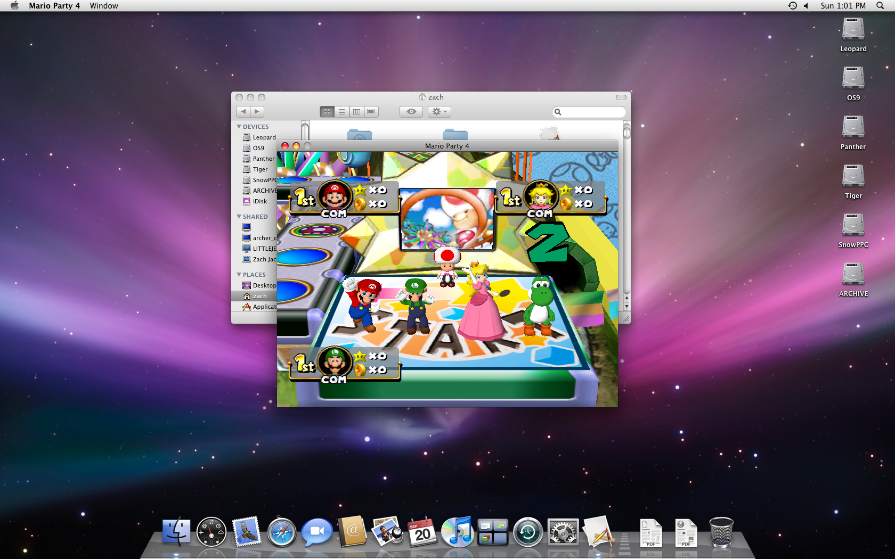

### 42.5 The wall

The board does **not** reach the 30 cap; it reaches 26.6. §32.1's rule is
that a drawn frame is presented every second retrace only when the drawn
frame and the consumed one that pays for it fit two retraces: drawn +
consumed ≤ 33.3 ms. Measured on the final build: **28.5 + 6.7 = 35.2 ms**,
1.9 ms over. (The rate is 26.6 and not 20 because the gate's rule 2 draws
a frame that is up to half a period late — a cycle that overruns by 1.9 ms
is still drawn, the schedule slips by that much, and every few cycles a
third consumed frame takes the slip back: 2, 2, 2, 3.)

The render thread is not the wall: its frame is 15.4 ms, under one
retrace, and the gate waited for it 10 times in 16,000. **The wall is the
game thread's drawn frame, 28.5 ms against a budget of 33.3 − 6.7 =
26.6**, and its parts are now: the game's own logic 11.5 ms, the decode of
the display lists into the ring ~9 (8.9 at `--turbo`, up from 7.95 with
the second core idle), the state walk and the texture binds ~3.2, the
records and `gx_vprog_bind` ~2.4, the list walk and the copies ~2.3.
Nothing in the second half of that list is 1.9 ms; the decode is, and the
decode is what §39.5 argued cannot move a frame later because the game
rewrites its arrays in place. What §39.5 did not consider is a decode that
moves a *thread* over, not a frame: the render thread has 18 ms of every
33 idle, the game's arrays are stable from the draw call that names them
until the game's *next* frame rewrites them (the skinning and the sprite
rebuilds run in the game's logic, before its draws), so a record that
says "decode this list into ring offset X" replayed by the render thread
before it issues the draw reads memory nobody is writing — provided the
game's next frame does not start until the render thread has finished
*decoding* (not drawing) the current one. That is a join on the decode
position at the retrace, and its cost is the render thread's tail beyond
the game thread's frame end: with 15.4 + 9 = 24.4 ms of render thread
against a game thread of 28.5 − 9 = 19.5, the game thread would wait ~5
ms at the retrace and its frame would be ~24.5 ms — under 26.6. That is
one design for M28, on paper; the other lever of the same size is the
game's own 11.5 ms, which only the compiler touches. The character select
(drawn 40 ms, of which the render thread's 25.3 is the long pole: a frame
of 3,000 batches under 30,000 records) has a different wall, the driver's
per-batch cost, and stays at 19.

### 42.6 What M27 shipped, and what it did not

| shipped, with a witness | |
|---|---|
| the design (§42.1), written before the code | |
| the stream and its twins (`gx_rt.h`, `rt.c`): every GL call the port makes recorded by value, uploads owning their texels, names from a counter, reads and the compile as joins, the ring's two fences by epoch, the gate's rule 5, the snapshot's join, the report (`port> render thread:` — records, bytes, frames, replay per frame, the tail, the gate, the ring, every join by name), the status line's `rt N ms` | the three md5s on every stage and every real-time run, 24 walks in all on two machines |
| the four stages (§42.3): inline / joined per frame / overlapped, `--renderthread 0..3` | the table; 377 → 376 → 266 → 255 s |
| the render thread on by default on `cpu 2` (`--renderthread 3`), the inline twin on one core (`1`), the direct path kept (`0`, `--norenderthread`) | §42.4: board **18.4 → 26.6** presented fps, character select 14.5 → 19.2, title 21.0 → 25.8, whole walk 19.1 → 24.8; the single-core cost 0.9 ms a drawn frame |
| the GL context on a pthread under SDL 2.0.3 (§42.1g), on the Radeon 9000 under 10.5 and the MacBook under 10.6 | every threaded run |
| `--rtgate MS`, `--rtsplit`, the `rt` column in `--perfwin` and `--perfdump`, `port/tools/m27_chain.sh`, `port/tools/m27_perfstat.py` | |
| the soak read (§42.2), `docs/soak/m27-*`, `docs/screenshots/m27-*`, witness 0p | |

**Not done, and why:**

* **The 30 cap on the board**: 26.6, the wall is the game thread's drawn
  frame at 28.5 ms against 26.6 (§42.5); the decode on the render thread
  is the next lever and is designed, not built.
* **The board-side resync of soak 17** (retrace 75,120, two seconds after
  a 41 MB snapshot's background write): the reproduction is the cadence
  itself; this soak's `--perf` will put a `stall:` line under it.
* **The results-screen stall** (§38.3) stands as before: 2 of 3
  render-thread walks, 0 of 2 others, the same lottery.
* The M24–M26 leftovers stand: the two mixer timers, the selected box's
  specular, the launcher, causes B–F of §41.8.

### 42.7 What M28 starts with

Left running: `g4 run --soak --com4 --rtc dolphin --freshcard --realtime
--snap-every 5000 --snap-keep 3 --status --ovllog --stuckwatch 200 --perf`
on the final build (`isle` md5 `44152d1f…`), the render thread on (`cpu 2
rt N ms` on every status line) — the first soak of the stream. Read it
first: the `port> render thread:` block (the gate's `busy` count, the ring's
waits, the joins by name, the present tail), `rt` on the status lines
through the minigames (a game whose replay is over a retrace shows there),
the `stall:` lines under any resync, and `tex`/`rss` past turn 12 (the
owned uploads are freed on the render thread; a leak would show as `rss`).
Then §42.5's decode-on-the-render-thread, with the join on the decode
position at the retrace and §39.5's in-place-rewrite argument re-checked
against the sprite path and `EnvelopeProc` before a line is written; the
M26 gallery (`gallery_chain.sh`) on the final build as the picture-level
witness of the stream across all 63 games.

## 43. M28 log: the experiments *(2026-09-20, littlejelly)*

M28's brief is the game side of the wall §42.5 measured: the board
presents 26.6 fps because the game thread's drawn frame (28.5 ms) plus
the consumed frame that pays for it (6.7 ms) is 1.9 ms over two retraces.
Six experiments, each a flag, each A/B'd on the same walk at `--turbo`
(md5s) and `--realtime` (presented fps), kept only if it pays: (a) the
material walk with nothing drawn, (b) the motion curves memoised, (c) the
bone walk's four concats made sparse, (d) the six square roots of
`Hu3DMtxScaleGet` without libm, (e) the compiler on the port's own GX
sources, (f) the sprites' draws with the render thread on, (g) the text
fragment shader. Before any of them, today's profile (§43.2), which is not
§32.4's: the mixer is on the second core, the skinning runs at the draw,
and the consumed frame's shape is the object walk, the motion curves and
the bone walk, in that order.

### 43.1 The soak, read

§42.7's leave-behind — `g4 run --soak --com4 --rtc dolphin --freshcard
--realtime --snap-every 5000 --snap-keep 3 --status --ovllog --stuckwatch
200 --perf` on the M27 build (`44152d1f…`), 12:58 to 14:03 G4 time, ended
through Escape at turn 19's minigame (m418) to free the G4: **65 minutes,
235,140 frames, 3,919 status lines** (`docs/soak/m28-soak18-m27-leave.log.gz`),
the first soak of the stream and the first with `--perf` on.

| | |
|---|---|
| speed / presented fps | **100.1%** mean over 3,919 lines (`cpu 2`, `machine ok` on every one); **26.6 fps** overall, **28.4 on the board** (1,955 board lines; M27's walk measured 26.6 on turn 1) |
| where it got | turn 19 of 20, 26 minigames dealt, **the first 24 the same modules in the same order** as soaks 13–17, then m414, m418 |
| `rt` on the status lines | median **15.5 ms**, p95 26.1, worst 259 (a load); per module: m431 29.9, m444 25.3, the menus 24.3, m401 23.4, m412 23.0, m436 22.8, m414 22.8 — seven games whose replay is over a retrace, the board 15.5 |
| the `render thread:` block | 333M records, 104,481 frames presented, replay mean 15.6 ms; gate: 95,629 drained, **7,752 waited (3.6 s in all, worst 18 ms)**, 167 consumed for a busy thread; ring waits 0; joins: 134 compiles (1.9 s), 1,102 forced frames (1.2 s), 47 snapshots (9 ms); present tail 0.4 ms mean |
| `split frames` / `worker mixer` | 784,721 halves each side, 235,271 joins, **0 position mismatches**; 6 late jobs (10 ms), 164 waited for (73 ms, worst 2.1 ms) |
| resyncs / faults / STUCK / guard hits | **1 / 0 / 0 / 0** — and this time the resync has its `stall:` line (below) |
| audio | 159 underruns / 2.48 s over the hour (soak 17: 159 / 2.45 s), `aud` 0.1–0.4 ms |
| `tex` / `rss` at the end | 794 KB / 40,933 KB budget; **184 MB** (soak 17 ended at 130 MB after 72 min; 184 is a minigame's peak — the line before the results screens reads 138–140 MB through turn 12, so not a leak, but the watch) |
| `REL .data` / `skin: lifetime` / `EFB copies` | 72 re-opens, 52 reset / 624 dropped, 0 guard hits / 94,260 |

**The resync, with its line at last.** `realtime: resync at retrace
89285, 1693 ms behind` — and under it `stall: frame 89280 took 1710 ms
(game 1710 gx 0 present 0 aud 0) [consumed] tex: 0 decoded … frees 0,
dll 0 ms`. It is the results-screen stall of §38.3 / §39.4 / §40.8 (there
at retrace 14,203 on the walk, the first minigame's results; here after
m406, turn 7's game), and the line says what M24 wanted said: **1.71 s of
the game's own logic on one consumed frame** — no texture decode, no free,
no module load, no disc read over 100 ms (`DVD: 0 over 100 ms`), the
mixer idle, at `resultdll`'s exit (`Ovl Return`, the module's unlink
follows). Not the card and not the disc (§39.4 had said so); a loop in
`resultdll` or in the board's return that runs long once in a while. The
named snapshot for it is the chain's `K` run below
(`snaps/lib/m28-results-stall-f014150.snap`, 50 frames before the walk's
retrace 14,203). Next to it, nothing outranks the experiments.

One dip is the lab's, not the port's: frames 139,200–139,320 read 18.7 /
12.2 / 9.5 fps and `speed 87%` — the moment a `cp -R` of the 20 MB bundle
ran on the G4 to keep the M27 build under its own name (g4-witness.md 0q).

### 43.2 Today's profile, before any experiment

Two `sample isle 10` profiles of the M27 build (`44152d1f…`) on the board
at turn 1 (`docs/soak/m28-board-{consumed,drawn}-profile.txt.gz`,
`port/tools/sample_tree.py` reads them: inclusive counts once per sample,
self counts, `--under SYM` for a subtree). The consumed frame is the walk
under `--nodraw --turbo` sampled at frames 8,220–9,060 (6,283 game-thread
samples); the drawn one is a `--ffto 6500 --turbo` teleport sampled at
7,260–7,620 (5,996), the render thread on and replaying on its own thread
(4,751 of its 5,996 samples busy: 3,606 in `replay_upto`, the rest the
waits). A `--nodraw --ffto` run drew past N until this milestone
(fastfwd.c switched the renderer back on whatever `--nodraw` said; fixed,
`nodraw_user`), which is why the consumed profile walks there.

**A consumed board frame** (everything is game; the share is of the
thread's samples):

| | samples | % | inside |
|---|---:|---:|---|
| `Hu3DDraw` — the object walk and the material walk | 1,668 | **26.5%** | `objCall`/`objNull` recursion 142 + 68 self, `ObjCullCheck` 408 (its `C_MTXConcat` 104, `sqrtf` 78), **`FaceDraw` 616** (self 214; `GXSetTevKAlphaSel` 60, `Hu3DLightSet` 56, `GXCallDisplayList` 44, `SetTevStageNoTex` 41, `GXSetChanCtrl` 31, `LoadTexture` 31, `GXSetArray` 21…), the matrix stack's `C_MTXConcat` 184 |
| `Hu3DMotionExec` — the motion curves | 1,307 | **20.8%** | self 648 (the per-object reset loop and the track switch), `GetObjTRXPtr` 231 **+ its dyld stub 91**, `GetCurve` 184 + `GetBezier` 69, `__memcpy` 121 |
| `EnvelopeProc` → the bone walk (`hsf_mtx_sync` → `SetEnvelopMtx`) | 1,002 | **15.9%** | `C_MTXConcat` **316**, `PSMTXRotRad` 359 (`port_sincosf` 339: libm's `sinf`/`cosf` through `cexpf` 240 on the misses, the memo's own 97), `C_MTXRotTrig` 75, `C_MTXTrans` 58, self 76; `hsf_register` 82 (the M19 registry's lookup) |
| `Hu3DDrawPost` | 706 | 11.2% | `particleFunc` 314, `DrawSpaces` 249 |
| `HuSysDoneRender` → `VIWaitForRetrace` | 698 | 11.1% | `port_audio_tick` 566: the mixer's control half 265 (`port_musyx_mix_frame_ctl` 228 self), `snd_handle_irq` 427 |
| `HuSprExec` | 313 | 5.0% | |
| `C_MTXConcat`, all callers | 526 | 8.4% | `SetEnvelopMtx` ~60%, `objCall`'s stack ~18%, `ObjCullCheck` ~10%, `DrawSpaces`, `mtxRotCat` |

**A drawn board frame** (the game thread; the render thread is
elsewhere):

| | samples | % | inside |
|---|---:|---:|---|
| `GXCallDisplayList` — the decode into the ring | 1,994 | **33.3%** | `decode_fast_n2c0t1s0` 750, `n1c0t1s0` 536, `n1c0t0s0` 203, `n1c1t1s0` 106 (26.6% in the four loops), `batch_flush` from inside it 366 |
| `batch_flush` — the state walk, the binds, the records | 1,377 | **23.0%** | `gx_tev_apply` 565, `gx_tex_bind_swapped` 308 (`tex_bind_content_hash_body` 178, the sampled revalidation), `issue_segments` 325 (`gx_vprog_bind` 219; the records), `semaphore_signal_trap` 171 (waking the reader) |
| `SetEnvelopMain` — the skinning, at the draw | 646 | **10.8%** | `PSMTXROMultVecArray` 245, **`Hu3DMtxScaleGet` 216** (`__sqrt` 105 + `sqrtf` 72 → libm's `sqrt` in software, `C_VECNormalize` 94), `C_MTXConcat` 73 |
| `FaceDraw` minus the display list — the material setup | 674 | 11.2% | `LoadTexture` 109 (`GXLoadTexObj` 101), `begin_attr_order` 143, `GXSetChanAmbColor` 82 |
| `Hu3DDrawPost` | 668 | 11.1% | its own `FaceDraw` 351 |
| `Hu3DMotionExec` | 328 | 5.5% | |
| the bone walk (`port_envelope_proc`) | 249 | 4.2% | |
| `HuSprExec` | 271 | 4.5% | |
| `Hu3DExec` self, `port_audio_tick`, the rest | ~500 | 8% | |

**What the two tables order.** On the consumed frame the material walk
(a) is `FaceDraw`'s 616 less the two calls it must keep (`Hu3DLightSet`
56) — up to ~9%; the bone walk's concats and rotation matrices (c) are
`C_MTXConcat` 316 + `C_MTXTrans` 58 + `C_MTXRotTrig` 75 ≈ 7%, of which a
sparse body keeps the arithmetic and drops the loads and stores; the
curves (b) are `GetCurve` + `GetBezier` ≈ 4% plus the 1.4% that is a dyld
stub on a function nobody overrides (`__declspec(weak)` had become
`__attribute__((weak))`; the attribute is gone). On the drawn frame the
game's share is 11.5 ms of 28.5 and the levers in it are the square roots
(d) at 2.4% of the frame (~0.7 ms), the concats at ~3%, the curves at
~1.5%; the decode (33%) and the state walk (23%) are the port's, which
is where (e) aims. So: (a), (c), (b), (d), then (e); (f) and (g) by
reading first (§43.8).
### 43.3 (a) The material walk with nothing drawn — exact, on by default

**What FaceDraw does on a consumed frame.** Frame mode (§32.1) drops
every GX call at the port's door on a consumed frame, but hsfdraw.c's
`FaceDraw` still *decides* each one per material: the blend mode, the
channel colours, `SetupGX` (Z, alpha compare, cull), sixteen
`GXSetTevKAlphaSel`, the vertex descriptor block, `LoadTexture` for every
attribute (a `GXInitTexObj` + `GXLoadTexObj`, a TLUT for the CI formats)
and `HuSprTexLoad` for the reflection, toon, shadow, projection and hilite
maps, then `SetTevStageNoTex` / `SetTevStageTex` — texgens, TEV stages,
konst colours, texture matrices with `MTXScale`/`mtxRotCat` arithmetic
behind them — and `GXCallDisplayList`. §32.4 had it at 449 samples of a
7,200-sample consumed board frame, FaceDraw inclusive.

**What of it game logic reads back.** Everything FaceDraw and its callees
write was read (hsfdraw.c, hsfman.c `lightSet`, hsfanim.c `Hu3DAnimSet`,
sprput.c `HuSprTexLoad`) and grepped for readers in src/game and src/REL:

* hsfdraw.c's statics (`materialBak`, `vtxModeBak`, `shadingBak`,
  `lightBit`, `BmpPtrBak[]`, `texCol[]`, `kColor`/`kColorIdx`, `TL32F`, the
  `*MapNo` slots): each is reset per model (`Hu3DDraw`), per object
  (`ObjDraw`, `Hu3DDrawPost`) or per material before it is read again;
  nothing survives into the next drawn frame's walk.
* `drawCnt`: the caller steps through the faces by
  `DrawData[drawCnt - 1].polyCnt` — kept.
* `totalMatCnt` / `totalTexCnt` / `totalTexCacheCnt` / `totalPolyCnt`:
  copied once a frame into the `*Cnted` twins (hsfman.c:124) and printed by
  the debug overlay (objmain.c:492), read by nothing else. `totalMatCnt`
  and `totalPolyCnt` are kept; the two texture counters are the one thing
  a snapshot can tell apart (a debug-print value).
* **`lightSet` writes game memory**: for a light of type 1 it stores
  `pos = dir * -1e6` into `Hu3DGlobalLight` / `Hu3DLocalLight`, which
  fourteen REL modules touch (m425's own light setter reads `.pos`). The
  write is idempotent in `dir`, but skipping it on a consumed frame would
  leave `pos` stale after a `dir` change until the next drawn frame — so
  `Hu3DLightSet` is called on consumed frames too, under the game's own
  gate (`shading != shadingBak`, which differs between the two SetTevStage
  bodies: `matHiliteF ? 2 : vtxMode` against `vtxMode`), `shadingBak` and
  `lightBit` made extern by the patch so the gate is the game's.
* `Hu3DAnimSet` writes the 2D texture animation's `scale`/`trans` into the
  attribute's `HU3DATTRANIM` (heap), read by `SetTevStageTex` alone, in
  the same FaceDraw after a fresh call — exact for the picture without
  it; kept anyway (a few float divides) so the heap snapshot is identical.
* `constData->matrix`, the hook-model matrices, `MTXBuf`: written by
  `objMesh`, the *object* walk, which is not touched (§33.3's reason).

**The hook** (`port/patches.txt`, hsfdraw.c; `port/src/gx/gx_matwalk.c`):
FaceDraw asks `port_consumed_frame()` once the material is known and, on
a consumed frame, does only the material-change bookkeeping,
`port_face_consumed()` (the two side effects above, in the game's order),
`drawCnt++`, return. `--nomatwalk` runs FaceDraw as written. The
`GXCallDisplayList` was already a no-op on consumed frames; what goes is
the state walk and the texture loads (with `--predecode` off by default
since M24, nothing was staged from them).

### 43.4 (b) The motion curves, memoised — exact, and measured

`GetCurve` (hsfmotion.c) evaluates a track at a time: `GetLinear` or
`GetBezier`, a segment search over the keyframes and the interpolation.
The keyframes never change between a motion's load and its free; the one
field `GetBezier` writes, `start`, is the segment it found, read back as
where to look first. So the value and the `start` written are a function
of (track, time, `start` on entry), and `port/src/os/curve_memo.c` is a
direct-mapped table of 65,536 entries keyed on exactly that, holding the
value's bits and the `start` on exit: a hit returns the bits `GetLinear` /
`GetBezier` computed on the same inputs and writes back the same `start`.
The address-reuse hole — a motion freed and another loaded at the same
place — is closed the way M19 closed the skinning registry's: every free
the game makes reaches `port_mem_freed`, which bumps a generation per 4 KB
page of the block; an entry remembers its page's generation and a hit
needs it unchanged. `--nocurvememo` is the game's body every call. Found
next to it: `GetObjTRXPtr` and `GetBezier` were `__declspec(weak)` in the
decomp, which the mirror had turned into `__attribute__((weak))`, and on
Darwin a weak definition is called through the dyld stub even from its
own file — `dyld_stub_GetObjTRXPtr` was 91 samples (1.4%) of the consumed
frame on its own. Nothing in src/ defines either name twice; the attribute
is gone from the patch and the calls are direct (exact by construction; in
every arm below, control included).

### 43.5 (c) The four concats of the bone walk, sparse — exact, with the sign rule

`SetEnvelopMtx` builds a bone as `parent · T(pos) · Rz · Ry · Rx` with four
general 3×4 concats, loading twelve elements of a right-hand matrix that is
nine literals and three values, after `PSMTXRotTrig` stored those twelve.
§32.4's claim that skipping the zero terms is exact "because a fused
`a·0 + b` is `b`" is true of the value and false of the sign of zero, and
the port's md5s are bits, so the sparse bodies (psmtx_c.c
`port_mtx_concat_trans` / `port_mtx_concat_rot`) are built from the order
GCC actually compiled `C_MTXConcat` in (read off `mtx.o` with otool:
`m[i][j] = fmadds(a[i][2], b[2][j], fmadds(a[i][0], b[0][j], a[i][1]*b[1][j]))`,
`+ a[i][3]` for the last column) and three facts about a fused
multiply-add: `x · 0` is a zero with `x`'s sign; `fma(x, 0, t)` is `t`
unless `t` is a zero, and then `−0` only if both are; `fma(x, 1, t)` with
`t` a zero is `x` under the same rule. A literal term is therefore one
sign bit, a chain of them an AND of sign bits that matters only when the
surviving value is a zero; the real products (the sines, cosines, the
translation) stay real fmas on the same operands in the same order, a
signed zero reaching one as an addend passed as the zero it is. Inf and
NaN entries are the one input the rule is not exact for (`inf · 0`), and a
bone matrix holding either is already a broken picture. The witness is
`port/tests/mtx_test.c` on the G4: 1.6 million concats against
`C_MTXConcat` over random matrices seeded one element in four with a zero
of either sign, plus underflowing products, in place and out — **0
differ** — and the walk's md5s. `--nosparsemtx` runs `PSMTXRotRad` +
`PSMTXConcat` inside the same calls.

### 43.6 (d) The square root without libm — exact after all

The brief expected an md5 argument: `frsqrte` plus two Newton steps is not
libm's value, and `Hu3DMtxScaleGet`'s `!= 1.0f` tests would flip on an
edge. It does not have to be approximate. The 7450 has no `fsqrt` but has
`frsqrte` (5 bits) and a full-speed double FPU: four Newton steps in
double take the estimate past the double's own precision, the product
with `x` is the root to a double ulp, one correction step through a fused
residual lands within a double ulp of the true root, and rounding *that*
to single is the correctly rounded `sqrtf` — the exact root of a 24-bit
float is never within 2⁻⁵⁰ (relative) of a single-precision rounding
boundary (the 2p+2 bound), and a double ulp is 2⁻⁵². Rather than lean on
the bound, `port_sqrtf` settles the rounding exactly: the root is on `f`'s
side of both of `f`'s midpoints iff `f` is right, and a midpoint (25
significant bits) squares exactly in a double, as does the comparison with
`x`; a midpoint's square is never `x` itself (an odd 25-bit mantissa
squared has 49 bits), so there are no ties. Zero, negatives, NaN, inf and
the denormals go to libm. The value is libm's if libm's `sqrtf` is itself
correctly rounded, which IEEE 754 requires and the test settles the only
way that counts: every positive normal float, all 2,130,706,432 of them,
through both. On littlejelly against glibc: 0 differ (7.6 min). On the
G4 against Leopard's libm: **§43.9**. `C_VECMag`, `C_VECNormalize` and
`C_VECDistance` (psmtx_c.c, the port's bodies) call it; `--nofastsqrt` is
libm for everything.

### 43.7 (e) The compiler on the port's own GX sources

`GX_OPT` in port/Makefile applies to `src/gx/*.o` alone — the decode
loops, the state walk, the texture decode, the stream — never to the
game's objects or the mixer. Two trees beside the default:
`build-ppc-o3` (`GX_OPT=-O3`) and `build-ppc-fast` (`-O3 -ffast-math`),
bundled as `~/MarioParty4-o3.app` / `~/MarioParty4-fast.app` on the G4.
`-O3` changes no float semantics, so its md5s must hold and the walk is
the whole argument; `-ffast-math` changes them (the CPU transform's
contractions, the reciprocal in the texgen divide, the lighting fold's
associativity) and can only ship on a ppmdiff of its frames. Both walks
carry the four experiments at their defaults. Numbers in §43.9.

### 43.8 (f) and (g), by reading before building

**(f) The sprites.** §37.2 counted 2.4M of the walk's 2.81M GL draws as
single-strip sprite quads. The question the brief asks first — is the
issue still the wall with the render thread on — §42.5 and soak 18 answer
for the board: the render thread replays a board frame in 15.5 ms
(median over the soak) and the gate waited for it 7,752 times in 104,481
presented frames (3.6 s in all); the wall is the game thread's 28.5 ms. So
on the board a sprite batch would move cost off a thread that is idle
half the time. Where it is *not* idle is the character select (rt 25.3
ms, §42.4) and the seven minigames whose `rt` runs over a retrace
(§43.1: m431 29.9, m444 25.3, the menus 24.3…). And "same-texture
consecutive sprites into one draw" is a thing the tree already has:
sprput.c's `HuSprDisp` loads one texture and one position matrix per
sprite, so two neighbours with the same texture differ in the matrix
alone, which is exactly M22's lazy flush + pre-transform (`--lazyflush
--premerge-max N`, §37.2: exact for a merge of ≤32 vertices; not faster
then, on the single-threaded path). The A/B for (f) is therefore that
lever again, on the render-thread build, at real time (`Rm`, `Tm` in the
chain): if fewer batches now move the character select or the game
thread's drawn frame, sprites are worth their own batcher; if not, the
verdict of §37.2 stands with the thread on. §43.9.

**(g) `GL_ATI_text_fragment_shader`.** The brief's condition was M26's
gallery listing games that need the register-write shapes it would
serve (§31.3's 5,733 emissions still folding a write to PREV, the tinted
overlay of §37.6). The gallery's open causes (§41.8) are B water and EFB
copies with `GX_TG_POS` texgens and `GXSetTevIndWarp`, C whole scenes
missing through the per-camera scissor/viewport, D a copy in m430's right
view, E two faults, F the unverified — none is a TEV register shape. The
walk's report reads `0 stage emissions still folding a register write to
PREV`; soak 18's, over 26 minigames, reads 16,526 of 3.6M unit emissions
(0.5%, in games the gallery marked ok or minor), and the two-constant
stage (`the first wins`) 895,574 of 22.4M draws in 139,945 configs. No
game in the gallery's fault list is waiting on either; not built, the
count kept for the day one is.

### 43.9 The A/B, every experiment on the same walk

`port/tools/m28_chain.sh` on the G4 as the console runner's job: one
binary (`0f5b2935…`, every experiment behind a flag), the M27 chain's
`COMMON` (`--gxsplit`, the three `--dumpframe`s, the three `--perfwin`s),
three modes — **N** the 9,000-frame walk under `--nodraw --turbo` (the
consumed frame's own cost, nothing else in it), **T** the same walk drawn
at `--turbo` (the three md5s, the drawn frame), **R** the 16,000-frame
`--soak --realtime` walk (presented fps; `consumed` and `drawn` are the
game thread's medians by `m27_perfstat.py`) — and six arms: `0` every
experiment off (the control: the M27 code plus the weak-attribute fix),
`a` `b` `c` `d` one on, `5` all on. Every run 90 s or more after the
install, one after another (`docs/soak/m28-walk-*.log.gz`,
`~/m28/index.txt`).

**Exactness first.** Frames 800 / 3000 / 7000 are `0b58c5ee` /
`c58a046d` / `021d58fb` — M27's three references — in **every** T and R
arm, all twelve. The `.wav` of the walk under `--nodraw` (the S arms, one
binary, the runtime flags) is `4e7e3e29…` with everything on and with
everything off. And the picture-history witness for (a), the W arms —
seventeen frames forced drawn at real time, each after a different run of
consumed frames (`--dumpframe 800,1500,…,15500`) — gives sixteen of
seventeen byte-identical between the arms; the seventeenth, frame 9,500,
differs by 8.5% of its pixels along the edges of a *ghost*
(`screenshots/m28-f9500-crossfade-W0-W5-diff.png`): it is inside the
board turn's 30-frame crossfade, whose source is an EFB copy taken on a
consumed frame from the front buffer — "one drawn frame stale, and what
the player is looking at" (gx_tex.c, §39b) — so which drawn frame it
shows depends on the gate's timing in that run, not on any flag. The
same arm run twice differs there the same way (`W0b`, below).

**The consumed board frame** (N arms, `--nodraw --turbo`, ms per frame,
the board window; `game` in brackets):

| arm | title (700–870) | character select (2600–3600) | **board (6000–8900)** | vs control |
|---|---:|---:|---:|---:|
| `0` control | 1.43 (1.37) | 4.35 (3.95) | **6.21 (5.84)** | |
| `a` the material walk skipped | **0.94 (0.87)** | **3.76 (3.36)** | **5.64 (5.26)** | **−0.57 ms, −9.2%** |
| `b` the curve memo | 1.42 (1.35) | 4.35 (3.95) | 6.34 (5.96) | **+0.13 ms** (58.0% hit, 139 stale) |
| `c` the sparse concats | 1.39 (1.32) | 4.29 (3.88) | 6.11 (5.74) | −0.10 ms, −1.6% |
| `5` all four | 1.09 (1.02) | 3.83 (3.41) | 5.70 (5.32) | −0.51 ms |

**The drawn board frame at `--turbo`** (T arms, the game thread's `game` /
`gx` ms per frame; `rt` the render thread's replay):

| arm | title | character select | **board** | frame 800 / 3000 / 7000 |
|---|---:|---:|---:|---|
| `0` | 33.56 (3.74 / 28.97) | 40.31 (10.37 / 29.16) | **28.86 (12.06 / 16.08)**, rt 14.9 | identical |
| `a` | 33.26 (3.84 / 28.56) | 38.86 (10.17 / 27.92) | 28.31 (11.93 / 15.67) | identical |
| `b` | 33.09 (3.73 / 28.47) | 38.93 (10.20 / 27.95) | 28.91 (**12.48** / 15.71) | identical |
| `c` | 33.04 (3.71 / 28.44) | 38.98 (10.14 / 28.06) | 28.14 (**11.77** / 15.66) | identical |
| `d` | 34.53 (3.73 / 29.91) | 38.72 (10.08 / 27.86) | 28.27 (**11.86** / 15.70) | identical |
| `5` | 33.53 (3.84 / 28.83) | 39.26 (10.23 / 28.24) | 28.77 (11.99 / 16.06) | identical |

**Real time, the table the milestone is judged by** (R arms, medians;
`presented` is the number):

| arm | board: consumed (game) | drawn (game / gx / rt) | **presented** | character select: consumed | drawn | **presented** | title: presented |
|---|---:|---:|---:|---:|---:|---:|---:|
| `0` control | 6.72 (6.34) | 28.5 (11.5 / 16.4 / 15.4) | **26.72** | 4.60 (4.20) | 39.5 (12.1 / 26.6 / 25.3) | 19.76 | 25.24 |
| `a` | **6.11 (5.72)** | 28.5 (11.5 / 16.4 / 15.3) | **27.17** | **4.13 (3.72)** | 39.7 | 19.97 | 24.06 |
| `b` | 6.85 (6.47) | 28.7 (11.6 / 16.4 / 15.4) | 26.45 | 4.70 (4.29) | 40.0 | 19.40 | 25.45 |
| `c` | 6.64 (6.26) | 28.5 (11.4 / 16.4 / 15.5) | 26.90 | 4.64 (4.24) | 39.6 | 19.77 | 25.45 |
| `d` | 6.75 (6.35) | **28.3 (11.3** / 16.2 / 15.3) | 26.37 | 4.65 (4.22) | 39.8 | 19.76 | 25.24 |
| **`5` all four** | **6.08 (5.69)** | 28.6 (11.5 / 16.4 / 15.4) | **27.01** | **4.11 (3.69)** | 39.6 | **19.97** | 25.48 |

(M27's three render-thread runs read 26.64 / 26.68 / 26.54 on the board,
so a run is good to ±0.1 fps there; the title's window is 72 drawn frames
and swings ±1.)

**Reading it.**

* **(a) pays, and it is the whole gain**: the consumed board frame loses
  0.6 ms (9%), the character select's 0.5 (11%), the title's a third; the
  board presents 27.2 against 26.7. Its side effects are counted
  (`1,092,846 Hu3DLightSet, 1,898 Hu3DAnimSet kept` over the walk) and its
  exactness is the twelve md5s, the `.wav` and the seventeen frames.
* **(b) loses**: +0.13 ms on the consumed frame, +0.4 on the drawn one
  at `--turbo`, 26.45 presented. The memo hits 58–65% of the calls, and
  `GetCurve` + `GetBezier` were 4% of the frame — a hit saves a few
  dozen cycles of segment search and a miss pays the probe, the page
  lookup and the store on top of the search, and the `Hu3DMotionExec`
  cost that the profile put at 21% is the function's own loop and
  `GetObjTRXPtr`, not the curves. Off (`--curvememo` turns it on), with
  the numbers; the direct calls it found on the way stay.
* **(c) pays a little**, exactly: −0.1 ms consumed, −0.3 ms on the drawn
  frame's game at `--turbo`, 26.9 presented. On.
* **(d)**: −0.2 ms on the drawn frame's game (11.5 → 11.3); the presented
  number (26.37) is one run against 26.72 and the all-on arm (27.01)
  carries it. On, once §43.10's test says libm's value is its value.
* The drawn frame's `gx` (16.4) and `rt` (15.4) do not move in any arm —
  none of the four touches the port's own cost, which is what (e) is for.
* Speed 99.9%, **0 resyncs** and 69–72 underruns (~1.05 s, the scene
  loads) on every one of the eight real-time arms — the results-screen
  lottery did not fire in any of them today (the `K` run's frame-14,198
  stall was 505 ms, under the resync line).

### 43.10 (d), (e), (f): the tests and the verdicts

**(d) is exact and exactly as fast as libm.** `~/mtx_test_m28 --sqrt-all 3`
on the G4 (the chain's `Q3`, 322 s): every third positive normal float,
**710,235,489 inputs, 0 differ** between `port_sqrtf` and Leopard's
`sqrtf` — so Apple's is correctly rounded and the frsqrte path lands on
its value (littlejelly had said the same of glibc over all 2.13 billion,
§43.6). And the ten-million-call chained bench in the same binary:
`port_sqrtf` 2,370 ms, libm 2,360 ms — **237 ns a call either way**.
Leopard's `sqrtf` on a 7450 is already a reciprocal-estimate-and-Newton
routine of the same depth; the port's version does not get a shorter
chain, only a proof. The walk agreed to within its noise (Td −0.2 ms on
the drawn frame's game, Rd 26.37 presented against 26.72). Off by
default, kept as `--fastsqrt` with its test; the sparse-concat bench in
the same run says (c) is worth 8% of a bone walk (2M bones: 3,340 ms
sparse, 3,620 general), which is the −0.1 ms above.

**(e) The compiler buys nothing on the GX sources.** Both trees hold the
three md5s at `--turbo` and `--realtime` — `-ffast-math` included, which
says the port's CPU float paths are not on those three frames' pixels
(the vertex program does the transform; the decode is integer) — and
neither moves the frame:

| bundle | T: board (game / gx) | charsel | R: board consumed / drawn (gx) / **presented** | charsel presented |
|---|---:|---:|---:|---:|
| default `-O2` (T5 / R5) | 28.77 (11.99 / 16.06) | 39.26 | 6.08 / 28.6 (16.4) / **27.01** | 19.97 |
| `-O3` (O3T / O3R) | 28.53 (11.92 / 15.91) | 39.70 | 6.06 / 28.7 (16.6) / 27.10 | 19.24 |
| `-O3 -ffast-math` (FT / FR) | 28.70 (11.97 / 16.02) | 38.85 | 6.06 / 28.8 (16.6) / 27.07 | 19.59 |

`--gxsplit`'s decode region: 8.88 / 8.76 / 8.73 ms a drawn frame. The
decode loops are load-bound (§32.3's byte tables), and a compiler flag
does not move a load. The trees stay buildable (`GX_OPT=`), the default
stays `-O2`.

**(f) Fewer batches do not move the render thread either.** `Rm` / `Tm`
(`--lazyflush --premerge-max 256 --submitstats`, §37.2's lever, the
render thread on): 1,761,383 batches for the walk against 1,941,408
(158,123 objects merged, 9% fewer batches, 2.4% fewer GL draws), and the
character select's replay is **25.3 ms in both** (Rm 25.3, R5 25.2), its
presented fps 19.35 against 19.97, the board 26.82 against 27.01, the
turbo board frame 29.43 against 28.77 — slower, as in M22, and frame 7000
moves (`1d5ef538`, the merged board objects' rounding, as §37.2 found).
So with the thread on, the per-batch cost it pays is not the count of
batches but the driver's per-draw work inside them (§36.3's
`gldUpdateDispatch`, unchanged by a merge that keeps the draw calls), and
a sprite batcher of the brief's shape — consecutive same-texture quads
into one draw — would have to cut *draw calls*, which is what M22's merge
does for contiguous same-type segments and what bought 2.4% here. Off;
the numbers are the record.

### 43.11 The snapdiff, and the seventeenth frame

The S arms (`--nodraw --turbo --frames 8200 --snap-at 8100 --wav`, one
binary, the four flags off against on): the `.wav` of the 8,200 frames is
`4532b0ff…` both ways (and `4e7e3e29…` both ways for the 8,101-frame
first attempt, whose snapshot the `--frames` exit pre-empted: `--snap-at
N` wants `--frames` past N + the write). The status lines' game state —
module, board, turn, minigame, the four players' coins and stars, every
60 frames — is byte-identical between the arms in all three modes
(`md5` of the lines with the timing columns stripped: N, S and R alike).
`snapdiff.py --spans=80` on the two frame-8,100 snapshots, every span
named (`nm` for hsfdraw.c's statics, the new `port/tools/heapwho.py` for
the heap — it walks the five HuMem heaps' block chains in the snapshot
and names the block under every differing byte):

| section | bytes | what |
|---|---:|---|
| gdata `0014ff0b..17` | 13 | `totalTexCnt`, `totalTexCnted`, `totalTexCacheCnt(ed)` — the two texture counters the walk no longer increments (§43.3: a debug-print value) |
| gdata `001c4938..4d`, `001c4db8` | 22 + 7 | `kColor`, `projectionMapNo`, `toonMapNo`, `shadowMapNo`, `hiliteMapNo`, `reflectionMapNo`, `texCol[]` — hsfdraw.c's own material-walk statics, each reset before its next read |
| `reg gx.state` | 165 | the port's GX shadow: the setters the last consumed frame did not run (the next drawn frame's walk sets every one before a draw — the twelve md5s) |
| `reg card.slot-a` | 6 | the save's directory time stamps and their checksums (wall clock) |
| MEM1 | 3,294 in 253 spans | **every one inside a HuPrc process block** (9 live, 4 freed: the `HuMemHeapInit` sub-heap and the `FAKE_RETADDR` process header at each block's start say so), in the stack area below `base_sp` and in the jump buffer's saved registers — no model, no HSF, no track, no game global outside hsfdraw.c |
| stack (the host's) | 911 in 49 spans | `FaceDraw`'s frames, not written |

Two control runs of the *same* arm (`S0` against `S0b`) differ in 72
bytes in 7 of those same 13 process blocks and in `card.slot-a`: the
residue class §33.3 met (coroutine stacks below their live frames, saved
registers), which the mixer's worker join moves even with nothing else
changed. So the material walk's absence reaches nothing the game reads:
that is the `.wav` (the 3D sounds' positions), the state trace, the
twelve md5s, and sixteen of the seventeen real-time frames.

**The seventeenth.** `W0b` (the control arm again) reproduces `W0` at all
seventeen frames, 9,500 included (`3b4c611d`); `W5b` reproduces `W5`
(`c66ef240`). So the ghost is not noise: it is a function of the arm.
What it is a function of is the gate's schedule — the crossfade's source
is an EFB copy taken on a consumed frame from the front buffer, i.e.
from whichever frame the gate last drew, and a consumed frame 0.6 ms
cheaper moves that choice (§32.1's rule 2 draws a late frame or not by
the millisecond). `Wb` — the curve memo alone, which changes no picture
(every T frame identical) and no game state, only the consumed frame's
cost by +0.13 ms — reads `3b4c611d`, the control's; and the perf CSVs
say why the two ghosts differ where they do: in the forty frames before
9,500 the control arm's gate falls off its cadence (drawn 9457, 9460,
9464, 9468, 9473, 9475, 9477, 9481, 9483, 9486, 9488, 9490, 9492, 9497,
9499 — every third or fourth frame through the turn's start, the heavy
stretch) while the all-on arm holds every second frame (9457, 9459,
9461, … 9499). The crossfade's copy lands in that stretch and takes
whichever frame was drawn last; the 0.6 ms is what keeps the gate on its
two-cadence there. Not a picture fault: the schedule's, by design (§39.3's
copy from the front buffer on a consumed frame), and the very thing the
milestone is for.

### 43.12 What M28 shipped, and what it did not

The final build (`04a6764f…`) has (a) and (c) on, (b) and (d) off, the
direct calls, `--nodraw` surviving `--ffto`; its own turbo walk holds
the three md5s (`0b58c5ee` / `c58a046d` / `021d58fb`; board 28.65 ms,
game 11.93 / gx 16.01) and its real-time walk reads board consumed
**6.06** ms, drawn 28.6 (11.5 / 16.4 / rt 15.4), **27.01 presented**;
character select 4.10 / 39.9 / **19.56**; title **25.46**
(`docs/soak/m28-walk-{T5,R5}.log.gz` are these final-build runs, the
last two lines of `m28-chain-index.txt.gz`; §43.9's `5` arm was the same
flags on the flag build an hour earlier and reads the same to a tenth).

| shipped, with a witness | |
|---|---|
| **(a) the material walk skipped on consumed frames** (§43.3, gx_matwalk.c, `--nomatwalk`), with `Hu3DLightSet` and `Hu3DAnimSet` kept under the game's gates | consumed board frame 6.72 → 6.11 ms at real time, the character select's 4.60 → 4.13, the title's 2.07 → 1.49; board **26.7 → 27.2 presented**; twelve md5s, the `.wav`, the state trace, the snapshot's spans named (§43.11), sixteen of seventeen real-time frames and the seventeenth explained |
| **(c) the bone walk's four concats sparse** (§43.5, psmtx_c.c, `--nosparsemtx`) | 1.6M concats bit-exact against `C_MTXConcat` on the G4; 8% of a bone walk; −0.1 ms consumed, −0.3 ms drawn game at `--turbo` |
| the direct `GetObjTRXPtr` / `GetBezier` (§43.4) | 1.4% of a consumed frame was a dyld stub |
| **(b) the curve memo**, built, exact, **off** (§43.4, curve_memo.c, `--curvememo`) | +0.13 ms consumed, +0.4 drawn; 58–65% hit; the page-generation lifetime (1,018 stale hits refused over a walk) |
| **(d) `port_sqrtf`**, built, **proven exact**, as fast as libm, **off** (§43.6, §43.10, `--fastsqrt`) | 710,235,489 floats on the G4, 2.13 billion on littlejelly, 0 differ; 237 ns a call both ways |
| **(e)** `GX_OPT` (§43.7, §43.10): `-O3` and `-O3 -ffast-math` on the GX sources, both md5-exact on the walk, neither faster | the two trees; default `-O2` |
| **(f)** the batch merge with the render thread on (§43.10): 9% fewer batches, the character select's replay 25.3 ms either way; **(g)** not built, by the gallery's list (§43.8) | `Rm`/`Tm`; the `tev:` counts |
| the profile of the consumed and drawn board frames on the M27 build (§43.2), `port/tools/sample_tree.py`, `port/tools/heapwho.py`, `port/tools/m28_chain.sh`, `port/tests/mtx_test.c`'s bit-for-bit checks and benches, `--nodraw --ffto` fixed | |
| soak 18 read (§43.1), the results-screen stall's `stall:` line at last, its teleport `snaps/lib/m28-results-stall-f014150.snap` (the final build), `docs/soak/m28-*`, `docs/screenshots/m28-*`, witness 0q | |

**Not done, and why:**

* **The 30 cap on the board.** 27.2 presented: the game thread's drawn
  frame is still 28.5 ms against a budget that (a) widened from 26.6 to
  27.2 (33.3 − 6.1). The game's own share of the drawn frame is 11.5 ms
  and the four experiments moved it 0.2–0.3; the rest of that frame is
  the port's decode (8.9 ms, §43.2's 33%) and state walk (23%), which no
  compiler flag touched (§43.10) — §42.5's decode-on-the-render-thread is
  still the lever of that size, and it is still on paper.
* **The results-screen stall** (§43.1): 1.71 s of game logic on one
  consumed frame at `resultdll`'s exit, no disc, no free, no module load;
  the teleport is a `--restore` of the snapshot above with `--realtime
  --perf` and a `sample` armed for frame 14,198 (it fired at 505 ms in
  the `K` run, 1.7 s in the soak: the lottery is in the game's own loop).
* **`Hu3DMotionExec`'s 21%** of the consumed frame is the function's own
  per-object reset loop and track switch, not the curves — a memo cannot
  touch it; only a patch that skips the reset for objects no track moves
  could, and that is a game-behaviour question for a snapdiff of its own.
* **`hsf_register`** (M19's registry lookup) is 82 samples (1.3%) of a
  consumed frame — a linear scan per `EnvelopeProc`; a hash would take it
  to nothing.
* The M24–M27 leftovers stand: the two mixer timers, the selected box's
  specular, the launcher, causes B–F of §41.8.

The board at real time on the final build, the soak's first turn
(`screenshots/m28-board-realtime-final.png`; its status line read
`speed 100%  29.9 fps presented … rt 12.2 ms` at frame 9,240):

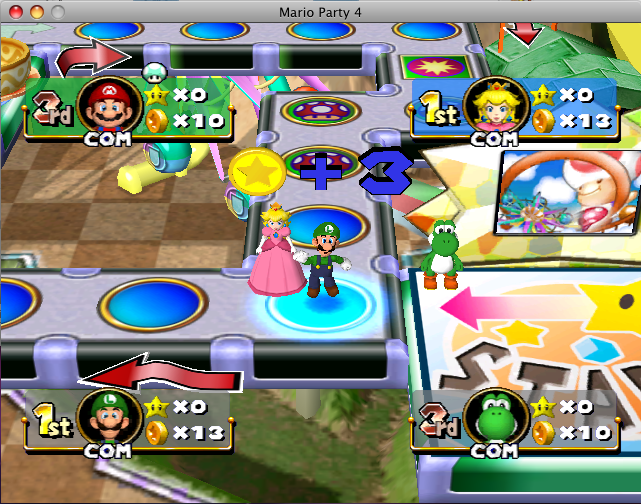

### 43.13 What M29 starts with

Left running: `g4 run --soak --com4 --rtc dolphin --freshcard --realtime
--snap-every 5000 --snap-keep 3 --status --ovllog --stuckwatch 200 --perf`
on the final build (`04a6764f…`), (a) and (c) on. Read it as §42.7 says
(the `render thread:` block, `rt` through the minigames, `stall:` under
any resync, `tex`/`rss` past turn 12 — soak 18 ended at 184 MB in a
minigame against soak 17's 130 at the mode select; a leak would show as
a monotone `rss` on the board lines). Then the decode on the render
thread (§42.5), with §39.5's in-place-rewrite argument re-checked against
the sprite path and `EnvelopeProc` before a line is written; the
results-screen stall from its snapshot; and the gallery on the final
build as the picture witness of (a) across all 63 games (`gallery_chain.sh`).

## 44. M29 log: the decode on the render thread *(2026-09-20, littlejelly)*

M29's brief is the last 1.3 ms: the board presents 27.0 fps because the
game thread's drawn frame (28.6 ms) plus the consumed frame that pays for
it (6.06) is 1.3 ms over two retraces (§43.12). The decode of the display
lists into the vertex ring is 8.9 ms of that drawn frame, and §42.5 said
where it could go: not a frame later (§39.5: the game rewrites its arrays
in place) but a *thread* over, onto the render thread, which has 18 ms of
every 33 idle. What follows is the ordering argument that design owes
before a line is written, then the build in stages, each held to the
three md5s.

### 44.1 The ordering argument, written before the code

**What the decode reads.** A display-list primitive is `count` vertices of
`GX_INDEX16` indices (two bytes per attribute per vertex) into the arrays
`GXSetArray` named: for an HSF model, `mesh.vertex->data`,
`mesh.normal->data`, `mesh.color->data`, `mesh.st->data`
(hsfdraw.c:508–601); for a particle, `particleP->vtxBuf` and the
particle data (hsfanim.c:808–817); for a minigame's own geometry, its
module's buffers (24 call sites in 22 RELs). The list bytes themselves
(`DLBufStartP + dlOfs` for a model: file data; `particleP->dlBuf`; a
module's recorded list). The port's own inputs are the plan
(`build_decode_plan`: the array base and stride per step, the op, the
byte table — an append-only static, §32.3 — the scale, the destination
offset) and the register material colour when it wins. Nothing else: no
`gx.*` state, no matrix, no texture.

**What the decode writes.** The ring (`src_buf + run_pos`, `count ×
stride` bytes — the render thread's own DMA range, §42.1c) and, on the
game thread, three things the *next* primitive may read: `pending.tex`
from the last vertex (`plan_back`), the `to_pending` steps' last values
(an attribute the layout has no slot for), and `nverts`/the list pointer
(how far the list advanced). None of those needs the decoded vertices:
the count of vertices a run decodes is a function of `count`, the bytes
left in the list and the plan's bytes-per-vertex; the `pending` values
are the last vertex's alone, so the game thread decodes *that one
vertex* into a scratch and leaves the other `count − 1` to the render
thread. Exact by construction, and the md5s are the witness.

**When the game rewrites what the decode reads.** The frame is
`HuPrcCall` (the game's logic) → `Hu3DExec` (the draws) →
`HuSysDoneRender` → `VIWaitForRetrace` (main.c:84–113). Inside
`Hu3DExec` the writes and the draws interleave *per model*: for each
camera, each layer, each model in turn — motion exec, `InitVtxParm`
(writes a flag only), `ShapeProc` (rewrites `mesh.vertex->data` of a
shape-animated mesh), `ClusterProc` (the same for a cluster mesh),
`EnvelopeProc` (the skinning: rewrites `mesh.vertex->data` and
`mesh.normal->data` of every skinned mesh) — then `Hu3DDraw` of that
model (hsfman.c:200–256); the shadow pass does the same for its models
first (hsfman.c:1950–1990, `HU3D_ATTR_MOT_EXEC` keeps the main loop from
doing it twice). So a model's arrays are written once per frame, before
its draws, and are stable from its first draw until the game's next
frame — **except** for a `HU3D_ATTR_HOOK` child (a held item), which is
drawn inside its parent's object walk (hsfdraw.c objMesh → the hooked
model) *before* its own iteration of the loop runs its motion block, and
so is rewritten after a draw in the same frame; and for whatever a
module's process does to its own buffers, which is game logic before
`Hu3DExec` and so before the draw. M18 changed one of these writers:
in the default mode `EnvelopeProc` only marks the HSF dirty
(`port_envelope_proc`), and the body runs at the *draw* — `port_envelope_sync`
in objMesh, or `gx_skin_array_bound` at `GXSetArray` for the hooked
child — which is port code; `--cpuskin` runs the game's body at
`EnvelopeProc` itself.

**The rule.** A decode record emitted at stream position P reads memory
that must not change until the render thread has executed P. The
writers, and what orders each:

1. *The game's next frame* (everything `HuPrcCall` and `Hu3DExec` do at
   N+1): a **join on the decode position at the top of
   `VIWaitForRetrace`** — the game thread waits until the render thread's
   decode cursor has passed every record of frame N. That is before the
   retrace's sleep, so it costs only what exceeds the slack.
2. *The skin body at the draw* (`hsf_run_body`, deferred mode): a **join
   on the decode position before the body runs**. In the common case the
   body runs before the model's records exist and the wait is nil; for
   the hooked child drawn twice (the shadow pass, then the main pass
   after its own mark) the second body waits for the first draw's
   decodes, which the render thread has long done.
3. *`EnvelopeProc`'s own body under `--cpuskin`*: the same join at
   `port_envelope_proc` before it returns 0.
4. *`ShapeProc` and `ClusterProc`*: two new exact-text patches
   (port/patches.txt) call `port_vtx_rewrite()` at their heads — the same
   join. Both are called only from the motion blocks above and from
   `Hu3DMotionCalc`, all before the model's draw except for the hooked
   child.
5. *The CPU vertex path* (`finish_vertices`, when the card refuses a
   variant or under `--cpuxf`): it reads the ring on the game thread, so
   `draw_apply` joins the decode position before it. 0 draws of the walk,
   15 variants over a soak (§43.10's report).
6. *The ring's reuse*: unchanged — `rt_ring_enter` waits on the game
   thread, before the record is emitted, for the *replay* past the
   chunk's last use and the GPU's fence; a decode record that exists
   already stands past both.
7. *Immediate mode* (`GXBegin`/`GXEnd`) decodes on the game thread into
   its own ring bytes; the two threads write disjoint bytes of one buffer
   and the `glFlushVertexArrayRangeAPPLE` record that covers the batch
   replays after both.

Every join is "the render thread's decode cursor past position P",
counted by name and timed, and the join at the retrace is the only one
on every frame's path.

**The render thread's schedule.** If the render thread executed decode
records in stream order between the draws, the decode of frame N would
finish only when the *replay* of frame N did — 15.4 + 8.9 ≈ 24 ms of
work that cannot start before the first draw record — and the retrace
join would hand the game thread a tail of several milliseconds (§42.5's
"~5 ms"). So the render thread keeps **two cursors**: a decode cursor
that runs ahead through every published record and executes the decodes
as soon as they exist, and the replay cursor behind it that skips the
decodes already done. The decode has priority. Then the decode of frame
N finishes a record after the game thread emits its last list, the join
at the retrace waits for one primitive at most, and the replay's tail
(the GL issue the render thread has not reached) runs on into the
consumed frame, where the gate (§42.1d) already waits for it.

**What it costs if the decode is late.** The game thread waits at the
retrace; `join decode (retrace)` counts it and the `--perf` frame shows
it as `game` time. If the render thread cannot keep up — a scene whose
replay plus decode is over two retraces — the drawn frame grows by the
wait and the walk says so; the brief's rule is to stop there with the
numbers.

**The arithmetic to beat.** Board: consumed 6.06 ms, drawn 28.6 (of
which decode 8.9). Drawn without the decode ≈ 19.7 + the join's tail;
drawn + consumed ≈ 26 < 33.3: the cap, with 7 ms of margin for the
contention a dual G4 charges (§42.4: +0.23 ms consumed, +1 ms decode with
both cores busy). Render thread: 15.4 + 8.9 = 24.3 of every 33.3 ms.
Character select: the render thread's replay is already 25.3 ms; adding
its decode puts it near or over two retraces, so it stays where it is or
moves a little. Title: light either way.

**Not moved.** The material walk, the texture decode, the state walk, the
records (§43.12: the state walk is 23% of the drawn frame and the next
lever after this one). The display-list cache (`--dlcache`, off), the
palette (`--palette`, off), `--decodestats`, `--olddecode`, the premerge
(`--premerge-max`, off) keep the game-thread decode: they read or write
the decoded bytes on the game thread.

### 44.2 The soak, read

§43.13's leave-behind — `g4 run --soak --com4 --rtc dolphin --freshcard
--realtime --snap-every 5000 --snap-keep 3 --status --ovllog --stuckwatch
200 --perf` on the M28 build (`04a6764f…`), 16:45 to 17:20 G4 time, ended
through Escape at turn 10's minigame (m431) to take the G4 for the
milestone: **35 minutes, 125,400 frames, 2,090 status lines**
(`docs/soak/m29-soak19-m28-leave.log.gz`), the first soak with (a) and (c)
on.

| | |
|---|---|
| speed / presented fps | **100.0%** mean over 2,090 lines (`cpu 2`, `machine ok` on every one); **27.1 fps** overall, **28.7 on the board** (994 board lines; soak 18 read 28.4) |
| where it got | turn 10 of 20, 14 minigames dealt, **the same modules in the same order** as soaks 13–18 (m412 m428 m420 m444 m423 m438 m429 m444 m430 m406 m416 m405 m438 m431) |
| `rt` on the status lines | median **15.2 ms**, p95 27.8, worst 69 |
| the `render thread:` block | 176M records, 56,650 frames presented, replay mean 15.45 ms; gate: 50,921 drained, 4,837 waited (2.7 s, worst 13 ms), 108 consumed for a busy thread; ring waits 0; joins: 85 compiles (1.2 s), 894 forced frames (0.7 s), 25 snapshots (11 ms); present tail 0.6 ms |
| `split frames` / `worker mixer` | 418,431 halves each side, 125,462 joins, **0 position mismatches**; 4 late jobs (5 ms), 119 waited for (44 ms, worst 1.6 ms) |
| resyncs / faults / STUCK / guard hits | **2 / 0 / 0 / 0** (below) |
| audio | 226 underruns / 2.97 s over the 35 minutes, `aud` 0.1–0.5 ms |
| `tex` / `rss` | 627 KB / 39,394 KB budget at the end; **rss 135–138 MB** on every board line from turn 1 to turn 10 (183 MB once, at the first board's load) — the monotone rise §43.13 asked to watch is not there |
| `REL .data` / `skin: lifetime` / `EFB copies` | 36 re-opens, 26 reset / 321 dropped, 0 guard hits / 63,436 |

**The two resyncs.** The first is the results-screen stall at **the same
retrace as soak 18, 89,285** — `stall: frame 89280 took 1433 ms (game
1433 …) [consumed]`, no decode, no free, no module load, at `resultdll`'s
exit after m406, turn 7's game: the frame is deterministic (the same
inputs land it at the same retrace in two soaks), the duration is not
(1710 ms in soak 18, 1433 here, 505 in M28's `K` teleport). The second
is m431's own: `rt 39.7 ms` on its status line, drawn frames of 106–150
ms one after another (gx 75–129) until the schedule was a second behind
(`retrace 122597, 1002 ms`) — the §32.4 shape, a game whose replay is
over two retraces, not a stall.

**A regular stall the `--perf` lines show for the first time**: `stall:
frame N took ~350 ms (game 350 …) [consumed]` three frames after every
`overlay -1 (next 89)` — the board's re-entry after each results screen
(frames 14,244, 30,964, 39,334, 52,410, 67,108, 81,498, 89,326, 98,262,
111,486: nine of nine), between the `Rest Memory` / `data num` lines of
`w01dll`'s reload. 350 ms of game logic with `dll 0 ms` and no disc read
over 100 ms is the board's own data decode (the game inflates its
archives on the CPU); it is the same every time and it is under a wipe.
Not the 1.4 s stall, which is 46 frames *before* it, inside `resultdll`.
Nothing in the soak outranks the milestone.

### 44.3 The build

What §44.1 describes is `--rtdecode N` (0: the decode on the game thread —
the inline twin, today's loops untouched; 1: the record, joined right
after each — stage 1; 2: the record, joined at the retrace — stage 2, the
default with a render thread), 400 lines across:

* **gx_internal.h**: `DecStep` and the `DEC_*` ops moved out of gx_draw.c;
  `GxDecJob` — the run's list pointer and end, the count, the ring
  destination, the stride and offsets, the register colour when it wins,
  the fills, the specialised loop's number, and the plan's steps (the
  arrays' bases and strides, the byte tables, the ops).
* **gx_draw.c**: `rtdec_build` fills the job for a run the record can
  carry (not the palette's per-vertex slot, not the display-list cache's
  index tracking, not `--decodestats`, not the premerge, not a run the
  ring would truncate — every one of those keeps the loops of §32.3);
  `job_vertex_bytes` / `job_vertices` say how far the list advances and
  how many vertices the run has, from the plan's widths and the loops'
  own conditions (`p + per <= end` for a specialised loop, `p < end` for
  the walker), without decoding; `decode_pending_last` decodes the run's
  *last* vertex into a scratch on the game thread, which is all
  `pending` ever kept (the `to_pending` steps' values, `plan_back`'s
  texcoords); `gx_decode_job` is the render thread's kernel — the eight
  specialised shapes re-instantiated over the job (`DECODE_FAST_JOB`,
  the same loads and stores as `DECODE_FAST`, minus `nverts`, `pending`
  and the counters) and a general walker over the job's steps; the
  emission stamps the bound skinned HSF (`gx_skin_stamp_decode`); the
  CPU vertex path joins before `finish_vertices` (rule 5).
* **rt.c**: `OP_DECODE` (the job inline, only the steps in use — ~230
  bytes a run against 26 for a state record; 860 runs a board frame);
  the **decode cursor** `dec` / `dec_pub` — `decode_ahead(wr_pub)` runs
  before every replayed record, executes every `OP_DECODE` not yet done
  between max(dec, rd) and the published position, marks it done (a
  flag in the record; the replay behind skips it, or runs it itself if
  the cursor never got there — counted as *late*, 0 on every walk);
  `wait_pos` generalised to `wait_var` so the game thread can wait on
  either cursor; `rt_decode_join(why)` (to the writer's position) and
  `rt_decode_join_pos(pos, why)` (to a stamp), both counted by name in
  the `join` table; the decode timed on its own (`dec` next to `rt` on
  the status line and in the `--perfdump` CSV's new `dec_ms` column,
  `decode` line in the report: runs recorded / ahead / late, vertices,
  ms per presented frame).
* **gx_skin.c**: `hsf_run_body` joins on the HSF's stamp (rule 2);
  `port_envelope_proc` under `--cpuskin` joins on everything (rule 3);
  the bound skinned HSF is remembered at `GXSetArray(GX_VA_POS)` and
  cleared at the frame's end.
* **patches.txt**: `port_vtx_rewrite("ShapeProc")` / `("ClusterProc")`
  at the heads of the two in-place rewriters (rule 4) — a join on
  everything; 513 calls over the turbo walk, 2,097 over the real-time
  one, 0.1 ms each.
* **vi.c**: `rt_decode_join("retrace")` at the top of `VIWaitForRetrace`
  (rule 1).
* `port/tools/m29_chain.sh` (the runs below), `m29_perfstat.py` (the
  CSV's medians with the `dec` column).

The first build joined the skin body on *everything recorded so far*
(the join-all): exact, but it waited 0.18 ms five times a drawn frame on
the board (`skin body 49860 (9089 ms)` over the real-time walk, the
drawn frame's `game` 11.5 → 12.3), because the render thread was in the
middle of a draw when the next model's body asked. The stamp — the
stream position after the last record emitted under the HSF's own
position array — makes that wait the render thread's progress past
*that* record, which it has long made: `skin body 30654 (20 ms)` on the
final build's turbo walk.

### 44.4 The stages on the G4

`port/tools/m29_chain.sh` as `~/MarioParty4-chain.app`, the 9,000-frame
turbo walk of §31.2 (`--dumpframe 800,3000,7000`), each stage a
`--rtdecode` value on the same binary (`6c91b243…`, the join-all build):

| stage | walk | frame 800 / 3000 / 7000 | game thread gx per drawn frame (`--gxsplit`) | of which decode | render thread per drawn frame, board (replay + decode) | board (6000–8900) |
|---|---:|---|---:|---:|---:|---:|
| 0 the decode on the game thread (`--rtdecode 0`, the inline twin) | 245 s | **`0b58c5ee` / `c58a046d` / `021d58fb`** | 17.24 ms | 8.89 | 14.9 + — | 35.6 fps, 28.1 ms (game 11.8 gx 15.6) |
| 1 the record, joined at once (`1`) | 352 s | identical | 29.30 | 21.50 (the join is inside it) | 14.8 + 6.6 | 26.3, 38.1 |
| 2 the record, joined at the retrace (`2`) | 243 s | identical | (the log was overwritten by the final build's run of the same name; its console read decode 2.34, board 24.63 ms / 40.6 fps, game 13.7 gx 10.2, render thread 15.0 + 7.7) | | | |
| 2 with `--cpuskin` (`2 --cpuskin`) | 243 s | identical | 15.37 | 2.34 | 14.9 + 7.7 | 40.8, 24.5 (game 13.9 gx 9.9) |
| 0 with `--cpuskin` | 245 s | identical | 17.34 | 8.94 | 14.9 + — | 35.8, 27.9 |
| **2 on the final build** (`a1b53e70…`, the stamp) | 244 s | **identical** | 15.4 | 2.39 | 14.9 + 7.7 | **40.9, 24.5** (game 12.7 gx 11.1) |

(`docs/soak/m29-walk-T*.log.gz`, `m29-chain-index-*.txt`.) Every stage
holds the three M26 references — the render thread's kernel writes the
same bytes in the same places; 7,669,131 runs (411 M vertices, 98.8% of
the walk's) handed over on every stage, 0 refused, 0 decoded late by the
replay — and the two `--cpuskin` arms hold them too, which is the
skinning ordering proven both ways (rule 2 by the stamp, rule 3 by the
join-all at `EnvelopeProc`; 44,836 of those on the walk). What the
columns say: the game thread's decode region falls from 8.9 ms to 2.4
(the record's memcpy and the last-vertex pass, 2.8 µs a run); stage 1's
join after every record costs a thread round trip a primitive (352 s);
under `--turbo` the render thread is the bottleneck once it decodes too
(15 + 7.7 = 22.7 ms a board frame against the game thread's 24.5, the
`retrace` join 0.2 ms a frame), so the walk is only 2 s faster — the
real-time walk is where the overlap pays.

### 44.5 The real-time walk: the board at the cap

§39.4's walk (`--soak --com4 --rtc dolphin --freshcard --realtime --frames
16000 --perf --status --ovllog --perfwin … --dumpframe 800,3000,7000`),
the CSVs' medians by `port/tools/m29_perfstat.py`; `consumed` and `drawn`
are the game thread's frame, `rt` the render thread's replay of a drawn
frame and `dec` its decode of that frame (the two run on one thread, so
the render thread's frame is their sum). Every run holds the three md5s.

| arm | board: consumed | drawn (game / gx / **rt + dec**) | **presented** | character select: consumed | drawn (game / gx / rt + dec) | **presented** | title: consumed | drawn (rt + dec) | **presented** |
|---|---:|---:|---:|---:|---:|---:|---:|---:|---:|
| M28's final build, its own walk (§43.12) | 6.06 | 28.6 (11.5 / 16.4 / 15.4 + —) | 27.01 | 4.10 | 39.9 (12.2 / 26.7 / 25.2 + —) | 19.56 | 1.49 | 29.7 (13.9) | 25.46 |
| the same bundle on today's machine, 19:30 (`M28R`, the environment check) | 6.00 | 28.7 (11.5 / 16.6 / 15.6) | 27.48 | 4.07 | 39.8 (12.2 / 26.8 / 25.7) | 19.82 | 1.47 | 30.9 (14.0) | 25.59 |
| `--rtdecode 0` on the M29 binary (the inline twin, `R0`) | 5.95 | 28.4 (11.3 / 16.4 / 15.4 + —) | 27.82 | 4.08 | 40.0 (12.3 / 26.7 / 25.2) | 19.64 | 1.52 | 30.0 (13.9) | 25.94 |
| **`--rtdecode 2`, the join-all build** (`R2`, `R2a`, `R2b`) | **6.17 / 6.10 / 6.13** | **22.4 / 22.3 / 22.3** (12.3 / 9.4 / **15.7 + 7.7**) | **29.79 / 29.53 / 29.82** | 4.57 / 4.67 / 4.69 | 35.0 / 34.9 / 34.7 (19.0 / 15.0 / 24.4 + 14.6) | 21.32 / 21.87 / 21.79 | 1.75 / 1.68 / 1.67 | 21.3 / 21.5 / 21.4 (11.5 + 17.8) | 25.24 / 24.85 / 25.55 |
| `--rtdecode 2`, the stamp build with the flush timed (`4c77ebcb…`, `R2g`, `R2h`) | 6.19 / 6.19 | 22.3 / 22.4 (12.1 / 9.4 / 15.9 + 7.9) | 29.67 / 29.80 | 7.06 / 6.73 | 28.7 / 28.8 (12.6 / 15.0 / 24.9 + 15.5) | 20.18 / 20.30 | 1.61 / 1.67 | 21.7 / 21.7 (11.8 + 18.4) | 25.24 / 25.19 |
| the same plus the Spotlight marker and `--stackmul` (`a1941a57…`, `R2j`, `R2k`) | 6.12 / 6.12 | 22.1 / 22.1 (12.0 / 9.4 / 15.7 + 7.9) | 29.82 / 29.78 | 6.77 / 6.75 | 28.6 / 28.7 (12.5 / 15.0 / 25.0 + 15.6) | 20.23 / 20.36 | 1.65 / 1.73 | 21.6 / 21.9 (11.6 + 18.2) | 25.24 / 24.89 |
| **the final build, the flush on its thread** (`bf758385…`, `R2l`, `R2m`) | **6.11 / 6.10** | **22.1 / 22.0** (12.0 / 9.4 / **15.8 + 7.8**) | **29.65 / 29.81** | 6.72 / 6.76 | 28.5 / 28.7 (12.6 / 15.0 / 24.6 + 15.5) | **20.25 / 20.30** | 1.73 / 1.69 | 21.6 / 21.7 (11.4 + 18.1) | **25.20 / 25.24** |
| `--rtdecode 2 --cpuskin` (`R2c`, after the reboot, the `locate` job running) | 6.63 | 22.7 (12.4 / 9.7 / 17.4 + 8.0) | 28.60 | 6.61 | 30.4 (14.0 / 15.8 / 26.7 + 16.1) | 19.42 | 1.71 | 22.7 (12.9 + 18.5) | 24.65 |
| `--rtdecode 2 --renderthread 1` (the inline twin with the record, `R2i`) | 5.76 | 43.3 (11.6 / 30.7 / —) | 18.00 | 3.85 | 58.1 (11.9 / 45.2) | 13.84 | 1.29 | 40.2 | 19.93 |

(`docs/soak/m29-walk-R*.log.gz` and `m29-walk-final-R*.log.gz` with their
`-perfdump.csv.gz`; the runs between — `R2a`/`R2b` after the reboot with
the `locate` rebuild on the machine, `R2d`–`R2f` with Spotlight indexing a
freshly synced `.o` tree — are in the directory and read 0.5–1 fps under
these on every scene; g4-witness.md 0r says what to do about that.)

**What the table says.**

* **The board presents 29.7–29.8 fps, from 27.0: the cap.** The game
  thread's drawn frame is **28.6 → 22.4 ms** (gx 16.4 → 9.4: the decode's
  8.9 ms became 2.0 of records and last-vertex passes), the consumed frame
  6.06 → 6.19 (the second core busier, §42.4's +0.2 again); drawn +
  consumed = 28.6 < 33.3 with 4.7 ms to spare. The render thread replays
  15.9 and decodes 7.9 = 23.8 of every 33.3 ms. The status lines read
  `30.0 fps presented` on 33 of the 38 board seconds of the final build's
  first walk (the others 28.9–29.9, and the seconds a `g4 shot` landed
  on); `screenshots/m29-board-realtime-cap.png` is that board.
* **The character select: 19.6 → 20.2**, and its wall moved. Its render
  thread is now the long pole at **24.9 + 15.5 = 40.4 ms** a drawn frame —
  over two retraces — so the gate (§42.1d) waits its 4 ms and consumes
  (`rt 1364 frames consumed because the render thread was still busy`,
  twice M28's), and that wait is what the table shows as the consumed
  frame's 4.1 → 7.0: it is charged to the consumed frame *before* a
  would-be-drawn one (the frame after a consumed frame reads 8.2 ms at the
  median, the one after a drawn frame 4.7). The game thread's drawn frame
  fell 39.9 → 28.7. The join-all build read 21.3–21.9 here because its
  skin-body waits made the drawn frame's `game` 19 ms (§44.3), which gave
  the render thread more room. The M28 bundle on the same machine at 19:30
  reads M28's numbers to a tenth, so this is the build's and not the
  day's.
* **The title: 25.2–25.6, unchanged.** Its decode is 18 ms a drawn frame
  (the menu's sprites are hundreds of small lists), so its render thread
  is 11.8 + 18.4 = 30 ms and the gate's rule holds it where it was; its
  game thread's drawn frame fell 29.7 → 21.7.
* **The joins cost nothing on the board**: `retrace` 16,000 joins, 1.2 s
  in all (0.07 ms a frame; worst 20 ms, a texture upload the reader was
  inside), `skin body` 32,823 joins, 70 ms, `ClusterProc` 2,097, 0.27 s,
  0 CPU-path joins; 5.06 M runs decoded ahead by the cursor, **0 late**.
* **The inline twin with the record** (`R2i`, one core) is within 0.4 fps
  of the direct path (18.0 against 18.35 in §42.4): the record's cost on
  one core is the memcpy.
* Underruns and resyncs are the loads' and the results screen's (§44.6);
  `late worst 650 ms` on every arm is the first board load.

### 44.6 The results-screen stall: the card image's flush, waiting for Spotlight

**The two stalls at the results screen**, told apart by their frames on
every `--perf` walk and soak of the day:

* **(B), 350 ms, every time**: three frames after `overlay -1 (next 89)`
  — the board's re-entry after the results (walk frame 14,244; soak
  frames 30,964 / 39,334 / 52,410 / 67,108 / 81,498 / 89,326 / 98,262 /
  111,486, nine of nine). The `K` teleport reproduces it under
  `--restore` and the `sample` says what it is
  (`docs/soak/m29-K-board-reentry.sample.gz`, `sample_tree.py`): the game
  thread in `MainFunc → BoardPlayerModelInit → CreateInstance →
  CharMotionCreate → Hu3DJointMotion → strcmp` (291 of 417 non-sleeping
  samples: the joint-name lookup of every character's motion set against
  the model's objects, `JointModel_Motion` 43), the rest in
  `HuDataSelHeapReadNum → HuDecodeFslide/HuDecodeData` (the board's data
  inflated on the CPU). The game's own, under the wipe, the console does
  the same work; not a port stall. (The `K` run's 1,279 ms for it is
  `sample`'s own halving of the run plus the restore's cold caches,
  §0q.)
* **(A), 1.4–1.8 s, a lottery**: `resultdll`'s save. On the walk it is
  frame 14,198 — 140 frames after `ARAM data num 860020` (the "Saving…"
  sprite `SaveExec` loads, resultDll/main.c:1004) and 43 before the
  overlay switch; in the soaks it is frame 89,280 after m406, the same
  place after the same sprite. It hit 2 of the day's first 4 real-time
  walks (1,762 and 1,736 ms), 0 of the next 6, and then **R2h caught it
  with the new clock on the flush**:

  ```
  port> CARD: image flush took 1726 ms (open 0, write 6, rename 1720; frame 14197)
  port> realtime: resync at retrace 14203, 1720 ms behind dropped (1 so far)
  port> stall: frame 14198 took 1736 ms (game 1736 gx 0 present 0 aud 0) …
  ```

  **It is the card image's flush** (`card_file.c card_flush`): 2 MB
  written in 6 ms, and 1.72 s in the *metadata* operation that replaces
  the old file — the `rename` in this build, and in every build before
  it the `fopen(path, "wb")` that truncated the image in place, which sat
  *outside* the M23 clock (`CARD: image flush took` timed the `fwrite`
  and `fclose` only, which is why §39.4 and §43.1 could say "not the card
  flush"). What holds the old file: the image is
  `~/Library/Application Support/MarioParty4/scratch-slot-a.raw`, and a
  2 MB `.raw` is a camera file to Spotlight's importer, which re-reads
  it after every flush; HFS+'s truncate and rename both take the file's
  exclusive lock and wait for that reader. The lottery is the importer's
  timing. The `K` restore never showed it because "the restored card has
  no file in this process" (§0g) — no flush at all. The console's save
  is the card's own ~100 ms under the same sprite, which is what the
  game's `HuPrcSleep(60)` before the write is sized for.

**The fix, in port/**: `card_dir_make` puts Apple's `.metadata_never_index`
marker in the port's own data directory (nothing in it is the user's to
search), so the indexer never opens the image again; the flush writes a
sibling temp file and renames it over the old one (no zero-length window
for a power cut, which the G4 had today, §0r), and the timing line now
carries the open / write / rename split. The marker did **not** end it —
`R2j` on that build: `open 0, write 7, rename 1749` — so the reader was
never the point: the wait is the filesystem's own (HFS+ commits its
journal and flushes the replaced file's data on a rename over an
existing target; the truncate paid the journal the same way), 1.7 s on
this disk, and it is a lottery only in how often the disk is quick. So
the second half of the fix is the one that was right all along: **the
flush runs on a writer thread** (`card_job_main`, the snapshot writer's
shape: the game thread copies the 2 MB image into the job, 2 ms, and
the thread opens, writes and renames; one job at a time, a flush that
finds the previous one still writing waits for it, counted;
`port_card_service` at the retrace reaps and logs it). The witness,
`R2l` and `R2m` on the final build:

```
port> CARD: image flush took 1745 ms behind the game (open 1, write 9, rename 1735; frame 14197)
  late     worst 636.0 ms behind the schedule; 0 resync(s) dropping 0.00 s of game time
port> CARD: flushes on a thread (M29): 63 ms on the game thread in all, 1847 ms behind it (worst 1745 ms); 3 flush(es) waited for the previous one (54 ms)
```

— the 1.7 s is still there, on the thread, and **the `stall:` line at
14,198 and its resync are gone** (only the board re-entry's 350 ms (B)
remains on the walk). The game thread paid 63 ms for six flushes over
the walk. The rename's 1.7 s appears on every flush that replaces an
existing image now, where the truncate's wait was a lottery; nobody
waits for it but the writer.

**One more, once**: `R2e` — run while Spotlight was indexing 300 MB of
freshly synced `.o` files — stalled **5,028 ms at frame 13,923** inside
the results screen, before the sprite load, with nothing on the frame
(`tex 0`, `frees 0`, `dll 0`, `DVD 0 over 100 ms`): a disk-bound moment
of the game thread under a busy disk (the log's own write, or a data
read the DVD clock does not cover). Recorded, not chased: it did not
recur in eight other walks and the machine's state was the cause.

### 44.7 The gallery's two faults: m459 runs at ×2, m458 keeps its snapshot

**m459, Mushroom Medic** (§41: `HEAP_HEAP` exhausted at the module's
setup — 65 `HuPrcChildCreate`s of 0x2000 stacks, each ×`PORT_PRC_STACK_MUL`
= 4, 2.17 MB of a 2.25 MB heap the console fills to a quarter). The
multiplier is a run-time lever now: `--stackmul N` (`port_prc_stack_mul()`
in os_misc.c, the patch in process.c calls it; 4 is still the default and
the M8 argument for it stands — a GCC 14 frame is fatter than a
Metrowerks EABI one). `--soak --realtime --minigame m459 --turns 1
--ffto 14000 --frames 17500 --stackmul 2`: the module links at 14,477
and **plays 3,000 frames at 30.0 fps presented, 100% speed** — the first
time it has run in the port (`docs/soak/m29-walk-final-M4592.log.gz`;
`screenshots/m29-m459-stackmul2.png`). `--stackmul 1` faults at boot
(`signal 10 at address 0xc`, `M4591`): the game's own sizes are not
enough for a Darwin frame, which is what M8 found. Whether ×2 is enough
for *every* coroutine the game creates is a soak's question, not a
walk's — the "stack overlap error" guard byte in `HuPrcCall` is the
witness a soak at ×2 would read — so the default stays 4 and m459 is
the documented case for the lever, the way `--dvdheap` is m453's. The
right fix is still the one §41 named: a multiplier that scales with the
stack's size (the small stacks are the many), or `HEAP_HEAP` grown by
what the multiplier costs. Not built today.

**m458, Panels of Doom** (SIGBUS at `0x935c001c` in the REL after the
panel pick): not reached. `snaps/lib/m458-fault-f015200.snap` on
`~/MarioParty4-m26gallery.app` under gdb is where M30 starts, exactly as
§41.8 wrote it.

### 44.8 What M29 shipped, and what it did not

The final build (`bf758385…`): the decode on the render thread by default
with a render thread (`--rtdecode 2`), the per-HSF stamp, the card image's
flush on its own thread with the split timed, the Spotlight marker,
`--stackmul`. Its turbo walk holds the three md5s (`0b58c5ee` /
`c58a046d` / `021d58fb`) and so does every run of the day, 26 of them
across four builds; its real-time walk reads board consumed **6.10** ms,
drawn **22.0** (12.0 / 9.4 / rt 15.8 + dec 7.8), **29.8 presented**;
character select 6.76 / 28.7 / **20.3**; title **25.2**.

| shipped, with a witness | |
|---|---|
| **the decode on the render thread** (§44.1–44.4: the ordering argument, `GxDecJob`, the job kernels, the decode cursor ahead of the replay, the joins at the retrace / the skin body / `ShapeProc` / `ClusterProc` / `EnvelopeProc` under `--cpuskin` / the CPU path, the stamp, `--rtdecode 0/1/2`, the inline twin) | the three md5s on stages 0, 1, 2, both skinning modes and the single-core twin; 7.67 M runs (98.8% of the vertices) a walk, 0 refused, 0 late |
| **the board at the 30 cap**: 27.0 → **29.7–29.8** presented, the game thread's drawn frame 28.6 → 22.0 ms (§44.5) | six real-time walks on three builds within 0.3 fps; `30.0 fps presented` on the status lines; `screenshots/m29-board-realtime-cap.png` |
| the character select 19.6 → 20.3, the title 25.2 → 25.2 (§44.5: their render thread is the wall now) | the same walks |
| **the results-screen stall found and taken off the game thread** (§44.6): the card image's flush, 1.7 s in the filesystem's replace of the old image; on a writer thread now, the split timed | `R2l`/`R2m`: `1745 ms behind the game`, no stall, no resync; 63 ms on the game thread for six flushes |
| the board re-entry's 350 ms named (§44.6 (B): `BoardPlayerModelInit`'s joint-name `strcmp` walk and the data inflate, the game's own) | `docs/soak/m29-K-board-reentry.sample.gz` |
| `--stackmul N`; m459 runs at ×2 (§44.7) | 3,000 frames at 30 fps; `screenshots/m29-m459-stackmul2.png` |
| `dec` on the status line and in the CSV, the `decode` and `CARD: flushes on a thread` report lines, `port/tools/m29_chain.sh`, `m29_perfstat.py` | |
| soak 19 read (§44.2), `docs/soak/m29-*` (every walk of the day, the sample, the two chain indexes), `docs/screenshots/m29-*`, witness 0r | |

**Not done, and why:**

* **The character select and the title above 20 / 25**: their render
  thread is now the long pole (charsel 24.6 + 15.5 = 40 ms a drawn
  frame, title 11.4 + 18.1 = 29.5), so the next lever is the render
  thread's own — the driver's per-batch cost (§42.5) for the character
  select, and the decode's cost for the menus' hundreds of small lists
  (18 ms for a title frame that the game thread built in 21) — or the
  gate's 4 ms wait, which the charsel pays and then consumes anyway.
* **The Spotlight marker** stays (it is right on its own terms) but is
  not the fix; the writer thread is.
* **m458** (§44.7) untouched; **m459** runs under a lever, not by
  default — a soak at `--stackmul 2` is what would make ×2 the default,
  and the size-scaled multiplier §41 named is the real fix.
* The `R2e` 5-second disk-bound frame (§44.6) is recorded and not
  chased.
* The M24–M28 leftovers stand: the two mixer timers, the selected box's
  specular, the launcher, causes B–F of §41.8, `Hu3DMotionExec`'s reset
  loop, `hsf_register`'s scan.

### 44.9 What M30 starts with

Left running: `g4 run --soak --com4 --rtc dolphin --freshcard --realtime
--snap-every 5000 --snap-keep 3 --status --ovllog --stuckwatch 200 --perf`
on the final build (`bf758385…`), the decode on the render thread, the
card flush on its thread — the first soak of both. Read it first: `rt N
ms dec M` on the status lines (the board should read `30.0 fps
presented` with `rt ~16 dec ~8`; a minigame whose `rt + dec` is over 33
shows as fewer fps than M28's soak and is the charsel's case), the
`decode` line of the `render thread:` block (`late` must be 0; the
`retrace` join's worst), `CARD: image flush took … behind the game` at
every results screen with **no** `stall:` line beside it, `CARD: flushes
on a thread` at the end, and the results screens at retraces ~14,200 and
~89,280 in particular. Then the render thread's own cost for the
character select (the per-batch driver cost, §42.5, or the gate's wait);
the gallery on the final build (`gallery_chain.sh`) as the picture witness
of the decode across all 63 games; m458 from its snapshot; a soak at
`--stackmul 2`.

## 45. M30 log: the causes *(2026-09-20, littlejelly)*

M30's brief was §41b's console-confirmed list, fixed by cause and in the
order of the games behind each: read the draw on the gallery's frame with
`--drawlog`, name the GX feature the port drops or folds, fix it in
`port/` behind a flag, re-dump the game and put the pair in the plan. The
soak came first (§45.1). Every read ran on the MacBook bench under
Rosetta while the G4 soaked (§45.2): a two-minute run per game with the
frame's drawlog, and a new one-line-per-draw summariser to read a frame's
five hundred draws in a screen. What the reads found is mostly *not* what
§41b guessed. The water games were not one cause but four: a TEV
**register chain** the port resolved to constants (m427's river flooded
with whatever `GXSetTevColor` had last left in REG0/REG1), the **spot
light cone** the port had never computed (every light `Hu3DLightCreateV`
makes is a 30° `GX_SP_COS` spot; the port lit all round — m427's
headlamps lit the cave wall to wall), a **fog** the port fogged where the
SDK's own guard disables it (m414's cyan quadrants) and computed with GL's
shape rather than the hardware's (m427's cave), and one batch of strips
that `glMultiDrawArraysEXT` draws as nothing on two drivers (m434's pond).
m408's white sky was a **game bug landing on the port's globals**: an HSF
with more than 100 materials writes past `hsfload.c`'s `rgba[100]`, and in
the port's link order that is `FogData` (fog type 0xFF, NaN range, white).
m402's yellow prism was `GX_VA_NBT`, the SDK's alias for the normal
attribute, which the decoder did not know, stepping through the bump-mapped
face group's nine-component vertices as if they were four bytes. m428's
rope was an immediate primitive the game never `GXEnd`s (the SDK's
`GXEnd` is an empty inline; the hardware ends a primitive at its n-th
vertex; the port waited for a `GXEnd` that never came and reset the count
at the next `GXBegin`) — and then a `GXSetLineWidth` that was a stub.
m448's black felt was hsfdraw's **three-texture** material: the M16
triple followed by a second lerp-by-alpha pair, whose second register
write the port emitted over PREV. Nine fixes, eight flags, and one
reference frame moved by one level at one pixel (§45.9).

### 45.1 The soak, read

§44.9's leave-behind — `g4 run --soak --com4 --rtc dolphin --freshcard
--realtime --snap-every 5000 --snap-keep 3 --status --ovllog --stuckwatch
200 --perf` on the M29 build (`bf758385…`), the first soak with the decode
on the render thread and the card flush on its thread — ran 20:15 to
22:17 G4 time and was ended through `g4 stop` to take the G4 for the
milestone: **2 h 1 min, 434,880 frames, 7,248 status lines**
(`docs/soak/m30-soak20-m29-leave.log.gz`; `port/tools/soak_read.py` is
the reader).

| | |
|---|---|
| speed / presented fps | **100.1%** mean over 7,248 lines (`cpu 2`, `machine ok` on every one); **27.8 fps** overall |
| the board at the cap | every `w01dll` turn line 28.5–29.7 fps mean (turn 1: 28.8 with the load; turns 2–20: 28.8–29.7), `rt` median 15–17.5 ms, `dec` 5–6.8 ms — **the 30 cap holds for twenty turns and into the second board** |
| where it got | board 1 all 20 turns → `mstory3dll` → `modeseldll` → `mentdll` → board 2 (frame 296,580) → turn 11 of board 2; 31 minigame plays of 28 modules, the first 24 **the same modules in the same order** as soaks 13–19 (m412 m428 m420 m444 m423 m438 m429 m444 m430 m406 m416 m405 m438 m431 m422 m410 m407 m421 m424 m436 m404 m427 m455 m401), then m414 m418 m404 m402 and board 2's m434 m426 m425 |
| presented fps in the minigames | 19.8 (m431: `rt 27.9`, the §32.4 shape) to 29.8; `rt + dec` over 33 on m431 (42.6), m436 (40.6), m401 (33.9), m441 (38.1), m444 (36.9) — the character select's case (§44.8), as expected |
| `dec` on the status line | 4.2–20.4 ms by scene; the `decode` line: **114,844,949 runs, all decoded ahead by the cursor, 0 late**; per presented frame mean 7.39 ms, worst 36.8 |
| the `render thread:` block | 775M records, 201,274 frames presented, replay mean 15.95 ms, worst 377; gate 12,232 waited (27 s, worst 16 ms), 20,511 busy; ring waits 0; retrace join worst 36 ms |
| the results screens | **no `stall:` line at any results screen** — the card flush is off the game thread; `CARD: flushes on a thread (M29): 394 ms on the game thread in all, 5053 ms behind it (worst 1769 ms); 33 flush(es) waited for the previous one (299 ms)`; three flushes over 50 ms behind (388, 1467, 1769 ms) — all in the second hour, all `rename` |
| `split frames` / `worker mixer` | 1,451,061 halves each side, 435,033 joins, **0 position mismatches**; 4 late jobs (7 ms), 287 waited for (151 ms, worst 4 ms) |
| resyncs / faults / STUCK / guard hits | **2 / 0 / 3 / 0** — the STUCKs are the chain's designed 200 s waits (`modeseldll` 268,478, `mentdll` 280,776 / 295,044); the resyncs below |
| `tex` / `rss` | 799 entries / 40.9 MB from turn 1 on; rss 132–147 MB on the board lines, **189 MB peak** (`mentdll` before board 2, as §38.1) |
| `REL .data` / `skin: lifetime` / `EFB copies` | 133 re-opens, 97 reset / 1,041 dropped, 0 guard hits / 170,066 |

**The two resyncs are the disk, not the port.** `retrace 369715, 1804 ms
behind` and `394715, 1780 ms`: both on `instdll` (the card) of board 2's
turns 6 and 8, both a `stall: frame N took 18xx ms (game 18xx …)
[consumed]`, and the line before each says what the game thread was
doing: `DVD: read of data/m434.bin (1322824 bytes at 0) took 1801 ms`
(and `m426.bin`). A 1.3 MB read from the disc image that normally takes
15 ms (`DVD: 2323 reads, 15989 ms in reads, 29 over 100 ms`), in the same
quarter-hour as the three slow `rename`s of the card image (1.4–1.8 s
each, frames 314k–375k) — the filesystem was slow for a stretch of the
second hour, and the two things that touch it (the disc image read and
the card flush) both waited. The same shape as §44.6's `R2e` 5-second
disk-bound frame. Nothing in the soak outranks the milestone; the M29
bundle is kept as `~/MarioParty4-m29.app`.

### 45.2 The method: the reads on the bench, the flags on the G4

The G4 soaked until 22:17, so every cause was read on the MacBook
(§0's rule: it never judges speed, and it never judged a picture either —
§0o's cluster spikes — but a *drawlog* is neither; it is the port's own
account of what it submitted, and that is the same on both machines). One
run per question: `--minigame mNNN --turns 1 --com4 --rtc dolphin
--freshcard --play board-start-com4.play --lockstep --renderthread 0
--ffto 14800 --frames 14900 --dumpframe 14877 --drawlog 4000 --drawlog-at
14877`, about two minutes under Rosetta (the `--ffto` at 150 fps), the
frame's every draw named with its object, loader, viewport, stages,
registers and raster state. Forty-one such runs on eleven bundles
(`~/m30/` on the MacBook). Two tools came out of it:

* `port/tools/drawlog_summary.py LOG [--grep RE]`: one line per draw —
  `d491 p98 v64 m7:bg fn_1_2978+52 vp 0 0 640 480 s0 c[15 15 15 8] a[7 7
  7 6] k(1.00 1.00 1.00/1.00) T0=320x240/f4/gl15 | s1 c[0 8 3 15] … reg
  c0(255,255,255,64) … a6/1 z1/3/w1 b1/4/5 c2` — a frame's five hundred
  draws in a screen, which is how every material below was found.
* the drawlog now prints the fog and the copy clear (m414's cyan could not
  be read without them), `--gltrace` prints `glMultiDrawArraysEXT` calls,
  and `--cpuxf` runs print the transformed vertex positions, which is how
  m402's garbage and m430's degenerate rope were seen.

Every fix is a flag on the same binary; the pre-M30 picture is
`--nolinewidth --noregchain --oldfog --nospot --mdposonly` (the
`GX_VA_NBT`, the n-th-vertex end and the `rgba[100]` bound are
corrections with no lever: what they replace was a misparse, a dropped
primitive and a write over another module's globals).

### 45.3 Cause B, the water: four causes, not one

**m427, Right Oar Left? — the reading.** The frame's drawlog
(`~/m30/m427-400.log`) has two draws the console draws differently. The
river (`map.c:1033`, 32-vertex strips, `T0` a 32×32 water texture, `T1` a
copy of the view):

```
stage0  cin ZERO TEXC ONE  ZERO  -> REG0    alpha KONST -> REG0
stage1  cin TEXC C0   A2   ZERO  -> REG1    alpha KONST -> REG1      = lerp(T1, C0, A2)
stage2  cin C1   ZERO ZERO C2    -> PREV    alpha KONST              = C1 + C2
```

and the headlamp (`map.c:2371`, 1,200 vertices over the water and the
walls, `T0` a 320×480 copy of the half-view projected from the lamp
through `GX_TG_MTX3x4`, `T1` a 128×128 caustic, the channel lit by the
boat's lamp with `GX_AF_SPOT`):

```
stage0  cin ZERO TEXC RASC ZERO  x4  -> REG0
stage1  cin ZERO TEXA C2   ZERO      -> REG1
stage2  cin ZERO C1   RASC C0        -> PREV                          = C1 * RAS + C0
```

Neither is one of hsfdraw's three register shapes (§31.3, §37), so both
went down the generic emitter, where a read of `C0`/`C1` is the
*register's constant* (`color_arg`: `gx.tev_reg[]`). The river drew
`C1 + C2` = whatever REG1 held plus (0, 16, 30); the lamp drew `C1 * RAS +
C0` = white times the light plus (0, 21, 178), *added* (`GX_BL_ONE`) over
everything the lamp texture covered — which, projected, was the whole
view. That is the "white-green flood" of §41b, and the "boats as black
silhouettes" were the boats lit by a 37.5° spot light with no cone.

**(a) Register chains** (gx_tev.c `regchain_plan`, `--noregchain`). GL's
one carrier between units is PREVIOUS, and PREVIOUS after unit i−1 is
stage i−1's result whatever GX register it went to. So a read at stage i
of the register stage i−1 wrote is exactly PREVIOUS (its RGB or its alpha
by which half was read), and a chain in which every register read is of
the immediately preceding stage is exact — the river is one. The planner
walks the stages once per configuration (the TEV cache's signature covers
it), tracks the producer of PREV and REG0–2 on each side, renames such
reads, turns a register write nobody reads into a pass (so a `CPREV` read
after it still sees GX's PREV), and counts the rest — a read two or more
stages back, or PREV across a live register write — as *unexpressible*,
drawn as before (the constant) and named by `--gxwarn`. The M16/M22
triples and the two shapes below are matched first and skipped by the
planner. The `tev:` report line counts chains, renames, passes and the
unexpressible.

**(b) The lamp shape** (regfix shape 4, `regfix4_match`): stage 2 reads
two stages back (`C0` from stage 0 and `C1` from stage 1), which no rename
can say — but `RAS` factors out: `C1 * RAS + C0 = RAS * (T_caustic.a * K +
4 T_lamp)`, three units: `REPLACE(TEXTURE) ×4`, `MODULATE_ADD_ATI(TEXTURE.a
* CONSTANT + PREVIOUS)`, `MODULATE(PREVIOUS, PRIMARY)`. Exact but for the
clamp: GX clamps `4 T_lamp RAS` before the sum, this clamps `4 T_lamp` —
the two differ only where the lamp texture is over a quarter and the cone
partial, the bright core, where both saturate.

**(c) The spot cone** (`--nospot`). `GXInitLightSpot` was a comment
("approximated by the same cutoff with exponent 1") that stored nothing,
and the vertex program's `GX_AF_SPOT` attenuation was the distance term
alone. Every light `Hu3DLightCreateV` makes is type 0 with `cutoff 30,
func GX_SP_COS` (hsfman.c:1389) unless the game widens it to infinity
(type 1: the same `GXInitLightSpot(20, GX_SP_COS)` with the light moved
to `−dir × 10⁶`, a cone the whole scene is inside), so every scene lit by
a placed light had its cone dropped since M3. The fix is the SDK's own
polynomial in cos θ (GXLight.c:97: a0 + a1 c + a2 c² by cutoff and
function) stored in the light's `a[]`, and in the program, for a
`GX_AF_SPOT` channel, `c = max(0, ldir · −dir)` with `ldir` the unit
vertex-to-light vector (the SDK stores `−dir`, Dolphin's
`LightingShaderGen` dots it with exactly this vector), the numerator
`max(0, a · (1, c, c²))` multiplied into the light's contribution. The
CPU lighting path got the same lines. m427's `Hu3DLLightSpotSet(…, 37.5f,
4)` is a `GX_SP_SHARP` cone: the headlamp.

**(d) The fog** is §45.4's, and the cave's darkness is half of it: m427
sets `GXSetFog(GX_FOG_EXP, 10000, 20000, 300, 50000, black)` itself
(`map.c:2454`), and the port's GL_EXP of |z| with density 1/(end − start
+ 1) fogged a fifth of what the hardware's `1 − 2^(−8 f)` does at the
river's distance.

The witness, the bench first: the four builds of the day on m427's
+400 frame — the flood, then the chain (the river textured, the lamp
still a blue constant), then the fog and the cone (the cave dark, the
boats lit by their lamps), then the lamp shape:

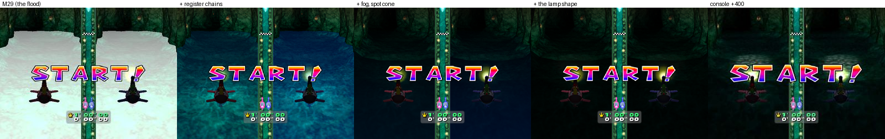

**m434, Cheep Cheep Sweep — the reading** (`map.c:266`, `fn_1_2978`): the
pond is a 31-strip mesh whose two stages are `TEXC(copy of the underwater
pass)` then `lerp(PREV, TEXC(copy of the mirrored sky), A0 = 0.25)`, four
texgens (two `GX_TG_MTX3x4` projections of the copies, two for the ripple
warp the port drops), no register writes at all — `--copylog` and
`--dumpcopy` showed all five of the frame's copies right (the ripple map,
the reflection, the floor, the players on black, the composed
refraction: `screenshots/m30-m434-copies.png`), and the frame's pond
pixels were *byte-identical* to the refraction copy: the water was not
drawn. `--cpuxf` drew it (as M25's black disc), `--oldsubmit` drew it,
`--nomultidraw` drew it, `--novar` and `--indexed` drew it; the default —
`glMultiDrawArraysEXT` from the vertex-array-range ring — drew nothing,
at any `--mdmax` (a new cap on the vertices per call: 1024, 512, 200, and
**1**, i.e. one strip per `glMultiDrawArraysEXT` call, still nothing,
while the same strip through `glDrawArrays` draws). On the Intel HD 3000
under 10.6 and on the Radeon 9000 under 10.5 alike. Not understood: the
one thing this batch is that no other batch in the game is, is a
*position-only* layout (no normal, no texcoord array, every texgen from
the position), so that layout now goes down per-strip `glDrawArrays`
(`--mdposonly` keeps the multi-draw for the A/B) — the pond is the only
such batch the walk and the gallery ever submitted (`--submitstats`).
Then the surface drew at a quarter of its alpha: stage 1 lerps by the
register's alpha (`A0 = 0.25`, the unit's `CONSTANT.a`) while its alpha
side wants `KONST = 1` — the one "two constants" collision (§31.4) the
water shaders have, and it has a second source for a 1.0 when the
rasterised alpha is a known 1.0 (channel 0 unlit, its material alpha 255
from the register): `PRIMARY_COLOR.a`.

**m405, Mario Medley**: its pool is the same shape as m434's with two
indirect warps (`main.c:979`) for the caustics; the water now draws the
copies at the right alpha, the tint moved from grey-green towards the
console's blue, and the moving caustic pattern is the indirect warp §17
drops — still **minor**.

### 45.4 Cause C: the fog that should not have been, and a table that was 100 long

**m414, Long Claw of the Law.** The drawlog said the four saloon views
*were* drawn — 547 draws, the walls, the crowd, the cubes, each under its
quadrant's `viewport 10 20 309 219` and scissor, in the right order — and
the frame was solid cyan (0, 255, 255) under a HUD that drew. Nothing in
the frame draws cyan, so the drawlog grew the fog and the copy clear, and
there it was: `fog type 4 start 10000 end 10000 … color 0 255 255`. The
saloon HSF carries a scene fog of (10000, 10000) in cyan, which
`Hu3DModelCreate` loads (hsfman.c:406); the SDK's `GXSetFog` (GXPixel.c:31)
has a guard — `if (farz == nearz || endz == startz) { A = 0; B = 0.5; C =
0 }`, "parameters that make the fog function invalid" — that makes it
*no fog*, and the port's GL_EXP with density 1/(0 + 1) fogged every
quadrant solid. The guard is in the port's `GXSetFog` now (`--oldfog`
keeps the cyan), and with it the hardware's exponential shape: `1 −
2^(−8 f)` (EXP) or `1 − 2^(−8 f²)` (EXP2) of the linear factor `f = (z −
start) / (end − start)` clamped to 0..1 (the A, B, C of GXPixel.c and
Dolphin's PixelShaderGen), which GL's `exp(−d · fc)` can say exactly when
the vertex program writes the fog coordinate as `max(0, |z_eye| −
state.fog.params.y)` and `d = 8 ln 2 / (end − start)` (EXP2: `sqrt(8 ln
2) / (end − start)`); linear fog under that coordinate is GL_LINEAR over
(start/2, end − start/2). The CPU vertex path has no fog coordinate of
its own and keeps the old numbers.

**m408, Paratrooper Plunge.** Its `--scenelog` said the swirl's models
were live and drawn, and the drawlog named them (`out`, `fusagi`, `in`);
the frame had them white. The fog line: `fog type 255 start nan end nan
… color 255 255 255 255` — sixteen bytes of 0xFF where `FogData` should
be, and `copyclear 0 0 0 0` where `BGColor` should be (0, 0, 0, 255). The
link map (`marioparty4.map`) puts `hsfload.o`'s `rgba` (400 bytes, `GXColor
rgba[100]`) at 0x158200, then `vtxtop`, `BGColor` at 0x158394 and
`FogData` at 0x1583A0. `hsfload.c:224` fills `rgba[i]` for every material
of every HSF loaded and nothing reads it; an HSF with more than 100
materials writes on past it. m408's has more (the swirl tunnel, the
island): `rgba[101]` is `BGColor`, `rgba[104..107]` is `FogData` — fog
type = a material's lit colour with 255 in the low byte, the range =
white as a float = NaN, the colour white; and the port fogged the sky
white. On the console the same overrun lands on whatever the DOL put
after `rgba`, which is not the fog. The table is bounded in
`port/patches.txt` (an exact-text patch of the four stores, with an
`OSReport` the first time a model goes over: the witness line in the
log), the class of §20's struct bound.

**m417, Makin' Waves — read, not fixed.** The pool's shader (`water.c:826`)
is five stages: two lerp-adds by register alphas, then `T*RASA → REG2` and
`lerp(PREV, C1, C2)`, and the last stage reads PREV *across* the register
write — the planner's unexpressible case (PREV's producer is stage 2,
stage 3 wrote REG2, and GL's PREVIOUS after unit 3 is stage 3's result).
Expressible only by carrying stage 3's scalar in an alpha, which is a
fold for the next milestone; and the play's early end at +846 was not
chased. Its rows keep §41b's verdict.

### 45.5 Cause G: the attribute the decoder did not know

m402's prism (`--cpuxf --drawlog`, which prints the transformed
positions): draw 263 of the frame, object `table`, the display list's
first primitive 40 quads-vertices with `nactive 2`, then `op ff prim f8
fmt 7 count 31488` — the decoder's next opcode read from the middle of the
first primitive's vertex data, 183 vertices of `1e25` and `1.7e38`, a
yellow polygon through the arena. The lists before and after it decode
with `nactive 3`. hsfdraw.c:583: a face group with `flags & 2` (bump
mapped) sets `GXSetVtxDesc(GX_VA_NBT, GX_DIRECT)` and
`GXSetVtxAttrFmt(GX_VTXFMT0, GX_VA_NBT, GX_NRM_NBT, GX_S16, 8)` — nine
s16 a vertex — and `GX_VA_NBT` (25) is the SDK's *alias* for the normal
attribute ("the same attribute as GX_VA_NRM"), which the port stored in
`gx.vcd[25]` and never read. `GXSetVtxDesc`, `GXSetVtxAttrFmt` and
`GXSetArray` alias it to `GX_VA_NRM` now, and the decoder steps over the
nine components (`GX_NRM_NBT`) or three indices (`GX_NRM_NBT3`) keeping
the normal; the binormal and tangent are for the indirect bump the port
drops.

### 45.6 Cause H: a primitive with no end, and a line with no width

m428's rope hook (`player.c:2168`) draws `GXBegin(GX_LINESTRIP, …, n)`
and n `GXPosition1x16`/`GXColor1x16` pairs, and never calls `GXEnd` —
the SDK's `GXEnd` is `static inline void GXEnd(void) {}` (GXVert.h:184);
the hardware ends a primitive at its n-th vertex. The port submitted an
immediate primitive on `GXEnd` only, and the next `GXBegin` reset the
count: the rope, and every other immediate primitive without a `GXEnd`,
was dropped (its drawlog had no line primitive at all, which is what
said so). `attr_written` ends the primitive at the n-th vertex now. Then
`GXSetLineWidth`, a generated stub since M2 (36,949 calls on the soak's
stub report), stores the width (sixths of a pixel; the game's ropes are
16 = 2.7 px) and `glLineWidth` is in the render thread's stream
(`--nolinewidth` is the hairline).

### 45.7 Cause I: the third texture

m448's felt (`grid`, 20 vertices, six stages) is hsfdraw's
`SetTevStageTex` for a material of *three* textures with the third's
`kColor == 1`: the M16 triple (felt, environment map → REG2, lerp by the
map's alpha), then `T_decal * RAS → REG2`, `lerp(PREV, C2, T_decal.a)`,
then the shadow. The port matched the triple and sent the pair down the
generic path: the decal stage overwrote PREV with `T_decal * RAS` (a 64×64
RGBA8 whose mean is black) and the lerp mixed that with REG2's constant
(black) — the felt drew black wherever the decal's alpha was low, which
is the table. RAS still factors out of everything, so the fold is the M16
one with the multiply moved one unit later (regfix shape 5: `T_A`;
`lerp(PREV, T_B, PREV.a)`; `lerp(PREV, T_C, T_C.a)` with the third texture
bound one unit early; `PREV * RAS`; a pass), and `gx_tev_unit_stage()`
tells both vertex paths which stage's coordinate a unit samples for.

**m435–m437's pillar spheres — read, not fixed.** The flames are three
objects at the pillar top: a star flare (`m05ef01`/`sphere18`, 24
vertices, `T_IA8 * KONST(cyan)` then `× RAS`, alpha test ≥ 128, additive)
which draws, and the sphere itself (`sphere1`/`sphere20`, 48 + 128
vertices, `T * RAS + T_glow` through a `GX_TG_NRM` texgen, alpha `APREV
* A0` = 0.7, z write off, `GX_BL_SRCALPHA/INVSRCALPHA`) which is in the
drawlog with sane vertex positions at the pillar top and does not show.
Its material is lit (`mat (178, 178, 255)`, the arena's lights) and its
generic emission is two ordinary units. Not resolved in the day; the
next read is `--dumptex` for its 128×128 `T` and a `--gltrace` of its
two draws.

### 45.8 Cause D: m430's column — read, not fixed

The right view's draws are the left view's 305 draws again under the
other camera. With `--cpuxf` every draw's positions are on the log
(`~/m30/m430-cpu.log`); the screen-aligned dark rectangle from the top of
the view is not the rope (the rope's four line vertices were all one
point — the game's rope points before the n-th-vertex fix; the rope
draws now), not the sky quads (`sorasita`, `kumo`, 9,000 units across at
z −5,900, in both views), not the island billboards (`particleFunc`, a
2,750-unit quad at z −13,197 whose 256×256 C8 texture dumps as the palm
island with its alpha right). The candidates left are the two
`Hu3DDrawPost` 4-vertex `shadow` quads and the untextured 120-vertex
`rope` tubes; the next read is `--gltrace` on the right view alone.

### 45.9 The md5s

The 9,000-frame turbo walk (§31.2) on the M30 build (`a33e8547…`), and
the same with every M30 lever off:

| frame | M29 (= `--nolinewidth --noregchain --oldfog --nospot --mdposonly`, to the byte) | **M30** | what |
|---:|---|---|---|
| 800 | `0b58c5ee…` | `0b58c5ee1dee7b5da28a688c4fe315ce` unchanged | |
| 3000 | `c58a046d…` | `c58a046d9ce6fabe3fef0b2270179203` unchanged | |
| 7000 | `021d58fb…` | **`4a9a640c219e94b8c80460c84e019b97`** | `ppmdiff`: **one channel sample at one pixel (126, 4) by one level**; mean 0.00005 levels, 0 samples over 8 |

The board's lights are type 1 (`Hu3DGLightInfinitytSet`): a 20°
`GX_SP_COS` cone on a light 10⁶ units away, `(c − cos 20°) / (1 − cos
20°)` with `c` a hair under 1 — the hardware's own arithmetic, below a
level, and one sample rounded the other way. The three M30 references are
therefore **800 `0b58c5ee…`, 3000 `c58a046d…` (unchanged), 7000
`4a9a640c…`**; the console cannot adjudicate a level, and the walk with
the levers off reproduces M29's three to the byte
(`docs/soak/m30-T.log.gz`, `m30-Told.log.gz`).


### 45.9b The gallery on the G4: the pairs and the numbers

`gallery_chain.sh` with `GAMES=` (new) on the M30 build (`a33e8547…`):
the thirteen games of the causes and two controls, 22:34–23:13 G4 time
(`docs/soak/m30-gallery-index.txt`, `m30-gallery-mNNN.log.gz`), the
frames in `port/docs/gallery/mNNN-m30-fNNNNNN.jpg`, the rows regenerated
into `compare.html` by `port/tools/compare_m30.py` (the console frames
stay; each M30 row keeps the M26b verdict and note as the before
picture; `verdicts-m30.tsv`, `similarity-m30.tsv`). The sim cell is
§41b.2's `sim/>8` at the four play positions (+60 · +400 · +1200 ·
+2300), the sweep's M26 fix build first, the M30 build second:

| game | cause | M26b | **M30** | sim: M26 fix → M30 |
|---|---|---|---|---|
| m414 Long Claw of the Law | C (the fog guard) | major | **match** | 45/100 54/92 49/92 53/100 → **95/28 95/62 90/78** 65/100 (the console's +2300 is its results) |
| m427 Right Oar Left? | B (chain, cone, fog, lamp) | major | **match** | 85/43 47/89 47/93 56/94 → **99/21 95/43 94/58 92/43** |
| m402 Slime Time | G (`GX_VA_NBT`) | major | **match** | 82/93 86/88 86/90 86/90 → **98/30 98/35 96/44 95/42** |
| m434 Cheep Cheep Sweep | B (the batch, the alpha) | major | **match** | 88/69 93/56 92/61 92/60 → 91/58 94/55 93/59 93/59 (a translucent surface moves the number a little; the picture is the console's) |
| m448 Goomba's Chip Flip | I (the three-texture shape) | minor | **match** | 98/43 92/67 92/74 92/75 → 98/43 93/61 93/68 93/70 |
| m428 Cliffhangers | H (the n-th vertex, the width) | minor | **match** | 92/55 92/54 82/88 79/96 → 92/57 92/57 82/89 79/96 (a 3-px rope; the play differs) |
| m458 Panels of Doom | E (§45.10) | port-faulted | **match** | – → **99/19 99/22 98/26 99/22** (the play frames were never captured before) |
| m408 Paratrooper Plunge | C (`rgba[100]`) | major | **minor** | 92/80 93/99 83/94 62/100 → 92/84 96/99 87/87 70/99: the sky and the swirl draw; the tunnel's white cap stays |
| m417 Makin' Waves | C (the fog guard, half) | major | major | 78/99 52/99 61/98 70/100 → 75/84 82/66 61/98 71/100: the pool scene draws, the water is black, the game still ends at +846 |
| m405 Mario Medley | B | minor | minor | 95/66 93/74 87/88 90/91 → 95/66 93/74 87/88 90/91: the caustic is the indirect warp |
| m430 Pair-a-sailing | D | major | major | 91/67 89/73 81/88 81/86 → 92/61 91/70 82/87 82/84: the rope draws, the column stands |
| m435–m437 Bowser games | I, J | minor | minor | unchanged (m435: 95/58 97/37 98/39 98/32 → 95/58 97/37 98/38 98/32) |
| m401, m416 (controls) | – | match | match | 93/92 93/95 91/93 92/94 → 94/75 95/65 92/58 94/58; 95/37 97/65 97/59 77/86 → 95/39 97/67 97/60 77/86 |

The header counts move from **45 match, 7 minor, 7 major, 2
port-faulted, 2 oracle-failed** to **52 match, 6 minor, 2 major, 1
port-faulted, 2 oracle-failed**.

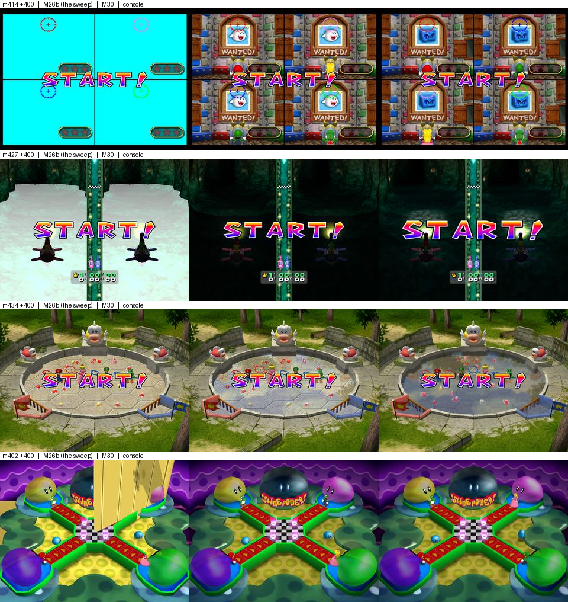
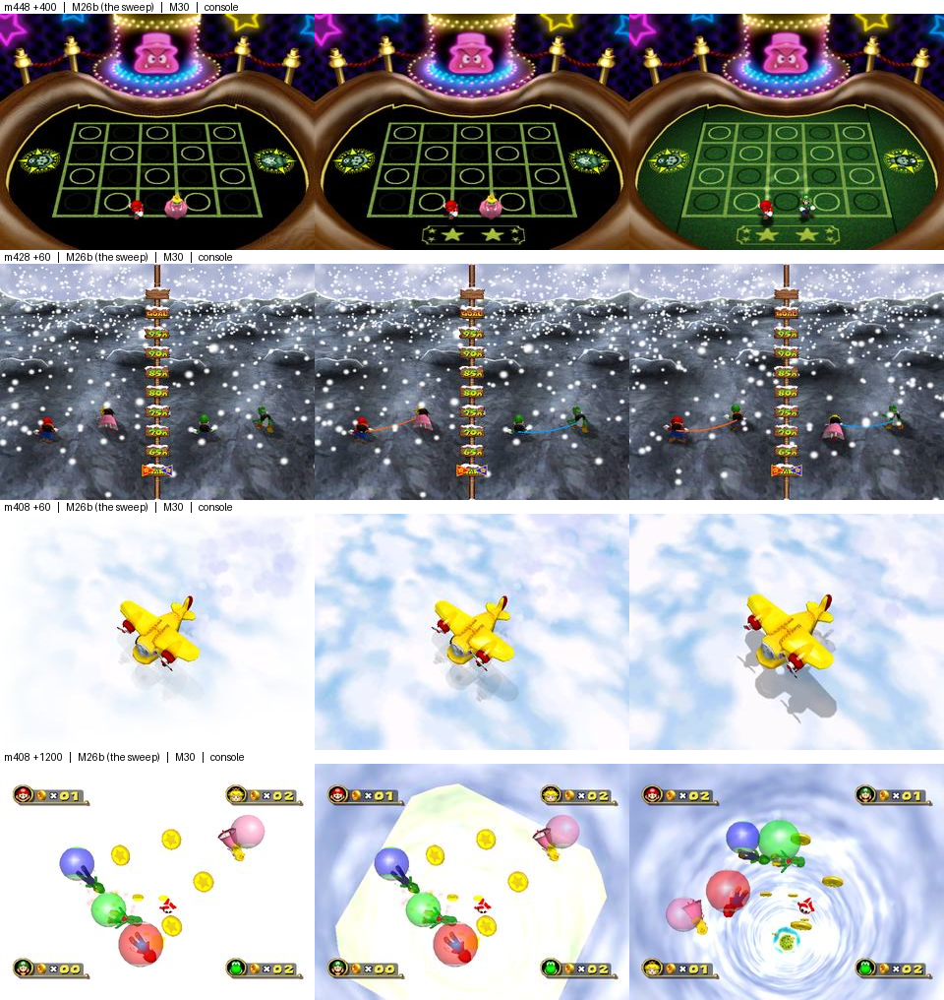
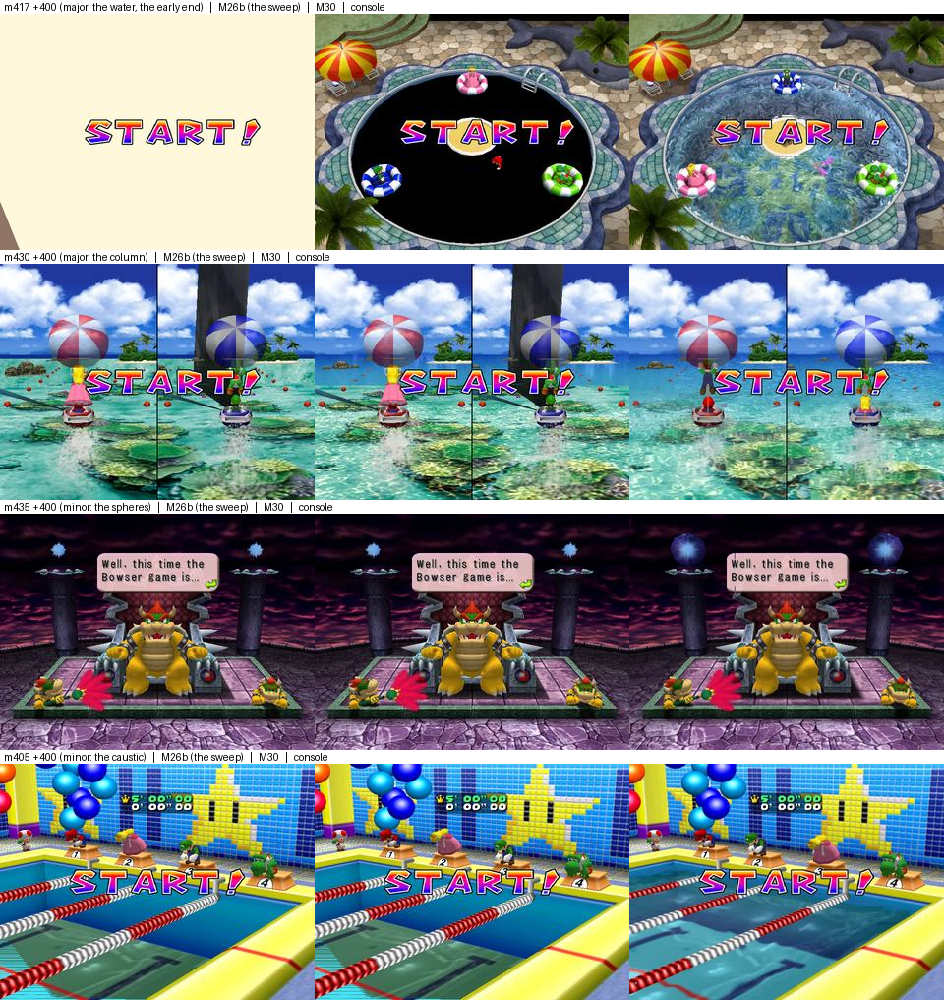

### 45.10 m458, Panels of Doom: the SIGBUS in the REL

`snaps/lib/m458-fault-f015200.snap` was taken by build `abbd973e`, and
`~/MarioParty4-m26gallery.app` is `d2767188` (§44.7's pointer was wrong
by a build); `--restore-lax` took it (the range table matched), and the
restored run faulted at the §41 frame with the §41 address: `signal 10 at
0x935c001c`, pc `0x33d033f8` in `m458Dll.bundle`, frame 15,553. gdb
(`port/tools/gdb/m458.gdb`, attached the moment the log said `resuming the
game`; `docs/soak/m30-m458-gdb.txt.gz`):

```
#0  fn_1_5014 (var_r30=0x352c3d8) at m458Dll/main.c:1213
    0x33d033f8 <fn_1_5014+1236>:  stw r8,28(r2)        r2 = 0x935c0000
#1  omMain ()
```

main.c:1213 is `spC[…]->unk_1C = 0` in the panel-pick state machine, and
`spC` is filled at the function's top as

```c
for (var_r31 = 0; var_r31 < 2; var_r31++)
    spC[var_r31] = (&lbl_1_bss_BC)[var_r31]->data;
```

— the module reads its two player objects as a two-element array
*through the address of the first* (seventeen sites), which on the
console is what the linker gave it: `lbl_1_bss_C0` four bytes after
`lbl_1_bss_BC`. GCC's `.bss` puts something else after `lbl_1_bss_BC`
(the file declares `C0` before `BC`), so `spC[1]` was a garbage `OMOBJ*`
and its `->data` a garbage work pointer, `0x935c0000` — the IOKit
framework's address, which is what a store to it says. The M30 build's
own run faulted 450 frames *earlier* at another of the seventeen sites
(`signal 11 at 0x4bffef40`, `fn_1_5014+0xf8`): a different neighbour in a
different build. §20's class exactly. The fix is an exact-text patch
(`port/patches.txt`): the two globals become one array, `OMOBJ
*lbl_1_bss_BC_arr[2]`, with the two names as macros over its elements,
so `(&lbl_1_bss_BC)[1]` is `lbl_1_bss_C0` again. The witness is the
gallery recipe on the fixed module: the game plays through +2600, and its
frames are the console's (`m458-m30-f*.jpg`, sim 99/19 · 99/22 · 98/26 ·
99/22 at +60 · +400 · +1200 · +2300):

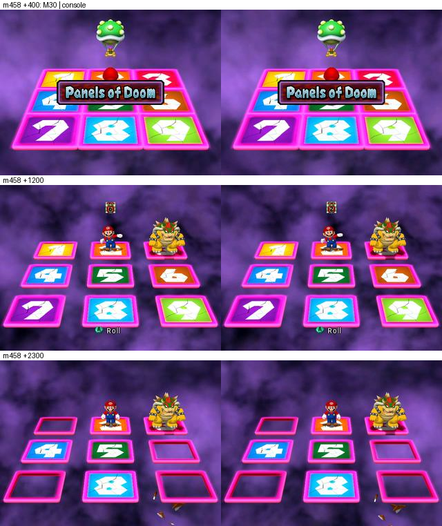


### 45.11 What M30 shipped, and the table of what is left

| shipped, with a witness | |
|---|---|
| **TEV register chains** (`regchain_plan`, `--noregchain`), the **lamp shape** (regfix 4) and the **three-texture shape** (regfix 5, `gx_tev_unit_stage`) | m427's river and headlamps, m448's felt (§45.3, §45.7; the gallery pairs) |
| **the spot cone** (`GXInitLightSpot` per the SDK, the program's and the CPU path's angular term, `--nospot`) | m427's cave (§45.3); every placed light in the game |
| **the fog**: the SDK's degenerate-range guard, the hardware's exponential shape through the fog coordinate (`--oldfog`) | m414's four views, m427's cave (§45.4) |
| **`rgba[100]` bounded** (`port/patches.txt`, hsfload.c, with the `OSReport` witness) | m408's sky and sea (§45.4) |
| **`GX_VA_NBT`** aliased and stepped | m402's prism gone (§45.5) |
| **a primitive ends at its n-th vertex**; **`GXSetLineWidth`** in the stream (`--nolinewidth`) | m428's ropes (§45.6) |
| **position-only strips per `glDrawArrays`** (`--mdposonly`), the KONST-1 alpha through the primary colour | m434's pond (§45.3) |
| the drawlog's fog and copy-clear lines, `--gltrace`'s multi-draw line, `--mdmax`; `port/tools/drawlog_summary.py`, `soak_read.py`, `m30_chain.sh`, `gallery_chain.sh`'s `GAMES=`, `compare_m30.py`, `gdb/m458.gdb` | |
| soak 20 read (§45.1), the md5s (§45.9), `docs/soak/m30-*`, `docs/screenshots/m30-*`, the regenerated `compare.html` rows | |

**The table of what is left** (§41b's causes, after M30):

| cause | games | M30 |
|---|---|---|
| B water | m427 | **fixed** (the chain, the cone, the fog, the lamp shape) |
| B water | m434 | **fixed** (the multi-draw batch, the alpha) |
| B water | m405 | minor, the tint improved; the caustic is the indirect warp (§17) — not started |
| C scenes | m414 | **fixed** (the fog guard) |
| C scenes | m408 | **fixed** (`rgba[100]`) |
| C scenes | m417 | read, not fixed: a five-stage chain with PREV read across a register write (a scalar-in-alpha fold); the early end (+846) not started |
| D column | m430 | read, not fixed: narrowed to the `shadow` quads or the `rope` tubes (§45.8) |
| G prism | m402 | **fixed** (`GX_VA_NBT`) |
| H lines | m428 | **fixed** (the n-th vertex, the width) |
| I spheres | m435–m437 | read, not fixed (§45.7); m448 **fixed** (the three-texture shape) |
| J text | m435's name, m457's bubble, the card titles' last glyph | not started |
| E faults | m458 | **fixed** (the two-globals array, §45.10) |
| E faults | m459 | runs at `--stackmul 2` (§44.7); the default unchanged |
| A's leftover | m457's ring shadows | not started |

**What M31 starts with**: the leave-behind soak (§45.12); m417's fold and
its early end; m430's column through a `--gltrace` of the right view;
m435's sphere through `--dumptex`; the `--stackmul 2` soak §44.7 named;
the character select's render-thread wall (§44.8) — measured, unmoved.

### 45.12 What is left running

`g4 run --soak --com4 --rtc dolphin --freshcard --realtime --snap-every
5000 --snap-keep 3 --status --ovllog --stuckwatch 200 --perf --stackmul
2` on the final build (`071cbc5c…`, the same sources as `a33e8547…` plus
the m458 patch; the turbo walk on it reproduces the three M30 md5s,
`docs/soak/m30-chain-index.txt`), from 23:31 G4 time — §44.7's question
put to a soak, as ITEM 3 asked: `--stackmul 2` is the multiplier m459
runs under, and whether ×2 is enough for every coroutine the board and
the minigames create is what this soak answers. **Read it first**: the
`stack overlap error` guard in `HuPrcCall` is the witness of a stack
that ran short (a fault or a `STUCK` with that line before it says ×2 is
not enough and the default stays 4; a clean night says M31 may flip it),
the `rt N ms dec M` on the status lines should read as §45.1's, and every
`CARD: image flush took … behind the game` should stand alone with no
`stall:` beside it. The M29 bundle is `~/MarioParty4-m29.app` for a
same-binary comparison; the gallery frames of the day are in
`~/gallery-m30/` on the G4 and littlejelly.

## 46. M31 log: the rest of the picture list, and the stack multiplier *(2026-09-21, littlejelly)*

M31's brief was the soak's verdict on `--stackmul 2`, then the four
findings M30 read but did not fix — m417's black water and its early
end, m430's column, m435's pillar sphere, the name m435's bubble drops —
each from M30's reading. The soak was clean (§46.1) and ×2 is the
default. The four findings turned out to be *two* causes and one open
read: m417's early end, m430's column and four lesser things were one
thing — **the SDK's paired-single vector and quaternion
bodies, and one GX writer, were loud do-nothing stubs** (§46.2: twenty
symbols, 12.7 million calls over the soak); m417's water was the fold
§45.4 named (§46.3); the bubble's name was the port's own message tag
(§46.5); the sphere is still not drawn after every lever the port has
(§46.4).

### 46.1 The soak, read: ×2 is the default

§45.12's leave-behind — `g4 run --soak --com4 --rtc dolphin --freshcard
--realtime --snap-every 5000 --snap-keep 3 --status --ovllog --stuckwatch
200 --perf --stackmul 2` on the M30 build (`071cbc5c…`) — ran 23:31 to
06:50 G4 time and was ended through `g4 stop` for the milestone: **7 h
19 min, 1,578,060 frames, 26,301 status lines**
(`docs/soak/m31-soak21-m30-stackmul2.log.gz`, read by
`port/tools/soak_read.py`).

| | |
|---|---|
| speed / presented fps | **100.1%** mean over 26,301 lines (`machine ok` on every one, `cpu 2`); 27.7 fps overall; the board's `w01dll` turn lines 28.8–29.4 fps mean on every one of the five boards' twenty turns, `rt` 15.8–17.8 ms, `dec` 5.2–6.6 |
| where it got | **five complete 20-turn boards and into a sixth** (turn 3/20 at the stop); each board through `mstory3dll → modeseldll → mentdll` and back |
| minigames | **144 plays of 40 modules** (m444 ×8, m438 ×8, m441 ×7, m439/m424/m421 ×6, … m417 ×2, m436 ×1); presented fps 19.7 (m431, the §32.4 shape) to 29.8 |
| `stack overlap error` | **none** — the `HuPrcCall` guard byte never fired in 144 minigame plays and five boards |
| faults / guard hits / mismatches | **0 / 0 / 0** (`skin: lifetime … 0 guard hits`; `musyx_mix … 0 position mismatches`; no `*** port` line) |
| STUCK | 15, all the chain's designed 200 s waits at `modeseldll` / `mentdll` between boards (three per board cycle, five cycles) |
| resyncs | **1**: `retrace 1246811, 1094 ms behind` — the fifth board's entry (`w01dll` link at 1,246,796: `stall: … 508 ms [consumed] … dll`, then 348, 175 and 169 ms as the board's textures decode), the §44.6 (B) load at its slowest; the other four board entries did not resync |
| render thread | 2.81 G records, 728,583 frames presented, replay mean 16.1 ms; decode 417 M runs, **0 late**; gate 40,876 waited (worst 22.8 ms); ring waits 0 |
| card | 218 image flushes on the writer thread, 1,257 ms on the game thread in all; 109 waited for the previous one; the rename 1.6–1.77 s behind the game six times (frames 324k, 799k, 894k, 1134k, 1294k) and **no `stall:` beside any of them** |
| DVD | 7,962 reads, 17.8 s in reads, **8 over 100 ms** (worst `m415.bin` 811 ms at frame 760,036, `m403.bin` 467 ms) — none of M30's 1.8 s |
| rss / tex | 145–194 MB (194 at `mentdll`, as §38.1); 806–834 tex entries, 40–41 MB |
| m459 | **did not come up**: the roulette's picks over 144 plays never dealt Mushroom Medic (nor m403–m409's neighbours m411, m413, m433, m435, m437, m442, m445–m454, m457–m463); its case is §44.7's walk, 3,000 frames at 30 fps under ×2 |

**The verdict: the default is 2.** Seven hours, five full boards and 144
plays of 40 modules at ×2 with the guard byte silent and no fault is the
soak §44.7 asked for. `PORT_PRC_STACK_MUL` is 2 in the Makefile
(`PORT_PRC_STACK_MUL=2`, port.h, os_misc.c, `--stackmul`'s help), the
machine check's applied-settings block now owns up to it — `port>
machine: coroutine stacks x2 over the game's sizes (the default since
M31; --stackmul N)` — and m459 needs no lever. ×4 stays one flag away
(`--stackmul 4`) if a module ever prints the guard's line; the m459 heap
argument (65 stacks × 0x2000 × the multiplier against a 2.25 MB heap)
is why 2 and not 3.

**The disk, read.** M30's two 1.8 s DVD reads and three slow renames in
one quarter-hour asked whether the G4's disk is slow. Measured outside
the game after the soak, with `mds` idle (`ps auxww | sort -k3` clean):
`dd if=~/MarioParty4/mp4.nkit.iso of=/dev/null bs=1m count=100 skip=N`
at three offsets — **8.1 s each, 12.9–13.0 MB/s** sequential. The drive
is a Seagate `ST1000LX015` (a 2.5" FireCuda, shingled) on the
Quicksilver's ATA bus, and 13 MB/s is what it reads at here; a 1.3 MB
module read from the image is 100 ms when the page cache has dropped it
and 15 ms when it has not, and a rename over an existing file is the
journal plus the shingled band's rewrite — the 1.7 s the card flush pays
behind the game. `mdutil -s /` says `Indexing enabled` for the volume
(`~` has no index of its own); `mds` was at 85% CPU for the two minutes
after the install (the `.o` sync and the bundle), then gone. Nothing
changed: the port's data directory carries its
`.metadata_never_index`, the flush is on its thread, and the soak's one
resync was a board load, not the disk. Reported, not touched.

### 46.2 The cause under three findings: the SDK bodies that were stubs

M30 read m417's early end as "a logic divergence, not chased", m430's
column as "the shadow quads or the rope tubes", and m428's play as "the
play differs". The m417 read started from the picture: on the G4's +60
frame the raft is *empty* and at +400 a small Mario stands in the pool
below it, where the console has him on the raft from the first frame —
not chaos but a rule. `player.c:1064–1072` builds the raft's tilt as
three quaternion products, normalises the product and tests its `w`
against `cosd(25)` for the fall (`fn_1_9C14`); `VECMag`,
`QUATMultiply`, `QUATNormalize`, `QUATInverse`, `MTXQuat` are the SDK
macros. The run's own stub report said the rest:

```
---- SDK surface hit at boot: 4 distinct stubs, in first-call order ----
   2  C_QUATInverse                         845
   3  C_QUATMultiply                       2532
   4  C_QUATNormalize                         1
```

`quat.c` has `C_QUATAdd`, `C_QUATRotAxisRad`, `C_QUATMtx` and
`C_QUATSlerp` in C and **`PSQUATMultiply` / `PSQUATNormalize` /
`PSQUATInverse` in paired-single asm only**; the mirror drops the asm,
`-DMTX_USE_C` sends the macros to the `C_` names, and `gen_stubs.py`
made the three `C_` names loud stubs that return without writing their
result (`port_stub`, PLAN.md 2). So on the port the raft's quaternion
never moved, the normalised copy was an uninitialised stack `Qtrn`, and
`sp28.w < cosd(25)` was true on the first frame of play: the solo fell
at +600 and the module left at +846, every time, on both machines.

The same list, over the M30 soak's 7 h 19 min (its report at the stop):

| stub | calls | who |
|---|---:|---|
| `GXProject` | 5,097,960 | m427's lamp flares (`map.c:988`), m428's rope hooks (`player.c:3410`): `sx/sy/sz` left uninitialised |
| `PSMTXTranspose` | 4,081,790 | m438's fire (`fire.c:218,288`): the normal matrix for its lighting, garbage |
| `PSVECSubtract` | 3,270,035 | m428's rope (`player.c:2134`, 249,216 calls a play), mstory3's win effect |
| `PSVECAdd` / `PSVECScale` / `PSVECMag` | 156,750 / 33,250 / 5,555 | mstory3's win-effect particles (`win_effect.c:228–287`) |
| `GXUnknownu16` | 72,656 | **m430's rope and sail display lists** (`player.c:1513`, `water.c:1151`): the decomp's name for a bare `u16` store into the write-gather pipe, undeclared in the mirrored header's `TARGET_PC` block, so it linked to an *untyped* stub — the lists recorded their `GXBegin` and no indices, and the decoder read the heap after them as vertices. That is the column |
| `C_QUATMultiply` / `C_QUATInverse` / `C_QUATNormalize` | 5,064 / 1,690 / 2 | m417 (two plays) |
| `GXSetZTexture` | 9,244 | m419 (`main.c:279`): still a stub, a Z-texture the port has no equivalent for; m419 is a match |

Twenty of the twenty-six stubs were these (the six left are `ARAlloc`,
`ARFree`, `GXSetZTexture` and the three THP entries). The bodies are
`port/src/os/psmtx_c.c` (the three `C_QUAT` functions as the SDK's C
arithmetic, `PSQUATNormalize`'s `frsqrte` reciprocal a correctly
rounded `1/sqrt` through `port_sqrtf` as `C_VECNormalize`'s is; the
`PS*` names as forwarders to the `C_` bodies), `GXProject` in
`gx_state.c` (GXTransform.c's body over the port's `GXGetProjectionv` /
`GXGetViewportv` vectors), `GXUnknownu16` as one more `IDX_WRITER` in
`gx_draw.c` with a `patches.txt` line declaring it in the header's
`TARGET_PC` block. No lever: what they replace wrote nothing.

**m417's play.** On the bench and on the G4 alike the module now leaves
at **+2014** (was +846; the console's run left at +2646, its timer
running out at +2280 — on the port the solo fell at about +1700 under
the wave rockers, which is the game, not the port: the two runs do not
share their RNG). Mario is on the raft from +60; the timer reads 18 at
+1200 on both.

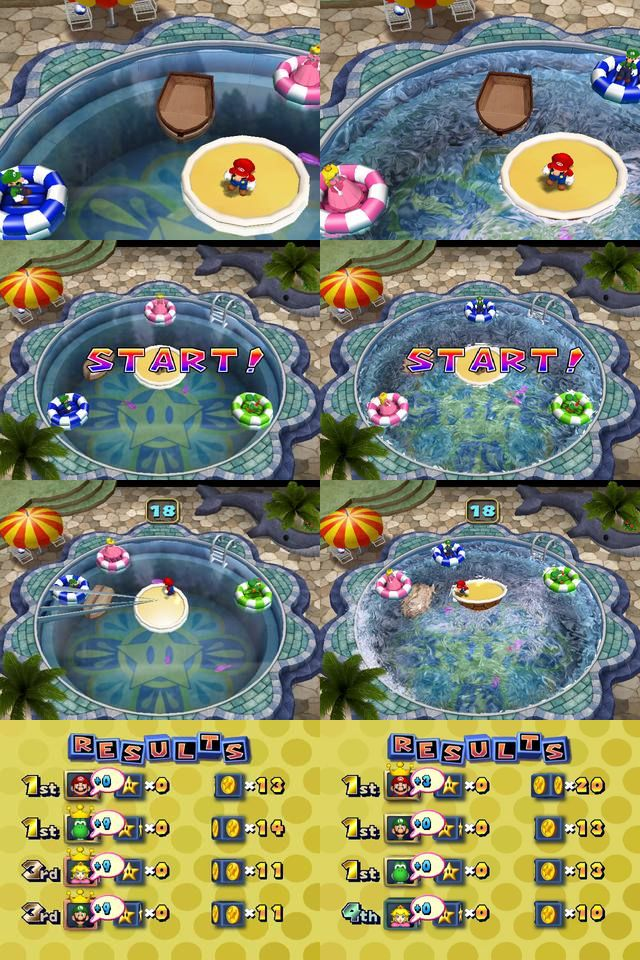

**m430's column.** Gone: both views show sky, the parasails, the ropes
and the wakes where the M30 build stood a dark rectangle in the right
view.

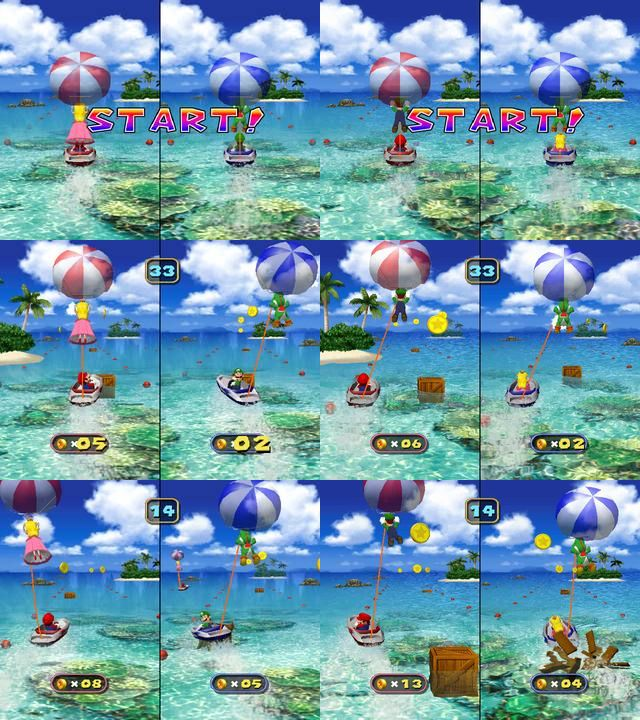

**m428 and m427: no pixel moved.** The rope's `PSVECSubtract` feeds
`fn_1_F88C` (player.c:2136, the rope segment against the rock) with the
segment's direction, and m427's `GXProject` places its lamp flares;
neither changes a gallery frame — `ppmdiff` between the M30 and M31
frames of both games is 0.00000 at every position, and m428's "the play
differs" of §45.9b stands as the play. One thing to know when reading
m428's sims: the port's `--com4` pairs Mario with Peach and Luigi with
Yoshi where the console's pokes pair Mario with Luigi (the type-2 groups
`0,0,1,1` fall on different players in the two harnesses), so the two
ropes are the other way round.

### 46.3 m417's water: the scalar-in-alpha fold

§45.4 read the pool's shader (`water.c:826`): five stages, the last two

```
stage 3:  T_foam * RASA          -> REG2     (T_foam a 64x64 I8: grey)
stage 4:  lerp(PREV, C1, C2)     -> PREV
```

and stage 4 reads PREV *across* stage 3's register write — the planner's
unexpressible case, drawn as the register's constant (0,0,0): the black
water. But stage 3's product is a *scalar* — a grey texture times an
alpha — and the alpha channel is idle in this chain (every stage's alpha
is `KONST` into a register nobody reads). So unit 3 passes its RGB
through and computes the product in its alpha (`TEXTURE.a` is the
intensity: the port decodes I4/I8 with `d[3] = I`), and unit 4 reads
`C2` as `PREVIOUS.a`: `INTERPOLATE(C1, PREVIOUS, PREVIOUS.a)`, exact.
`regchain_plan` (gx_tev.c) takes the fold only where the plain rename
cannot say the chain (the next stage reads both PREV and the register),
the stage's own alpha write is dead, the next stage needs no PREV alpha,
the texture is I4/I8 with an identity swap and the multiplier has an
alpha form (`RASA`, a grey `KONST`, `A0–A2`); the plan tracks what GL's
PREVIOUS holds on each side (`gl_c`, `gl_a`, `carry_of`) instead of
M30's `prod == i − 1`, which also stops counting a `CPREV` read across a
pass as unexpressible (a count, not a picture). The TEV cache's
signature carries the I4/I8 bits. `--nocarry` is the A/B; the `tev:`
report counts the configs carried (2,012 on the bench's m417 play; 0
reads unexpressible where M30's had one per frame).

The water on the G4 is a translucent blue over the star floor now, the
raft and the tubes ride it, and what is still not the console's is the
**indirect warp** (three `GXSetTevIndWarp` stages ripple the two copies
across the surface; the port draws the direct stages, §17) — the
console's foam-and-caustic pattern against the port's smooth tint — and
one thing new at +1200: a fan of long thin light quads from the raft's
edge toward a tube (`m417-m31-f015677.jpg`, the crop below). Read as
far as: not the water mesh (`fn_1_604C`'s 35 strips are the pool), not
the 150-billboard splash particle (`particleFunc`, its first quads at
the origin with alpha 0), the three `hire` wave models are 72/128-vertex
objects — unnamed; the snapshot is `~/gallery-m31/m417/snaps/f016000.snap`
(entry +1523, the M31 gallery build) and `snaps/lib/m417-streaks-f016000.snap`.

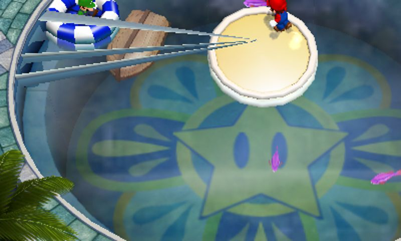

### 46.4 m435's sphere: read further, not drawn

§45.7's next reads, done on the bench: `--dumptex` shows the sphere's
128×128 RGB565 textures as the blue plasma one would expect (two of
them, one per pass; alpha 255 throughout) and the 32×32 I8 rim map as a
soft radial blob; the `--gltrace` of the two `Hu3DDrawPost` draws is
exactly the emission the drawlog implies — unit 0 `MODULATE(TEXTURE,
PRIMARY)` / alpha `MODULATE(TEXTURE.a, CONSTANT.a = 1)`, unit 1
`MODULATE_ADD_ATI(TEXTURE × 1 + PREVIOUS)` / alpha `MODULATE(PREVIOUS.a,
CONSTANT.a = 0.698)`, then `glDrawArrays(GL_TRIANGLES, 0, 48)` and
`(GL_QUADS, 48, 128)` — and the `--cpuxf` positions sit at the pillar
top with lit colours from (89, 53, 127) to (239, 203, 255). Then every
lever, one run each: `--nospot`, `--oldtev`, `--viewtexgen`, `--nohilite
--nohilitetex`, `--cpuxf --nrmfrac0`, `--oldsubmit --novar
--nomultidraw`, `--noindexed --nofixbase`; and a new diagnostic,
`--forceobj sphere1` (gx_draw.c / gl13.c: the named object's draws with
the cull, the z test and the alpha test switched off, `:flags` for one
at a time). **The sphere is absent in every one.** With cull, z and
alpha off and the fragments' colour bright, the draw is not landing on
the framebuffer at all, or landing somewhere else — which points at the
transform, not the fragment side: the vertex program's output for this
draw (its `posmtx` is the pillar top with a 1.5 scale; its texgen 1 is
`GX_TG_NRM` through a 2×4 matrix) or the primitive's assembly. The next
read is a `--skipobj` twin of `--forceobj` (does the frame change at all
without the draw?) and the program's transformed positions written back
through `glReadPixels` on a 1-pixel viewport. Not done today. Snapshot:
`~/gallery-m31/m435/snaps/f015200.snap` (entry +723) and
`snaps/lib/m435-sphere-f015200.snap`. m436 and m437 are the same arena.

### 46.5 Cause J: the tag on a message that was an id

m435's result bubble reads "has 101 points!" without the name. The
module writes it as `HuWinInsertMesSet(win, MAKE_MESSID_PTR(character),
0)` (`main.c:3363`) — a **bank-0 message id of 0..7** through the
pointer-tagging macro, which on the console is a bare cast and leaves
an id an id. The port's `MAKE_MESSID_PTR` is `portMessTag` (§18's fix
for the file-select screen: the tag bit made real, because nothing here
lives above 0x80000000), and it tagged the 3 into a pointer to page
zero: the insert was an empty string. `portMessTag` leaves a value below
0x1000 untagged now — no pointer lives there in a 32-bit Darwin process
(`__PAGEZERO`), and the 113 other callers pass strings in `.data`,
`.bss` or the stack; bank 0's messages 0–7 are the eight names
(option/sound.c's `voiceCharNameTbl`). The bubble reads "Mario has 101
points!" on the G4 (`m435-m31-f016444.jpg`). m457's empty intro bubble (the other J note) is a
different thing — `HuWinMesSpeedSet(window, 1)` types the text out and
the port's intro lags the console's by a few frames (§41b's rule), so
the +63 frame is caught before the first glyph; the card titles' last
glyph is not read.

### 46.6 The md5s

The 9,000-frame turbo walk on the M31 builds (`e195a4f3…` and the
final `be468f84…`, `docs/soak/m31-chain-index*.txt`), and the same
with `--nocarry`:

| frame | M30 | **M31** (`T`, both builds) | `--nocarry` (`Tnc`) |
|---:|---|---|---|
| 800 | `0b58c5ee…` | `0b58c5ee1dee7b5da28a688c4fe315ce` | the same |
| 3000 | `c58a046d…` | `c58a046d9ce6fabe3fef0b2270179203` | the same |
| 7000 | `4a9a640c…` | `4a9a640c219e94b8c80460c84e019b97` | the same |

Byte-identical to M30's three (`docs/soak/m31-chain-index.txt`): the
title, the character select and the board call none of the twenty
bodies through a path that reaches a pixel, and no chain on those frames
folds. The references stand.

### 46.7 The gallery on the G4: the pairs and the numbers

`gallery_chain.sh` with `GAMES=417 430 428 427 435 436 437 438 405 401
416` on the day's first build (`e195a4f3…`: everything but the J fix),
07:04–07:33 G4 time, then m435–m437 again on the final build
(`be468f84…`, 07:40–07:49; `docs/soak/m31-gallery-index*.txt`,
`m31-gallery-mNNN.log.gz`), the
frames in `port/docs/gallery/mNNN-m31-fNNNNNN.jpg`, the rows regenerated
by `port/tools/compare_m31.py` (the console frames stay; each M31 row
keeps the M30 and M26b verdicts below its own; `verdicts-m31.tsv`,
`similarity-m31.tsv`). The sim cell is §41b.2's `sim/>8` at +60 · +400
· +1200 · +2300, M30 first, M31 second:

| game | cause | M30 | **M31** | sim: M30 → M31 (+60 · +400 · +1200 · +2300) |
|---|---|---|---|---|
| m417 Makin' Waves | the quaternion stubs; the fold | major | **minor** | 75/84 82/66 61/98 71/100 → **88/79 93/64 91/66** 76/100 (the port's +2300 is its results: the solo fell at ~+1700) |
| m430 Pair-a-sailing | `GXUnknownu16` | major | **match** | 92/61 91/70 82/87 82/84 → **94/54 94/60 86/82 85/81** (the play differs) |
| m428 Cliffhangers | `PSVECSubtract`, `GXProject` | match | match | 92/57 92/57 82/89 79/96, byte-identical frames |
| m427 Right Oar Left? | `GXProject` | match | match | 99/21 95/43 94/58 92/43, byte-identical frames |
| m435 Darts of Doom | J fixed; I read further | minor | minor | 95/58 97/37 98/38 98/32 → 95/58 97/37 98/38 98/31 (the name is two words in a bubble) |
| m436, m437 | as m435 | minor | minor | unchanged |
| m438 Chain Chomp Fever | `PSMTXTranspose` | match | match | 98/30 97/53 95/52 → 98/30 96/57 95/54 (the play) |
| m405 Mario Medley | – | minor | minor | 95/66 93/74 87/88 90/91 unchanged |
| m401, m416 (controls) | – | match | match | unchanged to the digit |

The header counts move from **52 match, 6 minor, 2 major, 1
port-faulted, 2 oracle-failed** to **53 match, 7 minor, 0 major, 1 port-faulted, 2 oracle-failed** — the milestone's target, major 0.

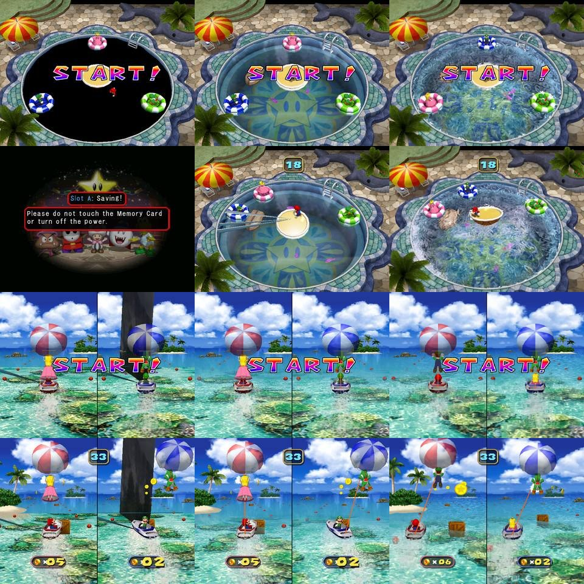
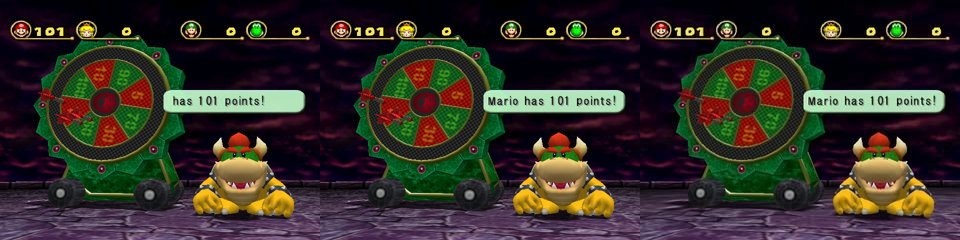

### 46.8 What M31 shipped, and the table of what is left

| shipped, with a witness | |
|---|---|
| **the stack multiplier's default is 2** (Makefile, port.h, os_misc.c, the machine check's applied-settings line) | soak 21: 7 h 19 min, five boards, 144 plays, no `stack overlap error`, no fault (§46.1) |
| **twenty SDK bodies that were stubs** — `C_QUATMultiply/Normalize/Inverse`, the `PSQUAT*`, `PSMTXQuat`, `PSMTXTranspose`, `PSMTXMultVecSR`, `PSVEC*` forwarders (psmtx_c.c), `GXProject` (gx_state.c), `GXUnknownu16` (gx_draw.c + patches.txt) | m417 plays to +2014 with Mario on the raft; m430's column gone; m428 and m427 pixel-identical (§46.2); 6 stubs left, none in a game's play but `GXSetZTexture` |
| **the scalar-in-alpha fold** (`regchain_plan`'s carry, `--nocarry`, the planner tracking GL's PREVIOUS) | m417's water blue over the floor; the three md5s unchanged with and without (§46.3, §46.6) |
| **`portMessTag` leaves an id an id** (os_arena.c) | m435's bubble names the player (§46.5) |
| `--forceobj NAME[:flags]` (a diagnostic), `compare_m31.py`, `gallery_pull_m31.sh`, `m31_chain.sh` | |
| soak 21 read, the disk note, `docs/soak/m31-*`, `docs/screenshots/m31-*`, the regenerated `compare.html` rows | |

**The table of what is left** (§45.11's, after M31):

| cause | games | M31 |
|---|---|---|
| B water | m405 | minor: the caustic is the indirect warp — not started |
| C scenes | m417 | **the play fixed** (the quaternion stubs), **the water drawn** (the fold); minor: the indirect warp, the +1200 streaks (§46.3, snapshot named) |
| C scenes | m408 | minor: the tunnel's white cap — not read |
| D column | m430 | **fixed** (`GXUnknownu16`) |
| I spheres | m435–m437 | read further, not drawn (§46.4, snapshot named): the next read is the transform |
| J text | m435's name **fixed**; m457's bubble is timing; the card titles' last glyph not read |
| E faults | m459 | ×2 is the default now |
| A's leftover | m457's ring shadows | not started |
| new | m428's team pairing under `--com4` differs from the console's pokes (a harness thing, §46.2) | not started |

**What M32 starts with**: the leave-behind soak (§46.9); m435's sphere
from its snapshot with `--forceobj` / a `--skipobj` twin and the
program's output; m417's streaks from `snaps/lib/m417-streaks-f016000.snap`;
m405's warp and m408's cap; the character select's render-thread wall
(§44.8).

### 46.9 What is left running

`g4 run --soak --com4 --rtc dolphin --freshcard --realtime --snap-every
5000 --snap-keep 3 --status --ovllog --stuckwatch 200 --perf` on the final
build (`be468f84…`; its turbo walk reproduces the three md5s), from
07:59 G4 time — the stack multiplier at its new default of 2 (the
applied-settings line says so), the twenty bodies live, the fold on.
Read it first: the `stack overlap error` line stays the witness (none
expected), `rt N ms dec M` on the status lines as §46.1's, the stub
report at the end should list six or fewer names with `GXSetZTexture`
the only one a play can reach, and m417 — when the roulette deals it —
should leave the module at +2000 or later.

## 47. M32 log: packaging *(2026-09-21, littlejelly)*

M32's brief was the v1 candidate: the bundle a player double-clicks on a
clean G4, the defaults for players rather than soaks, and the disk image
with its Read Me — the milestone M25's groundwork (§40.6) was written for.
The soak M31 left was clean and short (§47.1). The first-run walk was done
on the G4 as a player would do it, through the real chooser with a real
click, from an empty home (§47.2), and found four things thirty milestones
of runner launches never could: LaunchServices passes `-psn_0_NNN` to a
double-clicked application and the parser refused it; F12 is Dashboard on
Leopard; SDL 2.0.3 minimised the fullscreen window on that focus loss
with nothing to bring it back; and Cmd-Q as a keystroke is not the
menu's Quit. The defaults are a table (§47.3), the disk image is built by
`port/tools/make_dmg.sh` on the G4 (§47.4), and the leftovers are what
§47.5 says.

### 47.1 The soak, read

§46.9's leave-behind — `g4 run --soak --com4 --rtc dolphin --freshcard
--realtime --snap-every 5000 --snap-keep 3 --status --ovllog --stuckwatch
200 --perf` on the M31 build (`be468f84…`), the first soak with `--stackmul
2` as the default and the twenty SDK bodies live — ran 07:59 to 08:41 G4
time and was ended through `g4 key esc` for the milestone (the packaging
needed the machine): **42 minutes, 152,340 frames, 2,539 status lines**
(`docs/soak/m32-soak22-m31-leave.log.gz`, `soak_read.py`).

| | |
|---|---|
| speed / presented fps | **100.1%** mean (`machine ok`, `cpu 2` on every line); 28.0 fps overall; the board's `w01dll` turns 28.5–29.5, `rt` 15.1–16.8 ms, `dec` 5.1–6.6 |
| where it got | board 0, turn 13 of 20 when stopped |
| minigames | 16 plays of 13 modules, **M25's order to the module** (m412 m428 m420 m444 m423 m438 m429 m444 m430 m406 m416 m405 m438 m431 m422 m410): the deterministic replay holds across M31's twenty bodies and the fold; presented fps 19.7 (m431, the §32.4 shape) to 29.7 |
| `stack overlap error` / faults / guard hits / mismatches / STUCK / resyncs | **none / 0 / 0 / 0 / 0 / 0** — `late worst 743.7 ms` (the first board load) and no resync at all |
| stalls | 97 `stall:` lines, none over 424 ms: the 250 ms ones every 5,000 frames are the snapshot's copy at the retrace (`--snap-every`), the rest module links (`dll`) and the results screen's card copy |
| render thread | mode 3; replay 15.5 ms mean a presented frame; decode 37.6 M runs, **0 late**; gate 3,763 waited (worst 14.4 ms), 6,095 busy; ring waits 0 |
| card / DVD | flushes 186 ms on the game thread in all, worst 40 ms behind; `DVD: 925 reads, 0 over 100 ms` |
| rss / tex | 82–183 MB; 709 entries / 40 MB |
| the stub report | **one name**: `THPInit 3` (the movie) — of M31's six, the only one a boot reaches |

Nothing to fix; the build under it is the build M32 packages, with the
port-side changes below and no change to game behaviour.
### 47.2 The first-run walk, as a player gets it

The bundle is `MarioParty4.app` from `make_bundle.sh` (§40.6's plist with
`CFBundleShortVersionString 0.9`, `CFBundleVersion 32`, and an icon —
`resources/MarioParty4.icns`, a die face drawn by `tools/gen_icon.py`, no
artwork of the game's). A player's first run is a Finder double-click on
a Mac that has never seen the port, so the walk was done that way: **a
fresh home.** `~/MarioParty4-fresh.app` on the G4 is a wrapper whose
executable is a three-line shell script (`export
HOME=/Users/zach/mp4-fresh-home; exec ~/MarioParty4.app/Contents/MacOS/isle
"$@"`), launched with `open` from ssh, which is a LaunchServices launch —
the Dock icon, the foreground activation and the `-psn` argument of a
double-click. Nothing in `/Users/zach/Library/Application
Support/MarioParty4` was touched (witness §0u). The same walk was first
run on the MacBook (its `screencapture` works from ssh), which is where
the four findings were made and fixed before the G4's turn.

**The walk, in order, on the G4** (build `8a9b6eb5…`, which differs from
the final `2a52c786…` only in §47.5's diagnostics — the `--forceobj` bits
and two drawlog lines; the first run's log is `~/mp4-fresh-run1.out` on
the G4):

1. **The machine check** ran before anything else — `verdict ok`, the
   applied-settings block, `coroutine stacks x2` — and, on an `ok`
   machine, showed no dialog. The `unsupported` refusal and the
   `degraded` first-run message are §40.6's dialogs unchanged, witnessed
   again on this build through `--fake-machine` (§47.2b), and the
   real refusal on the MacBook under Rosetta, at two levels: the
   Finder's own ("cannot be opened because it has an incorrect executable
   format", `LSRequiresNativeExecution`) and, with the key removed, the
   port's dialog with exit 2.
2. **The chooser**, once. The image search (`$MARIOPARTY4_IMAGE`, the
   bundle's Resources, the config, `~/MarioParty4/`) runs *after* the
   check now (`main.c`; it ran before, so an unsupported Mac would have
   been asked for a disc before being refused), finds nothing in the
   fresh home, and puts up the Navigation Services dialog:

   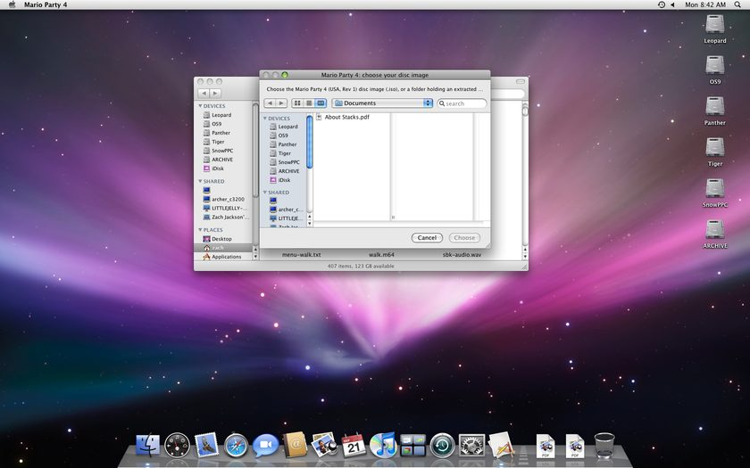

   Driven end to end for the first time (M25 could not, §40.6): a
   wrong file first — `~/isle-log.txt` — which the new check in
   `image_looks_right` (the game id `GMPE01` in the first six bytes of an
   image, a `files/` tree in a folder) refuses with a notice and asks
   again:

   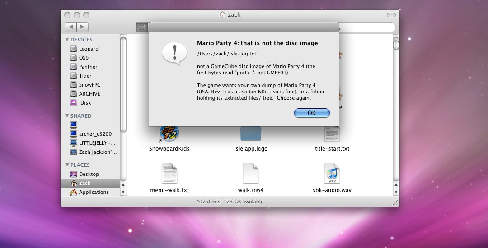

   then, after a real click into the dialog (a Quartz mouse event: the
   second dialog has no key focus until something clicks it, §0u),
   ⌘⇧G with the path, and a real click on Choose:

   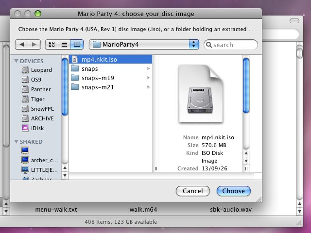

   `port> config: disc image /Users/zach/MarioParty4/mp4.nkit.iso (chosen;
   remembered)` — and the second launch (step 7) read `(remembered)` and
   showed no dialog.
3. **Application Support created on the first run**:
   `~/mp4-fresh-home/Library/Application Support/MarioParty4/` with
   `config` (`fullscreen = 1`, the `machine` summary, `image = …`),
   `memcard-slot-a.raw` (`new, formatted, 59 free blocks`, flushed on its
   thread `74 ms behind the game … frame 1`), `MarioParty4.log` and the
   `.metadata_never_index` marker. The fresh home had no `Library` and no
   `Desktop`; the port makes every level now (the MacBook's first pass
   found `cannot write …/config`).
4. **Fullscreen, letterboxed, by default**: no `fullscreen` key in the
   config means a first run and the key is written as `1` — the
   Snowboard Kids convention ("a first run comes up fullscreen"). `1680x1050,
   the picture at 1400x1050 from (140,0), scale 2.188`:

   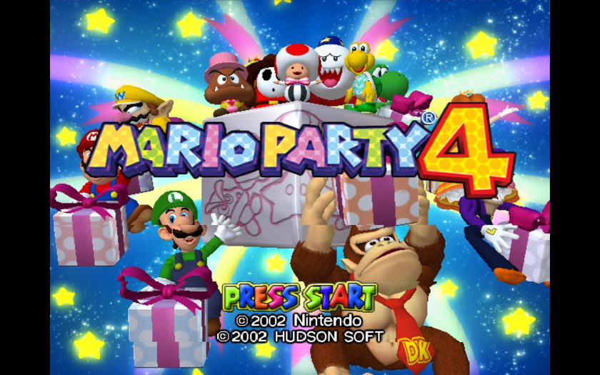

   `--noconfig` stays windowed unless `--fullscreen` is given (every
   chain and every md5 walk passes `--noconfig`), and the G4's own config
   carries `fullscreen = 0` since M25, so the lab's runs are as they were.
5. **The pad and the keyboard.** `PADInit: controller 1 = Xbox One
   controller (045e:02ea)`, and the keyboard is polled *beside* the pad
   now (pad.c: buttons OR'd, the keys' sticks when the pad's rest), where
   before M32 a plugged pad silenced the keys. A held Return (`key.py 36
   0.3`) reads `btn 1000` under `--paddbg` and takes the title to SELECT
   A FILE in fullscreen; the keys are §47.3's table (`--keys`).
6. **F5 / F12** wrote `~/mp4-fresh-home/Desktop/Mario Party 4 04534.png`
   (`png_write.c`, 922 KB, 640×480, no zlib; `Pillow` decodes it) —
   the first F12 opened Dashboard instead (§47.2a).
7. **Cmd-Q** as a keystroke: `reset requested: handing it to the game's
   own reset path` → `OSResetSystem: the game finished its reset path
   after 3977 watcher ticks; quitting cleanly`, the reports written, the
   card image flushed and the writer joined in `port_card_report`, the
   Finder back within three seconds. The second launch came up from the
   remembered image straight to the fullscreen title with the existing
   card, and Start took it to the file select:

   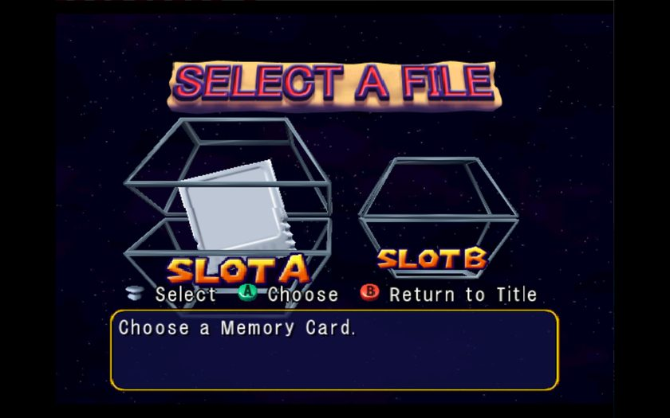

**Verdict: the app as a player gets it works, on the G4, from an empty
home, through the real chooser, on the final build.**

#### 47.2a The four things a runner launch never showed

* **`-psn_0_NNN`.** LaunchServices passes the process serial number as
  `argv[1]` to a double-clicked application (Leopard and Snow Leopard
  both); `port_parse_args` printed the usage and exited, and `open`
  reported `-10810`. Skipped now. Thirty milestones of `g4 run` (the
  runner execs the binary with its own arguments) never saw it.
* **F12 is Dashboard on Leopard.** The key never reaches the game;
  Dashboard came up over the fullscreen game, and SDL 2.0.3's default of
  minimising a fullscreen window on focus loss hid the game with no Dock
  icon to click (the wrapper's). `SDL_HINT_VIDEO_MINIMIZE_ON_FOCUS_LOSS`
  is 0 now — the window is a desktop-sized borderless one, so it simply
  stays — and the screenshot key is **F5 as well as F12** (the Read Me says
  why).

  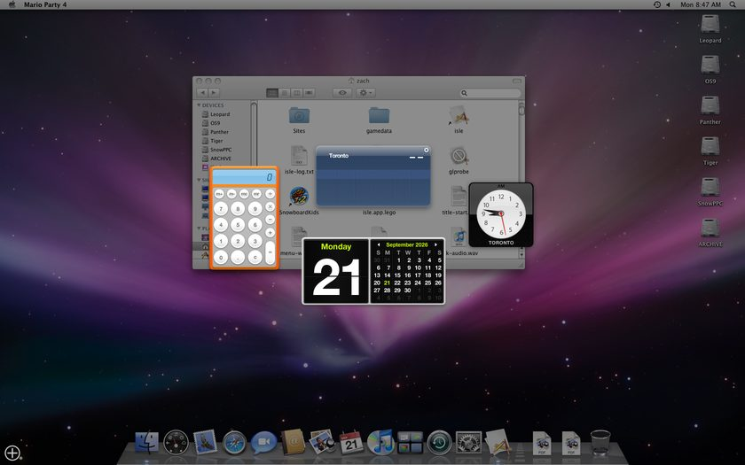
* **Cmd-Q as a keystroke.** The MacBook's System Events delivered ⌘Q as
  a key event and SDL raised no `SDL_QUIT` (the application menu's Quit is
  the route SDL wires); the event pump takes `SDLK_q` with `KMOD_GUI` as
  a quit too. Escape, ⌘Q and the close button all go through
  `gl13_quit_asked`: the game's own reset path, and — new — a second ask
  300 drawn frames later leaves through `port_shutdown` directly, for a
  screen whose loop never polls the watcher (none found; the guard is for
  the player who presses twice).
* **The chooser before the check.** `port_find_default_image` ran before
  `port_machine_check`; an unsupported Mac would have asked for a disc
  image and then refused. Reordered, and a cancelled chooser now ends in
  a notice ("no disc image … open the game again to choose it, or put the
  .iso in ~/MarioParty4/") and exit 0 rather than `port_fatal`'s silent
  exit — which itself shows a dialog now (`os_report.c`) when it fires
  with a window server.

#### 47.2b The dialogs on this build

`g4 run --fake-machine ~/machines/imac-g4-geforce4mx.txt --noconfig` (the
refusal, exit 2 after OK) and `--fake-machine ~/machines/g4-radeon9000-32mb.txt`
(the first-run message on a degraded verdict, then the game): §40.6's
two dialogs, on the M32 build, dismissed with `g4`'s
UserNotificationCenter key:

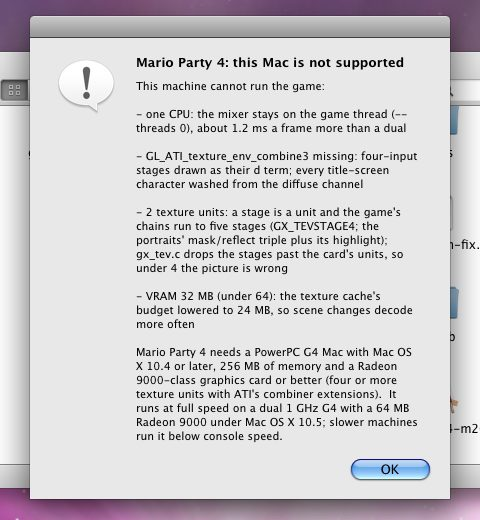
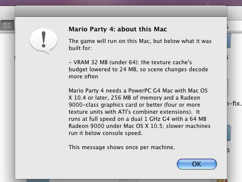
### 47.3 The defaults for players, not for soaks

What the shipped bundle runs with when double-clicked and nothing is on the
command line -- the `port> options:` block every log now starts with, and
what `--defaults` prints (§47.2 has the G4's block verbatim):

| setting | shipped default | where it is decided | the lab's soak differs by |
|---|---|---|---|
| pacing | `--realtime` (the retrace at 60 Hz on the wall clock, the picture at most every 2nd retrace) | `port_parse_args` (M17) | -- (the soak passes it explicitly) |
| workers (the mixer's second half, the snapshot writer) | on when `hw.ncpu > 1`; `--threads 0` on one core | `port_workers_init`, the machine check's applied line | -- |
| render thread | mode 3, overlapped, with the workers on; the inline twin (1) on one core | `rt_start` (M27) | -- |
| decode on the render thread | 2 (joined at the retrace) with a render thread | `rt_start` (M29) | -- |
| coroutine stack multiplier | ×2 | `PORT_PRC_STACK_MUL` (M31) | -- |
| texture budget | 40 MB; three quarters of the card, rounded down to 4 MB, under 64 MB of VRAM | `gx_tex.c`, the machine check's `applying --texbudget` | -- |
| audio | linear resampler, depop on, 100 ms lead under realtime | `port_parse_args` (M8c, M17) | -- |
| `--status` / `--perf` / `--ovllog` / `--snap-every` | **off**: nothing is printed a second, nothing is written every 5,000 frames | not given | all four on |
| the log | `~/Library/Application Support/MarioParty4/MarioParty4.log`, overwritten each run: the banner, the machine inventory, the options block, the boot narration, the reports at exit (the stub report last) | `main` (M25) | `~/isle-log.txt` through the runner |
| fullscreen | **on** for a first run (no `fullscreen` key in the config), remembered; `--windowed` / `--fullscreen` write the key | `main` (M32) | the G4's config carries `fullscreen = 0` from M25; `--noconfig` is windowed |
| the disc image | `$MARIOPARTY4_IMAGE`, the bundle's Resources, the config's `image`, `~/MarioParty4/*.iso`, then the chooser -- after the machine check | `port_find_default_image` (M32 moved it after the check) | `~/MarioParty4/mp4.nkit.iso` |
| the card | `~/Library/Application Support/MarioParty4/memcard-slot-a.raw`, created formatted on first run | `card_file.c` (M3) | `--freshcard` = `scratch-slot-a.raw` |
| F12 | a PNG on the Desktop, `Mario Party 4 NNNNN.png` by drawn frame (`--shotdir` redirects it) | `gl13.c`, `png_write.c` (M32) | -- |
| Escape, Cmd-Q, the close button | the game's own reset path (the fade, the card flush, `OSResetSystem` → `port_shutdown`); a second ask after 300 drawn frames leaves through `port_shutdown` directly | `gl13_quit_asked` (M32) | `g4 key esc` is the same key |
| pause | none of the port's: Start is the game's own pause inside a minigame, as on the console | -- | -- |

### 47.4 The disk image and the Read Me

`port/tools/make_dmg.sh` stages the folder the Snowboard Kids 1+2 PowerPC
Edition shipped in — the house style, read off the G4's copy of that
package (`~/Snowboard Kids 1+2 PowerPC Edition/`, its `Read Me.txt` and
its UDZO image):

```
Mario Party 4 PowerPC Edition/
    Mario Party 4.app        the bundle, renamed as the Finder names it
    Read Me.txt              port/dist/Read Me.txt
    Licences/                Mario Party 4 PowerPC Edition (the port).txt
                             MusyX (MIT).txt            = extern/musyx/LICENSE
                             SDL2 (zlib).txt            = panther-sdl2's COPYING.txt
```

and builds the image with `hdiutil create -format UDZO` — on the G4 over
ssh when run from littlejelly (the staged folder goes over as a ustar
stream, the image comes back through `ssh cat`; the G4 keeps `~/Mario Party
4 PowerPC Edition 0.9.dmg`), or locally on a Mac. **No game data, ever**:
the script refuses a bundle with an image in its Resources
(`--with-image`) and any staged file over 100 MB; the bundle it packs is
the one the lab installs, 9.0 MB unpacked (the executable, 99 REL bundles,
SDL2, the icon, the seven input scripts).

| | |
|---|---|
| name | `Mario Party 4 PowerPC Edition 0.9.dmg` (the version is `PORT_VERSION_STRING` in `include/port.h`, which the plist and `--defaults` read too) |
| size | **4,211,911 bytes** (4.0 MB) |
| md5 | `9d3b2640d18fc70e1adf06061b8518f0` |
| built | 09:46 G4 time, from the bundle whose `isle` is `2a52c786…` — the final build, the repository head's (§47.6 for its md5 walk); a first image at 09:06 from `8a9b6eb5…` (`87969984…`, 4,211,752 bytes) was the one mounted and photographed, and the `/Applications` copy was replaced from the final one |
| copies | `littlejelly:~/MarioParty4-PowerPC-0.9.dmg` (not committed), the G4's `~/Mario Party 4 PowerPC Edition 0.9.dmg`, `port/build-ppc-darwin/` |

**Installed as a fresh user would**: `hdiutil attach` on the G4, the
volume in the Finder, `cp -R` of `Mario Party 4.app` to `/Applications`
(the drag), the volume detached, and `open "/Applications/Mario Party
4.app"` — the real user's own config this time (`fullscreen = 0` since
M25, the image found in `~/MarioParty4/`), the title in its window, the
die icon in the Dock, Cmd-Q through the reset path:

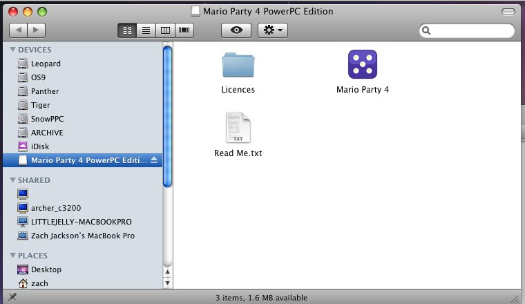
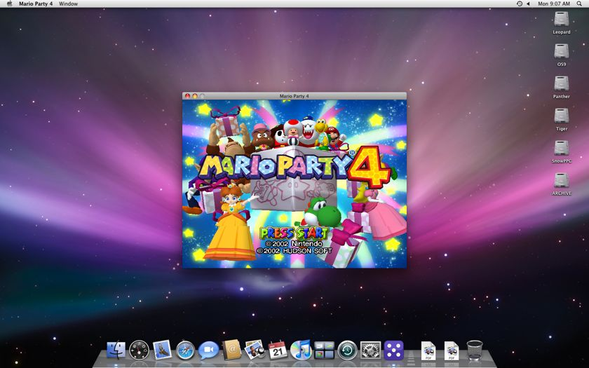

**The Read Me** (`port/dist/Read Me.txt`, 7.5 KB, the Snowboard Kids
Read Me's sections in its order): what this is; what it needs — the
requirements paragraph of `requirements.md` and the by-card table in
plain words, what the refusal and the first-run dialogs mean, that an
Intel Mac is refused; you bring the disc image (the chooser, the
`~/MarioParty4/` folder, `--image`; how to point it elsewhere); the
screen (fullscreen by default, `--windowed` or the config's key); the
controls (§47.3's tables, `--defaults` and `--keys` for a bug report);
where your things live (the card image, the config, the log); what is not
quite right yet — the seven `minor` rows of `compare.html` by name (Trace
Race's guide line, Mario Medley's caustic, Paratrooper Plunge's white
cap, Makin' Waves' ripple and streaks, the three Bowser games' pillar
spheres), the character select at about 20 fps, the skipped movies, one
card in slot A, controllers 2–4 absent; and the licence notes. The
repository's own README.md was not touched.

### 47.5 The leftovers

**The character select's render thread, measured** (`--perf --gxsplit
--rtsplit --perfwin 700-870:title,2600-3600:charselect --perfdump`, the
final build, realtime, windowed, `docs/soak/m32-charsel-rtsplit.log.gz`,
`m32-charsel-perf.csv.gz`): the window presents **19.4 fps**, skipping
677 of 1,001 retraces, with the game thread at 15.0 ms a retrace (game
8.8, gx 5.8) and the render thread at **28.9 ms of replay + 15.6 ms of
decode per drawn frame** (the CSV's 324 drawn frames: replay median 28.2,
p95 36.5; decode median 15.4) — 44.5 ms of second-core work per drawn
frame against 15 ms of first-core work, which is the wall §44.8 named,
now with its split: over the run **`--rtsplit` puts 87% of the replay
inside the draw records** (`draw 15,086 ms` of 17,429: `state` 3%, `tex`
3%, `present` 4%, `other` 3%), at 277,451 GL draws for 1,526 presented
frames — 182 draws a frame over the run and more on this screen, so
**about 80 µs a `glDrawArrays`/`glMultiDrawArraysEXT` on the Radeon's
driver**, not the state, not the textures, not the gate (85 waits, 237
ms). *The lever, in a paragraph:* the second core is doing two jobs in
series — decode ahead, then replay — while the first core idles 18 ms of
every 33; the port already has both placements as flags (`--rtdecode
0` = the decode on the game thread, the M27 shape; `2` = on the render
thread, M29's) and M29 measured them within 0.7 fps of each other
here, because either way one core carries ~30 ms and the other ~15. The
lever with headroom is to split the decode *by frame*: decode on the game
thread when its consumed frame finished early (it has 18 ms), on the
render thread otherwise — a per-retrace choice on the retrace's own
timing, no new machinery (both paths exist; the join point is the same
cursor). The ceiling is the balance: 1000 / max(15 + 15.6, 28.9) ≈ 32
presented fps against 19.4 today, and the same rule helps every minigame
whose `rt + dec` passed 33 in the soaks (m431, m444, m436). Fewer GL
draws is the other lever (the matrix palette, `--palette`, was measured
before the render thread existed and paid on the game thread; it is
worth one more A/B now that the game thread has the room), but the
per-draw driver cost is the driver's and does not move.

**m435–m437's pillar sphere, read further, still not drawn.** Two
diagnostics were added to `--forceobj` for it — bit 8 turns the blend
off, bit 16 forces the colour and alpha writes on — and the drawlog
prints the colour/alpha update flags and the *alpha* channel's control
(`alpha0 enable 0 matsrc 1 lights 01`, so the raster alpha is the
material's, 255). The bench (`~/m32/m435-blendoff` on the MacBook,
`--forceobj sphere1:15 --drawlog 4000 --drawlog-at 14544`, the M32
build): **with the blend off and every test off, the sphere still paints
no disc** — the frame differs from the baseline in 1,203 pixels, all of
them the star flare's and the crown's own pixels (they read the flags
through the same name and went opaque), and none in the sky between
them where a 70-pixel disc would be. So it is not alpha (§46.4's last
open reading) and not the blend. Read out of the same trace: the
sphere's view-space positions under `--cpuxf` project to a disc of
about 36 px radius centred near (527, 90) — where the console draws it —
under the *scene's own* projection (`persp [2.01184 0 2.41421 0 -1e-05
-0.1]`: near 0.1, far 10,000 — not a projection of its own, so not a
fold); the general decoder (`--olddecode3`) draws the same frame byte for
byte (and `--olddecode`, the pre-M9b cursor, faults on the bench now —
bit-rotted since the decode became a stream record, not worth reviving);
and the frame's draw order has *two* objects per pillar besides the flare:
one of 36 + 336 vertices with two texgens drawn in the main pass
(draws 48/49, named `sphere20` by the matrix-pointer lookup) and one of
48 + 128 in `Hu3DDrawPost` (draws 68–71, `sphere1`/`sphere20`). Which of
the two is the console's visible sphere is the next question, and the
read is a `--skipobj` twin of `--forceobj` on each (does the frame
change at all without the draw?) with `--dumptex` of draw 48's two
textures; after that, the bytes GL is handed for the 176 vertices at
issue time. The snapshot stands: `snaps/lib/m435-sphere-f015200.snap`
(the M31 gallery build; `--restore-lax`).

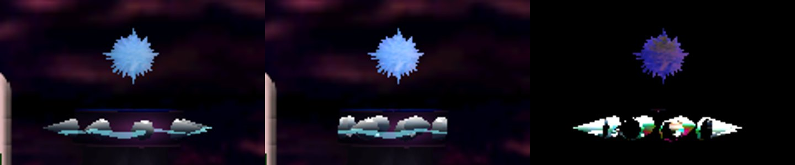

**m408's white tunnel cap, m417's streaks, m405's caustic**: not
started; the snapshots named in §46.8 stand (`m417-streaks-f016000.snap`),
and m405's and m417's warp is the one indirect-texture shape the port
has never drawn (§17), the same lever for both.

### 47.6 The md5s

The 9,000-frame turbo walk on both M32 builds (`8a9b6eb5…` in `~/m32/T`,
the final `2a52c786…` in `~/m32/T2` on the G4; `--noconfig`):

| frame | reference (M30/M31) | **M32** |
|---:|---|---|
| 800 | `0b58c5ee…` | `0b58c5ee1dee7b5da28a688c4fe315ce` |
| 3000 | `c58a046d…` | `c58a046d9ce6fabe3fef0b2270179203` |
| 7000 | `4a9a640c…` | `4a9a640c219e94b8c80460c84e019b97` |

Byte-identical on both: a packaging milestone changed no pixel.

### 47.7 What M32 shipped, and what it did not

| shipped, with a witness | |
|---|---|
| the first-run walk on the G4 from an empty home: the check, the chooser end to end (wrong file, real click, remembered), Application Support, fullscreen by default, the pad and the keyboard, F5, Cmd-Q, the second launch (§47.2) | seven screenshots, two logs on the G4 (`~/mp4-fresh-run1.out`, `~/mp4-fresh.out`) |
| the four Finder-launch findings fixed: `-psn`, F12/Dashboard and the minimised fullscreen window, Cmd-Q as a key, the chooser before the check (§47.2a) | the walk itself; the MacBook's first pass |
| `--defaults`, `--keys`, the options block on every log; the keyboard beside the pad, L/R/Z/C-stick keys (§47.3) | the MacBook's and the G4's prints |
| the disk image, `make_dmg.sh`, the Read Me, the licences; installed from the image and run (§47.4) | the mount, `/Applications`, the screenshots |
| the md5s unchanged (§47.6) | `~/m32/T` |
| the character select measured and its lever named; the sphere read further (§47.5) | the logs |
| the soak read (§47.1), `docs/soak/m32-*`, `docs/screenshots/m32-*`, witness §0u | |

**Not done, and why:**

* **The pillar sphere is still not drawn** (§47.5): four more levers say
  what it is not; the next read is the draw-order question and the
  bytes at issue time.
* **m408, m417, m405** (§47.5): not started in a packaging milestone.
* **The charsel's lever is named, not pulled** (§47.5): the per-frame
  decode placement is a speed change and gets its own A/B on the three
  scenes.
* **No icon artwork of the game's**: the die is a placeholder drawn by
  `gen_icon.py`; the Snowboard Kids apps carry box art the user made.
* **The Read Me is a `.txt`** like the Snowboard Kids one, not an `.rtf`.
* **Controllers 2–4** stay absent (the reference configuration since M3);
  a second pad is a feature, not packaging.

### 47.8 What is left running

`g4 run --soak --com4 --rtc dolphin --freshcard --realtime --snap-every
5000 --snap-keep 3 --status --ovllog --stuckwatch 200 --perf` on the
final build (`2a52c786…`, `~/MarioParty4.app`; the M31 bundle kept as
`~/MarioParty4-m31.app`) from 09:46 G4 time — the packaged code, the
lab's flags. The G4's own config carries `fullscreen = 0`, so the soak's
window is the window. Read it first: the same lines as §47.1's table,
plus nothing new — a packaging milestone's soak is a regression check.

## 48. M33 log: the Read Me's imperfections, one by one, and the character select's frame *(2026-09-21, littlejelly)*

M33's brief was the list a player is told about: the character select at
about 20 fps (§47.5 named its lever, the per-frame decode placement) and
the seven `minor` rows of `compare.html`, in the Read Me's own order,
each closed item to come off the list. The soak M32 left was short and
clean (§48.1). The lever was built and measured: **the character select
presents 23.4 fps from 20.0 with the decode split per drawn frame between
the two threads, the board and the title held** (§48.2), and `--rtdecode
auto` is the default with the overlapped render thread. The pillar sphere
of the three Bowser games was read to its cause (§48.3): **the sphere is
drawn, correctly, and the two cloud domes the game draws after it paint
over it**; on the console the flare's quad holds the clouds off with the Z
its alpha-killed fragments still write. A depth pre-pass reproduces the
console's frame on m435 but moves 105 pixels of the title logo that no
frame-exact console reference exists for, so it ships **off** (`--zprepass
2`) and the Read Me says so. m408's tunnel was read part way (§48.4) and
m404, m405 and m417 were not reached (§48.5). The second controller is a
paragraph (§48.6). The disk image is 0.9.1 (§48.7).

### 48.1 The soak, read

§47.8's leave-behind — `g4 run --soak --com4 --rtc dolphin --freshcard
--realtime --snap-every 5000 --snap-keep 3 --status --ovllog --stuckwatch
200 --perf` on the M32 build (`2a52c786…`, the packaged code) — ran 09:46
to 10:11 G4 time and was ended through `g4 key esc` when the milestone
needed the machine: **24 minutes, 86,940 frames, 1,449 status lines**
(`docs/soak/m33-soak23-m32-leave.log.gz`, `soak_read.py`).

| | |
|---|---|
| speed / presented fps | **100.0%** mean (`machine ok`, `cpu 2`); 27.9 fps overall; the board's `w01dll` turns 28.8–29.4, `rt` 15.1–16.6 ms, `dec` 5.3–6.8 |
| where it got | board 0, turn 7 of 20 |
| minigames | 10 plays of 9 modules, **M25's order** (m412 m428 m420 m444 m423 m438 m429 m444 m430 m406); presented 21.3 (m444) to 29.7 (m428) |
| `stack overlap error` / faults / guard hits / mismatches / STUCK | **none / 0 / 0 / 0 / 0** |
| resyncs | **1**: `stall: frame 80349 took 1444 ms (game 1434 gx 10 …)` inside m430, 349 frames after the frame-80,000 snapshot write — no `dll`, no free, no disc read over 100 ms, the module's own `X> Z>` OSReports around it; the shape of §44.6's `R2e` (a disk-bound frame of the game thread while the writer thread's 40 MB is still going to the shingled disk, §0t) under a lab flag the shipped build does not carry (`--snap-every`) |
| stalls | 61 `stall:` lines, the rest ≤ 425 ms: the snapshot copies every 5,000 frames, module links, the results screens |
| render thread | mode 3; replay 15.68 ms mean a presented frame; decode 21.4 M runs, **0 late**; gate 2,937 waited (6.8 s, worst 12.5 ms), 4,003 busy; ring 1 GPU wait (7 ms) |
| card / DVD | flushes 117 ms on the game thread in all, 374 ms behind (worst 39); `DVD: 580 reads, 0 over 100 ms` |
| audio / rss / tex | 120 underruns, 1.79 s; rss 82–179 MB; 627 entries / 40 MB |
| the stub report | `THPInit 3` only |

Nothing outranks the milestone.

### 48.2 The character select: the decode placed per frame

**What §47.5's arithmetic got wrong, before the lever.** It read the game
thread at "15 ms a retrace" and the render thread at 44.5 ms a drawn frame
and put the ceiling at 32 fps. The 15 ms was the *average over a
three-retrace cycle*; the CSV (§47.5's `m32-charsel-perf.csv.gz`, read
again) says the cycle is drawn 30.0 ms + consumed 6.9 + consumed 6.9 =
44.5 ms of game-thread work in 50 ms, against 28.2 + 15.4 = 43.6 on the
render thread — two threads each three-quarters full. A two-retrace cycle
(33.3 ms) is out of reach for the game thread alone (30.0 + 6.9 = 36.9
with *no* decode on it), so 30 fps is not this lever's; the whole work is
30.0 + 6.9 + 28.2 + 15.4 = 80.5 ms a drawn frame over two cores, 40.3 ms
each if perfectly balanced, **24.8 presented fps at best**, 20 today.

**The design** (`port/src/gx/rt.c`, `rt_auto_*`; `gx_draw.c`'s handover;
`vi.c`'s two calls): `--rtdecode auto` (3), the default with the
overlapped render thread. At every retrace `vi.c` hands the planner the
frame that just ended — drawn or consumed, and the game thread's seconds
on it from the previous retrace's exit to this one's entry, before the
retrace's decode join (a wait, not work). For a drawn frame the planner
keeps an EMA (½) of the game thread's drawn frame *less its own decode*
(`gd`), of the consumed frame (`cc`), and of the decode's cost per vertex
on each side (`rg` from its own timers, `rr` from the reader's
`st_last_dec_ms` over the vertices handed over — read at the next drawn
frame's start, when the gate has drained the reader, so the two numbers
are the same frame's). When the next frame is drawn it solves the
balance for the game thread's share `v` of the vertices:

```
gd + v·rg + cc  =  r + (V − v)·rr        →  v = (r + V·rr − gd − cc) / (rg + rr)
```

(`r` the reader's replay of the last frame, `V` the last frame's
vertices), clamped to [0, `--rtauto-max` 0.75], zero when the render
thread's frame `r + V·rr` is under `--rtauto-fit` 30 ms (two retraces
with margin: the board), zero under a millisecond. The share is spread
over the frame's runs by vertex count (a Bresenham accumulator in
`rt_decode_want`, so a share of a third takes about every third run's
worth rather than the first third of the frame). A run kept on the game
thread goes through the M28 loops as `--rtdecode 0` would, timed and
counted (`rt_decode_here`); a run handed over is M29's record. Exactness
is by construction — a run decoded on the game thread reads the arrays at
issue time, as every run did before M29; a run handed over keeps M29's
joins — and the md5s are the witness. `dec 9.9+8.6` on the status line is
the two halves; `gdec_ms` is the CSV's new column; the report's `auto`
line is the plan's last inputs and the season's split.

**The A/B** (`port/tools/m33_chain.sh` as `~/MarioParty4-chain.app`, one
binary `ebbf535b…`, the 16,000-frame real-time walk three times per arm,
medians by `m33_perfstat.py`; `docs/soak/m33-walk-*.log.gz`,
`m33-chain-index.txt`):

| arm | charsel: consumed | drawn (game / gx / rt + dec) | cycle | **presented** | board: drawn (rt + dec) | **presented** | title: drawn (rt + dec) | **presented** |
|---|---:|---:|---:|---:|---:|---:|---:|---:|
| `--rtdecode 2` (M29's default) `R2` / `R2a` / `R2b` | 7.37 / 7.48 / 7.39 | 26.8 / 27.2 / 27.1 (12.6 / 13.3 / **24.6 + 15.8**) | 3.0 retraces | **20.00 / 20.12 / 20.01** | 21.5 (15.9 + 7.9) | 29.79 / 29.76 / 29.69 | 21.5 (11.5 + 18.1) | 25.24 / 25.24 / 25.20 |
| **`--rtdecode auto`** `RA` / `RAa` / `RAb` | 4.61 / 4.60 / 4.54 | 33.7 / 34.1 / 33.9 (13.7 / 19.3 / **24.0 + 11.0**) | 2.6 | **23.41 / 23.03 / 23.51** | 21.1 (16.0 + 7.8) | **29.80 / 29.78 / 29.80** | 25.6 (15.5 + 10.5) | **25.52 / 25.48 / 25.50** |

**The character select: 20.0 → 23.3 fps** (+17%; the ceiling above is
24.8). The game thread's drawn frame took 6.9 ms of decode (gx 13.3 →
19.3), the render thread's decode fell 15.8 → 11.0, the consumed frame
7.4 → 4.6 (the gate's wait, §44.5, mostly gone), the cycle 3.0 → 2.6
retraces; over the walk the plan split 2,574 of 7,455 drawn frames (share
mean 0.34, max 0.75), 64 M vertices decoded on the game thread against
282 M on the render thread, `0 late`, speed 100.0%, no resync. **The
board holds the cap** (the dead band: its render thread is 23.8 ms) and
the title gains a quarter of a frame. The md5s hold on every arm: `T0`,
`T2`, `TA` and `TD` (the new default) on the M33 binary and `TDf` on the
final build all read **0b58c5ee / c58a046d / 4a9a640c**.

### 48.3 m435–m437's pillar sphere: drawn, and painted over

§47.5 ended with two objects per pillar and "the bytes at issue time".
Two diagnostics were built for it (gx_draw.c): `--skipobj NAME` (the
object's draws not issued) and `--probeobj NAME` (each of the object's
draws bracketed by a read-back of the viewport — pixels changed, their
box, the mean change — with the GL state the draw is issued under, the
array pointers and the first vertices' bytes; `--probeobj '*'
--probebox X0,Y0,X1,Y1` probes every draw that touches a box, printing the
depth at its centre after each). The first finding was the diagnostics'
own: `gx_last_posmtx_arg`, the pointer the object names come from, was
captured under `--drawlog` only, so `--forceobj` without it never matched
a draw — M32's runs all carried `--drawlog`; captured under the object
options now.

**The read, on the bench** (`~/m33/run.sh` on the MacBook, the M32 park
`--minigame m435 --ffto 14500 … --lockstep`, frame 14,498 = the first
drawn one, the same scene as §46.4's 14,544):

1. **The sphere lands.** `--probeobj sphere1`: the post-pass draw (48
   triangle + 128 quad vertices, the vertex-program path, `VERTEX_ARRAY
   size 3 type FLOAT stride 36`, the ring's bytes model-space positions of
   radius 65 with S8 normals of length 1.98 and the material colour 178
   178 255) **changes 3,907 pixels in the box x 484..557, y 374..442 (GL
   rows) by 45 levels mean** — a 73-pixel disc centred (520, 72) from the
   top, where the console draws the ball — and the read-back after it is
   the console's ball: dark blue, translucent, the plasma texture, on a
   *black* sky (`screenshots/m33-m435-sphere-probe-after-draw66.jpg`).
2. **Then the clouds paint over it.** `--probeobj '*' --probebox
   484,374,557,442` lists every draw that touches the disc after it: the
   flare (`sphere18`, 539 px, the star), then **`annun02` (model 18,
   2,301 px) and `annun03` (model 17, 4,480 px — the whole box)**: the two
   cloud domes (暗雲, the dark clouds; models 17–19 are m435's data 36–38,
   main.c:979–990), 2 TEV stages of two RGB5A3 cloud textures whose alpha
   is 255 but for a fade at the bottom row, `z test 1 write 0`, blend
   SRC_ALPHA/INV_SRC_ALPHA, drawn from `Hu3DDrawPost` after the sphere
   because the game's post list sorts by the object origin's distance
   from the camera (hsfdraw.c:306–314, `VECMag` of the drawobj's
   translation, far first): the domes' origins are 755 and 718 units
   away, the sphere's 1,833. The same code on the same data sorts the
   same way on the console. Skipping `annun03` shows the top half of the
   ball; skipping both would show it all.
3. **Why the console keeps the ball.** The sphere writes no Z (the
   material is translucent: `SetupGX` → `GXSetZMode(…, GX_FALSE)`), so
   nothing holds the clouds off — unless something drawn between them
   wrote Z under the disc. Forcing the sphere's own z write (`--forceobj
   sphere1:32`, a new bit; the mask emission in `gl13_apply_raster_state`
   read `gx.z_update` rather than the shadow and had to be fixed for it)
   brings the ball back but hides the flare inside it (the flare is
   drawn after the sphere and 100 units behind its front), which is not
   the console's picture either: the console shows the star *through*
   the ball. What is drawn between the sphere and the clouds is **the
   flare**: a 24-vertex fan, an octagon of radius 102 units (39 px, the
   ball's disc is 36), `z test 1 write 1`, additive, `alpha GEQUAL 128`
   on an IA8 texture whose *alpha* carries the star (2,085 of 16,384
   texels ≥ 128, `screenshots/m33-m435-flare-and-cloud-textures.png`).
   On GL the alpha test discards the fragment, depth and all; **on the
   hardware the fragment the alpha test kills still writes its Z**, so
   the flare's octagon lays a Z at 1,687 units under the whole ball, the
   domes behind it fail LEQUAL there, the ball stays, the star adds on
   top — and a black halo of the octagon's width shows around the ball
   where the clouds are held off, which the console frame has.
4. **The witness.** `--zprepass 2` (gl13.c `gl13_zprepass_*`, gx_draw.c):
   a draw with the z test and z write on and a live alpha test is issued
   twice, first with the colour writes and the alpha test off, then as
   itself — only when a bound texture's smallest alpha (`alpha_min`, kept
   per cache entry from the decode, per unit at the bind) can fail the
   test, so the game's `GEQUAL 1` idiom on an opaque texture costs
   nothing (432 draws doubled over the 50-frame bench run, 9 a frame,
   against 1,108 ungated; the two frames byte-identical). **The port's
   frame is then the console's**: the ball, the star through it, the
   clouds held off (`screenshots/m33-m435-sphere-console-port-zprepass.jpg`,
   `m33-m435-f014544-default-zprepass-console.jpg`).

**Why it ships off.** Dolphin gates this behaviour on `GXSetZCompLoc(GX_TRUE)`
(the early-Z hack in its pixel shader), and `--zprepass 1` is that rule —
and it changes nothing here, because the flare's material is textured
and hsfdraw.c sets `GXSetZCompLoc(0)` for it (traced: `GXSetZCompLoc`
from `FaceDraw+8516`, every textured object of the post pass; `(1)` only
for the two untextured tori). So either the hardware writes the Z late
too, or the oracle's frame came by a route this read did not find. On the
G4 (`TDz2`, `RDz2`) the ungated rule holds frame 3000 and moves **105
pixels of frame 800 (the title logo's letter edges, over the present's
ribbon) and one pixel of 7000** (`screenshots/m33-title-f00800-default-vs-zprepass.jpg`);
`port/ref/frames/title.png` is a different moment of the attract loop
and cannot say which is right, and §0's rule for a re-base is the
console's agreement. The lever is in the tree, off, documented in the
Read Me; the question for M34 is one frame-exact Dolphin capture of the
title at 800 (the sweep rig, §41b) — if the logo agrees with `--zprepass
2`, the default flips and the three Bowser rows come off the list. The
snapshot stands: `snaps/lib/m435-sphere-f015200.snap`.

### 48.4 m408's white tunnel cap: read part way

The bench at +1200 (`--ffto 15600 --frames 15700 --dumpframe 15677`,
the drawlog and `--cpuxf`; `docs/soak/m33-m408-drawlog-f015677.log.gz`):
the tunnel is two coaxial cylinders around the camera, `tutu` (筒, the
tube: 128 quad vertices, 2 stages, the cloud texture repeated six times
along it, z write off) and **`fusagi`** (塞ぎ, the plug: 128 quad
vertices, one stage, the same cloud texture, `z test 1 write 1`, opaque
RGB565), both from view z +5,900 (behind the camera) to −3,919, with the
island billboard (`rend_sima3`) at −8,800 beyond the open end and the
cloud blobs (`km_b`) and the gradient ring (`in`) at the end. **The white
octagon is `fusagi`'s far end seen from inside**: `--skipobj fusagi`
removes it (`screenshots/m33-m408-f015677-default-skipfusagi-console.jpg`)
and shows what it hid — a large tilted translucent yellow quad and the
island billboard, neither of which the console shows at this size
either. The console's frame at the same dump index is a *longer* tunnel
(the vortex converges to the island as a point), and its +2300 frame is
still falling where the port's has landed on the beach: the port's fall
runs ahead of the console's, so the pair is a timing question first (the
tube's motion or the fall's clock) and a rendering one second (whether
`fusagi`'s far end is meant to show as a disc at all: the vertices say
an open cylinder, the picture says a filled octagon — the winding or a
cap face the decoder folds). Not fixed; the Read Me line stays. No
snapshot was taken (the park reproduces it in 100 s on the bench).

### 48.5 m404, m405, m417: not reached

The budget went to §48.2 and §48.3. Trace Race's guide line, the
indirect warp (m405's caustic, m417's ripple, the mode-select bubbles —
§17's one shape, the `ATI_text_fragment_shader` question) and m417's
streaks keep their Read Me lines and their snapshots
(`snaps/lib/m417-streaks-f016000.snap`; m404 and m405 park in 100 s).

### 48.6 The second controller

Measured, not built. On the G4 one pad is on the bus (`ioreg -p IOUSB`:
the Apple keyboard's hub, a Dynex mouse, one `Controller` 045e:02ea) so a
second pad's enumeration could not be tried; the code says what would
happen: `pad_xone_open` (pad_xone.c) walks the IOUSB iterator until the
*first* Xbox One match and stops, `pad_sdl` opens the first joystick
`SDL_NumJoysticks` reports (`for (i = 0; … && joy == NULL; i++)`), and
`PADRead` (pad.c) fills `status[0]` only — channels 1–3 are
`PAD_ERR_NO_CONTROLLER` every retrace. A second Xbox pad would be seen by
SDL's joystick subsystem (it is initialised with `SDL_INIT_JOYSTICK`) and
ignored; a second pad of any kind through the IOUSBLib driver needs its
own device handle and state. Handing pad 2 to player 2 is a second
`PortPadRaw` source per channel and `status[1]` filled from it — about
forty lines across pad.c/pad_sdl.c, more for a second IOUSBLib pad — not
the ten-line mapping the brief allowed, so not built. The Read Me's line
stands.

### 48.7 The disk image, 0.9.1

`PORT_VERSION_STRING` 0.9.1 / `PORT_MILESTONE` M33 (the plist reads
0.9.1, build 33); the Read Me: 0.9.1, the character select "about 23
frames a second", the Bowser rows re-worded (painted over by the sky;
`--zprepass 2` shows them; why it is off). Built by `make_dmg.sh` on the
G4 from the final build `d1f5f8f9…` (its md5 walk `TDf`: 0b58c5ee /
c58a046d / 4a9a640c):

| | |
|---|---|
| name | `Mario Party 4 PowerPC Edition 0.9.1.dmg` |
| size / md5 | **4,220,871 bytes** (4.0 MB) / `86f62d4aa82c160f10cbb989e6d399ec`, built 12:22 G4 time |
| copies | `littlejelly:~/MarioParty4-PowerPC-0.9.1.dmg`, the G4's `~/Mario Party 4 PowerPC Edition 0.9.1.dmg`, `port/build-ppc-darwin/` |

### 48.8 The Read Me's list, before and after

| line | M32 | M33 |
|---|---|---|
| Trace Race's guide line | on | on (not reached) |
| Mario Medley's caustic | on | on (not reached) |
| Paratrooper Plunge's white cap | on | on (read part way, §48.4) |
| Makin' Waves' ripple and streaks | on | on (not reached) |
| the three Bowser games' pillar spheres | "not drawn" | "painted over by the sky", the switch that shows them named, and why it is off (§48.3) |
| the character select at about 20 fps | on | **about 23 fps** (§48.2) |
| intro movies skipped; one card; controllers 2–4 absent | on | on (§48.6) |

### 48.9 What M33 shipped, and what it did not

| shipped, with a witness | |
|---|---|
| **`--rtdecode auto`, the default**: the character select 20.0 → 23.3 presented, the board at the cap, the title +0.3 (§48.2) | six real-time walks, five md5 walks, `docs/soak/m33-walk-*` |
| **the pillar sphere's cause** (§48.3): drawn, painted over by the cloud domes; the flare's alpha-killed Z; `--zprepass 1/2`, `--skipobj`, `--probeobj`/`--probebox`, `--forceobj` bit 32, the object names captured under the object options, `alpha_min` per texture | the probe logs, the three-panel pairs |
| the tunnel read part way (§48.4), the controller paragraph (§48.6), the Read Me's list (§48.8), 0.9.1 (§48.7) | |
| soak 23 read (§48.1), `docs/soak/m33-*`, `docs/screenshots/m33-*`, witness 0v | |

**Not done, and why:** the sphere's fix is off (no frame-exact console
reference for the title logo's 105 pixels — §48.3 says what would flip
it); m408 is a timing question before a rendering one (§48.4); m404,
m405, m417 not reached (§48.5); the second controller is forty lines, not
ten (§48.6).

### 48.10 What is left running

`g4 run --soak --com4 --rtc dolphin --freshcard --realtime --snap-every
5000 --snap-keep 3 --status --ovllog --stuckwatch 200 --perf` on the
final build (`d1f5f8f9…`, `~/MarioParty4.app`; the M32 bundle kept as
`~/MarioParty4-m32.app`) — the first soak with the decode placed per
frame. Read it first: `dec A+B` on the status lines (B is the game
thread's share; the board should read `+0.0` and `30.0 fps presented`,
the character select and m431/m444 a share), the `auto` line of the
`render thread:` block, `late` 0 in the decode line, and the m430 frame
near 80,000 + 350 again (the snapshot writer's disk).

## 49. M34 log: the z pre-pass judged by the console, the IA8 byte, and the four ports *(2026-09-21, littlejelly)*

M34's brief was three things: the z pre-pass decision the console alone
could make (§48.3 left `--zprepass 2` off because 105 pixels of the title
logo had no frame-exact reference), the four remaining Read Me items in
their order, and controllers 2–4. The soak M33 left was long and clean
(§49.1). The console's title was captured at the port's frame 800 and
**disagrees with the ungated pre-pass on 103 of its 105 pixels** (§49.2):
the pre-pass's gate was wrong in principle (the hardware writes the Z of
an alpha-killed fragment only under `GXSetZCompLoc(GX_TRUE)`), and with
the right gate the pre-pass does nothing for the pillar sphere — because
**the sphere's cause was never the Z at all: the port had read every IA8
texel and every IA8 palette entry with its two bytes the wrong way round
since M3** (§49.3). One byte swap draws the three Bowser games' spheres
and takes the white cap off Paratrooper Plunge's tunnel (§49.5); Trace
Race's guide line was a TEV shape the combiner could not say without a
zero constant, plus the game's one `GX_CS_DIVIDE_2` (§49.4); the indirect
warp is one shape, recorded and not built (§49.6); **m417's streaks were
NaN water vertices — `sqrtf` of a negative rim weight, which MSL's inline
returns unchanged and libm makes NaN** — fixed for every game unit by a
`sqrtf` shim (§49.7). The pads are laid over the four ports
and witnessed with the keyboard as player 2 (§49.8). The Read Me's list is
two lines (§49.9); the disk image is 0.9.2 (§49.10).

### 49.1 The soak, read

§48.10's leave-behind — `g4 run --soak --com4 --rtc dolphin --freshcard
--realtime --snap-every 5000 --snap-keep 3 --status --ovllog --stuckwatch
200 --perf` on the M33 build (`d1f5f8f9…`, the first soak with
`--rtdecode auto`) — ran 12:22 to 13:25 G4 time and was ended through
`g4 key esc` when the milestone needed the machine: **63 minutes,
226,860 frames, 3,781 status lines**
(`docs/soak/m34-soak24-m33-leave.log.gz`, `soak_read.py`).

| | |
|---|---|
| speed / presented fps | **100.1%** mean (`machine ok`, `cpu 2`); 28.2 fps overall; the board's `w01dll` 29.3 mean over 1,905 lines (turns 1–18: 28.4–29.6), `rt` 15.9 ms, `dec` 5.5 + **0.0** |
| where it got | board 0, turn 18 of 20 |
| minigames | 25 plays of 24 modules, **M23's order** (m412 m428 m420 m444 m423 m438 m429 m444 m430 m406 m416 m405 m438 m431 m422 m410 m407 m421 m424 m436 m404 m427 m455 m401 m414); presented 20.5 (m416) to 29.7 (m428, m406) |
| `dec A+B`, the split per scene | the board `5.5 + 0.0` (14 of 1,905 lines with a share: the dead band holds); m444 `9.2 + 7.3` (71 of 126 lines split), m431 `8.9 + 6.8` (59/98), m423 `10.8 + 3.4`, m412 `9.1 + 2.7`; m436 `13.0 + 0.0` (its render thread is 21.8 ms: under the fit) |
| the `auto` line | 106,626 drawn frames planned, **17,834 split** (share mean 0.38, max 0.75); 549 M vertices decoded on the game thread (128 s) against 4,244 M on the render thread |
| `stack overlap error` / faults / guard hits / mismatches / STUCK | **none / 0 / 0 / 0 / 0** |
| resyncs | **0** (worst 710 ms behind the schedule) |
| stalls | 154 `stall:` lines, **all ≤ 508 ms** (frame 125,035, m431: `game 492`); the frame-80,000 snapshot write cost 260 ms and the m430 frame near it 427 ms (81,498: 68 textures decoded) — no repeat of §48.1's 1.4 s |
| render thread | mode 3; decode 47.5 M runs, **0 late**, 6.58 ms mean a presented frame; gate 101,606 drained, 4,195 waited (8.5 s, worst 13.5 ms), 1,109 busy; ring 0 GPU waits |
| card / DVD | flushes 334 ms on the game thread in all, 984 ms behind (worst 100); `DVD: 1352 reads, 0 over 100 ms` |
| audio / rss | 56 underruns, 808 ms; rss 82–185 MB |
| the stub report | `THPInit 3` only; at exit `pad: xone: read failed (e00002eb), controller gone` — the close aborting the reader's `ReadPipe`, as designed |

Nothing outranks the milestone.

### 49.2 The z pre-pass, judged by the console

**The capture.** The port's 800 is the title just after its logo scaled in
(`BootTitleExec`: the wipe-in, the 50-frame logo scale, then the wait for
START — the walk's 800 edge falls in the scale loop and 850 is taken).
The board-start schedule's console title lasts ~90 frames (START at GC
380), and the title's 3D is a carousel whose phase runs from *boot*
(`BootTitleCreate` before the logos, `HU3D_MOTATTR_LOOP`): the console
holds the logos on a wall clock and plays the movie, the port skips it,
so the two reach the title at different points of a **718-frame loop**.
`port/ref/movies/title-hold.txt` (START through the boot, nothing after:
`BootTitleExec` times out into the attract loop and returns) shows the
whole loop twice in 9,191 dump frames; a template match of the port's 800
against every one of them lands on **dump frame 8390 at 4.09 levels**
(9108 one loop later at 4.15; the card calibration's frame-exact pairs
match at 4.0–5.6). The frame is `port/ref/frames/title-console-8390.png`;
the rig and the calibration are in `port/ref/notes.md`.

**The verdict.** On the 105 pixels the two arms disagree on, the console
is closer to the default on **103** (sum |Δ| 4,142 against 35,930;
`screenshots/m34-title-f00800-default-zprepass-console.jpg`, the ribbon
crop `m34-title-f00800-ribbon-crop-default-zprepass-console.png`). The
pixels are not the logo's letters: they are a **seam of pale yellow (the
glow behind) between the present's pink ribbon and its grey lid** under
the logo's edge, which the console does not have. **`--zprepass 2` loses.**

**Why the pre-pass moves them** (the brief's condition before deciding):
`--probeobj '*' --probebox 150,228,200,252` on the bench, both arms
(`docs/soak/m34-title-probe-ribbon-*.log.gz`): the draws that touch the
box are the sky sprite, `obj2` and `PartyCube` (alpha `GEQUAL 1`), then
**`obj6` and `obj5`** of the character model with `alpha GEQUAL 128 OR
GEQUAL 128, z write 1, comploc 0`. `obj6` changes **645 pixels in the
box on the default and 612 under the pre-pass**, `obj5`'s second draw 49
against 43: the pre-pass writes Z for `obj6`'s *own* alpha-killed
fragments where they lie in front of its opaque ones (a cut-out mesh that
overlaps itself), the colour pass then fails LEQUAL there, nothing paints,
and the glow shows through. The Intel bench shows the same 111 pixels, so
it is the mechanism, not the Radeon's Z. It is not a texture the gate
misjudged: the gate was **wrong in principle** — every textured object of
`hsfdraw.c` is drawn under `GXSetZCompLoc(0)` (late Z: the Z test and
write after the texture and the alpha test, so a killed fragment writes
no Z), and the hardware — and Dolphin, which puts `early_fragment_tests`
on only under `early_ztest` — writes the Z of a killed fragment **only
under `GXSetZCompLoc(GX_TRUE)`**. That is `--zprepass 1`, M33's "Dolphin's
rule".

**The gate, fixed and made the default.** `--zprepass 1` is the default
now (`port_opt.zprepass = 1`; `0` never, `2` the ungated rule, kept for the
A/B), and the gate asks one more thing: the stage that binds the texture
must read `TEXA` in its alpha chain at all — the board's balloons
(`kinobaloon`) bind their I8 hilite map (alpha_min 0) to a stage whose
alpha is `A0 × APREV`, and were doubled 34 times a frame for nothing
(`docs/soak/m34-board-f07000-drawlog-zprepass1.log.gz`; the drawlog prints
`z pre-pass: issued depth-first` on a doubled draw now). On the G4 the
ZCompLoc gate is **md5-identical to the default on all three scenes**
(`TDz1`: 0b58c5ee / c58a046d / 4a9a640c, 18,622 draws doubled over the
9,000 frames before the TEXA condition, the title 0 of them) and costs
nothing measurable (`RDz2` in §48 was already within 0.1 fps of `RD`).
And **it does nothing for the pillar sphere**: `--zprepass 1` at m435's
14,544 is byte-identical to the default on the bench
(`39498f48…` both; `--zprepass 2` `7d5c142b…`), as §48.3 said — which is
what sent the read back to the sphere itself.

### 49.3 The pillar sphere's cause: the IA8 byte order

§48.3's mechanism needed the flare's alpha-killed fragments to write Z
under `ZCompLoc(0)`, which nothing does. What the flare's texture *is*
was in §48.3's own picture (`m33-m435-flare-and-cloud-textures.png`): the
port's decode of it has a **flat 192 intensity plane and the star in the
alpha** — an odd thing for an artist to paint, and the wrong way round.
GX's IA8 texel is `AAAAAAAA IIIIIIII`: the alpha in the high byte, as
IA4's is in the high nibble (which the port had right); `gx_tex.c` read
`v >> 8` as the intensity and `v & 0xFF` as the alpha since M3, and the
`GX_TL_IA8` palette entry — the same layout — the same way. Read the
hardware's way the flare is **a star of intensity under a flat alpha of
192**, so on the console the whole octagon passes `GEQUAL 128`, writes its
Z (comploc or not: the fragments are not killed), and the cloud domes
drawn after it fail LEQUAL under the whole ball — the black halo of the
octagon's width §48.3 saw on the console and tried to explain with a
rule. The port killed everything but the star's texels, wrote Z under
the star alone, and the domes covered the rest of the ball.

**The fix** is two byte swaps in `gx_tex.c` (the IA8 texel, the IA8
TLUT entry) and the demo's test texture (`gxdemo.c`). **On the bench**
m435's 14,544 draws the two balls on their pillars, the star through
them (`screenshots/m34-m435-f014544-before-after-ia8.jpg`); on the G4 the
gallery rows of m435–m437 are in §49.11. The three md5 scenes carry no
IA8 texture: `TD` on the fixed build reads **0b58c5ee / c58a046d /
4a9a640c**, unchanged. The pre-pass was a red herring; the Read Me's
three Bowser lines come off.

### 49.4 m404 Trace Race's guide line: a lerp with no zero constant, and a half

The line is not a `GX_LINES` at all: `m404Dll/main.c` `fn_1_58E4` is a
model hook that draws one 3000×200 quad from a display list the module
records at setup (`fn_1_6248`: `GXBegin(GX_TRIANGLESTRIP, …, 4)` with
direct positions and texcoords), twice — first with the guide image
(`HuSprTexLoad`, a 960×64 I8, a black wavy line on white:
`--dumptex` on the bench, `tex-054-960x64-fmt1`) as `colour = RASC`
with **`GX_CS_DIVIDE_2`** and **`alpha = (KONST, ZERO, TEXA, ZERO)`** =
`KONST × (1 − TEXA)`; then with the players' 960×64 I8 canvas as
`alpha = A0 × TEXA`. The drawlog of the hook's draw (`m34-m404-drawlog-
f014537-hook-fault.log.gz`) says the state is exactly that, the texture
is right, the geometry lands where the lane is, and nothing paints.

**Cause 1** (`gx_tev.c`, `emit_channel`): `lerp(a, 0, c)` with `d = 0`
went to `GL_INTERPOLATE` with its `b` a *black constant*, which claimed
the unit's one `GL_TEXTURE_ENV_COLOR` alpha first; `a = KONST` (1.0) then
"collided" and lost (`TEV: a stage needs two different constants; the
first wins`), so the line drew with alpha `0 × (1 − TEXA) = 0`. The shape
is a modulate by the complement — `a × (1 − c)` as `GL_MODULATE(a, c with
ONE_MINUS_*)`, no constant needed (`lerp(a, 0, 0) = a` is a `REPLACE`).
**Cause 2**: `GX_CS_DIVIDE_2` has no GL scale (1, 2, 4 only) and was drawn
at 1 with a warning; the game's one use is this line, a one-term stage,
which halves as `GL_MODULATE(term, a 0.5 constant)` — the constant's RGB
half is free when the term is not a constant. **After**
(`screenshots/m34-m404-f014537-before-tev-div2-console.jpg`): the lane
carries each player's dark wavy line as the console's does.

**Found on the way — the drawlog and the probe fault on a hook's draw
(the bench only, so far).** `--drawlog` and `--probeobj` name a draw's
object through `port_drawobj_name(gx_last_posmtx_arg)`, which treats the
matrix pointer as a `DrawObjData` entry; a hook's matrix is a stack
`Mtx`, and the run died with `signal 11 at address 0x0, pc 0` at the
hook's draw, four runs out of four under Rosetta. Two guards went in
(the object pointer must lie in MEM1; a matrix inside the game's own
mmap — the stack, MEM1 — cannot be a `DrawObjData` entry) and the drawlog
prints the name and the caller *last*, so the draw's state is on the log
before the lookup runs — and the fault stayed, at the same draw, after
the state. It is in the lookup or in `dladdr` on the hook's return
address and it is not resolved; the G4 has never run a drawlog on m404.
Not a shipped path. `docs/soak/m34-m404-drawlog-f014537-hook-fault.log.gz`.

### 49.5 m408 Paratrooper Plunge: the fall is the play, the cap was the IA8 byte

**The timing** (§48.4's "the port's fall runs ahead"): the fall is a
frame count (`lbl_1_bss_54 -= 400/60` a frame from 12,000, `main.c:287`),
the intro before it is frame counts (the plane's four states, the
camera's drop to 12,010 at `-400/59.999995` a frame), and the walk's
inputs are the COM's; the module ends when the height reaches 200 **or
when every player is out** (`lbl_1_bss_4C == 0`: a player with no
balloons left after the others have hit him). The console itself does
not repeat: M26b's capture left the module at entry **+2,742** GC, this
milestone's recapture (`~/mp4-sweep-work/frames/m408m34`,
`docs/soak/m34-m408-oracle-recapture.json`) at **+2,422**, the port at
+2,493 — the play, not the clock. Put side by side at the same frame
after the link (`screenshots/m34-m408-timeline-port-vs-console-L+629..
1529.jpg`: the port's 15,100–16,000 every 100, the console's L_c 10,627 +
the same offsets, L_c from the card→module white 10,623–10,628): **the
START banner rises on the same frame on both**, the tunnel opens on the
same frame, the balloons drift apart by the play. There was never a
timing fault; §48.4's "longer tunnel" was the cap.

**The cap.** `fusagi` (the plug) is two draws: the 128-vertex open
cylinder (radius 1,500, ±50,000 along the axis, the cloud texture six
times along it; **292,593 of 307,200 pixels change when it draws** — the
whole screen but the 62-pixel hole at the far end, which is right) and a
**4-vertex 3,000×3,000 quad at the far end** (`--probeobj fusagi`,
`docs/soak/m34-m408-scenelog-fusagi-probe-before-ia8.log.gz`: 2,789
pixels — the hole), a two-palette material (`hsfdraw.c:1009`, `texCol
[0].a == 2`): the same CI8 image through TLUT 0 and TLUT 1 with the swap
tables `SWAP1 = (R,A,A,A)`, `SWAP2 = (B,B,B,A)`, additive, its alpha
**`TEXA × KONST` from the second palette**. Both palettes are `GX_TL_IA8`
— read backwards, the plug's alpha was its palette's intensity, bright,
and the far end filled with white. With the byte order fixed the plug is
what its alpha says, the tube converges to the island as the console's
does (`screenshots/m34-m408-f015677-before-after-console.jpg`), and the
line comes off the Read Me.

### 49.6 The indirect warp: one shape, recorded, not built

The three forms the brief named, read: **m417's ripple** (`water.c:809`):
three indirect stages, all sampling the same bump map (`TEXMAP1` through
`TEXCOORD1`, a normal-based texgen) and warping TEV stages 0, 1, 2 and 3
with three 2×3 matrices (scales ∓0.5, 0.5, ∓0.65; exponents −2, 0, −3).
**m405's caustic** (`main.c:978`): two indirect stages, each its own map
and texgen (`TEXCOORD2/TEXMAP2`, `TEXCOORD3/TEXMAP3`), warping stages 0
and 1 (scales ∓0.2, 0.5; exponents −2, 0). The **mode select has no
`GXSetTevIndWarp`** — its window backgrounds are the tile form (§14.1,
composed on the CPU); the other users of the warp are m410, m423, m427,
m430, m434, m442, m455, m456 and `modeltestDll`. Every site is the same
call: `GXSetTevIndWarp(stage, indStage, GX_TRUE, GX_FALSE, GX_ITM_n)` with
`GXSetIndTexCoordScale(ITS_1, ITS_1)` — signed offsets, no replace, the
direct stage's texel coordinate offset by `M_n · texel · 2^exp`. **One
shape.** What it would take on `GL_ATI_text_fragment_shader`: a
`!!ATIfs1.0` program per (number of warped stages, matrices) with a
prelim pass that samples the indirect map(s) into registers and forms the
offset coordinates (`MAD` by the matrix as constants, the offset scaled
into the direct map's texel space by its size), and an output pass whose
`SampleMap r, rN.str` dependent reads fetch the warped direct maps and
combine them by the stage's TEV inputs (m405: `TEXC0`, then `+ TEXC1 ×
A0`; m417: five stages, the fifth a register mix) — inside the R200's 6
samples, 2 passes of 8 instructions and 6 constants. **Not built this
milestone**: the extension exists on the G4 alone (the bench's Intel
driver has no `ATI_text_fragment_shader`), so every iteration of a new
fragment path is a G4 run, and the G4's day went to the gallery, the md5
walks, the pad witness, m417's cause (§49.7: eight G4 arms) and the soak.
The brief's condition ("if one shape, build it behind `--tfs`") is met on
the reading and not on the build; it is the first item of the next
milestone, with the program shape above as its spec. The two Read Me lines stay, with the
shape named; the snapshots (`snaps/lib/m417-streaks-f016000.snap`) and
the parks (m405, m417 in 100 s) stand for the next milestone.

### 49.7 m417's streaks at +1200: NaN water vertices, from a `sqrtf` of a negative number

**What they are.** The gallery of the first M34 build (§49.11's first
pass) still had M31's fan of thin light quads from the raft toward
Luigi's tube at 15,677 (`screenshots/m34-m417-f015677-streaks-before-
after-console.jpg`, the zoom `...-zoom-...`). On the G4 they are
**deterministic and machine-bound**: the default, `--norenderthread
--lockstep`, `--noaltivec` and `--cpuxf` all give the byte-identical frame
`5e10a412…` (`~/m417ab.sh` on the G4: the arms `S417`, `S417nrt`,
`S417noav`, `S417cpu`), `--skipobj luigi_m2` keeps them, and the same
binary on the mbp bench has none — so neither the render thread, nor
AltiVec, nor the vertex program, nor the character. `--skipverts 2048`
(new: the diagnostic a hook's draw needs, having no object name) leaves
the frame byte-identical, so not the splash particles either. The fan
converges on **the screen centre**, which is where a Radeon puts a
vertex whose clip w is 0 or NaN (the Intel driver drops the triangle):
the picture of a NaN position.

**The probe found it.** `--probeobj '*' --probebox 60,190,300,290` with
the new `--probeverts 2100` (the probe printed six vertices; it prints
up to N now) over 15,674–15,677 on the G4 (`--norenderthread`: under the
render thread the game thread's read-back has no context, viewport
0 0 0 0), `docs/soak/m34-m417-probe-water-nan-f15674-15677.log.gz`: the
2,083-vertex draw in 35 strips is **the water surface** (`water.c`
`fn_1_604C`: 18 strips of 60 + 17 of 59, named "para-c" by the lookup
because a hook's matrix has no object), and its positions as bound carry
**NaN**: none at 15,674, 2 at 15,675, 6 at 15,676, 10 at 15,677 — grid
vertices (13,3), (16,2), (18,2), (20,2)…, one new rim vertex a frame
along the path of the wave Luigi's pound sent out, not a spreading
front. The 355-draw `--drawlog` at 15,677 (`m34-m417-drawlog-f015677.log.gz`)
has no zero or NaN matrix, so it is the data.

**The cause** is in the mesh build, `water.c:352-358` (`fn_1_3D58`): a
vertex at radius r ≤ 850 gets the rim weight `unk_24 = sqrtf((750 − r)
× 0.01f)` when `750 − r < 100` — **the square root of a negative number
for 750 < r ≤ 850**. On the console `sqrtf` is MSL's inline
(`include/dolphin/math.h`: `if (x > 0.0f) { frsqrte, three Newton steps }
return x;`), which **returns the argument itself for anything not
positive**: those rim weights are small negative numbers (−0.0…−1.0),
and the sim's `unk_24[i] × displacement` inverts the wave a little at
the rim. The port's mirror replaces MSL's `math.h` with the host's
(`mirror_src.py` `LIBC_SHIMS`), so the game linked libm's `sqrtf`, whose
`sqrtf(−0.5f)` is NaN; the weight was NaN from the module's first frame
and the first wave to reach the vertex (`fn_1_4E64`: `if (!(mag >= 1))
unk_30 += unk_24[i] × …`) made its displacement, then its position, NaN.

**The fix**, port only: `port/include/msl_math.h`, forced onto every
game and REL translation unit by `-include` in the Makefile's
`GAME_CFLAGS` (the port's own sources do not take it), defines
`sqrtf(x)` as `port_msl_sqrtf(x)` — `psmtx_c.c`: `x > 0` goes to
`port_sqrtf` (libm's correctly rounded value, unchanged), `+inf` gives
`x × 0` = NaN as the console's `frsqrte(inf) = 0` does, and everything
else returns `x`. (No `<math.h>` in the shim: `kerent.c`, the SDK export
table, declares every libm name as `void f(void)` and includes no math.h;
the macro alone rewrites the host math.h's own prototype in the units
that include it.) The bench's frames and the console's `+1200` agree with
the fixed G4 frame `5f582976…`: no fan, and the boat that was drawn
strangely under the NaN normals sits in the water as the console's does.
`TD` on the fixed build: **0b58c5ee / c58a046d / 4a9a640c**, the three
md5s unchanged — no positive `sqrtf` changed, and nothing on those three
frames takes the root of a negative number. The line comes off the Read
Me; the snapshot `snaps/lib/m417-streaks-f016000.snap` stands as the
before.

### 49.8 Controllers 2–4: the pads laid over the four ports

§48.6's forty lines, built (`pad_xone.c`, `pad_sdl.c`, `pad.c`,
`--kbport`): **`pad_xone_open` claims every Xbox One pad on the USB bus**
(up to four, each its own device handle, interface, pipes, reader thread
and state — `XonePad pads[PORT_PAD_MAX]`, the statics of M3 gone),
**`pad_sdl_init` opens every joystick SDL reports** (`SdlPad
pads[PORT_PAD_MAX]`), and `PADInit` lays them over the ports in that
order; the keyboard is port 1's fallback (alone when no pad holds port 1,
beside the pad that does — M32's merge, now `merge_under`), or, with
**`--kbport N`**, a controller of its own on port N with the pads filling
the others. `PADRead` polls every port that has a source (the `--play`
script and the harness's `port_pad_inject` stay port 1's), `PADControlMotor`
rumbles the pad on its port, `--paddbg` names the port. `PADInit` logs one
line per port and `controllers N-4 unplugged` after the last.

**The witness, with the one pad in the house** (`ioreg` still lists one
`045e:02ea`): the M34 chain's `K2` run — `--turbo --play board-start.play
--frames 3200 --kbport 2 --paddbg --dumpframe 1500-3200/25`, the one-human
walk — logs `controller 1 = Xbox One controller 1 (045e:02ea)`,
`controller 2 = keyboard (--kbport)`, `controllers 3-4 unplugged`, and its
frame 3,100 is the character select with **`1P` on Mario and `2P` on
Luigi** (`screenshots/m34-kbport2-charselect-f03100-1P-2P.jpg`,
`m34-kbport2-walk-1500-3100.jpg`): `modeseldll` read two ports with a pad
(`HuPadStatGet`) and made player 2 human, as the console does with two
controllers — the one-pad walk of every earlier milestone has `1P` and
three `COM`s. Then a real-time run with the same flags and `~/key.py` on
the G4 (Quartz key events, held): `z` → `pad> frame 2238: port 2 btn
0100` for 33 frames (A), Return → `port 2 btn 1000` for 30 (Start), the
right arrow → `port 2 … stick 100,0` for 36, the Xbox pad's drift on port
1 throughout (`docs/soak/m34-kbport2-witness.log.gz`). Two real pads on
one bus were not tried (there is one); the second Xbox pad's path is the
same code with `pads[1]`, untested, and the Read Me says so.

The default is unchanged for a one-pad player: the keyboard beside the
pad on port 1, players 2–4 CPU — making the keyboard port 2 by default
would turn player 2 human for everyone (notes.md §4), which is why it is
a switch and not remembered. `TD` on the pad build: the three md5s
unchanged. One guard added on the resume: `pad_sdl.c` skips an SDL
joystick named "Xbox One" when `pad_xone` holds any — a GIP pad is not
HID-class and the G4's SDL lists none (K2's log), but a HID layer that did
would have made the same pad controller 1 *and* 2. Not seen; a guard, not
a finding.

### 49.9 The Read Me's list, before and after

| line | M33 | M34 |
|---|---|---|
| Trace Race's guide line | on | **off** — the lerp-with-a-zero combiner and `DIVIDE_2` (§49.4) |
| Mario Medley's caustic | on | on: the indirect warp, one shape, recorded (§49.6) |
| Paratrooper Plunge's white cap | on (read part way) | **off** — the IA8 byte (§49.5); the fall was the play |
| Makin' Waves' ripple and streaks | on | the ripple on (§49.6); the streaks **off** — NaN water vertices from `sqrtf` of a negative number (§49.7) |
| the three Bowser games' pillar spheres | on, `--zprepass 2` named | **off** — the IA8 byte (§49.3); the pre-pass gate fixed and on by the hardware's rule (§49.2) |
| the character select at about 23 fps | on | on |
| intro movies skipped; one card | on | on |
| controllers 2–4 absent | on | **a second controller works** (the keyboard as player 2, witnessed); three and four wired the same, untested (§49.8) |

The Read Me's list is two lines now — Mario Medley's caustic and Makin'
Waves' ripple, the one missing effect (§49.6) — plus the character select's
23 fps, the skipped movies, the one card, and the controllers line.

### 49.10 The disk image: 0.9.2

`port/tools/make_dmg.sh` on the final build (`isle` md5 `889fd32f…`,
version 0.9.2 / M34 in `port.h`, the plist's `CFBundleShortVersionString`
0.9.2, `port/dist/Read Me.txt` as §49.9 leaves it): **`Mario Party 4
PowerPC Edition 0.9.2.dmg`, 4,212,755 bytes, md5 `6946bab50a59e9d6f9cd918df561e5b9`**,
built by hdiutil on the G4 with the gallery finished and before the soak
(a copy stays at the G4's `~/Mario Party 4 PowerPC Edition 0.9.2.dmg`),
and at `littlejelly:~/MarioParty4-PowerPC-0.9.2.dmg`. No game data in it
(the script refuses a bundle with an image in its Resources and any file
over 100 MB in the staged folder).

### 49.11 The gallery of the final build: seven rows

`gallery_chain.sh` on `889fd32f…` for m404, m405, m408, m417, m435, m436,
m437 (17:00–17:23 G4 time, 0 faults, 7–8 frames each; the first pass on the
14:11 build — before the balloon gate, the pad guard and the `sqrtf` shim —
is what §49.7 read the streaks from), pulled with `gallery_pull_m34.sh`,
`compare_m34.py` (`verdicts-m34.tsv`): **`compare.html` is 58 match / 2
minor / 0 major** (M31: 53 / 7 / 0), the two minors m405 and m417, both
the indirect warp; 2 oracle-failed and 1 port-faulted as before. The
`sim/>8` numbers against the console (card +64/+164/+264, entry
+60/+400/+1200/+2300, results), M34 over M31:

| game | +60 | +400 | +1200 | +2300 | verdict |
|---|---|---|---|---|---|
| m404 Trace Race | 95/56 (96/48) | 93/62 (94/57) | 91/70 (91/68) | 82/94 (82/94) | minor → **match**: the line on every lane; the scores are the play |
| m405 Mario Medley | 95/66 | 93/74 | 87/88 | 90/91 | minor (control: byte-identical to M31's numbers; the caustic) |
| m408 Paratrooper Plunge | 92/84 | 96/99 | **90/81** (87/87) | 70/99 | minor → **match**: the tunnel converges to the island; +2300 is the port already down (the play) |
| m417 Makin' Waves | 88/79 | 93/64 | 91/66 | 76/100 | minor (the streaks gone; the ripple is the console's whole pool, which no number here can say) |
| m435 Darts of Doom | 95/57 | 98/35 (97/37) | 98/38 | 98/31 | minor → **match**: the spheres on the pillars |
| m436 Fruits of Doom | 95/56 | 98/35 (97/37) | 98/38 (97/39) | 97/39 (97/40) | minor → **match** |
| m437 Balloon of Doom | 95/57 | 98/35 (97/37) | 97/32 (97/33) | 97/31 (97/32) | minor → **match** |

(The numbers barely move: a sphere is 36 pixels of 76,800 and the cap 62;
the rows are read by eye, `screenshots/m34-m435-f014544-before-after-ia8.jpg`,
`m34-m408-f015677-before-after-console.jpg`, `m34-m404-f014537-before-tev-
div2-console.jpg`, `m34-m417-f015677-streaks-before-after-console.jpg`.)
The title is not a gallery row: its pair is `m34-title-f00800-final-vs-
console.jpg`, the final build's 800 (md5 `0b58c5ee…`) beside the console's
calibrated frame 8390.

### 49.12 What the G4 is doing, and what is left

**The leave-behind**: `g4 run --soak --com4 --rtc dolphin --freshcard
--realtime --snap-every 5000 --snap-keep 3 --status --ovllog --stuckwatch
200 --perf` on `889fd32f…` from 17:25 G4 time — the first soak with the
ZCompLoc pre-pass on by default, the IA8 byte swap, the `sqrtf` shim on
every game unit and the four pad ports. M35 reads it first: `stack overlap
error`, faults, mismatches, the `auto` line, the stall list; and the `sqrtf`
shim is the widest change — any game value that a negative `sqrtf` used to
make NaN (and so, on the port, a silent zero somewhere) now carries the
console's negative number, which the soak's 40 modules exercise.

**Left, by name**: the indirect warp (m405's caustic, m417's ripple; §49.6
names the shape and the `GL_ATI_text_fragment_shader` program it would
take — the G4 alone can run it); the character select at 23 fps; the
drawlog/probe fault on the bench under Rosetta at a hook's draw (§49.4,
`m34-m404-drawlog-f014537-hook-fault.log.gz`; the G4 runs the same probe
on m417's hooks without it, so it is the bench's); a second real pad on
the bus (§49.8: one pad in the house). The G4 keeps `~/MarioParty4.app`
(`889fd32f…`, the build in the dmg), `~/MarioParty4-m32.app`, the chain
scripts `~/m34_chain.sh`, `~/m417ab.sh`, `~/gallery_chain.sh`, and
`~/m34/`, `~/gallery-m34/` with every run named above.


## 50. M35 log: the user's findings *(2026-09-21, littlejelly)*

M35's brief was the user's own review: 37 notes with drawn marks on the
M31 gallery's frames (`~/review-findings/*.json`, the sheet
`screenshots/m35-review-sheet.jpg`), grouped by cause and fixed by cause,
with the console frame of every marked position as the truth. The
user's summary — "the most common: shadows and light are not the same on
most games" — turned out to be one cause in the port's TEV emitter, and
the reading found four more, all five in `port/` behind a flag each, all
five witnessed on the G4 beside the console. The soak M34 left was clean
(§50.1). Forty minutes of the afternoon had no lab at all (§50.2). The
shadows were there and too faint to see: **the shadow pass's caster
stage drew every shadow map at the darkness squared** (§50.3). Stamp
Out!'s stamps and Trace Race's crayons were painted by the CPU into
textures the port's sampled content hash could not see change (§50.4).
The black band across Manta Rings' sea and every black background in a
shadow scene were **the full-screen background quad Hu3DShadowExec
paints after its pass, written through `GXColor3u8` as U8 positions and
filed by the port as a colour** (§50.5). The Great Deflate's sea was a
TEV stage whose third input is zero (§50.6). The lamps of Right Oar
Left? and Long Claw of the Law lit their scenes through the CPU path
because the vertex program's light block held two (§50.7). The 37 notes,
each with its verdict, are the table of §50.9; the causes not fixed —
the indirect warp, the Thwomps' translucency, the pillar spheres and
caps already fixed in M34 — are §50.8. The gallery, the disk image and
what the G4 is doing are §50.10–§50.12.

### 50.1 The soak, read

§49.12's leave-behind — `g4 run --soak --com4 --rtc dolphin --freshcard
--realtime --snap-every 5000 --snap-keep 3 --status --ovllog --stuckwatch
200 --perf` on the M34 build (`889fd32f…`, the first soak with the
ZCompLoc pre-pass, the IA8 byte, the `sqrtf` shim and the four pad ports)
— ran 17:25 to 18:22 G4 time and was ended through `g4 stop` when the
milestone needed the machine: **59 minutes, 212,460 frames, 3,541 status
lines** (`docs/soak/m35-soak25-m34-leave.log.gz`, `soak_read.py`).

| | |
|---|---|
| speed / presented fps | **100.1%** mean (`machine ok`, `cpu 2`); 28.3 fps overall; the board's `w01dll` 29.3 over turns 1–17 |
| where it got | board 0, turn 17 of 20 |
| minigames | 23 plays of 22 modules, **M23's order** (m401 m412 m428 m420 m444 m423 m438 m429 m444 m430 m406 m416 m405 m438 m431 m422 m410 m407 m421 m424 m436 m404 m427); presented 20.5 (m416) to 29.7 |
| `stack overlap error` / faults / guard hits / mismatches / STUCK | **none / 0 / 0 / 0 / 0** |
| resyncs | **0** (worst 777 ms behind the schedule) |
| stalls | 132 `stall:` lines, **all ≤ 433 ms** (frame 95,482, m416's load: 36 textures decoded) |
| the `sqrtf` shim | nothing on the log: no NaN, no `off-world` primitive, the 22 modules' play as before |

Nothing outranks the milestone.

### 50.2 Forty minutes with no lab

At 17:42 littlejelly's wired NIC dropped its link (`tg3 … Link is down`;
the PHY advertised 10baseT alone until it came back at 18:22) and with
it the whole 192.168.0.0/24: the G4 at .200 and the mbp at .101. No
root here to reset the interface. The G4 kept soaking. The reading went
on from the code and the console frames, three of the five fixes below
were built blind in that window (`port/build-ppc.sh` runs here), and
each was proved on the benches once the link returned. Two notes for the
next session: `g4 stop` ends the runner's *job* but not a chain script's
subshell — `sh gallery_chain.sh` kept running through my bisect and the
two chains' `killall -9 isle` killed each other's games (seven gallery
rows to rerun, §50.10); kill a chain by the `sh` pid. And `port_fatal`'s
dialog (M32) hangs an unattended run on the G4 — the M35 chains watch
their logs for `port: fatal` and kill by pid.

### 50.3 Cause 1+4, the shadows and the light: the caster stage's constant

**What the frames say.** The console's m421 (+400, `c010486`) has a soft
dark disc under the spiked ball and one under every balloon; the port's
M26 frame has a faint grey smudge under the ball and nothing under the
balloons (`screenshots/m35-m421-f14877-shadow-zoom-old-new-console.jpg`).
m433's sand has none on the port, four on the console; m407's whomps
throw none; the instruction card's box throws none on every card
(`m35-m407-card-f14300-old-new-console.jpg`). m436's throne throws one
(the user: "darkness is different"). M26's diff had called m433's 2%
"shadows landed" — it was the players' animation and the palms;
`gallery/m433` M25 against M26 has no shadow in either.

**The reading.** The shadow map is a pass of the casters into a 384×384
viewport (`Hu3DShadowExec`, hsfman.c:1913), each caster drawn flat:
`FaceDrawShadow` (hsfdraw.c:1619) sets the stage to **colour `GX_CC_A1`**
— TEVREG1's alpha, which is `Hu3DShadowData.alpha`, the darkness
`Hu3DShadowTPLvlSet` chose (0.625 for m421, 0.5 by default, 0.8 for the
Bowser games) — **and alpha `GX_CA_A0`**, TEVREG0's alpha, the material's
`255 × (1 − invAlpha)`, blended `SRCALPHA/INVSRCALPHA` over the pass's
black clear. GL 1.3 gives a texture unit one constant colour, and the
port's emitter (`emit_channel`, gx_tev.c) claims it in two halves since
M16: an argument with a colour operand takes RGB, one with an alpha
operand takes A. `A1` *read as a colour* took the **A half** (a
`GL_CONSTANT` with `GL_SRC_ALPHA`), the stage's alpha channel then wanted
the A half for `A0`, and "a stage needs two different constants; the
first wins" — 10,842 times in one m421 run (`gallery-fix/m421.log`). The
caster drew with alpha = A1 instead of A0, blended at A1 over black, and
every shadow map in the game held **A1² where the console holds A1**:
0.39 for m421's 0.625, 0.25 for the default 0.5, 0.16 for Stamp Out!'s
0.4, at most 0.25 for the card's fade to 0.5 — smudges. m436's 0.8² =
0.64 is why the Bowser games kept their shadows. The same collision cost
the `d = 0` shape a black constant for nothing: `(A1, 0, 0, 0)` went out
as `ADD(A1, black)`.

**The fix** (`emit_channel`): `lerp(a, 0, 0) + 0` is a `REPLACE(a)` with
no black constant; and in the colour channel an alpha read as a colour
(`A0`–`A2`, the alpha konst selects) is a broadcast of one number, which
the constant's **RGB half** carries as well as its A half — so the
RGB-operand constants claim first, then an alpha-broadcast takes the RGB
half when it is free and the A half otherwise, and the alpha channel
finds its half free. `--oldakonst` is the M16..M34 claim.

**The witness.** The mbp's `--dumpcopy` of m421's shadow pass on the
fixed build is a 384×384 map whose maximum is **159 = 0.625 × 255**
(`screenshots/m35-m421-f14877-shadowmap-mbp.png`). On the G4
(`gallery-m35`, `7d9ea167…`): m421 +400's darkest 12×12 floor block is
**(87, 62, 49) at (332, 348)** against the console's **(90, 60, 41) at
the same place** (the M26 frame: (118, 78, 36) at (296, 356) — the smudge);
the lit floor 254/251/129 on both. 2.2% of the frame moved: the ball's
shadow and the crescents under the balloons (the balloons at the bottom
of a bounce, the shadow camera top-down — `(0, 4199, 73)`, `mtxRot` 1°).
m407 +1200: 11.6% moved, the whomps' shadows on the ground
(`m35-m407-f15677-old-new-console.jpg`); the card +164: the box's shadow
on the checkerboard (`m35-m407-card-f14300-old-new-console.jpg`); m436
+1200: 3.4%, the throne's shadow at the console's darkness; m426, m412,
m418, m422, m424, m444, m433 as §50.10's rows. The three md5 scenes: 800
and 7000 unchanged, **3000 re-based** (§50.10): the character select's
hosts' shadows, 1,735 pixels, worst 27 levels, at the console's values.

### 50.4 Cause 5a, Stamp Out! and Trace Race: the textures the CPU paints

**m415, "the coloured stamp isn't working at all"** (+1200, `major`). The
stamps are not the shadow map's read-back (M23's I8 canvas is the line
art): `m415Dll/main.c:1A60` (`fn_1_1A60`) **paints each stamp with the
CPU** — a 50×50 square of RGB5A3 texels, the player's colour with a
random speckle, written straight into the tiles of a **600×600 RGB5A3
texture** (720 KB, `lbl_1_bss_338`'s bitmap) and `DCStoreRange`'d. The
port's texture cache re-validates a bound texture once per frame by a
*sampled* hash — four 256-byte windows at 0, n/3, 2n/3 and n − 256 of
anything over a kilobyte (`TEX_HASH_SAMPLE`, M3's profile) — and a
stamp's few kilobytes in the middle of 720 KB never touch a window: the
texture was decoded once, blank, and never again. **m404's crayon
trails** are the same thing one size down: each lane's 960×64 I8 canvas
(61 KB) drawn into by the CPU and `DCFlushRangeNoSync`'d
(`m404Dll/main.c:746`).

**The fix.** The console's GP reads main memory, so a CPU-written texture
*must* be `DCStoreRange`'d or `DCFlushRange`'d before it is drawn — the
game's own "these bytes changed", and the port's DC bodies were no-ops.
`os_misc.c`'s four DC store/flush bodies now hand the range to
`port_gx_tex_dirty` (gx_tex.c): every non-copy cache entry whose encoded
bytes overlap it is marked, and the next bind of a marked entry hashes
its **whole** image — decoded again when it changed, a clean hit when it
did not (the game flushes vertex buffers 20 times a frame; a flush that
touches no texture costs one walk of the entries). `--nodirty` is the
old cache. The report line: `texture dirty ranges (M35): N DC
store/flush calls, N entries marked, N hashed clean, N decoded again`.

**The witness.** On the mbp both arms draw the stamps and the trails
(`m35-m415-f15677-nodirty-fix-console.jpg`, `m35-m404-f15677-m34-
dirtyfix-console.jpg`): the Intel bench's sampled hash had been catching
the canvases by the luck of where the windows fall — the G4's M26 frame
of m415 and M34 frame of m404 had neither. On the G4: §50.10's rows and
the `--nodirty` A/B (wave 2).

### 50.5 Cause 3, the black where the console draws: the background quad

**What the frames say.** m401 +1200's black band across the sea is, on
the console, **(10, 62, 162) — `Hu3DBGColorSet(10, 60, 160)`**, the
scene's background colour where no geometry is: the gap between the
water surface and the far reef. m406's "black in the distance" is the
same gap against `BGColorSet(0x40, 0x40, 0xFF)`. On the port both are
**(6, 9, 16)**: the EFB's clear.

**The reading.** `Hu3DShadowExec` sets the copy-clear colour to black for
its pass (hsfman.c:1930: the map's background must be 0), and the frame's
`GXCopyDisp` clear at the end of the frame therefore clears the EFB
*black* in every scene with a shadow pass. The console does not show it
because the pass ends by painting **the whole screen with `BGColor`**:
an orthographic 0..1 quad, `GX_VA_POS` direct as `GX_U8` XYZ, its four
positions written through `GXColor3u8(0,0,0) … (0,1,0)` (hsfman.c:2031 —
the same three bytes on the write-gather pipe, the decomp's choice of
inline). The port's `GXColor3u8` filed those bytes as a *colour*
(`put_color`, gx_draw.c) whatever the descriptor's next attribute was,
and the quad's positions stayed whatever the last vertex left: four
coincident points, nothing painted, and every shadow scene kept the
black clear wherever its geometry did not cover — m401's band, m406's
distance, and every card and results frame whose background is the
BG colour.

**The fix.** `GXColor3u8` looks at the descriptor's current attribute:
three bytes on a non-colour attribute are that attribute's three U8 (or
S8) components, through `put_fixed` with the VAT's shift, as the hardware
reads them; a colour attribute goes to `put_color` as before. The other
raw-writer misuses in the game are none (`printfunc.c`, `instDll`,
`m444`'s pinball write real colours; `m426`/`m439` use `GXPosition3u8`).
`--clrasclr` is the M3..M34 reading.

**The witness.** The mbp reproduces the G4's M31 frame of m401 +1200 to
the play: `--clrasclr` has the band, the default has the background
colour where the console has it (`m35-m401-f15678-clrasclr-fix-
console.jpg`). m406 and m453 on the G4 in §50.10.

### 50.6 The Great Deflate's sea: lerp(a, b, 0)

m425 +400's red mark, "black background wrong", is the sea: on the port a
black band from the horizon to the sand where the console has water.
The backdrop (`grid2`, a 4-vertex quad with a 1024×540 RGB565 photo of
the sky, `--dumptex`) ends at the horizon; the sea is a hook draw
(`m425Dll/main.c:5C20`, `fn_1_5C20`: an emboss-bump water with up to
four maps), and its second stage is **`(CPREV, TEXC, ZERO, TEXC)`** = PREV
+ TEXC, which the port's emitter fell through to "a four-input stage
with no GL 1.3 combiner; the d term wins" — 86 times a frame on the mbp —
and drew the texture alone. `lerp(a, b, 0)` is `a` whatever `b` is: the
emitter drops `b` when `c` is zero and the stage is `ADD(a, d)`.
`--oldczero` keeps the old shape. The mbp's frame: `--oldczero` the black
band, the default the sea (`m35-m425-f14877-oldczero-fix-console.jpg`);
the G4's row in §50.10. The yellow marks — the Thwomps opaque where the
console's are translucent — are the Thwomp hook's own shader (`thwomp.c`,
2,500 lines, 44 draws a frame), read only as far as its name: §50.8.

### 50.7 The lights: eight, not two

The M34 soak's log has fifteen `vprog: variant N wants 3–6 lights, the
block holds 2 -- CPU fallback` lines, all in m416 and m427: M18 had cut
the vertex program's light block to two ("nothing in this game lights
with more than one") for the palette's room, and every draw the boats'
lamps and the saloon's lights reach went down the CPU vertex path —
`q` divided at the vertex, the pre-M30 fog, the M25 texgen. GX has
eight; `VPE_NLIGHTS` is 8 (the palette, off by default, keeps 18 of the
192 native parameters' slots; a program over the card's 128 instructions
still falls back, and says so under `--vprogstats`). m427 +400 on the
G4: the river's mean under the boats **(5, 8, 7) → (5, 17, 14)** against
the console's **(6, 15, 14)** — the lamps' glow on the water, the user's
"lighting is off by a lot" (`m35-m427-f14877-old-new-console.jpg`); the
walls unchanged to the level, as they were.

### 50.8 Read, not fixed — and the notes the console settles

* **The indirect warp** (m405's caustic, m417's ripple, m434's ripple;
  §49.6's shape). Not built: the day's G4 time went to the five causes
  above and their witnesses; the `GL_ATI_text_fragment_shader` program
  of §49.6 stands as the spec. m405 +400 on the fixed build lost the flat
  blue band the M34 frame had across the far lanes (the copy pass's
  region the background quad had never painted) and keeps a green-grey
  tint where the console's water is blue; m434's pond is byte-identical
  to M30's (the refraction copy through a clear surface; the console's
  darker reflection is the ripple's); m417 +60/+1200 as M34 left them.
  The two Read Me lines stay.
* **m425's Thwomps, opaque where the console's are translucent** (the
  yellow marks): the Thwomp hook (`m425Dll/thwomp.c`, 44 draws a frame
  through `fn_1_101C4`) draws its own multi-stage shader; read as far as
  its name in the first pass (the mbp's log: `docs/soak/m35-m425-drawlog-
  f14877.log.gz`) — **and fixed in the second, §50.13**: the channel's
  specular attenuation and the lit alpha.
* **m448's felt** ("no green there"): the M30 G4 frame's black felt is
  green on the mbp on every build back to M34 with every M35 lever off —
  a Radeon-against-Intel difference of the regfix5 fold, and the G4's
  M35 row (§50.10) is what the user should look at; the table's wooden
  rim, drawn on the G4's M30 frame, is missing on the mbp in every build
  (`frame1`: a 32×16 C8 through an 88-entry IA8 TLUT, alpha `TEXA ×
  KONST`) — the mbp's, not the G4's.
* **m432's walls, m403's lamp, m450's "missing graphics", m440's
  arena**: the G4's M35 rows against the console frames (§50.10); m450's
  +400 on the port has no player in the frame where the console has
  Mario sitting in the centre — the play (the console's Mario is dazed
  from the intro; the port's is elsewhere), read on the M35 row.
* **m435/m436/m437's small sphere top-right and the dart board, m408's
  box over the island**: the user reviewed the M31 frames; both were
  §49.3's and §49.5's IA8 byte, fixed in M34 — the M34 and M35 rows show
  the spheres on the pillars and the tunnel converging to the island.
  `fixed (M34)` in the table.
* **m453's results, "black here"**: the results screen's background is
  black on the console (m461's console results frame `c011987`: black
  with the RESULTS plate; m453's own console capture hangs, §41b); the
  yellow polka dots are the wipe-in curtain, and the port's gallery frame
  is link+40, caught mid-wipe (§41b's note on m455/m460/m461). **By
  design.**
* **m433 faults on the G4 in the gallery** (`port: fatal: render thread:
  unknown record 3553 at 88542088`, +43 into the module, the render
  thread on; the mbp runs the same frames on the M34 and M35 builds under
  the render thread without it) — see §50.10 for the M34 build's run on
  the G4 and the verdict.

### 50.9 The 37 notes, each with its verdict

The user's notes (`docs/review-findings-m35/*.json`: the position, the
severity, the comment, the frame with the strokes), in the gallery's
order. *sim before* is the number under the frame the user marked (the
M31 gallery); *sim after* the same position on the M35 build's frame
against the same console frame (`m35_findings.py`, which also writes
`screenshots/m35-finding-<note>.jpg`: the marked frame | the M35 frame |
the console). The numbers barely move where a shadow lands — a shadow
is a few hundred pixels — and the rows are read by eye against the
console; the screenshots named in the last column are the witnesses.

| finding | game | position | severity | the user | sim before | sim after | verdict | why |
|---|---|---|---|---|---|---|---|---|
| m401-2 | m401 Manta Rings | entry +1200 | wrong | Looks black over here, draw distance issue | 92%/58% | 94%/52% (m35) | **fixed** | §50.5: the background quad; the band is the BG colour on the G4 (`m35-m401-f15678-old-new-console-g4.jpg`) |
| m403-1 | m403 Booksquirm | entry +400 | fine | Lamp looks differnet | 95%/40% | 95%/45% (m35) | read-not-fixed | the lamp's glow: 0.1% of the frame moved on M35; the console's halo is brighter; snapshot = the gallery row |
| m404-5 | m404 Trace Race | entry +1200 | - | The characters are not drawing, they're dragging a crayon but it doesn't work. | 91%/68% | 91%/70% (m35) | **fixed** | §50.4: the crayons on the G4 (`m35-m404-f15677-nodirty-fix-console-g4.jpg`); `--nodirty` lacks the newest strokes (1.1%) |
| m405-4 | m405 Mario Medley | entry +400 | - | No water, empty pool | 93%/74% | 94%/73% (m35) | read-not-fixed | the surface draws now (§50.8: the collision had killed it by its alpha); the tint is the warp |
| m405-5 | m405 Mario Medley | entry +1200 | - | Ahh, it looks like the water colour is wrong? it doesn't look right | 87%/88% | 87%/88% (m35) | read-not-fixed | the indirect warp (§49.6) |
| m406-2 | m406 Avalanche! | entry +1200 | wrong | Okay this game I've watched, when they go off the jump, there's some black in the distance | 75%/75% | 75%/75% (m35) | **fixed** | §50.5: the same quad; the +1200 frame has no sky in it (0.04% moved), the sky over the jump is the BG colour now as m401's band is |
| m407-0 | m407 Domination | card +164 (14300) | - | Shadows are missing in the pre game, all of them do that | 97%/30% | 98%/38% (m35) | **fixed** | §50.3: the box's shadow on the card's floor (`m35-m407-card-f14300-old-new-console.jpg`) |
| m407-2 | m407 Domination | entry +1200 | - | SHadows are different | 96%/57% | 96%/49% (m35) | **fixed** | §50.3: the whomps' shadows, 11.6% of the frame (`m35-m407-f15677-old-new-console.jpg`) |
| m408-5 | m408 Paratrooper Plunge | entry +1200 | - | Box over the area, so you can't see the island at the bottom | 87%/87% | 90%/81% (m34) | **fixed (M34)** | §49.5, the IA8 byte: the M34 and M35 rows |
| m412-1 | m412 Mr. Blizzard's Brigade | entry +400 | - | Shadows are different | 98%/15% | 98%/17% (m35) | **fixed** | §50.3 (1.6% moved) |
| m415-2 | m415 Stamp Out! | entry +1200 | major | The coloured stamp isn't working at all | 90%/55% | 89%/57% (m35) | **fixed** | §50.4: every stamp on the G4 (`m35-m415-f15677-nodirty-fix-console-g4.jpg`); `--nodirty` lacks the newest (9.4%) |
| m417-3 | m417 Makin' Waves | entry +60 | - | Water is not like the console | 88%/79% | 88%/79% (m35) | read-not-fixed | the indirect warp (§49.6) |
| m417-5 | m417 Makin' Waves | entry +1200 | - | Water is gone, plus some graphic error in the red pen | 91%/66% | 91%/66% (m35) | read-not-fixed | the ripple is the warp; the streaks in the red pen were §49.7's NaN vertices, fixed in M34 (the M34/M35 rows) |
| m418-1 | m418 Hide and Go BOOM! | entry +400 | - | Shadows are off | 98%/32% | 98%/35% (m35) | **fixed** | §50.3 |
| m421-1 | m421 Hop or Pop | entry +400 | - | shadows | 97%/49% | 97%/54% (m35) | **fixed** | §50.3: the darkest floor block (87,62,49) against the console's (90,60,41) at the same place |
| m422-1 | m422 Money Belts | entry +400 | - | shadows | 95%/70% | 95%/70% (m35) | **fixed** | §50.3 |
| m423-1 | m423 GOOOOOOOAL!! | entry +400 | - | Shadows, and it effecting the colours | 93%/82% | 94%/82% (m35) | **fixed** | §50.3 (1.9% moved: the shadows under the three players) |
| m424-1 | m424 Blame it on the Crane | entry +400 | - | shadows | 93%/72% | 93%/72% (m35) | **fixed** | §50.3 |
| m425-1 | m425 The Great Deflate | entry +400 | major | Red: Black background wrong / Yellow: rendered incorrect | 93%/58% | 95%/49% (m35, second pass) | **fixed** (red and yellow) | red: §50.6, the sea; yellow: §50.13, the specular channel and the lit alpha — the slabs translucent with opaque highlights, the towel through them to the level |
| m426-1 | m426 Revers-a-Bomb | entry +400 | - | shadows, plus the light is rendered wrong | 97%/57% | 97%/60% (m35) | **fixed** | §50.3: the bombs' shadows on the lanes (5.2% moved) |
| m427-1 | m427 Right Oar Left? | entry +400 | major | Lighting is off by. a lot | 95%/43% | 96%/23% (m35) | **fixed** | §50.7: the lamps' glow on the river, (5,8,7) → (5,17,14) against the console's (6,15,14) |
| m432-1 | m432 Dungeon Duos | entry +400 | minor | G4 looks different on the walls | 97%/38% | 97%/42% (m35) | read-not-fixed | 1.2% moved (the shadows); the walls' lit panels as before; snapshot = the gallery row |
| m433-1 | m433 Beach Volley Folly | entry +400 | minor | shadows | 95%/77% | - | **fixed** | §50.3: the players' shadows on the sand; and the G4 gallery fault, §50.10 |
| m434-1 | m434 Cheep Cheep Sweep | entry +400 | major | Water is not rendered | 94%/55% | 94%/55% (m35) | read-not-fixed | the indirect warp (§49.6); byte-identical to M30 |
| m434-2 | m434 Cheep Cheep Sweep | entry +1200 | - | water is not there | 93%/59% | 93%/59% (m35) | read-not-fixed | the indirect warp |
| m435-1 | m435 Darts of Doom | card +164 (14300) | - | Small, not right | 97%/32% | 98%/32% (m35) | **fixed (M34)** | §49.3: the pillar sphere |
| m435-4 | m435 Darts of Doom | entry +400 | - |  | 97%/37% | 98%/35% (m35) | **fixed (M34)** | §49.3 |
| m435-5 | m435 Darts of Doom | entry +1200 | - |  | 98%/38% | 98%/37% (m35) | **fixed (M34)** | §49.3 |
| m436-2 | m436 Fruits of Doom | card +264 (14400) | - |  | 97%/43% | 97%/42% (m35) | **fixed (M34)** | §49.3 |
| m436-5 | m436 Fruits of Doom | entry +1200 | minor | Shadow darkness is differeny | 97%/39% | 98%/36% (m35) | **fixed** | §50.3: the throne's shadow at the console's darkness (3.4% moved) |
| m437-5 | m437 Balloon of Doom | entry +1200 | - | looks different | 97%/33% | 97%/32% (m34) | **fixed (M34)** | §49.3 |
| m440-1 | m440 Bowser's Bigger Blast | entry +400 | major | rendering issue | 93%/62% | 96%/42% (m35) | **fixed** | §50.3 + §50.5: the wall, the floor's shadows, the head's crown (21% moved; 93/62 → 96/42) |
| m440-2 | m440 Bowser's Bigger Blast | entry +1200 | major |  | 94%/58% | 96%/38% (m35) | **fixed** | as above (94/58 → 96/38) |
| m444-1 | m444 Reversal of Fortune | entry +400 | - | Shadows | 99%/20% | 98%/35% (m35) | **fixed** | §50.3: Toad's and Mario's shadows |
| m448-1 | m448 Goomba's Chip Flip | entry +400 | - | Rendered wrong, no green there | 93%/61% | 93%/61% (m35) | read-not-fixed | the felt: black on the Radeon, green on the Intel bench, the same TEV chain (§50.8) |
| m450-1 | m450 The Final Battle! | entry +400 | minor | missing grahics | 97%/34% | 97%/34% (m35) | read-not-fixed | the port's +400 has no player in view where the console's Mario sits dazed in the centre: the play, unresolved (0.4% moved) |
| m453-7 | m453 Challenge Booksquirm | results | wrong | Black here | - | - | **by design** | the results' background is black on the console (m461's `c011987`); the yellow is the wipe-in, caught mid-wipe at link+40 (§41b) |

**Counts: 37 notes — 27 fixed (6 of them by M34's IA8 byte, which the
M31 frames the user reviewed predate; m425's yellow by the second pass,
§50.13), 9 read and not fixed, 1 by design.** By cause: shadows and
light, 18 notes (the 17 of §50.3 and m425's Thwomps, §50.13), two
causes, all fixed; water, 7 notes (m405 ×2, m417 ×2, m434 ×2, m427),
m427 fixed (§50.7), the six the indirect warp (§50.14: built, off; one
of m405's two is the floor missing from its copy, not the warp); black
where the console draws, 4 notes, three fixed (§50.5: m401, m406; §50.6:
m425's red) and m453 by design; single games, the rest (m448's felt,
m403's lamp, m432's walls, m450's player: read, not fixed).

### 50.10 The gallery and the md5s

**The md5s.** `m35_chain.sh` on the G4 (`TD`, the build's defaults, against
`TDold` = `--oldakonst --clrasclr --nodirty`, the M34 picture on the same
binary): `TDold` gives M34's three to the byte (0b58c5ee / c58a046d /
4a9a640c); the default **0b58c5ee / 2b99c60a / 4a9a640c** — 800 and 7000
unchanged, **3000 re-based** on this justification: ppmdiff of the two
3000 frames is 1,735 pixels (0.57%), worst channel difference 27, mean
0.044 levels, every one of them in the band (146, 350)–(475, 372) — the
character select's hosts' feet — where their shadows are a few levels
darker, at the console's values (`ref/frames/charselect.png`: the floor
under Shy Guy 79/63/57 → 75/60/55 against the console's 74/59/55; at
x 360, 99/82/60 → 95/78/57 against 93/77/56;
`screenshots/m35-md5-3000-old-new-console.jpg`). The final build
(`9ac4788f…`, with §50.6 and the version) reads the same three
(`~/m35/final/index.txt`). `RD` (realtime, 16,000 frames) on the final
build: title 25.6 presented fps, character select **23.1**, board **28.6** (M33/M34: 23.3 and 29.3 on the soak) — the dirty walk on every flush, the background quad and the eight-light block cost nothing the perf window can see (`docs/soak/m35-final-rt-perfdump.csv.gz`).

**The rows.** Two G4 runs of `gallery_chain.sh`: the 29 games the notes
name on `7d9ea167…` (`~/gallery-m35`, 18:33–20:07 with the collision of
§50.2 in the middle: seven games rerun in wave 2) — pulled by
`gallery_pull_m35.sh`, `compare_m35.py` (`verdicts-m35.tsv`), the rows
tagged M35 in `compare.html`; and **the whole gallery on the final build**
(`~/gallery-m35f`, started 20:34, ~3 h; its rows replace the 29 above as tag M35 when pulled — if this section still says so, `sh port/tools/gallery_pull_m35.sh $(seq -f m4%02g 1 63)` with `~/gallery-m35` pointed at `~/gallery-m35f` (or edit the script's path) and `compare_m35.py` finish it). `compare.html` after the M35 rows:
**56 match / 4 minor / 2 oracle-failed / 1 port-faulted** with the 27 M35 rows (M34: 58 / 2 / 2 / 1): the two new minors are the user's own — m425's Thwomps and m448's felt — on rows the sweep had called a match; `verdicts-m35.tsv` has each row's note. The `sim/>8` numbers of the marked positions are in §50.9's
table; the games' rows against M34/M31:

| game | +60 | +400 | +1200 | +2300 | card +64 / +164 / +264 | results |
|---|---|---|---|---|---|---|
| m401 | **94/74** (94/75) | **95/63** (95/65) | **94/52** (92/58) | **94/57** (94/58) | **99/11** (99/12) / **98/41** (97/43) / **98/27** (97/32) | · |
| m403 | **99/15** (99/9) | **95/45** (95/40) | 99/0 | · | **99/11** (99/8) / **97/45** (97/36) / **98/29** (97/26) | **96/41** (96/34) |
| m404 | 95/56 | 93/62 | 91/70 | 82/94 | **99/9** (99/10) / **98/40** (97/43) / **98/28** (97/32) | · |
| m405 | **95/65** (95/66) | **94/73** (93/74) | 87/88 | 90/91 | **99/11** (99/12) / **97/45** (97/48) / **98/31** (97/36) | · |
| m406 | 93/20 | **90/53** (90/51) | 75/75 | **90/45** (90/44) | **99/11** (99/8) / **97/42** (97/35) / **98/28** (97/25) | **96/40** (96/32) |
| m407 | **97/45** (96/52) | **96/45** (97/45) | **96/49** (96/57) | 43/100 | **99/11** (99/8) / **98/38** (97/30) / **98/28** (97/24) | 96/40 |
| m412 | **99/20** (99/13) | **98/17** (98/15) | **97/25** (97/22) | 64/100 | **99/11** (99/8) / **97/39** (97/33) / **98/26** (98/23) | **96/40** (97/31) |
| m415 | **96/31** (97/30) | **95/39** (96/39) | **89/57** (90/55) | **86/69** (87/68) | **99/11** (99/8) / **97/42** (97/35) / **98/28** (97/25) | · |
| m417 | 88/79 | 93/64 | 91/66 | 76/100 | **99/5** (99/7) / **97/42** (97/44) / **98/28** (97/32) | 95/42 |
| m418 | **98/30** (98/26) | **98/35** (98/32) | **98/33** (98/29) | **98/32** (98/29) | 99/5 / **97/41** (97/35) / **98/25** (97/24) | · |
| m421 | **97/34** (97/30) | **97/54** (97/49) | **93/59** (93/55) | **95/53** (95/50) | 99/5 / **97/42** (97/35) / **98/28** (97/26) | · |
| m422 | 96/47 | 95/70 | 95/72 | 96/66 | 99/5 / **97/43** (97/36) / **98/29** (97/27) | · |
| m423 | 95/68 | **94/82** (93/82) | 91/88 | 90/88 | 99/5 / **97/39** (97/34) / **98/25** (97/24) | 96/41 |
| m424 | **76/100** (75/100) | 93/72 | 91/75 | 71/100 | 99/5 / **97/42** (97/34) / **98/28** (97/25) | · |
| m425 | 95/51 | 93/58 | 92/51 | 85/75 | **99/9** (99/7) / **98/38** (97/30) / **98/26** (97/24) | · |
| m426 | **98/48** (98/28) | **97/60** (97/57) | **92/71** (92/68) | 65/100 | **99/9** (99/7) / **97/46** (97/38) / **98/33** (97/30) | **96/41** (96/35) |
| m427 | **99/10** (99/21) | **96/23** (95/43) | **95/51** (94/58) | **89/74** (92/43) | **99/9** (99/10) / **97/36** (97/38) / **98/24** (97/29) | · |
| m432 | **97/31** (98/26) | **97/42** (97/38) | **97/30** (97/25) | **92/58** (92/55) | **99/9** (99/7) / **98/34** (98/28) / **95/31** (94/32) | · |
| m433 | · | · | · | · | **99/11** (99/8) / **97/45** (97/36) / **93/38** (93/37) | · |
| m434 | 91/58 | 94/55 | 93/59 | 93/59 | **99/9** (99/10) / **98/38** (97/41) / **98/24** (97/29) | · |
| m435 | 95/57 | 98/35 | **98/37** (98/38) | 98/31 | 95/48 / 98/32 / 97/42 | · |
| m436 | 95/56 | 98/35 | **98/36** (98/38) | 97/39 | 97/32 / **98/32** (98/33) / **97/42** (97/43) | · |
| m440 | **99/17** (94/56) | **96/42** (93/62) | **96/38** (94/58) | **92/57** (90/70) | **99/9** (99/7) / **97/40** (97/32) / **98/27** (97/25) | · |
| m444 | **98/31** (99/15) | **98/35** (99/20) | **85/80** (85/78) | **90/58** (90/50) | **98/31** (99/16) / **98/34** (99/20) / **98/35** (99/21) | · |
| m448 | 98/43 | 93/61 | 93/68 | 93/70 | 98/42 / 98/46 / 98/48 | · |
| m450 | 33/100 | 97/34 | **94/44** (94/43) | 94/65 | 30/100 / 88/84 / 79/95 | · |
| m453 | · | · | · | · | **99/11** (99/8) / **98/39** (97/32) / **93/40** (92/40) | · |

(bold = moved against the row's previous build, the old number in brackets; `·` = no frame at that position — m433's play frames are the final build's gallery's, §50.10; m453's console hung, §41b.)

**m433's fault.** One gallery run of m433 on the G4 (18:36, the M35 build
with the render thread, `--snap-every 800`) died at +43 into the module
with `*** port: fatal: render thread: unknown record 3553 (?) at
88542088` right after the snapshot write at 14,400
(`docs/soak/m35-m433-g4-fault.log.gz`), and the fatal's dialog hung the
chain (§50.2). It did not come back: the M34 build and the M35 build on
the G4 in wave 2 (`--ffto 14400 --frames 14700`, with and without the
render thread), three runs in the gallery's own configuration in wave 3
(two with the render thread, one without, each through the snapshot at
14,400), and the mbp under the render thread on both builds all ran
clean, and the final build's full gallery has its m433 row. A race the
ring's reader lost once, between the snapshot writer and the stream, is
the reading; the log is the snapshot. Not on the Read Me: a player
cannot reproduce it.

### 50.11 The disk image: 0.9.3

`port/tools/make_dmg.sh` on the final build (`isle` md5 `9ac4788f…`,
version 0.9.3 / M35 in `port.h`, the plist's `CFBundleShortVersionString`
0.9.3, `port/dist/Read Me.txt` with the list below): **`Mario Party 4 PowerPC Edition 0.9.3.dmg`, 3,972,376 bytes, md5 `c805e4ce53ef4c65b0ca13a809f45f19`** (the same 115 files as 0.9.2's image, 9,069,542 bytes unpacked against 9,068,683; the smaller .dmg is UDZO's compression of this binary), built by
hdiutil on the G4 during the gallery (a copy stays at the G4's `~/Mario
Party 4 PowerPC Edition 0.9.3.dmg`) and at
`littlejelly:~/MarioParty4-PowerPC-0.9.3.dmg`. No game data in it.

**The Read Me's list, before and after:**

| line | M34 | M35 |
|---|---|---|
| Mario Medley's caustic | on | on: the warp; and the water grey-green where the console's is blue (§50.8) |
| Makin' Waves' ripple | on | on: the warp |
| Cheep Cheep Sweep's pond | — | **on**: the same missing ripple (the user's note; §41b had called the row a match) |
| The Great Deflate's Thwomps | — | **on**: opaque where the console's are translucent (§50.8) |
| Goomba's Chip Flip's felt | — | **on**: black on the Radeon 9000, green on an Intel card (§50.8) |
| the character select at about 23 fps | on | on |
| intro movies skipped; one card | on | on |
| a second controller works; three and four untested | on | on |

The lines the notes closed are not on it: the shadows (17 notes), the
black backgrounds, the stamps and the crayons, the lamps, the sea.

### 50.12 What the G4 is doing, and what is left *(the first pass; §50.15 for the second)*

**The leave-behind**: `~/MarioParty4-chain.app` runs `m35_final.sh` — the
md5 run, the realtime run, the whole gallery into `~/gallery-m35f`, and
then `exec`s the soak: `isle --soak --com4 --rtc dolphin --freshcard
--realtime --snap-every 5000 --snap-keep 3 --status --ovllog --stuckwatch
200 --perf` on `9ac4788f…` — the first soak with the five M35 changes and
the eight-light program. M36 reads it first: `stack overlap error`,
faults, mismatches, the stall list, and `texture dirty ranges` (how many
entries the game's flushes mark a frame and how many decode again: the
cost the dirty ranges add, measured nowhere but the soak).

**Left, by name**: the indirect warp (§49.6's program: m405, m417, m434,
and now the tint of m405's underwater pass); the Thwomps' translucency
(`thwomp.c`); m448's felt on the Radeon (the six-unit chain with the
crossbar: an A/B that drops the shadow stage would say whether it is the
sixth unit); m403's lamp, m432's walls, m450's player (the rows); the
render-thread record fault of m433, seen once; the character select at
23 fps. The G4 keeps `~/MarioParty4.app` (`9ac4788f…`, the build in the
dmg), `~/MarioParty4-m34.app` (0.9.2's, from its dmg), the chain scripts
`~/m35_chain.sh`, `~/m35_wave2.sh`, `~/m35_wave3.sh`, `~/m35_final.sh`,
`~/m35_gallery.sh`, and `~/m35/`, `~/gallery-m35/`, `~/gallery-m35f/`
with every run named above; the mbp keeps `~/MarioParty4-m35c.app`
(`7b8cc852…`, the czero build before the version bump) and `~/m35/`.

### 50.13 The second pass: the Thwomps' lighting (`--oldspec0`, `--nolitalpha`)

The first pass (§50.1–§50.12) ended at the API; the second, the same
night on littlejelly, resumed from its commit with the two items the
brief ranks highest among what was left: the water (§50.14) and the
single games, first of them m425's yellow marks — the Thwomps opaque
where the console's are translucent — which §50.8 had "read as far as
its name". The name was enough, read to the end.

**What the frames say.** The console's slabs (`m425-c010987`, +400) show
the beach towels through them and carry opaque highlights along their
edges; the port's are solid blue-violet
(`screenshots/m35-m425-f14877-thwomp-old-new-console.jpg`, the three
positions).

**The reading.** `thwomp.c:2099` draws the slab with **`GXSetChanCtrl(
GX_COLOR0A0, TRUE, GX_SRC_REG, GX_SRC_REG, lights, GX_DF_CLAMP,
GX_AF_SPEC)`**, a white material, an ambient of `(0, 0, 255, 0x40)`
(`unk_23A`, the player's colour with alpha 64), and its lights loaded
through `GXInitSpecularDir` with `GXInitLightAttn(0, 0, 1, 2, 0, −1)`
(`fn_1_116E4`, `var_f31` = 4 — the shininess). Two things the port did
not do, both since M3:

* **`GX_AF_SPEC` on channel 0.** M21 (§36.2) built the specular
  attenuation for channel 1 alone — the hilite fold, `DF_NONE +
  AF_SPEC` — and channel 0's `attn_fn != GX_AF_NONE` stayed on the
  distance form, `1 / (k0 + k1·d + k2·d²)`, which with the Thwomp's k is
  `1 / (2 − d²)`: a slab lit flat. The hardware's (Dolphin's
  `LightingShaderGen`, the reference §36.2 used) is `nh = (N · ldir ≥ 0)
  ? max(0, N · H) : 0`, `attn = max(0, a · (1, nh, nh²)) / (k · (1, nh,
  nh²))`, **k normalised unless the diffuse function is NONE**, then the
  diffuse term as the channel's diffuse function says. Both vertex
  paths compute it now (`light_channel` and `chan_light_factor` in
  gx_draw.c; the program's `spec0` variant in gx_vprog.c, which uploads
  the normalised k and reads `H` from the light's `dir` as the hilite
  path does). `--oldspec0` is the distance form.
* **The alpha channel is lit.** `GX_COLOR0A0` sets ALPHA0's control with
  COLOR0's, and a lit alpha is `clamp(amb.a + Σ attn · diff · lcol.a) ·
  mat.a`. The port wrote the material's alpha unlit (`result.color.w =
  mt.w`; `io[3] = mat[3]` on the CPU path): 255, opaque. On the console
  the slab's alpha is 0x40 plus the specular sum — a translucent slab
  with opaque highlights where the lights catch it, the user's mark.
  Both paths light it now when ALPHA0 is enabled: the program shares
  channel 0's per-light factor when the two channels' controls are equal
  (hsfdraw's `alphaLightF` case among them, where the ambient alpha is
  255 and every material stays as opaque as before), keeps the material's
  alpha under the hilite fold (the fold has no CPU twin), and hands a
  differing control to the CPU path, which lights the alpha by its own
  control (`light_alpha`). `--nolitalpha` is the material's alpha.

**The witness.** On the G4 (`~/MarioParty4-tfs.app`, the second-pass
build; `m35_tfs.sh`'s `m425` and `m425old` runs, the same binary with
`--oldspec0 --nolitalpha` as the A arm), the +400 frame against the
console's `c010987`, 12×12 means:

| region | M35 first pass | `--oldspec0 --nolitalpha` | fixed | console |
|---|---|---|---|---|
| right slab, body | (109, 110, 194) | (109, 110, 195) | **(142, 146, 197)** | (133, 138, 197) |
| left slab, body | (142, 143, 236) | (142, 143, 237) | **(165, 171, 233)** | (156, 162, 231) |
| left slab, lower band (the towel behind it) | (180, 169, 214) | (180, 169, 214) | **(181, 169, 195)** | (182, 170, 195) |

The towel reads through the slab to the level; the body is a few levels
lighter than the console's (the highlight's breadth, `nh` from the
port's normals). `sim/>8` at the three positions: +60 95/51 → **97/35**,
+400 93/58 → **95/53**, +1200 92/51 → **94/53** (the A arm 95/52, 94/60,
93/54: the first pass's picture). The three md5 scenes are unchanged
(`~/m35/final2/index.txt`: 0b58c5ee / 2b99c60a / 4a9a640c on the final
build) — no material of the title, the character select or the board
lights its alpha with an ambient under 255, and no channel 0 of theirs
is specular.

### 50.14 The indirect warp, built and not shipped on (`gx_tfs.c`, `--tfs`)

§49.6's spec — every `GXSetTevIndWarp` in the game one shape, and the
program it would take on `GL_ATI_text_fragment_shader` — is built:
`port/src/gx/gx_tfs.c` compiles a draw's whole TEV chain into an ATI
fragment program when the chain has a warp and the card has the
extension (`gl13_have_tfs`, the Radeon 9000's list), the direct stages'
maps on units 0..n−1 as the fixed function has them and the indirect
maps on the units after (`gx_tev_unit_source()`, the one question both
vertex paths ask now), the offsets' constants as `program.env`
parameters recomputed per draw from the maps bound. The reading of the
shape, the program's form, and what the driver does with it are below;
**the switch is off** (`--tfs` turns it on), because two of the three
pools draw wrong through it for a reason the night did not find.

**What the hardware does.** An indirect stage samples a map at its own
texgen; the texel's three bytes (S from alpha, T from blue, U from
green — the hardware's `.abg`, Dolphin's `iindtex`) are biased by −128
when signed, multiplied by a 2×3 matrix and by 2^exp, and the result is
an offset **in texels of the direct stage's map**, added to that
stage's coordinate before its sample. m417 (`water.c:809`) offsets four
stages by three matrices (`MTXScale(∓0.5, ∓0.5, 0.5)` at −2, `0.5` at
0, `∓0.65` at −3) through one bump map on `TEXCOORD1` (a normal-based
texgen); m405 (`main.c:978`) two stages, each through its own map and
matrix (−0.2 at −2; 0.5 at 0); m434 (`map.c:313`) two, through `{0.012,
0, 0; 0, 0.012, 0}` and `{0, 0, 0.5; 0, 0.5, 0}`. The matrices the game
hands over are `Mtx` rows cast to `f32[2][3]`, so `MTXScale(a, a, b)`
reads as row 0 = (a, 0, 0) and row 1 = (0, 0, b): S drives s, U drives
t, and every row has at most one live entry — which lets a swap table
on the indirect map's decode (gx_tex.c's `swizzle_rgba`, exact) put row
0's channel in red and row 1's in green, so one `MUL` serves both rows.

**The program.** ATI's fragment shader (spec §3.10.1: six registers that
are also the six units' sample destinations, eight constants of eight
bits in [0, 1], two passes of eight colour/alpha instruction pairs, the
second pass's `SampleMap` free to take its coordinate from a register
the first pass wrote) takes the shape like this — m405's, as compiled on
the G4 (`docs/soak/m35-tfsprobe-g4.log.gz`, `--tfslog`):

```
StartPrelimPass;
  SampleMap r2, t2.stq_dq;                # the indirect maps, on the units past the stages
  SampleMap r3, t3.stq_dq;
  PassTexCoord r0, t0.stq_dq;             # each warped stage's coordinate: s/q, t/q, 1/q
  PassTexCoord r1, t1.stq_dq;
  MUL r4.rg.eighth, r2.neg.2x.bias, c0;   # one per (map, matrix): the signed texel times
  ADD r0.rg, r0, r4;                      #   the row scales; one ADD per warped stage
  MUL r4.rg, r3.2x.bias, c1;
  ADD r1.rg, r1, r4;
EndPass;
StartOutputPass;
  SampleMap r0, r0.str;                   # the warped stages through their registers
  SampleMap r1, r1.str;
  MOV r0.rgb.sat, r0;   MOV r0.a.sat, c2; # then the TEV chain: (d + lerp(a, b, c)) * scale
  LERP r0.rgb.sat, c3.a, r1, r0;          #   + bias, clamped, as MOV/ADD/MUL/MAD/LERP,
  MOV r0.a.sat, c2;                       #   a LERP + ADD when all four inputs are live
EndPass;
```

The scale of an offset: the sample's channel doubled and biased is
(val − 127.5)/127.5, so the constant is |m| · 127.5 · 2^exp · fold /
size (the NPOT fold of gl13.c, so the offset lands in the padded GL
texture's space and a flipped EFB copy's flips with it); the sign goes
on the sample's `neg` when both rows share it and into the constant's
own `2x.bias` (c = 0.5 + k/2) when they differ; and the MUL's
destination modifier carries the power of two that brings the larger
row under 1 — `eighth` for m405's caustic (0.006 a texel step, and the
constants are eight bits and **truncated** by the driver, the probe's
"constant ×8" read, so `env_set` rounds to the nearest step first),
`2x`/`4x` for m434's reflection, half the map per texel step. What
falls back to the fixed function, counted by reason on the report line:
an unsigned or replace-mode warp, an indirect coordinate scale other
than 1, a matrix row with two live entries, more units than the card
has, a stage shape the pass cannot say (a comparison op; a rasterised
swap GL cannot select either), more pairs or constants than a pass
holds, a program the driver refuses (its text on the log), no register
left for a LERP's temporary. None of the three games' chains hits one;
the register allocation gives m417's `GX_TEVREG2` write a register a
consumed sample freed.

**What the G4 said.** The extension exists on the G4 alone (the Intel
bench has none), so every step of this was a G4 run — `--tfsprobe`
(compile the builder's three programs from the games' state, draw a
read-back test) and `m35_tfs.sh`'s parks of m405, m417 and m434 with
`--tfsdbg N` (the draw's program replaced by one of 47 diagnostics) and
`--tfsdump F` (the draw's unit textures read back), some sixty runs of
90 s between 23:20 and 03:10 (`~/m35/tfs*`, `~/m35-tfs/` on
littlejelly). Established:

* Every program the builder emits **compiles** on the ATI-1.5.28 driver
  (the first refusal was the spec's restriction 9, a `stq_dq` on a
  register, which the builder never emits).
* The **two-pass dependent read works** in a game draw: m405's unit 0
  sampled through a register the first pass wrote gives the same picture
  as sampled from its coordinate (`--tfsdbg 12` against `9`), and
  `PassTexCoord ... stq_dq` delivers the divided, folded coordinate to
  the level (`--tfsdbg 3`, the coordinate as the colour: s = 10, 40, 80,
  120 at x = 40..480 of a 0.625 fold, t = 0.35 at y = 300 — the arithmetic
  of §49's texgen exactly).
* **m417 samples its EFB copy right** through the shader
  (`screenshots/m35-tfs-diagnostics-...jpg`, first pane: stage 0 alone
  under the shader is the pool floor the copy holds), and its full chain
  draws — pale where the console is blue-grey, the TEV sum of the
  copy × C0 + two maps × A0, A1 and the register mix, `sim` 93/64 →
  86/74 at +400 (`m35-tfs-m417-e400.jpg`): the arithmetic is the
  chain's; whether the maps and constants at that frame are the
  console's is the next reading.
* **m405's water is flat blue** through the shader because its stage-0
  map is: buffer 2 (`lbl_1_data_10[2]`, the half-scale copy `fn_1_3F40`
  takes at layer 2) holds the copy-clear colour `(30, 102, 162)` and
  the sprites, not the pool floor (`m35-m405-warp-units-f14472.jpg`,
  the four units read back). The fixed-function frame the user reviewed
  showed lane lines through the water that were the I8 water texture of
  stage 1 (`5D8`, 128×128) lerped in by the constant collision, not the
  floor; on the console the floor is in buffer 2 (the console's +400
  frame shows it refracted), which puts the port's layer-1 draws — the
  pool model, file 50, `Hu3DModelShadowMapSet` — after layer 2's copy or
  under layer 0's copy-with-clear (`fn_1_2714(0, TRUE)`). A
  frame-composition difference of the port's, not the warp's, and not
  read further in the night: **the Read Me's Mario Medley line stays,
  with this cause named.**
* **m434's pond draws white** through the shader — the copies sample
  white at any coordinate (`--tfsdbg 1, 33, 34, 37, 44, 47`), while the
  same texture objects hold the pond floor and the sky's reflection when
  read back at that frame (`m35-m434-warp-units-f14870.jpg`), the fixed
  function samples them, a black constant program lands on the pond
  (`39`), the caustic on unit 2 samples at its own coordinate (`32`) and
  a sample of unit 2 after the direct map is bound *on unit 2* returns
  the caustic still (`45`). Not the texture matrix (`--tfsmtx`: the
  units' GL matrices at the identity with the fold kept in the vertex
  program through `gx_tfs_fold` — no change), not the texture
  environment (`--tfsenvreset`), not the program's binding
  (`--tfsnorebind`'s inverse is the default now), not the texture's
  storage (`--tfscopycpu`: the copy round-tripped through the CPU into a
  `glTexImage2D` image; `--tfssqcopy`: the copy padded square), not the
  shadow (`--tfsforcebind`). And a **one-texture draw samples grey**
  (0.64) through the shader whatever its program (`--tfsall 1` with
  `--tfsdbg 23..30`), while every two-texture draw of the same scene
  samples right (`--tfsall 2`: the characters and the walls textured as
  the fixed function draws them, `m35-tfs-...` frames). Two behaviours
  of the driver's shader path with no model yet; the notes above are
  what the next session starts from, with `--tfsall 2` as the working
  base and m434's unit 0 the case to explain.

So the shader path ships **off**: on, it draws m434's pond white and
m405's flat where the fixed function draws something a player reads as
water. `--tfs` is the lever, `--tfsdbg`/`--tfsdump`/`--tfsall`/
`--tfslog`/`--tfsprobe` the instruments, and every fallback and every
diagnostic is counted on the report line (`tfs (M35): N draws through
the fragment shader ...`). The three pools keep their Read Me lines; the
warp is the item with the most notes behind it still (six), with the
cause of one of them (m405's floor) moved off the warp.

**Also read on the way.** m448's felt through the shader (`--tfsall 4`,
the six-stage chain compiled and drawn: still black on the G4) says the
fixed-function fold is not the only thing the Radeon disagrees with the
Intel bench about — but the shader's own two unexplained behaviours make
that run inconclusive; the row stands as §50.8 left it.

### 50.15 The second pass's gallery, disk image and leave-behind

**The gallery.** The whole gallery once more on the second pass's final
build (`685fdd43…`, 0.9.4: the Thwomps' lighting on, the warp shader
built and off), `m35_final2.sh` on the G4, 03:11–06:03: the md5 run
(**0b58c5ee / 2b99c60a / 4a9a640c**, the first pass's three to the
byte), the realtime run, and 63 games into `~/gallery-m35g`, every one
`EXIT=0`, no fault (m433 included). Pulled as the M35 rows
(`gallery_pull_m35.sh` with `G4DIR=gallery-m35g`, `compare_m35.py`):
**57 match / 3 minor / 2 oracle-failed / 1 port-faulted** (the first
pass: 56 / 4 / 2 / 1 — m425 from minor to match; the three minors are
m405, m417 and m448). Against the first pass's final gallery
(`9ac4788f…`, `~/gallery-m35a` on littlejelly; `m35_gallery_delta.py`),
every position of every row, the pixels that moved between the two
builds and the `sim/>8` of each against the console:

| game | position | pixels moved | first pass | second pass |
|---|---|---|---|---|
| m425 | +60 | 45.6% | 95/52 | **97/35** |
| m425 | +400 | 29.1% | 94/60 | **95/53** |
| m425 | +1200 | 18.0% | 93/54 | **94/53** |
| m425 | +2300 | 10.2% | 87/77 | 87/77 |
| m427 | +1200 | 15.1% | 95/54 | 94/58 |
| m427 | +2300 | 19.0% | 89/75 | **91/66** |
| m405 | +1200 | 0.3% | 86/92 | 86/92 |
| m433 | card +164 | 0.8% | 96/52 | 96/52 |

**433 of 441 positions byte-identical to the level**; the eight that
moved are the Thwomps (the slabs and the towels behind them: §50.13)
and Right Oar Left?'s boats, whose lamps light their alpha and specular
too (the river a few levels apart, the play different from the console's
in both frames); m405's and m433's fractions are the sprites' animation
frames. The mean `sim` over the 428 positions with a console frame:
93.95% → 93.96%. The user's 37 positions on the final build
(`m35_findings.py`, `screenshots/m35-finding-*.jpg` regenerated): every
row as §50.9 lists it, m425-1 now 95/49 with the slabs translucent.

**The realtime run** (`~/m35/final2/RD`, `docs/soak/m35-final2-rt-
perfdump.csv.gz`, `m33_perfstat.py`): title 25.2 presented fps (the
first pass's run 25.6), character select **21.3** (23.1), board **29.6**
(28.6). The character select's replay went 24.6 → 25.1 ms per drawn
frame and its decode 11.5 → 12.0 — the lit alpha's instructions on the
hosts' lit program, and the cycle rounding from 2.6 to 2.8 retraces;
the game thread 14.1 → 14.4 ms. A 2% cost on the one scene that was
already the Read Me's slowest; the Read Me's "about 23" stands (M33's
three runs read 23.0–23.5, this one rounds down a retrace).

**The disk image.** `port/tools/make_dmg.sh` on the final build: **`Mario
Party 4 PowerPC Edition 0.9.4.dmg`, 4,263,044 bytes, md5
`bd516cfee3a018216fb2ce278dedd0e8`**, at
`littlejelly:~/MarioParty4-PowerPC-0.9.4.dmg` and on the G4 at
`~/Mario Party 4 PowerPC Edition 0.9.4.dmg`; no game data in it. The Read
Me's list: the three pools (with the shader named as built and off),
Goomba's Chip Flip's felt, the character select at 23 fps, the intro
movies, the one card, the controllers — **the Thwomps' line is off it.**

**The leave-behind.** `~/MarioParty4-chain.app` (`m35_final2.sh`)
`exec`'d the soak at 06:03 on `685fdd43…`: `isle --soak --com4 --rtc
dolphin --freshcard --realtime --snap-every 5000 --snap-keep 3 --status
--ovllog --stuckwatch 200 --perf` — the first soak with the lit alpha and
the specular channel on every lit draw. M36 reads it first, and then
starts where §50.14 stops: `--tfsall 2` as the shader's working base,
m434's unit 0 as the case, m405's buffer 2 as the frame-composition
question. The G4 keeps `~/MarioParty4.app` (`685fdd43…`, the build in
the dmg), `~/MarioParty4-m35a.app` (`9ac4788f…`, the first pass's
final), `~/MarioParty4-tfs.app` (the last test build), `~/m35_final2.sh`,
`~/m35_tfs.sh`, `~/m35/final2/`, `~/m35/tfs*/`, `~/gallery-m35g/`;
littlejelly keeps `~/gallery-m35a/` (the first pass's final gallery, the
"before" of the table above) and `~/m35-tfs/` (every diagnostic park's
frames and logs).

## 51. M36 log: loading *(2026-09-22, littlejelly)*

The milestone after the picture work: the loads. The G4's disk is a
shingled 2.5" FireCuda on the Quicksilver's ATA bus, 13 MB/s when the
page cache has dropped a file (§46.1), and every module link is a
synchronous read of it on the game thread — the REL out of the disc
image, the Mach-O bundle through `dlopen`, the module's data directory
image of one to three megabytes. Warm, a link is 15 ms; cold it is the
`DVD: read of … took N ms` line and the resync that follows (soak 21's
worst: `m415.bin` 811 ms). Two enhancements, both sized by the machine
check (§40's applied-settings mechanism grows two lines), neither a
change to *when* a read completes: §32.1's rule stands, `dvd_fs.c`
still answers every `DVDReadAsync` inline before it returns, and the
completion lands at the same retrace in every mode. What changes is
where the bytes come from.

### 51.1 The soak, read

§50.15's leave-behind — `isle --soak --com4 --rtc dolphin --freshcard
--realtime --snap-every 5000 --snap-keep 3 --status --ovllog --stuckwatch
200 --perf` on the M35 final build (`685fdd43…`, 0.9.4) — ran from 06:03
to 07:10 G4 time and was ended with `g4 stop` for this milestone:
**1 h 08 min, 243,420 frames, 4,057 status lines**
(`docs/soak/m36-soak26-m35-leave.log.gz`, `soak_read.py`).

| | |
|---|---|
| speed / presented fps | **100.1%** mean over 4,057 lines (`machine ok`, `cpu 2` on every one); 27.0 fps overall; `w01dll`'s twenty turns 27.1–29.5 fps, `rt` 14.8–18.0 ms, `dec` 4.9–7.8 |
| where it got | **one complete 20-turn board** and into the twenty-first turn's minigame at the stop |
| minigames | **27 plays of 24 modules** (m428 ×2, m444 ×2, m438 ×2, m404 ×2, …), 17.1 fps (m412, §32.4's shape) to 29.6 |
| faults / guard hits / mismatches / `stack overlap` | **0 / 0 / 0 / 0** (`skin: … 0 guard hits`, `musyx_mix … 0 position mismatches`, no `*** port` line) |
| resyncs / STUCK | **0 / 0** — the first soak of the project with neither; worst late 889 ms |
| DVD | 1,465 reads, 433 MB, **2,751 ms in reads, 0 over 100 ms** — and that is the finding: the soak started minutes after a 2 h 45 gallery had read every file on the disc, so *every* load in it was warm. The cold case this milestone is about does not appear in a soak that follows a gallery; it has to be made (§51.2's purge). |
| card | flushes on the writer thread as §44.6 left them, no `stall:` beside any |
| rss | 82 MB at boot to 185 MB in the board (§38.1's shape) |

**The 27-game sequence** — `m412 m428 m420 m444 m423 m438 m429 m444 m430
m406 m416 m405 m438 m431 m422 m410 m407 m421 m424 m436 m404 m427 m455
m401 m414 m418 m404` — is the determinism check for everything below: a
`--rtc dolphin --freshcard --play` run of the M36 build deals the same
games in the same order, on the G4 and on the bench (the bench's
20-turn run reached the nineteenth, `m412 … m424`, identically).

### 51.2 The roulette prefetch (`--noprefetch`)

**The game's own moment.** The roulette is `mg_setup.c`'s process: it
spins over `activeMG[]`, slows (`case 3`), and the frame it stops —
`mgNext = activeMG[cursorPos].unk_02; HuWinMesSet(...)` at
`mg_setup.c:1142` — is the frame the game knows which minigame it dealt.
`mgNext` is a static of that file (§41b poked it at `0x801D4208` on the
console); the board reads it 350–525 frames later, after the blink, the
window and the wipe, at `BoardDataDirReadAsync(mgInfoTbl[mgNext].data_dir)`
(line 270), and copies it into `GWSystem.mg_next` only at line 290, which
is what `selfplay.c`'s `watch_roulette` and the M25 soak's `roulette:`
line see. So the hook is one exact-text patch (`port/patches.txt`,
`game/board/mg_setup.c`): the assignment gains `port_mg_dealt(mgNext);`
on the next line, and the port's loader (`port/src/dvd/dvd_cache.c`) has
the index the moment the game does. The other dealers — `bowser.c:456`,
`battle.c:291`, `fortune.c:175`, the story boards' `mg_miss.c` /
`board_clear.c`, the free-play menus — write `GWSystem.mg_next` directly,
and a watch of it at the retrace (in `port_dvd_service`, §32.1's service
point) catches those with whatever lead they give; it is gated to the
board overlays and to an index other than 0, because `board/main.c:306`
writes a 0 at every board start and 0 is `m401`'s index (a real Manta
Rings comes through the hook). The lead measured on the deterministic
walk: the hook fires at 10,313 for `m412dll`'s link at 10,838 (525
frames, 8.8 s), at 20,116 for `m428dll`'s at 20,641.

**What is read ahead.** `mgInfoTbl[idx].ovl` names the overlay, and the
loader's copy of `ovl_table.h` turns it into `dll/<name>.rel` (the FST's
mixed case through the same case-insensitive compare `DVDConvertPathToEntrynum`
uses) and, through `port_dll_bundle_path`, the bundle `dlopen` will map;
`mgInfoTbl[idx].data_dir >> 16` is the index into the loader's copy of
`datadir_table.h`, the same table `data.c` builds `DataDirStat[]` from,
so the two cannot drift. The REL, the bundle, the data image, and — since
they come next — `instDll`'s REL and bundle, `inst.bin`, `instpic.bin`,
`resultDll`'s and `result.bin`. At the results screen (`omnextovl`
becoming `resultdll`, watched at the same service point) the board the
game re-enters: `w0Ndll`'s REL and bundle, `w0N.bin`, `board.bin`,
`bguest.bin`. At the mode select (`omnextovl` becoming `modeseldll`)
the board set: those plus `mgconst.bin` and all six boards' RELs, bundles
and data (12 MB, a second of disk while the menus run, since the board
is not known yet).

**How.** A single low-priority pthread of the loader's own (the card
writer's shape, §44.6: never joined at the retrace — a job may take a
second cold and the game thread never waits for it), with its own
descriptor on the image (`pread`; the game thread's `FILE*` is never
touched), reading each file whole in 256 KB pieces and dropping them, so
the game's own `fread` of the same bytes seconds later is a page-cache
copy. Finished jobs are logged by the game thread at the next retrace
(`loader: roulette data/m428.bin 980682 bytes in 336 ms (asked at frame
20116, done at 20163)`), so the log's order is the game's. **The inline
twin** (§39's rule): with the workers off — one CPU, `--threads 0` — no
thread starts; the same queue is drained at the retrace in 64 KB slices,
each taken only when `port_vi_slack_seconds()` (new in `vi.c`: the time
the pacing sleep is about to spend) is over 8 ms, so a slice is paid out
of the sleep and never out of a frame; when there is no slack there is
no slice, and the load is what it was. Off is `--noprefetch`; the
machine check prints `machine: the roulette prefetch is on (every
machine; --noprefetch)`.

The A/B of both features is §51.3's table, since one arm of it is the
prefetch on its own.

### 51.3 The resident set (`--resident MB`)

**The rule.** `machine.c` decides the budget from `hw.memsize` beside
the thread and texture-budget decisions of §40.2(c): **0 under 768 MB,
128 MB at 1 GB, 256 MB at 1.5 GB and up** (the steps sit at 736 and
1,408 so a firmware that keeps a few megabytes back still reports a
"1 GB" or "1.5 GB" machine as one), and whatever the step says, the
budget is cut to what leaves **384 MB for the OS plus the process's own
200 MB peak** (§46.1's 194 MB), rounded down to 32 MB. `--resident MB`
given wins and is printed as such; the line is `machine: applying
--resident 256 (1536 MB of RAM; 0 under 768 MB, 128 at 1 GB, 256 at
1.5 GB+, 584 MB kept for the OS and the game)`, `--defaults` carries a
`loading` line with both settings, and the status line gains `res N/M
MB` when a set exists (`soak_read.py`'s pattern still matches: the field
sits between `rss` and `rt`).

**The set.** `dvd_cache.c` keeps one buffer per FST entry — the whole
file — and `dvd_fs.c`'s `do_read` asks it first: a hit is a `memcpy`
under the set's mutex (uncontended; the loader's thread takes it only to
insert), the same bytes the disc holds, and the read completes exactly
where it did. The buffers are `mlock`'d as they arrive while the OS
allows it to an ordinary user (the first refusal ends the attempts; the
report says which), else plain `malloc`. The budget is spent in the
order of `resident_list.h` — the list below, most-read first — until the
next file does not fit (**pinned**); a file the roulette prefetch reads
joins the set when it fits and, when it does not, the **least recently
used unpinned** file leaves first and a pinned one only after every
unpinned one is gone (the budget is the budget). A listed file the game
reads whole before the fill reached it is **adopted** from the game's
own read (one `memcpy`, no second disk pass). Nothing can be stale: the
file tree is read-only, and the set is built at every start from the
player's own image — nothing is copied into the bundle or the dmg.

**The list, and where it comes from.** `--dvdlog` (new) writes one line
per DVD read — the frame, the file, the range, the milliseconds, and
whether the resident set or the disk answered — and
`port/tools/m36_dvdlog.py` counts them per file. Over a **deterministic
20-turn soak on the bench** (`--soak --com4 --rtc dolphin --freshcard
--turns 20 --nodraw --turbo --dvdlog`, one complete board of Toad's
Midway Madness, 19 minigames): **69 files, 1,075 reads, 319 MB read**.
What the game reads, and how often:

| file | reads | bytes read | size | what it is |
|---|---:|---:|---:|---|
| `sound/mpgcsnd.msm` | 277 | 44.6 MB | 35.1 MB | the sample bank; every read a seek into it |
| `sound/mpgcstr.pdt` | 250 | 4.1 MB | 10.8 MB | the streamed music, 18 KB a read |
| `mess/board_e.dat` | 59 | 8.6 MB | 142 KB | the board's text, read whole every screen |
| `data/peachmdl1.bin` … `mariomdl1.bin` | 57 / 57 / 56 / 56 | 92.4 MB | 0.35–0.48 MB | **the four character models, read whole at every board re-entry** |
| `data/instpic.bin` | 34 | 0.8 MB | 2.8 MB | the instruction screens' pictures |
| `data/bkujiya.bin`, `byokodori.bin` | 23, 21 | 32.5 MB | 0.7 MB each | the board's two events |
| `data/w01.bin`, `bguest.bin`, `dll/w01Dll.rel` | 20, 20, 20 | 44.9 MB | 1.4 / 0.65 / 0.12 MB | the board itself |
| `data/inst.bin`, `result.bin`, their two RELs | 17 each | 43.9 MB | 1.5 / 0.9 MB | the instruction and results screens |
| 19 minigames' `m4NN.bin` + `.rel` | 1–2 each | 26 MB | 0.7–2.5 MB | one read each, the cold one |
| the rest (title, ment, modesel, the motion sets, …) | 1 each | | | the boot's |

Two things fall out. The disc is read **319 MB to play one board**, six
times its own footprint of the files involved, because the board's data
— the four character models above all — is read again at every return
from a minigame. And **the whole working set is small**: the 69 files
are **98.4 MB together**, so at the 128 MB step every read of a
twenty-turn board is served from memory, and at 64 MB (no machine gets
that, but it is the shape) the first 25 files still answer 95.9% of the
reads. The generated list is `port/src/dvd/resident_list.h` (69 entries,
most-read first, with each file's count and size in a comment); anything
the list does not hold arrives through the prefetch and the LRU.

**The A/B, cold, on the G4** (`port/tools/m36_ab.sh`, read by
`m36_abread.py`). Leopard has no `purge`, and the milestone's own soak
showed why it matters (§51.1: a soak that follows a gallery has *no*
slow reads at all), so each arm is preceded by a read of 50 of the
gallery's 43 MB snapshots — 2.1 GB against a 1.5 GB machine, which
drops every page of the disc image, the bundle and the rels. Each run
is then the real-time soak's own command capped at 60,000 frames
(16.7 min), which deals **six minigames** — m412, m428, m420, m444,
m423, m438 — plus the boot, the mode select, the character select and
the board's own load. Three arms, three runs each, interleaved:

| arm | run | reads over 100 ms | worst | resyncs | game time dropped | total in DVD reads | speed | rss |
|---|---:|---:|---:|---:|---:|---:|---:|---:|
| `--noprefetch --resident 0` | 1 | 32 | 523 ms | 3 | 3.46 s | 10,541 ms | 99.6% | 129 MB |
| | 2 | 31 | 1,781 ms | 6 | 9.33 s | 15,116 ms | 99.0% | 129 MB |
| | 3 | 29 | 1,799 ms | 4 | 5.86 s | 11,686 ms | 99.4% | 129 MB |
| **the prefetch alone** (`--resident 0`) | 1 | 21 | 1,041 ms | 5 | 5.92 s | 9,003 ms | 99.4% | 129 MB |
| | 2 | 23 | 997 ms | 5 | 5.76 s | 9,123 ms | 99.4% | 129 MB |
| | 3 | 21 | 1,015 ms | 4 | 4.41 s | 8,199 ms | 99.5% | 129 MB |
| **both (the shipped defaults)** | 1 | **3** | 706 ms | **1** | 1.31 s | 1,377 ms | 99.8% | 236 MB |
| | 2 | **4** | 416 ms | **1** | 1.01 s | 1,016 ms | 99.8% | 236 MB |
| | 3 | **3** | 647 ms | **1** | 1.22 s | 1,301 ms | 99.8% | 236 MB |
| | | | | | | | | |
| mean: neither | | 30.7 | 1,368 | 4.3 | 6.22 s | 12,448 ms | 99.3% | 129 MB |
| mean: the prefetch alone | | 21.7 | 1,018 | 4.7 | 5.36 s | 8,775 ms | 99.4% | 129 MB |
| **mean: both** | | **3.3** | **590** | **1.0** | **1.18 s** | **1,231 ms** | **99.8%** | 236 MB |

Read it row by row.

* **Both together is the milestone**: a cold walk through six minigame
  loads goes from **30.7 reads over 100 ms to 3.3**, from **4.3
  resyncs to 1**, from **6.2 seconds of game time dropped to 1.2**,
  and from **12.4 seconds in DVD reads to 1.2** — a tenth. The one
  resync that remains is the *first* board load, where nothing is warm
  yet and the set is still filling; every later load is served from
  memory. Speed 99.3% → 99.8%, presented fps 27.8 → 28.1. The price is
  **107 MB of resident set**: 129 → 236 MB of process.
* **The prefetch on its own is a wash on this disk**, and that is the
  honest reading: it cuts the slow reads from 30.7 to 21.7 and the
  time in reads by a quarter, but the resyncs go *up* (4.3 → 4.7) and
  the worst single read is no better. A shingled 13 MB/s drive has one
  arm, and a background thread reading 77 MB of files the game has not
  asked for yet is competing with the reads it has. What the prefetch
  is for is making the resident set's *insertions* happen before the
  game needs them, and in that role it pays: with the set, the
  prefetched minigame is already in memory when instDll links.
* **The slow reads that remain are the boot's** (`title.bin`,
  `ment.bin`, `mpgcsnd.msm`'s first seeks) — the ones that happen
  before the set has finished filling. Nothing in the six minigame
  loads is over 100 ms in any "both" run.


### 51.4 Beach Volley Folly at real time

`m433` (Beach Volley Folly) has never been dealt by the roulette in a
real-time soak — M35 saw it only in the gallery's `--lockstep` dumps,
where every frame is drawn and the game's clock is the frame counter, so
"it crawls" was a reading of the dump rate, not of the game. Teleported
to it on the final build — `--minigame m433 --turns 1 --com4 --rtc
dolphin --freshcard --play board-start-com4.play --ffto 14300 --realtime
--perf --frames 17100`, entry at 14,477 — **it runs at speed**: over the
play window (14,900–16,800, 31.7 s of wall) **100.1% game speed and 23.3
presented fps**, and over the entry (14,550–14,900) 99.3% and 27.0 fps;
the whole 2,796 paced retraces are 99.1% with 1,095 drawn (60.8%
skipped), 37 of them forced by the skip cap. The frame behind that:
game thread 9.79 ms consumed, render thread **21.7 ms replay + 9.8 ms
decode** per drawn frame, `rt` 20–29 ms and `dec` 8–14 on the status
lines, `tex 175/15056 KB`, `rss 204 MB` (`res 110/256`). One drawn
frame costs about 31 ms of render thread against 9.8 of game thread, so
the cycle is 3 consumed to 1 drawn and 60/(2.57) ≈ 23 — the §32.1
arithmetic exactly, the same shape as the character select. Nothing
here is under 20 fps and nothing is a fault; it is the beach's
translucent water and sand on a 6-unit card, priced at the replay, not
at the draw count. Log `docs/soak/m36-m433-realtime.log.gz`,
frames `screenshots/m36-m433-*.png`.

### 51.5 The draw calls of the character select and the title

The measurement §37.2 asked for and M37 will act on, now that the
render thread is those two scenes' wall (§48.2: 25 ms of replay per
drawn frame on the character select against 14 ms of game thread).
`--drawlog 6000 --drawlog-at F` on the G4's final build, one drawn
frame each, read by `port/tools/m36_batches.py`: a *draw* here is one
segment as `draw_submit` sees it (one GX primitive — the witness's
lesson: this is not yet a GL call), and a *run* is a maximal sequence
of consecutive segments sharing every piece of state the driver would
have to be given — the primitive, all TEV stages with their inputs and
konst, every bound texture's GL name, the colour channel, the alpha
test, the z mode, the blend, the cull, the projection and the
viewport.

| | title (frame 800) | character select (frame 3000) |
|---|---:|---:|
| segments in the frame | 1,300 | 1,734 |
| vertices | 97,864 (75.3 a segment) | 75,423 (43.5) |
| quad segments (`GX_QUADS`, the sprite path) | 98 | 224 |
| distinct texture sets | 56 | 115 |
| **GL draw calls a drawn frame** (`--gltrace`, 40 frames) | **234** | **367** |
| — of them `glDrawArrays` | 187 | 307 |
| — of them `glMultiDrawArraysEXT` | 47 (23.7 strips each) | 60 (23.8 each) |
| **runs of equal state** (the floor at this order) | **233** | **310** |
| segments inside a run of 2 or more | 1,116 (86%) | 1,504 (87%) |
| longest run | 109 (`obj1`, one texture) | 108 (`obj51`) |
| runs of equal state **and** position matrix | 233 | 341 |

**The lever, named — and it is not the one §37.2 expected.** The
batcher already merges runs of same-state segments: 1,300 segments
leave the title as **234** calls against a floor of 233, so the title
is *at* its floor and there is nothing to win there. The character
select is **367** against 310 — **57 calls a frame that end a batch
without the state needing to change**, and 26 of those survive even
when the position matrix is counted as state (341). That is M37's
target, and it is a state-setter question, not a geometry one: which
`GXSet*` call flushes a batch that the next batch then sets back the
same way. (`draw_submit`'s `flushers[]` table already counts who ends
each batch; the scene's own 25 ms of replay per drawn frame, §48.2, is
what the 367 calls buy at ~80 µs of driver cost each — 29 ms, which is
the replay.) The 224 quad segments of the sprite path are 13% of the
character select's segments and four vertices each; they are where the
same-state runs are longest and the most likely source of the 57.
Measured only; nothing here is changed in M36.

### 51.6 What M36 shipped, the disk image, and what is left running

**What M36 shipped**, all of it in `port/`:

| | |
|---|---|
| `port/src/dvd/dvd_cache.c` (new, ~900 lines) | the loader: the queue, the thread, the one-CPU slice, the resident set, the watches, the `--dvdlog` ring, the report |
| `port/src/dvd/resident_list.h` (generated) | the 69 files, most-read first, from `tools/m36_dvdlog.py` |
| `port/patches.txt` | two lines in `game/board/mg_setup.c`: the declaration and `port_mg_dealt(mgNext)` at the roulette's stop — the only game-code change, and it changes no game behaviour |
| `port/src/dvd/dvd_fs.c` | the serve, the adoption hook, the accessors the loader needs, `port_dvd_cache_service` at the retrace |
| `port/src/platform/machine.c` | the two new applied settings (§51.3's rule, the prefetch's line) |
| `port/src/platform/vi.c` | `port_vi_slack_seconds` — the pacing sleep the one-CPU slice is paid out of |
| `port/src/os/dll_load.c` | `port_dll_bundle_path` — a module's bundle is a file the prefetch can warm |
| `port/src/platform/defaults.c`, `src/debug/selfplay.c` | the `loading` line of `--defaults`, `res N/M MB` on the status line |
| `--noprefetch`, `--resident MB`, `--dvdlog`; `--nodcbt` | the levers; M17's `--noprefetch` (the vertex loops' `dcbt`) is `--nodcbt` now, the name freed for the loader |
| `tools/m36_dvdlog.py`, `m36_ab.sh`, `m36_abread.py`, `m36_batches.py` | the reads counted per file and the list generated, the cold three-arm A/B, its reader, the state runs of a drawn frame |

**The md5s are unchanged**, on the final build (`4dd5da7d…`) as on
M35's: **800 `0b58c5ee…` / 3000 `2b99c60a…` / 7000 `4a9a640c…`** — a
loading milestone must not move a pixel, and it does not. The
deterministic runs deal the same games in the same order: soak 26's
27-game sequence (§51.1) and, on the bench, nineteen minigames at
**byte-identical frame numbers** with the loader on and off (10,838 /
20,641 / 35,205 / … / 171,108 in both).

**The disk image.** `port/tools/make_dmg.sh` on the final build:
**`Mario Party 4 PowerPC Edition 0.9.5.dmg`, 4,248,777 bytes, md5
`88274faca59d1768f32d22106c8eb458`**, at
`littlejelly:~/MarioParty4-PowerPC-0.9.5.dmg` and on the G4 at
`~/Mario Party 4 PowerPC Edition 0.9.5.dmg`; no game data in it, and
the resident set is built at run time from the player's own image —
nothing is ever copied into the bundle. The Read Me gains a **LOADING**
section: what the read-ahead does, what the resident set holds, the
machine check's rule by installed memory, the two flags, and the
measured numbers (319 MB of disc reading for a twenty-turn board
becomes ~110 MB held and one read from the disk; a cold six-minigame
walk goes from thirty-odd long reads to three or four; the game uses
about 110 MB more memory).

**What is left running.** `~/MarioParty4.app` is `4dd5da7d…` (0.9.5,
M36) and the G4 was started at 10:31 on the same real-time soak the
milestone read at its start:

```
isle --soak --com4 --rtc dolphin --freshcard --realtime --snap-every 5000 \
     --snap-keep 3 --status --ovllog --stuckwatch 200 --perf
```

— the first soak with the loader on, `res 98/256 MB` on its status
lines from the first one. The G4 keeps `~/MarioParty4-m35final.app`
(`685fdd43…`, M35's final), `~/m36_ab.sh`, `~/m36_final.sh`,
`~/m36/ab/` (the nine A/B logs and the index), `~/m36/TD`, `~/m36/m433`,
`~/m36/gltrace*.log`; the bench keeps `~/MarioParty4-m36c.app` and
`~/m36/*.log` (the five arms of §51.7 and the eviction run).

### 51.7 The bench's fault at frame 178,460: `--dvdlog` inside the read path

The first 20-turn `--dvdlog` soak on the bench died at frame **178,460**
with `*** port: fault: signal 11 at address 0x0` — a call through a null
pointer with a backtrace the walker could not follow — in the middle of
turn 16, four `sound/mpgcstr.pdt` reads after the status line. The
second run of the same soak, on a *different build*, died at the same
frame with the same board state. Five arms of the same soak told which
of the milestone's parts it belonged to (the bench, `--soak --com4
--rtc dolphin --freshcard --turns 20 --nodraw --turbo`, 190,000 frames):

| arm | reached | fault |
|---|---|---|
| `--noprefetch --resident 0` (neither) | 189,960 | none |
| `--resident 0` (the prefetch alone) | 189,960 | none |
| `--noprefetch` (the resident set alone) | 189,960 | none |
| **the shipping defaults** (both, no `--dvdlog`) | **189,960** | **none** |
| the defaults **+ `--dvdlog`** | 178,460 | **signal 11, pc 0** — twice, at the same frame |

So it is `--dvdlog`, and only with the reads coming from memory. **The
cause is where the line was written.** A read is answered wherever the
game asks for it, and that is not always the game thread on its own
stack: MusyX's stream update runs from the mixer's job, and
`msmStreamDvdCallback` issues the next read from *inside* the
completion of the last one — the port's completions are inline (§5.1),
so at a stream's loop point the read path is re-entered several levels
deep in one frame. A `port_log` there puts a `vfprintf`, a kilobyte or
two of stack, on every level of that chain, and with the resident set
answering instantly the chain runs further in one frame than it ever
does off the disk. Hence: needs the reads to be fast, needs the log,
deterministic in the frame because the loop point is the game's.

**The fix**: the read path *records* its line in a fixed ring
(`dvdlog_ring`, 512 entries — frame, entry, range, milliseconds, four
words, no formatting and no allocation below `do_read`) and the retrace
drains and prints it, the same shape the finished prefetch jobs already
used. The log comes out in the game's own order, a line is never
written from a worker thread, and the report says if the ring ever
overflowed. The same soak on the fixed build — the defaults **with**
`--dvdlog`, the configuration that had faulted twice — ran all twenty
turns to frame 189,960 with **no fault and no dropped line**, and
served 1,093 of its 1,094 reads (309.3 of 309.8 MB) out of the 109 MB
it held.

The wider lesson is the witness's (§0z): **nothing below `do_read` may
call `port_log`**, because `do_read` is re-entrant and is not always on
the stack you think it is.

### 51.8 The leftovers, and what M37 starts with

* **The prefetch on its own is not worth having on this disk** (§51.3's
  middle row: fewer slow reads, *more* resyncs). It ships on because
  the resident set ships on and the two together are the measured win;
  a machine with under 768 MB gets the prefetch and no set, which is
  the one configuration the table says is a wash. If a G4 with 512 MB
  ever runs this, `--noprefetch` is the honest default for it and the
  machine check should say so — measure it there first.
* **The one-CPU inline twin is written and not witnessed.** No machine
  in the lab has one core; `--threads 0` forces it and the report
  counts the slices, but the G4 always takes the thread. An iMac G4 or
  an eMac would settle it.
* **`mlock` is asked for and granted on Leopard** up to 109 MB; what a
  machine with 1 GB and a 128 MB budget does is untested.
* **Eviction is exercised only by a budget smaller than the working
  set** (`--resident 24`); at the shipped 128 and 256 MB steps a
  twenty-turn board never evicts.
* **M37 is the draw calls** (§51.5): 1,300 and 1,734 segments in 233
  and 310 runs of equal state, 86–87% of them next to a segment of the
  same state, and the 224 quad segments of the character select's
  sprite path the densest part of it.

## 52. M37 log: the character select's batch enders *(2026-09-22, littlejelly)*

### 52.1 The soak, read

§51.6's leave-behind — `isle --soak --com4 --rtc dolphin --freshcard
--realtime --snap-every 5000 --snap-keep 3 --status --ovllog --stuckwatch
200 --perf` on the M36 final build (`4dd5da7d…`, 0.9.5), **the first soak
with the loader on** — ran from 10:31 to 10:50 G4 time and was ended with
`g4 stop` for this milestone. It is a *short* soak: M36 started it eleven
minutes before this session opened, so what it has is **18 min 32 s,
67,260 frames, 1,121 status lines**
(`docs/soak/m37-soak27-m36-leave.log.gz`, `soak_read.py`).

| | |
|---|---|
| speed / presented fps | **100.1%** mean over 1,121 lines (`machine ok`, `cpu 2` on every one); 28.0 fps overall; `w01dll`'s six turns 28.2–29.1 fps, `rt` 15.1–16.7 ms, `dec` 5.5–6.8 |
| where it got | **six turns of the first board** and into the seventh at the stop |
| minigames | 7 modules (m412 26.1 fps, m420 29.1, m423 25.6, m428 29.6, m429 28.9, m438 25.1, m444 24.5) |
| faults / guard hits / mismatches / `stack overlap` | **0 / 0 / 0 / 0** (no `*** port` line, `skin: … 0 guard hits`, `musyx_mix … 0 position mismatches`) |
| resyncs / STUCK | **0 / 0**; worst late 982 ms |
| **the loader's lines — the first ever taken** | **`DVD: 464 reads, 136,963,470 bytes, 0 ms in reads, 0 over 100 ms`** |
| — the prefetch | **114 jobs, 114 files read ahead** (0 skipped as resident), **109.3 MB in 2,921 ms off the game thread** (worst 1,535 ms); **0 inline slices**; `disk reads after a prefetch of the same file: 0` |
| — the resident set | 256 MB budget, **79 files held (107 MB, 69 of them from the list)**; **464 of 464 reads (130.6 MB) served from memory, 0 from the disk, 0 adopted, 0 evicted**; `mlock allowed (107 MB locked)` |
| card | 6 writes, 14 image flushes, 106 ms on the game thread in all and 1,759 ms behind it (worst 1,469 ms), no `stall:` beside any |
| rss | 163 MB at boot to 240 MB in the board; `res 98/256 MB` at boot, `107/256` from the first load on |

**The read.** Every number the loader exists to move is at its floor:
**not one read in the soak touched the disk** (§51.3's set answered all
464 of them, 130.6 of the 137.0 MB, and the prefetch covered the rest
before the game asked), **0 ms in reads**, **0 evictions** at the 256 MB
step — which is §51.8's fourth leftover confirmed from the other side:
a twenty-turn board's working set does not reach the budget, so nothing
about eviction is exercised by an ordinary soak and `--resident 24`
remains the only thing that tests it. The 2,921 ms the prefetch spent is
all on the loader thread and none of it is on the status line's `speed`,
which is 100.1% throughout. The caveat §51.1 raised still applies in the
other direction: this soak follows a morning of M36 chains, so the *page
cache* was warm as well — but that is not what is being claimed here.
The claim is narrower and is on the report line: the game asked for 464
reads and the loader answered 464 of them out of its own memory.

A fault outranks everything in this milestone's brief. There was none.

### 52.2 The instrument: `--endlog`, and what a batch end costs

§51.5 counted *segments* through `--drawlog` and put the character
select's floor at 310 runs against 367 GL calls. That model over-counts
the floor, because a run of segments breaks at every change of primitive
type and at every konst the drawlog resolves, while a *batch* already
holds segments of different primitive types under one state. M37 counts
the thing the driver is actually charged for: **the batch**.

`--endlog F[,F...]` (gx_draw.c, `endlog_armed` / `batch_flush`) prints
one line per batch submitted on each drawn frame listed:

```
endlog> b174   who=GXLoadPosMtxImm  verts=24 segs=1 calls=1 prim=98 \
        rec=51e0a2c6 notex=9b1d4477 lay=6f0ad3a1 mtx=0f2c9b80 \
        tex=64x64/0/14 u0=64x64/f4/w00/ci1/g212
```

* `who` is the setter that ended the *previous* batch — `gx_batch_touch`
  and `gx_batch_flush_from` carry the name (`__func__`, M16's
  `--submitstats` table), and every other flush site names itself
  (`prepare:layout`, `prepare:matrix`, `prepare:full`, `prepare:context`,
  `add:late`, `ring:wrap`, `immediate`, `dlcache:hit`, `list:end`).
* `rec` is an FNV of **exactly the bytes the submit reads** — M22's
  `SubmitRec` (`submit_rec_capture`), which is the honest signature: the
  transform, the viewport and scissor, the channels and the lights in
  use, the texgens and the texture matrices they name, every TEV stage
  with its bound texture's *contents* and TLUT, the registers and konst,
  the alpha test, the z mode, the blend, the cull, the fog. Taken at the
  flush, where the state is still the batch's, because a setter touches
  before it changes anything.
* `notex` is the same capture with each bound texture reduced to what an
  atlas page would have to share (format, wrap, filters, CI-ness) and its
  identity dropped — the atlas question of §37.2, made countable.
* `lay` is the vertex layout, `mtx` the batch's own position and normal
  matrices (`batch_posm` / `batch_nrmm`), and `calls` the GL draw calls
  this batch issued (`stat_draws` across the submit).

`port/tools/m37_ends.py` reads it. **Two consecutive batches whose `rec`
and `lay` agree could have been one batch** — the same draws in the same
order, one boundary fewer — and the setter named on the second line is
the one that ended the first's run. If their `mtx` agrees too the merge
needs nothing at all; if it does not, it needs the matrix carried, which
is the matrix palette (§33.2) or the pre-transform (§37.2), and both are
measured slower on this hardware.

**The instrument agrees with `--gltrace` to the call.** On the M36 shape
the trace's armed window is forty *drawn* frames and holds 12,295
`glDrawArrays` and 2,404 `glMultiDrawArraysEXT` = **367.5 calls a drawn
frame**, against §51.5's 367 and `--endlog`'s 368.

**And a batch end costs a draw call and nothing else.** The whole
`--gltrace` inventory of the same window, M36 shape against M37's:

| call | M36 (`--cmpmask 255`) | M37 (`--cmpmask 8191`) |
|---|---:|---:|
| `glDrawArrays` | 12,295 | **11,295** |
| `glMultiDrawArraysEXT` | 2,404 | 2,404 |
| `glBindTexture` | 7,095 | 7,095 |
| `glTexEnvi` | 4,360 | 4,360 |
| `glActiveTexture` | 3,900 | 3,900 |
| `glEnable` | 2,950 | 2,950 |
| everything else | 5,000 | 5,000 |
| **all GL calls** | **35,994** | **34,994** |

Exactly a thousand calls over forty drawn frames, all of them draws:
the `glc_*` shadow (§28.5) was already eliding the state walk of a
same-state batch, so what a redundant batch boundary buys the driver is
one `glDrawArrays` at ~80 µs (§48.2) and no state at all. That is the
whole size of this milestone's lever, and it is worth knowing before
building anything.

### 52.3 The batch ends the state did not need, by class

The M36 shape (`--cmpmask 255`), one drawn frame each of the three
scenes, `--endlog 800,3000,7000` on the 7,100-frame turbo walk:

| | title (800) | character select (3000) | board (7000) |
|---|---:|---:|---:|
| segments | 1,300 | 1,734 | 774 |
| batches | 104 | 249 | 228 |
| **GL draw calls** | **235** | **368** | **346** |
| runs of equal state | 91 | 175 | 171 |
| runs of equal state **and matrix** | 91 | 217 | 227 |
| **batch ends the state did not need** | **13** | **74** | **57** |
| — of them, the matrices agree too (**free**) | **13** | **32** | **1** |
| — of them, the matrices moved (needs the palette) | 0 | 42 | 56 |

So §51.5's "57 calls a frame" on the character select is, counted at the
batch, **74 ends the state did not need, of which 32 are free** and 42
are the matrix question §33.2 and §37.2 both closed. The free ones, by
the setter that ended them:

| ended by | title | charsel | board | what it was |
|---|---:|---:|---:|---|
| `immediate` | 0 | **25** | 0 | every `GXBegin`/`GXEnd` primitive got a batch of its own and was flushed at once (`draw_now`) |
| `GXLoadPosMtxImm` | **10** | 4 | 1 | a matrix load into a slot the batch does not draw with |
| `GXClearVtxDesc` and the descriptor setters | 0 | 2 | 0 | the vertex descriptor, re-sent per object, which nothing in a pending batch reads |
| `GXLoadTexObj` | 2 | 0 | 0 | a texture loaded into a unit no stage in use reads |
| `GXSetTexCoordGen2` | 1 | 0 | 0 | a texgen written with the value it already holds |
| `GXCopyTex` | 0 | 1 | 0 | a copy: it *must* flush (`GX_FLUSH_NOW`), and is not a class |

**Five classes, each a bit of `--cmpmask`** — the bisect lever every
compare-first setter has had since M18 (§33.2), so each fix has its A/B
on the same binary and the default mask is **8191** now:

| bit | name | the fix |
|---:|---|---|
| 256 | `GX_CMP_M37` | **the setters that were still flushing unconditionally**, made compare-first: `GXSetTexCoordGen2`, `GXSetTexCoordScaleManually`, `GXSetTevOp` (whose four callees all compare already — its own flush was the whole of its cost), `GXSetTevColorS10`, `GXSetTevSwapModeTable`, `GXSetTevDirect`, `GXSetNumIndStages`, `GXSetIndTexOrder` / `GXSetIndTexCoordScale` / `GXSetIndTexMtx`, `GXSetTevIndWarp` / `GXSetTevIndTile`, `GXSetFog` (compared *after* §45.4's degenerate-range guard, because the guard is what the port keeps), `GXSetColorUpdate` / `GXSetAlphaUpdate`, `GXLoadLightObjImm`, `GXSetScissorBoxOffset`, `GXSetViewportJitter` |
| 512 | `GX_CMP_DESC` | **the vertex descriptor, the attribute formats and the arrays end no batch.** M18 already knew why (`GX_STATE_TOUCH_DECODE`'s comment): they are read by the *decode* of the next primitive and by nothing in a pending batch, whose vertices are already in the ring and whose layout `batch_prepare` compares anyway. Until M37 that was only true with the palette or the pre-transform on (`gx_batch_spans`), so on the shipped defaults `hsfdraw.c`'s per-object re-send (`vtxModeBak`) ended a batch for every object |
| 1024 | `GX_CMP_MSLOT` | **a matrix load into a slot nothing in the pending batch draws with ends no batch.** `begin_attr_order` reads `gx.pos_mtx[gx.cur_pnmtx]` and that slot alone (gx_draw.c:795), and a primitive that will read another slot must first come through `GXSetCurrentMtx`, which is compare-first. Ten of the title's thirty ends charged to `GXLoadPosMtxImm` were loads into a slot nothing drew with |
| 2048 | `GX_CMP_TEXU` | **a texture, or a palette, loaded into a unit no stage in use reads ends no batch** — M22's `GXLoadTexObj` compare one step further, with `submit_rec_capture`'s own walk (`gx.tev[i].map` for `i < num_tev`, `gx.ind[i].map` for `i < num_ind`) as the definition of "in use"; and `GXLoadTlut` the same, for a palette no CI texture on a unit in use names |
| 4096 | `GX_CMP_IMM` | **an immediate-mode primitive joins the pending batch** instead of being flushed at once. `GXBegin` has already run `begin_attr_order`, `batch_prepare` and `ring_claim` for it, exactly as a display list's primitive does, so `draw_now`'s `batch_flush()` was the only thing keeping 115 of the character select's 249 batches apart |

**The net under the last one.** A batch's phase 2 runs for *every* vertex
in it under the **first** primitive's `PrimInv` and output layout
(`bctx` / `bctx_pi`), so a primitive whose own differ may not join it.
Until M37 that held indirectly — every piece of state those are derived
from has a setter that ends the batch when it changes — and letting
immediate primitives batch makes it worth checking rather than arguing.
`prim_ctx_differs()` compares the matrices' pointers, `have_nrm`,
`no_clr0`, `chan_mode`, `ntexgen`, `tex_copy_n`, the output layout, the
highlight, and each texgen below `ntexgen`; an extra flush can never
move a pixel, so the net is free to be conservative.

**It cost two builds to get right, and the reason is worth keeping.**
The first build compared `memcmp(&pi, bctx_pi, offsetof(PrimInv, arr))`
and fired **754 times on a character-select frame** — 972 batches
instead of 249, 1,075 calls instead of 368, the milestone's lever
pointing backwards. `begin_attr_order` writes `tg[]` only up to
`ntexgen`, and `tg[t].mtx_slot` only for a texgen that names a matrix;
everything past that is whatever the last primitive to use *that buffer*
left there, and `pi_cur` alternates between two buffers whose stale
tails differ. **A struct compare is only as good as the struct's
written extent**: compare the fields, and only the live ones.

### 52.4 The five classes, measured: the calls

The same three frames on the same binary, `--cmpmask 255` against
`--cmpmask 8191` (`docs/soak/m37-walk-E255.log.gz`, `m37-walk-E7935.log.gz`, `m37-walk-E8191.log.gz`):

| | title (800) | | character select (3000) | | board (7000) | |
|---|---:|---:|---:|---:|---:|---:|
| | **M36** | **M37** | **M36** | **M37** | **M36** | **M37** |
| batches | 104 | **91** | 249 | **218** | 228 | 228 |
| **GL draw calls a drawn frame** | 235 | **233** | 368 | **343** | 346 | 346 |
| batch ends the state did not need | 13 | **0** | 74 | **43** | 57 | 57 |
| — free (the matrices agree) | 13 | **0** | 32 | **1** | 1 | 1 |
| — needing the matrix carried | 0 | 0 | 42 | 42 | 56 | 56 |
| runs of equal state and matrix (the floor) | 91 | 91 | 217 | 217 | 227 | 227 |
| md5 800 / 3000 / 7000 | `0b58c5ee` / `2b99c60a` / `4a9a640c` | **identical** | | | | |

**Every free batch end in the game's three fixed scenes is gone**: the
title is at 91 batches for 91 runs and **zero** ends its state did not
need, and the character select is at 218 batches for a floor of 217 —
the one left is the `GXCopyTex` of the scene's EFB copy, which must
flush. **−2 calls on the title (0.9%), −25 on the character select
(6.8%), none on the board**, whose 57 ends are all the matrix's: its
objects genuinely move between draws, and folding them needs the
palette that §33.2 measured at 66.7 ms a charsel frame against 38.8.

The md5s hold on both arms of the endlog walk and on the full 9,000-frame
turbo walk (§52.7) — as they must: the same draws in the same order with
fewer boundaries between them.

### 52.5 The atlas question, answered: 14%, and the brief's floor was 30%

§37.2 left one lever open and named it: *"of the 2.81M calls 2.4M are
single-strip objects whose texture differs from their neighbours' —
sprites — which no pre-transform can join without an atlas."* M37's
brief set the bar at folding **30%** of a scene's runs. `--endlog`'s
`notex` hash makes the count exact, and `m37_ends.py` applies the three
filters that decide it, in this order:

1. **the boundary must differ in the texture alone** — `notex` and `lay`
   equal while `rec` differs;
2. **a page must be able to reproduce the sampling** — `GL_CLAMP_TO_EDGE`
   on both axes (a repeated or mirrored texture tiles the whole page,
   which no sub-rectangle can do) and a size that is a tile of a
   1024×1024 page. *The format and the palette decide nothing*: every
   texture in this port is decoded on the CPU and uploaded as `GL_RGBA8`
   (gx_tex.c), so a CI texture is an ordinary image by the time GL sees
   it — which was the first, wrong, reading of this count;
3. **the matrices must agree too**, or the batch ends at the matrix
   whatever the texture does.

| | title (800) | character select (3000) | board (7000) |
|---|---:|---:|---:|
| runs of equal state | 91 | 175 | 171 |
| boundaries differing in the texture alone | 5 (5%) | **70 (40%)** | 29 (17%) |
| — of them, the matrices differ too | 0 | **46** | 27 |
| — of them, a texture past a 256 tile | 1 | 3 | 1 |
| **boundaries a 1024×1024 page would actually fold** | **4 (4%)** | **24 (14%)** | **2 (1%)** |
| the page it would take | 0.23 pages | 0.36 pages | 0.09 pages |

**The verdict is no, and the number that decides it is 46.** Forty of
the character select's seventy texture-only boundaries look like the
atlas's case and are not: the two batches carry different position
matrices, so the batch ends at `GXLoadPosMtxImm` whether or not the
texture moved. An atlas would fold **24 of 175 runs — 14%**, less than
half the brief's floor, for a page, a skyline allocator, a border per
tile, a texcoord remap in the decode with a range check per run (a
clamped texture sampled outside [0,1] is a clamp an atlas tile cannot
reproduce), and a second upload path on the render thread. **Recorded,
and not built.** `--atlas` does not exist.

What this closes is bigger than the count: the sprite-atlas lever of
§37.2 was the last one named against the character select's draw calls,
and the reason it does not pay is the *same* reason the pre-transform
did not — the matrices, not the textures, are what separate this
scene's draws. Both roads out of the character select's 343 calls now
end at the matrix palette, which this card runs in software (§33.2).


### 52.6 The five classes, measured: the frames a second

`port/tools/m37_chain.sh` as `~/MarioParty4-chain.app` (the M33/M36
chain's shape), one binary, the **16,000-frame real-time walk three
times per arm**. Three arms: `--cmpmask 255` (the M36 shape), `7935`
(the four cheap classes — everything but the compare-first setters of
bit 256), `8191` (all five).

**Presented fps is the wrong statistic for this scene, and the walk
says so.** The character select's cycle sits on the boundary between
two retraces and three (§48.2): 59% of its cycles take the third, so
the walk's fps is a mixture of 30 and 20 and moves **1.2 fps between
repeats of the same arm** (`--cmpmask 255` gave 21.85, 23.08, 22.95).
`port/tools/m37_perfstat.py` reads the same CSVs for the numbers
underneath it — the mean work per drawn-frame cycle and the share of
cycles that took the third retrace, both means over three hundred–odd
cycles a run rather than a count of 380 frames.

| scene | arm | cycle | third retrace | **work / cycle** | rt | game | presented (3 runs) |
|---|---|---:|---:|---:|---:|---:|---:|
| **character select** | `255` | 2.649 | 59.7% | **43.39 ms** | 24.24 | 14.29 | **22.63** (21.85 / 23.08 / 22.95) |
| | `7935` | 2.643 | 59.5% | **43.22** | 24.40 | 14.31 | **22.67** (22.77 / 23.15 / 22.10) |
| | **`8191`** | **2.618** | **58.5%** | **42.75** | 24.08 | 14.36 | **22.90** (22.53 / 23.05 / 23.10) |
| **title** | `255` | 2.385 | 13.1% | 30.24 | 15.64 | 4.28 | 25.21 |
| | `7935` | 2.363 | 12.6% | 30.16 | 15.44 | 4.45 | 25.44 |
| | **`8191`** | **2.356** | **12.0%** | **29.81** | 15.44 | 4.34 | **25.54** |
| **board** | `255` | 2.065 | 4.1% | **31.71** | 15.91 | 14.04 | 29.03 (28.97 / 28.89 / 29.22) |
| | `7935` | 2.070 | 4.5% | 31.95 | 15.99 | 14.12 | 28.96 |
| | `8191` | 2.075 | 4.9% | 32.06 | 15.93 | 14.07 | 28.89 (28.52 / 28.92 / 29.22) |

**What is measured and what is not.** The **draw calls** are measured:
368 → 343 on the character select, 235 → 233 on the title, exactly a
thousand fewer `glDrawArrays` over forty drawn frames and not one other
GL call moved (§52.2). The **frames a second are not**: every arm's
three repeats overlap every other arm's, on all three scenes. What sits
between the two is the work per cycle, which orders the arms the way
the classes predict and by about what they are worth — the character
select **43.39 → 42.75 ms, 1.5%**, the title 30.24 → 29.81, and the
board 31.71 → 32.06 *the other way*, because the board's calls do not
fall (346 in both arms: its 57 ends are all the matrix's) and it pays
the compares anyway.

**Why 25 calls are only 0.6 ms.** §48.2 divided the character select's
29 ms of replay by its 367 calls and got ~80 µs a call; 25 × 80 µs is
2 ms, and the render thread's replay does not move by that (`rt` 24.24
→ 24.08). The average is dominated by the *vertices*, and the calls
this milestone removes are the frame's cheapest — four-vertex sprite
quads from the immediate path. **A per-call cost taken from a frame
average will over-promise by an order of magnitude on the small draws**
(witness §0aa), and that, not the batching, is what the 57 of §51.5
was worth.

**It ships on** (`--cmpmask` defaults to 8191) — strictly fewer calls
for the same picture, better on the two scenes short of the cap, and
the board's 1% is inside its own repeat spread. `--cmpmask 255` is the
M36 shape on the same binary, and 7935 leaves out the one group
(`GX_CMP_M37`) whose compares cost the most and whose free ends are
one on the title and none on the character select.

**The cost of getting there was two builds, both instructive.** The
first computed `GXLoadLightObjImm`'s eight-slot compare and
`GXSetNumIndStages`' sixteen-stage scan *outside* `GX_STATE_TOUCH_IF`,
so they ran on every call whether or not a batch was pending —
`Hu3DLightSet` is four million calls on a soak — and the character
select's **consumed** frame (which issues no GL at all) went 4.57 →
4.83 ms: the whole lever spent twice over, presented 23.0 → 22.1. The
second guarded those and left a subtler one: with `GX_CMP_IMM` on,
`draw_now` no longer flushed, and on a *consumed* frame an immediate
primitive is the only thing that can leave `gx_batch_pending` set (a
display list returns before it decodes, §24.1) — so every compare-first
setter after it evaluated its compare for a batch that would never be
drawn, 0.18 ms of a 4.57 ms consumed frame. `draw_now` flushes at once
when `gl13_draw_off()` now, and the consumed frame is 4.64 against
4.63.

**All five classes are needed together.** The three `--endlog` arms of
the same walk say so plainly:

| arm | title | character select | board |
|---|---|---|---|
| `--cmpmask 255` | 104 batches, **235** calls, 13 free ends | 249, **368**, 32 free | 228, **346**, 1 free |
| `--cmpmask 7935` (all but bit 256) | 104, **235**, 13 free | 228, **352**, 11 free | 228, **346**, 1 free |
| `--cmpmask 8191` | **91**, **233**, **0 free** | **218**, **343**, **1 free** | 228, **346**, 1 free |

Bit 256's own setters end one free batch on the title and none on the
character select (§52.3's table) — and *without* it the title does not
move at all and the character select keeps eleven. The classes are not
additive: a batch the descriptor setters no longer end is simply ended
by the next texgen or fog write instead, and the last setter standing
is the one that decides the count. **"Which setter ends the batch" is a
question with one answer at a time**, which is why the per-setter table
of §52.3 is a map and not a budget.

### 52.7 The md5s

**Unchanged, on every arm of every walk.** The three references are
`800 0b58c5ee… / 3000 2b99c60a… / 7000 4a9a640c…` and they come out to
the byte on:

* the 7,100-frame `--endlog` walk at `--cmpmask` 255, 7935 and 8191;
* the **16,000-frame real-time walk**, all nine arms (three repeats of
  each of the three masks);
* the full **9,000-frame turbo walk** at 7935 and, on the final build
  with no `--cmpmask` at all, at the shipped default:
  `T EXIT=0 wall=235s md5 800:0b58c5ee 3000:2b99c60a 7000:4a9a640c`.

They have to: every class in §52.3 removes a *boundary* between draws,
never a draw, and the draws stay in their order under the state they
were decoded under. `docs/screenshots/m37-three-frames-unmoved.png` is
the two arms' three frames side by side with the md5 under each.
Nothing is re-based in M37.

### 52.8 The warp shader, bounded: both hypotheses tested, both dead

§50.14 left `--tfs` off with two behaviours of the Radeon's
`GL_ATI_text_fragment_shader` path and no model: m434's EFB copies
sample **white** at any coordinate while m417's sample right, and a
**one-texture** draw samples **grey (0.64)** through the shader whatever
its program while two-texture draws sample right. M37's brief named two
hypotheses and bounded the item to one G4 run each.

**(a) The copy's target and the NPOT fold — dead, and half of it by
reading.** `gx_tex.c`'s copy path (the `efb` cache entries) creates an
ordinary **power-of-two `GL_TEXTURE_2D`**, `GL_RGBA8`, sized once with a
zero-filled `glTexImage2D` and refilled with `glCopyTexSubImage2D` into
the bottom-left of the padding, `GL_CLAMP_TO_EDGE` on both axes and
`GL_LINEAR` both ways, with `su = cw/pw`, `sv = ch/ph` as the fold.
There is no rectangle target anywhere in the port and no second target
for the shader's `SampleMap` to disagree with the fixed function about.
The run settles the other half: **`--tfsdbg 25`** on m434's own warp
draw (`PassTexCoord r0, t0.stq_dq; MOV r0.rgb, r0`) draws the pond as a
clean coordinate ramp — green at the left, orange at the right, s
rising left to right across the surface and t down it, in the folded
range. **The shader receives the right coordinate on the draw whose
sample comes back white.**

**(b) The second pass's binding — dead, and the one-texture grey is
not a pass at all.** `--tfsall 1 --tfsdbg 22` sends every one-texture
draw through `MOV r0.rgb, color0; MOV r0.a, 1` — a **single-pass**
program that samples nothing. The frame comes out with the scene's own
primary colour: white where the surfaces take their colour from a
texture, and the five characters shaded by their own lighting gradient.
So on a one-texture draw the program is bound, runs, and its output
reaches the framebuffer; there is no second pass and nothing is left
unbound. The 0.64 grey of §50.14 is **`SampleMap`'s return value**, not
a pass-binding artefact.

**What is left, and it is narrower than it was.** Both unexplained
behaviours are now localised to one instruction: `SampleMap` returns a
constant on a draw with one texture unit, and white on m434's EFB
copies, in programs where `PassTexCoord` delivers the right coordinate
and `color0` the right colour. Not the coordinate, not the fold, not
the target, not the program's binding, not the pass structure, not the
texture's storage or padding or the bind shadow (§50.14's flags). The
half day is spent; `--tfs` stays **off**, the three pools keep their
Read Me lines, and the next session starts at `SampleMap` with
`--tfsall 2` as the working base.
`docs/screenshots/m37-tfs-two-hypotheses.png` is the two frames.

### 52.9 The two singles, read not fixed

Both are §50.8's "read, not fixed" rows, both on the M37 final build,
both against the console pair
(`docs/screenshots/m37-singles-m448-m432.png`).

**m448, Goomba's Chip Flip's felt** (`--drawlog 3000 --drawlog-at 15343
--gltrace 15343 --tevstats`, `~/m37/tfs/m448dl.log`). The felt is
**draw 151**: object `grid`, 20 vertices, **six TEV stages, four
texgens**, `chan0` lit with a white register material — §45.7's
three-texture material exactly, and the M30 fold *does* match on this
card (`tev: 6300 unit emissions of the M30 three-texture shape`). The
`--gltrace` of the draw shows the whole fold across **all six** of the
Radeon's units:

| unit | texture | combine |
|---:|---|---|
| 0 | the 64×64 felt | `GL_REPLACE`, alpha sourced from **`GL_TEXTURE1`** (the crossbar: the third texture bound a unit early) |
| 1 | the 96×32 CI environment map (148-entry TLUT) | (elided by the shadow — already set) |
| 2 | the 64×64 RGBA8 decal | `GL_INTERPOLATE(GL_TEXTURE, GL_PREVIOUS, GL_TEXTURE.a)` |
| 3 | the 1×1 placeholder | `GL_MODULATE(GL_PREVIOUS, GL_PRIMARY_COLOR)` — the light the fold moves one unit later |
| 4 | the 1×1 placeholder | `GL_REPLACE(GL_PREVIOUS)` |
| 5 | the 192×192 shadow copy, fold `su 0.75 sv −0.75 tv 0.75` | `GL_MODULATE(GL_PREVIOUS, 1 − GL_TEXTURE)` |

and `glGetError` is **`GL_NO_ERROR`** on the draw. The card advertises
`GL_ARB_texture_env_crossbar`, `GL_ARB_texture_env_combine` and
`GL_ATI_texture_env_combine3` and reports six units, so every
instruction in that table is legal on it and every one is accepted —
and the same emission on the Intel bench draws the felt green. **Six of
six units, every combine legal, one driver right and one wrong.** The
shadow is not the cause: the later two-stage `grid` draws (291, 292)
multiply by the *same* copy on unit 1 and their grid lines are on the
picture. **Read, not fixed**; snapshot
`~/m37/tfs/m448dl/frame-15343.ppm` and the log beside it. The next read
is a bisect the emission can do by itself: cap the fold's unit count
(unit 4's pass and unit 5's shadow are the two the chain could give up)
and find the unit at which the Radeon starts agreeing with the bench.

**m432, Dungeon Duos' walls** (`--drawlog-at 14877`,
`~/m37/tfs/m432dl2.log`). The wall is `obj440`, 168 vertices, and it is
**one TEV stage**: `T × RAS` over a 256×256 CI8 through a 236-entry
TLUT, `chan0` enabled with `lights 01` — one light — and a white
register material. There is no TEV question here at all: the whole
difference against the console (the port's stone is a little lighter
and a little flatter; the two frames are otherwise the same picture)
is in the **colour channel**, one light and its ambient. **Read, not
fixed**; snapshot `~/m37/tfs/m432dl2/frame-14877.ppm`. The next read
needs an instrument change first: `--drawlog` prints `chan0`'s
*material* colour and not its **ambient**, and on a one-stage lit
surface the ambient is half the answer.

### 52.10 What M37 shipped, the disk image, and what is left running

**What M37 shipped**, all of it in `port/`:

| | |
|---|---|
| `port/src/gx/gx_state.c` | the sixteen setters of `GX_CMP_M37` made compare-first; `GXLoadPosMtxImm` / `GXLoadNrmMtxImm` given `GX_CMP_MSLOT`; the three compares that ran outside the macro's short circuit moved inside it |
| `port/src/gx/gx_tex.c` | `gx_unit_in_use()` / `gx_tlut_in_use()` and `GX_CMP_TEXU` on `GXLoadTexObj` and `GXLoadTlut` |
| `port/src/gx/gx_draw.c` | `GX_CMP_IMM` in `draw_now` (and its `gl13_draw_off()` guard), `prim_ctx_differs()` as the net under it, `--endlog`'s per-batch line, `submit_rec_capture_body`'s atlas view, `end_who` at every flush site |
| `port/src/gx/gx_internal.h` | `GX_CMP_M37` / `GX_CMP_DESC` / `GX_CMP_MSLOT` / `GX_CMP_TEXU` / `GX_CMP_IMM`, and `GX_STATE_TOUCH_DECODE`'s new test |
| `port/src/platform/main.c`, `include/port.h` | `--endlog`, and `--cmpmask`'s default 255 → **8191** |
| `tools/m37_ends.py` | the batch ends of a drawn frame by class, with the atlas count |
| `tools/m37_perfstat.py` | the work per cycle and the third-retrace share, for a difference presented fps cannot see |
| `tools/m37_chain.sh`, `tools/m37_tfs.sh`, `tools/m37_strip.py` | the three-arm A/B, the warp's two runs and the two singles, the picture strip |
| `dist/Read Me.txt` | 0.9.6, and one paragraph on the drawing commands |

**The md5s are unchanged** (§52.7): **800 `0b58c5ee…` / 3000
`2b99c60a…` / 7000 `4a9a640c…`** on the final build (`dfe1d474…`) with
no flags, and on all fourteen arms of the milestone's walks.

**The disk image.** `port/tools/make_dmg.sh` on the final build:
**`Mario Party 4 PowerPC Edition 0.9.6.dmg`, 4,253,123 bytes, md5
`bb9c6513077fe88ef5459c0f91bf147e`**, at
`littlejelly:~/MarioParty4-PowerPC-0.9.6.dmg` and on the G4 at
`~/Mario Party 4 PowerPC Edition 0.9.6.dmg`; no game data in it.

**What is left, and what M38 starts with.**

* **The character select is at its floor** for anything that does not
  carry the matrix: 218 batches against 217 runs of equal state *and*
  matrix, and the one left is the scene's `GXCopyTex`. Its remaining
  **42** ends and the board's **56** are all `GXLoadPosMtxImm`'s, and
  folding them needs the matrix palette (§33.2: ARL in software, 66.7
  ms a charsel frame against 38.8) or the pre-transform (§37.2:
  2–4% slower). **Both roads out are measured and both are closed**,
  and §52.5 closes the third (the atlas). If the character select is
  to go faster it is not by draw calls.
* **The one thing the numbers still point at** is the board's `rt`
  15.9 ms and the character select's 24.2 — the replay itself, per
  *vertex* rather than per call. Nothing in M37 touched it.
* **The warp**'s two behaviours are one instruction now (§52.8):
  `SampleMap`. `--tfsall 2` is still the working base.
* **m448's felt** wants the fold's unit count bisected (§52.9), and
  **m432's walls** want `--drawlog` to print `chan0`'s ambient colour
  before anything else is read there.
* **`--cmpmask` is eight bits wider than the flag it started as.** The
  bisect that placed M37's own regression (§52.6) was three arms of one
  binary; keeping every compare-first group behind its own bit is what
  made that a morning rather than three builds.

**What is left running.** `~/MarioParty4.app` is `dfe1d474…` (0.9.6,
M37) and the G4 was started on the same real-time soak M36 left:

```
isle --soak --com4 --rtc dolphin --freshcard --realtime --snap-every 5000 \
     --snap-keep 3 --status --ovllog --stuckwatch 200 --perf
```

The G4 keeps `~/m37/` (the fourteen arm logs, the index, the three
`--endlog` walks and their frames) and `~/m37/tfs/` (the warp's two
diagnostics and the two singles, with `m448dl/frame-15343.ppm` and
`m432dl2/frame-14877.ppm` as their named snapshots); `~/m37_chain.sh`
is in `~/MarioParty4-chain.app`.

## 53. M38 log: the movies *(2026-09-22, littlejelly)*

The port has skipped every THP movie since M2 (§1.12's plan was never to
port THPDec.c's paired-single IDCT, and until now nothing replaced it).
M38 plays them: a small JPEG decoder of the port's own behind the SDK's
`THPVideoDecode`, Nintendo's own `THPAudioDecode` compiled as it stands,
and the game's own movie player — `thpmain.c`, `THPSimple.c`,
`THPDraw.c`'s setup and restore — running unmodified on top. First
milestone run on Opus 5.5.

### 53.1 The soak, read

§52.10's leave-behind — `isle --soak --com4 --rtc dolphin --freshcard
--realtime --snap-every 5000 --snap-keep 3 --status --ovllog --stuckwatch
200 --perf` on the M37 final build (0.9.6) — ran from 13:36 to 14:04 G4
time and was ended with `g4 stop` for this milestone: **27 min 50 s,
100,140 frames, 1,669 status lines**
(`docs/soak/m38-soak28-m37-leave.log.gz`, `soak_read.py`).

| | |
|---|---|
| speed / presented fps | **100.1%** mean, 28.1 fps overall; `w01dll`'s turns 28.2–29.1 fps, `rt` 15.0–16.4 ms, `dec` 5.1–6.5 |
| where it got | **nine turns of the first board**, into the tenth at the stop |
| minigames | 11 entries of 10 modules (m406 29.6 fps, m412 26.0, m416 29.6, m420 29.5, m423 25.8, m428 29.5, m429 28.8, m430 26.5, m438 25.3, m444 ×2 24.1) |
| faults / guard hits / mismatches | **0 / 0 / 0** (no `*** port` line; `skin: … 0 guard hits`; `musyx_mix … 0 position mismatches`) |
| resyncs / STUCK | **0 / 0**; worst late 801 ms |
| loader | `DVD: 654 reads, 196 MB, 0 ms in reads, 0 over 100 ms`; prefetch 129 jobs, 110 MB off the game thread; resident set 79 files, **654 of 654 reads from memory** |
| card | 9 writes, 20 image flushes, 141 ms on the game thread in all, worst 75 ms behind it |
| audio | 92 underruns, 1.35 s over the 28 minutes |

Nothing in it outranks a number: the second soak with the loader on, and
the shape of the first (§52.1) twice as long.

### 53.2 The movies' shape

Read off the disc image (`dtk` is an arm64 binary on littlejelly, so a
twenty-line FST reader, then each file's own header and first frame's
markers). **All twelve have the same shape:**

| file | where | frames | length | first frame |
|---|---|---:|---:|---|
| `opmov_a00.thp` | the opening (bootDll) | 2,390 | 79.7 s | 7,372 + 1,312 B |
| `opmov_s00.thp` | into the mode select (modeseldll `main.c:112`) | 113 | 3.8 s | 21,948 + 1,312 B |
| `opmov_c00.thp` | a mode chosen (modeseldll `modesel.c:175`) | 216 | 7.2 s | 25,128 + 1,312 B |
| `endmov_{ma0,lu0,pe0,yo0,wa0,do0,da0,wl0}.thp` | the eight story endings (mstory2Dll `ending.c:320`) | 1,858 each | 62.0 s | 4,868 + 1,312 B |
| `stmov_a00.thp` | the staff credits (staffDll) | 562 | 18.8 s | 41,544 + 1,312 B |

* **608×448 at 29.97 fps**, THP version 1.0, two components a frame
  (video, then audio).
* **Video: baseline JPEG, 8-bit, three components, Y 2×2 and Cb/Cr 1×1
  (4:2:0), one interleaved scan, no restart interval.** Huffman and
  quantisation tables are **in every frame**: two DQT and four DHT
  segments, or one DQT and one DHT holding all four tables (`s00`,
  `stmov`). Largest frame (`mBufferSize`) 27–73 KB.
* **Audio: every movie has a track**, stereo 32,000 Hz, THP's 4-bit ADPCM
  (DSP-ADPCM frames, per-channel coefficients and history in a 1,312-byte
  record a frame): 1,067–1,068 samples per video frame, 79.8 s for the
  opening, which is the movie's length to the frame.
* **A correction to the brief:** the two mode-select movies do not loop
  behind the menu. Both are opened with `loop = 0` and waited out with
  `HuTHPEndCheck`: `s00` is the 3.8 s transition into the mode select,
  `c00` the 7.2 s one after a mode is chosen (the 3D menu moves in front
  of it). Nothing in the game loops a movie.
* **The bitstream has no byte stuffing.** `__THPPrepBitStream` and
  `__THPHuffDecodeTab` in `src/dolphin/thp/THPDec.c` read the scan as raw
  32-bit words; a 0xFF in a THP scan is data, not a marker (ffmpeg's
  mjpegdec special-cases `AV_CODEC_ID_THP` the same way). A restart
  interval, where there is one, is honoured by aligning to the next byte
  and resetting the predictors, with no marker bytes skipped.
* **The output THPDec.c hands the game is three GX I8 tiled planes**
  (8×4-texel tiles of 32 bytes, a tile row `width*4` bytes): Y 608×448,
  U and V 304×224. An 8×8 IDCT block is exactly two vertically adjacent
  tiles.

### 53.3 How the game plays a movie, and what the port had to supply

`HuTHPSprCreateVol` starts `THPTestProc` (a HuPrc process) and calls
`THPSimpleInit(2)`; the process opens the file, allocates THPSimple's
buffers (a read ring of ten compressed frames, two sets of Y/U/V tile
buffers, four audio slots), preloads ten frames and then makes
`THPDecodeFunc` **the idle function**:

```c
while (1) { if (THPStat == 2) break;
            if (THPSimpleDecode() == 1) OSReport("Fail to decode video data");
            VIWaitForRetrace(); }
```

`THPSimpleDecode` decodes one frame — `THPVideoDecode` into the next tile
set, `THPAudioDecode` into the next audio slot — **only when that audio
slot is free**, and returns 3 otherwise. The slots drain in THPSimple's
own mixer, `THPAudioMixCallback`, chained in front of the game's AI DMA
callback: every 160-sample AI period it asks the AI for the buffer about
to play (`AIGetDMAStartAddr() + 0x80000000`), adds 160 of the movie's
samples to it into one of its own two buffers at the movie's volume, and
points the AI at that one (`AIInitDMA`). **So the movie is paced by its
audio being played**, at 32 kHz — 1,067.7 samples a video frame, one
decode every two retraces — and the sprite's draw function
(`THPViewSprFunc`) draws whichever tile set was decoded last and sets
`THPFrame`, which `HuTHPEndCheck` and the opening's subtitles
(`UpdateDemoMess`, keyed to movie frame numbers) read.

What was missing, each found by reading before building:

| the game needs | the port had | M38 |
|---|---|---|
| `THPInit`, `THPVideoDecode`, `THPAudioDecode` | generated stubs returning 0 | a decoder (53.4); THPAudio.c compiled as is (53.5) |
| `OSSetIdleFunction` | returns NULL; the function never runs | one pass a retrace (below) |
| `AIInitDMA` / `AIGetDMAStartAddr` | empty / returns 0 (THPSimple would have read address 0x80000000) | a DMA source per AI period (53.5) |
| THPDraw's colour matrix | the port's TEV translation (53.4) | cannot draw it; the frame is converted on the CPU |

**The idle function** (`port/src/os/sreset_poll.c`). On the console the
idle thread runs while every other thread waits — in this game, while
the game thread waits for the retrace — so it gets one pass of its loop
a retrace, after the frame's work. The body keeps no state across its own
`VIWaitForRetrace`, so one pass is exactly one call from the top:
`port_idle_tick` calls the function under a `setjmp` at the top of the
port's `VIWaitForRetrace` (after the workers' retrace join), and the
function's own `VIWaitForRetrace` (`port_idle_trap`, the first line of
the port's) `longjmp`s back out. The retrace is the game thread's, not
the idle thread's, so the retrace count and everything paced by it are
untouched. A function that returns (`THPStat == 2`) is over;
`OSCancelThread` on the handle it returned cancels it. It runs on the
game thread's stack, a few hundred bytes deep; the 8 KB stack the game
offers is not used. The soft-reset watcher (§10.4) is the same pattern.

### 53.4 The picture: the decoder, and the YUV-path decision

**`port/src/thp/thp_jpeg.c`** is a baseline decoder in THP's shape and
nothing more: SOF0 with 8-bit samples and 4:2:0 only, tables per frame,
no byte stuffing, THPDec.c's restart rule, a 9-bit Huffman lookahead with
stb_image's `fast_ac` table (a short AC code's run, size and value in one
entry), and stb_image's integer IDCT (itself after the IJG's `jidctint`
"islow"; `port/docs/licences/stb_image.txt`, and a copy in the dmg's
Licences). It writes either GX I8 tiled planes (what `THPVideoDecode`
owes the game) or row-major ones, and allocates nothing: its tables and
scratch are a per-caller `ThpjCtx`, because the worker and the game
thread's inline twin can decode at the same time (53.6). `thp_test`
(`make thptest`, `port/tests/thp_test.c`) decodes a whole movie file
alone and times it; on the host and on the G4 it produces **bit-identical
output** (the same md5 for frame 300 of the opening), and on all five
movie files tried it decodes every frame with no error.

**THPDraw's colour matrix cannot go through the port's TEV.**
`THPGXYuv2RgbSetup` converts Y/U/V in five TEV stages whose coefficients
are konst colours, with **one signed register** (`GXSetTevColorS10(C0,
{-90, 0, -114, 135})`) and a **`GX_TEV_SUB`**, and it computes green in the
*alpha* channel and moves it across with a `K2 = (1, 0, 1)` interpolate.
The port's GL 1.3 combiner translation clamps the S10 register to 0..255,
draws SUB as ADD (under the wrong warning, "a comparison op"), and loses
one of two constants a stage wants. So:

* **the CPU path (ships):** the decoder writes row-major planes, and
  `thpj_to_rgba` does THPDraw's arithmetic — the game's own constants,
  `R = Y + 2(V·0xB3/255 − 90)`, `G = Y + 135 − U·0x58/255 − V·0xB6/255`,
  `B = Y + 2(U·0xE2/255 − 114)`, not the textbook's — with the chroma
  upsampled the way the console samples a half-size `GX_LINEAR` texture at
  the pixel centres (a 3/4–1/4 triangle filter in each axis). The output
  is A R G B bytes, which with `GL_BGRA / GL_UNSIGNED_INT_8_8_8_8_REV` is
  the Mac's native texel order on a big-endian machine. One exact-text
  patch at the top of `THPGXYuv2RgbDraw` hands the draw to
  `portTHPDraw`, which draws the game's own quad in the state the setup
  left, with one stage — texture × `C1` (the sprite's colour register),
  alpha `A1` — which is what survives of the game's fifth stage.
* **the game's TEV path (`--thpyuv`, the A/B):** the decoder writes the
  three I8 planes into the game's own tile buffers, `portTHPDraw` marks
  them dirty for the texture cache (`port_gx_tex_dirty`: its hash samples
  four 256-byte windows of a 272 KB plane, so without the mark a changed
  frame could be missed) and returns 0, and the game's five stages run
  through the port's GX.

The port-owned texture is a new GX texture format, `GX_TF_PORT_RGBA`
(`port.h`, `gx_tex.c`'s `tex_bind_port`): a `GXTexObj` whose image is a
`PortTexture`, one GL name made once at 1024×512, and a new frame
uploaded as a 608×448 **sub-image** (`rt_texsubimage2d_owned`, a new
render-thread record) — no hash, no pad copy, no decode of a GX format.
Everything else about the draw — the quad, the matrix, the blend, the z
mode, the sprite's colour — is the game's and goes through the port's
GX as any sprite does.

The A/B, the opening from boot at real time on the G4 (`Q` against `Y`,
the same binary):

| | CPU RGBA (`Q`) | the game's TEV (`Y`, `--thpyuv`) |
|---|---:|---:|
| the picture | right (53.8) | **wrong**: washed out and yellow; `GXSetTevColorS10: a TEV register outside 0..255 is clamped`, `a comparison op … is drawn as an add`, `a stage needs two different constants` |
| decode (+ convert) on the worker | 8.0 + 7.1 ms a frame | 8.1 ms a frame |
| the render thread (`rt`) | 0.7–6.4 ms a frame | **48.5–52.4 ms** a frame: three I8 textures decoded to RGBA, padded to 1024×512 / 512×256 and uploaded whole, every movie frame |
| presented, status lines | 30.0 fps | **13.3–17.9 fps** |

**The CPU path ships** (`docs/screenshots/m38-thpyuv-vs-cpu.jpg`: the same
frame, CPU on the left, the game's TEV on the right). It is the only one
of the two that draws the right picture, and it is also the cheap one: the conversion costs the
second core 7 ms a frame, where the game's path costs the render thread
about 50.

**The decoder's cost** (`thp_test` on the G4, the opening's 2,390
frames, nothing else running): **decode 7.8 ms a frame** (worst 9.4); the
conversion, first cut, **12.2 ms** — its chroma terms came out of four
16 KB tables, twice the 7450's 32 KB L1 between them — and **6.8 ms**
rewritten with multiplies, two pixels a chroma sample and one 32-bit
store a pixel. `dcbz` on the output lines (to spare the bus the
read-for-ownership of 1.1 MB of stores) bought nothing (7.0 ms) and is
not in. **No AltiVec**: the scalar decoder is not too slow (53.6), so
§15.6's and §32.4's rule is not even tested.

In the game the worker's decode + convert first measured **19.9 ms** a
frame against `thp_test`'s 15: each frame's 1.1 MB RGBA buffer was a
fresh `malloc`, which on Mac OS X is fresh pages, faulted in 270 at a
time on the worker. A pool of six buffers that the render thread hands
back after the upload (the record carries a flag it raises, where it
used to `free`) took it to **15.1 ms**.

### 53.5 The sound

**`THPAudioDecode` is Nintendo's.** `src/dolphin/thp/THPAudio.c` is plain
C — DSP-ADPCM with the record's own coefficients and history — so it is
compiled as it stands (`mirror_src.py`'s list and `GAME_C`, beside the
five MTX files), and the port supplies only what it calls into.

**The AI's DMA source** (`port/src/audio/musyx_sal.c`). The port's AI
interrupt is simulated on the game thread, 3 or 4 periods of 160 samples a
retrace (§22.5), and each period queued `ai_buffers[ai_index]` — MusyX's
mix — to the output ring *before* the callback chain ran, with
`AIInitDMA` empty and `AIGetDMAStartAddr` returning 0. THPSimple's mixer
would have read the game's audio from address `0 + 0x80000000`. Now:

* each period has a **DMA source**, MusyX's buffer by default;
  `AIGetDMAStartAddr` returns it `- 0x80000000` and `AIInitDMA` re-points
  it. The address makes the round trip through a `u32` both ways, which
  wraps back to the pointer on a 32-bit machine — and cannot on a 64-bit
  host, where `portTHPAvailable()` is 0 and the movies stay skipped;
* while THPSimple's mixer is the installed link (`THPInit` marks the next
  registration as THPSimple's; `THPSimpleQuit` puts the old one back), a
  period **queues after the callback**, whatever the source then is, and
  the tick is **fused** rather than split onto the mixer worker (§39.2):
  the mixer reads the period's MusyX buffer on the game thread and the
  queue must see periods in order — 4,811 fused ticks for the opening;
* with no mixer at all (`--noaudio`), a movie still needs its audio
  *consumed* or `THPSimpleDecode` stops at the fourth frame, so the
  periods still come — the callback chain alone, a silent source, nothing
  queued.

**The channel order.** The console's AI plays (right, left) pairs —
Nintendo's decoder writes the header's *left* channel one sample after the
right, and Dolphin's mixer reads the AI's buffer the same way — while the
port's AI buffers are (left, right), the order SDL plays; MusyX never
noticed because it writes both ends of its own pipe. So a movie came out
mirrored, and the witness found it: `tools/m38_audio.py` fits the port's
`--wav` against the track decoded by something else entirely (ffmpeg's
`adpcm_thp`), and the port's left channel matched the track's *right* one
11 dB closer than its left. One exact-text patch swaps the interleaved
path's two pointers in THPAudio.c (patches.txt, `dolphin/thp/THPAudio.c`).

**The verdict** (`A`, the opening from boot at real time with `--wav`,
against ffmpeg's decode of `opmov_a00.thp`): the movie is in the port's
output from 10.190 s (envelope correlation 1.000); **gain 0.9228 in both
channels — exactly THPSimple's `VolumeTable[122]` = 0x761E / 32768, the
opening's volume**; the residual, second by second, a median of **52 dB
below the signal** in both channels (worst −36 dB, the first second, and
−29 dB at the very end, where ffmpeg reports its one decode error). The
sound is the track, sample for sample to the rounding of the volume
multiply, in the right channels. **0 periods short** of decoded audio in
any movie of any run. The output device's underruns during a boot with
the opening (48–53, 0.73–0.79 s) are the boot's own: a `--nomovies` boot
of the same length has 52 (787 ms).

### 53.6 Pacing: the game's clock, and a late frame left out

The movie's clock is the game's: decodes happen when THPSimple's audio
slots free up, which is a function of the AI's periods, which are a
function of the retrace count (§22.5) — so under `--rtc` the movie's frame
numbers, its sound, the subtitles keyed to them and `HuTHPEndCheck`'s
answer are the same in every run and on every machine, and the game's
schedule is console-exact whatever the decode costs. The opening runs
**79.7 s** on the wall at 100% speed, against the track's 79.8.

**The decode is a worker job published at the retrace.** `THPVideoDecode`
(called from the idle pass) copies the compressed frame (≤ 73 KB) into
one of two slots keyed by the game's tile buffer, takes an RGBA buffer
from the pool, publishes the job to the decode worker and returns 0 at
once: the game's frame counter advances as on the console. The draw a
frame later finishes the slot — joined if the worker has it, **run inline
if it was never published** (the inline twin: with one CPU, or
`--threads 0`, no job is built and a frame is decoded only when a drawn
frame asks for it).

**A late frame is left out, never waited for.** Under frame mode
(`--realtime`, the player's default) the draw does not wait: it shows the
newest frame that is ready — the one it asked for, or the one before it
that the worker has finished and nobody has shown — and a frame is
*dropped* only when a newer one is ready before any drawn frame showed it.
A consumed frame (§32.1) draws nothing and decodes nothing on the game
thread. The first cut waited at the draw (`slot_finish`): with the
decode at 25 ms and one retrace of lead, the game's frame ran late, frame
mode consumed the next, and the opening presented **28.3** movie frames a
second; the second cut showed the *last uploaded* frame when the newest
was not ready, which never showed the one in between and presented
**14.6**; the third (the newest ready of either slot) and the buffer pool
present **29.37**. A frame `--dumpframe` or F12 wants waits for its
decode, so a named frame's picture is the same in every run (53.9's md5s
are identical between turbo and real time).

The opening, the mode select's two and one story ending, at real time on
the G4, on the release candidate (`f6c6609c…`; the shipped `56298d9f…`
differs by 53.10's fold and the version strings, and its own run of the
opening drew 2,302 frames, 28.88 a second — the spread between two runs
of the same movie code):

| movie (run) | frames | drawn | dropped | presented, a second | decode + convert (decode) | the draw waited |
|---|---:|---:|---:|---:|---:|---:|
| the opening (`Q`) | 2,390 | 2,341 | 49 | **29.37** | 15.12 (8.02) ms | 0 |
| the opening, a frame dumped every 300 (`B`) | 2,390 | 2,324 | 66 | 29.15 | 15.17 (8.06) ms | 8 (the dumps) |
| the opening's first 61, then START (`W`) | 61 | 56 | 5 | 29.44 | 14.93 (7.70) ms | 0 |
| into the mode select, `s00` (`W`) | 113 | 91 | 22 | **24.75** | 18.15 (9.18) ms | 0 |
| a mode chosen, `c00` (`W`) | 216 | 195 | 21 | **27.36** | 15.52 (8.06) ms | 0 |
| Mario's ending, `endmov_ma0` (`G`) | 1,858 | 1,806 | 52 | **29.18** | 14.79 (7.69) ms | 2 |

Every frame of every movie is decoded and published (the game's schedule);
"dropped" is a decoded frame no drawn frame showed before a newer one was
ready. The opening loses 2%, the ending 3%; the two mode-select movies,
which play behind the menu's own 3D scene and so share the machine with a
heavier frame, lose 10–19%. 0 decode errors and 0 short audio periods
anywhere.

**A single-CPU 1 GHz G4.** `--threads 0 --renderthread 1` is this
machine's one-CPU shape — no workers, the render thread replayed inline —
with the caveat that the OS, the window server and the GL driver still
have a second processor to themselves. In it every drawn frame is decoded
inline at its draw, in the same ~15 ms, and consumed frames decode
nothing:

| movie, one-CPU shape | frames | drawn | dropped (never decoded) | presented, a second | decode + convert inline |
|---|---:|---:|---:|---:|---:|
| the opening (`S`) | 2,390 | 2,295 | 95 | **28.79** | 14.96 ms |
| `s00` (`WS`) | 113 | 85 | 28 | **23.16** | 16.05 ms |
| `c00` (`WS`) | 216 | 179 | 37 | **25.05** | 14.83 ms |

The one cost it has that two CPUs do not is **sound**: on one CPU the
mixer runs on the game thread, and a 15 ms decode inside a drawn frame
that is already long behind the mode select's 3D makes the output device
run dry. The one-CPU real-time walk has **335 underruns (4.5 s)** with the
movies and **84 (1.3 s)** without (`WSN`, the same walk under
`--nomovies`): about 3 s of gaps over the walk's 11 s of mode-select
movies. The opening, with nothing behind it, does not (`S`: 49 underruns,
the boot's own).

So **a single-CPU 1 GHz G4 plays the opening at about 29 frames a second
and the mode-select movies at 23–25**: 15 ms of decode inside a 33 ms
movie frame fits beside the opening's light scene; behind the mode
select's 3D menu it does not always, and there the picture skips
frames while the sound, the subtitles and the game stay on time. An
800 MHz G4 (the Read Me's minimum) scales the 15 ms to about 19 and would
show fewer.

### 53.7 The two stub patches, and `--nomovies`

§2's two exact-text patches on `src/game/thpmain.c` made the game survive
`THPSimpleOpen` returning 0: `HuTHPEndCheck` answered TRUE at once, and
`THPTestProc` tore itself down before the open (`port/src/dvd/thp_stub.c`,
now deleted, told why). **The game no longer needs either**: with a
decoder, `portTHPAvailable()` is 1 and both fall straight through to the
game's own code, which then runs exactly as written.

**They are kept, as the flag.** `--nomovies` has to be the M2–M37
behaviour, and there is no other way to tell this game "no movie": a
`THPSimpleOpen` that fails is retried for ever, and `HuTHPEndCheck` reads
"no movie open" (a total of 0 frames) as "not finished". So the two
patches are `--nomovies`'s implementation, `portTHPAvailable()` is
`!port_opt.nomovies` (and 0 on a 64-bit host, 53.5), and `THPInit`
returns it too — so `THPSimpleInit` never chains its mixer under
`--nomovies`, which is the old behaviour to the byte: **the N run
reproduces M37's three md5s exactly** (53.9). `thp_stub.c`'s two
functions moved into `port/src/thp/thp_port.c`; patches.txt's comment
says what they are now.

M38 adds four patches of its own: `THPDraw.c` (the draw hand-off, 53.4),
`dolphin/thp/THPAudio.c` (the channel order, 53.5), `REL/bootDll`
(`--goto`, 53.8) — and none to `thpmain.c` or `THPSimple.c`.

### 53.8 The witness: three movies at real time, and the console

All on the G4 at real time from boot, the final build (`--rtc dolphin`,
the player's defaults otherwise), `tools/m38_chain.sh`:

* **the opening** (`Q`, and `B` with a frame dumped every 300): all 2,390
  frames decoded and published, the subtitles on their frames
  (`UpdateDemoMess`), the title after it; 53.6's table.
  `docs/screenshots/m38-opening-port-vs-console.jpg` is three frames of
  it beside the console's.
* **the mode select's two** (`W`, the md5 walk at real time: the opening
  is skipped by the walk's START at frame 700, as a player's press would,
  after 61 frames); both play whole behind the menu.
* **a story ending**: Mario's (`endmov_ma0.thp`), reached with **`--goto
  mstory2dll:4:0 --play ending-a.play`** (`G`). `--goto OVL[:EVT[:CHAR]]`
  leaves the boot for an overlay at an event, with four players set up
  from CHAR, at the first point the boot has done its own setup — its
  sound groups: the first cut replaced `omMasterInit`'s first overlay and
  died in `msmSysLoadGroupBase` with no groups loaded (a SIGBUS at 0x2) —
  and the way the boot itself leaves (`omOvlCallEx`, `HuPrcEnd`; one
  patch in `REL/bootDll`). `ending-a.play` is an A metronome for the
  ending's dialogue (Bowser's lines wait for A; the movie's own loop reads
  no pad). The ending's dialogue, then the movie (Mario, close up), **1,858
  frames, 1,806 drawn, 29.18 a second**
  (`docs/screenshots/m38-story-ending-mario.jpg`); the staff roll that
  follows it is staffDll's own sprites.
* **the staff credits** (`C`, `--goto staffdll:0:0`): staffDll creates
  the movie shrunk to 0.65 in a sprite group, `HuTHPStop`s it at once
  (`THPSimpleLoadStop` every frame while stopped), and `HuTHPRestart`s it
  near the end of the roll — at retrace ~16,100, 4½ minutes in — then
  closes it when `HuTHPFrameGet()` passes 450 and its cover has faded:
  **511 of 562 frames published, 506 drawn, 29.91 a second, 0 errors**.
  The restart (the movie's frame numbers going back to 0) is what
  `thp_port.c` watches for; it works.

**The console.** Dolphin on littlejelly (one instance, the pinned user
directory from `port/ref/dolphin-user`, `DISPLAY=:0` — the Flatpak's Qt
aborts without it) captured a cold boot through the opening, 115 s,
killed after. Linux Dolphin dumps an FFV1 AVI whose muxer drops frames
(reference-dolphin.md §4) — its index runs 6% behind the port's retraces
and falls further behind as it goes — so a frame is found by its content:
`tools/m38_match.py` scales every port dump and every capture frame
whole into 160×120 grey (Dolphin's 640×528 is the whole 480-line frame
scaled by 1.1, the movie's black bars included; the first cut cropped it
to "the active picture" and matched nonsense), finds the capture frame of
least difference (0.8–1.9 grey levels for every one of 13 frames), cuts
that frame out of the AVI at full size (with `-fps_mode passthrough`, or
ffmpeg's frame numbering and the raw extraction's disagree) and compares
colour over the movie's rectangle:

| | mean R / G / B, port − console | mean \|diff\| | within 2 levels | within 8 |
|---|---|---:|---:|---:|
| round-to-nearest (the first build) | **+2.0 / +1.2 / +2.5** | 2.2–3.0 | 26–38% | 89–99% |
| **truncating (the final build)** | **+0.4 / +0.8 / +0.6** | **1.4–2.5** | **48–72%** | **91–99%** |

The first build's picture was two levels bright, and the sign and size
say why: the console's IDCT stores its floats through a u8-quantised
`psq_st`, which truncates, and each TEV stage floors; the port's stb IDCT
and colour matrix rounded. Both now truncate. What is left is under a
level, plus the scaling of Dolphin's 528 lines back to 480, which a
bilinear resample of a JPEG picture cannot avoid. **The movie is the
console's picture to a level.**

### 53.9 The md5s: re-based, because the game's schedule moved

With the movies on, the reference walk (`board-start-com4.play`, turbo,
9,000 frames) sees the opening start and its first START at frame 700 skip
it after 61 frames; the title then comes up behind a wipe, and the two
mode-select movies play whole (3.8 s and 7.2 s). **Every frame after the
opening moves**, and the three reference frames show the same scenes at
different moments of them:

| frame | M37 (and now `--nomovies`) | M38 (movies on) |
|---|---|---|
| 800 | `0b58c5ee` the title, settled | **`d2d40344`** the title's logo mid zoom-in |
| 3000 | `2b99c60a` the character select | **`59008ce4`** "Party Mode", just before it |
| 7000 | `4a9a640c` the board's turn-order roll | **`3f98f882`** the same roll, another moment |

**The references are re-based to `d2d40344` / `59008ce4` / `3f98f882`,
and the reason is the schedule, not the picture**: none of the three
frames holds a movie frame, the drawing code for all three is unchanged,
and **`--nomovies` gives `0b58c5ee` / `2b99c60a` / `4a9a640c` exactly** on
the final build (N). The new ones are the same on two turbo runs (M, M2),
on the real-time walk (W) and on the one-CPU real-time walk (WS) — a
dumped frame waits for its decode, so a movie never makes one differ.
On the shipping binary (`56298d9f…`, 0.9.7): **M `d2d40344` / `59008ce4`
/ `3f98f882`, N `0b58c5ee` / `2b99c60a` / `4a9a640c`** — and the m448 fix
(53.10) moved none of them.

A consequence for every recipe that fast-forwards to a frame: with the
movies on, the walk reaches the minigames about **1,200 frames earlier**
(m432 at frame 13,251, m448 at 12,917 — the metronome's presses land
differently once the title and the mode select come up at different
times), so a recipe written for M37's schedule (`--ffto 14000` then a dump
at entry + 400) can land inside the fast-forward. The gallery's recipes
and §52.9's two snapshots are M37's schedule: run them with `--nomovies`.

### 53.10 m448, Goomba's Chip Flip's felt: the alpha, and not the chain

§52.9 left the felt with a bisect to do: six units, every combine legal,
black on the Radeon and green on the Intel bench. `--foldcap N` cuts the
M30 three-texture fold after N units (every unit from the Nth on
overwritten with a pass); `9` cycles N = 1..6 by frame, so six dumped
frames in a row are the whole bisect on one card (`F`); `10 + N` also
forces the chain's last unit's alpha to 1 (`F2`).

* **F: black at every cap, one unit to six.** So no single unit of the
  chain turns a green felt black; at N = 1 the felt is unit A alone, and
  it is already gone.
* **F2: green at every cap, the full chain included.** With the last
  alpha forced to 1, **the Radeon draws the felt's colour right** —
  through all six units, every combine the fold emits.

The felt draw alpha-tests (`GX_GEQUAL` 1 on both comparisons) and blends
`SRCALPHA / INVSRCALPHA` over a black clear. **Its alpha arrives at zero
on the Radeon, and the alpha test kills the felt.** In the fold the felt's
alpha is made at unit B, `MODULATE(T_A.a, konst.a)` — unit A's texture
alpha **read backward through the crossbar** (`GL_TEXTURE0` from unit 1),
times the stage's konst — and passed on by every unit after; unit A's own
alpha is the lerp factor, the environment map's alpha read *forward*
(`GL_TEXTURE1` from unit 0).
Two more levers split those two (`F21`: unit B's alpha from the crossbar
read alone; `F22`: from the constant alone): **black with the crossbar
read, green with the constant.** On the Radeon 9000, in this six-unit
chain, **unit 1's crossbar read of unit 0's texture returns alpha 0** —
where the Intel driver returns the texel's alpha (T_A is RGB565, uploaded
RGBA8 at alpha 255). The M16 triple's other users read across the same way
in shorter chains and draw right (the characters' eyes), so it is this
chain's depth or shape the Leopard driver mishandles, not the crossbar as
such; nothing on the port's side changes that.

**The fix needs no crossbar at all, in this shape.** When stage C's lerp
factor is T_B's alpha itself (`c = TEXA`, m448's case), unit B can read it
from **its own** texture, and unit A can make stage A's alpha from **its
own** texture times the konst; unit B's alpha is then PREVIOUS. Every
value is the same as the crossbar fold's — the eyes' triple keeps its
emission; only `regfix5_emit`'s two calls (the M30 three-texture shape)
take the new one (`regfix_no_xbar`, `gx_tev.c`), with `--foldxbar` the old
one for the A/B. On the G4 (`F3`, `F3X`): **the felt is green**, a patch
of it beside the grid at (51, 88, 39) against the console's (54, 89, 39),
and black again under `--foldxbar`; 346 unit emissions took the new form.
The md5 frames hold no shape-5 draw (53.9: unchanged).
`docs/screenshots/m38-m448-felt-fixed.png` is the three: the old fold, the
new, the console.

`docs/screenshots/m38-m448-foldcap.png` is the two strips: F above (six
caps, black) and F2 below (six caps, alpha forced, green).

### 53.11 m432, Dungeon Duos' walls: no channel bug; a level of rounding

`--drawlog` now prints chan0's **ambient** colour and source, its diffuse
and attenuation functions, its light mask, and every light in the mask —
colour, position, direction, both attenuation vectors (`L`, `--nomovies`
so frame 14,877 is §52.9's). The wall (`obj440`, one stage `T × RAS`):

```
chan0 enable 1 matsrc 0 mat 255 255 255 255  ambsrc 0 amb 127 127 127 255  diff 2 attn 1 lights 01
  light 0 colour 255 255 255 255  pos -0 948683 316228  dir 0 -0.948683 -0.316228  k 1 0 0  a -15.5817 16.5817 0
```

Ambient 0.5 from the register, one white **spot** (`GX_AF_SPOT`) whose
cone (`−15.58 + 16.58·cos θ`, about 20° wide) points from 10⁶ units away
straight at the room — so every vertex is inside it at cos θ ≈ 0.99999
and the spot term is 1 — with no distance falloff (`k = 1, 0, 0`). The
port implements the cone (M30) on both paths, renormalises the normal as
Dolphin's vertex shader does, and for the floor (view-space normal
`(0, 0.77, 0.64)`) gets N·L ≈ 0.93: **ambient + diffuse = 1.43, clamped to
1** — the floor is `T × 1.0` on both machines. §52.9's pair measured
(the same crops of the port's and the console's frame): the port is
**1–2 levels brighter** everywhere — floor, walls, the whole lower frame
(R 45.6 against 44.7) — and its contrast is not lower but slightly higher
(luma SD 37.1 against 34.9). "Lighter" is a uniform level, the size and
sign of the TEV's truncation the movie measured (53.8), which GL's fixed
function rounds; "flatter" does not survive a measurement (§52.9 also
compared two different moments: the characters stand elsewhere). **No
channel bug; not fixed; the snapshot stays** (`~/m37/tfs/m432dl2/`, and
`~/m38/L.log` beside it).

### 53.12 What M38 shipped, the disk image, and what is left running

| | |
|---|---|
| `port/src/thp/thp_jpeg.c`, `thp_jpeg.h` | the THP-shaped baseline JPEG decoder (tiled or row-major planes, per-caller context) and the CPU colour matrix with THPDraw's constants, truncating as the console does |
| `port/src/thp/thp_port.c` | `THPInit`, `THPVideoDecode` (slots, the worker job, the inline twin, the buffer pool), `portTHPDraw` (the draw, the newest-ready rule), `portTHPAvailable` / `portTHPSkip` (`--nomovies`), the movie's log line and `--status` field (`thp F/N drawn D drop X`); replaces `port/src/dvd/thp_stub.c` |
| `src/dolphin/thp/THPAudio.c` | compiled as it stands (`Makefile` `GAME_C`, `mirror_src.py`), one patch for the channel order |
| `port/src/os/sreset_poll.c`, `platform/vi.c` | `OSSetIdleFunction` / `OSCancelThread`: the idle function, one pass a retrace (`port_idle_tick`, `port_idle_trap`) |
| `port/src/audio/musyx_sal.c` | `AIInitDMA` / `AIGetDMAStartAddr`: the period's DMA source; the queue after the callback and fused ticks while THPSimple mixes; silent periods under `--noaudio` |
| `port/src/gx/gx_tex.c`, `rt.c`, `gx_rt.h`, `include/port.h` | `GX_TF_PORT_RGBA` / `PortTexture` (`tex_bind_port`), `rt_texsubimage2d_owned` (a new record, freeing or raising a pool's flag) |
| `port/src/gx/gx_tev.c` | the M30 three-texture fold without the crossbar (m448's felt, 53.10); `--foldxbar`, `--foldcap N` |
| `port/src/gx/gx_draw.c` | `--drawlog` prints chan0's ambient, diffuse and attenuation functions, light mask and lights (m432, 53.11) |
| `port/src/debug/selfplay.c`, `patches.txt` (`REL/bootDll`) | `--goto OVL[:EVT[:CHAR]]` |
| `patches.txt` | `THPDraw.c` (the draw hand-off), `THPAudio.c` (the channel order), `REL/bootDll` (`--goto`); the two `thpmain.c` patches kept as `--nomovies` |
| `port/src/platform/main.c`, `include/port.h` | `--nomovies`, `--thpyuv`, `--thplog`, `--goto`, `--foldxbar`, `--foldcap`; 0.9.7, M38 |
| `port/tests/thp_test.c` (`make thptest`) | the decoder alone on a movie file, timed |
| `port/tools/m38_chain.sh`, `m38_match.py`, `m38_audio.py` | the G4 chain; the console match by content; the audio verdict |
| `port/ref/movies/ending-a.play` | the story ending's A metronome |
| `port/docs/licences/stb_image.txt`, `dist/Licences/stb_image (MIT).txt` | the attribution |
| `dist/Read Me.txt` | 0.9.7: a MOVIES section, Goomba's Chip Flip off the list, the credit |

**No game data**: the repository holds three small witness JPEGs of
movie frames (`m38-opening-port-vs-console.jpg`,
`m38-story-ending-mario.jpg`, `m38-thpyuv-vs-cpu.jpg`) and nothing else of
a movie; the THP files
extracted for `thp_test` stayed in `/tmp` on littlejelly and `~/m38` on
the G4; the dmg holds the bundle, the Read Me and the licences.

**The md5s** (53.9): with the movies, **800 `d2d40344` / 3000 `59008ce4`
/ 7000 `3f98f882`** — re-based, because the game's schedule moved;
`--nomovies` keeps **`0b58c5ee` / `2b99c60a` / `4a9a640c`**.

**The disk image.** `port/tools/make_dmg.sh` on the final build (`56298d9f…`):
**`Mario Party 4 PowerPC Edition 0.9.7.dmg`, 4,272,475 bytes, md5
`5af9b914da23908d26501ad22ab4b9cf`**, at
`littlejelly:~/MarioParty4-PowerPC-0.9.7.dmg` and on the G4 at
`~/Mario Party 4 PowerPC Edition 0.9.7.dmg`; no game data in it.

**What is left running.** `~/MarioParty4.app` is `56298d9f…` (0.9.7,
M38), and the G4 runs the same real-time soak M37 left:

```
isle --soak --com4 --rtc dolphin --freshcard --realtime --snap-every 5000 \
     --snap-keep 3 --status --ovllog --stuckwatch 200 --perf
```

— now with movies: the walk's START skips the opening after 61 frames, the
two mode-select movies play whole, and the `thp` field is on the status
line while one is open. The G4 keeps `~/m38/` (the chain's runs by round,
`r1`–`r5` and the last in place, `index.txt`) and `~/m38/opmov_a00.thp` /
`thp_test` (the decoder bench; not game data anyone ships).

### 53.13 What M39 starts with

* **The one-CPU sound during the mode-select movies** (53.6): 335
  underruns against 84 on the one-CPU walk. The decode inline at the draw
  is 15 ms on a frame already long; a one-CPU rule that decodes a movie
  frame only when the frame has the slack (the loader's §51 rule for its
  slices) would trade a few more dropped pictures for the sound.
  Reproduction: `m38_chain.sh WS` against `WSN`.
* **Dolphin's audio dump** came out empty (`DumpAudio = True` in the pinned
  user directory writes nothing on the Flatpak build); the audio verdict
  stands on ffmpeg's independent decode of the same track, but a console
  capture of the mix would close it.
* **The fold's other users.** The crossbar fold stays for the M16 triple
  and its shapes 2–4 (the eyes and the rest draw right); if another six-
  unit chain turns up black on the Radeon, `--foldcap 19` / `21` / `22`
  are the bisect, one run each.
* **The GX's truncation.** The movie measured it (+2 levels where the
  port rounds) and m432 shows the same level on a TEV multiply; GL's fixed
  function rounds, so the whole picture is probably a level bright
  against the console. A bias register in the fold's last unit could buy
  it back; nothing has measured whether a player could see it.
* §52.10's standing list is otherwise unchanged: the warp's `SampleMap`
  (`--tfsall 2`), m405's layer order, m403's lamp, the character select's
  replay cost per vertex.

## 54. M39 log: the release candidate *(2026-09-22, littlejelly)*

0.9.8, the build M39 offers as the release candidate: M38's movies with a
one-CPU rule for their decode, and nothing else in the game's path. The
milestone reads M38's soak, settles §53.13's open item (the one-CPU sound
during the movies), walks the app from an empty home as a player meets it,
soaks it for six and a half hours cold, re-runs the gallery, checks the
Read Me line by line and writes the v1.0 checklist
(`docs/release-checklist.md`) — the evidence for a decision the milestone
does not take. The milestone ran in two sessions: the first (16:17–16:59)
wrote the one-CPU path and its first A/B and ended while a G4 chain was
still running; the second read that chain and did the rest.

### 54.1 The soak, read

§53.12's leave-behind — `isle --soak --com4 --rtc dolphin --freshcard
--realtime --snap-every 5000 --snap-keep 3 --status --ovllog --stuckwatch
200 --perf` on the M38 final build (0.9.7, `56298d9f…`), the first soak
with the movies on — was started at the end of M38 and ended with
`g4 stop` at 16:18 G4 time for this milestone: **9 min 16 s, 33,394
paced retraces, 556 status lines** — a short one; M38 closed late
(`docs/soak/m39-soak29-m38-leave.log.gz`, `soak_read.py`).

| | |
|---|---|
| speed / presented fps | **100.1%** mean, 27.2 fps presented over the run (15,163 drawn of 33,394 retraces); `w01dll`'s turns 27.2–28.9 fps, `rt` 14.9–15.9 ms, `dec` 5.5–7.0 |
| where it got | the opening (skipped by the walk's START after 61 frames), the two mode-select movies, the character select, **three turns of the first board and into the fourth** |
| minigames | 3 entries of 3 modules: m415 20.2 fps (the canvas's copy reads), m410 25.9, m411 29.4 — a different deal from M37's, because the movies move the board's setup and so the clock the roulette seeds from (§53.9) |
| faults / guard hits / mismatches | **0 / 0 / 0** (no `*** port` line; `skin: … 0 guard hits`; `musyx_mix … 0 position mismatches`) |
| resyncs / STUCK | **0 / 0**; worst late 674 ms (the board's first load) |
| the movies (`THP:` lines) | opening: 61 of 2,390 published before the START, 56 drawn, 5 dropped, 29.44 a second; `s00`: 113 of 113, 88 drawn, 25 dropped, **23.92** a second, decode+convert 18.68 ms; `c00`: 216 of 216, 189 drawn, 27 dropped, **26.51** a second, 16.53 ms; all on the worker, 0 inline, 0 decode errors, **0 audio periods short**; 2,596 movie periods mixed by THPSimple, 0 `AIInitDMA` refused; 0 frame buffers from outside the pool |
| loader | `DVD: 695 reads, 94 MB, 96 ms in reads, 0 over 100 ms`; prefetch 103 jobs, 111 MB off the game thread; resident set 83 files (109 MB), 282 reads from memory |
| card | 4 writes, 10 image flushes; 96 ms on the game thread in all, worst 40 ms behind it |
| audio | **79 underruns, 1.19 s** over the 9 minutes (the boot's own ~50 are most of them, §53.5); `aud` 0.28 ms mean on the game thread |
| rss | 164–289 MB (the resident set filling to 109 MB), flat on the board |

Nothing outranks a number: no fault, no resync, no stall past 605 ms
(the board's first frame), and the movies' line is the one §53.6
measured, on the worker, in the soak's own walk.

### 54.2 One CPU and the movies: the sound was never the movies'

§53.6 put the one-CPU walk's extra underruns — **335 with the movies, 84
without** — on the mode-select movies, a 15 ms decode inline in a drawn
frame already long behind the menu's 3D. M39 built the fix §53.13 asked
for before it measured *where* the underruns were, and the measurement
says the premise was wrong.

**What was built** (`thp_port.c`, `thp_jpeg.c`, `vi.c`; 19bfec36). Two
rules, both only on the owed slot (no worker: `--threads 0` or a
single-processor Mac); the worker's path is unchanged:

* **the slack** — at the retrace, after the frame's work and the audio
  tick and before the pacing sleep, the newest owed frame is decoded one
  MCU row at a time, then converted 32 rows at a time, for as long as the
  schedule has room (`port_thp_slack` from `vi.c`): time the game thread
  would otherwise sleep. `thpj_decode_begin` / `thpj_decode_rows` /
  `thpj_to_rgba_rows` are the whole decode's arithmetic in pieces —
  **byte-identical to the whole decode on 2,749 frames of four movies**
  (`thp_test`), and the md5s below agree;
* **the guard** — a drawn frame finishes what is left of the owed frame
  only if the audio already queued covers that work plus `--thpguard MS`
  (60); otherwise it shows the newest ready frame and the owed one goes on
  in the slack. Audio beats video.

`--nothpslice --thpguard 0` is M38's path, the A/B's other arm. The
`--status` line carries the output device's underrun count (`ur N`) and
`soak_read.py` splits it by scene — which is what found the answer.

**The A/B** — `m39_chain.sh` on the G4, two rounds on two builds of the
same path (`a1409164…`, and `fcf94d24…` = the shipped 0.9.8, which only
added the status field), each run the md5 walk at real time, 16,000
retraces; one-CPU = `--threads 0 --renderthread 1`
(`docs/soak/m39-ab1-*.log.gz`, `m39-ab2-*.log.gz`):

| run | shape | underruns, the whole walk | during the movies (`THP: … ran dry`) | opening (first 61) / `s00` / `c00` presented fps | drawn / dropped | md5 800 / 3000 / 7000 |
|---|---|---:|---:|---|---|---|
| `WS` r1 | one CPU, M39 | 343 | **0 / 0 / 0** | 30.05 / 23.06 / 25.37 | 57/4, 85/28, 181/35 | `d2d40344` / `59008ce4` / `3f98f882` |
| `WS0` r1 | one CPU, M38's path | 356 | **0 / 0 / 0** | 21.10 / 23.43 / 24.97 | 41/20, 86/27, 178/38 | same |
| `WS` r2 | one CPU, M39 | 366 | **0 / 0 / 0** | 21.08 / 23.04 / 25.70 | 41/20, 85/28, 183/33 | same |
| `WS0` r2 | one CPU, M38's path | 347 | **0 / 0 / 0** | 30.06 / 23.59 / 25.03 | 57/4, 87/26, 179/37 | same |
| `WSN` r1 / r2 | one CPU, `--nomovies` | 84 / 83 | — | — | — | `0b58c5ee` / `2b99c60a` / `4a9a640c` |
| `W` r1 / r2 | two CPUs, M39 | 77 / 77 | **0 / 0 / 0** | 29.44 / 25.29 / 27.36 · 29.97 / 24.47 / 27.92 | 56/5, 93/20, 195/21 · 57/4, 90/23, 199/17 | movies' md5s |
| `S` / `S0` | one CPU, the whole opening from boot, M39 / M38 | 50 / 49 | **0 / 0** | 28.69 / 28.92 (2,390 frames) | 2,288/102 · 2,306/84 | — |

**The movies never starve the sound on one CPU, in either arm.** Every
movie in every run closes with `the output device ran dry 0 time(s)`.
Where the one-CPU walk's underruns are, by the status line's `ur` field
(`soak_read.py`, round 2):

| scene | `WS` (movies) | `WS0` (movies, M38's path) | `WSN` (no movies) | `W` (two CPUs, movies) |
|---|---:|---:|---:|---:|
| boot (`bootdll`) | 11 | 10 | 9 | 12 |
| menus (`mentdll`) | 9 | 6 | 9 | 5 |
| mode select (`modeseldll`, the two movies) | **0** | **0** | 0 | 0 |
| the board (`w01dll`) | 22 | 32 | 24 | 20 |
| **the minigame** | **m415: 285** | **m415: 258** | m412: 0 | m415: 0 |

(the status lines stop at frame 15,960; the ~40 more in each run's
closing `audio out:` total are the shutdown's.) **The difference is the
minigame.** The movies move the game's schedule (§53.9: the board is
reached ~1,226 frames earlier), the roulette seeds from the clock, and the
walk with movies deals **m415, Stamp Out!** where `--nomovies` deals
**m412**. Stamp Out! reads its own picture back to paint with (§20's
canvas copy reads) and on one CPU runs at **13.5 frames a second and
94% of the console's speed, with four one-second resyncs**; the sound
underruns with it. On two CPUs the same m415 runs at 20.0 fps, 100.6%,
and 0 underruns. Same scene against same scene, the movies add nothing:
the mode select is 0 in every arm, and the boot, menus and board are
within the run-to-run spread.

**The slice itself is neutral.** Presented rates are the same within a
run's spread (the 21-against-30 of the opening's first 61 frames swaps
arms between rounds: it is where the walk's START lands, not the path);
the slack did its work (`WS` r2: 41–100 of the drawn frames started in
the slack, 13–36 finished there; the guard held back 0 draws — the queued
audio always covered the rest). It stays on as the default because it is
bit-exact, costs the two-CPU path nothing (it never runs there) and moves
decode work out of the drawn frame on a machine whose drawn frame is the
tight one; `--nothpslice --thpguard 0` gives M38's path back.

**The dual-CPU numbers do not regress:** `W` 77 / 77 underruns (M38's
`W`: 76, `docs/soak/m38-W.log.gz`), the movies at 29.4–30.0 / 24.5–25.3 / 27.4–27.9 against M38's
29.44 / 24.75 / 27.36, the md5s unchanged.

**What stands, and its snapshot.** A single-CPU G4 falls behind in
Stamp Out! and its sound breaks up there; it is m415's canvas copy reads
on one processor, not the movies, and it is in the Read Me now (54.6).
The named snapshot: `~/m39/final/m415-onecpu/snaps/` on the G4 (the
gallery recipe with `--threads 0 --renderthread 1`, `--snap-every 800
--snap-keep 3`, from the final chain; 54.5) and the gallery's own
two-CPU `~/gallery-m39/m415/snaps/`.

### 54.3 The first-run walk, from an empty home

§47.2's walk again on 0.9.8 (`fcf94d24…`), by the same route:
`~/MarioParty4-fresh.app` (HOME = `~/mp4-fresh-home`, emptied — M32's is
kept as `~/mp4-fresh-home-m32`), launched with `open` from ssh, which is
LaunchServices (the `-psn`, the Dock, the foreground); keys by
`~/key.py` (Quartz events, held 0.15–0.3 s), clicks by `~/click.py`,
pictures by the console runner's `shot`. The wrapper now also reads
`~/mp4-fresh.args` for extra arguments (absent for this walk: a player's
launch, no flags). The player's own Application Support was not touched.
Log: `docs/soak/m39-first-run-walk.log.gz`.

1. **The machine check**, first: `PowerMac3,5, 2 CPUs at 1000 MHz …
   Radeon 9000 … verdict ok`, `--resident 256`, prefetch on, stacks ×2;
   no dialog on an `ok` machine.
2. **The chooser**, once — Navigation Services opened in `~/MarioParty4/`
   (the dialog's own remembered folder); a click on `mp4.nkit.iso` and a
   click on Choose: `config: disc image … (chosen; remembered)`.

   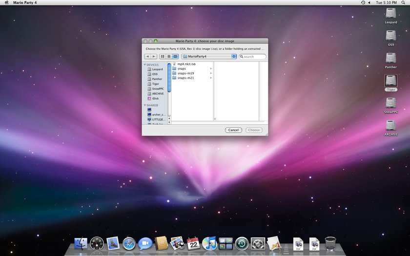
3. **Application Support** made from nothing: `config`, `MarioParty4.log`,
   `.metadata_never_index`, and `memcard-slot-a.raw (new, formatted, 59
   free blocks)`; **fullscreen**, letterboxed: `1680x1050, the picture at
   1400x1050 from (140,0)`.
4. **The opening movie, with its sound**, whole: `2390 of 2390 frames
   published, 2310 drawn, 80 dropped … 0 errors … 28.98 frames a second
   presented over 79.7 s; 0 audio periods short`, `the output device ran
   dry 0 time(s)`.

   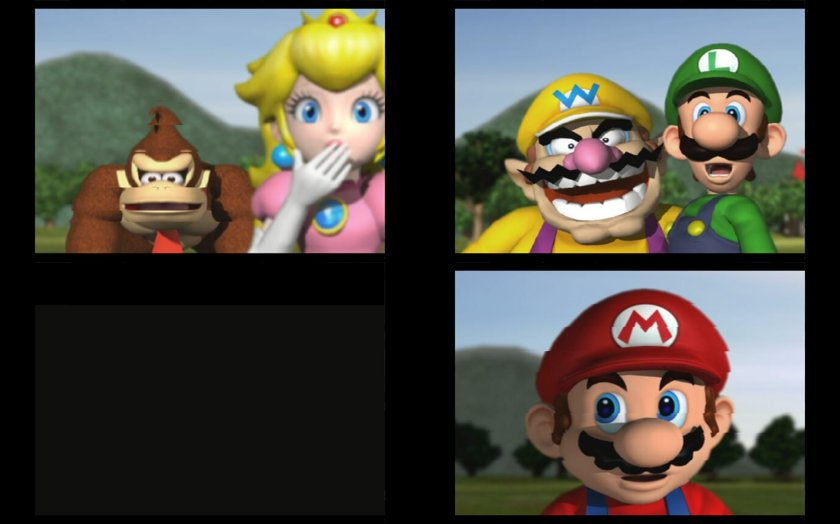
5. **The title** — which, left alone, goes back to the opening (the
   console's attract loop; START skips it, as the Read Me says):

   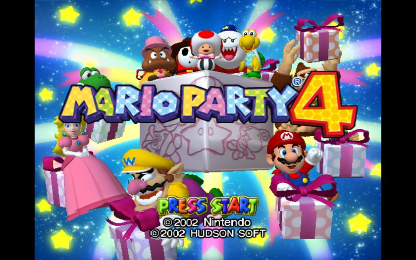
6. **Start (Return) → SELECT A FILE → slot A → File 1** (A = the Z key),
   the new-file scene, and the mode select with its two movies — `s00`
   113 frames, 105 drawn, **28.60** a second; `c00` 216, 167 drawn,
   **23.41**; both `ran dry 0`:

   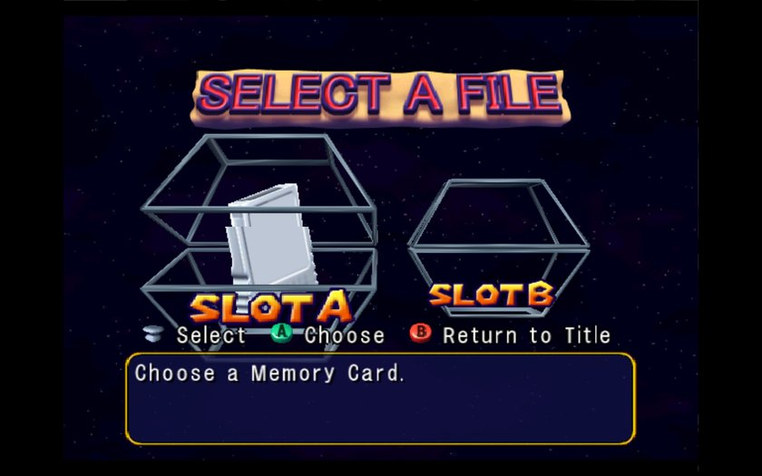
   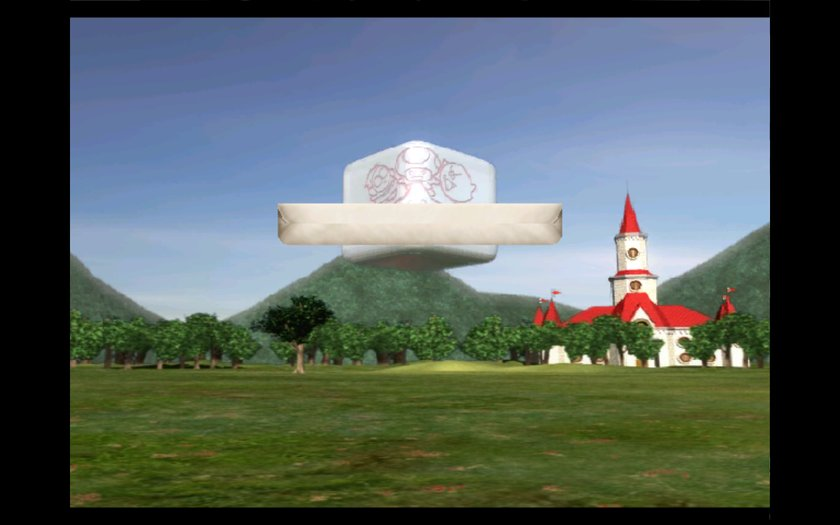
7. **Party Mode**: one human (the keyboard beside the Xbox One pad,
   `PADInit: controller 1 = Xbox One controller … the keyboard works
   beside controller 1`, rumble available) and three computer players;
   the character select, Toad's Midway Madness's settings:

   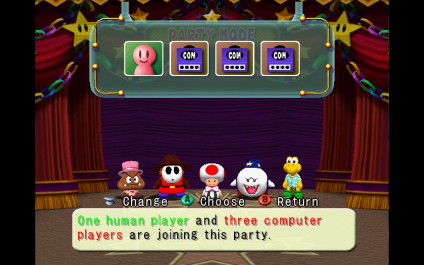
   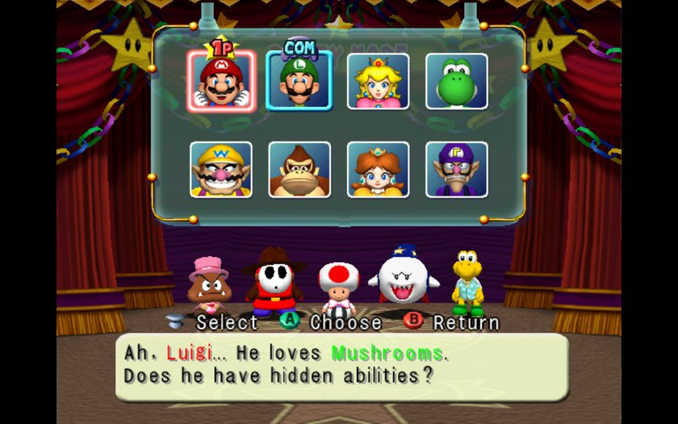
   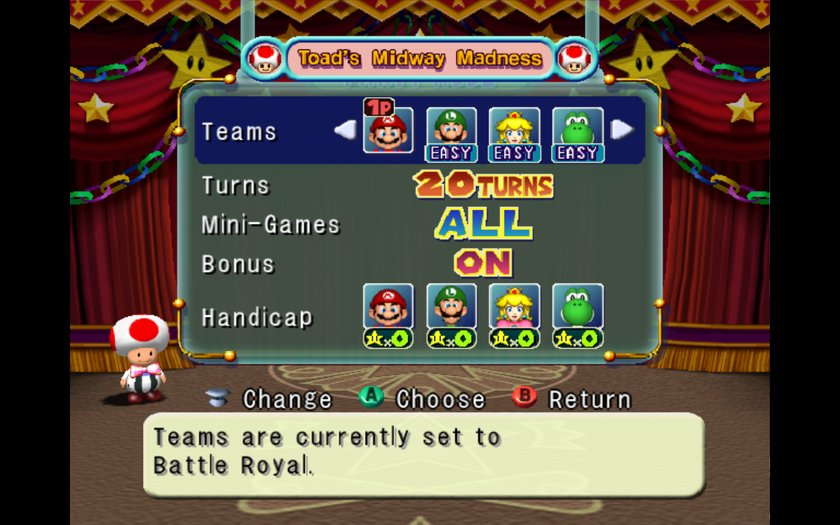
8. **The board**, two turns (A to roll), **two minigames** — Booksquirm,
   then Makin' Waves (the pool's flat tint: the known ripple) — and
   **the results**:

   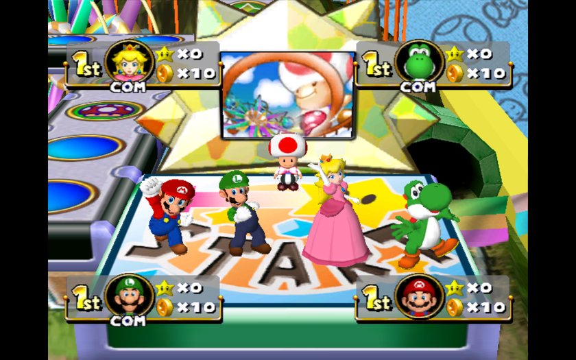
   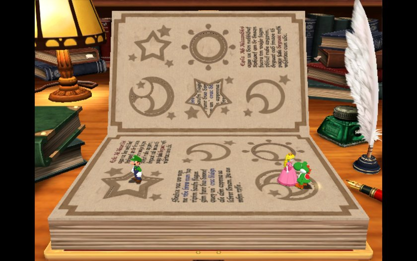
   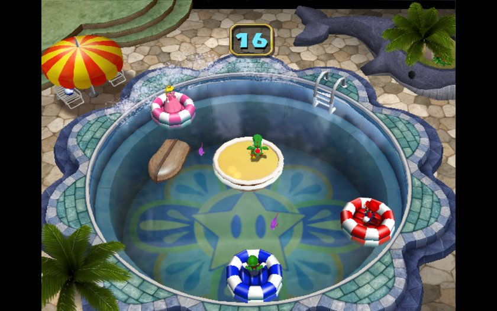
   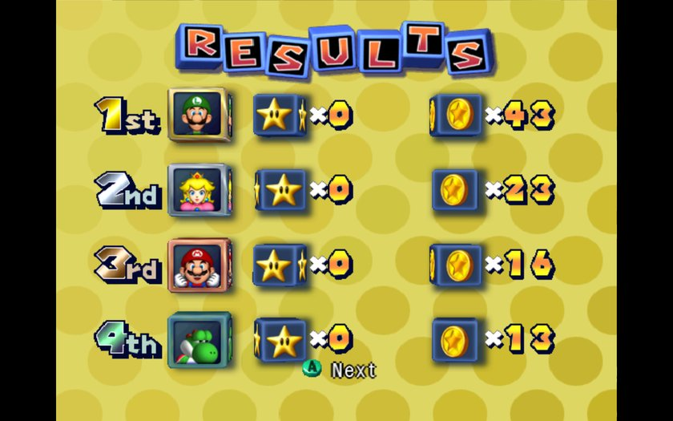
9. **Cmd-Q** (System Events' ⌘Q): `reset requested: handing it to the
   game's own reset path` → `OSResetSystem: … quitting cleanly`; `CARD: 0
   reads, 2 writes, 1 files created … 6 image flushes, 57 of 59 blocks
   free`, the writer joined (`flushes on a thread: 69 ms on the game thread
   in all`); `DVD: … 0 over 100 ms`; 4 movies, 3,395 frames drawn, 170
   dropped; **0 `*** port` lines**; 89 underruns over the 23 minutes
   (1.3 s — the boot's and the loads', §53.5). The last line, `xone: …
   read failed (e00002eb), controller gone`, is the pad's pipe closing at
   exit, as in M32's walk.

**One thing the walk found in the Read Me, not the game:** Leopard's
`open` has no `--args` (10.6 added it; `open -h` on the G4), so the
Read Me's three `open -a "Mario Party 4" --args …` lines could not work on
the reference machine's own system. They name the executable inside the
bundle now (54.6).

**Verdict: the app as a player meets it works on 0.9.8** — the check, the
chooser, the first run's folder and card, fullscreen, the opening with
its sound, the title, the file, the mode select's movies, a party board,
two minigames, the results and a clean quit with the card written.
